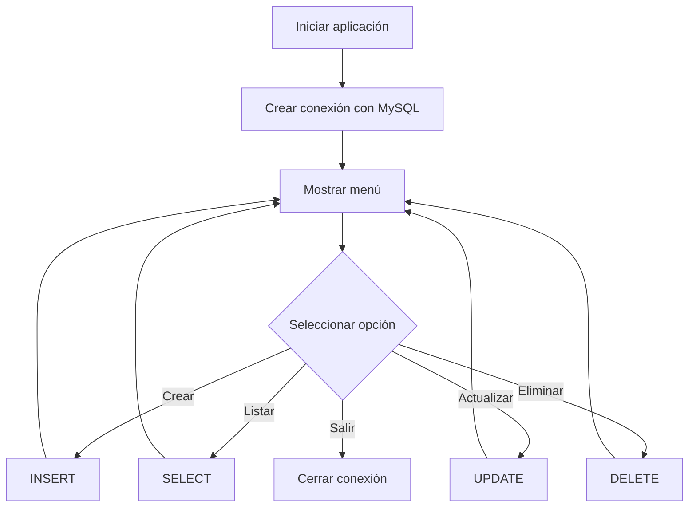
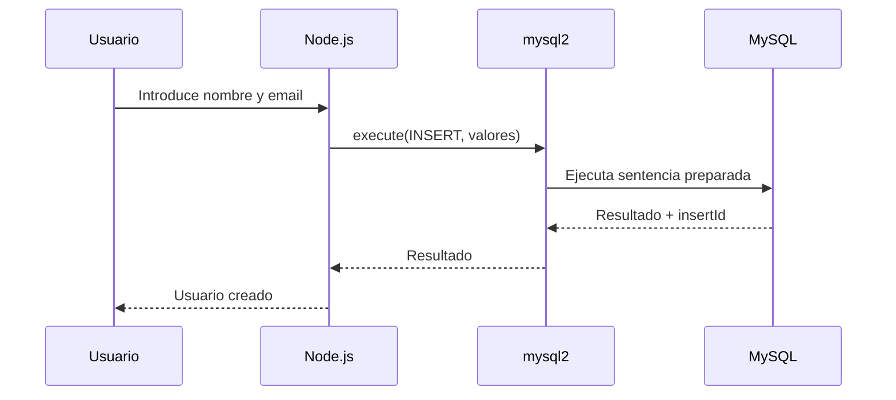

# Persistencia de Datos en Bases de Datos Relacionales con MySQL y Node.js

## Introducción

La **persistencia de datos** consiste en almacenar información de manera que permanezca disponible después de que una aplicación termine su ejecución.

En una aplicación Node.js, una base de datos relacional permite almacenar información estructurada en tablas y realizar operaciones como:

* Crear registros.
* Consultar registros.
* Actualizar registros.
* Eliminar registros.

En este ejemplo se utiliza MySQL como sistema gestor de bases de datos y Node.js como entorno de ejecución. La comunicación entre Node.js y MySQL se realiza mediante `mysql2`.

La aplicación implementa un CRUD de usuarios mediante una interfaz de consola.

---

# 1. Conceptos principales

## 1.1 ¿Qué es la persistencia de datos?

La **persistencia de datos** es el proceso mediante el cual la información se almacena de forma que pueda recuperarse posteriormente.

Por ejemplo, cuando un usuario se registra en una aplicación, sus datos pueden almacenarse en una tabla:

```text
Aplicación Node.js
       ↓
     mysql2
       ↓
Servidor MySQL
       ↓
Base de datos
       ↓
Tabla users
       ↓
Registro del usuario
```

Sin persistencia, los datos almacenados únicamente en memoria se perderían cuando terminara el proceso de Node.js.

---

## 1.2 ¿Qué es una base de datos relacional?

Una **base de datos relacional** organiza la información principalmente mediante **tablas relacionadas entre sí**.

Una tabla está formada por:

* **Columnas:** representan atributos.
* **Filas:** representan registros.
* **Clave primaria:** identifica de forma única un registro.
* **Restricciones:** ayudan a garantizar la integridad de los datos.

En este proyecto existe una tabla:

```text
users
├── id
├── name
├── email
└── active
```

---

# 2. `mysql2` para Node.js

`mysql2` es un **controlador de Node.js para comunicarse con servidores MySQL**. No es una base de datos ni una librería que almacene los datos por sí misma.

Su función es actuar como intermediario:

```text
Node.js
   ↓
mysql2
   ↓
MySQL Server
   ↓
Base de datos
```

La documentación oficial de `mysql2` lo describe como un reemplazo compatible con la API de `mysql` en muchos casos y señala características adicionales como prepared statements, Promise API, pooling, SSL y soporte de tipos de MariaDB. ([Sidorares][1])

### Corrección terminológica

El apunte original indica:

> "Mysql es una librería (o controlador) para Node.js..."

La idea es correcta, pero es más preciso decir:

> **`mysql2` es un controlador (driver) de Node.js para conectarse y comunicarse con servidores MySQL.**

---

# 3. Características principales de `mysql2`

## 3.1 Soporte de Promises

`mysql2` proporciona una API basada en Promises mediante:

```javascript
import { createConnection } from 'mysql2/promise';
```

Esto permite utilizar:

```javascript
async
await
try...catch
```

Por ejemplo:

```javascript
const connection = await createConnection({
    host: 'localhost',
    user: 'usuario',
    password: 'contraseña',
    database: 'campus'
});
```

La API oficial de `mysql2` proporciona `createConnection()` mediante la interfaz basada en Promises. ([Sidorares][2])

---

## 3.2 Prepared Statements

Los **prepared statements** permiten separar la estructura de una consulta SQL de los valores que se proporcionan.

Ejemplo:

```javascript
const query = 'INSERT INTO users (name, email) VALUES (?, ?)';

await dbConnection.execute(query, [
    name,
    email
]);
```

Los `?` funcionan como **placeholders** para los valores.

`mysql2` proporciona `execute()` para preparar y ejecutar una sentencia. Además, puede reutilizar sentencias preparadas mediante una caché LRU en ejecuciones posteriores. ([Sidorares][3])

### ¿Por qué son importantes?

Además de facilitar el envío de parámetros, los prepared statements ayudan a evitar construir SQL concatenando directamente valores proporcionados por el usuario.

No debe hacerse:

```javascript
const query = `SELECT * FROM users WHERE name = '${name}'`;
```

Es preferible:

```javascript
const query = 'SELECT * FROM users WHERE name = ?';

const [rows] = await dbConnection.execute(query, [name]);
```

> [!IMPORTANT]
> Los valores dinámicos deben enviarse como parámetros cuando la API lo permita. No deben interpolarse directamente dentro de la consulta SQL.

---

## 3.3 Pools de conexiones

`mysql2` también proporciona **connection pools**, que permiten administrar varias conexiones y reutilizarlas entre operaciones. Esto resulta especialmente útil en aplicaciones que atienden múltiples solicitudes simultáneas. ([Sidorares][4])

El proyecto actual utiliza:

```javascript
createConnection()
```

por lo que trabaja con **una conexión individual**, no con un pool.

Un pool sería más apropiado para una aplicación web con múltiples operaciones concurrentes.

---

# 4. Arquitectura del proyecto

La estructura proporcionada es:

```text
PERSISTENCIA/
├── utils/
│   ├── app.js
│   ├── menu.js
│   └── user.js
└── package.json
```

El esquema SQL se maneja mediante:

```text
schema.sql
```

Una estructura más clara del proyecto completo sería:

```text
PERSISTENCIA/
├── schema.sql
├── package.json
└── utils/
    ├── app.js
    ├── menu.js
    └── user.js
```

## Crear la estructura del proyecto

Desde la terminal, primero crea la carpeta principal y entra en ella:

```bash
mkdir PERSISTENCIA
cd PERSISTENCIA
```

### Crear la carpeta `utils`

```bash
mkdir utils
```

### Crear los archivos

En **Linux/macOS/Git Bash**:

```bash
touch schema.sql
touch package.json
touch utils/app.js
touch utils/menu.js
touch utils/user.js
```

Al finalizar, la estructura será:

```text
PERSISTENCIA/
├── schema.sql
├── package.json
└── utils/
    ├── app.js
    ├── menu.js
    └── user.js
```

> [!NOTE]
> `touch` crea archivos vacíos. Después puedes abrir la carpeta `PERSISTENCIA` en tu editor y colocar el código correspondiente en cada archivo.

## Responsabilidad de cada archivo

| Archivo        | Responsabilidad                           |
| -------------- | ----------------------------------------- |
| `schema.sql`   | Crear la base de datos y la tabla         |
| `app.js`       | Iniciar la aplicación y controlar el menú |
| `menu.js`      | Mostrar encabezados y opciones            |
| `user.js`      | Ejecutar las operaciones CRUD             |
| `package.json` | Configurar el proyecto y sus dependencias |

La separación permite evitar colocar toda la lógica de la aplicación en un único archivo.

---

# 5. Modelo de datos en MySQL

## 5.1 Esquema original

El esquema proporcionado es:

```sql
CREATE DATABASE IF NOT EXISTS campus;

USE campus;

CREATE TABLE users(
    id INT AUTO_INCREMENT PRIMARY KEY,
    name VARCHAR(100) NOT NULL,
    email VARCHAR(100) NOT NULL,
    active TINYINT NOT NULL CHECK(active >= 0 AND active <= 1)
) ENGINE=InnoDB;
```

La estructura utiliza:

* `id` como clave primaria.
* `AUTO_INCREMENT` para generar identificadores.
* `VARCHAR` para texto.
* `NOT NULL` para impedir valores `NULL`.
* `TINYINT` para almacenar el estado activo.
* `CHECK` para restringir el valor de `active`.
* `InnoDB` como motor de almacenamiento.

MySQL admite `AUTO_INCREMENT`, claves primarias y restricciones `CHECK` en `CREATE TABLE`. `InnoDB` es además el motor de almacenamiento predeterminado para nuevas tablas en MySQL. ([MySQL][5])

---

# 6. Corrección importante del esquema

Existe un problema entre el esquema y el código JavaScript.

La columna:

```sql
active TINYINT NOT NULL CHECK(active >= 0 AND active <= 1)
```

es `NOT NULL`, pero no tiene un valor `DEFAULT`.

Sin embargo, `createUser()` realiza:

```sql
INSERT INTO users (name, email) VALUES (?, ?)
```

No proporciona ningún valor para `active`.

Por lo tanto, el `INSERT` puede fallar porque se intenta crear un registro sin proporcionar un valor para una columna `NOT NULL` que no tiene valor predeterminado.

> [!WARNING]
> **Corrección técnica:** el esquema y el `INSERT` deben ser coherentes. Si `active` debe comenzar automáticamente como activo, conviene definir `DEFAULT 1`.

## Esquema corregido

```sql
CREATE DATABASE IF NOT EXISTS campus;

USE campus;

CREATE TABLE users(
    id INT AUTO_INCREMENT PRIMARY KEY,
    name VARCHAR(100) NOT NULL,
    email VARCHAR(100) NOT NULL,
    active TINYINT NOT NULL DEFAULT 1
        CHECK(active >= 0 AND active <= 1)
) ENGINE=InnoDB;
```

De esta forma:

```sql
INSERT INTO users (name, email)
VALUES ('Carlos', 'carlos@example.com');
```

puede utilizar automáticamente:

```text
active = 1
```

La restricción `CHECK` es aplicada por MySQL cuando está definida como `ENFORCED`, que es el comportamiento predeterminado. ([MySQL][6])

---

# 7. `AUTO_INCREMENT`

La columna:

```sql
id INT AUTO_INCREMENT PRIMARY KEY
```

combina dos conceptos.

### `PRIMARY KEY`

Identifica de forma única cada fila.

### `AUTO_INCREMENT`

Permite que MySQL genere automáticamente el valor del identificador al insertar un nuevo registro.

Por ejemplo:

```text
id | name
---|------
1  | Ana
2  | Luis
3  | Carlos
```

No es necesario proporcionar manualmente el `id` en el `INSERT`.

MySQL utiliza `AUTO_INCREMENT` para generar identificadores automáticamente y, en el uso habitual, la secuencia comienza en `1`. ([MySQL][5])

---

# 8. `TINYINT` utilizado como booleano

En este proyecto:

```sql
active TINYINT
```

representa conceptualmente un valor booleano:

```text
1 → activo
0 → inactivo
```

Pero `TINYINT` sigue siendo un **tipo numérico de MySQL**, no un `boolean` de JavaScript.

Por eso el código convierte manualmente el resultado:

```javascript
active: user.active === 1 ? true : false
```

El resultado en JavaScript será:

```javascript
{
    id: 1,
    name: 'Carlos',
    email: 'carlos@example.com',
    active: true
}
```

---

# 9. Flujo general de la aplicación



La aplicación funciona como una interfaz CRUD sobre la tabla `users`.

---

# 10. CRUD

**CRUD** es el acrónimo de las cuatro operaciones fundamentales sobre datos:

| Operación | SQL      | Función             |
| --------- | -------- | ------------------- |
| Create    | `INSERT` | Crear registros     |
| Read      | `SELECT` | Consultar registros |
| Update    | `UPDATE` | Modificar registros |
| Delete    | `DELETE` | Eliminar registros  |

En este proyecto:

```text
createUser() → INSERT
getUsers()   → SELECT
updateUser() → UPDATE
deleteUser() → DELETE
```

---

# 11. Código completo de `app.js`

La responsabilidad de `app.js` es:

1. Crear la interfaz de consola.
2. Crear la conexión con MySQL.
3. Mostrar el menú.
4. Seleccionar la operación CRUD.
5. Cerrar los recursos al salir.

## Código corregido

```javascript
// ============================================================
// IMPORTAR DEPENDENCIAS
// ============================================================

import { createConnection } from 'mysql2/promise';
import { createInterface } from 'readline/promises';

// ============================================================
// IMPORTAR FUNCIONES DEL MENÚ
// ============================================================

import { menu } from './menu.js';

// ============================================================
// IMPORTAR OPERACIONES CRUD
// ============================================================

import {
    createUser,
    getUsers,
    updateUser,
    deleteUser
} from './user.js';

// ============================================================
// CREAR INTERFAZ DE CONSOLA
// ============================================================

const rl = createInterface({
    input: process.stdin,
    output: process.stdout
});

// ============================================================
// CONEXIÓN CON LA BASE DE DATOS
// ============================================================

let dbConnection;

// ============================================================
// OPCIONES DEL MENÚ
// ============================================================

const options = [
    'Crear usuarios',
    'Listar usuarios',
    'Actualizar usuarios',
    'Eliminar usuario'
];

// ============================================================
// CONECTAR CON MYSQL
// ============================================================

const main = async () => {
    try {
        dbConnection = await createConnection({
            host: 'localhost',
            user: 'campus2023',
            password: 'campus2023',
            database: 'campus'
        });

        console.log(
            'Conectado exitosamente a la base de datos campus en MySQL.\n'
        );

        await showMenu();

    } catch (err) {
        console.log(
            'Error al conectarse a la base de datos o al iniciar la app.',
            err
        );

        rl.close();
    }
};

// ============================================================
// MENÚ PRINCIPAL
// ============================================================

async function showMenu() {
    while (true) {
        const op = await menu(
            'SISTEMA CRUD - USUARIOS',
            options,
            rl
        );

        switch (op) {
            case '1':
                await createUser(rl, dbConnection);
                break;

            case '2':
                await getUsers(rl, dbConnection);
                break;

            case '3':
                await updateUser(rl, dbConnection);
                break;

            case '4':
                await deleteUser(rl, dbConnection);
                break;

            case '0':
                await dbConnection.end();
                rl.close();
                return;

            default:
                console.log(
                    '\nOpción inválida. Intente de nuevo.\n'
                );

                await rl.question(
                    'Presione enter para continuar..... '
                );
        }
    }
}

// ============================================================
// INICIAR APLICACIÓN
// ============================================================

main();
```

---

# 12. Corrección del menú original

El código original tenía:

```javascript
const options = [
    'Crear usuarios',
    'Listar usuarios',
    'Actualizar usuarios',
    'Eliminar usuario',
    'Salir'
];
```

Pero `menu()` ya agrega:

```javascript
console.log(`0. Salir`);
```

Por lo tanto, el menú original terminaba mostrando conceptualmente:

```text
1. Crear usuarios
2. Listar usuarios
3. Actualizar usuarios
4. Eliminar usuario
5. Salir
0. Salir
```

Además, `showMenu()` solamente contempla:

```javascript
case '1'
case '2'
case '3'
case '4'
case '0'
```

No existe:

```javascript
case '5'
```

> [!WARNING]
> **Corrección técnica:** `Salir` no debe formar parte del arreglo `options` si la función `menu()` ya agrega la opción `0. Salir`.

Por eso el arreglo corregido es:

```javascript
const options = [
    'Crear usuarios',
    'Listar usuarios',
    'Actualizar usuarios',
    'Eliminar usuario'
];
```

---

# 13. `createConnection()`

La conexión se crea mediante:

```javascript
dbConnection = await createConnection({
    host: 'localhost',
    user: 'campus2023',
    password: 'campus2023',
    database: 'campus'
});
```

Los principales parámetros son:

| Propiedad  | Función                                 |
| ---------- | --------------------------------------- |
| `host`     | Dirección del servidor MySQL            |
| `user`     | Usuario de MySQL                        |
| `password` | Contraseña del usuario                  |
| `database` | Base de datos que utilizará la conexión |

`createConnection()` crea una conexión individual con el servidor MySQL. ([Sidorares][2])

---

# 14. `async` y `await`

La conexión es una operación asíncrona:

```javascript
dbConnection = await createConnection({...});
```

`await` permite esperar el resultado de la Promise antes de continuar.

El flujo es:

```text
createConnection()
        ↓
     Promise
        ↓
      await
        ↓
Conexión disponible
        ↓
   showMenu()
```

El uso de `try...catch` permite manejar errores producidos durante la conexión:

```javascript
try {
    dbConnection = await createConnection({...});
} catch (err) {
    console.log(err);
}
```

---

# 15. Código completo de `user.js`

Este archivo contiene las cuatro operaciones CRUD.

```javascript
// ============================================================
// IMPORTAR ENCABEZADOS
// ============================================================

import { headers } from './menu.js';

// ============================================================
// CREAR USUARIO
// ============================================================

async function createUser(rl, dbConnection) {
    headers(
        'SISTEMA CRUD - USUARIOS',
        'CREANDO USUARIOS'
    );

    const name = await rl.question('Nombre: ');
    const email = await rl.question('Correo electrónico: ');

    const query =
        'INSERT INTO users (name, email) VALUES (?, ?)';

    const [result] = await dbConnection.execute(
        query,
        [name, email]
    );

    console.log(
        `Usuario creado con éxito (ID: ${result.insertId})\n`
    );

    await rl.question(
        'Presione enter para continuar..... '
    );
}

// ============================================================
// LISTAR USUARIOS
// ============================================================

async function getUsers(rl, dbConnection) {
    headers(
        'SISTEMA CRUD - USUARIOS',
        'LISTANDO USUARIOS'
    );

    let [results] = await dbConnection.query(
        'SELECT * FROM users;'
    );

    results = results.map(user => {
        return {
            ...user,
            active: user.active === 1
        };
    });

    if (results.length === 0) {
        console.log(
            '\nNo se encontraron usuarios registrados'
        );
    } else {
        console.table(results);
    }

    await rl.question(
        'Presione enter para continuar..... '
    );
}

// ============================================================
// ACTUALIZAR USUARIO
// ============================================================

async function updateUser(rl, dbConnection) {
    headers(
        'SISTEMA CRUD - USUARIOS',
        'ACTUALIZANDO USUARIOS'
    );

    const userId = await rl.question(
        'Id del usuario a actualizar: '
    );

    const [results] = await dbConnection.execute(
        'SELECT * FROM users WHERE id = ?',
        [userId]
    );

    if (results.length === 0) {
        console.log(
            '\nNo se encontraron usuarios registrados'
        );
    } else {
        console.log(
            `Editando el usuario: ${results[0].name}`
        );

        const name = await rl.question(
            `Nuevo nombre [${results[0].name}]: `
        ) || results[0].name;

        const email = await rl.question(
            `Nuevo email [${results[0].email}]: `
        ) || results[0].email;

        const query =
            'UPDATE users SET name = ?, email = ? WHERE id = ?';

        const [upResult] = await dbConnection.execute(
            query,
            [name, email, userId]
        );

        if (upResult.changedRows > 0) {
            console.log(
                '\nUsuario actualizado con éxito.'
            );
        } else {
            console.log(
                '\nUsuario no actualizado'
            );
        }
    }

    await rl.question(
        'Presione enter para continuar..... '
    );
}

// ============================================================
// ELIMINAR USUARIO
// ============================================================

async function deleteUser(rl, dbConnection) {
    headers(
        'SISTEMA CRUD - USUARIOS',
        'ELIMINANDO USUARIO'
    );

    const userId = await rl.question(
        'Id del usuario a eliminar: '
    );

    const confirm = await rl.question(
        `---> Realmente desea eliminar el usuario con el id: ${userId} (s/n): `
    );

    if (confirm.toLowerCase() === 's') {
        const [result] = await dbConnection.execute(
            'DELETE FROM users WHERE id = ?',
            [userId]
        );

        if (result.affectedRows === 0) {
            console.log(
                `No se eliminó el usuario con el id: ${userId}`
            );
        } else {
            console.log(
                '\nEl usuario se eliminó exitosamente.\n'
            );
        }
    }

    await rl.question(
        'Presione enter para continuar..... '
    );
}

// ============================================================
// EXPORTAR FUNCIONES
// ============================================================

export {
    createUser,
    getUsers,
    updateUser,
    deleteUser
};
```

---

# 16. Operación `CREATE` — `INSERT`

La función:

```javascript
createUser()
```

realiza la operación `INSERT`.

La parte principal es:

```javascript
const query =
    'INSERT INTO users (name, email) VALUES (?, ?)';

const [result] = await dbConnection.execute(
    query,
    [name, email]
);
```

El flujo es:

```text
Usuario introduce nombre
        ↓
Usuario introduce email
        ↓
Se construye la sentencia SQL
        ↓
Los valores se envían mediante placeholders
        ↓
MySQL ejecuta INSERT
        ↓
Se crea el registro
        ↓
MySQL devuelve información del resultado
```

`execute(sql, values)` acepta la consulta y un arreglo de valores para los placeholders. ([Sidorares][7])

---

# 17. `insertId`

Después de insertar:

```javascript
result.insertId
```

permite obtener el identificador generado para el nuevo registro.

Por ejemplo:

```javascript
console.log(
    `Usuario creado con éxito (ID: ${result.insertId})`
);
```

Si MySQL genera:

```text
id = 15
```

el resultado puede mostrar:

```text
Usuario creado con éxito (ID: 15)
```

---

# 18. Operación `READ` — `SELECT`

La función:

```javascript
getUsers()
```

utiliza:

```javascript
let [results] = await dbConnection.query(
    'SELECT * FROM users;'
);
```

Aquí se utiliza `query()` en lugar de `execute()`.

`query()` es apropiado para una consulta cuyo SQL no contiene valores proporcionados dinámicamente por el usuario.

El resultado contiene las filas devueltas por MySQL. La API de `mysql2` documenta que `execute()` devuelve las filas y metadatos cuando se utiliza con un `SELECT`. ([Sidorares][8])

---

# 19. Transformación de `active`

El código original realiza:

```javascript
results = results.map(user => {
    return {
        ...user,
        active: user.active === 1
    };
});
```

La operación transforma:

```javascript
{
    id: 1,
    name: 'Carlos',
    email: 'carlos@example.com',
    active: 1
}
```

en:

```javascript
{
    id: 1,
    name: 'Carlos',
    email: 'carlos@example.com',
    active: true
}
```

Esto permite que la aplicación maneje `active` como un booleano de JavaScript aunque MySQL lo almacene como `TINYINT`.

---

# 20. Operación `UPDATE`

La función:

```javascript
updateUser()
```

primero busca el usuario:

```javascript
const [results] = await dbConnection.execute(
    'SELECT * FROM users WHERE id = ?',
    [userId]
);
```

Después obtiene los nuevos valores:

```javascript
const name = await rl.question(
    `Nuevo nombre [${results[0].name}]: `
) || results[0].name;
```

Si el usuario presiona Enter sin introducir un valor, se conserva el nombre anterior.

Finalmente:

```javascript
const query =
    'UPDATE users SET name = ?, email = ? WHERE id = ?';

const [upResult] = await dbConnection.execute(
    query,
    [name, email, userId]
);
```

El flujo es:

```text
Buscar usuario
      ↓
¿Existe?
 ┌────┴────┐
No        Sí
↓          ↓
Mostrar   Pedir nuevos datos
error        ↓
           UPDATE
              ↓
       Mostrar resultado
```

---

# 21. `changedRows`

Después del `UPDATE`, el código comprueba:

```javascript
if (upResult.changedRows > 0)
```

Esto permite distinguir si alguna fila cambió efectivamente.

Por ejemplo, si el usuario tenía:

```text
Carlos
```

y vuelve a introducir:

```text
Carlos
```

puede que la operación no produzca cambios efectivos aunque el registro exista.

---

# 22. Operación `DELETE`

La función:

```javascript
deleteUser()
```

primero solicita el identificador:

```javascript
const userId = await rl.question(
    'Id del usuario a eliminar: '
);
```

Después solicita confirmación:

```javascript
const confirm = await rl.question(
    `---> Realmente desea eliminar el usuario con el id: ${userId} (s/n): `
);
```

Solo continúa cuando:

```javascript
confirm.toLowerCase() === 's'
```

Finalmente ejecuta:

```javascript
const [result] = await dbConnection.execute(
    'DELETE FROM users WHERE id = ?',
    [userId]
);
```

---

# 23. `affectedRows`

Después de `DELETE` se utiliza:

```javascript
result.affectedRows
```

Si:

```javascript
result.affectedRows === 0
```

significa que la operación no afectó ninguna fila.

Si es mayor que `0`, se eliminó al menos un registro.

---

# 24. `execute()` frente a `query()`

En el proyecto aparecen ambos métodos.

| Método      | Uso en el proyecto                               | Parámetros                    |
| ----------- | ------------------------------------------------ | ----------------------------- |
| `query()`   | `SELECT * FROM users`                            | No requiere valores dinámicos |
| `execute()` | `INSERT`, `UPDATE`, `DELETE` y `SELECT` por `id` | Utiliza placeholders          |

Ejemplo con `execute()`:

```javascript
const [results] = await dbConnection.execute(
    'SELECT * FROM users WHERE id = ?',
    [userId]
);
```

Ejemplo con `query()`:

```javascript
const [results] = await dbConnection.query(
    'SELECT * FROM users'
);
```

No debe interpretarse como que `execute()` solo sirve para `INSERT`, `UPDATE` o `DELETE`. También puede utilizarse para `SELECT` cuando se necesitan parámetros. ([Sidorares][8])

---

# 25. Código completo de `menu.js`

```javascript
// ============================================================
// MOSTRAR ENCABEZADOS
// ============================================================

function headers(name, subtitle) {
    console.clear();

    console.log('=================================================');
    console.log(`                 ${name}                     `);
    console.log('=================================================');
    console.log(`----              ${subtitle}              ----`);
}

// ============================================================
// MOSTRAR MENÚ
// ============================================================

async function menu(name, options, rl) {
    headers(name, undefined);

    options.forEach((option, i) => {
        console.log(`${i + 1}. ${option}`);
    });

    console.log('0. Salir');

    return await rl.question(
        '-> Elija una opción: '
    );
}

// ============================================================
// EXPORTAR FUNCIONES
// ============================================================

export {
    headers,
    menu
};
```

---

# 26. Función `headers()`

La función:

```javascript
function headers(name, subtitle) {
    console.clear();

    console.log('=================================================');
    console.log(`                 ${name}                     `);
    console.log('=================================================');
    console.log(`----              ${subtitle}              ----`);
}
```

centraliza la presentación visual de las diferentes secciones.

En lugar de repetir los mismos `console.log()` en cada operación CRUD, se reutiliza:

```javascript
headers(
    'SISTEMA CRUD - USUARIOS',
    'CREANDO USUARIOS'
);
```

Esto reduce duplicación de código.

---

# 27. Función `menu()`

La función:

```javascript
async function menu(name, options, rl)
```

recibe:

* `name`: nombre del menú.
* `options`: opciones disponibles.
* `rl`: interfaz de lectura de la consola.

Después recorre las opciones:

```javascript
options.forEach((option, i) => {
    console.log(`${i + 1}. ${option}`);
});
```

El índice:

```javascript
i
```

comienza en `0`, por lo que:

```javascript
i + 1
```

hace que las opciones visibles comiencen en `1`.

Finalmente agrega:

```javascript
console.log('0. Salir');
```

---

# 28. `package.json`

El proyecto utiliza:

```json
{
    "name": "persistencia",
    "version": "1.0.0",
    "description": "proyecto ejemplo para persistencia de datos con mysql y nodeJS",
    "keywords": [
        "Mysql",
        "nodeJS",
        "APP"
    ],
    "license": "ISC",
    "author": "Velasco-c",
    "type": "module",
    "main": "app.js",
    "scripts": {
        "test": "echo \"Error: no test specified\" && exit 1"
    },
    "dependencies": {
        "mysql2": "^3.24.4"
    }
}
```

---

# 29. `"type": "module"`

Esta propiedad:

```json
"type": "module"
```

permite utilizar la sintaxis de módulos ES:

```javascript
import ...
```

y:

```javascript
export ...
```

Por eso el proyecto puede utilizar:

```javascript
import { menu } from './menu.js';
```

en lugar de:

```javascript
const { menu } = require('./menu.js');
```

---

# 30. Dependencia `mysql2`

La dependencia:

```json
"dependencies": {
    "mysql2": "^3.24.4"
}
```

indica que el proyecto necesita `mysql2` para comunicarse con MySQL.

La instalación normalmente se realiza mediante:

```bash
npm install mysql2
```

Después puede utilizarse:

```javascript
import { createConnection } from 'mysql2/promise';
```

---

# 31. Flujo completo de una operación CRUD

Por ejemplo, al crear un usuario:



La aplicación no se comunica directamente con las tablas. `mysql2` proporciona la capa de comunicación entre Node.js y el servidor MySQL.

---

# 32. Manejo de errores

La conexión inicial utiliza:

```javascript
try {
    dbConnection = await createConnection({...});
} catch (err) {
    console.log(
        'Error al conectarse a la base de datos o al iniciar la app.',
        err
    );
}
```

Esto permite manejar problemas como:

* Servidor MySQL detenido.
* Credenciales incorrectas.
* Base de datos inexistente.
* Problemas de conexión.
* Configuración incorrecta.

Sin embargo, las funciones CRUD no tienen actualmente su propio `try...catch`.

En una aplicación más robusta, cada operación podría manejar explícitamente los errores de la base de datos o centralizar su tratamiento en una capa superior.

---

# 33. Cierre de la conexión

El código original utiliza:

```javascript
dbConnection.end();
rl.close();
```

Es preferible esperar explícitamente el cierre de la conexión cuando se utiliza la API basada en Promises:

```javascript
await dbConnection.end();
rl.close();
```

La documentación de `mysql2` muestra `connection.end()` como mecanismo para cerrar una conexión. ([Sidorares][2])

---

# 34. Credenciales de conexión

El proyecto contiene:

```javascript
user: 'campus2023',
password: 'campus2023'
```

Esto funciona para un ejercicio local, pero no es una buena práctica para una aplicación real.

Las credenciales normalmente deberían gestionarse mediante variables de entorno:

```text
DB_HOST
DB_USER
DB_PASSWORD
DB_NAME
```

Por ejemplo:

```javascript
const connection = await createConnection({
    host: process.env.DB_HOST,
    user: process.env.DB_USER,
    password: process.env.DB_PASSWORD,
    database: process.env.DB_NAME
});
```

> [!WARNING]
> Las credenciales no deberían quedar escritas directamente en el código fuente de una aplicación que vaya a desplegarse o compartirse.

---

# 35. `createConnection()` frente a un pool

El proyecto actual utiliza:

```javascript
createConnection()
```

Esto crea una conexión individual.

Para una aplicación con muchas solicitudes simultáneas, `mysql2` también permite:

```javascript
createPool()
```

Ejemplo conceptual:

```javascript
import mysql from 'mysql2/promise';

const pool = mysql.createPool({
    host: 'localhost',
    user: 'usuario',
    password: 'contraseña',
    database: 'campus'
});
```

El pool administra múltiples conexiones y permite reutilizarlas. La documentación oficial recomienda liberar las conexiones obtenidas del pool y cerrar el pool cuando ya no sea necesario. ([Sidorares][4])

---

# 36. Modelo conceptual de la aplicación

La arquitectura simplificada puede entenderse así:

```text
┌───────────────────────┐
│       Usuario         │
└───────────┬───────────┘
            │
            ▼
┌───────────────────────┐
│       menu.js         │
│ Interfaz de consola   │
└───────────┬───────────┘
            │
            ▼
┌───────────────────────┐
│        app.js         │
│ Control de aplicación │
└───────────┬───────────┘
            │
            ▼
┌───────────────────────┐
│        user.js        │
│       CRUD            │
└───────────┬───────────┘
            │
            ▼
┌───────────────────────┐
│        mysql2         │
│ Controlador Node.js   │
└───────────┬───────────┘
            │
            ▼
┌───────────────────────┐
│        MySQL          │
│   Base de datos       │
└───────────────────────┘
```

Cada componente tiene una responsabilidad diferente:

| Componente | Responsabilidad             |
| ---------- | --------------------------- |
| Usuario    | Introducir información      |
| `menu.js`  | Interfaz de consola         |
| `app.js`   | Control del flujo principal |
| `user.js`  | Operaciones CRUD            |
| `mysql2`   | Comunicación con MySQL      |
| MySQL      | Persistencia de los datos   |

---

# 37. Casos de uso

## Usar `mysql2`

Es apropiado cuando una aplicación Node.js necesita:

* Conectarse con MySQL.
* Ejecutar consultas SQL.
* Utilizar Promises.
* Utilizar `async/await`.
* Trabajar con prepared statements.
* Administrar pools de conexiones.
* Comunicarse con servidores MySQL.

## Usar una conexión individual

Puede ser suficiente para:

* Ejercicios.
* Scripts.
* Herramientas pequeñas.
* Aplicaciones de consola.
* Programas con pocas operaciones concurrentes.

## Usar un pool

Es especialmente útil cuando:

* Existen muchas solicitudes simultáneas.
* Una aplicación web atiende múltiples usuarios.
* Se necesita reutilizar conexiones.
* Se desea controlar la cantidad de conexiones abiertas.

---

# 38. Errores comunes detectados

## Error 1 — `active` sin valor predeterminado

Original:

```sql
active TINYINT NOT NULL CHECK(active >= 0 AND active <= 1)
```

pero:

```sql
INSERT INTO users (name, email)
VALUES (?, ?)
```

### Solución

```sql
active TINYINT NOT NULL DEFAULT 1
    CHECK(active >= 0 AND active <= 1)
```

---

## Error 2 — `Salir` duplicado

Originalmente:

```javascript
const options = [
    'Crear usuarios',
    'Listar usuarios',
    'Actualizar usuarios',
    'Eliminar usuario',
    'Salir'
];
```

mientras `menu()` ya muestra:

```javascript
console.log('0. Salir');
```

### Solución

Eliminar `'Salir'` del arreglo.

---

## Error 3 — No esperar el cierre de la conexión

Original:

```javascript
dbConnection.end();
```

Con la API basada en Promises:

```javascript
await dbConnection.end();
```

---

## Error 4 — Confundir `mysql2` con MySQL

`mysql2` no es el servidor de base de datos.

La relación correcta es:

```text
MySQL
    ↑
servidor / SGBD

mysql2
    ↑
controlador de Node.js

Node.js
    ↑
aplicación
```

---

## Error 5 — Concatenar valores directamente en SQL

Evitar:

```javascript
const query =
    `SELECT * FROM users WHERE id = ${userId}`;
```

Preferir:

```javascript
const [results] = await dbConnection.execute(
    'SELECT * FROM users WHERE id = ?',
    [userId]
);
```

`mysql2` documenta este patrón mediante `execute(sql, values)` para prepared statements. ([Sidorares][8])

---

# 39. Buenas prácticas

* Utilizar `mysql2/promise` cuando se desea trabajar con `async/await`.
* Utilizar parámetros en lugar de concatenar valores dentro del SQL.
* Mantener separada la lógica de presentación y la lógica CRUD.
* Cerrar las conexiones cuando ya no sean necesarias.
* Utilizar pools en aplicaciones con alta concurrencia.
* No almacenar credenciales directamente en el código de producción.
* Definir restricciones en la base de datos para proteger la integridad de los datos.
* Mantener coherencia entre el esquema SQL y las consultas de la aplicación.
* Utilizar `InnoDB` cuando se necesiten características transaccionales y claves foráneas.
* Validar los datos recibidos antes de almacenarlos cuando la aplicación lo requiera.

---

# 40. Resumen del flujo CRUD

```text
                    MYSQL
                      │
                      ▼
                ┌───────────┐
                │   users   │
                └─────┬─────┘
                      │
          ┌───────────┼───────────┐
          │           │           │
          ▼           ▼           ▼
       INSERT       SELECT      UPDATE
          │           │           │
          └───────────┼───────────┘
                      │
                      ▼
                    DELETE
```

En Node.js:

```text
createUser() → INSERT
getUsers()   → SELECT
updateUser() → UPDATE
deleteUser() → DELETE
```

---

# Glosario

| Término                      | Definición                                                                                                      |
| ---------------------------- | --------------------------------------------------------------------------------------------------------------- |
| **CRUD**                     | Conjunto de operaciones para crear, consultar, actualizar y eliminar datos.                                     |
| **Base de datos relacional** | Sistema que organiza datos principalmente mediante tablas relacionadas.                                         |
| **MySQL**                    | Sistema gestor de bases de datos relacionales.                                                                  |
| **`mysql2`**                 | Controlador de Node.js utilizado para comunicarse con servidores MySQL.                                         |
| **Driver**                   | Componente que permite a una aplicación comunicarse con un sistema externo, como una base de datos.             |
| **Persistencia**             | Almacenamiento de información de manera que sobreviva a la ejecución del programa.                              |
| **`INSERT`**                 | Sentencia SQL utilizada para crear registros.                                                                   |
| **`SELECT`**                 | Sentencia SQL utilizada para consultar datos.                                                                   |
| **`UPDATE`**                 | Sentencia SQL utilizada para modificar registros.                                                               |
| **`DELETE`**                 | Sentencia SQL utilizada para eliminar registros.                                                                |
| **Prepared statement**       | Sentencia SQL parametrizada cuya estructura se separa de los valores enviados.                                  |
| **Placeholder**              | Marcador como `?` que representa un valor que será proporcionado posteriormente.                                |
| **`execute()`**              | Método de `mysql2` utilizado para ejecutar sentencias, incluyendo prepared statements.                          |
| **`query()`**                | Método de `mysql2` utilizado para ejecutar consultas SQL.                                                       |
| **`AUTO_INCREMENT`**         | Atributo de MySQL que genera automáticamente valores para una columna numérica.                                 |
| **`PRIMARY KEY`**            | Restricción que identifica de manera única las filas de una tabla.                                              |
| **`NOT NULL`**               | Restricción que impide almacenar `NULL` en una columna.                                                         |
| **`DEFAULT`**                | Define el valor utilizado cuando no se proporciona uno explícitamente.                                          |
| **`CHECK`**                  | Restricción que valida una condición sobre los valores de una fila.                                             |
| **`TINYINT`**                | Tipo numérico entero pequeño de MySQL; en este proyecto se utiliza para representar `0`/`1`.                    |
| **InnoDB**                   | Motor de almacenamiento de MySQL que proporciona, entre otras características, transacciones y claves foráneas. |
| **Connection**               | Conexión individual entre Node.js y el servidor MySQL.                                                          |
| **Connection pool**          | Conjunto administrado de conexiones reutilizables.                                                              |
| **`async`**                  | Palabra clave de JavaScript utilizada para declarar una función asíncrona.                                      |
| **`await`**                  | Permite esperar el resultado de una Promise dentro de una función asíncrona.                                    |
| **`insertId`**               | Valor proporcionado por el resultado de una inserción para identificar el registro generado cuando corresponde. |
| **`affectedRows`**           | Cantidad de filas afectadas por una operación SQL.                                                              |
| **`changedRows`**            | Cantidad de filas cuyos valores cambiaron efectivamente en una operación de actualización.                      |

# Resumen

* La **persistencia de datos** permite conservar información después de que termina la ejecución de una aplicación.
* **MySQL** es el sistema gestor de bases de datos utilizado para almacenar los datos.
* **`mysql2`** es el controlador que permite que Node.js se comunique con MySQL.
* `mysql2/promise` permite utilizar `async/await`.
* `createConnection()` crea una conexión individual con MySQL.
* Un **pool** permite administrar y reutilizar múltiples conexiones.
* `execute()` permite trabajar con consultas parametrizadas mediante placeholders como `?`.
* Los prepared statements ayudan a evitar la construcción insegura de SQL mediante concatenación de valores.
* `INSERT` crea registros.
* `SELECT` consulta registros.
* `UPDATE` modifica registros.
* `DELETE` elimina registros.
* `AUTO_INCREMENT` genera identificadores automáticamente.
* `PRIMARY KEY` identifica de forma única cada registro.
* `NOT NULL`, `DEFAULT` y `CHECK` ayudan a proteger la integridad de los datos.
* `TINYINT` se utiliza en este proyecto para representar `0` y `1`, que luego se convierten a `false` y `true` en JavaScript.
* El esquema de la base de datos y el código de la aplicación deben ser coherentes: en este caso, `active` necesita un valor predeterminado si el `INSERT` no lo proporciona.
* La aplicación separa la interfaz (`menu.js`), el flujo principal (`app.js`) y las operaciones CRUD (`user.js`).

[1]: https://sidorares.github.io/node-mysql2/docs/documentation?utm_source=chatgpt.com "Documentation"
[2]: https://sidorares.github.io/node-mysql2/docs/examples/connections/create-connection?utm_source=chatgpt.com "createConnection | Quickstart"
[3]: https://sidorares.github.io/node-mysql2/docs/examples/queries/prepared-statements?utm_source=chatgpt.com "Prepared Statements | Quickstart"
[4]: https://sidorares.github.io/node-mysql2/docs/examples/connections/create-pool?utm_source=chatgpt.com "createPool | Quickstart"
[5]: https://dev.mysql.com/doc/refman/8.4/en/create-table.html?utm_source=chatgpt.com "MySQL :: MySQL 8.4 Reference Manual :: 15.1.20 CREATE TABLE Statement"
[6]: https://dev.mysql.com/doc/refman/8.4/en/create-table-check-constraints.html?utm_source=chatgpt.com "MySQL :: MySQL 8.4 Reference Manual :: 15.1.20.6 CHECK Constraints"
[7]: https://sidorares.github.io/node-mysql2/docs/examples/queries/prepared-statements/insert?utm_source=chatgpt.com "INSERT | Quickstart"
[8]: https://sidorares.github.io/node-mysql2/docs/examples/queries/prepared-statements/select?utm_source=chatgpt.com "SELECT | Quickstart"
