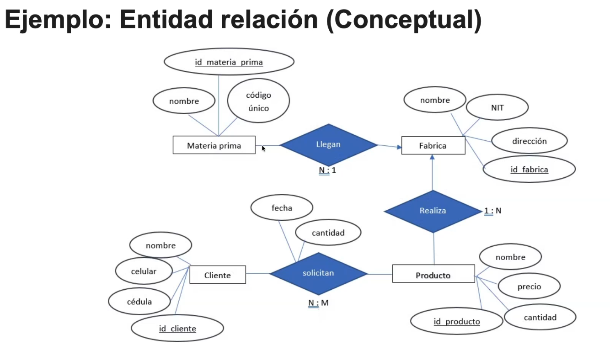

# Clase 03: Del Diseño Conceptual al Modelo Físico

## 1. Diseño Conceptual ([MER](../conceptos/MER.md))
- **Elementos visuales:**
    - [Entidad](../conceptos/Entidad.md): Representadas con rectángulos.
    - [Atributo](../conceptos/Atributo.md): Representados con óvalos.
    - **Relaciones:** Rombos que definen el vínculo.
- **Cardinalidad:**
    - Cliente -> Pedido: **1:N** (Uno a muchos).
    - Pedido -> Producto: **N:M** (Muchos a muchos).

## 2. Definición de Atributos (Reglas de diseño)
Para mantener la integridad, clasificamos los atributos según su naturaleza:
- **Atómicos:** Valor indivisible (Atributo Atómico).
- **Compuestos:** Divisibles en sub-partes con significado (ej. Dirección -> Calle, Ciudad).
- **Multivaluados:** Atributos que admiten más de un valor por registro.

## 3. Proceso de Conversión (ER a Lógico)
1. Identificar las [entidades](../conceptos/Entidad.md) del negocio.
2. Definir los [atributos](../conceptos/Atributo.md) de cada una.
3. Establecer [relaciones](../conceptos/Cardinalidad.md) y cardinalidad.
4. Traducir a [tablas](../conceptos/Tabla_(Base_de_Datos).md) (Modelo Lógico).

## 4. Modelo Físico
Es la implementación final en el [SGBD](../conceptos/SGBD.md), incluyendo tipos de datos, restricciones ([PK](../conceptos/Llave_Primaria.md), [FK](../conceptos/Llave_Foránea.md)) y [[Normalización]].

 
# Ejemplo Práctico: Modelo E-commerce (Representación Visual)
Este diseño implementa una relación N:M entre `Pedido` y `Producto` mediante una tabla intermedia.

## Estructura de Tablas

### 1. Clientes
Almacena la información de contacto.
- **PK:** `id`
- **Atributos:** nombre, correo, telefono, direccion.

### 2. Productos
Almacena el catálogo de artículos.
- **PK:** `id`
- **Atributos:** nombre, descripcion, precio.

### 3. Pedidos
Tabla con relación 1:N respecto a `Cliente`.
- **PK:** `id`
- **FK:** `id_cliente` (Referencia a `Clientes.id`)

### 4. Pedido_x_Producto (Tabla Intermedia)
Resuelve la relación N:M.
- **PK:** `id`
- **FK1:** `id_pedido` (Referencia a `Pedidos.id`)
- **FK2:** `id_producto` (Referencia a `Productos.id`)
- **Atributo extra:** `cantidad` (Define cuántas unidades del producto se agregaron a ese pedido).

## modelo fisico

```sql
-- Tabla Clientes
CREATE TABLE Clientes (
    id INT PRIMARY KEY,
    nombre VARCHAR(100),
    correo VARCHAR(100),
    telefono VARCHAR(20),
    direccion VARCHAR(200)
);

-- Tabla Productos
CREATE TABLE Productos (
    id INT PRIMARY KEY,
    nombre VARCHAR(100),
    descripcion TEXT,
    precio DECIMAL(10,2)
);

-- Tabla Pedidos
CREATE TABLE Pedidos (
    id INT PRIMARY KEY,
    fecha DATE,
    estado VARCHAR(20),
    id_cliente INT,
    FOREIGN KEY (id_cliente) REFERENCES Clientes(id)
);

-- Tabla Intermedia (Resolución de N:M)
CREATE TABLE Pedido_x_Producto (
    id INT PRIMARY KEY,
    id_pedido INT,
    id_producto INT,
    cantidad INT,
    FOREIGN KEY (id_pedido) REFERENCES Pedidos(id),
    FOREIGN KEY (id_producto) REFERENCES Productos(id)
);
```

# Proceso de Conversión: Del MER al Modelo Lógico
La transición del diseño conceptual al lógico requiere un enfoque sistemático para garantizar la integridad y la escalabilidad.

## Pasos del Algoritmo de Conversión:
1. **Mapeo de Entidades:** Identificar los objetos/conceptos del negocio que requieren persistencia.
2. **Definición de Atributos:** Extraer las características de cada [Entidad](../conceptos/Entidad.md), asegurando siempre la [Atomicidad](../conceptos/Atomicidad.md).
3. **Mapeo de Relaciones:** Determinar cómo interactúan las entidades entre sí mediante [cardinalidades](../conceptos/Cardinalidad.md) (1:1, 1:N, N:M).
4. **Normalización Temprana:** Identificar y separar [[Atributo_Multivaluado|atributos multivaluados]] en tablas auxiliares.
5. **Estandarización:** Utilizar notación técnica estándar (como UML o Notación de Crow's Foot) para garantizar la interoperabilidad.



# Modelo Físico
Es la etapa final del diseño, donde el [Modelo Lógico Relacional](../conceptos/Modelo_Lógico_Relacional.md) se materializa en un [SGBD](../conceptos/SGBD.md) específico.

## Objetivos de la implementación física:
- **Traducción estructural:** Convertir entidades a tablas, atributos a columnas y relaciones a restricciones de [FK](../conceptos/Llave_Foránea.md).
- **Optimización:** Ajustar tipos de datos y restricciones según las capacidades y limitaciones del SGBD seleccionado.
- **Normalización:** Aplicar las formas normales para minimizar la redundancia y maximizar la integridad de los datos.

## Checklist de implementación física:
- [ ] Analizar requisitos de negocio y restricciones del motor (SGBD).
- [ ] Definir esquemas de tablas, columnas y tipos de datos.
- [ ] Establecer restricciones de integridad ([PK](../conceptos/Llave_Primaria.md), [FK](../conceptos/Llave_Foránea.md), `NOT NULL`, `UNIQUE`).
- [ ] Implementar índices para optimización de consultas.
- [ ] Ejecutar el proceso de [[Normalización]] final.