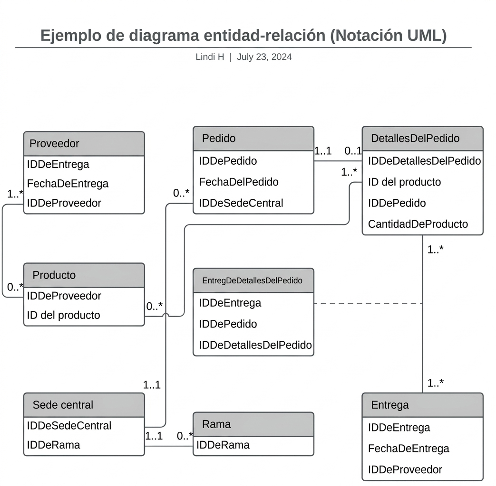
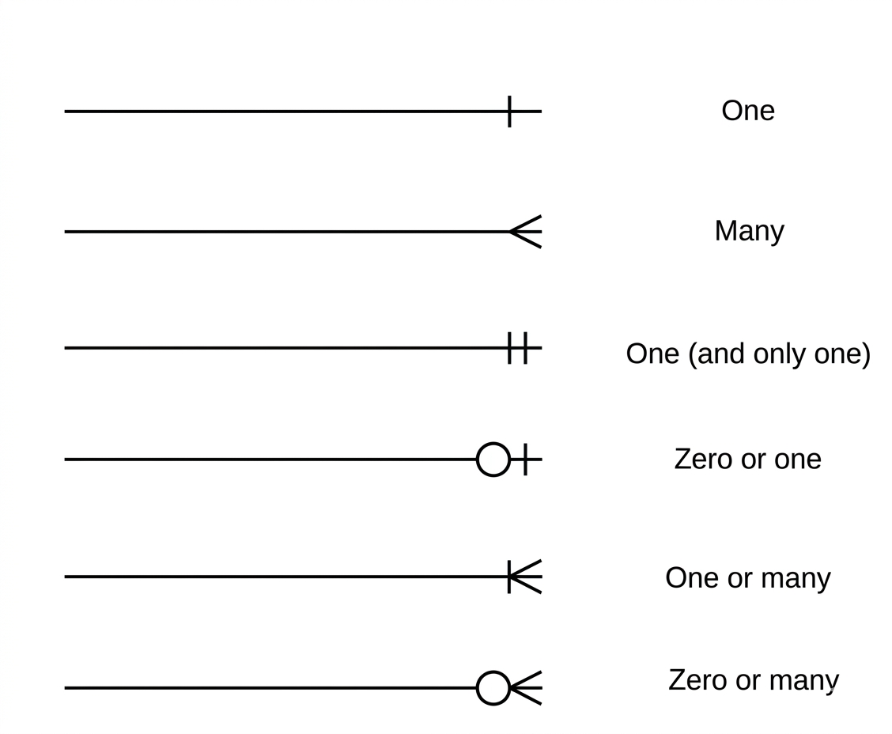

### Fundamentos del Diseño de Bases de Datos: Modelado y Representación Visual

El diseño de una base de datos es un proceso crítico que precede a la implementación física del sistema. Para garantizar que los datos estén bien estructurados, los profesionales utilizan esquemas y diagramas que actúan como el plano arquitectónico del sistema de información.

### Diagramas de Bases de Datos: La Herramienta Visual

Un diagrama de base de datos es una **representación gráfica** de la estructura lógica de los datos. Esta herramienta permite visualizar tanto la totalidad de un sistema complejo como segmentos específicos del mismo, facilitando la comunicación entre desarrolladores, analistas y partes interesadas.

- **Propósito:** Actuar como un mapa que define las tablas, los campos, las relaciones (claves primarias y foráneas) y las restricciones de integridad antes de escribir una sola línea de código SQL.
    
- **Utilidad:** Es fundamental para organizar, normalizar y validar el diseño de la base de datos, asegurando que los requerimientos del negocio se traduzcan correctamente en una estructura de almacenamiento eficiente.
    

### Diferenciación: Modelo Entidad-Relación (E-R) vs. Modelo Relacional

Aunque ambos conceptos están intrínsecamente ligados, sirven a etapas distintas del proceso de diseño:

|**Característica**|**Modelo Entidad-Relación (E-R)**|**Modelo Relacional**|
|---|---|---|
|**Enfoque**|Conceptual y abstracto.|Lógico y técnico.|
|**Nivel de detalle**|Define conceptos, entidades, atributos y relaciones.|Define tablas, columnas, tipos de datos y claves (PK/FK).|
|**Objetivo**|Entender el problema y los requerimientos del negocio.|Preparar la estructura para su implementación en un [SGBD](../conceptos/SGBD.md).|

- **Modelo E-R:** Se centra en "qué" información existe y cómo interactúan los conceptos del mundo real. Es independiente de cualquier tecnología de base de datos específica.
    
- **Modelo Relacional:** Es la implementación formal donde las entidades se convierten en tablas, los atributos en columnas y las relaciones en restricciones de integridad referencial.

### Ejemplo diagrama entidad-relación

### Modelado mediante Lenguaje Unificado de Modelado (UML)

El **UML (Unified Modeling Language)** es el estándar de la industria para visualizar sistemas de software. Cuando se utiliza UML para representar diagramas E-R, se aporta un nivel de estandarización que facilita la interpretación técnica.

#### La Cardinalidad en el Modelado

La cardinalidad define la restricción numérica que rige la relación entre entidades (por ejemplo: uno a uno, uno a muchos, o muchos a muchos). En los esquemas UML, esta se expresa de dos formas principales:

1. **Representación Numérica:** Utiliza notación directa, como `1..1` (uno a uno), `1..*` (uno a muchos) o `0..*` (cero a muchos), para indicar claramente los límites mínimo y máximo de la relación.
    
2. **Representación Simbólica:** Emplea notaciones gráficas estandarizadas (como la notación de "pata de gallo") para indicar visualmente el tipo de relación de un vistazo.
    
## simbología

> **Nota técnica:** Mientras que el modelo E-R original utiliza símbolos específicos para la cardinalidad (como diamantes y líneas con etiquetas), el enfoque UML integra estas relaciones dentro de los diagramas de clases, permitiendo una transición más fluida hacia el diseño orientado a objetos y la implementación en bases de datos relacionales.