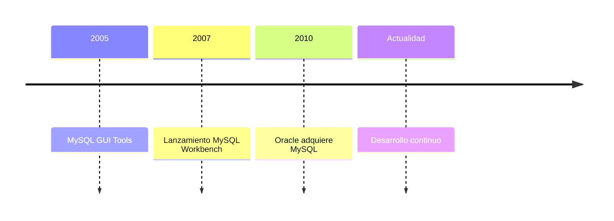

# Historia, Evolución y Arquitectura de MySQL

# 1. Introducción a MySQL

## Visión para Principiantes

**MySQL** es un sistema gestor de bases de datos relacional (**RDBMS**) utilizado para almacenar, organizar y administrar información.

Nació en 1995 con el objetivo de crear un sistema rápido, ligero y eficiente para trabajar con datos estructurados.

Desde sus inicios tuvo una gran aceptación porque:

* Era gratuito.
* Tenía buen rendimiento.
* Utilizaba SQL como lenguaje de consulta.
* Funcionaba en múltiples sistemas operativos.

Actualmente es uno de los motores de bases de datos más utilizados en aplicaciones web, sistemas empresariales y plataformas digitales.

Ejemplos de sistemas que pueden utilizar MySQL:

* Tiendas electrónicas.
* Sistemas bancarios.
* Plataformas educativas.
* Aplicaciones móviles.
* Sistemas administrativos.

---

# Profundidad Técnica

MySQL pertenece a la categoría de sistemas gestores de bases de datos relacionales.

Su arquitectura se basa en:

* Modelo relacional.
* Lenguaje SQL.
* Arquitectura cliente-servidor.
* Motores de almacenamiento intercambiables.

La característica que diferencia a MySQL de otros gestores es su arquitectura modular mediante motores de almacenamiento.

Ejemplo:

```text
Aplicación

      ↓

Servidor MySQL

      ↓

Motor de almacenamiento

      ↓

Archivos físicos de datos
```

---

# 2. Historia y Evolución de MySQL

# 2.1 Nacimiento de MySQL (1995)

MySQL fue creado en 1995 por la empresa sueca **MySQL AB**.

Su objetivo inicial era desarrollar un gestor de base de datos:

* Rápido.
* Simple.
* Optimizado para aplicaciones web.

---

# 2.2 MySQL API (1998)

En 1998 apareció MySQL API, permitiendo que diferentes aplicaciones pudieran comunicarse con el servidor.

Esto impulsó su adopción en:

* Desarrollo web.
* Aplicaciones dinámicas.
* Sistemas empresariales.

---

# 3. Evolución de MySQL Serie 3.x

La versión 3.x representó una etapa fundamental porque incorporó características que formarían la base del MySQL moderno.

---

# MySQL 3.20 (1996 - 1997)

## Características principales

### Primera versión pública masiva

Permitió una mayor adopción dentro de la comunidad de desarrolladores.

---

### Motor ISAM

Utilizaba el motor:

```text
ISAM
(Index Sequential Access Method)
```

Este permitía almacenar información utilizando índices para mejorar la velocidad de búsqueda.

---

### Update Log

Introdujo registros de actualización.

Este concepto evolucionaría posteriormente hacia los:

```text
Binary Logs
```

utilizados actualmente para replicación.

---

# MySQL 3.21 (1998)

## Cambios principales

### Puerto estándar 3306

Se estableció el puerto:

```text
3306
```

como puerto oficial de MySQL.

---

### Seguridad de autenticación

Se reemplazó el envío de contraseñas en texto plano mediante sistemas basados en hashes.

---

### Compatibilidad Windows

Permitió ejecutar MySQL en:

* Windows 95.
* Windows NT.

---

# MySQL 3.22 (1998 - 1999)

## Nuevas funcionalidades

### Salida vertical (\G)

Permitió visualizar resultados SQL en formato vertical.

Ejemplo:

```sql
SELECT *
FROM usuarios\G
```

Resultado:

```text
id: 1

nombre: Carlos

email: usuario@email.com
```

---

### mysqlhotcopy

Herramienta para realizar copias rápidas de seguridad.

---

### Compresión de conexiones

Permitió reducir tráfico entre cliente y servidor.

---

# MySQL 3.23 (2000 - 2001)

Fue una de las versiones más importantes.

---

# Motor MyISAM

Reemplazó ISAM.

Ventajas:

* Mayor velocidad.
* Mejor indexación.
* Mejor rendimiento en consultas.

---

# Replicación Master-Slave

Se introdujo la replicación mediante Binary Logs.

Arquitectura:


---

# Integración de InnoDB

Se incorporó el motor:

**InnoDB**

Características:

* Transacciones.
* Claves foráneas.
* Integridad referencial.
* Recuperación ante fallos.

---

# 4. MySQL 5.x: Evolución Empresarial

# MySQL 5.0 (2005)

Esta versión convirtió a MySQL en una alternativa empresarial.

---

# Procedimientos almacenados

Permiten ejecutar lógica directamente dentro del servidor.

Ejemplo:

```sql
DELIMITER //

CREATE PROCEDURE obtenerUsuarios()
BEGIN
    SELECT * FROM usuarios;
END //

DELIMITER ;
```

---

# Funciones almacenadas

Permiten crear operaciones reutilizables.

Ejemplo:

```sql
CREATE FUNCTION calcularIVA(precio DECIMAL(10,2))
RETURNS DECIMAL(10,2)

RETURN precio * 0.12;
```

---

# Vistas (Views)

Son tablas virtuales creadas mediante consultas.

Ejemplo:

```sql
CREATE VIEW usuarios_activos AS
SELECT *
FROM usuarios
WHERE estado='activo';
```

---

# Triggers

Permiten ejecutar acciones automáticas.

Ejemplo:

```sql
CREATE TRIGGER registrar_usuario

AFTER INSERT ON usuarios

FOR EACH ROW

INSERT INTO auditoria
VALUES(
NEW.id,
NOW()
);
```

---

# Transacciones ACID

Garantizan consistencia de datos.

ACID significa:

| Concepto     | Descripción                                   |
| ------------ | --------------------------------------------- |
| Atomicidad   | Todo ocurre o nada ocurre.                    |
| Consistencia | Los datos siempre mantienen reglas válidas.   |
| Aislamiento  | Las transacciones no interfieren entre sí.    |
| Durabilidad  | Los cambios confirmados permanecen guardados. |

---

# MySQL 5.1 (2008)

## Nuevas características

### Particionamiento

Divide grandes tablas en partes más pequeñas.

Ejemplo:

```text
Tabla ventas

├── Ventas_2024

├── Ventas_2025

└── Ventas_2026
```

---

### Event Scheduler

Permite ejecutar tareas programadas.

Ejemplo:

```sql
CREATE EVENT limpiar_logs

ON SCHEDULE EVERY 1 DAY

DO

DELETE FROM logs
WHERE fecha < NOW();
```

---

### Replicación basada en filas

Mejoró la precisión de replicación.

---

# 5. Adquisición por Oracle

## Visión para Principiantes

En 2008 Sun Microsystems compró MySQL AB.

Posteriormente en 2010 Oracle adquirió Sun Microsystems.

Desde entonces MySQL pertenece a Oracle.

---

## Profundidad Técnica

Actualmente MySQL posee dos principales distribuciones:

### MySQL Community Edition

Características:

* Código abierto.
* Gratuito.
* Uso comunitario.

---

### MySQL Enterprise Edition

Orientado a empresas.

Incluye:

* Herramientas avanzadas.
* Soporte profesional.
* Seguridad empresarial.

---

# 6. Características Técnicas de MySQL

# Modelo Relacional

## Visión para Principiantes

Los datos se almacenan en tablas relacionadas.

Ejemplo:

Tabla usuarios:

| id | nombre |
| -- | ------ |
| 1  | Carlos |

Tabla pedidos:

| id | usuario_id |
| -- | ---------- |
| 1  | 1          |

---

## Profundidad Técnica

Las relaciones utilizan:

* Claves primarias.
* Claves foráneas.
* Restricciones.

---

# Arquitectura Cliente-Servidor


---

# Lenguaje SQL

MySQL utiliza:

```text
Structured Query Language
```

Permite:

* Crear tablas.
* Consultar datos.
* Modificar información.
* Administrar permisos.

---

# Vistas Personalizadas

Permiten ocultar complejidad.

Ejemplo:

```sql
CREATE VIEW reporte_clientes AS

SELECT nombre,email

FROM clientes;
```

---

# Procedimientos y Funciones

Ventajas:

* Menor tráfico de red.
* Reutilización.
* Centralización de lógica.

---

# Triggers

Aplicaciones:

* Auditorías.
* Validaciones.
* Control de cambios.

---

# Gestión de Transacciones

Principalmente mediante InnoDB.

Ejemplo:

```sql
START TRANSACTION;

UPDATE cuentas
SET saldo=saldo-100
WHERE id=1;

UPDATE cuentas
SET saldo=saldo+100
WHERE id=2;

COMMIT;
```

---

# 7. Ventajas de MySQL

## Código abierto

Permite:

* Uso gratuito.
* Adaptación.
* Comunidad activa.

---

## Rendimiento

Optimizado para:

* Consultas rápidas.
* Grandes cantidades de usuarios.
* Aplicaciones web.

---

## Comunidad

Cuenta con:

* Documentación extensa.
* Tutoriales.
* Soporte comunitario.

---

# 8. Clientes de MySQL

# MySQL Workbench

## Visión para Principiantes

Es la herramienta oficial para administrar MySQL.

Permite:

* Crear bases de datos.
* Ejecutar consultas.
* Diseñar tablas.
* Administrar servidores.

---

## Profundidad Técnica

Desarrollado por Oracle.

Incluye:

* Modelado visual.
* Editor SQL.
* Administración.
* Migración.
* Ingeniería inversa.

---

# HeidiSQL

Herramienta open source.

Soporta:

* MySQL.
* MariaDB.
* PostgreSQL.
* SQL Server.

Características:

* Administración visual.
* Edición de datos.
* Consultas SQL.

---

# Navicat

Herramienta comercial multiplataforma.

Características:

* Diseño de bases.
* Sincronización.
* Migración.
* Desarrollo SQL.

---

# DBeaver

Cliente universal.

Permite:

* Administración SQL.
* Exportación.
* Diseño visual.

---

# Sequel Pro

Cliente exclusivo para macOS.

Características:

* Gestión MySQL.
* Consultas.
* Administración usuarios.

---

# 9. Historia de MySQL Workbench

## Evolución



---

# 10. Instalación MySQL Workbench

## Linux

Ejemplo:

```bash
sudo apt update

sudo apt install mysql-workbench
```

---

## Windows

Proceso:

1. Descargar instalador oficial.
2. Ejecutar asistente.
3. Configurar conexión.
4. Crear conexión al servidor MySQL.

---

# 11. Funcionalidades Principales de MySQL Workbench

## Modelado de Base de Datos

Permite diseñar:

* Tablas.
* Relaciones.
* Diagramas ER.

---

## Desarrollo SQL

Incluye:

* Editor SQL.
* Autocompletado.
* Ejecución de consultas.

---

## Administración del servidor

Permite:

* Usuarios.
* Permisos.
* Configuración.
* Estado del servidor.

---

## Migración de datos

Permite mover información desde otros gestores.

---

## Visualización y análisis

Incluye:

* Estadísticas.
* Reportes.
* Análisis de rendimiento.

---

## Automatización

Permite gestionar:

* Scripts.
* Procesos repetitivos.
* Tareas administrativas.

---

# Glosario

| Término                  | Definición                                                           |
| ------------------------ | -------------------------------------------------------------------- |
| RDBMS                    | Sistema gestor de bases de datos relacional.                         |
| SQL                      | Lenguaje utilizado para administrar bases de datos.                  |
| Tabla                    | Estructura donde se almacenan datos organizados en filas y columnas. |
| Motor de almacenamiento  | Componente encargado de gestionar cómo se guardan los datos.         |
| ISAM                     | Antiguo motor de almacenamiento utilizado por MySQL.                 |
| MyISAM                   | Motor optimizado para consultas rápidas.                             |
| InnoDB                   | Motor transaccional con soporte ACID.                                |
| Replicación              | Proceso de copiar datos entre servidores.                            |
| Binary Log               | Registro de cambios utilizado para replicación y recuperación.       |
| Trigger                  | Código ejecutado automáticamente ante eventos SQL.                   |
| Vista                    | Tabla virtual basada en una consulta.                                |
| Procedimiento almacenado | Conjunto de instrucciones SQL almacenadas en el servidor.            |
| Transacción              | Grupo de operaciones tratadas como una unidad.                       |
| Workbench                | Herramienta gráfica oficial para administrar MySQL.                  |

---

# Conclusión

MySQL evolucionó desde un gestor ligero creado en 1995 hasta convertirse en uno de los motores relacionales más importantes del mundo.

Su crecimiento estuvo marcado por:

* Mejoras en almacenamiento.
* Soporte transaccional.
* Replicación.
* Herramientas empresariales.
* Integración con aplicaciones modernas.

Actualmente continúa siendo una tecnología fundamental dentro del desarrollo backend, sistemas empresariales y arquitecturas basadas en datos.
