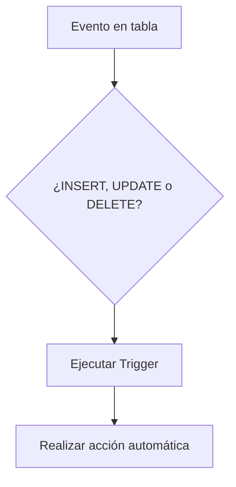
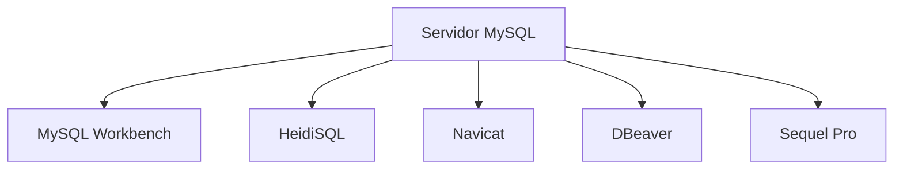
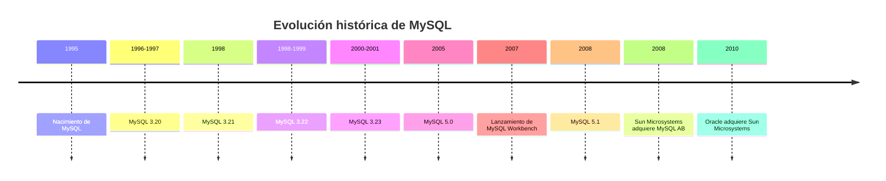

# MySQL — Historia, Evolución, Características y Herramientas

## Introducción

**MySQL** nació en **1995** como un sistema gestor de bases de datos relacionales. Con el paso del tiempo se convirtió en una de las soluciones de gestión de bases de datos más reconocidas y utilizadas en el mundo del desarrollo de software.

Su adopción creció rápidamente debido a que numerosos desarrolladores comenzaron a utilizarlo en sus aplicaciones. A lo largo de sus diferentes versiones, MySQL incorporó nuevas capacidades relacionadas con rendimiento, replicación, transacciones, procedimientos almacenados, vistas, triggers y administración de grandes volúmenes de información.

---

# Historia y evolución de MySQL

## Primeros años

Durante sus primeros años, MySQL comenzó a expandirse dentro del ecosistema de desarrollo de software mediante la incorporación progresiva de nuevas características y herramientas de acceso.

En la década de 1990 comenzaron a aparecer versiones públicas del sistema, y posteriormente la serie **MySQL 3.x** incorporó varias de las características que contribuyeron a consolidar su adopción.

> [!NOTE]
> En 1998 se creó la **MySQL API**, a partir de la cual comenzó a expandirse el soporte para desarrollo. El concepto aparece en los apuntes como parte de la evolución temprana de MySQL.

---

# Serie MySQL 3.x

La serie **MySQL 3.x** fue especialmente importante porque incorporó progresivamente mejoras en almacenamiento, comunicación cliente-servidor, autenticación, respaldo y replicación.

## MySQL 3.20

**Lanzada entre 1996 y 1997.**

Fue descrita como la **primera versión pública masiva** de MySQL.

### Características principales

* **Puerto por defecto:** utilizaba el puerto `3333`, en lugar del `3306` utilizado posteriormente.
* **Motor ISAM:** utilizaba el motor de almacenamiento **ISAM** de IBM.
* **Registro de actualizaciones:** introdujo el `update log`, considerado un antecedente de los *binary logs* modernos.
* **Soporte inicial:** incluía soporte para clientes CGI en Perl.
* Permitía la ejecución de comandos utilizando la palabra clave `go`.

---

## MySQL 3.21

**Lanzada en 1998.**

### Principales cambios

* **Cambio de puerto oficial:** se adoptó el puerto `3306`.
* **Protocolo de autenticación:** implementó un protocolo de intercambio de contraseñas mediante *hashes*, evitando el envío directo de contraseñas en texto plano.
* **Compatibilidad:** aparecieron las primeras versiones compatibles con entornos Windows, incluyendo Windows 95 y Windows NT.

---

## MySQL 3.22

**Lanzada entre 1998 y 1999.**

### Principales características

#### Salida vertical

Se agregó `\G`, que permite mostrar los resultados de una consulta de forma vertical en la consola.

#### Herramientas de respaldo

Se creó `mysqlhotcopy`, una utilidad destinada a realizar copias de seguridad locales rápidamente.

#### Compresión

Se incorporó la opción:

```bash
--compress
```

Esta opción permitía comprimir la transmisión de datos entre el cliente y el servidor.

---

## MySQL 3.23

**Lanzada entre 2000 y 2001.**

La versión **MySQL 3.23** fue una de las versiones más importantes de la serie 3.x y contribuyó significativamente a la expansión de MySQL.

### MyISAM

Se introdujo **MyISAM**, que reemplazó al antiguo motor ISAM y mejoró considerablemente el rendimiento relacionado con los índices.

### Replicación

Se introdujo por primera vez la **replicación unidireccional**, conocida tradicionalmente como:

> Master-Slave

La replicación utilizaba **binary logs** para registrar los cambios realizados en el servidor.

### Integración de InnoDB

Hacia el final del ciclo de MySQL 3.23 se integró el motor **InnoDB**, desarrollado por **Innobase Oy**.

Su incorporación permitió trabajar con capacidades fundamentales como:

* Transacciones.
* Integridad referencial.
* Claves foráneas.

La incorporación de estas capacidades mejoró considerablemente las posibilidades de MySQL como gestor de bases de datos.

> [!IMPORTANT]
> La evolución de la serie 3.x muestra cómo MySQL pasó de ser un sistema relativamente sencillo a incorporar capacidades importantes para aplicaciones cada vez más complejas.

---

# Evolución de MySQL 5.0 y 5.1

## MySQL 5.0

**Lanzada en octubre de 2005.**

MySQL 5.0 representó un cambio importante al incorporar características fundamentales para aplicaciones y entornos empresariales.

### Procedimientos almacenados

Se incorporó el soporte para **procedimientos almacenados (Stored Procedures)**.

Un procedimiento almacenado permite guardar un conjunto de instrucciones SQL dentro del servidor de base de datos para posteriormente ejecutarlas mediante una llamada.

Esto permite incorporar parte de la lógica de negocio directamente en la base de datos.

### Funciones almacenadas

También se incorporó soporte para **funciones almacenadas**, permitiendo definir operaciones reutilizables dentro del servidor.

### Vistas

Se incorporaron las **vistas (Views)**.

Una vista es una representación virtual de los datos basada en una consulta.

Las vistas permiten:

* Simplificar consultas complejas.
* Presentar determinados datos a los usuarios.
* Facilitar determinadas estrategias de seguridad sobre el acceso a los datos.

### Triggers

Se incorporaron los **disparadores (Triggers)**.

Un trigger permite ejecutar automáticamente determinadas acciones cuando ocurre un evento sobre una tabla, como:

* `INSERT`
* `UPDATE`
* `DELETE`

Esto resulta útil para automatizaciones, validaciones y auditorías.

### Transacciones

MySQL consolidó el soporte para **transacciones ACID**, principalmente mediante el motor **InnoDB**.

Una transacción permite tratar varias operaciones como una única unidad lógica de trabajo.

Por ejemplo:

```text
Operación 1
    ↓
Operación 2
    ↓
Operación 3
    ↓
COMMIT
```

Si ocurre un problema que obliga a cancelar la operación:

```text
Operación 1
    ↓
Operación 2
    ↓
Error
    ↓
ROLLBACK
```

De esta manera se busca mantener la integridad de la información.

---

# MySQL 5.1

**Lanzada en 2008.**

MySQL 5.1 incorporó nuevas características técnicas y coincidió con un momento importante en la historia comercial del proyecto.

## Nuevas características

### Particionamiento de tablas

Se introdujo el **particionamiento de tablas**, permitiendo organizar grandes volúmenes de datos en diferentes particiones.

### Event Scheduler

Se incorporó el **Event Scheduler**, utilizado para programar la ejecución automática de determinadas tareas dentro del servidor.

### Replicación basada en filas

Se introdujo la **replicación basada en filas (Row-Based Replication)**.

Este mecanismo registra los cambios realizados sobre las filas en lugar de registrar únicamente las instrucciones SQL utilizadas para producirlos.

---

## Adquisición de MySQL AB

En **2008**, **Sun Microsystems** adquirió **MySQL AB** por aproximadamente **1.000 millones de dólares**.

Esta adquisición reflejó la importancia que MySQL había alcanzado dentro de la industria del software.

---

# Adquisición por Oracle

En **2010**, **Oracle Corporation** adquirió Sun Microsystems.

Como consecuencia, MySQL pasó a formar parte del portafolio de tecnologías de Oracle.

Desde entonces, MySQL continuó evolucionando y mantuvo una modalidad de distribución orientada a la comunidad y otra dirigida a necesidades comerciales.

> [!NOTE]
> Los apuntes originales destacan la existencia de una edición comunitaria de código abierto y una modalidad comercial orientada a entornos corporativos.

---

# Características técnicas principales

## Modelo relacional

MySQL utiliza un **modelo relacional** para organizar la información.

Los datos se almacenan principalmente en **tablas**, y estas pueden relacionarse mediante claves y relaciones.

Por ejemplo:

```text
CLIENTES
   │
   │ 1:N
   ↓
PEDIDOS
```

El modelo relacional permite organizar la información y establecer relaciones entre diferentes entidades.

Entre sus objetivos se encuentran:

* Organizar los datos.
* Reducir la redundancia.
* Mantener la integridad de la información.
* Facilitar las consultas.

---

## Arquitectura cliente-servidor

MySQL utiliza una arquitectura **cliente-servidor**.

De forma simplificada:


```mermaid
flowchart LR
    A[Aplicación o cliente] -->|Consulta SQL| B[Servidor MySQL]
    B --> C[Base de datos]
    C --> B
    B -->|Resultado| A
```

El **servidor** administra las bases de datos y procesa las solicitudes.

El **cliente** realiza peticiones al servidor, normalmente mediante consultas SQL.

Esta separación permite que diferentes aplicaciones o herramientas se conecten al mismo servidor de base de datos.

---

## SQL

MySQL utiliza **SQL (Structured Query Language)** como lenguaje principal para trabajar con los datos.

SQL permite realizar operaciones como:

```sql
SELECT *
FROM productos;
```

También permite:

* Crear bases de datos.
* Crear tablas.
* Insertar datos.
* Consultar información.
* Actualizar registros.
* Eliminar registros.
* Establecer relaciones.
* Crear vistas.
* Definir procedimientos.
* Crear triggers.

El uso de SQL facilita el aprendizaje de otros sistemas gestores de bases de datos relacionales que también utilizan este lenguaje.

---

# Vistas

Las **vistas (Views)** son estructuras virtuales basadas en consultas.

Permiten presentar información obtenida mediante una consulta como si fuera una tabla virtual.

Por ejemplo:

```sql
CREATE VIEW productos_activos AS
SELECT *
FROM productos
WHERE activo = TRUE;
```

Una vista puede ser útil para:

* Simplificar consultas.
* Ocultar parte de la complejidad de una consulta.
* Presentar determinados datos.
* Facilitar determinadas estrategias de control de acceso.

---

# Procedimientos almacenados y funciones

Los **procedimientos almacenados** y las **funciones** permiten almacenar lógica SQL directamente en el servidor.

Esto puede reducir la cantidad de comunicación entre la aplicación y el servidor cuando una operación requiere ejecutar múltiples instrucciones.

Conceptualmente:


```mermaid
flowchart LR
    A[Aplicación] -->|CALL| B[Procedimiento almacenado]
    B --> C[Ejecuta instrucciones SQL]
    C --> D[Base de datos]
    D --> C
    C --> B
    B --> A
```

Los procedimientos almacenados pueden trabajar con diferentes tipos de parámetros, entre ellos:

* `IN`
* `OUT`
* `INOUT`

---

# Triggers

Los **Triggers**, también llamados **disparadores**, permiten ejecutar automáticamente una acción cuando ocurre un evento determinado sobre una tabla.

Los eventos principales son:

* `INSERT`
* `UPDATE`
* `DELETE`

Por ejemplo, un trigger puede utilizarse para realizar una auditoría después de modificar información.

Conceptualmente:


```mermaid
flowchart TD
    A[Evento en tabla] --> B{¿INSERT, UPDATE o DELETE?}
    B --> C[Ejecutar Trigger]
    C --> D[Realizar acción automática]
```

Los triggers pueden ser útiles para:

* Auditorías.
* Validaciones.
* Automatizaciones internas.
* Registro de cambios.

---

# Transacciones y ACID

Una **transacción** agrupa varias operaciones como una unidad lógica de trabajo.

Las propiedades **ACID** son fundamentales para garantizar la confiabilidad de las transacciones.

## Atomicidad

La operación se considera una unidad: debe completarse completamente o no aplicarse.

## Consistencia

La transacción debe mantener la base de datos en un estado válido.

## Aislamiento

Las operaciones concurrentes deben ejecutarse de manera controlada para evitar interferencias incorrectas entre transacciones.

## Durabilidad

Una vez confirmada una transacción, sus cambios deben mantenerse incluso ante determinados fallos del sistema.

En MySQL, estas capacidades están principalmente asociadas al motor **InnoDB**.

---

# Ventajas de utilizar MySQL

## Código abierto

MySQL ofrece una alternativa de código abierto que permite a desarrolladores y empresas utilizar una solución de gestión de bases de datos ampliamente conocida.

Esto puede resultar especialmente útil para:

* Desarrolladores individuales.
* Pequeñas empresas.
* Proyectos de desarrollo.
* Aplicaciones que requieren un RDBMS ampliamente adoptado.

## Comunidad

MySQL cuenta con una comunidad activa de usuarios y desarrolladores.

Esta comunidad proporciona:

* Documentación.
* Recursos de aprendizaje.
* Soluciones a problemas.
* Experiencias compartidas.
* Buenas prácticas.

Esto facilita el aprendizaje y la resolución de problemas durante el desarrollo.

---

# Clientes y herramientas para MySQL

Un **cliente de base de datos** es una aplicación que permite conectarse a un servidor y realizar operaciones de administración, consulta o desarrollo.

Entre las herramientas mencionadas en estos apuntes se encuentran:

* MySQL Workbench.
* HeidiSQL.
* Navicat.
* DBeaver.
* Sequel Pro.

---

## MySQL Workbench

**MySQL Workbench** es una herramienta oficial del ecosistema MySQL desarrollada por Oracle.

Proporciona funcionalidades para:

* Administrar bases de datos.
* Diseñar bases de datos.
* Crear modelos.
* Ejecutar consultas SQL.
* Visualizar información.
* Administrar servidores.

---

## HeidiSQL

**HeidiSQL** es una aplicación de código abierto utilizada para administrar diferentes sistemas gestores de bases de datos.

Según los apuntes, permite trabajar con:

* MySQL.
* SQL Server.
* PostgreSQL.
* SQLite.

Proporciona una interfaz gráfica para administrar bases de datos y realizar diferentes tareas de gestión.

---

## Navicat

**Navicat** es una herramienta multiplataforma para la administración de bases de datos.

Incluye soporte para MySQL y ofrece funcionalidades relacionadas con:

* Administración de bases de datos.
* Diseño de bases de datos.
* Desarrollo de consultas.
* Sincronización de bases de datos.

---

## DBeaver

**DBeaver** proporciona una interfaz gráfica para trabajar con bases de datos.

Entre sus funcionalidades se encuentran:

* Creación y edición de tablas.
* Diseño de consultas SQL.
* Administración de datos.
* Exportación de información.

---

## Sequel Pro

**Sequel Pro** es un cliente de MySQL de código abierto orientado a **macOS**.

Proporciona una interfaz sencilla para:

* Administrar bases de datos MySQL.
* Ejecutar consultas.
* Administrar usuarios.
* Administrar permisos.

---

# Historia de MySQL Workbench

La evolución de MySQL Workbench puede entenderse mediante varias etapas:

1. **MySQL AB y MySQL GUI Tools.**
2. **Necesidad de una herramienta unificada.**
3. **Nacimiento de MySQL Workbench.**
4. **Adquisición de MySQL por Oracle.**
5. **Evolución y desarrollo continuo.**

## Lanzamiento

Según los apuntes, **MySQL Workbench se lanzó en 2007**.

La herramienta surgió como una evolución hacia una solución gráfica más integrada para el diseño y administración de bases de datos MySQL.

---

# Principales funcionalidades de MySQL Workbench

## Modelado y diseño de bases de datos

Permite crear modelos visuales de bases de datos.

Estos modelos ayudan a representar:

* Tablas.
* Columnas.
* Claves.
* Relaciones.
* Estructuras de la base de datos.

El modelado permite diseñar la estructura antes de implementarla directamente en el servidor.

---

## Desarrollo SQL

MySQL Workbench permite escribir y ejecutar consultas SQL.

Por ejemplo:

```sql
SELECT *
FROM productos;
```

El desarrollador puede utilizar la herramienta para trabajar directamente con el servidor MySQL y analizar los resultados de las consultas.

---

## Administración del servidor

Permite realizar tareas relacionadas con la administración del servidor MySQL.

Entre ellas se encuentran operaciones de configuración, monitoreo y gestión del servidor.

---

## Migración de datos

MySQL Workbench proporciona herramientas orientadas a la **migración de datos**.

La migración permite trasladar información o estructuras entre diferentes sistemas o entornos.

---

## Visualización y análisis

La herramienta permite visualizar información y analizar determinados aspectos relacionados con las bases de datos.

Esto facilita la comprensión de los datos y de la estructura de la base de datos.

---

## Automatización de tareas

Permite utilizar herramientas para facilitar determinadas tareas administrativas y de desarrollo.

La automatización reduce la necesidad de realizar manualmente operaciones repetitivas.

---

## Sincronización de esquemas

La **sincronización de esquemas** permite comparar y sincronizar estructuras de bases de datos entre diferentes entornos.

Esto puede resultar útil cuando existen diferentes versiones de una misma base de datos, por ejemplo:

```text
Desarrollo
    │
    │ sincronización
    ↓
Producción
```

---

# Instalación de MySQL Workbench

Los apuntes incluyen el tema **"método de instalación de MySQL Workbench"**, pero no contienen los pasos concretos de instalación.

> [!WARNING]
> **Información incompleta:** en los apuntes no se especifican los comandos, paquetes, sistema operativo ni procedimiento utilizado para instalar MySQL Workbench. Por esta razón, no se agregan pasos de instalación que no formen parte del material original.

---

# Relación entre MySQL y sus herramientas

Las diferentes herramientas cumplen funciones complementarias dentro del trabajo con MySQL:


```mermaid
flowchart TD
    A[Servidor MySQL]
    A --> B[MySQL Workbench]
    A --> C[HeidiSQL]
    A --> D[Navicat]
    A --> E[DBeaver]
    A --> F[Sequel Pro]
```

El servidor MySQL es el componente que administra y procesa las bases de datos, mientras que los clientes proporcionan diferentes interfaces para conectarse y trabajar con él.

---

# Línea de tiempo resumida


```mermaid
timeline
    title Evolución histórica de MySQL
    1995 : Nacimiento de MySQL
    1996-1997 : MySQL 3.20
    1998 : MySQL 3.21
    1998-1999 : MySQL 3.22
    2000-2001 : MySQL 3.23
    2005 : MySQL 5.0
    2007 : Lanzamiento de MySQL Workbench
    2008 : MySQL 5.1
    2008 : Sun Microsystems adquiere MySQL AB
    2010 : Oracle adquiere Sun Microsystems
```

> [!NOTE]
> La línea de tiempo conserva las fechas indicadas en los apuntes originales. No se han añadido versiones posteriores porque no forman parte del material proporcionado.

---

# Resumen

MySQL nació en **1995** y evolucionó progresivamente hasta convertirse en un gestor de bases de datos relacionales ampliamente utilizado.

La serie **3.x** incorporó mejoras importantes en almacenamiento, autenticación, respaldo, compresión y replicación. La versión **3.23** destacó especialmente por la incorporación de **MyISAM**, la replicación y la integración de **InnoDB**.

Con **MySQL 5.0** se incorporaron capacidades fundamentales como:

* Procedimientos almacenados.
* Funciones almacenadas.
* Vistas.
* Triggers.
* Transacciones.

Posteriormente, **MySQL 5.1** incorporó características como el particionamiento, el Event Scheduler y la replicación basada en filas.

En el ámbito empresarial, **MySQL AB fue adquirida por Sun Microsystems en 2008**, y posteriormente **Oracle adquirió Sun Microsystems en 2010**.

Desde el punto de vista técnico, MySQL se caracteriza por utilizar:

* Modelo relacional.
* Arquitectura cliente-servidor.
* SQL.
* Vistas.
* Procedimientos almacenados.
* Funciones.
* Triggers.
* Transacciones ACID.
* Motores de almacenamiento como InnoDB.

Para trabajar con MySQL existen diferentes clientes y herramientas, entre ellos **MySQL Workbench, HeidiSQL, Navicat, DBeaver y Sequel Pro**.

MySQL Workbench destaca especialmente por integrar funcionalidades de:

* Modelado y diseño.
* Desarrollo SQL.
* Administración del servidor.
* Migración de datos.
* Visualización y análisis.
* Automatización.
* Sincronización de esquemas.

---

# Glosario

| Término                  | Descripción                                                                                                                                                              |
| ------------------------ | ------------------------------------------------------------------------------------------------------------------------------------------------------------------------ |
| `RDBMS`                  | Sistema gestor de bases de datos relacionales.                                                                                                                           |
| `SQL`                    | Lenguaje utilizado para consultar y administrar bases de datos relacionales.                                                                                             |
| `ISAM`                   | Motor de almacenamiento utilizado por versiones tempranas de MySQL.                                                                                                      |
| `MyISAM`                 | Motor de almacenamiento introducido en la serie MySQL 3.23.                                                                                                              |
| `InnoDB`                 | Motor de almacenamiento de MySQL asociado al soporte de transacciones e integridad referencial.                                                                          |
| `Binary Log`             | Registro utilizado por MySQL para almacenar determinados cambios realizados sobre la base de datos y utilizado, entre otras funciones, para replicación.                 |
| `Replicación`            | Mecanismo mediante el cual los cambios de un servidor de base de datos pueden reproducirse en otro servidor.                                                             |
| `Master-Slave`           | Terminología tradicional utilizada para describir una arquitectura de replicación con un servidor principal y uno o más servidores secundarios.                          |
| `View`                   | Estructura virtual basada en una consulta SQL.                                                                                                                           |
| `Stored Procedure`       | Conjunto de instrucciones SQL almacenadas en el servidor y ejecutables mediante una llamada.                                                                             |
| `Function`               | Rutina almacenada que permite encapsular una operación y devolver un resultado.                                                                                          |
| `Trigger`                | Rutina que se ejecuta automáticamente como respuesta a determinados eventos sobre una tabla.                                                                             |
| `Transaction`            | Unidad lógica de trabajo que agrupa una o varias operaciones de base de datos.                                                                                           |
| `ACID`                   | Conjunto de propiedades que describen características fundamentales de las transacciones: Atomicidad, Consistencia, Aislamiento y Durabilidad.                           |
| `Event Scheduler`        | Componente que permite programar la ejecución automática de eventos en MySQL.                                                                                            |
| `Row-Based Replication`  | Modalidad de replicación que registra los cambios realizados sobre las filas.                                                                                            |
| `Table Partitioning`     | Técnica que divide una tabla en diferentes particiones para gestionar grandes volúmenes de información.                                                                  |
| `Client-Server`          | Arquitectura donde el cliente realiza solicitudes y el servidor procesa las operaciones y administra los datos.                                                          |
| `Schema`                 | Estructura lógica que define la organización de objetos de una base de datos.                                                                                            |
| `MySQL Workbench`        | Herramienta gráfica del ecosistema MySQL para diseño, desarrollo SQL y administración.                                                                                   |
| `Database Client`        | Aplicación utilizada para conectarse a un servidor de base de datos y trabajar con él.                                                                                   |
| `Hash`                   | Resultado de una función utilizada para representar datos mediante una transformación determinada; en los apuntes aparece relacionado con el intercambio de contraseñas. |
| `Foreign Key`            | Clave utilizada para establecer una relación entre registros de diferentes tablas y mantener integridad referencial.                                                     |
| `Integridad referencial` | Conjunto de reglas que mantienen la coherencia entre relaciones establecidas mediante claves.                                                                            |
| `Delimiter`              | Separador utilizado por el cliente SQL para identificar el final de una instrucción.                                                                                     |

# Conclusión

MySQL evolucionó desde un gestor ligero creado en 1995 hasta convertirse en uno de los motores relacionales más importantes del mundo.

Su crecimiento estuvo marcado por:

* Mejoras en almacenamiento.
* Soporte transaccional.
* Replicación.
* Herramientas empresariales.
* Integración con aplicaciones modernas.

Actualmente continúa siendo una tecnología fundamental dentro del desarrollo backend, sistemas empresariales y arquitecturas basadas en datos.
