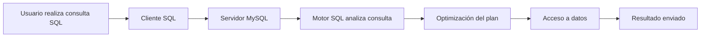
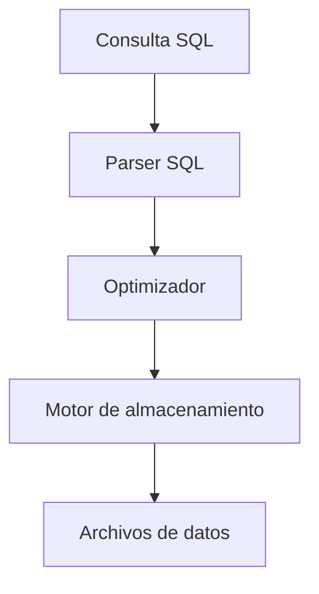

# SQL (Structured Query Language)

# 1. ¿Qué es SQL?

## Visión para Principiantes

**SQL (Structured Query Language)** es un lenguaje utilizado para comunicarse con bases de datos.

Permite realizar operaciones como:

* Crear bases de datos.
* Crear tablas.
* Guardar información.
* Consultar datos.
* Modificar registros.
* Eliminar información.
* Administrar permisos.

Ejemplo:

Una tienda necesita guardar información de:

* Clientes.
* Productos.
* Ventas.

SQL permite almacenar y consultar esa información.

Ejemplo:

```sql
SELECT *
FROM customers;
```

Esta consulta significa:

> "Muéstrame todos los clientes registrados".

---

# Profundidad Técnica

SQL es un lenguaje declarativo utilizado principalmente en sistemas gestores de bases de datos relacionales (**RDBMS**).

A diferencia de lenguajes tradicionales como Python o Java, SQL no indica exactamente cómo realizar una operación, sino qué resultado se desea obtener.

Ejemplo:

```sql
SELECT name
FROM users
WHERE age > 18;
```

El desarrollador indica:

> "Necesito los nombres de usuarios mayores de edad".

El motor SQL decide internamente:

* Qué índices utilizar.
* Qué tablas leer.
* Cómo optimizar la consulta.

---

# 2. Historia de SQL

## Origen de SQL

SQL nació en la década de 1970 como parte del proyecto:

```text
System R
```

desarrollado por IBM.

Fue una de las primeras implementaciones prácticas de un lenguaje de consulta para bases de datos relacionales.

Posteriormente SQL fue adoptado como estándar por:

* ANSI.
* ISO.

---

# SQL en la era de Internet

## Visión para Principiantes

Con el crecimiento de Internet, SQL se convirtió en una tecnología fundamental porque permitió almacenar la información generada por:

* Páginas web.
* Aplicaciones móviles.
* Sistemas empresariales.

Ejemplo:

Una red social necesita guardar:

* Usuarios.
* Publicaciones.
* Comentarios.
* Mensajes.

SQL permite organizar todos esos datos.

---

## Evolución moderna

Aunque SQL tiene décadas de existencia, continúa evolucionando.

Actualmente incorpora:

* Soporte para JSON.
* Análisis de grandes volúmenes de datos.
* Procesamiento en tiempo real.
* Integración con inteligencia artificial.

---

# 3. Características principales de SQL

## Lenguaje de consulta

Permite recuperar información.

Ejemplo:

```sql
SELECT *
FROM products;
```

---

# Operaciones CRUD

CRUD representa las operaciones básicas sobre datos.

| Operación | SQL    |
| --------- | ------ |
| Create    | INSERT |
| Read      | SELECT |
| Update    | UPDATE |
| Delete    | DELETE |

Ejemplo:

```sql
INSERT INTO customers(full_name)
VALUES ('Carlos');
```

---

# Gestión de bases de datos relacionales

SQL trabaja con estructuras organizadas:

```
Base de datos

 ├── Tabla usuarios

 ├── Tabla productos

 └── Tabla ventas
```

Las tablas pueden relacionarse mediante claves.

---

# Consultas y filtrado de datos

Permite buscar información específica.

Ejemplo:

```sql
SELECT *
FROM customers
WHERE customer_id = 1;
```

---

# Funciones y operaciones avanzadas

SQL incluye funciones:

```sql
COUNT()
SUM()
AVG()
MAX()
MIN()
```

Ejemplo:

```sql
SELECT COUNT(*)
FROM customers;
```

---

# Seguridad y control de acceso

SQL permite administrar permisos.

Ejemplo:

```sql
GRANT SELECT
ON tienda.*
TO usuario;
```

---

# Transacciones y control de concurrencia

## Visión para Principiantes

La concurrencia ocurre cuando muchas personas usan un sistema al mismo tiempo.

Ejemplo:

Una tienda recibe:

```
1000 usuarios conectados

50 usuarios comprando al mismo tiempo
```

La base de datos debe evitar problemas como:

* Dos personas comprando el último producto.
* Datos sobrescritos.
* Información incorrecta.

---

## Profundidad Técnica

Los motores SQL utilizan mecanismos como:

* Bloqueos (**Locks**).
* Control de versiones.
* Aislamiento de transacciones.

Ejemplo:

```sql
START TRANSACTION;

UPDATE productos
SET stock = stock - 1
WHERE id = 10;

COMMIT;
```

---

# 4. Tipos de Lenguajes SQL

SQL se divide en diferentes categorías.

---

# DDL (Data Definition Language)

Controla la estructura de la base de datos.

Comandos:

```sql
CREATE
ALTER
DROP
```

Ejemplo:

```sql
CREATE TABLE users(
 id INT,
 name VARCHAR(50)
);
```

---

# DML (Data Manipulation Language)

Manipula los datos.

Comandos:

```sql
INSERT
UPDATE
DELETE
```

Ejemplo:

```sql
UPDATE users
SET name='Carlos'
WHERE id=1;
```

---

# DQL (Data Query Language)

Permite consultar información.

Principal comando:

```sql
SELECT
```

Ejemplo:

```sql
SELECT *
FROM users;
```

---

# DCL (Data Control Language)

Administra permisos.

Comandos:

```sql
GRANT
REVOKE
```

---

# TCL (Transaction Control Language)

Administra transacciones.

Comandos:

```sql
COMMIT
ROLLBACK
SAVEPOINT
```

Ejemplo:

```sql
START TRANSACTION;

DELETE FROM users;

ROLLBACK;
```

---

# 5. Cláusulas SQL

Las cláusulas modifican el comportamiento de las consultas.

Ejemplos:

```sql
SELECT
FROM
WHERE
ORDER BY
GROUP BY
HAVING
LIMIT
```

Ejemplo:

```sql
SELECT name
FROM customers
WHERE id > 5
ORDER BY name DESC
LIMIT 10;
```

---

# 6. Funciones SQL

## Funciones agregadas

| Función | Uso              |
| ------- | ---------------- |
| COUNT   | Cuenta registros |
| SUM     | Suma valores     |
| AVG     | Promedio         |
| MAX     | Mayor valor      |
| MIN     | Menor valor      |

Ejemplo:

```sql
SELECT AVG(price)
FROM products;
```

---

# Funciones de fecha

```sql
CURRENT_DATE()

CURRENT_TIME()
```

---

# Funciones de texto

```sql
CONCAT()

SUBSTRING()

LENGTH()
```

Ejemplo:

```sql
SELECT CONCAT(
'Hola ',
'name'
);
```

---

# 7. Vistas, Índices y Triggers

# Vista (VIEW)

Una vista es una tabla virtual basada en una consulta.

Ejemplo:

```sql
CREATE VIEW clientes_activos AS

SELECT *
FROM customers
WHERE active=1;
```

---

# Índice

Mejora la velocidad de búsqueda.

Ejemplo:

```sql
CREATE INDEX idx_name
ON customers(full_name);
```

---

# Trigger

Ejecuta acciones automáticamente.

Ejemplo:

```sql
CREATE TRIGGER log_insert

AFTER INSERT ON customers

FOR EACH ROW

INSERT INTO logs VALUES(NOW());
```

---

# 8. Convenciones para nombres de variables

## Pascal Case

Primera letra de cada palabra en mayúscula.

```text
HelloWorld
```

---

## Kebab Case

Separado por guiones.

```text
hello-world
```

---

## Camel Case

Primera palabra minúscula y siguientes mayúsculas.

```text
helloWorld
```

---

## Snake Case

Separado por guion bajo.

```text
hello_world
```

---

## Screaming Snake Case

Todo en mayúsculas.

```text
HELLO_WORLD
```

---

# 9. Tipos de datos en MySQL

| Tipo          | Descripción              |
| ------------- | ------------------------ |
| INT           | Número entero            |
| BIGINT        | Número entero grande     |
| TINYINT       | Número entero pequeño    |
| VARCHAR(size) | Texto variable           |
| CHAR(size)    | Texto fijo               |
| TEXT          | Texto largo              |
| DATE          | Fecha YYYY-MM-DD         |
| TIME          | Hora HH:MM:SS            |
| DATETIME      | Fecha y hora             |
| FLOAT         | Decimal precisión simple |
| DOUBLE        | Decimal precisión doble  |
| DECIMAL(p,s)  | Decimal exacto           |
| BOOLEAN       | Valor 0 o 1              |
| ENUM          | Valores definidos        |
| BLOB          | Datos binarios           |
| JSON          | Datos estructurados JSON |

---

# 10. Operadores SQL

## Comparación

| Operador | Significado   |
| -------- | ------------- |
| =        | Igual         |
| <>       | Diferente     |
| <        | Menor         |
| >        | Mayor         |
| <=       | Menor o igual |
| >=       | Mayor o igual |

---

# Operadores lógicos

## AND

Todas las condiciones deben cumplirse.

```sql
WHERE edad > 18
AND activo = 1;
```

---

## OR

Al menos una condición debe cumplirse.

```sql
WHERE ciudad='Guatemala'
OR ciudad='México';
```

---

## NOT

Invierte una condición.

```sql
WHERE NOT activo;
```

---

# 11. Ejemplo práctico MySQL

## Crear base de datos

```sql
CREATE DATABASE IF NOT EXISTS acme_store;

USE acme_store;
```

---

# Crear tabla clientes

```sql
CREATE TABLE customers(

    customer_id INT AUTO_INCREMENT,

    full_name VARCHAR(60),

    PRIMARY KEY(customer_id)

);
```

---

# Crear tabla productos

```sql
CREATE TABLE products(

    id_product INT AUTO_INCREMENT,

    name_product VARCHAR(60),

    unit_price FLOAT,

    PRIMARY KEY(id_product)

);
```

---

# Insertar datos

```sql
INSERT INTO customers(full_name)

VALUES
('Ana'),
('Luis'),
('Carlos');
```

---

# Actualizar datos

Forma correcta:

```sql
UPDATE customers

SET full_name='Carlos Velasco'

WHERE customer_id=3;
```

Nunca:

```sql
UPDATE customers

SET full_name='Carlos';
```

Porque modifica todos los registros.

---

# Consultar información

Todos los registros:

```sql
SELECT *

FROM customers;
```

---

# Ordenar resultados

```sql
SELECT *

FROM customers

ORDER BY full_name DESC;
```

---

# Limitar resultados

```sql
SELECT *

FROM customers

LIMIT 2;
```

---

# Eliminar datos

Eliminar un registro:

```sql
DELETE FROM customers

WHERE customer_id=3;
```

---

Eliminar toda la tabla:

```sql
DELETE FROM customers;
```

⚠️ Mala práctica porque elimina todos los registros.

---

# Reiniciar tabla

```sql
TRUNCATE TABLE customers;
```

Elimina todos los datos y reinicia la tabla.

---

# Flujo de ejecución SQL



---

# Arquitectura de una consulta SQL



---

# Glosario

| Término      | Definición                                                       |
| ------------ | ---------------------------------------------------------------- |
| SQL          | Lenguaje utilizado para administrar bases de datos relacionales. |
| CRUD         | Operaciones básicas: crear, leer, actualizar y eliminar datos.   |
| DDL          | Lenguaje para definir estructuras de bases de datos.             |
| DML          | Lenguaje para modificar datos.                                   |
| DQL          | Lenguaje para consultar información.                             |
| DCL          | Lenguaje para administrar permisos.                              |
| TCL          | Lenguaje para controlar transacciones.                           |
| Transacción  | Grupo de operaciones ejecutadas como una unidad.                 |
| Concurrencia | Capacidad de manejar múltiples usuarios simultáneamente.         |
| Índice       | Estructura que acelera búsquedas.                                |
| Vista        | Tabla virtual basada en una consulta.                            |
| Trigger      | Proceso automático ejecutado por eventos SQL.                    |
| RDBMS        | Sistema gestor de bases de datos relacionales.                   |

---

# Conclusión

SQL es uno de los lenguajes fundamentales del desarrollo backend moderno.

Su importancia continúa vigente porque permite:

* Administrar grandes cantidades de información.
* Garantizar integridad de datos.
* Trabajar con múltiples usuarios.
* Construir sistemas empresariales escalables.
* Integrarse con aplicaciones modernas y tecnologías emergentes.
