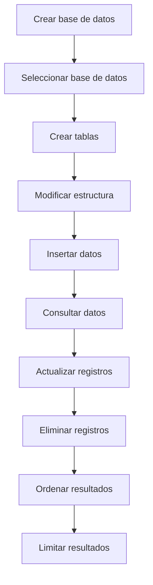

# SQL — Fundamentos, Características, Clasificación, Tipos de Datos y Consultas

# ¿Qué es SQL?

**SQL (Structured Query Language)** es un lenguaje utilizado para trabajar con bases de datos, especialmente con **bases de datos relacionales**.

Permite realizar diferentes operaciones sobre la información almacenada, como consultar, insertar, modificar y eliminar datos, además de definir estructuras, administrar permisos y controlar transacciones.

SQL es uno de los lenguajes fundamentales dentro del desarrollo de aplicaciones que utilizan bases de datos relacionales.

---

# Características principales de SQL

Entre las principales características de SQL se encuentran:

* **Lenguaje de consulta:** permite consultar información almacenada en una base de datos.
* **Operaciones CRUD:** permite realizar las operaciones fundamentales de creación, lectura, actualización y eliminación de datos.
* **Gestión de bases de datos relacionales:** permite trabajar con tablas, relaciones, claves y restricciones.
* **Consultas y filtrado de datos:** permite seleccionar información específica mediante condiciones.
* **Funciones y operaciones avanzadas:** proporciona funciones para realizar cálculos, transformaciones y operaciones sobre los datos.
* **Seguridad y control de acceso:** permite administrar permisos sobre los objetos de la base de datos.
* **Transacciones y control de concurrencia:** permite controlar operaciones realizadas simultáneamente por diferentes usuarios.

---

# Control de concurrencia

El **control de concurrencia** se refiere a la capacidad de un sistema gestor de bases de datos para controlar el acceso simultáneo de múltiples usuarios a los mismos datos.

Por ejemplo, una base de datos puede recibir solicitudes de cientos o miles de usuarios al mismo tiempo.

```text
Usuario 1 ─┐
Usuario 2 ─┤
Usuario 3 ─┤
Usuario 4 ─┼──> Servidor de base de datos
Usuario 5 ─┤
   ...     │
Usuario N ─┘
```

El sistema gestor debe controlar estas operaciones para evitar inconsistencias y conflictos.

## Bloqueos

Una de las técnicas utilizadas para controlar la concurrencia son los **bloqueos (locks)**.

Un bloqueo puede impedir temporalmente que determinadas operaciones modifiquen los mismos datos mientras otra operación está trabajando con ellos.

> [!NOTE]
> El apunte original menciona que puede bloquearse una tabla para impedir determinadas inserciones mientras se realiza una operación. Sin embargo, no especifica qué tipo de bloqueo o nivel de aislamiento se está utilizando, por lo que no se agrega una explicación más específica.

---

# Datos curiosos y conceptos básicos sobre SQL

## Origen de SQL

El desarrollo de SQL comenzó durante la década de **1970** como parte del proyecto **System R** de IBM.

Este proyecto fue una de las primeras implementaciones importantes relacionadas con lenguajes de consulta para bases de datos relacionales.

SQL posteriormente se convirtió en uno de los lenguajes más utilizados para trabajar con sistemas gestores de bases de datos relacionales.

---

# SQL en la era de Internet

Con la expansión de Internet, SQL adquirió todavía más importancia debido al crecimiento de las aplicaciones que necesitaban almacenar y consultar grandes cantidades de información.

Las aplicaciones web comenzaron a depender cada vez más de bases de datos para almacenar:

* Usuarios.
* Productos.
* Pedidos.
* Publicaciones.
* Información empresarial.
* Datos de aplicaciones.

Por esta razón, SQL se convirtió en una tecnología fundamental dentro del desarrollo de aplicaciones.

---

# Evolución continua de SQL

A pesar de su antigüedad, SQL continúa evolucionando.

Entre las capacidades mencionadas en los apuntes se encuentran:

* Integración con datos JSON.
* Soporte para análisis de grandes volúmenes de datos.
* Procesamiento de datos en tiempo real.

Esto demuestra que SQL continúa siendo relevante incluso con la aparición de nuevas tecnologías de almacenamiento y procesamiento de información.

---

# SQL y NoSQL

Con el tiempo surgieron las bases de datos **NoSQL**, orientadas a determinados tipos de datos y necesidades de consulta.

Sin embargo, SQL continúa teniendo una presencia importante en sistemas empresariales debido a características como:

* Fiabilidad.
* Robustez.
* Modelo relacional.
* Soporte para transacciones.
* Integridad de los datos.

> [!IMPORTANT]
> SQL y NoSQL no representan necesariamente tecnologías que deban excluirse mutuamente. Los apuntes destacan que SQL continúa siendo predominante en muchos sistemas empresariales.

---

# Clasificación de las instrucciones SQL

SQL puede organizarse conceptualmente en diferentes categorías según el tipo de operación que realizan.

---

## DDL — Data Definition Language

**DDL (Data Definition Language)** es el lenguaje utilizado para definir y modificar la estructura de los objetos de una base de datos.

Entre sus instrucciones principales se encuentran:

* `CREATE`
* `ALTER`
* `DROP`

### CREATE

Se utiliza para crear objetos de base de datos.

Ejemplo:

```sql
CREATE DATABASE acme_store;
```

También puede utilizarse:

```sql
CREATE DATABASE IF NOT EXISTS acme_store;
```

La cláusula `IF NOT EXISTS` evita intentar crear el objeto cuando ya existe.

---

### ALTER

Se utiliza para modificar la estructura de un objeto existente.

Por ejemplo:

```sql
ALTER TABLE customers
ADD PRIMARY KEY (customer_id);
```

En este caso se agrega una **PRIMARY KEY** a la tabla `customers`.

---

### DROP

Se utiliza para eliminar objetos de la base de datos.

Ejemplo:

```sql
DROP DATABASE acme_store;
```

También puede utilizarse:

```sql
DROP DATABASE IF EXISTS acme_store;
```

La cláusula `IF EXISTS` permite ejecutar la instrucción solamente si el objeto existe.

---

# DML — Data Manipulation Language

**DML (Data Manipulation Language)** agrupa las instrucciones utilizadas para manipular los datos almacenados.

En los apuntes se incluyen:

* `SELECT`
* `INSERT`
* `UPDATE`
* `DELETE`

> [!NOTE]
> En algunas clasificaciones académicas, `SELECT` se separa como **DQL**. En estos apuntes aparece dentro de DML y posteriormente también dentro de DQL. Ambas clasificaciones se muestran más adelante para conservar la organización original.

---

## INSERT

Se utiliza para insertar registros.

Ejemplo:

```sql
INSERT INTO customers(customer_id, full_name)
VALUES ("Ana");
```

Cuando se insertan varios registros, normalmente se utiliza una lista de valores por cada fila.

---

## UPDATE

Se utiliza para modificar registros existentes.

Ejemplo:

```sql
UPDATE customers
SET full_name = "Ana Lucia"
WHERE customer_id = 1;
```

La cláusula `WHERE` determina qué registro será modificado.

> [!WARNING]
> Ejecutar un `UPDATE` sin `WHERE` puede modificar **todos los registros** de la tabla. Por eso, utilizar `WHERE` cuando se pretende modificar registros específicos es una práctica fundamental.

---

## DELETE

Se utiliza para eliminar registros.

Ejemplo:

```sql
DELETE FROM customers
WHERE customer_id = 3;
```

La cláusula `WHERE` permite especificar qué registro debe eliminarse.

Sin `WHERE`:

```sql
DELETE FROM customers;
```

se eliminan todos los registros de la tabla.

---

# DQL — Data Query Language

**DQL (Data Query Language)** se utiliza para consultar información.

La instrucción principal es:

```sql
SELECT
```

Por ejemplo:

```sql
SELECT *
FROM customers;
```

Esta consulta obtiene todas las columnas y registros de `customers`.

---

# DCL — Data Control Language

**DCL (Data Control Language)** se utiliza para administrar permisos y controlar el acceso a los objetos de la base de datos.

Sus principales instrucciones son:

* `GRANT`
* `REVOKE`

### GRANT

Se utiliza para conceder permisos.

### REVOKE

Se utiliza para retirar permisos previamente concedidos.

---

# TCL — Transaction Control Language

**TCL (Transaction Control Language)** agrupa instrucciones relacionadas con el control de transacciones.

Las instrucciones mencionadas en los apuntes son:

* `COMMIT`
* `ROLLBACK`
* `SAVEPOINT`

### COMMIT

Confirma una transacción y hace permanentes sus cambios.

### ROLLBACK

Revierte los cambios de una transacción.

### SAVEPOINT

Establece un punto dentro de una transacción al que posteriormente puede regresarse.

---

# Cláusulas y operadores SQL

SQL proporciona diferentes cláusulas y operadores para construir consultas y controlar las condiciones de búsqueda.

Entre ellos se encuentran los operadores de comparación y los operadores lógicos.

---

# Operadores de comparación

Los operadores de comparación permiten comparar valores.

| Operador | Significado       |
| -------- | ----------------- |
| `=`      | Igualdad          |
| `<>`     | Diferente         |
| `<`      | Menor que         |
| `>`      | Mayor que         |
| `<=`     | Menor o igual que |
| `>=`     | Mayor o igual que |

Ejemplo:

```sql
SELECT *
FROM customers
WHERE customer_id >= 2;
```

Esta consulta obtiene los registros cuyo `customer_id` sea mayor o igual que `2`.

---

# Operadores lógicos

## AND

`AND` requiere que ambas condiciones sean verdaderas.

```sql
SELECT *
FROM customers
WHERE customer_id > 1
  AND customer_id < 5;
```

---

## OR

`OR` requiere que al menos una de las condiciones sea verdadera.

```sql
SELECT *
FROM customers
WHERE customer_id = 1
   OR customer_id = 3;
```

---

## NOT

`NOT` invierte el resultado lógico de una condición.

```sql
SELECT *
FROM customers
WHERE NOT customer_id = 3;
```

---

# Funciones en SQL

Las funciones permiten realizar operaciones sobre los datos.

Entre las funciones mencionadas en los apuntes se encuentran:

| Función        | Propósito                          |
| -------------- | ---------------------------------- |
| `COUNT()`      | Cuenta registros o valores.        |
| `AVG()`        | Calcula un promedio.               |
| `MAX()`        | Obtiene el valor máximo.           |
| `MIN()`        | Obtiene el valor mínimo.           |
| `SUM()`        | Calcula una suma.                  |
| `CURRENT_DATE` | Obtiene la fecha actual.           |
| `CURRENT_TIME` | Obtiene la hora actual.            |
| `CONCAT()`     | Concatena cadenas de texto.        |
| `SUBSTRING()`  | Extrae una parte de una cadena.    |
| `LENGTH()`     | Obtiene la longitud de una cadena. |

---

# Vistas, índices y triggers

Además de las consultas y operaciones básicas, SQL permite trabajar con diferentes objetos y mecanismos de base de datos.

## Vistas

Una **vista (VIEW)** representa el resultado de una consulta como una estructura virtual que puede ser consultada posteriormente.

## Índices

Un **índice (INDEX)** permite crear una estructura auxiliar para facilitar determinadas búsquedas sobre una tabla.

## Triggers

Un **trigger** es una acción automática asociada a determinados eventos sobre una tabla, como:

* `INSERT`
* `UPDATE`
* `DELETE`

---

# Formatos de nombres

Los apuntes incluyen diferentes estilos de nomenclatura.

| Formato        | Ejemplo       |
| -------------- | ------------- |
| Pascal Case    | `HelloWorld`  |
| Kebab Case     | `hello-world` |
| Camel Case     | `helloWorld`  |
| Screaming Case | `HELLO_WORLD` |

> [!WARNING]
> El ejemplo original `hello_world` fue identificado como **Camel Case**, pero técnicamente corresponde a **snake_case**. `Camel Case` se representa normalmente como `helloWorld`.

---

# Tipos de datos en MySQL

Los tipos de datos determinan qué clase de información puede almacenarse en una columna.

---

## Tipos numéricos

### INT

Almacena números enteros.

```sql
INT
```

### BIGINT

Permite almacenar números enteros de mayor rango que `INT`.

```sql
BIGINT
```

### TINYINT

Almacena números enteros pequeños.

```sql
TINYINT
```

### BIT

Permite almacenar valores representados mediante bits.

```sql
BIT
```

### FLOAT

Almacena números decimales de precisión simple.

```sql
FLOAT
```

### DOUBLE

Almacena números decimales de precisión doble.

```sql
DOUBLE
```

### DECIMAL

Permite almacenar números decimales utilizando una precisión y escala determinadas.

```sql
DECIMAL(p, s)
```

Donde:

* `p` representa la precisión.
* `s` representa la escala.

---

# Tipos de texto

## VARCHAR

Almacena cadenas de texto de longitud variable.

```sql
VARCHAR(size)
```

`size` representa el tamaño máximo definido para la cadena.

---

## CHAR

Almacena cadenas de longitud fija.

```sql
CHAR(size)
```

---

## TEXT

Permite almacenar texto de longitud variable.

```sql
TEXT
```

---

## BLOB

Permite almacenar datos binarios.

```sql
BLOB
```

---

# Tipos de fecha y hora

## DATE

Almacena una fecha.

Formato:

```text
YYYY-MM-DD
```

Ejemplo:

```text
2026-08-25
```

---

## TIME

Almacena una hora.

Formato:

```text
HH:MM:SS
```

---

## DATETIME

Almacena fecha y hora.

Formato:

```text
YYYY-MM-DD HH:MM:SS
```

---

# BOOLEAN

Representa un valor booleano.

En MySQL, los valores booleanos se manejan mediante valores numéricos equivalentes a:

```text
0 → FALSE
1 → TRUE
```

---

# ENUM

Permite definir un conjunto específico de valores permitidos.

Sintaxis:

```sql
ENUM(val1, val2, ...)
```

---

# JSON

MySQL también proporciona un tipo específico para trabajar con datos en formato JSON.

```sql
JSON
```

---

# Ejercicio práctico de SQL

A continuación se conserva la consulta utilizada en los apuntes para practicar diferentes instrucciones SQL.

## Creación de la base de datos

El ejercicio comienza con diferentes ejemplos relacionados con la creación y eliminación de bases de datos:

```sql
-- CREATE DATABASE acme_store;
-- CREATE DATABASE IF NOT EXISTS acme_store;

-- DROP DATABASE acme_store;
-- DROP DATABASE IF EXISTS acme_store;

-- DROP DATABASE tienda;

CREATE DATABASE IF NOT EXISTS acme_store;
USE acme_store;
```

### Explicación

`CREATE DATABASE` crea una base de datos.

```sql
CREATE DATABASE acme_store;
```

`IF NOT EXISTS` permite crear la base de datos únicamente si todavía no existe:

```sql
CREATE DATABASE IF NOT EXISTS acme_store;
```

`DROP DATABASE` elimina una base de datos:

```sql
DROP DATABASE acme_store;
```

Y:

```sql
DROP DATABASE IF EXISTS acme_store;
```

permite realizar la eliminación únicamente cuando la base de datos existe.

Finalmente:

```sql
USE acme_store;
```

selecciona `acme_store` como la base de datos sobre la que se trabajará.

---

# Creación de la tabla `customers`

```sql
CREATE TABLE IF NOT EXISTS customers (
    customer_id INT AUTO_INCREMENT,
    full_name VARCHAR(60)
);

ALTER TABLE customers
ADD PRIMARY KEY (customer_id);
```

La tabla contiene inicialmente dos columnas:

| Columna       | Tipo          | Característica     |
| ------------- | ------------- | ------------------ |
| `customer_id` | `INT`         | `AUTO_INCREMENT`   |
| `full_name`   | `VARCHAR(60)` | Almacena el nombre |

Posteriormente se agrega `customer_id` como **PRIMARY KEY** mediante `ALTER TABLE`.

---

# Creación de la tabla `products`

```sql
CREATE TABLE IF NOT EXISTS products(
    id_product INT AUTO_INCREMENT,
    name_product VARCHAR(60),
    unit_price FLOAT
);

ALTER TABLE products
ADD PRIMARY KEY (id_product);
```

La tabla contiene:

| Columna        | Tipo                 |
| -------------- | -------------------- |
| `id_product`   | `INT AUTO_INCREMENT` |
| `name_product` | `VARCHAR(60)`        |
| `unit_price`   | `FLOAT`              |

Después se agrega `id_product` como clave primaria.

---

# `DROP TABLE`

Los apuntes incluyen la siguiente explicación:

```sql
DROP TABLE name_table;
```

`DROP TABLE` elimina una tabla.

También puede utilizarse:

```sql
DROP TABLE IF EXISTS products;
```

Esto permite eliminar la tabla únicamente cuando existe.

El apunte explica que, cuando una tabla no contiene datos y se desea reconstruir su estructura, puede eliminarse y posteriormente crearse nuevamente.

Por ejemplo:

```sql
DROP TABLE IF EXISTS products;

CREATE TABLE IF NOT EXISTS products(
    id_product INT AUTO_INCREMENT PRIMARY KEY,
    name_product VARCHAR(60),
    unit_price FLOAT
);
```

---

# `ALTER TABLE`

`ALTER TABLE` permite **modificar la estructura de una tabla existente**.

En los apuntes se utiliza para agregar una clave primaria:

```sql
ALTER TABLE customers
ADD PRIMARY KEY (customer_id);
```

## ADD

`ADD` permite agregar un elemento a la estructura de la tabla.

Ejemplo:

```sql
ALTER TABLE customers
ADD PRIMARY KEY (customer_id);
```

> [!NOTE]
> El comentario original menciona que `ALTER TABLE` se utiliza cuando la tabla "tenga datos". Técnicamente, `ALTER TABLE` no está limitado a tablas que contengan datos; puede utilizarse para modificar la estructura de una tabla independientemente de si tiene registros o no.

---

# Inserción de datos

Los apuntes contienen el siguiente intento de inserción:

```sql
INSERT INTO customers(customer_id, full_name) VALUES (
    ("ana"),
    ("luis"),
    ("carlos")
);
```

> [!WARNING]
> **Posible inconsistencia técnica:** esta sentencia no coincide con la estructura de `customers`, que tiene dos columnas (`customer_id` y `full_name`), mientras que se proporcionan tres valores y además no se especifica una fila por conjunto de valores. Se conserva porque forma parte del apunte original.

Para insertar registros individualmente, los apuntes muestran:

```sql
INSERT INTO customers(customer_id, full_name)
VALUES ("Ana");
```

```sql
INSERT INTO customers(customer_id, full_name)
VALUES ("Luis");
```

```sql
INSERT INTO customers(customer_id, full_name)
VALUES ("carlos");
```

> [!WARNING]
> Estas sentencias también presentan una inconsistencia respecto a las columnas especificadas, ya que se indican `customer_id` y `full_name`, pero se proporciona un único valor. Se conserva el código original como material de aprendizaje y no se presenta una corrección como si hubiera formado parte de los apuntes.

---

# Actualización de registros

Los apuntes muestran inicialmente un `UPDATE` sin `WHERE`:

```sql
UPDATE customers
SET full_name = "Ana lucia";
```

Este tipo de consulta modifica **todos los registros** de la tabla.

Por eso se señala como una mala práctica cuando solamente se desea modificar un registro específico.

La forma utilizada posteriormente en el ejercicio es:

```sql
UPDATE customers
SET full_name = "Ana lucia"
WHERE customer_id = 1;

UPDATE customers
SET full_name = "Jose Luis"
WHERE customer_id = 2;

UPDATE customers
SET full_name = "Carlos Velasco"
WHERE customer_id = 3;
```

Aquí `WHERE` permite seleccionar el registro que debe modificarse.

---

# Consulta de datos con SELECT

Para consultar los registros de la tabla:

```sql
SELECT *
FROM customers;
```

El símbolo `*` indica que se solicitan todas las columnas.

Por lo tanto:

```sql
SELECT * FROM customers;
```

obtiene todas las columnas de `customers`.

---

# DELETE

Los apuntes muestran:

```sql
DELETE FROM customers;
```

Esta sentencia elimina todos los registros de la tabla.

> [!WARNING]
> Ejecutar `DELETE` sin `WHERE` puede eliminar todos los registros de la tabla. Debe utilizarse con cuidado.

Para eliminar un registro específico:

```sql
DELETE FROM customers
WHERE customers_id = 3;
```

> [!WARNING]
> **Posible inconsistencia técnica:** en la tabla definida anteriormente la columna se llama `customer_id`, no `customers_id`. La consulta original se conserva, pero el nombre de la columna debe revisarse antes de ejecutarla.

---

# TRUNCATE TABLE

Los apuntes incluyen:

```sql
TRUNCATE TABLE customers;
```

`TRUNCATE TABLE` elimina los registros de una tabla.

El apunte lo describe como una operación que deja la tabla como en un estado inicial o "de fábrica".

> [!NOTE]
> Aunque el efecto práctico incluye eliminar todos los registros, `TRUNCATE TABLE` y `DELETE FROM` son operaciones diferentes y tienen comportamientos internos y transaccionales que dependen del sistema gestor y del motor de almacenamiento.

---

# DELETE con condición y LIMIT

Los apuntes también incluyen:

```sql
DELETE FROM customers
WHERE customers_id < 5
LIMIT 5;
```

Esta consulta intenta eliminar hasta cinco registros que cumplan la condición indicada.

> [!WARNING]
> La consulta utiliza `customers_id`, mientras que la tabla creada utiliza `customer_id`. Esta diferencia debe corregirse antes de ejecutar la sentencia.

---

# ORDER BY

`ORDER BY` permite ordenar los resultados de una consulta.

Ejemplo:

```sql
SELECT *
FROM customers
ORDER BY full_name DESC;
```

En este caso:

* `ORDER BY` indica que los resultados serán ordenados.
* `full_name` es la columna utilizada para ordenar.
* `DESC` indica orden descendente.

---

# LIMIT

`LIMIT` permite limitar la cantidad de registros devueltos por una consulta.

Ejemplo:

```sql
SELECT *
FROM customers
LIMIT 2;
```

Esta consulta limita el resultado a dos registros.

---

# ORDER BY + LIMIT

Estas cláusulas pueden combinarse:

```sql
SELECT *
FROM customers
ORDER BY full_name DESC
LIMIT 2;
```

La consulta:

1. Obtiene los registros de `customers`.
2. Los ordena por `full_name` de forma descendente.
3. Devuelve únicamente los primeros dos registros después de realizar el ordenamiento.

---

# Flujo general del ejercicio

El ejercicio permite practicar las principales operaciones de SQL sobre una base de datos sencilla:


```mermaid
flowchart TD
    A[Crear base de datos] --> B[Seleccionar base de datos]
    B --> C[Crear tablas]
    C --> D[Modificar estructura]
    D --> E[Insertar datos]
    E --> F[Consultar datos]
    F --> G[Actualizar registros]
    G --> H[Eliminar registros]
    H --> I[Ordenar resultados]
    I --> J[Limitar resultados]
```

---

# Resumen

SQL (**Structured Query Language**) es un lenguaje fundamental para trabajar con bases de datos relacionales.

Sus principales usos incluyen:

* Consultar datos.
* Insertar registros.
* Actualizar información.
* Eliminar registros.
* Crear estructuras.
* Modificar tablas.
* Administrar permisos.
* Controlar transacciones.
* Trabajar con vistas, índices y triggers.

SQL puede organizarse en diferentes categorías:

| Categoría | Significado                  | Instrucciones principales         |
| --------- | ---------------------------- | --------------------------------- |
| `DDL`     | Data Definition Language     | `CREATE`, `ALTER`, `DROP`         |
| `DML`     | Data Manipulation Language   | `INSERT`, `UPDATE`, `DELETE`      |
| `DQL`     | Data Query Language          | `SELECT`                          |
| `DCL`     | Data Control Language        | `GRANT`, `REVOKE`                 |
| `TCL`     | Transaction Control Language | `COMMIT`, `ROLLBACK`, `SAVEPOINT` |

Los operadores de comparación permiten evaluar valores:

```text
=    <>    <    >    <=    >=
```

Los operadores lógicos permiten combinar o invertir condiciones:

```text
AND
OR
NOT
```

MySQL proporciona numerosos tipos de datos, incluyendo:

```text
INT
BIGINT
TINYINT
VARCHAR
CHAR
TEXT
FLOAT
DOUBLE
DECIMAL
DATE
TIME
DATETIME
BOOLEAN
ENUM
BLOB
JSON
```

Finalmente, las consultas prácticas permiten aplicar estos conceptos mediante operaciones como:

```sql
CREATE
ALTER
INSERT
SELECT
UPDATE
DELETE
TRUNCATE
ORDER BY
LIMIT
```

> [!IMPORTANT]
> Una de las prácticas más importantes observadas en el ejercicio es utilizar `WHERE` cuidadosamente en operaciones como `UPDATE` y `DELETE`, ya que omitirlo puede modificar o eliminar todos los registros de una tabla.

# Glosario

| Término          | Descripción                                                                                                            |
| ---------------- | ---------------------------------------------------------------------------------------------------------------------- |
| `SQL`            | Structured Query Language, lenguaje utilizado para trabajar con bases de datos, especialmente relacionales.            |
| `RDBMS`          | Sistema gestor de bases de datos relacionales.                                                                         |
| `CRUD`           | Operaciones fundamentales sobre datos: crear, leer, actualizar y eliminar.                                             |
| `DDL`            | Data Definition Language, categoría de instrucciones para definir estructuras de bases de datos.                       |
| `DML`            | Data Manipulation Language, categoría de instrucciones para manipular datos.                                           |
| `DQL`            | Data Query Language, categoría utilizada para las instrucciones de consulta, principalmente `SELECT`.                  |
| `DCL`            | Data Control Language, categoría de instrucciones relacionadas con permisos y control de acceso.                       |
| `TCL`            | Transaction Control Language, categoría de instrucciones utilizadas para controlar transacciones.                      |
| `CRUD`           | Create, Read, Update y Delete; operaciones básicas de manipulación de datos.                                           |
| `Concurrency`    | Capacidad de gestionar operaciones realizadas simultáneamente por diferentes usuarios o procesos.                      |
| `Lock`           | Mecanismo utilizado para controlar temporalmente el acceso concurrente a datos o recursos.                             |
| `Transaction`    | Unidad lógica de trabajo formada por una o varias operaciones de base de datos.                                        |
| `COMMIT`         | Confirma los cambios realizados por una transacción.                                                                   |
| `ROLLBACK`       | Revierte cambios realizados dentro de una transacción.                                                                 |
| `SAVEPOINT`      | Punto intermedio dentro de una transacción al que se puede regresar.                                                   |
| `PRIMARY KEY`    | Restricción que identifica de forma única los registros de una tabla.                                                  |
| `AUTO_INCREMENT` | Característica de MySQL que genera automáticamente valores numéricos consecutivos para una columna compatible.         |
| `VIEW`           | Estructura virtual basada en una consulta SQL.                                                                         |
| `INDEX`          | Estructura auxiliar que puede mejorar determinadas operaciones de búsqueda.                                            |
| `TRIGGER`        | Rutina ejecutada automáticamente ante determinados eventos de una tabla.                                               |
| `WHERE`          | Cláusula utilizada para establecer condiciones que determinan qué registros serán afectados o devueltos.               |
| `ORDER BY`       | Cláusula utilizada para ordenar los resultados de una consulta.                                                        |
| `LIMIT`          | Cláusula utilizada para limitar la cantidad de registros devueltos o afectados según el contexto.                      |
| `VARCHAR`        | Tipo de dato utilizado para almacenar cadenas de texto de longitud variable.                                           |
| `CHAR`           | Tipo de dato utilizado para almacenar cadenas de longitud fija.                                                        |
| `TEXT`           | Tipo de dato utilizado para almacenar texto de mayor longitud.                                                         |
| `DECIMAL`        | Tipo numérico utilizado para representar valores decimales con precisión y escala definidas.                           |
| `ENUM`           | Tipo de dato que permite definir un conjunto específico de valores permitidos.                                         |
| `BLOB`           | Tipo de dato utilizado para almacenar información binaria.                                                             |
| `JSON`           | Tipo de dato utilizado para almacenar documentos o estructuras de datos JSON.                                          |
| `Pascal Case`    | Convención de nombres donde cada palabra comienza con mayúscula, como `HelloWorld`.                                    |
| `Camel Case`     | Convención donde la primera palabra comienza en minúscula y las siguientes comienzan con mayúscula, como `helloWorld`. |
| `Kebab Case`     | Convención donde las palabras se separan mediante guiones, como `hello-world`.                                         |
| `Snake Case`     | Convención donde las palabras se separan mediante guiones bajos, como `hello_world`.                                   |
| `Screaming Case` | Convención donde las palabras se escriben en mayúsculas y se separan mediante guiones bajos, como `HELLO_WORLD`.       |
