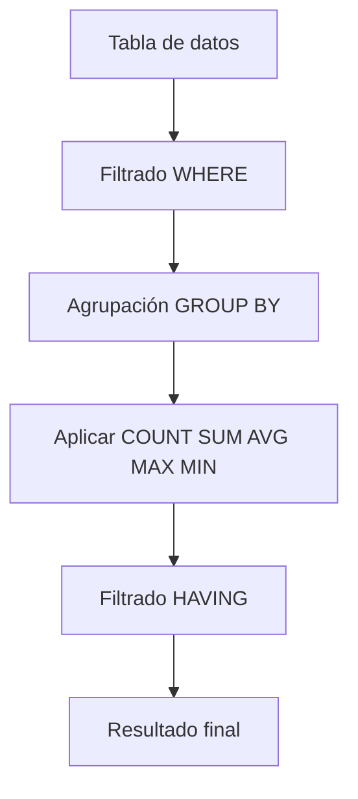
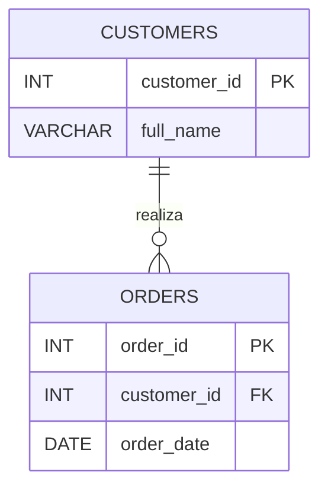

# Consultas Básicas con SQL: Agregación, Agrupación y Gestión de Datos

# 1. Visión para Principiantes

Las consultas SQL no solo permiten recuperar registros individuales, sino también **analizar grandes cantidades de información**. En la práctica, muchas veces no interesa ver cada fila de una tabla, sino obtener estadísticas o resúmenes, por ejemplo:

* ¿Cuántos tickets de soporte existen?
* ¿Cuál es el promedio de horas de resolución?
* ¿Qué agente resolvió más incidencias?
* ¿Cuál fue el tiempo máximo de resolución?

Para responder este tipo de preguntas, SQL ofrece:

* **Funciones de agregación**, que realizan cálculos sobre múltiples registros.
* **GROUP BY**, que agrupa registros con valores iguales.
* **HAVING**, que filtra grupos ya creados.

Estas herramientas son fundamentales para generar reportes, dashboards y análisis de datos.

---

# 2. Funciones de Agregación

## Visión para Principiantes

Las funciones de agregación reciben múltiples valores y devuelven **un único resultado**.

Por ejemplo, si una columna contiene 100 registros, una función de agregación puede calcular:

* El total.
* El promedio.
* El valor máximo.
* El valor mínimo.

## Funciones más utilizadas

| Función   | Descripción                      |
| --------- | -------------------------------- |
| `COUNT()` | Cuenta la cantidad de registros. |
| `SUM()`   | Suma valores numéricos.          |
| `AVG()`   | Calcula el promedio.             |
| `MAX()`   | Obtiene el valor más alto.       |
| `MIN()`   | Obtiene el valor más bajo.       |

---

# Profundidad Técnica

Las funciones de agregación operan sobre un **conjunto de filas** (conocido como *aggregate set*) y generan un único valor escalar.

Internamente, el motor de MySQL recorre los registros del conjunto y mantiene acumuladores temporales para producir el resultado final.

Estas funciones pueden utilizarse:

* Sobre toda la tabla.
* Sobre subconjuntos filtrados.
* Sobre grupos creados mediante `GROUP BY`.

---

# 3. Parámetros y Argumentos

## Visión para Principiantes

Aunque suelen confundirse, **parámetros** y **argumentos** no son lo mismo.

### Parámetro

Es la variable definida por una función.

Ejemplo conceptual:

```text
SUM(valor)
```

`valor` es el parámetro.

---

### Argumento

Es el dato real que recibe ese parámetro.

Ejemplo:

```sql
SUM(horas_resolucion)
```

Aquí `horas_resolucion` es el argumento enviado al parámetro de `SUM()`.

---

# 4. COUNT()

Cuenta el número de registros.

```sql
SELECT COUNT(*)
FROM tickets_soporte;
```

Contar tickets por prioridad.

```sql
SELECT prioridad,
       COUNT(*) AS total_tickets
FROM tickets_soporte
GROUP BY prioridad;
```

---

# 5. SUM()

Suma valores numéricos.

```sql
SELECT agente,
       SUM(horas_resolucion) AS horas_totales
FROM tickets_soporte
GROUP BY agente;
```

---

# 6. AVG()

Calcula el promedio.

```sql
SELECT agente,
       AVG(horas_resolucion) AS promedio_horas
FROM tickets_soporte
GROUP BY agente;
```

---

# 7. MAX() y MIN()

Obtienen los valores extremos.

```sql
SELECT agente,
       MIN(horas_resolucion) AS minimo,
       MAX(horas_resolucion) AS maximo
FROM tickets_soporte
WHERE horas_resolucion > 0
GROUP BY agente;
```

---

# 8. GROUP BY

## Visión para Principiantes

`GROUP BY` agrupa registros que poseen el mismo valor.

Sin agrupar:

```text
Laura
Laura
Laura
Marcos
Marcos
Sofía
```

Con `GROUP BY`:

```text
Laura
Marcos
Sofía
```

Cada grupo puede utilizar funciones de agregación.

---

## Profundidad Técnica

`GROUP BY` crea conjuntos lógicos de registros que comparten los mismos valores en una o más columnas.

Cada grupo genera exactamente una fila de salida.

---

## Regla de Oro de GROUP BY

Toda columna que aparezca en el `SELECT` y **no esté dentro de una función de agregación** debe aparecer en el `GROUP BY`.

Correcto:

```sql
SELECT agente,
       COUNT(*)
FROM tickets_soporte
GROUP BY agente;
```

Incorrecto:

```sql
SELECT agente,
       cliente,
       COUNT(*)
FROM tickets_soporte
GROUP BY agente;
```

`cliente` no pertenece al `GROUP BY` ni está agregada.

---

# Agrupación por múltiples columnas

```sql
SELECT cliente,
       prioridad,
       COUNT(*) AS total
FROM tickets_soporte
GROUP BY cliente, prioridad;
```

Cada combinación única de cliente y prioridad genera un grupo independiente.

---

# 9. HAVING

## Visión para Principiantes

`HAVING` filtra grupos.

Mientras `WHERE` filtra registros individuales, `HAVING` filtra el resultado de una agrupación.

---

Ejemplo

```sql
SELECT agente,
       AVG(horas_resolucion) AS promedio
FROM tickets_soporte
GROUP BY agente
HAVING AVG(horas_resolucion) > 6;
```

Solo aparecen agentes cuyo promedio supera seis horas.

---

Otro ejemplo

```sql
SELECT departamento,
       COUNT(*) AS total
FROM tickets_soporte
GROUP BY departamento
HAVING COUNT(*) > 3;
```

---

# WHERE vs HAVING

| WHERE                                | HAVING                                  |
| ------------------------------------ | --------------------------------------- |
| Filtra filas antes del agrupamiento. | Filtra grupos después del agrupamiento. |
| No utiliza funciones agregadas.      | Utiliza funciones agregadas.            |

---

# 10. Orden Lógico de Ejecución

Aunque una consulta se escribe de arriba hacia abajo, MySQL la procesa en otro orden.

## Orden real

1. FROM
2. WHERE
3. GROUP BY
4. HAVING
5. SELECT
6. ORDER BY
7. LIMIT

---

## Explicación

### FROM

Selecciona la tabla.

### WHERE

Filtra registros individuales.

### GROUP BY

Forma grupos.

### HAVING

Filtra grupos.

### SELECT

Calcula funciones y devuelve columnas.

### ORDER BY

Ordena resultados.

### LIMIT

Limita el número de filas.

---

# 11. Gestión de Datos: Crear Tablas desde Consultas

## ¿Qué es?

MySQL permite crear una tabla utilizando el resultado de una consulta.

Sintaxis

```sql
CREATE TABLE nueva_tabla AS
SELECT ...
```

---

## Casos de uso

* Análisis de datos.
* Copias temporales.
* Reportes.
* Transformaciones de información.

---

## Ejemplo

```sql
CREATE TABLE avg_horas_cliente AS
SELECT cliente,
       agente,
       AVG(horas_resolucion) AS promedio
FROM tickets_soporte
GROUP BY cliente, agente;
```

---

Crear respaldo

```sql
CREATE TABLE backup_tickets AS
SELECT *
FROM tickets_soporte;
```

---

## Ventajas

* Creación rápida.
* Ideal para reportes.
* Reduce procesamiento repetitivo.

---

## Limitaciones

La nueva tabla **no hereda**:

* Llaves primarias.
* Llaves foráneas.
* Índices.
* Restricciones.
* AUTO_INCREMENT.

Además, queda desacoplada de la tabla original.

---

# 12. Revisar la Estructura de una Tabla

## DESCRIBE

```sql
DESCRIBE products;
```

Muestra:

* Nombre.
* Tipo.
* Null.
* Llave.
* Valor por defecto.

---

## SHOW COLUMNS

```sql
SHOW COLUMNS
FROM products;
```

Información similar a `DESCRIBE`.

---

## SHOW CREATE TABLE

```sql
SHOW CREATE TABLE products;
```

Devuelve el SQL completo utilizado para crear la tabla.

---

## SHOW TABLE STATUS

```sql
SHOW TABLE STATUS
LIKE 'products';
```

Información adicional:

* Motor.
* Filas.
* Tamaño.
* Fecha de creación.

---

## INFORMATION_SCHEMA

Consultar columnas

```sql
SELECT *
FROM INFORMATION_SCHEMA.COLUMNS
WHERE TABLE_NAME='products'
AND TABLE_SCHEMA='campuslands_mysql';
```

---

# 13. Llaves Foráneas (Foreign Keys)

## Visión para Principiantes

Una llave foránea conecta dos tablas.

Ejemplo:

```text
Clientes
      │
      │ customer_id
      ▼
Pedidos
```

Cada pedido debe pertenecer a un cliente existente.

---

## ¿Para qué sirven?

* Mantener integridad referencial.
* Evitar datos huérfanos.
* Representar relaciones.
* Facilitar consultas JOIN.
* Permitir acciones en cascada.

---

## Crear una llave foránea

```sql
CREATE TABLE orders(

    order_id INT PRIMARY KEY,

    customer_id INT,

    order_date DATE,

    FOREIGN KEY(customer_id)

        REFERENCES customers(customer_id)

) ENGINE=InnoDB;
```

---

# Actualización y eliminación en cascada

Las claves foráneas pueden configurarse para propagar automáticamente cambios.

Ejemplo:

```sql
FOREIGN KEY(customer_id)

REFERENCES customers(customer_id)

ON UPDATE CASCADE

ON DELETE CASCADE;
```

Si un cliente cambia su identificador o es eliminado, las tablas relacionadas se actualizan automáticamente según la política definida.

---

# Glosario

| Término                | Definición                                                                       |
| ---------------------- | -------------------------------------------------------------------------------- |
| Función de agregación  | Función que calcula un único valor a partir de múltiples registros.              |
| COUNT                  | Cuenta registros.                                                                |
| SUM                    | Suma valores numéricos.                                                          |
| AVG                    | Calcula el promedio.                                                             |
| MAX                    | Obtiene el mayor valor.                                                          |
| MIN                    | Obtiene el menor valor.                                                          |
| GROUP BY               | Agrupa registros con valores iguales.                                            |
| HAVING                 | Filtra grupos creados por `GROUP BY`.                                            |
| WHERE                  | Filtra registros antes de agruparlos.                                            |
| Integridad referencial | Garantiza que las relaciones entre tablas sean válidas.                          |
| Llave foránea          | Restricción que enlaza una tabla con otra.                                       |
| INFORMATION_SCHEMA     | Base de datos del sistema que almacena metadatos sobre las estructuras de MySQL. |

---

# Diagramas de Flujo

## Orden lógico de ejecución de una consulta


---

## Flujo de una función de agregación



---

## Relación mediante llave foránea


