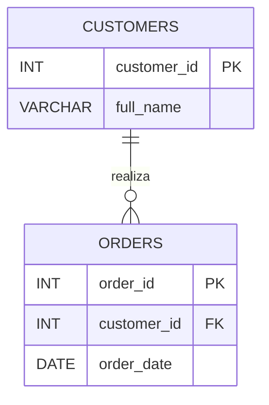
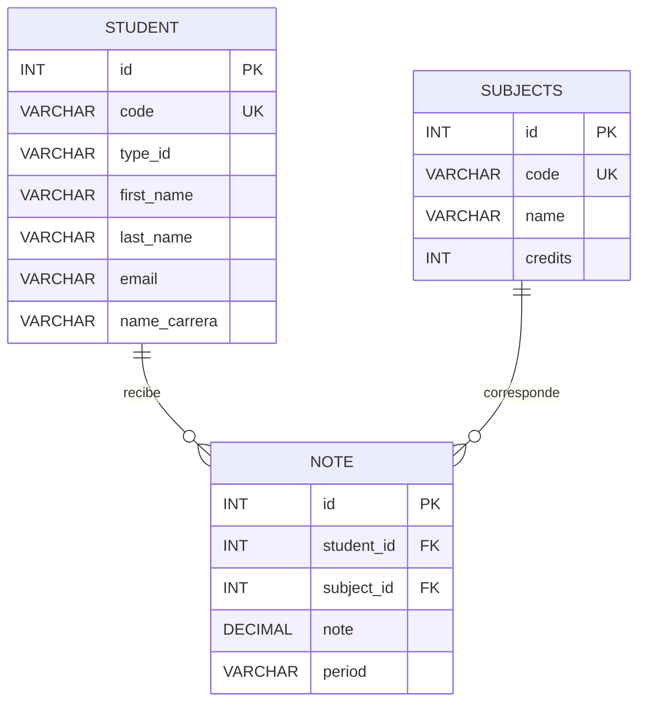

# Consultas básicas con SQL

## Agregación y agrupación de datos

Una de las capacidades más potentes de **MySQL** es realizar cálculos sobre un conjunto de filas para obtener información resumida.

Esto se logra principalmente mediante:

- **Funciones de agregación**.
- La cláusula `GROUP BY`.
- La cláusula `HAVING`, cuando se necesita filtrar grupos.

---

# Funciones de agregación

Las **funciones de agregación** toman múltiples valores como entrada, normalmente los valores de varias filas de una columna, y devuelven un único valor como resultado.

Las principales funciones de agregación son:

| Función | Descripción |
|---|---|
| `COUNT()` | Cuenta el número de filas o valores. |
| `SUM()` | Suma los valores de una columna numérica. |
| `AVG()` | Calcula el promedio de los valores de una columna numérica. |
| `MAX()` | Devuelve el valor máximo de una columna. |
| `MIN()` | Devuelve el valor mínimo de una columna. |

## Ejemplo conceptual

Si tenemos una columna con las horas de resolución:

```text
4.50
12.00
1.25
6.00
24.50
```

podemos utilizar funciones de agregación para obtener información resumida:

```sql
SELECT
    COUNT(horas_resolucion),
    SUM(horas_resolucion),
    AVG(horas_resolucion),
    MAX(horas_resolucion),
    MIN(horas_resolucion)
FROM tickets_soporte;
```

El resultado será una sola fila con los valores calculados sobre el conjunto de registros seleccionado.

---

# Parámetros y argumentos

Es importante diferenciar entre **parámetros** y **argumentos**.

## Parámetro

Un **parámetro** es una variable o elemento definido para recibir un valor.

Por ejemplo, conceptualmente:

```text
funcion(parametro)
```

El parámetro representa el lugar donde se recibirá un valor.

## Argumento

Un **argumento** es el valor concreto que se proporciona al parámetro cuando se utiliza una función o procedimiento.

Por ejemplo:

```text
funcion(10)
```

En este caso:

- `parametro` representa el elemento definido para recibir el valor.
- `10` es el argumento proporcionado.

### Diferencia resumida

| Concepto | Significado |
|---|---|
| **Parámetro** | Elemento definido para recibir un valor. |
| **Argumento** | Valor concreto que se proporciona al parámetro. |

> [!IMPORTANT]
> Una forma sencilla de recordarlo es: **el parámetro se define; el argumento se proporciona.**

---

# `GROUP BY`

`GROUP BY` permite agrupar filas que tienen valores iguales en una o varias columnas.

Su finalidad es formar grupos de registros y posteriormente permitir realizar operaciones de agregación sobre cada grupo.

Por ejemplo:

```sql
SELECT prioridad, COUNT(1)
FROM tickets_soporte
GROUP BY prioridad;
```

En este caso, los registros se agrupan según el valor de `prioridad` y `COUNT(1)` cuenta cuántos registros pertenecen a cada grupo.

---

# Regla importante de `GROUP BY`

Una regla fundamental al trabajar con `GROUP BY` es:

> **Los campos seleccionados que no forman parte de una función de agregación deben aparecer en `GROUP BY`.**

Por ejemplo:

```sql
SELECT agente, AVG(horas_resolucion)
FROM tickets_soporte
GROUP BY agente;
```

Aquí:

- `agente` no es una función de agregación.
- `AVG(horas_resolucion)` sí es una función de agregación.
- Por lo tanto, `agente` debe aparecer en `GROUP BY`.

---

# Propósitos de `GROUP BY`

Entre los principales propósitos de `GROUP BY` se encuentran:

- Agrupar valores idénticos de una tabla.
- Obtener una fila resumida por cada grupo de elementos únicos.
- Aplicar funciones de agregación sobre cada grupo.
- Obtener información resumida a partir de múltiples registros.

Por ejemplo:

```sql
SELECT departamento, COUNT(1)
FROM tickets_soporte
GROUP BY departamento;
```

Esta consulta genera un grupo por cada departamento y cuenta los tickets pertenecientes a cada uno.

---

# Diferencia entre una consulta normal y una consulta agrupada

Una consulta normal puede devolver una fila por cada registro:

```sql
SELECT cliente
FROM tickets_soporte;
```

Mientras que una consulta agrupada puede devolver una fila por cada grupo:

```sql
SELECT cliente, COUNT(1)
FROM tickets_soporte
GROUP BY cliente;
```

En la segunda consulta, los registros con el mismo cliente se agrupan y se obtiene un resumen para cada cliente.

---

# Orden lógico de ejecución de una consulta

Para evitar confusiones, es importante entender el **orden lógico en que MySQL procesa una consulta**.

Aunque las cláusulas se escriben en un orden específico, conceptualmente MySQL procesa las diferentes etapas en otro orden.

El orden lógico indicado en los apuntes es:

1. `FROM`
2. `WHERE`
3. `GROUP BY`
4. `HAVING`
5. `SELECT`
6. `ORDER BY`
7. `LIMIT`

---

## 1. `FROM`

Identifica la tabla o conjunto de datos sobre el que se trabajará.

```sql
FROM tickets_soporte
```

---

## 2. `WHERE`

Filtra las filas individuales antes de realizar la agrupación.

```sql
WHERE horas_resolucion > 0
```

---

## 3. `GROUP BY`

Agrupa las filas que quedaron después del filtro realizado por `WHERE`.

```sql
GROUP BY agente
```

---

## 4. `HAVING`

Filtra los grupos que ya fueron formados mediante `GROUP BY`.

```sql
HAVING AVG(horas_resolucion) > 6
```

---

## 5. `SELECT`

Define las columnas y expresiones que serán devueltas como resultado.

También es donde se presentan las funciones de agregación utilizadas en la consulta.

```sql
SELECT agente, AVG(horas_resolucion)
```

---

## 6. `ORDER BY`

Ordena los resultados obtenidos.

```sql
ORDER BY agente
```

---

## 7. `LIMIT`

Limita la cantidad de filas que finalmente se devuelven.

```sql
LIMIT 5
```

---

# Resumen del orden lógico

```text
FROM
  ↓
WHERE
  ↓
GROUP BY
  ↓
HAVING
  ↓
SELECT
  ↓
ORDER BY
  ↓
LIMIT
```

> [!IMPORTANT]
> Una diferencia fundamental es que **`WHERE` filtra filas individuales**, mientras que **`HAVING` filtra grupos después de realizar `GROUP BY`**.

---

# Base de datos para practicar agregaciones

Los siguientes comandos crean una tabla llamada `tickets_soporte` dentro de la base de datos `campuslands_mysql`.

```sql
-- CREATE DATABASE IF NOT EXISTS campus;
-- USE campus;

USE campuslands_mysql;

CREATE TABLE IF NOT EXISTS tickets_soporte (
    id INT PRIMARY KEY AUTO_INCREMENT,
    cliente VARCHAR(60) NOT NULL,
    departamento VARCHAR(40) NOT NULL,
    prioridad VARCHAR(15) NOT NULL,
    estado VARCHAR(20) NOT NULL,
    horas_resolucion DECIMAL(5,2) NOT NULL,
    agente VARCHAR(50) NOT NULL,
    fecha_creacion DATE NOT NULL
);
```

## Estructura de `tickets_soporte`

| Columna | Tipo | Característica |
|---|---|---|
| `id` | `INT` | `PRIMARY KEY`, `AUTO_INCREMENT` |
| `cliente` | `VARCHAR(60)` | `NOT NULL` |
| `departamento` | `VARCHAR(40)` | `NOT NULL` |
| `prioridad` | `VARCHAR(15)` | `NOT NULL` |
| `estado` | `VARCHAR(20)` | `NOT NULL` |
| `horas_resolucion` | `DECIMAL(5,2)` | `NOT NULL` |
| `agente` | `VARCHAR(50)` | `NOT NULL` |
| `fecha_creacion` | `DATE` | `NOT NULL` |

---

# Inserción de datos

Los siguientes registros se utilizan para realizar los ejercicios de agregación, agrupación y filtrado.

```sql
INSERT INTO tickets_soporte (cliente, departamento, prioridad, estado, horas_resolucion, agente, fecha_creacion) VALUES
('TechCorp', 'TI', 'Alta', 'Resuelto', 4.50, 'Laura Gómez', '2024-02-01'),
('Innovate Inc', 'Sistemas', 'Critica', 'Resuelto', 12.00, 'Marcos Ruiz', '2024-02-01'),
('DataSystems', 'Redes', 'Baja', 'Cerrado', 1.25, 'Laura Gómez', '2024-02-02'),
('Global Media', 'TI', 'Media', 'Resuelto', 6.00, 'Andrés Paez', '2024-02-02'),
('Beta Logistics', 'Facturacion', 'Alta', 'En Proceso', 0.00, 'Sofia Castro', '2024-02-03'),
('Alpha Retail', 'Sistemas', 'Critica', 'Resuelto', 24.50, 'Marcos Ruiz', '2024-02-03'),
('TechCorp', 'Redes', 'Media', 'Resuelto', 3.50, 'Laura Gómez', '2024-02-04'),
('Omni Group', 'TI', 'Baja', 'Cerrado', 2.00, 'Andrés Paez', '2024-02-05'),
('Delta Pharma', 'Facturacion', 'Alta', 'Resuelto', 8.20, 'Sofia Castro', '2024-02-05'),
('Innovate Inc', 'Sistemas', 'Media', 'En Proceso', 0.00, 'Marcos Ruiz', '2024-02-06'),
('SoftSolutions', 'TI', 'Alta', 'Resuelto', 5.10, 'Laura Gómez', '2024-02-06'),
('Global Media', 'Redes', 'Critica', 'Resuelto', 18.00, 'Andrés Paez', '2024-02-07'),
('Beta Logistics', 'Sistemas', 'Baja', 'Cerrado', 0.75, 'Marcos Ruiz', '2024-02-07'),
('DataSystems', 'TI', 'Media', 'Resuelto', 4.00, 'Sofia Castro', '2024-02-08'),
('Alpha Retail', 'Facturacion', 'Alta', 'Resuelto', 10.50, 'Sofia Castro', '2024-02-08'),
('TechCorp', 'TI', 'Critica', 'En Proceso', 0.00, 'Laura Gómez', '2024-02-09'),
('Omni Group', 'Redes', 'Media', 'Resuelto', 2.80, 'Andrés Paez', '2024-02-09'),
('Delta Pharma', 'Sistemas', 'Baja', 'Cerrado', 1.50, 'Marcos Ruiz', '2024-02-10'),
('Innovate Inc', 'Facturacion', 'Alta', 'Resuelto', 7.00, 'Sofia Castro', '2024-02-10'),
('SoftSolutions', 'Redes', 'Critica', 'Resuelto', 15.30, 'Andrés Paez', '2024-02-11'),
('Global Media', 'TI', 'Media', 'En Proceso', 0.00, 'Laura Gómez', '2024-02-11'),
('Beta Logistics', 'Facturacion', 'Baja', 'Cerrado', 1.00, 'Sofia Castro', '2024-02-12'),
('Alpha Retail', 'Sistemas', 'Alta', 'Resuelto', 9.00, 'Marcos Ruiz', '2024-02-12'),
('TechCorp', 'Redes', 'Critica', 'Resuelto', 20.00, 'Andrés Paez', '2024-02-13'),
('DataSystems', 'TI', 'Baja', 'Cerrado', 3.20, 'Laura Gómez', '2024-02-13'),
('Omni Group', 'Facturacion', 'Media', 'Resuelto', 5.50, 'Sofia Castro', '2024-02-14'),
('Delta Pharma', 'Redes', 'Alta', 'En Proceso', 0.00, 'Andrés Paez', '2024-02-14'),
('Innovate Inc', 'TI', 'Critica', 'Resuelto', 14.20, 'Laura Gómez', '2024-02-15'),
('SoftSolutions', 'Sistemas', 'Media', 'Resuelto', 6.80, 'Marcos Ruiz', '2024-02-15'),
('Global Media', 'Facturacion', 'Baja', 'Cerrado', 2.10, 'Sofia Castro', '2024-02-16'),
('Beta Logistics', 'TI', 'Alta', 'Resuelto', 8.00, 'Laura Gómez', '2024-02-16'),
('Alpha Retail', 'Redes', 'Critica', 'En Proceso', 0.00, 'Andrés Paez', '2024-02-17'),
('TechCorp', 'Sistemas', 'Media', 'Resuelto', 4.10, 'Marcos Ruiz', '2024-02-17'),
('DataSystems', 'Facturacion', 'Baja', 'Cerrado', 0.90, 'Sofia Castro', '2024-02-18'),
('Omni Group', 'TI', 'Alta', 'Resuelto', 11.00, 'Laura Gómez', '2024-02-18'),
('Delta Pharma', 'Redes', 'Critica', 'Resuelto', 16.50, 'Andrés Paez', '2024-02-19'),
('Innovate Inc', 'Sistemas', 'Media', 'Cerrado', 3.80, 'Marcos Ruiz', '2024-02-19'),
('SoftSolutions', 'Facturacion', 'Alta', 'En Proceso', 0.00, 'Sofia Castro', '2024-02-20'),
('Global Media', 'TI', 'Baja', 'Cerrado', 1.80, 'Laura Gómez', '2024-02-20'),
('Beta Logistics', 'Redes', 'Critica', 'Resuelto', 22.00, 'Andrés Paez', '2024-02-21'),
('Alpha Retail', 'TI', 'Media', 'Resuelto', 5.20, 'Laura Gómez', '2024-02-21'),
('TechCorp', 'Facturacion', 'Alta', 'Resuelto', 7.50, 'Sofia Castro', '2024-02-22'),
('DataSystems', 'Sistemas', 'Critica', 'En Proceso', 0.00, 'Marcos Ruiz', '2024-02-22'),
('Omni Group', 'Redes', 'Baja', 'Cerrado', 2.30, 'Andrés Paez', '2024-02-23'),
('Delta Pharma', 'TI', 'Media', 'Resuelto', 6.10, 'Laura Gómez', '2024-02-23'),
('Innovate Inc', 'Facturacion', 'Critica', 'Resuelto', 13.00, 'Sofia Castro', '2024-02-24'),
('SoftSolutions', 'Sistemas', 'Alta', 'Resuelto', 8.90, 'Marcos Ruiz', '2024-02-24'),
('Global Media', 'Redes', 'Media', 'En Proceso', 0.00, 'Andrés Paez', '2024-02-25'),
('Beta Logistics', 'TI', 'Baja', 'Cerrado', 1.10, 'Laura Gómez', '2024-02-25'),
('Alpha Retail', 'Facturacion', 'Critica', 'Resuelto', 19.40, 'Sofia Castro', '2024-02-26');
```

---

# Consultas de agregación y agrupación

## Contar tickets por prioridad

```sql
USE campuslands_mysql;

SELECT prioridad, COUNT(1)
FROM tickets_soporte
GROUP BY prioridad;
```

### Explicación

La consulta agrupa los tickets según su nivel de prioridad y cuenta cuántos tickets existen en cada grupo.

```sql
GROUP BY prioridad
```

crea un grupo para cada valor diferente de `prioridad`.

```sql
COUNT(1)
```

cuenta los registros pertenecientes a cada grupo.

---

# Contar tickets por cliente

```sql
SELECT cliente, COUNT(1)
FROM tickets_soporte
GROUP BY cliente;
```

Esta consulta genera un grupo por cada cliente y cuenta cuántos tickets pertenecen a cada uno.

---

# Sumar horas de resolución por agente

```sql
SELECT agente, SUM(horas_resolucion)
FROM tickets_soporte
GROUP BY agente;
```

### Explicación

La consulta agrupa los registros por agente y suma las horas de resolución correspondientes a cada agente.

- `agente`: define los grupos.
- `SUM(horas_resolucion)`: suma las horas de cada grupo.

---

# Calcular el promedio por agente

```sql
SELECT agente, AVG(HORAS_RESOLUCION)
FROM tickets_soporte
GROUP BY agente;
```

La consulta calcula el promedio de horas de resolución para cada agente.

La función:

```sql
AVG(horas_resolucion)
```

calcula el promedio de los valores de `horas_resolucion` pertenecientes a cada grupo.

---

# Obtener el mínimo y máximo por agente

```sql
SELECT agente, MIN(horas_resolucion), MAX(horas_resolucion)
FROM tickets_soporte
WHERE horas_resolucion > 0
GROUP BY agente
ORDER BY agente
LIMIT 5;
```

### Explicación

Esta consulta realiza varias operaciones en un orden lógico:

1. `FROM` selecciona `tickets_soporte`.
2. `WHERE` elimina de la operación las filas donde `horas_resolucion` no sea mayor que `0`.
3. `GROUP BY` agrupa los registros restantes por agente.
4. `MIN()` obtiene la menor cantidad de horas de cada agente.
5. `MAX()` obtiene la mayor cantidad de horas de cada agente.
6. `ORDER BY` ordena los grupos por nombre del agente.
7. `LIMIT 5` limita el resultado a cinco filas.

> [!IMPORTANT]
> El filtro `WHERE horas_resolucion > 0` ocurre antes del agrupamiento. Por lo tanto, los valores `0.00` no participan en `MIN()` ni `MAX()`.

---

# Agrupar por más de una columna

También es posible utilizar varias columnas en `GROUP BY`.

```sql
USE campuslands_mysql;

SELECT cliente, prioridad, COUNT(1)
FROM tickets_soporte
GROUP BY cliente, prioridad;
```

En este caso, los registros se agrupan utilizando la combinación de:

- `cliente`.
- `prioridad`.

Por lo tanto, cada combinación diferente de cliente y prioridad representa un grupo.

Por ejemplo, conceptualmente:

```text
TechCorp + Alta
TechCorp + Media
TechCorp + Critica
```

son grupos diferentes.

---

# `HAVING`

`HAVING` permite filtrar los grupos después de aplicar `GROUP BY`.

Una diferencia fundamental es:

```text
WHERE  → filtra filas
HAVING → filtra grupos
```

---

# Filtrar agentes por promedio

```sql
SELECT agente, AVG(horas_resolucion)
FROM tickets_soporte
GROUP BY agente
HAVING AVG(horas_resolucion) > 6;
-- HAVING FILTRA A NIVEL DE GRUPO
```

### Explicación

Primero:

```sql
GROUP BY agente
```

agrupa los tickets por agente.

Después:

```sql
AVG(horas_resolucion)
```

calcula el promedio de horas de cada agente.

Finalmente:

```sql
HAVING AVG(horas_resolucion) > 6
```

conserva únicamente los grupos cuyo promedio sea superior a `6`.

El comentario original:

```sql
-- HAVING FILTRA A NIVEL DE GRUPO
```

resume correctamente la finalidad de `HAVING`.

---

# Filtrar departamentos por cantidad de tickets

```sql
SELECT departamento, COUNT(1)
FROM tickets_soporte
GROUP BY departamento
HAVING COUNT(departamento) > 3;
```

### Explicación

La consulta:

1. Agrupa los tickets por departamento.
2. Cuenta los registros de cada departamento.
3. Conserva únicamente los departamentos que tienen más de tres registros.

```sql
HAVING COUNT(departamento) > 3
```

es el filtro aplicado sobre los grupos.

---

# `WHERE` + `GROUP BY` + `HAVING`

Es posible utilizar simultáneamente `WHERE` y `HAVING`.

```sql
SELECT agente, prioridad, COUNT(1)
FROM tickets_soporte
WHERE prioridad = 'Critica'
GROUP BY agente, prioridad
HAVING COUNT(departamento) > 3;
```

### Orden lógico

```text
FROM
  ↓
WHERE prioridad = 'Critica'
  ↓
GROUP BY agente, prioridad
  ↓
HAVING COUNT(departamento) > 3
  ↓
SELECT
```

En este caso:

- `WHERE` selecciona solamente tickets con prioridad `Critica`.
- `GROUP BY` agrupa esos tickets por agente y prioridad.
- `HAVING` filtra los grupos que tienen más de tres registros.

> [!IMPORTANT]
> `WHERE` se utiliza para filtrar filas **antes** de formar los grupos. `HAVING` se utiliza para filtrar los grupos **después** de haberlos formado.

---

# Filtrar tickets en proceso por agente

```sql
SELECT agente, estado, COUNT(*)
FROM tickets_soporte
WHERE estado = 'En Proceso'
GROUP BY agente, estado
HAVING COUNT(agente) > 1;
```

### Explicación

La consulta:

1. Selecciona únicamente los tickets cuyo estado es `En Proceso`.
2. Agrupa los registros por `agente` y `estado`.
3. Cuenta los registros de cada grupo.
4. Conserva los grupos donde la cantidad de agentes contados es superior a `1`.

---

# Gestión de datos SQL

## Creación de tablas a partir de consultas

SQL permite crear una nueva tabla utilizando como fuente el resultado de una consulta.

Esta técnica puede ser útil para diferentes situaciones.

### Usos comunes

#### Análisis de datos

Puede utilizarse para crear una tabla con un conjunto específico de datos necesario para realizar un análisis.

#### Backup temporal

Puede utilizarse para crear una copia temporal de una tabla o de una parte de ella para realizar operaciones de mantenimiento o pruebas.

#### Transformación de datos

Puede utilizarse para realizar transformaciones complejas que requieren múltiples pasos, almacenando resultados intermedios en una nueva tabla.

---

# `CREATE TABLE ... AS SELECT`

La estructura general es:

```sql
CREATE TABLE <NOMBRE_TABLA> AS
<consulta o query o SELECT>;
```

La consulta utilizada como fuente determina las columnas y los registros que serán almacenados en la nueva tabla.

---

# Crear una tabla con datos agregados

El apunte contiene el siguiente ejemplo:

```sql
CREATE TABLE IF NO EXISTS avg_horas_cliente AS
SELECT cliente,agente, AVG(horas_resolucion) AS promedio
GROUP BY cliente,agente;
```

> [!WARNING]
> **Posibles inconsistencias técnicas en el ejemplo original:**
>
> 1. La sintaxis correcta de `IF NOT EXISTS` es `IF NOT EXISTS`, no `IF NO EXISTS`.
> 2. Falta la cláusula `FROM tickets_soporte`.
>
> La forma corregida sería:

```sql
CREATE TABLE IF NOT EXISTS avg_horas_cliente AS
SELECT
    cliente,
    agente,
    AVG(horas_resolucion) AS promedio
FROM tickets_soporte
GROUP BY cliente, agente;
```

La consulta crea una tabla que contiene el promedio de horas de resolución agrupado por cliente y agente.

---

# Consultar la tabla creada

Los apuntes contienen:

```sql
SELECT * FROM avg_horas_agente_cliente;
```

> [!WARNING]
> **Posible inconsistencia técnica:** la tabla creada anteriormente se llama `avg_horas_cliente`, mientras que esta consulta utiliza `avg_horas_agente_cliente`. El nombre debe coincidir con el nombre real de la tabla que se haya creado.

---

# Crear una copia de una tabla

Los apuntes utilizan la siguiente consulta:

```sql
CREATE TABLE bkup_tikects_soprte AS
SELECT * FROM tickets_soporte;
```

Esta operación crea una nueva tabla utilizando todos los registros de `tickets_soporte`.

Conceptualmente:

```text
tickets_soporte
       │
       │ SELECT *
       ▼
bkup_tikects_soprte
```

> [!WARNING]
> El nombre `bkup_tikects_soprte` parece contener errores tipográficos respecto de `tickets_soporte`. Se conserva el nombre original de los apuntes.

---

# Consultar la copia

```sql
SELECT * FROM bkup_tickets_soporte;
```

> [!WARNING]
> Existe una diferencia entre el nombre utilizado para crear la tabla:

```text
bkup_tikects_soprte
```

y el utilizado para consultarla:

```text
bkup_tickets_soporte
```

Antes de ejecutar la consulta debe verificarse cuál es el nombre real de la tabla.

---

# Consideraciones al crear tablas a partir de consultas

## Eficiencia

Esta técnica permite crear rápidamente nuevas tablas a partir de datos existentes sin necesidad de insertar manualmente cada registro.

## Limitaciones

La tabla creada mediante `CREATE TABLE ... AS SELECT` no hereda necesariamente todas las características estructurales de la tabla original, como:

- Llaves primarias.
- Índices.
- Restricciones.

Por lo tanto, crear una tabla a partir de un `SELECT` no equivale necesariamente a realizar una copia estructural completa de la tabla original.

## Actualización de datos

La nueva tabla es independiente de la tabla original.

Si los datos de la tabla original cambian posteriormente, la nueva tabla **no se actualiza automáticamente**.

Por ejemplo:

```text
tickets_soporte
      │
      │ CREATE TABLE ... AS SELECT
      ▼
tabla_nueva
```

Después de crear `tabla_nueva`, ambas tablas contienen sus propios datos.

---

# Revisar la estructura de una tabla

MySQL proporciona diferentes instrucciones para consultar información sobre la estructura de una tabla.

---

## `DESCRIBE`

```sql
DESCRIBE <table_name>;
```

También puede utilizarse la abreviatura:

```sql
DESC <table_name>;
```

Estas instrucciones permiten obtener información sobre las columnas de una tabla.

Por ejemplo:

```sql
DESCRIBE products;
```

---

# `SHOW COLUMNS`

```sql
SHOW COLUMNS FROM <table_name>;
```

Muestra información sobre las columnas de una tabla.

Ejemplo:

```sql
SHOW COLUMNS FROM products;
```

---

# `SHOW CREATE TABLE`

```sql
SHOW CREATE TABLE <table_name>;
```

Muestra la sentencia SQL utilizada para crear la tabla.

Ejemplo:

```sql
SHOW CREATE TABLE products;
```

Esto permite observar la definición de la tabla, incluyendo elementos de su estructura.

---

# `SHOW TABLE STATUS`

```sql
SHOW TABLE STATUS LIKE '<table_name>';
```

Proporciona información más general sobre una tabla.

Ejemplo:

```sql
SHOW TABLE STATUS LIKE 'products';
```

---

# `INFORMATION_SCHEMA`

También es posible consultar información sobre las tablas mediante `INFORMATION_SCHEMA`.

Para consultar las columnas:

```sql
SELECT *
FROM INFORMATION_SCHEMA.COLUMNS
WHERE TABLE_NAME = '<table_name>';
```

Para consultar información sobre las tablas:

```sql
SELECT *
FROM INFORMATION_SCHEMA.TABLE
WHERE TABLE_NAME = '<table_name>';
```

> [!WARNING]
> **Posible inconsistencia técnica:** en MySQL, la vista utilizada habitualmente para obtener información sobre las tablas es `INFORMATION_SCHEMA.TABLES`, en plural. El apunte original utiliza `INFORMATION_SCHEMA.TABLE`, por lo que debe revisarse antes de ejecutarlo.

Una consulta más específica sobre las columnas puede incluir también el esquema:

```sql
SELECT *
FROM INFORMATION_SCHEMA.COLUMNS
WHERE TABLE_NAME = 'products'
  AND TABLE_SCHEMA = 'campuslands_mysql';
```

---

# Ejercicio completo: creación y manipulación de tablas

El siguiente código reúne diferentes operaciones practicadas anteriormente.

```sql
USE campuslands_mysql;

-- =====================================================
-- ELIMINAR TABLAS SI EXISTEN (OPCIONAL)
-- =====================================================

DROP TABLE IF EXISTS customers;
DROP TABLE IF EXISTS products;

-- =====================================================
-- CREAR TABLAS
-- =====================================================

CREATE TABLE IF NOT EXISTS customers (
    customer_id INT AUTO_INCREMENT PRIMARY KEY,
    full_name VARCHAR(60)
);

CREATE TABLE IF NOT EXISTS products (
    id_product INT AUTO_INCREMENT PRIMARY KEY,
    name_product VARCHAR(60),
    unit_price FLOAT
);

-- =====================================================
-- INSERTAR DATOS
-- =====================================================

INSERT INTO customers (full_name)
VALUES
('Ana'),
('Luis'),
('Carlos');

-- =====================================================
-- ACTUALIZAR DATOS
-- =====================================================

UPDATE customers
SET full_name = 'Ana Lucia'
WHERE customer_id = 1;

UPDATE customers
SET full_name = 'Jose Luis'
WHERE customer_id = 2;

UPDATE customers
SET full_name = 'Carlos Velasco'
WHERE customer_id = 3;

-- =====================================================
-- CONSULTAS
-- =====================================================

SELECT * FROM customers;

SELECT *
FROM customers
ORDER BY full_name DESC;

SELECT *
FROM customers
LIMIT 2;

SELECT *
FROM customers
ORDER BY full_name DESC
LIMIT 2;

-- =====================================================
-- ELIMINAR REGISTROS
-- =====================================================

DELETE FROM customers
WHERE customer_id = 3;

DELETE FROM customers
WHERE customer_id < 5
LIMIT 5;

-- =====================================================
-- REINICIAR TABLA
-- =====================================================

TRUNCATE TABLE customers;

-- =====================================================
-- INFORMACIÓN DE LA TABLA products
-- =====================================================

DESCRIBE products;

SHOW COLUMNS FROM products;

SHOW CREATE TABLE products;

SHOW TABLE STATUS LIKE 'products';

SELECT *
FROM INFORMATION_SCHEMA.COLUMNS
WHERE TABLE_NAME = 'products'
  AND TABLE_SCHEMA = 'campuslands_mysql';
```

---

# Creación de llaves foráneas

Una **llave foránea (`FOREIGN KEY`)** es una restricción que permite establecer una relación entre una columna de una tabla y una clave de otra tabla.

Las claves foráneas son fundamentales para mantener la **integridad referencial**.

---

# ¿Para qué sirven las claves foráneas?

## Mantener la integridad referencial

Las claves foráneas ayudan a asegurar que un valor almacenado en una tabla relacionada corresponda con un valor existente en la tabla referenciada.

Esto ayuda a prevenir inconsistencias como tener un registro que apunte a un elemento que no existe.

Ejemplo conceptual:

```text
customers
    │
    │ customer_id
    ▼
orders
    │
    │ customer_id
    └───────────────► customers.customer_id
```

Un pedido puede estar relacionado con un cliente existente mediante la clave foránea.

---

# Representar relaciones entre tablas

Las claves foráneas permiten representar relaciones lógicas entre diferentes conjuntos de datos.

Algunos ejemplos:

- Clientes y pedidos.
- Estudiantes y cursos.
- Productos y categorías.
- Empleados y departamentos.

Estas relaciones permiten construir estructuras de datos relacionadas en lugar de mantener toda la información en una única tabla.

---

# Facilitar consultas y operaciones `JOIN`

Al establecer relaciones mediante claves foráneas, resulta más sencillo construir consultas que trabajen con múltiples tablas.

Por ejemplo, una relación entre:

```text
customers
     │
     │ customer_id
     ▼
orders
```

permite posteriormente utilizar operaciones como `JOIN` para consultar información combinada de ambas tablas.

> [!NOTE]
> La clave foránea establece y documenta la relación entre las tablas. El rendimiento de una consulta `JOIN` también depende de factores como los índices, el volumen de datos y el diseño general de la base de datos.

---

# Actualización y eliminación en cascada

Las llaves foráneas pueden configurarse para realizar determinadas acciones en cascada.

Por ejemplo, una relación puede configurarse para que los cambios realizados sobre un registro de la tabla principal se reflejen automáticamente en registros relacionados.

Las acciones en cascada pueden utilizarse para:

- Actualizar registros relacionados.
- Eliminar registros relacionados.

Conceptualmente:

```text
Tabla padre
    │
    │ UPDATE / DELETE
    ▼
Tabla hija
    │
    └── Cambio aplicado según la configuración de la FOREIGN KEY
```

> [!IMPORTANT]
> Las acciones de cascada deben utilizarse cuidadosamente, especialmente `ON DELETE CASCADE`, porque eliminar un registro de la tabla padre puede provocar la eliminación automática de registros relacionados en la tabla hija.

---

# Ejemplo de `FOREIGN KEY`

```sql
USE campuslands_mysql;

DESCRIBE customers;

DROP TABLE IF EXISTS orders;

CREATE TABLE IF NOT EXISTS orders(
    order_id INT PRIMARY KEY,
    customer_id INT,
    order_date DATE,
    FOREIGN KEY (customer_id) REFERENCES customers(customer_id)
) ENGINE=INNODB;
```

## Explicación

La tabla `orders` contiene:

```sql
customer_id INT
```

Esta columna almacena el identificador del cliente asociado al pedido.

Posteriormente se define:

```sql
FOREIGN KEY (customer_id)
REFERENCES customers(customer_id)
```

Esto establece que `orders.customer_id` referencia a:

```text
customers.customer_id
```

La relación puede representarse de la siguiente manera:


```mermaid
erDiagram
    CUSTOMERS ||--o{ ORDERS : realiza

    CUSTOMERS {
        INT customer_id PK
        VARCHAR full_name
    }

    ORDERS {
        INT order_id PK
        INT customer_id FK
        DATE order_date
    }
```

---

# Motor `InnoDB`

En el ejemplo se especifica:

```sql
ENGINE=INNODB;
```

Esto indica que la tabla utilizará el motor de almacenamiento `InnoDB`.

El ejemplo utiliza este motor junto con una `FOREIGN KEY`.

---

# Ejemplo de una base de datos académica

Los apuntes incluyen un segundo ejemplo en el que se modela una estructura académica con:

- Materias.
- Estudiantes.
- Notas.

```sql
CREATE DATABASE IF NOT EXISTS acme_school;

USE acme_school;

CREATE TABLE IF NOT EXISTS subjects(
  id INT PRIMARY KEY AUTO_INCREMENT,
  code VARCHAR(6) UNIQUE,
  name VARCHAR(150) NOT NULL,
  credits INT CHECK(credits > 0 AND credits <= 10) DEFAULT 1
);

CREATE TABLE IF NOT EXISTS student(
  id INT PRIMARY KEY AUTO_INCREMENT,
  code VARCHAR(6) UNIQUE,
  type_id VARCHAR(50) NOT NULL,
  first_name VARCHAR(60) NOT NULL,
  last_name VARCHAR(60) NOT NULL,
  email VARCHAR(120) NOT NULL,
  name_carrera VARCHAR(120)
);

CREATE TABLE IF NOT EXISTS note(
    id INT PRIMARY KEY AUTO_INCREMENT,
    student_id INT,
    subject_id INT,
    note decimal CHECK(note > 0 AND note <= 100),
    period VARCHAR(120) NOT NULL,
    FOREIGN KEY(student_id) REFERENCES student(id),
    FOREIGN KEY(subject_id) REFERENCES subjects(id)
)ENGINE=INNODB;
```

---

# Tabla `subjects`

La tabla `subjects` representa las materias o asignaturas.

```sql
CREATE TABLE IF NOT EXISTS subjects(
  id INT PRIMARY KEY AUTO_INCREMENT,
  code VARCHAR(6) UNIQUE,
  name VARCHAR(150) NOT NULL,
  credits INT CHECK(credits > 0 AND credits <= 10) DEFAULT 1
);
```

## Columnas

| Columna | Tipo / restricción | Propósito |
|---|---|---|
| `id` | `INT PRIMARY KEY AUTO_INCREMENT` | Identificador de la materia. |
| `code` | `VARCHAR(6) UNIQUE` | Código único de la materia. |
| `name` | `VARCHAR(150) NOT NULL` | Nombre de la materia. |
| `credits` | `INT CHECK(...) DEFAULT 1` | Cantidad de créditos permitidos según la condición definida. |

La restricción:

```sql
CHECK(credits > 0 AND credits <= 10)
```

establece que el valor de `credits` debe ser mayor que `0` y menor o igual que `10`.

La restricción:

```sql
DEFAULT 1
```

establece `1` como valor predeterminado cuando no se proporciona uno para la columna.

---

# Tabla `student`

La tabla `student` representa a los estudiantes.

```sql
CREATE TABLE IF NOT EXISTS student(
  id INT PRIMARY KEY AUTO_INCREMENT,
  code VARCHAR(6) UNIQUE,
  type_id VARCHAR(50) NOT NULL,
  first_name VARCHAR(60) NOT NULL,
  last_name VARCHAR(60) NOT NULL,
  email VARCHAR(120) NOT NULL,
  name_carrera VARCHAR(120)
);
```

## Columnas

| Columna | Tipo / restricción |
|---|---|
| `id` | `INT PRIMARY KEY AUTO_INCREMENT` |
| `code` | `VARCHAR(6) UNIQUE` |
| `type_id` | `VARCHAR(50) NOT NULL` |
| `first_name` | `VARCHAR(60) NOT NULL` |
| `last_name` | `VARCHAR(60) NOT NULL` |
| `email` | `VARCHAR(120) NOT NULL` |
| `name_carrera` | `VARCHAR(120)` |

---

# Tabla `note`

La tabla `note` representa las notas asociadas a estudiantes y materias.

```sql
CREATE TABLE IF NOT EXISTS note(
    id INT PRIMARY KEY AUTO_INCREMENT,
    student_id INT,
    subject_id INT,
    note decimal CHECK(note > 0 AND note <= 100),
    period VARCHAR(120) NOT NULL,
    FOREIGN KEY(student_id) REFERENCES student(id),
    FOREIGN KEY(subject_id) REFERENCES subjects(id)
)ENGINE=INNODB;
```

La tabla contiene dos claves foráneas:

```sql
FOREIGN KEY(student_id) REFERENCES student(id)
```

y:

```sql
FOREIGN KEY(subject_id) REFERENCES subjects(id)
```

Por lo tanto, cada registro de `note` puede relacionarse con:

- Un estudiante de `student`.
- Una materia de `subjects`.

---

# Relaciones de la base de datos académica

La estructura puede representarse mediante el siguiente diagrama:


```mermaid
erDiagram
    STUDENT ||--o{ NOTE : recibe
    SUBJECTS ||--o{ NOTE : corresponde

    STUDENT {
        INT id PK
        VARCHAR code UK
        VARCHAR type_id
        VARCHAR first_name
        VARCHAR last_name
        VARCHAR email
        VARCHAR name_carrera
    }

    SUBJECTS {
        INT id PK
        VARCHAR code UK
        VARCHAR name
        INT credits
    }

    NOTE {
        INT id PK
        INT student_id FK
        INT subject_id FK
        DECIMAL note
        VARCHAR period
    }
```

La tabla `note` funciona como una tabla relacionada que conecta estudiantes y materias.

Conceptualmente:

```text
STUDENT
   │
   │ student_id
   ▼
 NOTE
   ▲
   │ subject_id
   │
SUBJECTS
```

---

# Conceptos principales aprendidos

## Agregación

Las funciones de agregación permiten transformar múltiples valores en un resultado resumido.

```sql
COUNT()
SUM()
AVG()
MAX()
MIN()
```

---

## Agrupación

`GROUP BY` permite formar grupos a partir de valores iguales.

```sql
SELECT agente, COUNT(1)
FROM tickets_soporte
GROUP BY agente;
```

---

## Filtrado de filas

`WHERE` filtra registros individuales antes de realizar la agrupación.

```sql
WHERE horas_resolucion > 0
```

---

## Filtrado de grupos

`HAVING` filtra los grupos después de ejecutar conceptualmente `GROUP BY`.

```sql
HAVING AVG(horas_resolucion) > 6
```

---

## Ordenamiento

`ORDER BY` ordena los resultados.

```sql
ORDER BY agente;
```

---

## Limitación de resultados

`LIMIT` restringe la cantidad de filas devueltas.

```sql
LIMIT 5;
```

---

## Creación de tablas mediante consultas

`CREATE TABLE ... AS SELECT` permite crear una tabla a partir del resultado de una consulta.

```sql
CREATE TABLE nueva_tabla AS
SELECT *
FROM tabla_original;
```

---

## Inspección de estructuras

MySQL permite revisar la estructura de las tablas mediante:

```sql
DESCRIBE tabla;
```

```sql
SHOW COLUMNS FROM tabla;
```

```sql
SHOW CREATE TABLE tabla;
```

```sql
SHOW TABLE STATUS LIKE 'tabla';
```

También puede consultarse información mediante `INFORMATION_SCHEMA`.

---

## Relaciones entre tablas

Las `FOREIGN KEY` permiten establecer relaciones entre tablas y ayudan a mantener la integridad referencial.

```sql
FOREIGN KEY (customer_id)
REFERENCES customers(customer_id);
```

---

# Errores e inconsistencias detectadas en los apuntes

Las siguientes observaciones corresponden a fragmentos originales que conviene revisar antes de ejecutarlos.

> [!WARNING]
> **`CREATE TABLE IF NO EXISTS`**
>
> En el ejemplo de creación de `avg_horas_cliente` aparece:
>
> ```sql
> CREATE TABLE IF NO EXISTS avg_horas_cliente AS
> ```
>
> La forma correcta es:
>
> ```sql
> CREATE TABLE IF NOT EXISTS avg_horas_cliente AS
> ```

> [!WARNING]
> **Falta `FROM` en `CREATE TABLE ... AS SELECT`**
>
> El ejemplo original:
>
> ```sql
> CREATE TABLE IF NO EXISTS avg_horas_cliente AS
> SELECT cliente,agente, AVG(horas_resolucion) AS promedio
> GROUP BY cliente,agente;
> ```
>
> no especifica la tabla de origen. La versión corregida sería:
>
> ```sql
> CREATE TABLE IF NOT EXISTS avg_horas_cliente AS
> SELECT
>     cliente,
>     agente,
>     AVG(horas_resolucion) AS promedio
> FROM tickets_soporte
> GROUP BY cliente, agente;
> ```

> [!WARNING]
> **Diferencia en nombres de tablas de respaldo**
>
> Se utiliza:
>
> ```sql
> bkup_tikects_soprte
> ```
>
> para crear una tabla y posteriormente:
>
> ```sql
> bkup_tickets_soporte
> ```
>
> para consultarla. Son nombres diferentes.

> [!WARNING]
> **`INFORMATION_SCHEMA.TABLE`**
>
> El apunte contiene:
>
> ```sql
> SELECT *
> FROM INFORMATION_SCHEMA.TABLE
> WHERE TABLE_NAME = '<table_name>';
> ```
>
> Debe revisarse porque la vista utilizada para información sobre tablas en MySQL es `INFORMATION_SCHEMA.TABLES`.

> [!WARNING]
> **Nombres originales conservados**
>
> Algunos nombres del ejercicio parecen contener errores tipográficos, como:
>
> ```text
> Facturacion
> Critica
> Sofia Castro
> ```
>
> No se modificaron los valores porque forman parte de los datos proporcionados en los apuntes.

---

# Resumen

En este tema se trabajaron diferentes operaciones fundamentales de SQL relacionadas con la consulta y gestión de datos.

Los conceptos principales son:

- **Funciones de agregación:** `COUNT()`, `SUM()`, `AVG()`, `MAX()` y `MIN()`.
- **`GROUP BY`:** permite agrupar registros y obtener resultados resumidos.
- **`WHERE`:** filtra filas antes de la agrupación.
- **`HAVING`:** filtra grupos después de la agrupación.
- **`ORDER BY`:** ordena los resultados.
- **`LIMIT`:** limita la cantidad de registros devueltos.
- **`CREATE TABLE ... AS SELECT`:** permite crear tablas a partir de consultas.
- **`DESCRIBE`:** permite revisar la estructura de una tabla.
- **`SHOW COLUMNS`:** muestra información sobre las columnas.
- **`SHOW CREATE TABLE`:** muestra la definición SQL de una tabla.
- **`SHOW TABLE STATUS`:** proporciona información general de una tabla.
- **`INFORMATION_SCHEMA`:** proporciona información sobre objetos y metadatos de la base de datos.
- **`FOREIGN KEY`:** permite establecer relaciones entre tablas y mantener la integridad referencial.
- **`CHECK`:** permite establecer condiciones que deben cumplir determinados valores.
- **`UNIQUE`:** evita valores duplicados en una columna o conjunto de columnas.
- **`PRIMARY KEY`:** identifica de forma única cada registro.
- **`INNODB`:** motor de almacenamiento utilizado en los ejemplos que contienen claves foráneas.

El orden lógico de procesamiento trabajado en los apuntes es:

```text
FROM
  ↓
WHERE
  ↓
GROUP BY
  ↓
HAVING
  ↓
SELECT
  ↓
ORDER BY
  ↓
LIMIT
```

La diferencia fundamental que conviene recordar es:

```text
WHERE  → filtra filas
HAVING → filtra grupos
```

# Glosario

| Término | Descripción |
|---|---|
| `Agregación` | Operación que resume múltiples valores y produce un resultado calculado. |
| `AVG()` | Función de agregación que calcula el promedio de un conjunto de valores. |
| `COUNT()` | Función de agregación utilizada para contar registros o valores. |
| `SUM()` | Función de agregación que suma valores numéricos. |
| `MAX()` | Función de agregación que obtiene el valor máximo. |
| `MIN()` | Función de agregación que obtiene el valor mínimo. |
| `GROUP BY` | Cláusula utilizada para agrupar filas que comparten determinados valores. |
| `HAVING` | Cláusula utilizada para filtrar grupos después de la agrupación. |
| `WHERE` | Cláusula utilizada para filtrar filas individuales. |
| `ORDER BY` | Cláusula utilizada para ordenar los resultados de una consulta. |
| `LIMIT` | Cláusula utilizada para limitar la cantidad de filas obtenidas. |
| `FOREIGN KEY` | Restricción que establece una referencia entre una columna de una tabla y una clave de otra tabla. |
| `PRIMARY KEY` | Restricción que identifica de forma única cada registro de una tabla. |
| `Integridad referencial` | Propiedad que busca mantener la coherencia entre registros relacionados mediante claves foráneas. |
| `JOIN` | Operación que permite combinar datos provenientes de múltiples tablas relacionadas. |
| `INNODB` | Motor de almacenamiento de MySQL utilizado en los ejemplos que trabajan con claves foráneas. |
| `CREATE TABLE ... AS SELECT` | Técnica para crear una tabla utilizando el resultado de una consulta como fuente de datos. |
| `DESCRIBE` | Instrucción utilizada para consultar la estructura y columnas de una tabla. |
| `INFORMATION_SCHEMA` | Conjunto de vistas que proporciona metadatos sobre objetos de una base de datos. |
| `CHECK` | Restricción que establece una condición que debe cumplir un valor. |
| `UNIQUE` | Restricción que impide valores duplicados en una columna o combinación de columnas. |
| `AUTO_INCREMENT` | Característica que genera automáticamente valores numéricos para una columna compatible. |
| `NOT NULL` | Restricción que impide almacenar valores `NULL` en una columna. |
| `Cascada` | Comportamiento configurado en una relación para propagar determinados cambios entre registros relacionados. |
| `Parámetro` | Elemento definido para recibir un valor. |
| `Argumento` | Valor concreto proporcionado a un parámetro. |
| `INFORMATION_SCHEMA.COLUMNS` | Vista de metadatos que proporciona información sobre las columnas de las tablas. |
| `DDL` | Data Definition Language; conjunto de instrucciones utilizadas para definir o modificar estructuras de bases de datos. |
| `DML` | Data Manipulation Language; conjunto de instrucciones utilizadas para manipular los datos. |