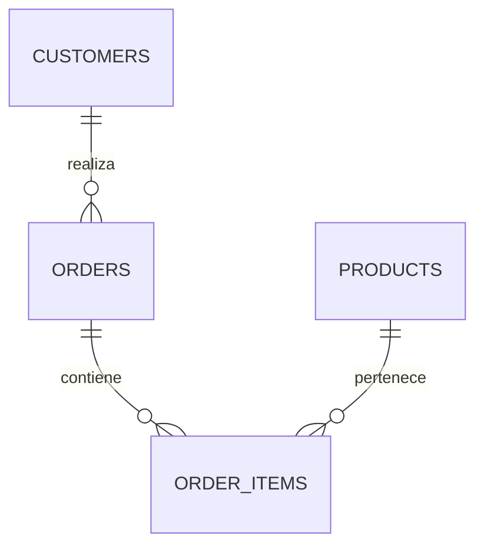
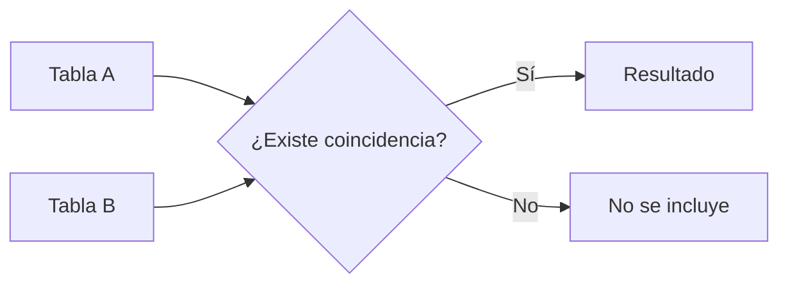
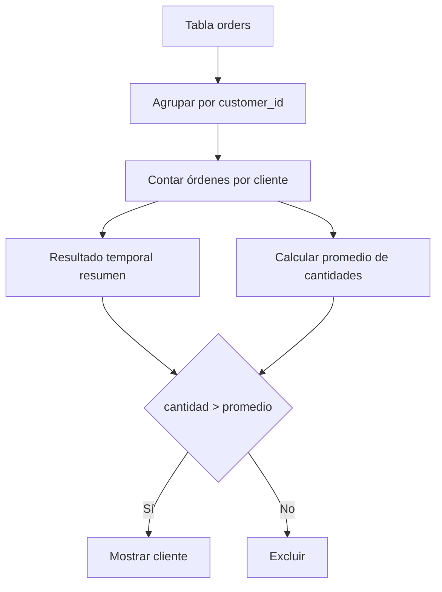
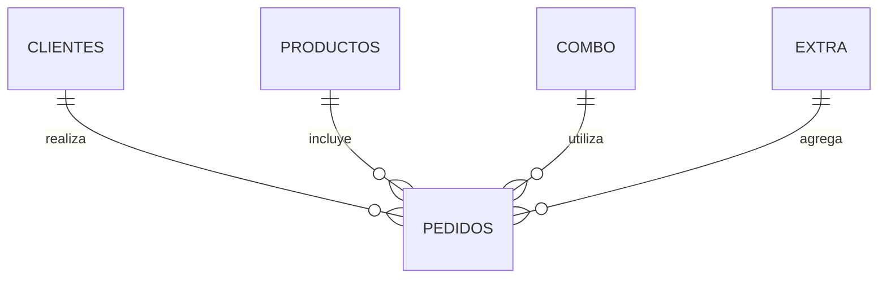
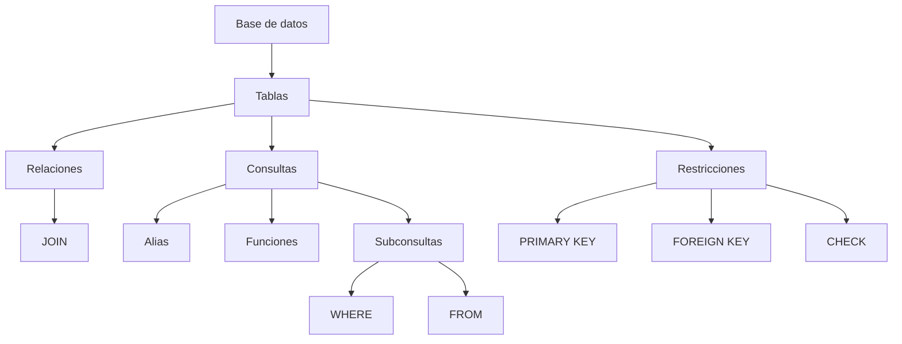

# SQL — Alias, funciones, JOIN, subconsultas y diseño de bases de datos

## Introducción

Estos apuntes reúnen conceptos y ejercicios relacionados con **SQL y el diseño de bases de datos**, especialmente:

- Uso de alias.
- Funciones de texto y numéricas.
- Funciones de agregación.
- Consultas con `JOIN`.
- Tipos de `JOIN`.
- Subconsultas o consultas anidadas.
- Subconsultas utilizadas en `WHERE` y `FROM`.
- Creación y relación de tablas.
- Restricciones como `PRIMARY KEY` y `FOREIGN KEY`.
- Ejercicios prácticos con MySQL.
- Progreso personal mediante consultas SQL.

El contenido utiliza principalmente **MySQL** y la base de datos `campuslands_mysql`.

---

# 1. Uso de alias

Un **alias** permite asignar un nombre temporal a una columna, tabla o resultado de una consulta.

Los alias son especialmente útiles cuando:

- El nombre original de una columna es largo o complejo.
- Se quiere mejorar la legibilidad de una consulta.
- Se utilizan funciones de agregación.
- Se trabaja con múltiples tablas.
- Se utilizan subconsultas.

> [!IMPORTANT]
> Un alias normalmente no modifica el nombre real de una columna o tabla en la base de datos. Se utiliza para representar temporalmente ese elemento dentro del resultado o de la consulta.

---

## 1.1. Alias para columnas

Si un campo tiene un nombre largo o complejo, podemos utilizar un alias para referirnos a él de una manera más sencilla.

### Ejemplo

```sql
SELECT registration_date AS reg_date
FROM employee;
````

En este caso:

* `registration_date` es el nombre original de la columna.
* `AS` permite definir el alias.
* `reg_date` es el nombre que tendrá la columna en el resultado.

---

## 1.2. Alias en funciones de agregación

Los alias también pueden utilizarse para asignar un nombre más descriptivo al resultado de una función de agregación.

```sql
SELECT AVG(salary) AS salary_avarage
FROM employee;
```

La función `AVG()` calcula el promedio de los valores de `salary`.

El resultado se muestra con el alias `salary_avarage`.

> [!WARNING]
> En el apunte original aparece `salary_avarage`. Aunque funciona como alias, el término inglés habitual es `salary_average`. El nombre original se conserva porque forma parte de los apuntes.

---

## 1.3. Alias en subconsultas

Las subconsultas utilizadas en `FROM` necesitan un nombre que permita referirse al resultado temporal.

Ejemplo original:

```sql
SELECT U.name
FROM (
    SELECT *
    FROM users
    WHERE age > 30
) AS U;
```

La consulta interna genera un conjunto de resultados y `AS U` le asigna el alias `U`.

La consulta externa puede utilizar posteriormente `U` para referirse a ese resultado.

---

# 2. Funciones SQL

Las funciones permiten realizar operaciones sobre los datos.

En estos apuntes aparecen funciones para:

* Manipular cadenas de texto.
* Convertir texto.
* Eliminar espacios.
* Obtener longitudes.
* Redondear números.
* Obtener la fecha y hora actual.
* Realizar agregaciones.
* Evaluar condiciones.

## 2.1. Funciones utilizadas

| Función                   | Descripción                                                    |
| ------------------------- | -------------------------------------------------------------- |
| `CONCAT(col1, col2, ...)` | Concatena dos o más cadenas de texto.                          |
| `UPPER(column)`           | Convierte una cadena a mayúsculas.                             |
| `LOWER(column)`           | Convierte una cadena a minúsculas.                             |
| `TRIM(column)`            | Elimina espacios en blanco al inicio y al final de una cadena. |
| `LENGTH(column)`          | Devuelve la longitud de una cadena.                            |
| `ROUND(column)`           | Redondea un número.                                            |
| `NOW()`                   | Devuelve la fecha y hora actual.                               |

> [!WARNING]
> En los apuntes originales aparece `COUNCAT(col1,col2,.....)`. La función de MySQL para concatenar cadenas es `CONCAT()`. Por esta razón, el ejemplo se documenta como `CONCAT()`, pero la observación original se considera un posible error tipográfico.

---

# 3. Ejemplos iniciales de SQL

Los siguientes ejemplos utilizan la base de datos `campuslands_mysql`.

```sql
USE campuslands_mysql;

SELECT COUNT(1) AS total_tickets
FROM tickets_soporte;

SELECT agente AS "asesor de negocios"
FROM tickets_soporte;

SELECT TS.cliente
FROM tickets_soporte AS TS;

SELECT employees.name, departments.department_name
FROM employees AS E
JOIN departments AS D
    ON E.department_id = D.id;
```

## Observaciones

Los ejemplos muestran diferentes usos de alias:

* `total_tickets` es un alias para el resultado de `COUNT(1)`.
* `"asesor de negocios"` es un alias para `agente`.
* `TS` es un alias para la tabla `tickets_soporte`.
* `E` y `D` representan las tablas `employees` y `departments`.

> [!WARNING]
> La consulta original de los apuntes utilizaba alias en el `FROM` de manera inconsistente:
>
> ```sql
> SELECT employees.name, departments.department_name
> FROM employees E
> JOIN departments
>     ON department_id = D.id;
> ```
>
> Para que el uso de `D` sea coherente, la versión documentada utiliza `AS D`. También se explicita la relación mediante los alias correspondientes.

---

# 4. Ejemplo completo de tablas y datos

Los siguientes comandos preparan un pequeño conjunto de datos para practicar consultas, `JOIN` y subconsultas.

## 4.1. Seleccionar la base de datos

```sql
USE campuslands_mysql;
```

---

## 4.2. Verificar la estructura de las tablas

```sql
-- Verificar estructura
DESCRIBE customers;
DESCRIBE orders;
DESCRIBE products;
```

`DESCRIBE` permite consultar la estructura de una tabla.

Puede utilizarse para observar información como:

* Nombre de las columnas.
* Tipos de datos.
* Si permiten valores `NULL`.
* Claves.
* Valores predeterminados.

---

## 4.3. Insertar clientes

```sql
-- Insertar clientes (solo si no existen)
INSERT IGNORE INTO customers (customer_id, full_name) VALUES
(1, 'Carlos'),
(2, 'Ana'),
(3, 'Luis');
```

`INSERT IGNORE` permite intentar insertar los registros ignorando determinados errores que impedirían la inserción normal.

En este ejercicio se utiliza con la intención indicada en el comentario original: insertar los clientes solamente cuando no exista un conflicto que impida la operación.

---

## 4.4. Insertar productos

```sql
-- Insertar productos (solo si no existen)
INSERT IGNORE INTO products (id_product, name_product, unit_price) VALUES
(101, 'Laptop', 1200),
(102, 'Mouse', 25),
(103, 'Teclado', 45),
(104, 'Monitor', 300);
```

Se insertan cuatro productos:

|    ID | Producto | Precio |
| ----: | -------- | -----: |
| `101` | Laptop   |   1200 |
| `102` | Mouse    |     25 |
| `103` | Teclado  |     45 |
| `104` | Monitor  |    300 |

---

## 4.5. Insertar órdenes

```sql
-- Insertar órdenes (solo si no existen)
INSERT IGNORE INTO orders (order_id, customer_id, order_date) VALUES
(1001, 1, '2024-01-05'),
(1002, 2, '2024-01-15'),
(1003, 2, '2024-02-02'),
(1004, 3, '2024-02-02'),
(1005, 1, '2024-02-05'),
(1006, 2, '2024-02-10'),
(1007, 1, '2024-02-10'),
(1008, 3, '2024-02-15'),
(1009, 2, '2024-03-01'),
(1010, 1, '2024-03-05'),
(1011, 3, '2024-03-10'),
(1012, 2, '2024-03-15'),
(1013, 1, '2024-03-18'),
(1014, 3, '2024-03-20');
```

Cada orden contiene:

* Un identificador.
* El identificador del cliente.
* La fecha de la orden.

La columna `customer_id` permite relacionar las órdenes con los clientes.

---

# 5. Tabla de detalle de órdenes

Antes de crear la tabla de detalle, se elimina una versión existente:

```sql
-- Eliminar la tabla de detalle si existe
DROP TABLE IF EXISTS order_items;
```

Después se crea la tabla:

```sql
-- Crear tabla de detalle
CREATE TABLE IF NOT EXISTS order_items (
    item_id INT PRIMARY KEY,
    order_id INT NOT NULL,
    product_id INT NOT NULL,
    quantity INT NOT NULL,

    CONSTRAINT fk_order_items_orders
        FOREIGN KEY (order_id)
        REFERENCES orders(order_id),

    CONSTRAINT fk_order_items_products
        FOREIGN KEY (product_id)
        REFERENCES products(id_product)
) ENGINE=InnoDB;
```

## Estructura

La tabla `order_items` representa el detalle de las órdenes.

Sus columnas principales son:

| Columna      | Tipo  | Propósito                           |
| ------------ | ----- | ----------------------------------- |
| `item_id`    | `INT` | Identificador del detalle.          |
| `order_id`   | `INT` | Identifica la orden relacionada.    |
| `product_id` | `INT` | Identifica el producto relacionado. |
| `quantity`   | `INT` | Cantidad del producto.              |

## Relaciones

Existen dos claves foráneas:

```sql
CONSTRAINT fk_order_items_orders
    FOREIGN KEY (order_id)
    REFERENCES orders(order_id)
```

Relaciona `order_items.order_id` con `orders.order_id`.

```sql
CONSTRAINT fk_order_items_products
    FOREIGN KEY (product_id)
    REFERENCES products(id_product)
```

Relaciona `order_items.product_id` con `products.id_product`.

La estructura puede visualizarse conceptualmente como:



---

## 5.1. Insertar detalles de órdenes

```sql
-- Insertar detalle de órdenes
INSERT INTO order_items (item_id, order_id, product_id, quantity) VALUES
(1,1001,101,2),
(2,1001,102,5),
(3,1001,103,3),
(4,1002,101,1),
(5,1002,104,2),
(6,1003,102,4),
(7,1004,101,3),
(8,1004,103,2),
(9,1004,104,1),
(10,1004,102,6),
(11,1005,104,1),
(12,1006,103,5),
(13,1007,101,1),
(14,1008,101,2),
(15,1009,102,10),
(16,1010,102,8),
(17,1011,104,2),
(18,1012,101,1),
(19,1013,103,4),
(20,1014,102,3);
```

---

## 5.2. Verificar los datos

```sql
-- Verificar
SELECT * FROM customers;
SELECT * FROM products;
SELECT * FROM orders;
SELECT * FROM order_items;
SELECT * FROM tickets_soporte;
```

Estas consultas permiten comprobar visualmente los registros existentes en las tablas.

---

# 6. Funciones de texto

## 6.1. `CONCAT()`

`CONCAT()` permite unir varias cadenas de texto.

```sql
SELECT CONCAT(departamento, ' - ', UPPER(agente)) AS agentes
FROM tickets_soporte;
```

La consulta:

1. Obtiene el valor de `departamento`.
2. Agrega el texto `' - '`.
3. Convierte `agente` a mayúsculas mediante `UPPER()`.
4. Une los resultados mediante `CONCAT()`.
5. Presenta el resultado con el alias `agentes`.

---

## 6.2. `UPPER()`

Convierte una cadena a mayúsculas.

```sql
SELECT UPPER(agente) AS agente
FROM tickets_soporte;
```

---

## 6.3. `LOWER()`

Convierte una cadena a minúsculas.

```sql
SELECT LOWER(departamento) AS departamento
FROM tickets_soporte;
```

---

## 6.4. `TRIM()`

`TRIM()` elimina espacios en blanco al principio y al final de una cadena.

```sql
SELECT TRIM(CONCAT(' - ', departamento, ' - ')) AS departamento
FROM tickets_soporte;
```

---

## 6.5. `LENGTH()`

`LENGTH()` devuelve la longitud de una cadena.

```sql
SELECT departamento, LENGTH(departamento)
FROM tickets_soporte;
```

---

## 6.6. `SUBSTRING()`

`SUBSTRING()` permite obtener una parte de una cadena.

```sql
SELECT SUBSTRING("hola campers!", 6, 3) AS result;
```

En este ejemplo se obtiene una parte de la cadena y se presenta mediante el alias `result`.

También puede combinarse con `CONCAT()`:

```sql
SELECT CONCAT(
    SUBSTRING("hola campers!", 6, 3),
    SUBSTRING("hola campers!", 9)
) AS result;
```

---

## 6.7. Cadenas literales

También es posible seleccionar directamente una cadena de texto:

```sql
SELECT "hola campers!" AS result;
```

El resultado se presenta mediante el alias `result`.

---

# 7. Funciones numéricas y de fecha

## 7.1. `ROUND()`

`ROUND()` permite redondear valores numéricos.

```sql
SELECT ROUND(horas_resolucion, 2) AS horas
FROM tickets_soporte;
```

En este caso, el valor de `horas_resolucion` se redondea a dos posiciones decimales.

---

## 7.2. `NOW()`

`NOW()` devuelve la fecha y hora actual del servidor o del contexto de ejecución de MySQL.

```sql
SELECT NOW();
```

---

# 8. Funciones condicionales

MySQL permite utilizar `IF()` para devolver diferentes valores dependiendo de una condición.

## 8.1. Ejemplo básico

```sql
SELECT IF(
    horas_resolucion > 4,
    "Retraso",
    "A tiempo"
) AS horas
FROM tickets_soporte;
```

La estructura puede entenderse como:

```text
IF(condición, valor_si_verdadero, valor_si_falso)
```

En este caso:

* Si `horas_resolucion > 4`, devuelve `"Retraso"`.
* Si la condición es falsa, devuelve `"A tiempo"`.

---

## 8.2. Condiciones combinadas

También pueden utilizarse operadores lógicos dentro de `IF()`.

```sql
SELECT
    agente,
    horas_resolucion,
    IF(
        horas_resolucion > 4
        AND prioridad = "critica",
        "Retraso",
        "A tiempo"
    ) AS estado
FROM tickets_soporte;
```

Aquí la condición requiere que se cumplan ambas condiciones:

1. `horas_resolucion > 4`.
2. `prioridad = "critica"`.

Solo cuando ambas son verdaderas se obtiene `"Retraso"`.

---

# 9. Diseño de bases de datos

## 9.1. ¿Qué es el diseño de una base de datos?

El diseño de una base de datos es un proceso fundamental en el desarrollo de sistemas que necesitan almacenar y manipular información de manera eficiente.

Este proceso implica definir:

* La estructura de la base de datos.
* Las tablas.
* Las relaciones entre las tablas.
* Los tipos de datos que se almacenarán.

El diseño adecuado permite organizar la información y establecer cómo se relacionan las diferentes partes de los datos.

---

# 10. Conceptos relacionados

Dentro de los conceptos estudiados aparecen:

* `JOIN`.
* Índices.
* Vistas.
* Subconsultas.
* Relaciones entre tablas.

Estos mecanismos permiten consultar, relacionar y trabajar con información almacenada en diferentes estructuras de una base de datos.

---

# 11. JOIN

Las operaciones conocidas como **JOIN** permiten unir tablas para obtener información relacionada.

En SQL, los `JOIN` permiten combinar información procedente de diferentes tablas utilizando una condición de relación.

Los tipos principales estudiados en estos apuntes son:

* `INNER JOIN`.
* `LEFT JOIN`.
* `RIGHT JOIN`.
* `FULL OUTER JOIN`.

---

# 12. INNER JOIN

`INNER JOIN` devuelve únicamente las filas que tienen una coincidencia en ambas tablas.

Conceptualmente, puede entenderse como la **intersección** de dos conjuntos.



## Ejemplo

```sql
SELECT *
FROM customers AS C
INNER JOIN orders AS O
    ON C.customer_id = O.customer_id;
```

La consulta relaciona clientes con órdenes mediante `customer_id`.

Solo aparecen los registros que tienen coincidencia entre ambas tablas.

---

# 13. LEFT JOIN

`LEFT JOIN` devuelve todas las filas de la tabla izquierda.

Si una fila de la tabla izquierda no tiene una coincidencia en la tabla derecha, las columnas correspondientes a la tabla derecha tendrán valores `NULL`.

Ejemplo:

```sql
SELECT *
FROM customers AS C
LEFT JOIN orders AS O
    ON C.customer_id = O.customer_id;
```

Esto permite visualizar todos los clientes, incluso aquellos que no tienen órdenes relacionadas.

---

# 14. RIGHT JOIN

`RIGHT JOIN` funciona de manera equivalente a `LEFT JOIN`, pero tomando como referencia la tabla derecha.

Devuelve todas las filas de la tabla derecha y, cuando no existe coincidencia en la tabla izquierda, las columnas correspondientes a esta tendrán `NULL`.

Ejemplo:

```sql
SELECT *
FROM orders AS O
RIGHT JOIN customers AS C
    ON C.customer_id = O.customer_id;
```

---

# 15. FULL OUTER JOIN

`FULL OUTER JOIN` combina conceptualmente los resultados de un `LEFT JOIN` y un `RIGHT JOIN`.

Devuelve las filas que tienen coincidencia y también las filas que existen únicamente en una de las dos tablas.

> [!WARNING]
> MySQL no proporciona `FULL OUTER JOIN` como una operación `JOIN` nativa. Puede simularse combinando `LEFT JOIN` y `RIGHT JOIN`, normalmente mediante `UNION`.

---

## 15.1. Simulación mediante `UNION`

Ejemplo de los apuntes:

```sql
SELECT
    C.customer_id,
    full_name,
    order_date
FROM customers C
LEFT JOIN orders O
    ON C.customer_id = O.customer_id

UNION

SELECT
    C.customer_id,
    full_name,
    order_date
FROM orders O
RIGHT JOIN customers C
    ON C.customer_id = O.customer_id;
```

La idea es combinar los resultados de ambas operaciones para aproximar el comportamiento de un `FULL OUTER JOIN`.

---

# 16. Comparación de JOIN

| Tipo de `JOIN`    | Resultado principal                                                                 |
| ----------------- | ----------------------------------------------------------------------------------- |
| `INNER JOIN`      | Solo filas con coincidencia en ambas tablas.                                        |
| `LEFT JOIN`       | Todas las filas de la tabla izquierda y las coincidencias de la derecha.            |
| `RIGHT JOIN`      | Todas las filas de la tabla derecha y las coincidencias de la izquierda.            |
| `FULL OUTER JOIN` | Todas las filas de ambas tablas, tengan o no coincidencia. En MySQL debe simularse. |

---

# 17. Ejemplos de JOIN con las tablas del ejercicio

## 17.1. Clientes y órdenes

```sql
SELECT *
FROM customers C
INNER JOIN orders O
    ON C.customer_id = O.customer_id;
```

También puede escribirse utilizando `AS`:

```sql
SELECT *
FROM customers AS c
INNER JOIN orders AS o
    ON c.customer_id = o.customer_id;
```

El alias no cambia la relación entre las tablas; únicamente facilita la escritura y lectura de la consulta.

---

## 17.2. Productos y detalles de órdenes

```sql
SELECT *
FROM products P
INNER JOIN order_items OI
    ON P.id_product = OI.product_id;
```

Aquí:

* `products` representa los productos.
* `order_items` representa el detalle de las órdenes.
* `P` es el alias de `products`.
* `OI` es el alias de `order_items`.
* `P.id_product = OI.product_id` establece la relación.

---

## 17.3. RIGHT JOIN

```sql
SELECT *
FROM orders O
RIGHT JOIN customers C
    ON C.customer_id = O.customer_id;
```

La tabla `customers` queda como tabla derecha y, por tanto, el `RIGHT JOIN` conserva todos sus registros.

---

# 18. Subconsultas o consultas anidadas

Una **subconsulta** o **consulta anidada** es una consulta SQL que se encuentra dentro de otra consulta.

Las subconsultas permiten utilizar el resultado de una consulta dentro de otra operación.

Pueden aparecer en diferentes partes de una sentencia SQL, entre ellas:

* `SELECT`.
* `FROM`.
* `WHERE`.
* `HAVING`.

> [!IMPORTANT]
> Una subconsulta puede utilizarse para obtener un valor, un conjunto de valores o un conjunto de resultados que posteriormente será utilizado por la consulta principal.

---

# 19. Subconsulta en `WHERE`

Una subconsulta en `WHERE` permite comparar los registros de la consulta principal con un valor o conjunto de resultados generado por otra consulta.

Ejemplo:

```sql
SELECT *
FROM tickets_soporte
WHERE horas_resolucion > (
    SELECT ROUND(AVG(horas_resolucion)) AS hrs_prom
    FROM tickets_soporte
);
```

## Funcionamiento

La subconsulta:

```sql
SELECT ROUND(AVG(horas_resolucion)) AS hrs_prom
FROM tickets_soporte
```

calcula el promedio de las horas de resolución y lo redondea.

La consulta externa obtiene los tickets cuya cantidad de horas de resolución es superior al valor obtenido por la subconsulta.

---

## 19.1. Otro ejemplo

```sql
SELECT *
FROM products
WHERE unit_price <= (
    SELECT ROUND(AVG(unit_price)) AS precio
    FROM products
);
```

La subconsulta obtiene el precio promedio redondeado.

La consulta principal devuelve los productos cuyo precio es menor o igual a ese promedio.

---

# 20. Subconsulta en `FROM`

Una subconsulta dentro de `FROM` puede utilizarse para crear un conjunto de resultados temporal que posteriormente será tratado como una tabla dentro de la consulta principal.

Ejemplo:

```sql
SELECT *
FROM (
    SELECT *
    FROM products p
    WHERE p.unit_price > (
        SELECT AVG(p.unit_price)
        FROM products
    )
) X
INNER JOIN order_items oi
    ON X.id_product = oi.product_id;
```

La subconsulta interna genera un conjunto temporal de productos cuyo precio supera el promedio.

Después, la consulta exterior utiliza ese resultado mediante el alias `X`.

> [!IMPORTANT]
> Cuando una subconsulta se utiliza directamente dentro de `FROM`, debe contar con un alias que permita identificar ese resultado temporal.

---

# 21. Ejemplo de tabla temporal mediante `FROM`

```sql
SELECT *
FROM (
    SELECT
        o.order_id,
        o.order_date,
        oi.quantity
    FROM orders o
    INNER JOIN order_items oi
        ON o.order_id = oi.order_id
    WHERE customer_id = 1
) temporal;
```

La consulta interna obtiene información sobre las órdenes y sus cantidades para un cliente determinado.

El resultado recibe el alias `temporal`.

La consulta exterior utiliza ese resultado como si fuera una tabla.

---

# 22. Consultas utilizadas durante la práctica

## 22.1. Seleccionar la base de datos

```sql
USE campuslands_mysql;
```

## 22.2. Consultar clientes

```sql
SELECT *
FROM customers;
```

## 22.3. Consultar la estructura de clientes

```sql
DESCRIBE customers;
```

## 22.4. Consultar la estructura de órdenes

```sql
DESCRIBE orders;
```

## 22.5. Insertar un cliente

```sql
INSERT IGNORE INTO customers(customer_id, full_name)
VALUES (5, 'pepe pardo');
```

---

# 23. Progreso propio

Esta sección conserva los ejercicios realizados como parte del progreso personal.

```sql
USE campuslands_mysql;

/*
-- ejercicio 01
SELECT *
FROM products p
WHERE p.unit_price > (
    SELECT ROUND(AVG(p.unit_price)) price
    FROM products
);

-- ejercicio 02
SELECT *
FROM customers c
WHERE c.customer_id IN (
    SELECT customer_id
    FROM orders
);
*/
```

> [!NOTE]
> Los ejercicios originales están dentro de un comentario SQL (`/* ... */`), por lo que no se ejecutan mientras permanezcan comentados.

---

# 24. Ejemplos antes de comenzar

Los siguientes ejercicios sirven como práctica previa de subconsultas.

## 24.1. Obtener el promedio de precios

```sql
SELECT AVG(unit_price)
FROM products;
```

La función `AVG()` calcula el promedio de la columna `unit_price`.

---

## 24.2. Productos cuyo precio es mayor que el promedio

```sql
-- Mostrar los productos cuyo precio sea mayor que el precio promedio.
SELECT *
FROM products
WHERE unit_price > (
    SELECT AVG(unit_price)
    FROM products
);
```

La subconsulta obtiene el precio promedio.

La consulta principal selecciona únicamente los productos cuyo `unit_price` es superior al promedio.

---

## 24.3. Productos cuyo precio es menor que el promedio

```sql
-- Mostrar los productos cuyo precio sea menor que el precio promedio.
SELECT *
FROM products
WHERE unit_price < (
    SELECT AVG(unit_price)
    FROM products
);
```

---

## 24.4. Producto más caro

```sql
-- Mostrar el producto más caro usando una subconsulta.
SELECT *
FROM products
WHERE unit_price = (
    SELECT MAX(unit_price)
    FROM products
);
```

`MAX()` devuelve el valor máximo de `unit_price`.

La consulta exterior busca los productos que tengan exactamente ese precio.

---

## 24.5. Producto más barato

```sql
-- Mostrar el producto más barato usando una subconsulta.
SELECT *
FROM products
WHERE unit_price = (
    SELECT MIN(unit_price)
    FROM products
);
```

`MIN()` devuelve el valor mínimo de `unit_price`.

---

## 24.6. Clientes que tienen al menos una orden

```sql
-- Mostrar los clientes que tienen al menos una orden.
SELECT *
FROM customers
WHERE customer_id IN (
    SELECT customer_id
    FROM orders
);
```

La subconsulta devuelve los identificadores de los clientes que aparecen en `orders`.

`IN` comprueba si el `customer_id` del cliente pertenece al conjunto de valores devuelto.

---

## 24.7. Clientes que nunca han realizado una orden

```sql
-- Mostrar los clientes que nunca han realizado una orden.
SELECT *
FROM customers
WHERE customer_id NOT IN (
    SELECT customer_id
    FROM orders
);
```

`NOT IN` realiza la operación inversa: selecciona los clientes cuyo identificador no aparece en el resultado de la subconsulta.

---

## 24.8. Órdenes pertenecientes al cliente con el ID más alto

```sql
-- Mostrar las órdenes pertenecientes al cliente con el ID más alto.
SELECT *
FROM orders
WHERE customer_id = (
    SELECT MAX(customer_id)
    FROM orders
);
```

La subconsulta obtiene el mayor `customer_id` presente en `orders`.

La consulta exterior obtiene las órdenes asociadas a ese identificador.

---

## 24.9. Segundo precio más alto

```sql
-- Mostrar el producto cuyo precio sea igual al segundo precio más alto.
SELECT *
FROM products
WHERE unit_price = (
    SELECT MAX(unit_price)
    FROM products
    WHERE unit_price < (
        SELECT MAX(unit_price)
        FROM products
    )
);
```

Esta consulta utiliza una subconsulta dentro de otra subconsulta.

El proceso conceptual es:

1. Obtener el precio máximo.
2. Buscar precios inferiores al máximo.
3. Obtener el máximo entre esos precios inferiores.
4. Buscar los productos cuyo precio sea igual a ese valor.

---

## 24.10. Productos entre el precio mínimo y máximo

```sql
-- Mostrar todos los productos cuyo precio sea mayor que el precio mínimo
-- pero menor que el precio máximo.
SELECT *
FROM products
WHERE unit_price > (
    SELECT MIN(unit_price)
    FROM products
)
AND unit_price < (
    SELECT MAX(unit_price) AS maximo
    FROM products
);
```

La consulta excluye los productos que tengan exactamente el precio mínimo o máximo.

---

# 25. Ejercicio 1 — Subconsulta en `WHERE`

**Nivel:** Fácil.

## Enunciado

Mostrar todos los productos cuyo precio sea mayor que el precio promedio.

## Solución utilizada

```sql
SELECT *
FROM products
WHERE unit_price > (
    SELECT AVG(unit_price)
    FROM products
);
```

La subconsulta obtiene el promedio y la consulta principal compara cada producto contra ese valor.

---

# 26. Ejercicio 2 — Primera tabla temporal

**Nivel:** Medio.

La consulta crea un resultado temporal dentro de `FROM` que resume la cantidad de órdenes por cliente.

```sql
SELECT *
FROM (
    SELECT
        customer_id,
        COUNT(*) AS cantidad_ordenes
    FROM orders
    GROUP BY customer_id
) resumen;
```

## Desglose

### Consulta interna

```sql
SELECT
    customer_id,
    COUNT(*) AS cantidad_ordenes
FROM orders
GROUP BY customer_id
```

Esta consulta agrupa las órdenes por `customer_id` y cuenta cuántas órdenes tiene cada cliente.

### Alias de la tabla temporal

```sql
) resumen;
```

El resultado de la subconsulta recibe el alias `resumen`.

---

# 27. Ejercicio 3 — `WHERE` + `FROM`

**Nivel:** Intermedio.

La consulta combina una subconsulta en `FROM` con otra subconsulta utilizada en `WHERE`.

```sql
SELECT *
FROM (
    SELECT
        customer_id,
        COUNT(*) AS cantidad
    FROM orders
    GROUP BY customer_id
) resumen
WHERE cantidad > (
    SELECT AVG(cantidad) AS promedio
    FROM (
        SELECT
            customer_id,
            COUNT(*) AS cantidad
        FROM orders
        GROUP BY customer_id
    ) x
);
```

## Estructura conceptual

La consulta puede dividirse en tres niveles:



## Explicación

La primera subconsulta obtiene la cantidad de órdenes de cada cliente.

```sql
SELECT
    customer_id,
    COUNT(*) AS cantidad
FROM orders
GROUP BY customer_id
```

Ese resultado se utiliza como una tabla temporal llamada `resumen`.

Después se calcula el promedio de las cantidades obtenidas:

```sql
SELECT AVG(cantidad) AS promedio
FROM (
    SELECT
        customer_id,
        COUNT(*) AS cantidad
    FROM orders
    GROUP BY customer_id
) x
```

Finalmente, la consulta principal muestra únicamente los registros cuya cantidad de órdenes es superior al promedio.

---

# 28. Diseño de una base de datos para una pizzería

Los apuntes incluyen una consulta para crear una base de datos llamada `pizeria`.

> [!WARNING]
> En el nombre original aparece `pizeria`. Si se pretendía escribir la palabra española "pizzería", podría tratarse de un error ortográfico en el nombre de la base de datos. Se conserva el nombre original en el código porque cambiarlo modificaría el contenido de los apuntes.

---

## 28.1. Crear la base de datos

```sql
DROP DATABASE IF EXISTS pizeria;
CREATE DATABASE IF NOT EXISTS pizeria;
USE pizeria;
```

### Explicación

```sql
DROP DATABASE IF EXISTS pizeria;
```

Elimina la base de datos si ya existe.

```sql
CREATE DATABASE IF NOT EXISTS pizeria;
```

Crea la base de datos si todavía no existe.

```sql
USE pizeria;
```

Selecciona la base de datos para las siguientes operaciones.

---

# 29. Eliminación de tablas

Antes de crear las tablas se eliminan determinadas tablas existentes:

```sql
DROP TABLE IF EXISTS pedidos;
DROP TABLE IF EXISTS productos;
DROP TABLE IF EXISTS cliente;
DROP TABLE IF EXISTS combo;
DROP TABLE IF EXISTS extra;
```

Esto permite comenzar con determinadas tablas eliminadas cuando ya existían.

> [!WARNING]
> El código elimina `cliente`, pero posteriormente crea una tabla llamada `clientes`. Esto puede ser una inconsistencia en los apuntes originales.

---

# 30. Tabla `productos`

```sql
CREATE TABLE IF NOT EXISTS productos(
    id INT AUTO_INCREMENT PRIMARY KEY,
    nombre VARCHAR(120) NOT NULL,
    precio DECIMAL(5,2) CHECK(precio > 0),
    ingredientes VARCHAR(250) NOT NULL,
    tipo VARCHAR(100) DEFAULT 'pizza'
);
```

## Columnas

| Columna        | Tipo           | Restricción / propósito                      |
| -------------- | -------------- | -------------------------------------------- |
| `id`           | `INT`          | Identificador de la tabla.                   |
| `nombre`       | `VARCHAR(120)` | Nombre del producto.                         |
| `precio`       | `DECIMAL(5,2)` | Precio, con una condición `CHECK`.           |
| `ingredientes` | `VARCHAR(250)` | Ingredientes del producto.                   |
| `tipo`         | `VARCHAR(100)` | Tipo del producto; por defecto es `'pizza'`. |

## Restricciones utilizadas

### `AUTO_INCREMENT`

Hace que MySQL genere automáticamente valores para el identificador.

### `PRIMARY KEY`

Define la clave primaria de la tabla.

### `NOT NULL`

Indica que la columna no debe almacenar valores `NULL`.

### `CHECK`

Permite establecer una condición que debe cumplirse.

En este caso:

```sql
CHECK(precio > 0)
```

establece que el precio debe ser mayor que `0`.

### `DEFAULT`

Define un valor predeterminado.

```sql
tipo VARCHAR(100) DEFAULT 'pizza'
```

Si no se proporciona un valor para `tipo`, se utilizará `'pizza'`.

---

# 31. Tabla `combo`

```sql
CREATE TABLE IF NOT EXISTS combo(
    id INT AUTO_INCREMENT PRIMARY KEY,
    precio DECIMAL(5,2) CHECK(precio > 0),
    complemento VARCHAR(250),
    descuento DECIMAL(5,2)
);
```

La tabla contiene:

| Columna       | Tipo           |
| ------------- | -------------- |
| `id`          | `INT`          |
| `precio`      | `DECIMAL(5,2)` |
| `complemento` | `VARCHAR(250)` |
| `descuento`   | `DECIMAL(5,2)` |

El precio también utiliza:

```sql
CHECK(precio > 0)
```

---

# 32. Tabla `extra`

```sql
CREATE TABLE IF NOT EXISTS extra(
    id INT AUTO_INCREMENT PRIMARY KEY,
    precio DECIMAL(5,2) CHECK(precio > 0),
    ingredientes VARCHAR(250)
);
```

La tabla almacena información relacionada con extras.

Sus columnas son:

* `id`.
* `precio`.
* `ingredientes`.

---

# 33. Tabla `clientes`

```sql
CREATE TABLE IF NOT EXISTS clientes(
    id INT AUTO_INCREMENT PRIMARY KEY,
    nombre VARCHAR(120) NOT NULL,
    apellido VARCHAR(120) NOT NULL,
    metodo_pago VARCHAR(120) NOT NULL,
    direccion VARCHAR(200),
    email VARCHAR(250),
    telefono VARCHAR(14)
);
```

## Estructura

| Columna       | Tipo           | Restricción                     |
| ------------- | -------------- | ------------------------------- |
| `id`          | `INT`          | `PRIMARY KEY`, `AUTO_INCREMENT` |
| `nombre`      | `VARCHAR(120)` | `NOT NULL`                      |
| `apellido`    | `VARCHAR(120)` | `NOT NULL`                      |
| `metodo_pago` | `VARCHAR(120)` | `NOT NULL`                      |
| `direccion`   | `VARCHAR(200)` | Opcional                        |
| `email`       | `VARCHAR(250)` | Opcional                        |
| `telefono`    | `VARCHAR(14)`  | Opcional                        |

---

# 34. Tabla `pedidos`

La tabla `pedidos` relaciona los pedidos con productos, clientes, combos y extras.

```sql
CREATE TABLE pedidos(
    id INT AUTO_INCREMENT PRIMARY KEY,
    nit VARCHAR(50),
    total DECIMAL(5,2) CHECK(total > 0),
    estado VARCHAR(120) NOT NULL DEFAULT 'en proceso',
    producto_id INT NOT NULL,
    cliente_id INT NOT NULL,
    adicional_id INT,
    extra_id INT,
    FOREIGN KEY (producto_id) REFERENCES productos(id),
    FOREIGN KEY (cliente_id) REFERENCES clientes(id),
    FOREIGN KEY (adicional_id) REFERENCES combo(id),
    FOREIGN KEY (extra_id) REFERENCES extra(id)
) ENGINE=InnoDB;
```

---

## 34.1. Columnas

| Columna        | Tipo           | Propósito                           |
| -------------- | -------------- | ----------------------------------- |
| `id`           | `INT`          | Identificador del pedido.           |
| `nit`          | `VARCHAR(50)`  | Almacena el NIT asociado al pedido. |
| `total`        | `DECIMAL(5,2)` | Total del pedido.                   |
| `estado`       | `VARCHAR(120)` | Estado del pedido.                  |
| `producto_id`  | `INT`          | Producto relacionado.               |
| `cliente_id`   | `INT`          | Cliente relacionado.                |
| `adicional_id` | `INT`          | Combo relacionado.                  |
| `extra_id`     | `INT`          | Extra relacionado.                  |

---

# 35. Claves foráneas de `pedidos`

La tabla utiliza cuatro relaciones mediante `FOREIGN KEY`.

## Producto

```sql
FOREIGN KEY (producto_id)
REFERENCES productos(id)
```

Relaciona `pedidos.producto_id` con `productos.id`.

## Cliente

```sql
FOREIGN KEY (cliente_id)
REFERENCES clientes(id)
```

Relaciona `pedidos.cliente_id` con `clientes.id`.

## Combo

```sql
FOREIGN KEY (adicional_id)
REFERENCES combo(id)
```

Relaciona `pedidos.adicional_id` con `combo.id`.

## Extra

```sql
FOREIGN KEY (extra_id)
REFERENCES extra(id)
```

Relaciona `pedidos.extra_id` con `extra.id`.

La estructura puede representarse conceptualmente mediante:



---

# 36. Conceptos importantes utilizados

## `PRIMARY KEY`

La **clave primaria** identifica de manera única cada registro de una tabla.

Ejemplo:

```sql
id INT AUTO_INCREMENT PRIMARY KEY
```

## `FOREIGN KEY`

Una **clave foránea** permite establecer una relación entre una columna de una tabla y una clave de otra tabla.

Ejemplo:

```sql
FOREIGN KEY (cliente_id)
REFERENCES clientes(id)
```

## `NOT NULL`

Indica que una columna debe contener un valor.

```sql
nombre VARCHAR(120) NOT NULL
```

## `DEFAULT`

Define un valor predeterminado:

```sql
estado VARCHAR(120) NOT NULL DEFAULT 'en proceso'
```

## `CHECK`

Define una condición que debe cumplirse:

```sql
CHECK(total > 0)
```

## `AUTO_INCREMENT`

Permite generar automáticamente nuevos identificadores numéricos.

## `DECIMAL`

Es un tipo de dato apropiado para valores numéricos con precisión decimal, como precios.

Ejemplo:

```sql
DECIMAL(5,2)
```

---

# 37. Relación entre los principales conceptos

Los conceptos estudiados pueden entenderse como diferentes herramientas para trabajar con una base de datos:



---

# 38. Consideraciones y posibles inconsistencias detectadas

## 38.1. `COUNCAT`

En los apuntes aparece:

```text
COUNCAT(col1,col2,.....)
```

La función utilizada en MySQL para concatenar cadenas es:

```sql
CONCAT(col1, col2, ...)
```

Por lo tanto, `COUNCAT` parece ser un error tipográfico.

---

## 38.2. `LAST_INSERT_ID`

En los apuntes se menciona indirectamente la importancia de detectar errores técnicos, aunque no se incluye una consulta concreta con esta función dentro del contenido principal.

Si aparece posteriormente una variante como:

```sql
LAST_INSERTE_ID()
```

debe revisarse, ya que la función de MySQL es:

```sql
LAST_INSERT_ID()
```

No debe modificarse un código original sin identificar explícitamente la corrección.

---

## 38.3. Alias en `JOIN`

La consulta original contiene una referencia a `D.id` sin definir explícitamente el alias `D`:

```sql
SELECT employees.name, departments.department_name
FROM employees E
JOIN departments
    ON department_id = D.id;
```

Para utilizar `D` como alias, la tabla debe recibir ese alias:

```sql
SELECT E.name, D.department_name
FROM employees AS E
JOIN departments AS D
    ON E.department_id = D.id;
```

La segunda consulta se presenta como una versión corregida para hacer explícita la intención de utilizar alias.

---

## 38.4. `cliente` frente a `clientes`

En la parte de creación de la base de datos se encuentra:

```sql
DROP TABLE IF EXISTS cliente;
```

pero posteriormente se crea:

```sql
CREATE TABLE IF NOT EXISTS clientes(
```

Esto puede representar una inconsistencia en el nombre de la tabla.

No debe asumirse automáticamente cuál de los dos nombres era el correcto.

---

## 38.5. Nombre de la base de datos `pizeria`

El código utiliza:

```sql
pizeria
```

El nombre puede ser intencional o contener un error ortográfico. Debido a que cambiarlo modificaría el código original, se conserva.

---

# 39. Resumen

En estos apuntes se estudian varias herramientas fundamentales de SQL.

Los **alias** permiten asignar nombres temporales a columnas, tablas y resultados, mejorando la legibilidad de las consultas.

Las **funciones SQL** permiten realizar operaciones sobre los datos, como:

* Concatenar texto mediante `CONCAT()`.
* Convertir texto a mayúsculas mediante `UPPER()`.
* Convertir texto a minúsculas mediante `LOWER()`.
* Eliminar espacios mediante `TRIM()`.
* Obtener longitudes mediante `LENGTH()`.
* Redondear valores mediante `ROUND()`.
* Obtener la fecha y hora mediante `NOW()`.

Los **JOIN** permiten relacionar información almacenada en diferentes tablas:

* `INNER JOIN`.
* `LEFT JOIN`.
* `RIGHT JOIN`.
* `FULL OUTER JOIN`, que en MySQL debe simularse.

Las **subconsultas** permiten utilizar una consulta dentro de otra y pueden aparecer en cláusulas como:

* `WHERE`.
* `FROM`.
* `SELECT`.
* `HAVING`.

Las subconsultas en `FROM` pueden generar resultados temporales que posteriormente son tratados como tablas y deben utilizar un alias.

En el diseño de bases de datos se utilizan restricciones como:

* `PRIMARY KEY`.
* `FOREIGN KEY`.
* `NOT NULL`.
* `CHECK`.
* `DEFAULT`.
* `AUTO_INCREMENT`.

Finalmente, los ejercicios muestran cómo combinar estos conceptos para consultar información, relacionar tablas, calcular valores agregados y construir estructuras de bases de datos relacionadas.

---

# Glosario

| Término               | Descripción                                                                                                               |
| --------------------- | ------------------------------------------------------------------------------------------------------------------------- |
| `Alias`               | Nombre temporal utilizado para representar una columna, tabla o resultado dentro de una consulta.                         |
| `AS`                  | Palabra clave utilizada para definir un alias.                                                                            |
| `JOIN`                | Operación que permite combinar información de diferentes tablas mediante una relación.                                    |
| `INNER JOIN`          | Devuelve únicamente las filas que tienen coincidencia en ambas tablas.                                                    |
| `LEFT JOIN`           | Devuelve todas las filas de la tabla izquierda y las coincidencias disponibles de la tabla derecha.                       |
| `RIGHT JOIN`          | Devuelve todas las filas de la tabla derecha y las coincidencias disponibles de la tabla izquierda.                       |
| `FULL OUTER JOIN`     | Conceptualmente devuelve todas las filas de ambas tablas, tengan o no coincidencia. MySQL no lo implementa directamente.  |
| `Subconsulta`         | Consulta SQL ubicada dentro de otra consulta.                                                                             |
| `Agregación`          | Operación que resume múltiples registros mediante funciones como `AVG()`, `COUNT()`, `MAX()` o `MIN()`.                   |
| `AVG()`               | Función que calcula el promedio de un conjunto de valores.                                                                |
| `COUNT()`             | Función que cuenta registros o valores.                                                                                   |
| `MAX()`               | Función que obtiene el valor máximo.                                                                                      |
| `MIN()`               | Función que obtiene el valor mínimo.                                                                                      |
| `CONCAT()`            | Función que concatena cadenas de texto.                                                                                   |
| `UPPER()`             | Función que convierte texto a mayúsculas.                                                                                 |
| `LOWER()`             | Función que convierte texto a minúsculas.                                                                                 |
| `TRIM()`              | Función que elimina espacios en blanco al inicio y al final de una cadena.                                                |
| `LENGTH()`            | Función que devuelve la longitud de una cadena.                                                                           |
| `ROUND()`             | Función que redondea un valor numérico.                                                                                   |
| `NOW()`               | Función que devuelve la fecha y hora actual.                                                                              |
| `IF()`                | Función condicional que devuelve un valor dependiendo de una condición.                                                   |
| `PRIMARY KEY`         | Restricción que identifica de manera única cada registro de una tabla.                                                    |
| `FOREIGN KEY`         | Restricción que establece una relación entre una columna y una clave de otra tabla.                                       |
| `CONSTRAINT`          | Restricción definida sobre una tabla para establecer reglas sobre sus datos.                                              |
| `CHECK`               | Restricción que exige que una condición sea verdadera para el valor almacenado.                                           |
| `NOT NULL`            | Restricción que impide almacenar valores `NULL` en una columna.                                                           |
| `DEFAULT`             | Valor utilizado automáticamente cuando no se proporciona uno para una columna.                                            |
| `AUTO_INCREMENT`      | Mecanismo de MySQL que genera automáticamente valores incrementales para una columna numérica.                            |
| `DECIMAL`             | Tipo de dato numérico utilizado para almacenar valores con precisión decimal.                                             |
| `NULL`                | Valor que representa la ausencia de un valor almacenado.                                                                  |
| `IN`                  | Operador que permite comprobar si un valor pertenece a un conjunto de resultados.                                         |
| `NOT IN`              | Operador que permite comprobar si un valor no pertenece a un conjunto de resultados.                                      |
| `GROUP BY`            | Cláusula utilizada para agrupar registros según una o más columnas.                                                       |
| `UNION`               | Operador que combina los resultados de dos consultas compatibles.                                                         |
| `DESCRIBE`            | Instrucción utilizada en MySQL para consultar la estructura de una tabla.                                                 |
| `InnoDB`              | Motor de almacenamiento de MySQL utilizado en las tablas del ejercicio.                                                   |
| `Subconsulta en FROM` | Subconsulta cuyo resultado se utiliza como una tabla temporal dentro de la consulta principal.                            |
| `Tabla temporal`      | Resultado intermedio que puede tratarse como una tabla dentro de una consulta, como ocurre con una subconsulta en `FROM`. |
