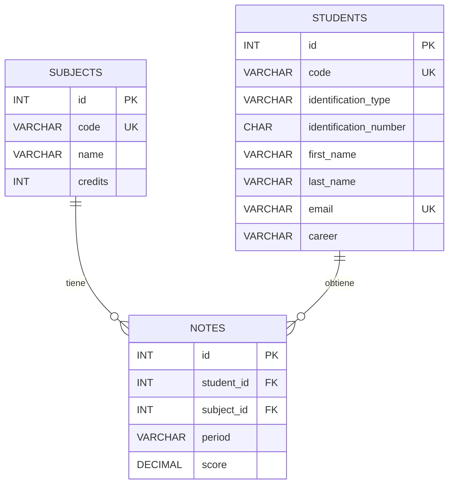

# Diseño de bases de datos: índices, vistas, claves y restricciones

## Introducción

En el diseño de bases de datos es importante definir estructuras que permitan **organizar, consultar, relacionar y proteger los datos** de manera eficiente.

Entre los conceptos estudiados se encuentran:

- **Índices**.
- **Vistas**.
- **Claves**.
- **Restricciones**.
- **Claves primarias (`PRIMARY KEY`)**.
- **Claves foráneas (`FOREIGN KEY`)**.
- **Restricciones de unicidad (`UNIQUE`)**.
- **Valores predeterminados (`DEFAULT`)**.
- **Restricciones de validación (`CHECK`)**.
- **Restricciones de nulidad (`NOT NULL`)**.
- **Generación automática de identificadores (`AUTO_INCREMENT`)**.

Estos elementos permiten mejorar el **rendimiento**, mantener la **integridad de los datos** y establecer relaciones entre las diferentes tablas de una base de datos.

---

# Índices

## ¿Qué es un índice?

Un **índice** es una estructura de datos especial que almacena información relacionada con una parte de una tabla, normalmente sobre las columnas que fueron seleccionadas para crear el índice.

El propósito principal de un índice es **acelerar las operaciones de búsqueda y consulta**, mejorando el rendimiento de las consultas que utilizan las columnas indexadas.

Una forma sencilla de entenderlo es compararlo con el índice de un libro: en lugar de revisar todas las páginas para encontrar un término, se puede consultar el índice para localizar rápidamente dónde se encuentra.

> [!IMPORTANT]
> Un índice está diseñado principalmente para mejorar el rendimiento de las operaciones de lectura y búsqueda.

## Ventajas y desventajas

Los índices deben utilizarse con cuidado.

Aunque pueden mejorar considerablemente la velocidad de lectura de los datos, también pueden **ralentizar las operaciones de escritura**, debido a que el índice debe actualizarse cuando los datos de la tabla cambian.

Por ejemplo, cuando se realiza una operación como:

- `INSERT`
- `UPDATE`
- `DELETE`

el motor de la base de datos puede necesitar actualizar los índices asociados a los datos modificados.

Por esta razón, la implementación de índices debe ser **estratégica y equilibrada**, dependiendo de las necesidades específicas de la base de datos y de su carga de trabajo predominante.

> [!TIP]
> Un índice no debe crearse simplemente sobre todas las columnas de una tabla. Es necesario considerar qué columnas se utilizan frecuentemente en búsquedas, filtros, relaciones y consultas.

---

# Creación de índices en MySQL

En MySQL se pueden construir diferentes tipos de índices, cada uno adaptado a determinadas necesidades.

Entre los tipos estudiados se encuentran:

- Índices simples.
- Índices compuestos.
- Índices únicos.
- Índices `FULLTEXT`.
- Índices espaciales (`SPATIAL`).

---

## Índices simples

Un índice simple se crea sobre una columna de una tabla.

### Sintaxis

```sql
CREATE INDEX <nombre_index>
ON <tabla>(<campo>);
```

Por ejemplo:

```sql
CREATE INDEX indx_customer_name
ON customers(full_name);
```

Este índice se crea sobre la columna `full_name` de la tabla `customers`.

---

## Índices compuestos

Un **índice compuesto** utiliza más de una columna.

Ejemplo:

```sql
CREATE INDEX indx_tickets_products
ON tickets_soprte(cliente, agente);
```

En este caso, el índice utiliza las columnas:

- `cliente`
- `agente`

> [!NOTE]
> Un índice compuesto permite indexar varias columnas como una misma estructura de índice. La elección y el orden de las columnas son importantes para determinar qué consultas pueden aprovecharlo de manera eficiente.

---

# Ejemplo de creación de índices

El siguiente ejemplo utiliza la base de datos `campuslands_mysql`.

```sql
USE campuslands_mysql;

DESCRIBE products;

-- CREATE INDEX <nombre_index> ON <tabla+(campos)>
-- CREATE INDEX indx_customer_name ON customers(full_name);

-- indice compuesto
-- CREATE INDEX indx_tickets_products ON tickets_soprte(cliente,agente)

-- ALTER TABLE products ADD COLUMN IF NOT EXISTS code VARCHAR(3);
SELECT * FROM products;

UPDATE products
SET code = id_product;

-- indice table fromIndice unico

-- CREATE UNIQUE INDEX indx_unq_product_code ON products(code);

-- INSERT INTO products (id_product, name,price,code) VALUES
--     (105, 'scanner', 200,104);

-- como se crea un indice de texto Completo
-- CREATE FULLTEXT INDEX idx_article ON article(content);

-- indices especiales
-- CREATE SPATIAL INDEX idx_location ON places(geo_point)

/*
CREATE DATABASE IF NOT EXISTS acne_school;
USE acne_school;
*/
```

### Observación sobre los comentarios originales

Los comentarios anteriores forman parte de los apuntes y muestran diferentes ejemplos de creación de índices.

Algunos comandos aparecen comentados, por lo que **no se ejecutan actualmente**.

---

# Índices únicos

Un índice único se utiliza cuando los valores de una columna, o combinación de columnas, deben ser únicos.

### Sintaxis

```sql
CREATE UNIQUE INDEX <nombre_index>
ON <tabla>(<campo>);
```

Ejemplo de los apuntes:

```sql
CREATE UNIQUE INDEX indx_unq_product_code
ON products(code);
```

Este índice establece una restricción de unicidad sobre `products.code`.

El siguiente ejemplo intenta insertar un producto con un código determinado:

```sql
INSERT INTO products (id_product, name, price, code)
VALUES (105, 'scanner', 200, 104);
```

Si el valor de `code` ya existe en otro registro y el índice único está activo, la operación no podrá insertar otro registro con el mismo valor.

> [!IMPORTANT]
> Un índice único no solo puede utilizarse para mejorar búsquedas: también permite garantizar que determinados valores no se repitan.

---

# Índices `FULLTEXT`

MySQL permite crear índices de texto completo mediante `FULLTEXT`.

Ejemplo:

```sql
CREATE FULLTEXT INDEX idx_article
ON article(content);
```

Este tipo de índice está orientado a búsquedas de texto completo sobre columnas de texto compatibles.

---

# Índices espaciales

Los índices espaciales (`SPATIAL`) están relacionados con datos de naturaleza espacial o geográfica.

Ejemplo:

```sql
CREATE SPATIAL INDEX idx_location
ON places(geo_point);
```

En este caso se crea un índice espacial llamado `idx_location` sobre la columna `geo_point` de la tabla `places`.

---

# Vistas

## ¿Qué es una vista?

Las **vistas** en MySQL son objetos de base de datos que representan una **consulta SQL guardada**.

Una vista puede entenderse como una **tabla virtual** que presenta los resultados definidos mediante una consulta SQL.

Las vistas son útiles para:

- Simplificar consultas complejas.
- Mejorar la seguridad al restringir el acceso a determinados datos.
- Facilitar la reutilización de consultas.
- Consolidar información proveniente de múltiples tablas.
- Crear consultas destinadas a reportes.

> [!IMPORTANT]
> Una vista no debe confundirse con una tabla física. La vista representa una consulta definida sobre los datos de otras tablas.

---

# Creación de una vista

El siguiente ejemplo utiliza la base de datos `campuslands_mysql`.

```sql
USE campuslands_mysql;

-- id_cliente, cliente, nuemro_orden, fecha, total_factura
DESCRIBE orders;

-- order_id, customer_id, order_date
DROP VIEW IF EXISTS order_resume;

CREATE VIEW order_resume AS
SELECT
    c.customer_id,
    c.full_name,
    o.order_id,
    o.order_date,
    SUM(oi.quantity * p.unit_price) AS total_orders
FROM customers c
INNER JOIN orders o
    ON c.customer_id = o.customer_id
INNER JOIN order_items oi
    ON o.order_id = oi.order_id
INNER JOIN products p
    ON oi.product_id = p.id_product
GROUP BY
    c.customer_id,
    c.full_name,
    o.order_id,
    o.order_date;

SELECT *
FROM order_resume
ORDER BY order_id;
```

---

## Explicación de la vista `order_resume`

La vista `order_resume` reúne información procedente de varias tablas relacionadas.

Participan las siguientes tablas:

- `customers`
- `orders`
- `order_items`
- `products`

Las relaciones se establecen mediante `INNER JOIN`.

La consulta obtiene:

- Identificador del cliente.
- Nombre completo del cliente.
- Identificador de la orden.
- Fecha de la orden.
- Total calculado de la orden.

El total se calcula mediante:

```sql
SUM(oi.quantity * p.unit_price) AS total_orders
```

Primero se multiplica la cantidad comprada por el precio unitario:

```sql
oi.quantity * p.unit_price
```

Después `SUM()` acumula los resultados para obtener el total de la orden.

---

## `DROP VIEW IF EXISTS`

Antes de crear la vista se utiliza:

```sql
DROP VIEW IF EXISTS order_resume;
```

Esto elimina la vista `order_resume` si ya existe.

Esto resulta útil cuando se está desarrollando o modificando una vista y se necesita volver a crearla.

---

## `CREATE VIEW`

La vista se crea mediante:

```sql
CREATE VIEW order_resume AS
```

Después de `AS` se define la consulta SQL que representa la vista.

---

## Consulta de la vista

Una vez creada, puede consultarse como una tabla:

```sql
SELECT *
FROM order_resume
ORDER BY order_id;
```

En este caso:

- `SELECT *` obtiene las columnas disponibles en la vista.
- `FROM order_resume` utiliza la vista.
- `ORDER BY order_id` ordena los resultados mediante el identificador de la orden.

---

# Casos de uso de las vistas

En los apuntes se identifican los siguientes casos de uso:

## Consolidación de datos de múltiples tablas

Una vista puede reunir información procedente de diferentes tablas mediante consultas que utilizan `JOIN`.

Esto permite consultar información relacionada sin tener que escribir nuevamente toda la consulta compleja.

## Filtrado de datos para seguridad

Las vistas pueden utilizarse para exponer solamente determinadas columnas o registros, evitando proporcionar directamente acceso a toda la información disponible en una tabla.

## Vistas para reportes complejos

Una vista puede almacenar la lógica de una consulta compleja que posteriormente será utilizada para generar reportes.

## Vista para normalización de datos

Los apuntes mencionan el uso de vistas relacionado con la normalización de datos.

> [!NOTE]
> En este punto, el apunte original relaciona las vistas con la normalización. La documentación conserva esta idea, pero no desarrolla una explicación adicional porque el material proporcionado no especifica exactamente cómo se está utilizando la vista dentro del proceso de normalización.

---

# Claves y restricciones

Las **claves** y **restricciones** son elementos fundamentales en el diseño de bases de datos relacionales.

Permiten:

- Identificar registros.
- Establecer relaciones entre tablas.
- Mantener la integridad de los datos.
- Evitar valores duplicados.
- Validar los datos almacenados.
- Mejorar determinadas operaciones de búsqueda.

---

# ¿Por qué surgió la necesidad de las claves?

Las claves en sistemas de bases de datos como MySQL no solamente cumplen la función de identificar y relacionar registros.

También desempeñan un papel importante en diferentes aspectos de la gestión de bases de datos, especialmente en la **integridad de los datos**.

## Integridad de datos

Las claves ayudan a asegurar que cada registro pueda identificarse de manera adecuada y que los datos sean consistentes entre diferentes tablas.

## Rendimiento

Las claves, especialmente cuando están respaldadas por estructuras de índice, pueden mejorar el rendimiento de determinadas búsquedas y consultas.

## Relaciones entre tablas

En un modelo relacional es fundamental poder relacionar diferentes tablas.

Las **claves foráneas (`FOREIGN KEY`)** permiten establecer estas relaciones.

## Prevención de datos duplicados

Las claves y restricciones de unicidad pueden evitar que determinados valores se repitan.

Por ejemplo, una restricción `UNIQUE` puede impedir que dos estudiantes tengan el mismo correo electrónico.

---

# Clave primaria (`PRIMARY KEY`)

Una **clave primaria (`PRIMARY KEY`)** identifica de manera única cada registro de una tabla.

Por ejemplo:

```sql
id INT PRIMARY KEY AUTO_INCREMENT
```

En este caso, `id` funciona como identificador principal de cada registro.

Una tabla normalmente utiliza una clave primaria para distinguir un registro de todos los demás.

---

# Clave foránea (`FOREIGN KEY`)

Una **clave foránea (`FOREIGN KEY`)** se utiliza para establecer relaciones entre tablas.

Garantiza que los valores de una columna correspondan a valores existentes en una clave referenciada de otra tabla.

Ejemplo:

```sql
FOREIGN KEY(student_id)
REFERENCES students(id)
```

En este caso:

- `student_id` pertenece a la tabla `notes`.
- `students(id)` pertenece a la tabla `students`.
- La clave foránea establece la relación entre ambas tablas.

---

# Restricción de unicidad (`UNIQUE`)

La restricción `UNIQUE` garantiza que los valores de una columna, o combinación de columnas, no se repitan.

Ejemplo:

```sql
code VARCHAR(6) UNIQUE
```

En este caso, dos registros no deberían tener el mismo valor en `code`.

También puede utilizarse:

```sql
email VARCHAR(150) NOT NULL UNIQUE
```

Esto permite exigir que el correo electrónico sea obligatorio y, además, que no se repita.

---

# Restricción `DEFAULT`

La restricción `DEFAULT` define un valor predeterminado para una columna cuando no se proporciona un valor al insertar un nuevo registro.

Ejemplo:

```sql
identification_type VARCHAR(50) NOT NULL DEFAULT 'DPI'
```

Si al insertar un estudiante no se proporciona `identification_type`, se utilizará:

```text
DPI
```

Otro ejemplo aparece en la tabla `subjects`:

```sql
credits INT CHECK(credits > 0 AND credits <= 10) DEFAULT 1
```

En este caso, si no se proporciona una cantidad de créditos, el valor predeterminado será `1`.

---

# Restricción `CHECK`

La restricción `CHECK` permite definir una condición que debe cumplirse para que un valor pueda almacenarse.

Ejemplo:

```sql
credits INT CHECK(credits > 0 AND credits <= 10)
```

La condición establece que `credits` debe ser:

- Mayor que `0`.
- Menor o igual que `10`.

Otro ejemplo:

```sql
score DECIMAL(5,2)
CHECK(score >= 0 AND score <= 100)
```

La condición establece que `score` debe encontrarse entre `0` y `100`.

> [!IMPORTANT]
> `CHECK` se utiliza para aplicar reglas de validación directamente sobre los datos.

---

# Restricción `NOT NULL`

La restricción `NOT NULL` indica que una columna no puede contener valores nulos.

Ejemplo:

```sql
name VARCHAR(150) NOT NULL
```

En este caso, `name` debe recibir un valor al insertar el registro.

---

# `AUTO_INCREMENT`

`AUTO_INCREMENT` se utiliza para generar automáticamente valores para una columna, normalmente utilizada como clave primaria.

Ejemplo:

```sql
id INT PRIMARY KEY AUTO_INCREMENT
```

Cuando se insertan nuevos registros, MySQL puede generar automáticamente el identificador.

Esto evita tener que proporcionar manualmente un nuevo identificador para cada registro.

---

# Modelo de ejemplo: estudiantes, asignaturas y notas

Los apuntes presentan un modelo académico compuesto inicialmente por tres tablas:

- `estudiantes`
- `asignaturas`
- `notas`

## Tabla `estudiantes`

| Tipo de dato | Campo |
| --- | --- |
| `INT` | `id` |
| `VARCHAR` | `codigo` |
| `VARCHAR` | `tipo_identificacion` |
| `VARCHAR` | `numero_identificacion` |
| `VARCHAR` | `nombre` |
| `VARCHAR` | `apellido` |
| `VARCHAR` | `email` |
| `VARCHAR` | `carrera` |

## Tabla `asignaturas`

| Tipo de dato | Campo |
| --- | --- |
| `INT` | `id` |
| `VARCHAR` | `codigo` |
| `VARCHAR` | `nombre` |
| `INT` | `creditos` |

## Tabla `notas`

| Tipo de dato | Campo |
| --- | --- |
| `INT` | `id` |
| `INT` | `estudiante_id` |
| `INT` | `asignatura_id` |
| `DECIMAL` | `nota` |
| `VARCHAR` | `periodo` |

---

# Relaciones entre las tablas

Los apuntes identifican las siguientes relaciones:


## `estudiantes` → `notas`

La tabla `estudiantes` se relaciona con `notas` mediante `estudiante_id`.

Es una relación **1 a muchos**:

- Un estudiante puede tener múltiples registros de notas.
- Cada registro de nota pertenece a un estudiante.

## `asignaturas` → `notas`

La tabla `asignaturas` se relaciona con `notas` mediante `asignatura_id`.

También es una relación **1 a muchos**:

- Una asignatura puede aparecer en múltiples registros de notas.
- Cada registro de nota pertenece a una asignatura.

---

# Primera implementación de la base de datos

Los apuntes presentan una primera versión de la base de datos `acme_school`.

```sql
CREATE DATABASE IF NOT EXISTS acme_school;
USE acme_school;

CREATE TABLE IF NOT EXISTS subjects(
    id INT PRIMARY KEY AUTO_INCREMENT,
    code VARCHAR(6) UNIQUE,
    name VARCHAR(150) NOT NULL,
    credits INT CHECK(credits > 0 AND credits <= 10) DEFAULT 1
);

CREATE TABLE IF NOT EXISTS student(
    id INT PRIMARY KEY AUTO_INCREMENT,
    code VARCHAR(6) UNIQUE,
    type_id VARCHAR(50) NOT NULL,
    first_name VARCHAR(60) NOT NULL,
    last_name VARCHAR(60) NOT NULL,
    email VARCHAR(120) NOT NULL,
    name_carrera VARCHAR(120)
);

CREATE TABLE IF NOT EXISTS note(
    id INT PRIMARY KEY AUTO_INCREMENT,
    student_id INT,
    subject_id INT,
    note decimal CHECK(note > 0 AND note <= 100),
    period VARCHAR(120) NOT NULL,
    FOREIGN KEY(student_id) REFERENCES student(id),
    FOREIGN KEY(subject_id) REFERENCES subjects(id)
)ENGINE=INNODB;

CREATE INDEX indx_subject_name
ON subjects(name);

CREATE INDEX indx_student
ON student(first_name,last_name);
```

---

## Análisis de la primera implementación

### Tabla `subjects`

```sql
CREATE TABLE IF NOT EXISTS subjects(
    id INT PRIMARY KEY AUTO_INCREMENT,
    code VARCHAR(6) UNIQUE,
    name VARCHAR(150) NOT NULL,
    credits INT CHECK(credits > 0 AND credits <= 10) DEFAULT 1
);
```

Esta tabla contiene las asignaturas.

Las restricciones utilizadas son:

- `PRIMARY KEY`.
- `AUTO_INCREMENT`.
- `UNIQUE`.
- `NOT NULL`.
- `CHECK`.
- `DEFAULT`.

La columna `credits` debe cumplir:

```sql
credits > 0 AND credits <= 10
```

Además, cuando no se proporciona un valor, se utiliza:

```sql
DEFAULT 1
```

---

### Tabla `student`

```sql
CREATE TABLE IF NOT EXISTS student(
    id INT PRIMARY KEY AUTO_INCREMENT,
    code VARCHAR(6) UNIQUE,
    type_id VARCHAR(50) NOT NULL,
    first_name VARCHAR(60) NOT NULL,
    last_name VARCHAR(60) NOT NULL,
    email VARCHAR(120) NOT NULL,
    name_carrera VARCHAR(120)
);
```

La tabla almacena información de los estudiantes.

Su identificador principal es:

```sql
id INT PRIMARY KEY AUTO_INCREMENT
```

Además, `code` tiene una restricción `UNIQUE`.

---

### Tabla `note`

```sql
CREATE TABLE IF NOT EXISTS note(
    id INT PRIMARY KEY AUTO_INCREMENT,
    student_id INT,
    subject_id INT,
    note decimal CHECK(note > 0 AND note <= 100),
    period VARCHAR(120) NOT NULL,
    FOREIGN KEY(student_id) REFERENCES student(id),
    FOREIGN KEY(subject_id) REFERENCES subjects(id)
)ENGINE=INNODB;
```

Esta tabla almacena las notas y establece relaciones con:

- `student`.
- `subjects`.

Las relaciones se crean mediante:

```sql
FOREIGN KEY(student_id)
REFERENCES student(id)
```

y:

```sql
FOREIGN KEY(subject_id)
REFERENCES subjects(id)
```

La nota debe cumplir:

```sql
note > 0 AND note <= 100
```

---

# Índices de la primera implementación

Se crean dos índices:

```sql
CREATE INDEX indx_subject_name
ON subjects(name);
```

Este índice se crea sobre `subjects.name`.

También se crea un índice compuesto:

```sql
CREATE INDEX indx_student
ON student(first_name,last_name);
```

Este índice utiliza las columnas:

- `first_name`
- `last_name`

---

# Segunda implementación de la base de datos

Los apuntes presentan posteriormente una segunda versión de la base de datos.

En esta versión primero se elimina la base de datos existente:

```sql
DROP DATABASE IF EXISTS acme_school;
```

Después se vuelve a crear:

```sql
CREATE DATABASE IF NOT EXISTS acme_school;
USE acme_school;
```

> [!WARNING]
> `DROP DATABASE` elimina la base de datos indicada y su contenido. Este tipo de instrucción debe utilizarse con precaución, especialmente fuera de entornos de desarrollo o aprendizaje.

---

## Tabla `subjects`

```sql
CREATE TABLE IF NOT EXISTS subjects(
    id INT PRIMARY KEY AUTO_INCREMENT,
    code VARCHAR(6) UNIQUE,
    name VARCHAR(150) NOT NULL,
    credits INT CHECK(credits > 0 AND credits <= 10) DEFAULT 1
)ENGINE=INNODB;
```

La tabla mantiene las principales restricciones de la primera versión:

- `PRIMARY KEY`.
- `AUTO_INCREMENT`.
- `UNIQUE`.
- `NOT NULL`.
- `CHECK`.
- `DEFAULT`.

Además, se especifica explícitamente el motor:

```sql
ENGINE=INNODB
```

---

## Tabla `students`

En esta segunda versión, la tabla se denomina `students` y contiene información adicional de identificación.

```sql
CREATE TABLE IF NOT EXISTS students(
    id INT PRIMARY KEY AUTO_INCREMENT,
    code VARCHAR(6) UNIQUE NOT NULL,
    identification_type VARCHAR(50) NOT NULL DEFAULT 'DPI',
    identification_number CHAR(13) NOT NULL,
    first_name VARCHAR(50) NOT NULL,
    last_name VARCHAR(50) NOT NULL,
    email VARCHAR(150) NOT NULL UNIQUE,
    career VARCHAR(150)
)ENGINE=INNODB;
```

### Restricciones principales

#### Identificador

```sql
id INT PRIMARY KEY AUTO_INCREMENT
```

`id` es la clave primaria y su valor se genera automáticamente.

#### Código

```sql
code VARCHAR(6) UNIQUE NOT NULL
```

El código:

- Es obligatorio debido a `NOT NULL`.
- No puede repetirse debido a `UNIQUE`.

#### Tipo de identificación

```sql
identification_type VARCHAR(50) NOT NULL DEFAULT 'DPI'
```

El tipo de identificación:

- Es obligatorio.
- Tiene como valor predeterminado `DPI`.

#### Número de identificación

```sql
identification_number CHAR(13) NOT NULL
```

El número de identificación:

- Utiliza `CHAR(13)`.
- No puede ser `NULL`.

#### Nombre y apellido

```sql
first_name VARCHAR(50) NOT NULL,
last_name VARCHAR(50) NOT NULL
```

Ambos campos son obligatorios.

#### Correo electrónico

```sql
email VARCHAR(150) NOT NULL UNIQUE
```

El correo electrónico:

- Es obligatorio.
- No puede repetirse.

---

# Tabla `notes`

La segunda implementación utiliza la tabla `notes`.

```sql
CREATE TABLE IF NOT EXISTS notes(
    id INT PRIMARY KEY AUTO_INCREMENT,
    student_id INT NOT NULL,
    subject_id INT NOT NULL,
    period VARCHAR(6) NOT NULL,
    score DECIMAL(5,2) NOT NULL CHECK(score >= 0 AND score <= 100),
    FOREIGN KEY(student_id) REFERENCES students(id),
    FOREIGN KEY(subject_id) REFERENCES subjects(id)
)ENGINE=INNODB;
```

Esta tabla relaciona estudiantes y asignaturas mediante las claves foráneas.

---

## Clave foránea del estudiante

```sql
FOREIGN KEY(student_id)
REFERENCES students(id)
```

Esto establece que `student_id` referencia al campo `id` de `students`.

---

## Clave foránea de la asignatura

```sql
FOREIGN KEY(subject_id)
REFERENCES subjects(id)
```

Esto establece que `subject_id` referencia al campo `id` de `subjects`.

---

## Validación de la nota

La columna `score` se define como:

```sql
score DECIMAL(5,2)
NOT NULL
CHECK(score >= 0 AND score <= 100)
```

Esto establece que:

- El valor utiliza el tipo `DECIMAL(5,2)`.
- No puede ser `NULL`.
- Debe estar entre `0` y `100`.

---

# Índices de la segunda implementación

La segunda implementación incorpora varios índices.

## Índice sobre el nombre de la asignatura

```sql
CREATE INDEX indx_subject_name
ON subjects(name);
```

## Índice sobre el código de la asignatura

```sql
CREATE INDEX indx_subject_code
ON subjects(code);
```

## Índice compuesto sobre el estudiante

```sql
CREATE INDEX indx_student
ON students(first_name,last_name);
```

Este índice utiliza:

- `first_name`.
- `last_name`.

## Índice único sobre la identificación

```sql
CREATE UNIQUE INDEX indx_student_identification
ON students(identification_type,identification_number);
```

Este es un **índice único compuesto**.

Está formado por:

- `identification_type`.
- `identification_number`.

La combinación de ambos valores debe ser única.

## Índice único sobre el correo electrónico

```sql
CREATE UNIQUE INDEX indx_student_email
ON students(email);
```

Este índice garantiza la unicidad del correo electrónico mediante un índice único.

> [!NOTE]
> En la definición de `students`, `email` ya aparece como `UNIQUE`:
>
> ```sql
> email VARCHAR(150) NOT NULL UNIQUE
> ```
>
> Por lo tanto, el `CREATE UNIQUE INDEX` posterior sobre `email` forma parte del código original de los apuntes y debe considerarse al revisar el diseño para evitar duplicar innecesariamente la misma regla de unicidad.

---

# Comparación de las dos implementaciones

| Aspecto | Primera implementación | Segunda implementación |
| --- | --- | --- |
| Tabla de estudiantes | `student` | `students` |
| Tabla de notas | `note` | `notes` |
| Identificación | `type_id` | `identification_type` + `identification_number` |
| Correo | `NOT NULL` | `NOT NULL UNIQUE` |
| Carrera | `name_carrera` | `career` |
| Nota | `note` | `score` |
| Período | `VARCHAR(120)` | `VARCHAR(6)` |
| `student_id` | Puede ser `NULL` | `NOT NULL` |
| `subject_id` | Puede ser `NULL` | `NOT NULL` |
| Motor | `INNODB` en `note` | `INNODB` en las tres tablas |
| Índice de nombre de asignatura | Sí | Sí |
| Índice compuesto de estudiante | Sí | Sí |
| Índice de código de asignatura | No | Sí |
| Índice único de identificación | No | Sí |
| Índice único de correo | No | Sí |

---

# Relación entre claves, restricciones e índices

Estos conceptos están relacionados, pero no significan exactamente lo mismo.

| Concepto | Propósito principal |
| --- | --- |
| `PRIMARY KEY` | Identificar de manera única un registro. |
| `FOREIGN KEY` | Establecer una relación entre tablas y mantener integridad referencial. |
| `UNIQUE` | Evitar valores duplicados. |
| `NOT NULL` | Impedir valores `NULL`. |
| `DEFAULT` | Proporcionar un valor predeterminado. |
| `CHECK` | Validar que se cumpla una condición. |
| `AUTO_INCREMENT` | Generar automáticamente valores para una columna. |
| `INDEX` | Mejorar el acceso y búsqueda de determinados datos. |
| `UNIQUE INDEX` | Combinar una estructura de índice con una regla de unicidad. |

---

# Diagrama general del modelo académico



Este diagrama representa la estructura principal de la segunda implementación:

- `students` contiene los estudiantes.
- `subjects` contiene las asignaturas.
- `notes` relaciona estudiantes y asignaturas mediante sus claves foráneas.

---

# Consideraciones importantes

> [!IMPORTANT]
> Las claves y restricciones ayudan a mantener la **integridad de los datos**, mientras que los índices están orientados principalmente a mejorar el rendimiento de determinadas operaciones de acceso.

> [!WARNING]
> Los índices tienen un costo de mantenimiento. Aunque pueden acelerar consultas, también pueden aumentar el trabajo necesario durante operaciones de escritura como `INSERT`, `UPDATE` y `DELETE`.

> [!IMPORTANT]
> Las claves foráneas son fundamentales para representar relaciones entre tablas y mantener la integridad referencial.

> [!TIP]
> Antes de crear un índice conviene analizar las consultas que se ejecutan frecuentemente y las columnas utilizadas en filtros, búsquedas y relaciones.

---

# Errores e inconsistencias detectadas en los apuntes originales

Esta sección conserva explícitamente algunas observaciones del código original para no corregirlas silenciosamente.

## Error tipográfico en `FOREIGN`

En los apuntes aparece el texto:

```text
FOREING KEY
```

La sintaxis correcta de MySQL es:

```sql
FOREIGN KEY
```

El código SQL proporcionado posteriormente ya utiliza correctamente:

```sql
FOREIGN KEY(student_id)
```

y:

```sql
FOREIGN KEY(subject_id)
```

---

## Inconsistencia entre `note > 0` y `score >= 0`

En la primera implementación aparece:

```sql
note decimal CHECK(note > 0 AND note <= 100)
```

Esto significa que `0` no sería válido.

En la segunda implementación aparece:

```sql
score DECIMAL(5,2) NOT NULL CHECK(score >= 0 AND score <= 100)
```

Aquí `0` sí sería válido.

Por lo tanto, las dos implementaciones utilizan reglas diferentes para el límite inferior de la nota.

> [!WARNING]
> No se debe asumir que ambas reglas representan exactamente la misma política de calificación. La primera excluye `0`, mientras que la segunda lo permite.

---

## `email UNIQUE` y `CREATE UNIQUE INDEX`

En la tabla `students` se declara:

```sql
email VARCHAR(150) NOT NULL UNIQUE
```

Posteriormente también se crea:

```sql
CREATE UNIQUE INDEX indx_student_email
ON students(email);
```

Ambas definiciones buscan establecer unicidad sobre `email`.

> [!WARNING]
> La combinación puede ser redundante. En un diseño real conviene revisar los índices y restricciones existentes antes de crear otro índice único sobre la misma columna.

---

## `code VARCHAR(6) UNIQUE` e índice sobre `code`

En `subjects` se define:

```sql
code VARCHAR(6) UNIQUE
```

y posteriormente:

```sql
CREATE INDEX indx_subject_code
ON subjects(code);
```

La restricción `UNIQUE` ya implica una estructura que permite garantizar la unicidad.

> [!WARNING]
> El índice adicional sobre `subjects(code)` puede ser redundante dependiendo del diseño y de los índices creados automáticamente por el motor. Debe revisarse antes de mantener ambos.

---

# Resumen

En el diseño de bases de datos se utilizan diferentes estructuras y restricciones para conseguir una base de datos organizada, consistente y eficiente.

Los **índices** permiten acelerar determinadas operaciones de búsqueda y consulta, aunque también tienen un costo de mantenimiento durante las operaciones de escritura.

Las **vistas** permiten representar consultas SQL guardadas y reutilizar consultas que pueden combinar información de diferentes tablas.

Las **claves** permiten identificar registros y establecer relaciones entre tablas:

- `PRIMARY KEY` identifica registros de manera única.
- `FOREIGN KEY` establece relaciones entre tablas.
- `UNIQUE` evita determinados valores duplicados.

Las restricciones permiten controlar la información que puede almacenarse:

- `NOT NULL` impide valores nulos.
- `DEFAULT` establece valores predeterminados.
- `CHECK` valida condiciones.
- `AUTO_INCREMENT` genera automáticamente valores para identificadores.

En el modelo académico estudiado, las tablas `students`, `subjects` y `notes` representan estudiantes, asignaturas y notas. La tabla `notes` funciona como punto de relación mediante las claves foráneas `student_id` y `subject_id`.

El diseño también utiliza índices simples, índices compuestos e índices únicos para mejorar el acceso a los datos y garantizar determinadas reglas de unicidad.

---

# Glosario

| Término | Descripción |
| --- | --- |
| `INDEX` | Estructura utilizada para mejorar el acceso y búsqueda de datos en determinadas columnas. |
| `UNIQUE INDEX` | Índice que además garantiza que los valores indexados sean únicos. |
| `FULLTEXT` | Tipo de índice orientado a búsquedas de texto completo. |
| `SPATIAL` | Tipo de índice utilizado para determinados datos espaciales. |
| `VIEW` | Objeto de base de datos que representa una consulta SQL guardada. |
| `PRIMARY KEY` | Clave que identifica de forma única los registros de una tabla. |
| `FOREIGN KEY` | Clave utilizada para establecer una relación entre tablas. |
| `UNIQUE` | Restricción que impide la duplicación de determinados valores. |
| `NOT NULL` | Restricción que impide que una columna almacene valores `NULL`. |
| `DEFAULT` | Valor que se utiliza automáticamente cuando no se proporciona uno durante una inserción. |
| `CHECK` | Restricción que exige que un valor cumpla una condición determinada. |
| `AUTO_INCREMENT` | Característica que permite generar automáticamente valores para una columna. |
| `INNER JOIN` | Operación utilizada para combinar registros relacionados entre tablas. |
| `GROUP BY` | Cláusula utilizada para agrupar registros según una o varias columnas. |
| `ALIAS` | Nombre alternativo asignado a una columna o tabla dentro de una consulta. |
| `CONSTRAINT` | Regla definida sobre una tabla para controlar o validar los datos. |
| `Integridad de datos` | Conjunto de mecanismos que ayudan a mantener los datos correctos, consistentes y válidos. |
| `Integridad referencial` | Mecanismo que mantiene la consistencia de las relaciones entre tablas mediante claves foráneas. |
| `Índice compuesto` | Índice construido utilizando dos o más columnas. |
| `InnoDB` | Motor de almacenamiento de MySQL utilizado en las tablas mostradas en los apuntes. |
| `DECIMAL` | Tipo de dato numérico utilizado para almacenar valores con precisión decimal. |
| `DML` | Categoría de SQL relacionada con la manipulación de los datos, como `INSERT`, `UPDATE` y `DELETE`. |
| `DDL` | Categoría de SQL relacionada con la definición y modificación de estructuras de la base de datos. |