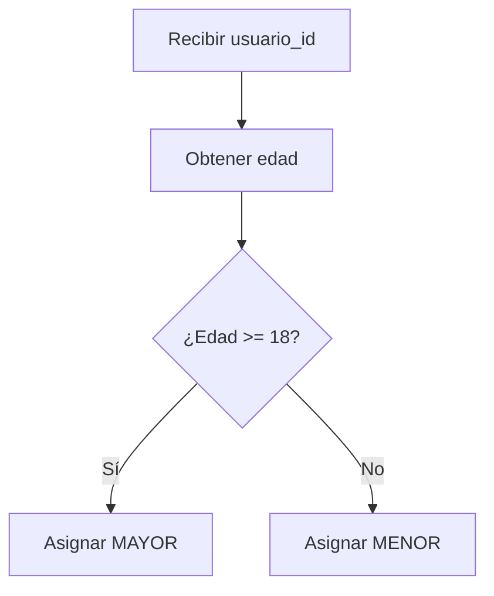
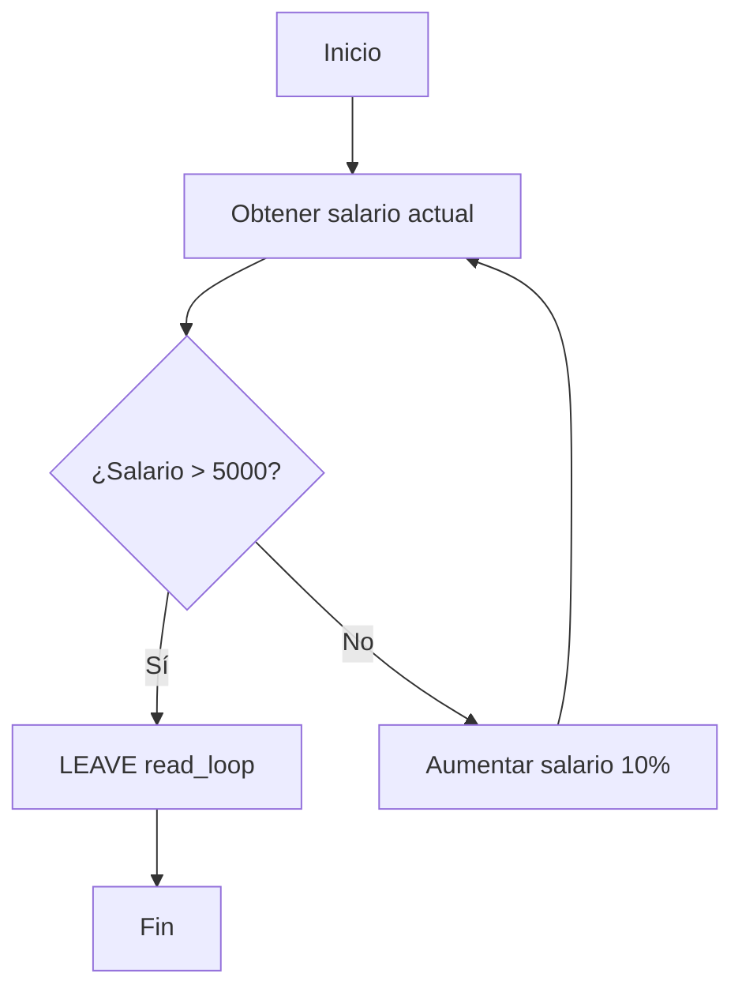

# Modelo Entidad-Relación y consultas avanzadas en MySQL

## Modelo Entidad-Relación

El **modelo Entidad-Relación (E-R)** se utiliza para diseñar y representar la **estructura conceptual de una base de datos**.

Por otro lado, el **modelo relacional** se utiliza para implementar y organizar los datos en forma de **tablas relacionales**.

El proceso de transformar un modelo Entidad-Relación a un modelo relacional se conoce como **mapeo** o **traducción del modelo conceptual al modelo lógico**.

Durante este proceso se establece una correspondencia entre los elementos del modelo Entidad-Relación y los elementos del modelo relacional:

| Modelo Entidad-Relación | Modelo relacional |
| --- | --- |
| Entidad | Tabla |
| Atributo | Columna |
| Relación | Relación entre tablas mediante claves |
| Clave de una entidad | Clave primaria |
| Relación entre entidades | Clave foránea y restricciones correspondientes |

> [!IMPORTANT]
> El modelo Entidad-Relación permite representar la estructura conceptual antes de implementar físicamente la base de datos mediante tablas.

---

# Principales componentes del modelo Entidad-Relación

## Entidades

Las entidades representan objetos o elementos sobre los cuales se desea almacenar información dentro de un sistema.

En el proceso de transformación al modelo relacional, una entidad normalmente se representa mediante una tabla.

> [!NOTE]
> Los apuntes proporcionados mencionan los principales componentes del modelo E-R, pero no incluyen una definición desarrollada de las entidades ni un ejemplo concreto de ellas. Por esta razón, no se agrega un ejemplo específico que no aparezca en los apuntes originales.

---

## Atributos

Los atributos representan características o propiedades de las entidades.

Al realizar el mapeo hacia el modelo relacional, los atributos se representan normalmente como columnas de una tabla.

> [!NOTE]
> El apunte original menciona los atributos como parte del modelo Entidad-Relación, pero no desarrolla ejemplos específicos de atributos.

---

## Relaciones

Las **relaciones** representan las asociaciones existentes entre las entidades.

Una relación se establece cuando dos o más entidades están relacionadas entre sí de alguna manera.

En un diagrama E-R, las relaciones se representan mediante elementos que conectan las entidades y normalmente reciben un nombre que describe la naturaleza de la relación.

---

## Cardinalidad

La **cardinalidad** indica cuántas instancias de una entidad pueden estar relacionadas con las instancias de otra entidad mediante una relación.

Los apuntes mencionan que la cardinalidad se expresa mediante una notación relacionada con cantidades, como:

> "uno"

Las cardinalidades permiten describir cómo se relacionan las entidades entre sí.

---

# Tipos de relación

Los tipos de relación se generan a partir de la **cardinalidad**.

La cardinalidad permite determinar cuántas instancias de una entidad pueden asociarse con instancias de otra entidad.

> [!NOTE]
> Los apuntes originales mencionan los tipos de relación, pero no especifican ni desarrollan los tipos concretos. Por lo tanto, no se agregan categorías adicionales que no estén presentes en el material original.

---

# Notación gráfica del modelo E-R

Los apuntes mencionan la existencia de una **notación gráfica** utilizada para representar el modelo Entidad-Relación:

```text
símbolo
```

Sin embargo, no se proporcionan los símbolos concretos ni una imagen del diagrama.

> [!NOTE]
> **Información incompleta:** los apuntes indican que existe una notación gráfica para el modelo E-R, pero no incluyen los símbolos correspondientes. No se agregan símbolos que no estén presentes en el material original.

---

# Creación de un diagrama Entidad-Relación

La creación de un diagrama Entidad-Relación permite representar visualmente:

- Entidades.
- Atributos.
- Relaciones.
- Cardinalidades.

El diagrama sirve como representación conceptual de la estructura que posteriormente puede transformarse en un modelo relacional.

---

# Consultas avanzadas

Las consultas avanzadas permiten trabajar con operaciones más complejas dentro de una base de datos.

Entre los temas estudiados se encuentran los **procedimientos almacenados** y las **estructuras de control**.

---

# Procedimientos almacenados

## ¿Qué es un procedimiento almacenado?

Un **procedimiento almacenado (Stored Procedure)** consiste en un conjunto de instrucciones SQL junto con lógica de programación opcional.

Estos procedimientos son ejecutados por el **motor de la base de datos** y pueden ser invocados por:

- Aplicaciones.
- Disparadores.
- Otros procedimientos almacenados.

La idea principal de los apuntes es que un procedimiento almacenado permite definir previamente un conjunto de instrucciones y posteriormente ejecutarlo mediante una llamada.

Por ejemplo:

```sql
CALL obtener_producto(2);
```

En lugar de escribir nuevamente toda la lógica de consulta, se invoca el procedimiento almacenado.

---

# Características de los procedimientos almacenados

Los apuntes identifican las siguientes características:

- **Pre-compilados**.
- **Parametrizables**.
- **Encapsulamiento**.
- **Transaccionales**.

Los procedimientos almacenados se ejecutan dentro del motor de la base de datos y pueden encapsular lógica que posteriormente puede reutilizarse.

> [!IMPORTANT]
> Los apuntes señalan que los procedimientos almacenados pueden mejorar el rendimiento porque el análisis de las instrucciones no necesita repetirse de la misma manera en cada ejecución. Esta afirmación debe entenderse dentro del contexto y comportamiento específico del motor de base de datos utilizado.

---

# Estructura básica de un procedimiento almacenado

La estructura básica presentada en los apuntes es:

```sql
DELIMITER //

CREATE PROCEDURE nombre_procedimiento ([parámetros])
BEGIN
    -- Declaraciones SQL y lógica del procedimiento
END //

DELIMITER ;
```

## `DELIMITER`

`DELIMITER` permite cambiar temporalmente el delimitador utilizado por el cliente SQL.

Esto es necesario en el ejemplo porque dentro del procedimiento se utilizan instrucciones terminadas en `;`.

Por ejemplo:

```sql
DELIMITER //
```

El procedimiento puede terminar utilizando:

```sql
END //
```

Después se restaura el delimitador habitual:

```sql
DELIMITER ;
```

> [!IMPORTANT]
> `DELIMITER` es una instrucción utilizada por clientes de MySQL para indicar cómo debe interpretarse el final de una instrucción. No forma parte de la lógica interna que ejecuta el servidor como una instrucción SQL del procedimiento.

---

# Parámetros de entrada y salida

Los procedimientos almacenados pueden utilizar diferentes tipos de parámetros.

## `IN`

`IN` representa un parámetro de entrada.

El procedimiento recibe un valor mediante este parámetro.

Los apuntes lo describen como:

> `IN`: el valor de entrada al procedimiento no puede ser modificado.

Ejemplo:

```sql
CREATE PROCEDURE obtener_producto(IN producto_id INT)
```

En este caso:

```sql
producto_id
```

es un parámetro de entrada de tipo `INT`.

---

## `OUT`

`OUT` representa un parámetro de salida.

El procedimiento puede asignarle un valor y ese resultado puede utilizarse fuera del procedimiento.

Los apuntes lo describen como:

> `OUT`: el procedimiento puede cambiar el valor del parámetro y este cambio se refleja fuera del procedimiento.

Ejemplo:

```sql
CREATE PROCEDURE contar_productos(OUT total_productos INT)
```

---

## `INOUT`

`INOUT` combina las características de `IN` y `OUT`.

El valor puede:

1. Entrar al procedimiento.
2. Ser modificado dentro del procedimiento.
3. Ser recuperado posteriormente desde fuera.

Los apuntes lo resumen como:

> `INOUT`: combinación de `IN` y `OUT`. El valor puede ser pasado al procedimiento y también modificado dentro del mismo.

Ejemplo:

```sql
CREATE PROCEDURE calcular_iva(
    IN producto_id INT,
    INOUT iva FLOAT
)
```

---

# Comparación de parámetros

| Parámetro | Recibe valor | Puede modificar el valor | Permite recuperar el resultado |
| --- | --- | --- | --- |
| `IN` | Sí | No | No |
| `OUT` | No | Sí | Sí |
| `INOUT` | Sí | Sí | Sí |

---

# Ejemplo completo: base de datos `acme_store`

Los siguientes ejemplos utilizan una base de datos denominada `acme_store`.

## Creación de la base de datos

```sql
DROP DATABASE IF EXISTS acme_store;

CREATE DATABASE IF NOT EXISTS acme_store;

USE acme_store;

DROP TABLE IF EXISTS categorias;
DROP TABLE IF EXISTS productos;
```

Primero se elimina la base de datos si ya existe:

```sql
DROP DATABASE IF EXISTS acme_store;
```

Después se crea nuevamente:

```sql
CREATE DATABASE IF NOT EXISTS acme_store;
```

Finalmente se selecciona:

```sql
USE acme_store;
```

---

# Tabla `categorias`

```sql
CREATE TABLE IF NOT EXISTS categorias(
    id INT NOT NULL AUTO_INCREMENT,
    codigo VARCHAR(4) NOT NULL UNIQUE,
    nombre VARCHAR(60),
    PRIMARY KEY (id)
) ENGINE = InnoDB;
```

La tabla `categorias` contiene:

| Campo | Tipo / restricción |
| --- | --- |
| `id` | `INT`, `NOT NULL`, `AUTO_INCREMENT`, `PRIMARY KEY` |
| `codigo` | `VARCHAR(4)`, `NOT NULL`, `UNIQUE` |
| `nombre` | `VARCHAR(60)` |

---

## Inserción de categorías

```sql
INSERT INTO categorias(codigo,nombre) VALUES
('C01','categoria 1'),
('C02','categoria 2');
```

Se insertan dos categorías:

- `C01` → `categoria 1`
- `C02` → `categoria 2`

---

# Tabla `productos`

```sql
CREATE TABLE IF NOT EXISTS productos(
    id INT NOT NULL AUTO_INCREMENT,
    codigo VARCHAR(4) NOT NULL UNIQUE,
    nombre VARCHAR(60),
    estado VARCHAR(20) NOT NULL DEFAULT 'disponible',
    precio FLOAT NOT NULL DEFAULT 0.0,
    categoria_id INT NOT NULL,
    FOREIGN KEY (categoria_id) REFERENCES categorias(id),
    PRIMARY KEY (id)
) ENGINE = InnoDB;
```

La tabla `productos` contiene:

| Campo | Descripción |
| --- | --- |
| `id` | Identificador del producto. |
| `codigo` | Código único del producto. |
| `nombre` | Nombre del producto. |
| `estado` | Estado del producto. |
| `precio` | Precio del producto. |
| `categoria_id` | Identificador de la categoría relacionada. |

La relación entre productos y categorías se establece mediante:

```sql
FOREIGN KEY (categoria_id)
REFERENCES categorias(id)
```

Esto significa que `categoria_id` referencia al campo `id` de `categorias`.

---

# Inserción de productos

```sql
INSERT INTO productos(id, codigo, nombre, estado, precio, categoria_id)
VALUES (1, "P01", "ProductoA", "disponible", 10.00, 2);

INSERT INTO productos(id, codigo, nombre, estado, precio, categoria_id)
VALUES (2, "P02", "ProductoB", "disponible", 15.00, 1);

INSERT INTO productos(id, codigo, nombre, estado, precio, categoria_id)
VALUES (3, "P03", "ProductoC", "No disponible", 20.00, 1);

INSERT INTO productos(id, codigo, nombre, estado, precio, categoria_id)
VALUES (4, "P04", "ProductoD", "No disponible", 02.55, 2);

INSERT INTO productos(id, codigo, nombre, estado, precio, categoria_id)
VALUES (5, "P05", "ProductoE", "No disponible", 32.5, 1);

INSERT INTO productos(id, codigo, nombre, estado, precio, categoria_id)
VALUES (6, "P06", "ProductoF", "No disponible", 10.50, 2);
```

Estos registros permiten posteriormente realizar consultas mediante procedimientos almacenados.

---

# Procedimiento `obtener_producto`

Antes de crear el procedimiento se elimina una versión anterior si existe:

```sql
-- eliminar un proceso almacenados
DROP PROCEDURE IF EXISTS obtener_producto;
```

Después se cambia el delimitador:

```sql
DELIMITER //
```

El procedimiento se crea de la siguiente manera:

```sql
-- crear un proceso almacenado
CREATE PROCEDURE obtener_producto(IN producto_id INT)
BEGIN
    SELECT
        p.id,
        p.codigo,
        p.nombre,
        p.precio,
        c.codigo codigo_categoria,
        c.nombre AS nombre_categoria
    FROM productos p
    INNER JOIN categorias c
        ON p.categoria_id = c.id
    WHERE p.id = producto_id;
END //

DELIMITER ;
```

---

## Explicación de `obtener_producto`

El procedimiento recibe un identificador:

```sql
IN producto_id INT
```

Después consulta la tabla `productos` y la relaciona con `categorias`:

```sql
FROM productos p
INNER JOIN categorias c
    ON p.categoria_id = c.id
```

La condición:

```sql
WHERE p.id = producto_id;
```

permite obtener únicamente el producto cuyo identificador coincide con el parámetro recibido.

La consulta devuelve:

- `p.id`
- `p.codigo`
- `p.nombre`
- `p.precio`
- `c.codigo`
- `c.nombre`

También utiliza alias para algunas columnas:

```sql
c.codigo codigo_categoria
```

y:

```sql
c.nombre AS nombre_categoria
```

---

# Invocación del procedimiento

El procedimiento se ejecuta mediante:

```sql
CALL obtener_producto(2);
```

En este caso, el parámetro:

```text
2
```

se proporciona como valor de `producto_id`.

---

# Procedimiento `obtener_total_productos`

El siguiente procedimiento tiene como objetivo mostrar el total de productos pertenecientes a cada categoría.

Primero se elimina si ya existe:

```sql
-- crear un proceso almacenado
-- Elimina el procedimiento si ya existe
DROP PROCEDURE IF EXISTS obtener_total_productos;
```

Después se cambia el delimitador:

```sql
-- Cambiamos el delimitador porque dentro del procedimiento
-- utilizaremos punto y coma (;)
DELIMITER //
```

El procedimiento original es:

```sql
-- =====================================================
-- Procedimiento: obtener_total_productos
-- Objetivo:
-- Mostrar cada categoría junto con la cantidad de
-- productos que pertenecen a ella.
-- =====================================================
CREATE PROCEDURE obtener_total_productos()
BEGIN
    SELECT
        c.id,
        c.codigo,
        c.nombre,
        -- Cuenta cuántos productos pertenecen
        -- a cada categoría
        COUNT(p.id) AS total_productos
    FROM categorias c

    -- Relacionamos las categorías con los productos
    INNER JOIN productos p
        ON c.id = p.categoria_id

    -- Agrupamos por la categoría
    GROUP BY
        c.id,
        c.codigo,
        c.nombre;
END //

-- Regresamos el delimitador normal
DELIMITER ;

-- Ejecutar procedimiento
CALL obtener_total_productos();
```

---

## Explicación de los comentarios del procedimiento

Los comentarios originales forman parte de la explicación del procedimiento.

### Objetivo

```sql
-- Objetivo:
-- Mostrar cada categoría junto con la cantidad de
-- productos que pertenecen a ella.
```

El procedimiento busca obtener cada categoría junto con la cantidad de productos asociados.

### `COUNT()`

```sql
COUNT(p.id) AS total_productos
```

El comentario original explica:

```sql
-- Cuenta cuántos productos pertenecen
-- a cada categoría
```

`COUNT()` realiza la operación de conteo y el resultado recibe el alias:

```text
total_productos
```

### `INNER JOIN`

El comentario original:

```sql
-- Relacionamos las categorías con los productos
```

corresponde a:

```sql
INNER JOIN productos p
    ON c.id = p.categoria_id
```

Esta relación conecta las categorías con los productos que pertenecen a cada una.

### `GROUP BY`

El comentario original:

```sql
-- Agrupamos por la categoría
```

corresponde a:

```sql
GROUP BY
    c.id,
    c.codigo,
    c.nombre;
```

La agrupación permite obtener el conteo de productos para cada categoría.

---

# Procedimiento `contar_productos`

Los apuntes presentan un tercer procedimiento:

```sql
DELIMITER //

CREATE PROCEDURE contar_productos(OUT total_productos INT)
BEGIN
    SELECT COUNT(1) FROM productos;
END //

DELIMITER ;
```

El procedimiento declara un parámetro de salida:

```sql
OUT total_productos INT
```

El objetivo indicado por el código es contar los productos.

Posteriormente se intenta ejecutar:

```sql
SELECT @total = 0;

CALL contar_productos(@total);

SELECT @total;
```

---

## Problema técnico en `contar_productos`

El procedimiento declara un parámetro `OUT`:

```sql
OUT total_productos INT
```

pero el procedimiento no asigna el resultado de `COUNT(1)` a ese parámetro.

El código actual contiene:

```sql
SELECT COUNT(1) FROM productos;
```

Para que el parámetro `OUT` reciba el resultado, el valor tendría que asignarse al parámetro.

Una forma de hacerlo sería:

```sql
SELECT COUNT(1)
INTO total_productos
FROM productos;
```

### Código original

```sql
DELIMITER //
CREATE PROCEDURE contar_productos(OUT total_productos INT)
BEGIN
    SELECT COUNT(1) FROM productos;
END //
DELIMITER ;
```

### Código corregido

```sql
DELIMITER //

CREATE PROCEDURE contar_productos(OUT total_productos INT)
BEGIN
    SELECT COUNT(1)
    INTO total_productos
    FROM productos;
END //

DELIMITER ;
```

### Explicación

El `OUT` necesita recibir explícitamente el resultado para que el valor pueda recuperarse posteriormente mediante la variable utilizada en la llamada.

> [!WARNING]
> Esta corrección no reemplaza silenciosamente el código original. El código original se conserva porque forma parte de los apuntes.

---

## Otra inconsistencia en la llamada

Los apuntes contienen:

```sql
SELECT @total = 0;
CALL contar_productos(@total);
SELECT @total;
```

La línea:

```sql
SELECT @total = 0;
```

no corresponde a la forma habitual de asignar un valor a una variable de usuario de MySQL.

La asignación puede realizarse mediante:

```sql
SET @total = 0;
```

Por lo tanto, una versión corregida de la llamada sería:

```sql
SET @total = 0;

CALL contar_productos(@total);

SELECT @total;
```

---

# Procedimiento `calcular_iva`

Los apuntes presentan el siguiente procedimiento:

```sql
-- IN SOLO PERMITE INGRESAR DATOS ÚNICAMENTE
-- INOUT PERMITE INGRESAR Y RECIBIR DATOS
DELIMITER //

CREATE PROCEDURE calcular_iva(
    IN producto_id INT,
    INOUT iva FLOAT
)
BEGIN
    SELECT price * iva /100 INTO iva
    FROM productos
    WHERE id = producto_id;
END //

DELIMITER ;
```

El procedimiento utiliza dos parámetros:

```sql
IN producto_id INT
```

y:

```sql
INOUT iva FLOAT
```

El objetivo es recibir un identificador de producto y un porcentaje de IVA, para posteriormente modificar el parámetro `iva` con el resultado calculado.

---

## Ejecución del procedimiento

Primero se establece el porcentaje:

```sql
SET @total_iva = 10; -- procentaje de iva a aplicar
```

Después se invoca el procedimiento:

```sql
CALL calcular_iva(1, @total_iva);
```

Finalmente se consulta el resultado:

```sql
SELECT @total_iva;
```

---

## Error técnico detectado en `calcular_iva`

En la tabla `productos` definida anteriormente, la columna se llama:

```sql
precio
```

Sin embargo, el procedimiento utiliza:

```sql
price
```

El código original es:

```sql
SELECT price * iva /100 INTO iva
FROM productos
WHERE id = producto_id;
```

Según la estructura proporcionada en los mismos apuntes, la columna existente es:

```sql
precio FLOAT NOT NULL DEFAULT 0.0
```

Por lo tanto, existe una inconsistencia entre el procedimiento y la tabla.

### Código original

```sql
SELECT price * iva /100 INTO iva
FROM productos
WHERE id = producto_id;
```

### Posible corrección

```sql
SELECT precio * iva / 100
INTO iva
FROM productos
WHERE id = producto_id;
```

> [!WARNING]
> La corrección se basa en la definición de la tabla `productos` proporcionada anteriormente en los apuntes, donde la columna se llama `precio`.

---

# Procedimiento `registrar_producto`

Los apuntes presentan un procedimiento para registrar un nuevo producto:

```sql
DESCRIBE productos;

DELIMITER //

CREATE PROCEDURE registrar_producto
(
    IN cod_producto VARCHAR(4),
    IN nom_producto VARCHAR(60),
    IN estado_producto VARCHAR(20),
    IN precio_producto FLOAT,
    IN categoria_producto INT,
    OUT id_generado INT
)
-- función para recibir un valor generado
BEGIN
    INSERT INTO productos
        (codigo,nombre,estado,precio,categoria_id)
    VALUES
        (cod_producto,nom_producto,estado_producto,precio_producto,categoria_producto);

    SET id_generado = LAST_INSERTE_ID();
END //

DELIMITER ;
```

El procedimiento recibe los datos necesarios para registrar un producto.

Los parámetros son:

| Parámetro | Tipo | Propósito |
| --- | --- | --- |
| `cod_producto` | `IN VARCHAR(4)` | Código del producto. |
| `nom_producto` | `IN VARCHAR(60)` | Nombre del producto. |
| `estado_producto` | `IN VARCHAR(20)` | Estado del producto. |
| `precio_producto` | `IN FLOAT` | Precio del producto. |
| `categoria_producto` | `IN INT` | Categoría del producto. |
| `id_generado` | `OUT INT` | Identificador generado para el producto. |

---

## Inserción del producto

El procedimiento utiliza:

```sql
INSERT INTO productos
    (codigo,nombre,estado,precio,categoria_id)
VALUES
    (cod_producto,nom_producto,estado_producto,precio_producto,categoria_producto);
```

Esto permite insertar el nuevo producto utilizando los valores recibidos mediante los parámetros `IN`.

---

## Obtención del identificador generado

Los apuntes intentan recuperar el identificador generado mediante:

```sql
SET id_generado = LAST_INSERTE_ID();
```

### Error técnico

La función de MySQL se denomina:

```sql
LAST_INSERT_ID()
```

En el código original aparece:

```sql
LAST_INSERTE_ID()
```

Existe un error tipográfico en `INSERTE`.

### Código original

```sql
SET id_generado = LAST_INSERTE_ID();
```

### Código corregido

```sql
SET id_generado = LAST_INSERT_ID();
```

La función permite obtener el último valor de `AUTO_INCREMENT` generado por una operación de inserción en la sesión correspondiente.

---

# Invocación de `registrar_producto`

Los apuntes inicializan una variable para recibir el identificador:

```sql
SET @nuevo_producto_id = 0;
```

Después invocan el procedimiento:

```sql
-- Invocar el procedimiento regsitrar producto para crear un nuevo producto en el sistema.
CALL registrar_producto(
    'P07',
    'producto 7',
    'disponible',
    5.5,
    2,
    @nuevo_producto_id
);
```

Finalmente se muestra el identificador generado:

```sql
-- Mostrar el id generado para el producto registrado
SELECT @nuevo_producto_id;
```

El parámetro `OUT` permite recuperar el identificador generado por el procedimiento.

---

# `AUTO_INCREMENT`

Los apuntes incluyen la siguiente observación:

```sql
-- LOS INSERT SE MANEJO MANUALMENTE LOS ID NUNCA INICIALIZAO COMO UN AUTO INCREMENT
ALTER TABLE productos AUTO_INCREMENT = 7;
```

La instrucción:

```sql
ALTER TABLE productos AUTO_INCREMENT = 7;
```

establece el siguiente valor de `AUTO_INCREMENT` a partir del valor indicado, sujeto a las reglas del motor y a los valores existentes en la tabla.

> [!NOTE]
> El comentario original indica que los `INSERT` manejaron manualmente los identificadores. En efecto, los primeros productos fueron insertados proporcionando explícitamente los valores de `id`:
>
> ```sql
> INSERT INTO productos(id, codigo, ...)
> VALUES (1, ...);
> ```
>
> y posteriormente se ajusta el valor de `AUTO_INCREMENT`.

---

# Estructuras de control en procedimientos almacenados

Los procedimientos almacenados pueden contener estructuras de control que permiten implementar lógica de programación.

Los apuntes presentan:

- `IF`.
- `ELSE`.
- `END IF`.
- `LOOP`.
- `LEAVE`.

---

# `IF ... THEN ... ELSE`

La estructura:

```sql
IF condición THEN
    instrucciones;
ELSE
    instrucciones;
END IF;
```

permite ejecutar diferentes instrucciones dependiendo de si una condición se cumple.

---

# Ejemplo: clasificar usuarios

Se utiliza nuevamente la base de datos:

```sql
USE acme_store;
```

Se crea la tabla:

```sql
CREATE TABLE usuarios (
    id INT AUTO_INCREMENT,
    nombre VARCHAR(100),
    edad INT,
    categoria VARCHAR(10),
    PRIMARY KEY (id)
);
```

La tabla contiene:

- `id`.
- `nombre`.
- `edad`.
- `categoria`.

---

## Inserción de usuarios

```sql
INSERT INTO usuarios (nombre, edad) VALUES
('Juan Pérez', 25),
('Ana Gómez', 17),
('Luis Martínez', 30),
('Maria López', 16);
```

---

# Procedimiento `clasificar_usuarios`

Primero se elimina el procedimiento si existe:

```sql
DROP PROCEDURE IF EXISTS clasificar_usuarios;
```

Después se cambia el delimitador:

```sql
DELIMITER //
```

El procedimiento es:

```sql
CREATE PROCEDURE clasificar_usuarios(IN usuario_id INT)
BEGIN
    DECLARE edad_usuario INT;
    DECLARE categoria VARCHAR(10);

    SELECT edad
    INTO edad_usuario
    FROM usuarios
    WHERE id = usuario_id;

    IF edad_usuario >= 18 THEN
        SET categoria = "MAYOR";
    ELSE
        SET categoria = "MENOR";
    END IF;

END //

DELIMITER ;
```

---

## Explicación del procedimiento

El procedimiento recibe:

```sql
IN usuario_id INT
```

Este parámetro identifica al usuario que se quiere clasificar.

Después se declaran dos variables locales:

```sql
DECLARE edad_usuario INT;
DECLARE categoria VARCHAR(10);
```

### Obtener la edad

La edad se almacena en `edad_usuario` mediante:

```sql
SELECT edad
INTO edad_usuario
FROM usuarios
WHERE id = usuario_id;
```

### Evaluar la condición

Después se utiliza:

```sql
IF edad_usuario >= 18 THEN
    SET categoria = "MAYOR";
ELSE
    SET categoria = "MENOR";
END IF;
```

La lógica es:



---

## Llamar al procedimiento

Los apuntes utilizan:

```sql
-- LLAMAR AL PROCESO ALMACENADO
CALL clasificar_usuarios(3);

SELECT * FROM usuarios;
```

---

## Observación sobre `clasificar_usuarios`

El procedimiento asigna el resultado a la variable local:

```sql
SET categoria = "MAYOR";
```

o:

```sql
SET categoria = "MENOR";
```

Sin embargo, el código no utiliza posteriormente esa variable para actualizar la columna:

```sql
usuarios.categoria
```

Por ejemplo, no existe una instrucción como:

```sql
UPDATE usuarios
SET categoria = categoria
WHERE id = usuario_id;
```

Por lo tanto, con el código original proporcionado, la clasificación se calcula dentro del procedimiento, pero no se almacena en la columna `categoria`.

> [!WARNING]
> Esta observación es importante porque el `SELECT * FROM usuarios;` posterior puede no mostrar la categoría calculada. El procedimiento original no contiene una operación que guarde la variable local `categoria` en la tabla.

---

# `LOOP`

Los apuntes indican:

> El loop ciclo de iteración hasta que se cumpla una función.

Un `LOOP` permite repetir un bloque de instrucciones.

En MySQL, una instrucción como:

```sql
LEAVE
```

puede utilizarse para salir del ciclo cuando se cumple una condición.

La estructura general utilizada en los apuntes es:

```sql
nombre_loop: LOOP

    -- instrucciones

    IF condición THEN
        LEAVE nombre_loop;
    END IF;

END LOOP nombre_loop;
```

---

# Ejemplo de `LOOP`: aumentar salarios

Los apuntes presentan un tercer ejercicio de procedimientos almacenados.

## Tabla `empleados`

```sql
USE acme_store;

CREATE TABLE empleados (
    id INT AUTO_INCREMENT,
    nombre VARCHAR(100),
    salario DECIMAL(10, 2),
    PRIMARY KEY (id)
);
```

La tabla almacena:

- Identificador.
- Nombre.
- Salario.

---

## Inserción de empleados

```sql
INSERT INTO empleados (nombre, salario) VALUES
('Juan Pérez', 2500.00),
('Ana Gómez', 2800.00),
('Luis Martínez', 2900.00),
('Maria López', 3200.00),
('Carlos Díaz', 1500.00);
```

---

# Procedimiento `aumentar_salario`

Primero se elimina una versión anterior:

```sql
DROP PROCEDURE IF EXISTS aumentar_salario;
```

Después se cambia el delimitador:

```sql
DELIMITER //
```

El procedimiento original es:

```sql
CREATE PROCEDURE aumentar_salario(IN empleado_id INT)
BEGIN
    DECLARE salario_actual DECIMAL(10,2);

    read_loop:LOOP

        SELECT salario
        INTO salario_actual
        FROM empleados
        WHERE id = empleado_id;

        IF salario_actual > 5000 THEN
            LEAVE read_loop;
        END IF;

        UPDATE empleados
        SET salario = salario * 1.10
        WHERE id = empleado_id;

    END LOOP read_loop;
END //

DELIMITER ;
```

---

## Explicación del procedimiento

El procedimiento recibe:

```sql
IN empleado_id INT
```

Este parámetro identifica al empleado cuyo salario será modificado.

Se declara una variable local:

```sql
DECLARE salario_actual DECIMAL(10,2);
```

Esta variable almacena temporalmente el salario actual del empleado.

---

## Lectura del salario

Dentro del ciclo se ejecuta:

```sql
SELECT salario
INTO salario_actual
FROM empleados
WHERE id = empleado_id;
```

El salario del empleado se obtiene y se almacena en:

```text
salario_actual
```

---

## Condición de salida

El ciclo verifica:

```sql
IF salario_actual > 5000 THEN
    LEAVE read_loop;
END IF;
```

Si el salario actual es superior a `5000`, se ejecuta:

```sql
LEAVE read_loop;
```

Esto provoca la salida del ciclo.

---

## Incremento del salario

Si el salario todavía no supera `5000`, se ejecuta:

```sql
UPDATE empleados
SET salario = salario * 1.10
WHERE id = empleado_id;
```

Multiplicar por:

```text
1.10
```

representa un aumento del `10 %`.

Por ejemplo, conceptualmente:

```text
salario nuevo = salario actual × 1.10
```

Después del `UPDATE`, el procedimiento vuelve al inicio del `LOOP`, obtiene nuevamente el salario y vuelve a comprobar la condición.

---

# Flujo del `LOOP`

La lógica puede representarse mediante:



El flujo continúa mientras el salario no sea superior a `5000`.

---

# Ejecución del procedimiento

Finalmente, los apuntes ejecutan:

```sql
CALL aumentar_salario(3);
```

El identificador `3` corresponde al empleado:

```text
Luis Martínez
```

según los datos insertados anteriormente.

Su salario inicial es:

```text
2900.00
```

El procedimiento incrementa progresivamente el salario en un `10 %` hasta que la condición de salida:

```sql
salario_actual > 5000
```

se cumple.

---

# Conceptos principales estudiados

Los apuntes abarcan varios conceptos relacionados con el diseño y la programación dentro de bases de datos.

## Modelo Entidad-Relación

Permite representar conceptualmente:

- Entidades.
- Atributos.
- Relaciones.
- Cardinalidades.

Posteriormente puede realizarse un mapeo hacia el modelo relacional.

## Procedimientos almacenados

Son conjuntos de instrucciones SQL almacenadas y ejecutadas por el motor de la base de datos.

## Parámetros

Los procedimientos pueden utilizar:

- `IN`.
- `OUT`.
- `INOUT`.

## Variables locales

Las variables pueden declararse dentro de los procedimientos mediante:

```sql
DECLARE
```

## Estructuras condicionales

Se puede utilizar:

```sql
IF
ELSE
END IF
```

para ejecutar diferentes instrucciones dependiendo de una condición.

## Ciclos

Se puede utilizar:

```sql
LOOP
```

para repetir instrucciones.

La instrucción:

```sql
LEAVE
```

permite abandonar un ciclo cuando se cumple una condición determinada.

---

# Errores e inconsistencias técnicas detectadas

## `LAST_INSERTE_ID()`

### Código original

```sql
SET id_generado = LAST_INSERTE_ID();
```

### Código corregido

```sql
SET id_generado = LAST_INSERT_ID();
```

El nombre de la función contiene un error tipográfico en el código original.

---

## `price` frente a `precio`

### Código original

```sql
SELECT price * iva /100 INTO iva
FROM productos
WHERE id = producto_id;
```

### Columna definida en la tabla

```sql
precio FLOAT NOT NULL DEFAULT 0.0
```

### Posible corrección

```sql
SELECT precio * iva / 100
INTO iva
FROM productos
WHERE id = producto_id;
```

---

## Procedimiento `contar_productos`

### Código original

```sql
CREATE PROCEDURE contar_productos(OUT total_productos INT)
BEGIN
    SELECT COUNT(1) FROM productos;
END //
```

El resultado de `COUNT(1)` no se asigna al parámetro `OUT`.

### Posible corrección

```sql
CREATE PROCEDURE contar_productos(OUT total_productos INT)
BEGIN
    SELECT COUNT(1)
    INTO total_productos
    FROM productos;
END //
```

---

## Asignación de `@total`

### Código original

```sql
SELECT @total = 0;
```

### Posible corrección

```sql
SET @total = 0;
```

---

## `clasificar_usuarios`

El procedimiento calcula:

```sql
SET categoria = "MAYOR";
```

o:

```sql
SET categoria = "MENOR";
```

pero no utiliza posteriormente la variable para actualizar la columna:

```sql
categoria
```

Por ello, el procedimiento original no guarda la clasificación en la tabla.

---

# Código completo original de los procedimientos

Esta sección conserva conjuntamente los procedimientos principales proporcionados en los apuntes.

## `obtener_producto`

```sql
DROP PROCEDURE IF EXISTS obtener_producto;
DELIMITER //

CREATE PROCEDURE obtener_producto(IN producto_id INT)
BEGIN
    SELECT
        p.id,
        p.codigo,
        p.nombre,
        p.precio,
        c.codigo codigo_categoria,
        c.nombre AS nombre_categoria
    FROM productos p
    INNER JOIN categorias c
        ON p.categoria_id = c.id
    WHERE p.id = producto_id;
END //

DELIMITER ;

CALL obtener_producto(2);
```

## `obtener_total_productos`

```sql
DROP PROCEDURE IF EXISTS obtener_total_productos;

DELIMITER //

CREATE PROCEDURE obtener_total_productos()
BEGIN
    SELECT
        c.id,
        c.codigo,
        c.nombre,
        COUNT(p.id) AS total_productos
    FROM categorias c
    INNER JOIN productos p
        ON c.id = p.categoria_id
    GROUP BY
        c.id,
        c.codigo,
        c.nombre;
END //

DELIMITER ;

CALL obtener_total_productos();
```

## `contar_productos`

```sql
DELIMITER //

CREATE PROCEDURE contar_productos(OUT total_productos INT)
BEGIN
    SELECT COUNT(1) FROM productos;
END //

DELIMITER ;

SELECT @total = 0;
CALL contar_productos(@total);
SELECT @total;
```

## `calcular_iva`

```sql
DELIMITER //

CREATE PROCEDURE calcular_iva(IN producto_id INT, INOUT iva FLOAT)
BEGIN
    SELECT price * iva /100 INTO iva
    FROM productos
    WHERE id = producto_id;
END //

DELIMITER ;

SET @total_iva = 10; -- procentaje de iva a aplicar
CALL calcular_iva(1, @total_iva);
SELECT @total_iva;
```

## `registrar_producto`

```sql
DESCRIBE productos;

DELIMITER //

CREATE PROCEDURE registrar_producto
(
    IN cod_producto VARCHAR(4),
    IN nom_producto VARCHAR(60),
    IN estado_producto VARCHAR(20),
    IN precio_producto FLOAT,
    IN categoria_producto INT,
    OUT id_generado INT
)
-- función para recibir un valor generado
BEGIN
    INSERT INTO productos (codigo,nombre,estado,precio,categoria_id)
    VALUES
        (cod_producto,nom_producto,estado_producto,precio_producto,categoria_producto);

    SET id_generado = LAST_INSERTE_ID();
END //

DELIMITER ;

SET @nuevo_producto_id = 0;

-- Invocar el procedimiento regsitrar producto para crear un nuevo producto en el sistema.
CALL registrar_producto(
    'P07',
    'producto 7',
    'disponible',
    5.5,
    2,
    @nuevo_producto_id
);

-- Mostrar el id generado para el producto registrado
SELECT @nuevo_producto_id;

-- LOS INSERT SE MANEJO MANUALMENTE LOS ID NUNCA INICIALIZAO COMO UN AUTO INCREMENT
ALTER TABLE productos AUTO_INCREMENT = 7;
```

---

# Resumen

El **modelo Entidad-Relación** permite representar conceptualmente la estructura de una base de datos mediante entidades, atributos, relaciones y cardinalidades. Posteriormente, este modelo puede transformarse mediante un proceso de mapeo hacia un modelo relacional basado en tablas, columnas y claves.

Los **procedimientos almacenados** permiten encapsular instrucciones SQL y lógica de programación dentro del motor de la base de datos.

Los procedimientos estudiados utilizan:

- Parámetros `IN`.
- Parámetros `OUT`.
- Parámetros `INOUT`.
- Variables locales mediante `DECLARE`.
- Consultas `SELECT ... INTO`.
- Condicionales `IF ... ELSE`.
- Ciclos `LOOP`.
- Salidas de ciclos mediante `LEAVE`.
- Cambio de delimitadores mediante `DELIMITER`.

Los ejemplos trabajan con una base de datos de productos y categorías y muestran cómo:

- Obtener un producto.
- Contar productos por categoría.
- Obtener cantidades mediante un parámetro `OUT`.
- Calcular un valor mediante un parámetro `INOUT`.
- Registrar productos y recuperar un identificador generado.
- Clasificar usuarios mediante una condición.
- Aumentar progresivamente el salario de un empleado mediante un ciclo.

Durante la revisión se identificaron además varias inconsistencias técnicas en el código original, entre ellas:

- `LAST_INSERTE_ID()` en lugar de `LAST_INSERT_ID()`.
- Uso de `price` cuando la tabla define `precio`.
- Falta de asignación del resultado de `COUNT()` al parámetro `OUT`.
- Uso de `SELECT @total = 0` en lugar de una asignación mediante `SET`.
- La variable `categoria` de `clasificar_usuarios` se calcula pero no se almacena en la columna correspondiente.

Estas correcciones se mantienen separadas del código original para conservar el material de aprendizaje y evitar modificar silenciosamente los apuntes.

---

# Glosario

| Término | Descripción |
| --- | --- |
| `Modelo Entidad-Relación` | Modelo conceptual utilizado para representar entidades, atributos, relaciones y cardinalidades de una base de datos. |
| `Entidad` | Elemento conceptual sobre el que se desea almacenar información. |
| `Atributo` | Característica o propiedad asociada a una entidad. |
| `Relación` | Asociación existente entre entidades. |
| `Cardinalidad` | Indica cuántas instancias de una entidad pueden relacionarse con instancias de otra entidad. |
| `Mapeo` | Proceso de transformar elementos del modelo Entidad-Relación hacia estructuras del modelo relacional. |
| `Stored Procedure` | Conjunto de instrucciones SQL almacenadas que puede ejecutarse mediante una llamada. |
| `IN` | Parámetro utilizado para proporcionar un valor de entrada a un procedimiento. |
| `OUT` | Parámetro utilizado para devolver un valor desde un procedimiento. |
| `INOUT` | Parámetro que puede recibir un valor y posteriormente devolver un valor modificado. |
| `DELIMITER` | Mecanismo utilizado por el cliente de MySQL para cambiar temporalmente el delimitador de instrucciones. |
| `DECLARE` | Instrucción utilizada para declarar variables locales dentro de un procedimiento. |
| `IF` | Estructura condicional utilizada para ejecutar instrucciones dependiendo de una condición. |
| `ELSE` | Parte alternativa de una estructura `IF` que se ejecuta cuando la condición no se cumple. |
| `LOOP` | Estructura utilizada para repetir un bloque de instrucciones. |
| `LEAVE` | Instrucción utilizada para abandonar un bloque etiquetado, como un ciclo `LOOP`. |
| `AUTO_INCREMENT` | Característica que genera automáticamente valores para una columna, normalmente utilizada con identificadores. |
| `LAST_INSERT_ID()` | Función de MySQL utilizada para obtener el identificador generado por una inserción con `AUTO_INCREMENT`. |
| `INNER JOIN` | Operación que combina registros relacionados entre dos o más tablas. |
| `GROUP BY` | Cláusula que agrupa registros según una o varias columnas. |
| `COUNT()` | Función de agregación utilizada para contar registros o valores. |
| `SELECT ... INTO` | Construcción utilizada para obtener un valor mediante una consulta y almacenarlo en una variable. |
| `OUT` | Parámetro de salida que permite recuperar un valor calculado por el procedimiento. |
| `Variable local` | Variable declarada dentro de un procedimiento y utilizada durante su ejecución. |
| `Motor de base de datos` | Componente encargado de ejecutar y gestionar las operaciones sobre la base de datos. |
| `Encapsulamiento` | Organización de lógica dentro de una unidad reutilizable, como un procedimiento almacenado. |
| `Transacción` | Unidad lógica de operaciones sobre una base de datos que puede gestionarse como un conjunto. |