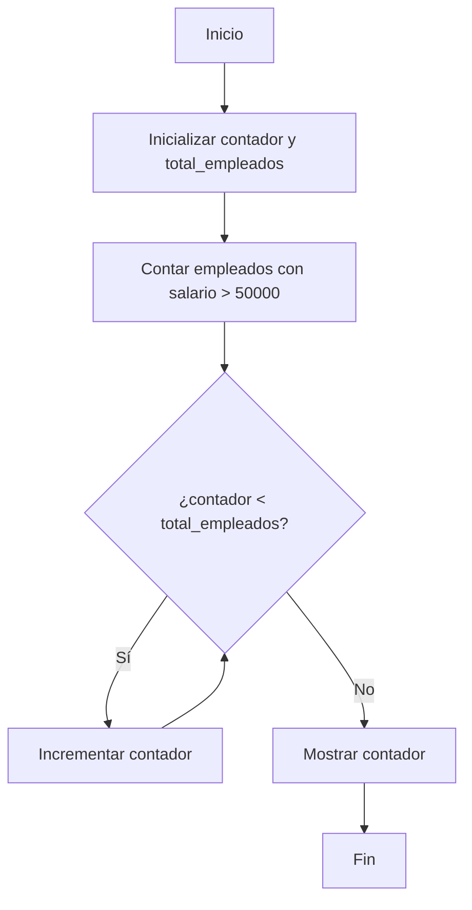
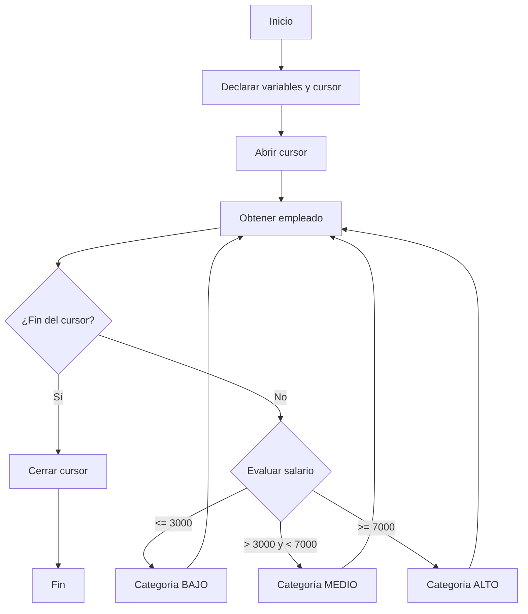
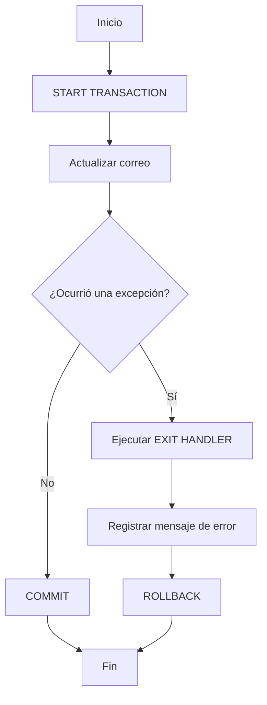

# Procedimientos almacenados y manejo de errores en MySQL

## 1. Procedimientos almacenados con estructuras de control

Los procedimientos almacenados permiten encapsular un conjunto de instrucciones SQL para reutilizarlas mediante una llamada. Dentro de ellos se pueden utilizar variables, ciclos, condiciones, cursores y manejadores de errores.

> [!IMPORTANT]
> En MySQL, las declaraciones `DECLARE` deben colocarse al inicio del bloque `BEGIN ... END`, antes de las instrucciones ejecutables.

---

## 2. Contar empleados con salarios superiores a 50,000

Este procedimiento obtiene la cantidad de empleados cuyo salario es superior a `50000` y utiliza un ciclo `WHILE` para realizar una iteración por cada empleado encontrado.

### Código

```sql
DELIMITER //

CREATE PROCEDURE CONTAR_EMPLEADOS_ALTOS_SALARIOS()
BEGIN
    DECLARE contador INT DEFAULT 0;
    DECLARE total_empleados INT DEFAULT 0;

    SELECT COUNT(*)
    INTO total_empleados
    FROM empleados
    WHERE salario > 50000;

    WHILE contador < total_empleados DO
        SET contador = contador + 1;
    END WHILE;

    SELECT contador;
END //

DELIMITER ;

CALL CONTAR_EMPLEADOS_ALTOS_SALARIOS();
```

### Explicación

Primero se declaran dos variables:

* `contador`: almacena el número de iteraciones realizadas.
* `total_empleados`: almacena la cantidad de empleados cuyo salario supera `50000`.

La consulta:

```sql
SELECT COUNT(*)
INTO total_empleados
FROM empleados
WHERE salario > 50000;
```

cuenta los empleados que cumplen la condición y almacena el resultado en `total_empleados`.

Posteriormente, `WHILE` ejecuta el bloque mientras `contador` sea menor que `total_empleados`.

```sql
WHILE contador < total_empleados DO
    SET contador = contador + 1;
END WHILE;
```

Finalmente, se muestra el valor de `contador`.

### Flujo de ejecución



---

## 3. Aumento de salario mediante `REPEAT`

El ciclo `REPEAT` permite ejecutar un bloque de instrucciones al menos una vez y continuar repitiéndolo hasta que se cumpla una condición definida mediante `UNTIL`.

El siguiente procedimiento aumenta en un `5 %` el salario de los empleados cuyo salario sea inferior a `3000`.

### Código

```sql
DELIMITER //

CREATE PROCEDURE aumentar_salario(OUT conteo INT)
BEGIN
    DECLARE num_empleados INT DEFAULT 0;
    DECLARE iteracion INT DEFAULT 0;

    REPEAT
        UPDATE empleados
        SET salario = salario * 1.05
        WHERE salario < 3000;

        SELECT COUNT(*)
        INTO num_empleados
        FROM empleados
        WHERE salario < 3000;

        SET iteracion = iteracion + 1;

    UNTIL num_empleados = 0
    END REPEAT;

    SET conteo = iteracion;
END //

DELIMITER ;

SET @iter = 0;

SELECT *
FROM empleados;

CALL aumentar_salario(@iter);

SELECT @iter;
```

### Explicación

El parámetro:

```sql
OUT conteo INT
```

permite devolver al exterior del procedimiento el número de iteraciones realizadas.

Las variables utilizadas son:

```sql
DECLARE num_empleados INT DEFAULT 0;
DECLARE iteracion INT DEFAULT 0;
```

* `num_empleados`: almacena cuántos empleados continúan teniendo un salario inferior a `3000`.
* `iteracion`: cuenta cuántas veces se ejecuta el ciclo.

El aumento salarial se realiza mediante:

```sql
UPDATE empleados
SET salario = salario * 1.05
WHERE salario < 3000;
```

El valor `1.05` representa el salario original más un incremento del `5 %`.

Después de actualizar los salarios, se vuelve a contar cuántos empleados continúan por debajo de `3000`.

```sql
SELECT COUNT(*)
INTO num_empleados
FROM empleados
WHERE salario < 3000;
```

El ciclo finaliza cuando:

```sql
num_empleados = 0
```

Finalmente, el número de iteraciones se devuelve mediante:

```sql
SET conteo = iteracion;
```

---

## 4. `CASE` y cursores

Un **cursor** permite recorrer los registros obtenidos mediante una consulta y procesarlos uno por uno.

En este caso, se utiliza un cursor para recorrer los empleados y asignar una categoría según su salario.

Las categorías utilizadas son:

| Salario             | Categoría |
| ------------------- | --------- |
| `<= 3000`           | `BAJO`    |
| `> 3000` y `< 7000` | `MEDIO`   |
| `>= 7000`           | `ALTO`    |

### Preparación de la tabla

```sql
SELECT *
FROM empleados;

ALTER TABLE empleados
ADD categoria VARCHAR(10);
```

### Procedimiento

```sql
DELIMITER //

CREATE PROCEDURE asignar_categoria_salario()
BEGIN
    DECLARE done INT DEFAULT FALSE;
    DECLARE emp_id INT;
    DECLARE empleado_salario DECIMAL(8,2);

    DECLARE cursor1 CURSOR FOR
        SELECT id, salario
        FROM empleados;

    DECLARE CONTINUE HANDLER FOR NOT FOUND
        SET done = TRUE;

    OPEN cursor1;

    read_loop: LOOP

        FETCH cursor1
        INTO emp_id, empleado_salario;

        IF done THEN
            LEAVE read_loop;
        END IF;

        CASE
            WHEN empleado_salario <= 3000 THEN
                UPDATE empleados
                SET categoria = 'BAJO'
                WHERE id = emp_id;

            WHEN empleado_salario > 3000
                 AND empleado_salario < 7000 THEN
                UPDATE empleados
                SET categoria = 'MEDIO'
                WHERE id = emp_id;

            ELSE
                UPDATE empleados
                SET categoria = 'ALTO'
                WHERE id = emp_id;
        END CASE;

    END LOOP;

    CLOSE cursor1;
END //

DELIMITER ;

CALL asignar_categoria_salario();
```

### Explicación

Primero se declara la variable que permite controlar el final del cursor:

```sql
DECLARE done INT DEFAULT FALSE;
```

Después se declaran las variables que recibirán los valores de cada registro:

```sql
DECLARE emp_id INT;
DECLARE empleado_salario DECIMAL(8,2);
```

El cursor se define mediante:

```sql
DECLARE cursor1 CURSOR FOR
    SELECT id, salario
    FROM empleados;
```

Esto indica que el cursor recorrerá los valores `id` y `salario` de la tabla `empleados`.

El `HANDLER` detecta cuándo ya no existen más registros:

```sql
DECLARE CONTINUE HANDLER FOR NOT FOUND
    SET done = TRUE;
```

El cursor se abre mediante:

```sql
OPEN cursor1;
```

Cada registro se obtiene con:

```sql
FETCH cursor1
INTO emp_id, empleado_salario;
```

Cuando el cursor llega al final, `done` cambia a `TRUE`.

```sql
IF done THEN
    LEAVE read_loop;
END IF;
```

`LEAVE` permite abandonar el ciclo etiquetado como `read_loop`.

### Uso de `CASE`

La estructura:

```sql
CASE
    WHEN condicion THEN
        instrucciones
    WHEN condicion THEN
        instrucciones
    ELSE
        instrucciones
END CASE;
```

permite ejecutar diferentes instrucciones dependiendo del valor evaluado.

En este procedimiento, `CASE` determina la categoría correspondiente al salario del empleado.

### Flujo



---

# Manejo de errores

El **manejo de errores** es un aspecto importante para garantizar la integridad y confiabilidad de las aplicaciones de bases de datos.

Los errores pueden ocurrir por diferentes razones, entre ellas:

* Datos de entrada incorrectos.
* Fallas de conexión.
* Errores en la lógica del código.
* Restricciones de la base de datos.
* Operaciones que no pueden completarse correctamente.

Un manejo de errores adecuado permite que el sistema responda de manera controlada ante situaciones inesperadas.

## Importancia del manejo de errores

Un sistema con un manejo adecuado de errores permite:

* Prevenir fallos graves.
* Mantener la integridad de los datos.
* Facilitar la retroalimentación y el diagnóstico.
* Mejorar la experiencia del usuario.
* Controlar operaciones que no pueden completarse correctamente.

---

## `DECLARE HANDLER`

`DECLARE HANDLER` se utiliza para definir qué acción debe ejecutarse cuando ocurre un error o una condición específica durante la ejecución de un procedimiento almacenado.

La estructura general es:

```sql
DECLARE
    {CONTINUE | EXIT} HANDLER
    FOR condición
    sentencia;
```

Los `HANDLER` deben declararse dentro del bloque `BEGIN ... END` antes de las instrucciones ejecutables.

---

## Tipos principales de `HANDLER`

### `CONTINUE`

Cuando ocurre la condición especificada, el procedimiento continúa con la siguiente instrucción después de la que provocó la condición.

```sql
DECLARE CONTINUE HANDLER FOR condición
    sentencia;
```

### `EXIT`

Cuando ocurre la condición especificada, se abandona el bloque `BEGIN ... END` en el que fue declarado el `HANDLER`.

```sql
DECLARE EXIT HANDLER FOR condición
    sentencia;
```

### Comparación

| Handler    | Comportamiento                                                 |
| ---------- | -------------------------------------------------------------- |
| `CONTINUE` | Ejecuta el manejador y continúa con la siguiente instrucción.  |
| `EXIT`     | Ejecuta el manejador y abandona el bloque donde fue declarado. |

---

# Ejemplo de manejo de errores al insertar productos

Un caso común consiste en controlar el error de clave duplicada.

En MySQL, el código de error `1062` corresponde a un intento de insertar un valor duplicado en una clave única.

### Procedimiento

```sql
DELIMITER //

CREATE PROCEDURE insertar_producto(
    IN codigo VARCHAR(6),
    IN nombre VARCHAR(60),
    IN precio FLOAT,
    IN categoria_id INT,
    OUT id INT
)
BEGIN
    DECLARE EXIT HANDLER FOR 1062
    BEGIN
        SELECT 'ERROR: El producto ya existe' AS mensaje;
        SET id = NULL;
    END;

    INSERT INTO productos (
        codigo,
        nombre,
        precio,
        categoria_id
    )
    VALUES (
        codigo,
        nombre,
        precio,
        categoria_id
    );

    SET id = LAST_INSERT_ID();
END //

DELIMITER ;
```

### Explicación

El procedimiento recibe cuatro parámetros de entrada:

```sql
IN codigo VARCHAR(6),
IN nombre VARCHAR(60),
IN precio FLOAT,
IN categoria_id INT
```

y un parámetro de salida:

```sql
OUT id INT
```

El parámetro `OUT` permite devolver el identificador generado por la inserción.

El manejador:

```sql
DECLARE EXIT HANDLER FOR 1062
```

se ejecuta cuando MySQL detecta un error de clave duplicada.

Cuando la inserción es correcta, se obtiene el identificador generado mediante:

```sql
SET id = LAST_INSERT_ID();
```

---

## Ejecución del procedimiento

```sql
SET @id_prod = 0;

CALL insertar_producto(
    'P08',
    'producto 8',
    6.3,
    2,
    @id_prod
);

SELECT *
FROM productos;

SELECT @id_prod;
```

La variable de sesión:

```sql
@id_prod
```

recibe el valor enviado mediante el parámetro `OUT`.

---

# Registro de errores en una tabla

Además de mostrar un mensaje, los errores pueden almacenarse en una tabla para mantener un historial.

### Creación de la tabla

```sql
CREATE TABLE mensaje_error (
    id INT PRIMARY KEY AUTO_INCREMENT,
    mensaje TEXT,
    fecha_hora DATETIME DEFAULT CURRENT_TIMESTAMP
);
```

La tabla contiene:

| Columna      | Descripción                               |
| ------------ | ----------------------------------------- |
| `id`         | Identificador único del registro.         |
| `mensaje`    | Texto descriptivo del error.              |
| `fecha_hora` | Fecha y hora en que se registró el error. |

---

# Actualización del correo de un usuario

Primero se agrega la columna `email` a la tabla de usuarios:

```sql
ALTER TABLE usuarios
ADD email VARCHAR(60);
```

Después se puede actualizar el correo de un usuario específico:

```sql
UPDATE usuarios
SET email = 'ejemplo@gmail.com'
WHERE id = 4;
```

---

## Procedimiento para actualizar el correo

El procedimiento utiliza una transacción para controlar la operación y registrar información cuando ocurre un error.

```sql
DELIMITER //

CREATE PROCEDURE actualizar_email_usuario(
    IN user_id INT,
    IN nuevo_email VARCHAR(60)
)
BEGIN
    DECLARE EXIT HANDLER FOR SQLEXCEPTION
    BEGIN
        INSERT INTO mensaje_error (mensaje)
        VALUES (
            CONCAT(
                'ERROR al actualizar el usuario con id: ',
                CAST(user_id AS CHAR),
                '. Email a actualizar: ',
                nuevo_email
            )
        );

        ROLLBACK;
    END;

    START TRANSACTION;

    UPDATE usuarios
    SET email = nuevo_email
    WHERE id = user_id;

    COMMIT;
END //

DELIMITER ;
```

### Ejecución

```sql
SELECT *
FROM usuarios;

CALL actualizar_email_usuario(
    4,
    'agomez@gmail.com'
);
```

---

## Explicación de la transacción

El procedimiento inicia una transacción mediante:

```sql
START TRANSACTION;
```

Después se ejecuta la actualización:

```sql
UPDATE usuarios
SET email = nuevo_email
WHERE id = user_id;
```

Si la operación se completa correctamente, se confirma mediante:

```sql
COMMIT;
```

Si ocurre una excepción SQL, se ejecuta el `EXIT HANDLER`.

El manejador registra el error:

```sql
INSERT INTO mensaje_error (mensaje)
VALUES (...);
```

y posteriormente revierte la transacción:

```sql
ROLLBACK;
```

### Flujo de manejo de errores



> [!IMPORTANT]
> `COMMIT` confirma los cambios realizados durante la transacción, mientras que `ROLLBACK` revierte los cambios que todavía no han sido confirmados.

---

# Conceptos principales

## `WHILE`

Ejecuta repetidamente un bloque de instrucciones mientras una condición sea verdadera.

```sql
WHILE condicion DO
    instrucciones;
END WHILE;
```

---

## `REPEAT`

Ejecuta un bloque de instrucciones y continúa repitiéndolo hasta que se cumpla la condición indicada en `UNTIL`.

```sql
REPEAT
    instrucciones;
UNTIL condicion
END REPEAT;
```

A diferencia de `WHILE`, `REPEAT` ejecuta su contenido al menos una vez.

---

## `CURSOR`

Permite recorrer individualmente los registros obtenidos mediante una consulta.

Su uso habitual dentro de un procedimiento sigue este flujo:

```text
DECLARE → OPEN → FETCH → procesar → repetir → CLOSE
```

---

## `CASE`

Permite ejecutar diferentes instrucciones dependiendo de una condición o valor.

```sql
CASE
    WHEN condicion THEN
        instrucciones;
    WHEN condicion THEN
        instrucciones;
    ELSE
        instrucciones;
END CASE;
```

---

## `HANDLER`

Permite definir cómo responder ante errores o condiciones específicas.

```sql
DECLARE EXIT HANDLER FOR 1062
    sentencia;
```

---

## `COMMIT`

Confirma permanentemente los cambios realizados durante una transacción.

```sql
COMMIT;
```

---

## `ROLLBACK`

Revierte los cambios realizados durante una transacción que todavía no han sido confirmados.

```sql
ROLLBACK;
```

---

## `LAST_INSERT_ID()`

Obtiene el identificador generado automáticamente por la última operación de inserción realizada en la misma conexión.

```sql
SET id = LAST_INSERT_ID();
```

---

# Resumen

Los procedimientos almacenados permiten encapsular operaciones SQL reutilizables y ejecutar dentro de ellos diferentes estructuras de control.

Los principales conceptos trabajados son:

* **Variables locales** mediante `DECLARE`.
* **Ciclos `WHILE`** para repetir instrucciones mientras una condición sea verdadera.
* **Ciclos `REPEAT`** para repetir instrucciones hasta cumplir una condición.
* **Cursores** para recorrer registros individualmente.
* **`CASE`** para establecer diferentes caminos de ejecución.
* **`DECLARE HANDLER`** para controlar errores y condiciones.
* **`CONTINUE`** para continuar la ejecución después de manejar una condición.
* **`EXIT`** para abandonar el bloque donde fue declarado el manejador.
* **Transacciones** mediante `START TRANSACTION`, `COMMIT` y `ROLLBACK`.
* **Parámetros `OUT`** para devolver valores desde un procedimiento.
* **`LAST_INSERT_ID()`** para obtener el identificador generado después de una inserción.
* **Tablas de registro de errores** para conservar información sobre fallos ocurridos durante la ejecución.

# Glosario

| Término            | Descripción                                                                                                          |
| ------------------ | -------------------------------------------------------------------------------------------------------------------- |
| `Stored Procedure` | Conjunto de instrucciones SQL almacenadas en el servidor de base de datos que puede ejecutarse mediante una llamada. |
| `WHILE`            | Estructura de repetición que ejecuta instrucciones mientras una condición sea verdadera.                             |
| `REPEAT`           | Estructura de repetición que ejecuta un bloque al menos una vez y continúa hasta que se cumple una condición.        |
| `CURSOR`           | Mecanismo utilizado para recorrer y procesar registros individualmente.                                              |
| `FETCH`            | Instrucción utilizada para obtener el siguiente registro de un cursor.                                               |
| `CASE`             | Estructura de control que permite seleccionar instrucciones según diferentes condiciones.                            |
| `HANDLER`          | Mecanismo utilizado para controlar errores o condiciones específicas durante la ejecución.                           |
| `CONTINUE`         | Tipo de `HANDLER` que permite continuar la ejecución después de manejar una condición.                               |
| `EXIT`             | Tipo de `HANDLER` que abandona el bloque donde fue declarado después de manejar una condición.                       |
| `SQLEXCEPTION`     | Condición que permite capturar errores SQL generales dentro de un `HANDLER`.                                         |
| `TRANSACTION`      | Unidad lógica de trabajo que agrupa operaciones que deben confirmarse o revertirse como conjunto.                    |
| `COMMIT`           | Confirma los cambios realizados durante una transacción.                                                             |
| `ROLLBACK`         | Revierte los cambios de una transacción que aún no han sido confirmados.                                             |
| `OUT`              | Parámetro de un procedimiento utilizado para devolver un valor al código que realizó la llamada.                     |
| `LAST_INSERT_ID()` | Función de MySQL que devuelve el último identificador generado automáticamente mediante una inserción.               |
| `DELIMITER`        | Instrucción utilizada en clientes de MySQL para cambiar temporalmente el delimitador de las instrucciones SQL.       |
