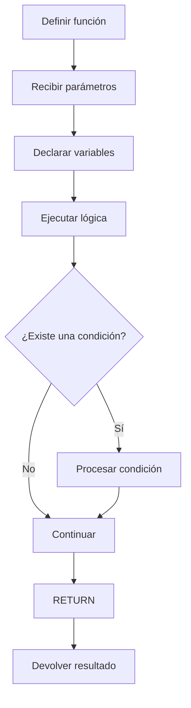
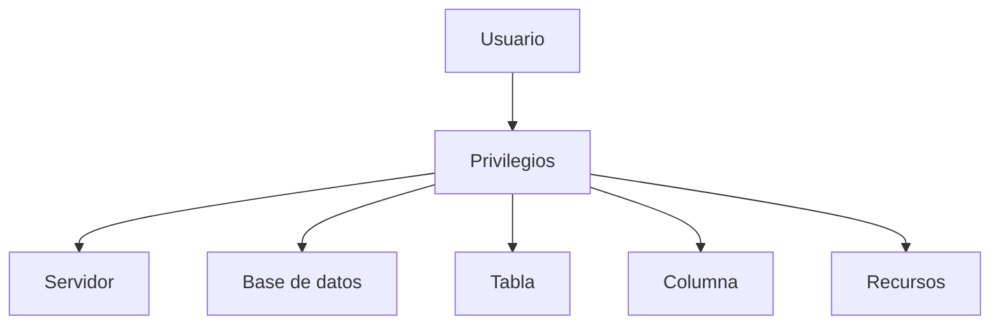
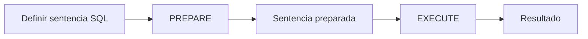
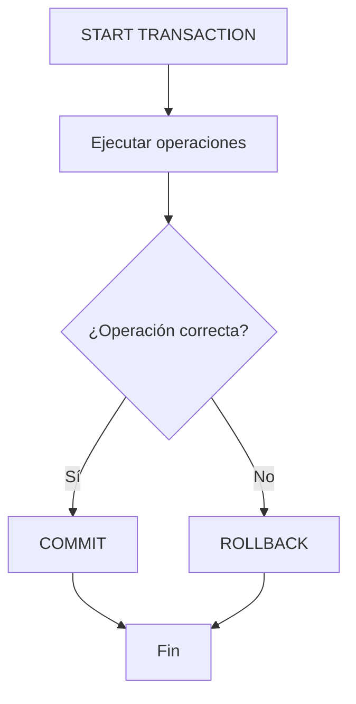

# Funciones definidas por el usuario, seguridad y permisos en MySQL

## 1. Funciones definidas por el usuario

Las **funciones definidas por el usuario (UDF, User-Defined Functions)** en MySQL son funciones creadas por los desarrolladores para encapsular una operación específica y reutilizarla dentro de consultas SQL.

A diferencia de un procedimiento almacenado, una función debe devolver un valor mediante `RETURN`.

Las funciones pueden utilizarse, por ejemplo, para:

* Realizar cálculos.
* Transformar datos.
* Clasificar información.
* Obtener valores derivados.
* Reutilizar lógica dentro de consultas SQL.

---

## 2. Elementos característicos de una función

### Tipo de retorno

Toda función debe definir el tipo de dato que devolverá mediante `RETURNS`.

Por ejemplo:

```sql
RETURNS DOUBLE
```

indica que la función devolverá un valor de tipo `DOUBLE`.

El tipo de retorno permite determinar qué tipo de resultado producirá la función.

### `DETERMINISTIC`

Una función marcada como `DETERMINISTIC` siempre debe producir el mismo resultado cuando recibe los mismos valores de entrada y no depende de datos externos que puedan cambiar.

```sql
DETERMINISTIC
```

Por ejemplo, una función que calcula el área de un círculo solamente a partir de su radio puede considerarse determinista.

### `NOT DETERMINISTIC`

Indica que el resultado de la función puede variar aunque se proporcionen los mismos parámetros.

Esto ocurre, por ejemplo, cuando la función utiliza valores que cambian con el tiempo, como la hora actual.

```sql
NOT DETERMINISTIC
```

---

# 3. Estructura básica de una función

La estructura general de una función almacenada es:

```sql
DELIMITER //

CREATE FUNCTION nombre_funcion(parametro tipo_dato)
RETURNS tipo_retorno
DETERMINISTIC
BEGIN
    -- Cuerpo de la función
    RETURN valor;
END //

DELIMITER ;
```

Una función puede contener:

* Parámetros de entrada.
* Variables locales.
* Consultas SQL.
* Condiciones.
* Ciclos.
* Operaciones matemáticas.
* Un `RETURN` con el resultado.

> [!IMPORTANT]
> Una función debe devolver un valor compatible con el tipo definido en `RETURNS`.

---

# 4. Funciones almacenadas en `acme_store`

Los siguientes ejemplos utilizan la base de datos `acme_store`.

```sql
USE acme_store;
```

---

## 5. Primera función: calcular el área de un círculo

La función `calcular_area_circulo` recibe el radio de un círculo y devuelve su área.

### Código

```sql
/*
================================================================
                FUNCIONES ALMACENADAS
================================================================
*/

/*
================================================================
                PRIMERA FUNCION ALMACENADA
================================================================
*/

-- Calcular el área de un círculo

-- Eliminar la función antes de comenzar si ya existe
DROP FUNCTION IF EXISTS calcular_area_circulo;

-- Crear función almacenada
DELIMITER //

CREATE FUNCTION calcular_area_circulo(radio DOUBLE)
RETURNS DOUBLE
DETERMINISTIC
BEGIN
    DECLARE area DOUBLE;

    SET area = PI() * radio * radio;

    RETURN area;
END //

DELIMITER ;

-- Probar la función almacenada con datos
SELECT calcular_area_circulo(20);
```

### Explicación

La fórmula utilizada para calcular el área de un círculo es:

```text
Área = π × radio²
```

La variable local:

```sql
DECLARE area DOUBLE;
```

almacena temporalmente el resultado.

Después se realiza el cálculo:

```sql
SET area = PI() * radio * radio;
```

Finalmente:

```sql
RETURN area;
```

devuelve el resultado.

La función está marcada como `DETERMINISTIC` porque para un mismo radio produce siempre el mismo resultado.

---

# 6. Segunda función: calcular el IVA de un producto

La función `calcular_iva` recibe:

* El identificador del producto.
* El porcentaje de IVA.

Después consulta el precio del producto y calcula el valor correspondiente al IVA.

### Código

```sql
/*
================================================================
                SEGUNDA FUNCION ALMACENADA
================================================================
*/

-- Eliminar la función almacenada si existe
DROP FUNCTION IF EXISTS calcular_iva;

-- Función para calcular el IVA de un producto
DELIMITER //

CREATE FUNCTION calcular_iva(
    producto_id INT,
    porcentaje_iva FLOAT
)
RETURNS FLOAT
DETERMINISTIC
BEGIN
    DECLARE totalIVA FLOAT;
    DECLARE precio_prod FLOAT;

    SELECT precio
    INTO precio_prod
    FROM productos
    WHERE id = producto_id;

    SET totalIVA = precio_prod * porcentaje_iva / 100;

    RETURN totalIVA;
END //

DELIMITER ;

-- Almacenar el resultado en una variable
SET @iva_producto = calcular_iva(1, 19);

-- Seleccionar la variable
SELECT @iva_producto;

-- Seleccionar todos los productos con un IVA del 19 %
SELECT
    id,
    calcular_iva(id, 19) AS iva
FROM productos;
```

### Explicación

La función recibe el identificador:

```sql
producto_id INT
```

y el porcentaje:

```sql
porcentaje_iva FLOAT
```

Primero se obtiene el precio del producto:

```sql
SELECT precio
INTO precio_prod
FROM productos
WHERE id = producto_id;
```

El precio se almacena en la variable local `precio_prod`.

Después se calcula el IVA:

```sql
SET totalIVA = precio_prod * porcentaje_iva / 100;
```

Finalmente se devuelve:

```sql
RETURN totalIVA;
```

### Utilización dentro de una consulta

Una función puede utilizarse directamente dentro de un `SELECT`:

```sql
SELECT
    id,
    calcular_iva(id, 19) AS iva
FROM productos;
```

Esto permite calcular el IVA individualmente para cada producto.

---

# 7. Tercera función: clasificar películas

Esta función clasifica una película dependiendo de la edad recibida.

### Reglas

| Edad           | Categoría         |
| -------------- | ----------------- |
| Menor de `13`  | Para niños        |
| De `13` a `17` | Para adolescentes |
| `18` o más     | Para adultos      |

### Código

```sql
/*
================================================================
                TERCERA FUNCION ALMACENADA
================================================================
*/

-- Eliminar la función almacenada si existe
DROP FUNCTION IF EXISTS clasificar_pelicula;

-- Función para clasificar películas
DELIMITER //

CREATE FUNCTION clasificar_pelicula(edad INT)
RETURNS VARCHAR(20)
DETERMINISTIC
BEGIN
    IF edad < 13 THEN
        RETURN 'Para niños';

    ELSEIF edad < 18 THEN
        RETURN 'Para adolescentes';

    ELSE
        RETURN 'Para adultos';
    END IF;
END //

DELIMITER ;
```

### Explicación

La función utiliza una estructura condicional:

```sql
IF
ELSEIF
ELSE
END IF
```

La primera condición:

```sql
IF edad < 13 THEN
```

clasifica las edades menores de `13`.

La segunda:

```sql
ELSEIF edad < 18 THEN
```

clasifica las edades desde `13` hasta `17`.

Finalmente:

```sql
ELSE
```

se utiliza para las edades de `18` o más.

---

# 8. Función para calcular un factorial

El **factorial** de un número entero positivo consiste en multiplicar ese número por todos los enteros positivos menores que él.

Por ejemplo:

```text
5! = 5 × 4 × 3 × 2 × 1 = 120
```

La función utiliza un ciclo `WHILE` para realizar el cálculo.

### Código

```sql
DROP FUNCTION IF EXISTS calcular_factorial;

DELIMITER //

CREATE FUNCTION calcular_factorial(numero INT)
RETURNS INT
DETERMINISTIC
BEGIN
    DECLARE resultado INT DEFAULT 1;

    WHILE numero > 1 DO
        SET resultado = resultado * numero;
        SET numero = numero - 1;
    END WHILE;

    RETURN resultado;
END //

DELIMITER ;

SELECT calcular_factorial(20);
```

### Explicación

La variable:

```sql
DECLARE resultado INT DEFAULT 1;
```

comienza con el valor `1`.

El ciclo:

```sql
WHILE numero > 1 DO
```

continúa mientras `numero` sea mayor que `1`.

En cada iteración:

```sql
SET resultado = resultado * numero;
```

multiplica el resultado acumulado por el número actual.

Después:

```sql
SET numero = numero - 1;
```

disminuye el número para continuar con la siguiente multiplicación.

Finalmente:

```sql
RETURN resultado;
```

devuelve el factorial calculado.

---

# 9. Función para obtener el producto de menor precio

Esta función devuelve el código y nombre del producto que tenga el precio más bajo.

### Código

```sql
DROP FUNCTION IF EXISTS obtener_producto_menor_precio;

DELIMITER //

CREATE FUNCTION obtener_producto_menor_precio()
RETURNS VARCHAR(100)
DETERMINISTIC
BEGIN
    DECLARE nombre_producto VARCHAR(100);

    SELECT CONCAT(codigo, ' - ', nombre)
    INTO nombre_producto
    FROM productos
    ORDER BY precio ASC
    LIMIT 1;

    RETURN nombre_producto;
END //

DELIMITER ;

SELECT obtener_producto_menor_precio();
```

### Explicación

La función utiliza:

```sql
ORDER BY precio ASC
```

para ordenar los productos desde el precio más bajo hasta el más alto.

Después:

```sql
LIMIT 1
```

selecciona únicamente el primer registro.

La función combina el código y nombre mediante:

```sql
CONCAT(codigo, ' - ', nombre)
```

El resultado puede tener una estructura similar a:

```text
P01 - Producto 1
```

---

# 10. Función para obtener la hora actual

Esta función devuelve un mensaje que contiene la hora actual.

Como la hora cambia con el tiempo, la función se declara como `NOT DETERMINISTIC`.

### Código

```sql
DROP FUNCTION IF EXISTS hora_actual;

DELIMITER //

CREATE FUNCTION hora_actual()
RETURNS VARCHAR(100)
NOT DETERMINISTIC
BEGIN
    RETURN CONCAT(
        'La hora actual es: ',
        CURRENT_TIME()
    );
END //

DELIMITER ;

SELECT hora_actual();
```

### Explicación

La función utiliza:

```sql
CURRENT_TIME()
```

para obtener la hora actual.

Después utiliza `CONCAT()` para construir el mensaje:

```sql
CONCAT(
    'La hora actual es: ',
    CURRENT_TIME()
)
```

El resultado cambia dependiendo del momento en que se ejecute la función.

---

# 11. Función para dividir números

Esta función recibe un dividendo y un divisor.

Antes de realizar la división comprueba que el divisor no sea `0`.

### Código

```sql
DROP FUNCTION IF EXISTS dividir_numero;

DELIMITER //

CREATE FUNCTION dividir_numero(
    dividiendo DECIMAL(10,2),
    divisor DECIMAL(10,2)
)
RETURNS DECIMAL(10,2)
DETERMINISTIC
BEGIN
    IF divisor = 0 THEN
        SIGNAL SQLSTATE '45000'
        SET MESSAGE_TEXT = 'No se puede dividir un número por cero';
    END IF;

    RETURN dividiendo / divisor;
END //

DELIMITER ;

SELECT dividir_numero(8, 2);
```

### Explicación

Primero se valida:

```sql
IF divisor = 0 THEN
```

Si el divisor es `0`, se genera una excepción personalizada mediante:

```sql
SIGNAL SQLSTATE '45000'
```

y se proporciona un mensaje:

```sql
SET MESSAGE_TEXT = 'No se puede dividir un número por cero';
```

Si el divisor es válido, se ejecuta:

```sql
RETURN dividiendo / divisor;
```

---

# 12. Flujo general de una función

Una función almacenada sigue conceptualmente este flujo:



---

# 13. Seguridad y permisos en MySQL

## Introducción

En la administración de bases de datos MySQL, la **seguridad** y el **manejo de permisos** son fundamentales para proteger la información y controlar qué acciones puede realizar cada usuario.

La seguridad busca evitar que personas o aplicaciones no autorizadas puedan:

* Acceder a información.
* Modificar datos.
* Eliminar datos.
* Crear estructuras.
* Ejecutar operaciones no permitidas.
* Comprometer la integridad de la base de datos.

También incluye la protección de los datos durante su transmisión y almacenamiento, así como medidas para reducir riesgos como las inyecciones SQL.

---

# 14. Usuarios de MySQL

MySQL administra cuentas de usuario asociadas a un host.

Una cuenta se identifica mediante:

```text
'usuario'@'host'
```

Por ejemplo:

```sql
'Velasco'@'localhost'
```

significa que el usuario `Velasco` puede conectarse desde `localhost`.

---

## Usuario `root`

`root` es una cuenta administrativa con privilegios elevados sobre el servidor MySQL.

Se utiliza para tareas administrativas como:

* Crear usuarios.
* Administrar permisos.
* Crear y eliminar bases de datos.
* Modificar configuraciones y estructuras.
* Administrar cuentas.

> [!WARNING]
> Una cuenta con privilegios administrativos debe utilizarse con cuidado. Para operaciones normales es preferible trabajar con usuarios que tengan únicamente los permisos necesarios.

---

## Usuarios anónimos

Una instalación de MySQL puede contener cuentas anónimas dependiendo de la configuración y versión.

Estas cuentas no tienen un nombre de usuario convencional y pueden representar un riesgo si permanecen innecesariamente habilitadas.

Para eliminarlas se puede utilizar:

```sql
DROP USER ''@'localhost';
```

---

# 15. Consultar usuarios existentes

Los usuarios y sus hosts pueden consultarse mediante:

```sql
SELECT
    user,
    host
FROM mysql.user;
```

---

# 16. Crear usuarios

La instrucción `CREATE USER` permite crear una nueva cuenta.

```sql
CREATE USER 'Velasco'@'localhost'
IDENTIFIED BY '<contraseña_segura>';
```

La estructura general es:

```sql
CREATE USER 'usuario'@'host'
IDENTIFIED BY 'contraseña';
```

### Elementos

* `CREATE USER`: crea la cuenta.
* `'usuario'`: nombre de la cuenta.
* `'host'`: origen desde el que puede conectarse.
* `IDENTIFIED BY`: establece la contraseña.

---

# 17. Eliminar usuarios

Antes de crear una cuenta también puede eliminarse una cuenta existente si se desea recrearla.

```sql
DROP USER IF EXISTS 'Velasco'@'localhost';
```

`IF EXISTS` evita generar un error si el usuario no existe.

---

# 18. Privilegios con `GRANT`

`GRANT` permite asignar privilegios a un usuario.

Por ejemplo:

```sql
GRANT SELECT, INSERT, UPDATE
ON acme_store.*
TO 'Velasco'@'localhost';
```

Este comando concede:

* `SELECT`
* `INSERT`
* `UPDATE`

sobre todas las tablas de la base de datos `acme_store`.

### Estructura

```sql
GRANT privilegios
ON base_de_datos.objeto
TO 'usuario'@'host';
```

---

## Significado de `*`

En:

```sql
acme_store.*
```

el `*` representa todos los objetos compatibles con ese nivel de privilegio dentro de la base de datos.

---

# 19. Consultar privilegios

Para consultar los privilegios asignados a un usuario:

```sql
SHOW GRANTS FOR 'Velasco'@'localhost';
```

Esto permite comprobar qué permisos tiene la cuenta.

---

# 20. Ejemplo de usuario vendedor

Se puede crear un usuario destinado a trabajar con determinadas tablas:

```sql
CREATE USER 'vendedor'@'localhost'
IDENTIFIED BY '<contraseña_segura>';

GRANT SELECT, INSERT, UPDATE, DELETE
ON acme_store.productos
TO 'vendedor'@'localhost';

GRANT SELECT, INSERT, UPDATE, DELETE
ON acme_store.categoria
TO 'vendedor'@'localhost';
```

En este caso, el usuario recibe permisos únicamente sobre las tablas indicadas.

---

# 21. Revocar privilegios con `REVOKE`

`REVOKE` permite retirar privilegios previamente asignados.

Por ejemplo:

```sql
REVOKE SELECT
ON acme_store.*
FROM 'Velasco'@'localhost';
```

Este comando elimina el privilegio `SELECT` que el usuario tenía sobre los objetos indicados.

### Estructura

```sql
REVOKE privilegios
ON objeto
FROM 'usuario'@'host';
```

---

# 22. Limitar consultas por hora

MySQL permite establecer límites de recursos para determinadas cuentas.

Por ejemplo:

```sql
ALTER USER 'Velasco'@'localhost'
WITH MAX_QUERIES_PER_HOUR 100;
```

Esto establece un máximo de `100` consultas por hora para la cuenta.

---

# 23. Asignar privilegios específicos sobre una tabla

También es posible asignar privilegios concretos sobre una tabla:

```sql
GRANT DELETE
ON acme_store.usuarios
TO 'Velasco'@'localhost';
```

En este caso, el usuario obtiene el privilegio `DELETE` sobre la tabla `usuarios`.

---

# 24. Usuario administrativo

Un usuario puede recibir privilegios administrativos mediante `GRANT`.

```sql
DROP USER IF EXISTS 'Velasco_admin'@'localhost';

CREATE USER 'Velasco_admin'@'localhost'
IDENTIFIED BY '<contraseña_segura>';

GRANT ALL PRIVILEGES
ON *.*
TO 'Velasco_admin'@'localhost'
WITH GRANT OPTION;

SHOW GRANTS FOR 'Velasco_admin'@'localhost';
```

### `ALL PRIVILEGES`

Concede todos los privilegios disponibles para el nivel especificado.

En:

```sql
ON *.*
```

el primer `*` representa cualquier base de datos y el segundo `*` cualquier objeto dentro de esas bases de datos.

### `WITH GRANT OPTION`

Permite que el usuario pueda conceder a otros usuarios los privilegios que posee.

> [!WARNING]
> `GRANT ALL PRIVILEGES ON *.* WITH GRANT OPTION` proporciona un nivel de acceso muy elevado y debe reservarse para cuentas administrativas que realmente lo necesiten.

---

# 25. Privilegios sobre columnas

Los privilegios también pueden limitarse a determinadas columnas de una tabla.

Por ejemplo:

```sql
GRANT SELECT (id, nombre)
ON acme_store.empleados
TO 'Velasco'@'localhost';
```

Este privilegio permite consultar únicamente las columnas `id` y `nombre` de la tabla `empleados`.

Esto permite aplicar un control más específico sobre la información disponible para cada usuario.

---

# 26. Administración de privilegios

El control de acceso puede organizarse mediante diferentes niveles.



El principio general consiste en otorgar a cada usuario únicamente los permisos que necesita para realizar sus tareas.

> [!IMPORTANT]
> Este enfoque se relaciona con el principio de **mínimo privilegio**: un usuario debe recibir solamente los permisos necesarios para realizar sus funciones.

---

# 27. Seguridad de las bases de datos

La seguridad en MySQL comprende las medidas utilizadas para proteger los datos almacenados contra accesos, modificaciones, eliminaciones o usos no autorizados.

Entre los aspectos principales se encuentran:

* Control de acceso.
* Gestión de usuarios.
* Gestión de privilegios.
* Uso de contraseñas seguras.
* Protección de datos en tránsito.
* Protección de datos en reposo.
* Prevención de accesos no autorizados.
* Prevención de ataques como la inyección SQL.
* Control de operaciones realizadas por los usuarios.

---

# 28. Sentencias `PREPARE` y `EXECUTE`

MySQL permite preparar sentencias SQL para ejecutarlas posteriormente.

## `PREPARE`

`PREPARE` crea una sentencia preparada a partir de una cadena SQL.

La sentencia puede contener marcadores de posición:

```sql
?
```

Por ejemplo:

```sql
SET @sql = 'SELECT * FROM productos WHERE id = ?';

PREPARE consulta
FROM @sql;
```

## `EXECUTE`

`EXECUTE` ejecuta una sentencia que previamente fue preparada.

```sql
SET @producto_id = 1;

EXECUTE consulta
USING @producto_id;
```

El flujo general es:



> [!IMPORTANT]
> Las sentencias preparadas permiten separar la estructura de una consulta de los valores que se proporcionan posteriormente. Esto resulta especialmente útil para trabajar con consultas dinámicas y reducir ciertos riesgos asociados a la construcción incorrecta de SQL dinámico.

---

# 29. Manejo de excepciones

Los manejadores de excepciones permiten controlar diferentes tipos de eventos, errores o condiciones que pueden ocurrir durante la ejecución de operaciones SQL.

En procedimientos almacenados y bloques `BEGIN ... END`, MySQL permite utilizar `DECLARE ... HANDLER`.

---

## `SQLSTATE`

`SQLSTATE` es un código estandarizado que representa una condición o error SQL.

Por ejemplo:

```sql
SIGNAL SQLSTATE '45000'
SET MESSAGE_TEXT = 'No se puede realizar la operación';
```

El estado `'45000'` se utiliza para señalar una condición de excepción definida por el usuario.

---

## `SQLWARNING`

`SQLWARNING` permite capturar condiciones correspondientes a advertencias.

Una advertencia no necesariamente representa un error que detenga la ejecución, pero puede requerir atención.

Ejemplo de estructura:

```sql
DECLARE CONTINUE HANDLER FOR SQLWARNING
BEGIN
    -- Acción para manejar la advertencia
END;
```

---

# 30. Continuar después de una condición

Con `CONTINUE`, el manejador realiza una acción y después permite que el procedimiento continúe.

```sql
DECLARE CONTINUE HANDLER FOR SQLWARNING
BEGIN
    -- Manejar la advertencia
END;
```

El flujo general es:

```text
Ocurre una condición
        ↓
Se ejecuta el HANDLER
        ↓
Continúa la ejecución
```

---

# 31. Salir del bloque

Con `EXIT`, el manejador realiza la acción correspondiente y posteriormente abandona el bloque donde fue declarado.

```sql
DECLARE EXIT HANDLER FOR SQLEXCEPTION
BEGIN
    -- Manejar el error
END;
```

El flujo general es:

```text
Ocurre una excepción
        ↓
Se ejecuta el HANDLER
        ↓
Se abandona el bloque
```

---

# 32. Revertir cambios ante errores

Cuando una operación utiliza una transacción, un error puede provocar la necesidad de revertir los cambios realizados.

El flujo habitual es:

```sql
START TRANSACTION;

-- Operaciones SQL

COMMIT;
```

Si ocurre un error:

```sql
ROLLBACK;
```

De esta forma, los cambios que todavía no hayan sido confirmados pueden revertirse.

### Flujo



---

# 33. Resumen

## Funciones definidas por el usuario

Las funciones almacenadas permiten encapsular lógica reutilizable dentro de MySQL.

Sus elementos principales son:

* `CREATE FUNCTION`.
* Parámetros.
* `RETURNS`.
* `DETERMINISTIC`.
* `NOT DETERMINISTIC`.
* `BEGIN ... END`.
* Variables locales mediante `DECLARE`.
* `RETURN`.

Entre los ejemplos trabajados se encuentran:

* Cálculo del área de un círculo.
* Cálculo del IVA.
* Clasificación de películas.
* Cálculo de factoriales.
* Obtención del producto de menor precio.
* Obtención de la hora actual.
* División con validación del divisor.

## Seguridad y permisos

MySQL permite administrar el acceso mediante:

* Usuarios.
* Hosts.
* Contraseñas.
* Privilegios.
* `GRANT`.
* `REVOKE`.
* `SHOW GRANTS`.
* `ALTER USER`.
* Privilegios sobre bases de datos.
* Privilegios sobre tablas.
* Privilegios sobre columnas.
* Límites de recursos.
* Cuentas administrativas.

## Manejo de excepciones

Los procedimientos pueden controlar errores y condiciones mediante:

* `DECLARE HANDLER`.
* `CONTINUE`.
* `EXIT`.
* `SQLSTATE`.
* `SQLWARNING`.
* `SQLEXCEPTION`.
* `SIGNAL`.
* `COMMIT`.
* `ROLLBACK`.

# Glosario

| Término             | Descripción                                                                                                            |
| ------------------- | ---------------------------------------------------------------------------------------------------------------------- |
| `UDF`               | Función definida por el usuario que encapsula una operación reutilizable.                                              |
| `Stored Function`   | Función almacenada dentro del servidor de base de datos y ejecutable desde SQL.                                        |
| `RETURNS`           | Define el tipo de dato que devuelve una función.                                                                       |
| `RETURN`            | Devuelve el resultado de una función.                                                                                  |
| `DETERMINISTIC`     | Indica que una función debe producir el mismo resultado con los mismos valores de entrada bajo las mismas condiciones. |
| `NOT DETERMINISTIC` | Indica que el resultado de una función puede variar para los mismos valores de entrada.                                |
| `GRANT`             | Sentencia utilizada para conceder privilegios a usuarios.                                                              |
| `REVOKE`            | Sentencia utilizada para retirar privilegios previamente concedidos.                                                   |
| `Privilege`         | Permiso que determina qué operaciones puede realizar un usuario.                                                       |
| `Host`              | Origen desde el que una cuenta de MySQL puede conectarse.                                                              |
| `Root`              | Cuenta administrativa de MySQL con privilegios elevados.                                                               |
| `PREPARE`           | Crea una sentencia SQL preparada para su posterior ejecución.                                                          |
| `EXECUTE`           | Ejecuta una sentencia previamente preparada.                                                                           |
| `SQLSTATE`          | Código estandarizado que identifica una condición SQL.                                                                 |
| `SQLWARNING`        | Condición utilizada para manejar advertencias SQL.                                                                     |
| `SQLEXCEPTION`      | Condición utilizada para manejar excepciones SQL generales.                                                            |
| `HANDLER`           | Mecanismo que define qué hacer cuando ocurre una condición o error.                                                    |
| `CONTINUE`          | Tipo de manejador que permite continuar después de gestionar una condición.                                            |
| `EXIT`              | Tipo de manejador que abandona el bloque donde fue declarado.                                                          |
| `SIGNAL`            | Instrucción utilizada para generar explícitamente una condición o excepción.                                           |
| `TRANSACTION`       | Unidad lógica de trabajo que agrupa operaciones que pueden confirmarse o revertirse.                                   |
| `COMMIT`            | Confirma los cambios realizados durante una transacción.                                                               |
| `ROLLBACK`          | Revierte cambios de una transacción que todavía no han sido confirmados.                                               |
| `Mínimo privilegio` | Principio de seguridad que consiste en conceder únicamente los permisos necesarios para realizar una tarea.            |
| `WITH GRANT OPTION` | Permite que un usuario conceda a otros usuarios determinados privilegios que posee.                                    |
