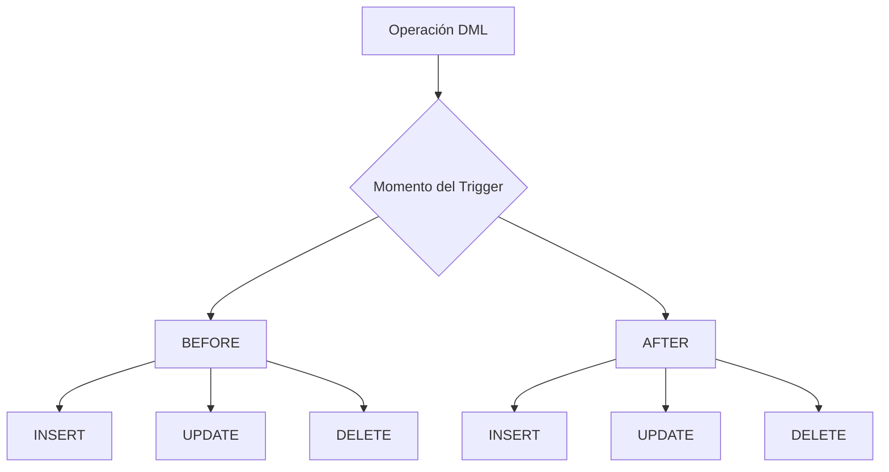
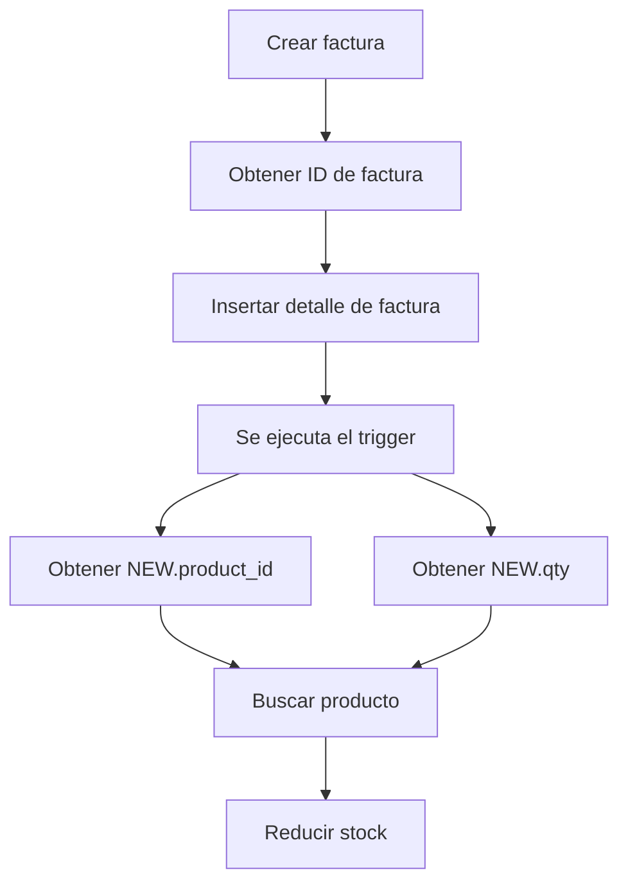

# Eventos y Triggers en MySQL

## Introducción

MySQL permite automatizar determinadas tareas mediante **eventos (Events)** y **triggers (Triggers)**.

Estas herramientas permiten ejecutar instrucciones SQL automáticamente como respuesta a:

- Un momento específico.
- Un intervalo de tiempo.
- Una operación `INSERT`.
- Una operación `UPDATE`.
- Una operación `DELETE`.

Aunque ambos mecanismos permiten automatizar tareas, funcionan de manera diferente:

- Los **eventos** se ejecutan según una programación definida.
- Los **triggers** se ejecutan automáticamente cuando ocurre una operación sobre una tabla.

---

# Eventos en MySQL

## ¿Qué es un evento?

Un **evento (Event)** en MySQL es una tarea programada que ejecuta automáticamente una o varias instrucciones SQL en un momento específico o de manera recurrente.

Los eventos funcionan internamente dentro del motor de la base de datos.

Algunos usos comunes son:

- Limpieza automática de registros.
- Actualización de estadísticas.
- Generación de reportes periódicos.
- Archivado de información.
- Actualización programada de datos.
- Procesos de mantenimiento.

> [!IMPORTANT]
> Los eventos están orientados a tareas basadas en tiempo. Si se necesita reaccionar inmediatamente a un `INSERT`, `UPDATE` o `DELETE`, normalmente se utiliza un trigger.

---

## Importancia de los eventos

La programación de tareas mediante eventos puede aportar:

- **Automatización y eficiencia:** evita ejecutar manualmente tareas repetitivas.
- **Optimización del rendimiento:** permite programar procesos de mantenimiento en horarios adecuados.
- **Consistencia:** las operaciones programadas se ejecutan de manera uniforme.
- **Escalabilidad y mantenimiento:** facilita la administración de tareas periódicas.
- **Adaptabilidad:** permite automatizar procesos que responden a necesidades del negocio.
- **Reducción de cargas pico:** determinadas tareas pueden programarse en horarios de menor actividad.

---

## Tipos de eventos

### Eventos de una sola ejecución

Son eventos programados para ejecutarse una sola vez en un momento determinado.

Pueden utilizarse para tareas como:

- Migraciones únicas.
- Cambios temporales de configuración.
- Procesos de mantenimiento puntuales.

### Eventos recurrentes

Son eventos que se ejecutan repetidamente en intervalos determinados.

Por ejemplo:

- Cada minuto.
- Cada hora.
- Cada día.
- Cada semana.
- Cada mes.

Son especialmente útiles para tareas de mantenimiento y generación periódica de información.

---

# Sintaxis básica de un evento

La estructura general de un evento es:

```sql
CREATE EVENT [IF NOT EXISTS] nombre_evento
ON SCHEDULE schedule
[ON COMPLETION [NOT] PRESERVE]
[ENABLE | DISABLE]
DO
    sentencia_sql;
````

Por ejemplo:

```sql
CREATE EVENT IF NOT EXISTS limpiar_logs
    ON SCHEDULE EVERY 1 DAY
DO
    DELETE FROM mensaje_errores
    WHERE fecha_hora < NOW() - INTERVAL 5 DAY;
```

Este evento ejecuta diariamente un `DELETE` que elimina registros anteriores a cinco días.

---

# Requisitos para utilizar eventos

## Permisos

El usuario debe contar con los permisos necesarios para:

* Crear eventos.
* Modificar eventos.
* Eliminar eventos.

## Event Scheduler

MySQL dispone de un programador llamado **Event Scheduler**, responsable de ejecutar los eventos programados.

Para consultar su estado:

```sql
SHOW VARIABLES LIKE 'event_scheduler';
```

Para activarlo globalmente:

```sql
SET GLOBAL event_scheduler = ON;
```

> [!NOTE]
> El `Event Scheduler` debe estar habilitado para que MySQL pueda ejecutar los eventos programados.

---

# Consejos para programar eventos eficientemente

Al trabajar con eventos es recomendable considerar:

* Optimización de las consultas.
* Gestión adecuada del tiempo de ejecución.
* Revisión y mantenimiento periódico.
* Limitación del alcance del evento.
* Uso de transacciones cuando sea necesario.
* Pruebas rigurosas.
* Documentación del propósito del evento.

---

# Seguridad y permisos en eventos

Al implementar eventos deben considerarse:

* **Principio de menor privilegio:** otorgar únicamente los permisos necesarios.
* **Validación de entradas:** especialmente cuando intervengan consultas dinámicas.
* **Registro y monitoreo:** controlar la ejecución de los procesos.
* **Seguridad a nivel de datos:** proteger la información manipulada.
* **Auditoría:** revisar periódicamente los eventos existentes.
* **Actualizaciones y parches:** mantener MySQL actualizado para reducir riesgos de seguridad.

---

# Ejemplo: limpieza automática de registros

```sql
USE acme_store;

-- Verificar si el programador de eventos está activo
SHOW VARIABLES LIKE 'event_scheduler';

-- Activar el programador de eventos
SET GLOBAL event_scheduler = ON;

-- Eliminar registros de errores con más de 5 días de antigüedad
CREATE EVENT IF NOT EXISTS limpiar_logs
    ON SCHEDULE EVERY 1 DAY
DO
    DELETE FROM mensaje_errores
    WHERE fecha_hora < NOW() - INTERVAL 5 DAY;
```

### Explicación

El evento `limpiar_logs` se ejecuta cada día.

La condición:

```sql
fecha_hora < NOW() - INTERVAL 5 DAY
```

selecciona los registros cuya fecha sea anterior a cinco días respecto al momento actual.

---

# Ejemplo completo: sistema de ventas

A continuación se crea una pequeña estructura para trabajar con clientes, productos, facturas y detalles de facturas.

## Crear la base de datos

```sql
CREATE DATABASE IF NOT EXISTS tecno_store;

USE tecno_store;
```

## Tabla de clientes

```sql
CREATE TABLE IF NOT EXISTS customers (
    id INT PRIMARY KEY AUTO_INCREMENT,
    code VARCHAR(6) NOT NULL,
    name VARCHAR(60) NOT NULL,
    email VARCHAR(160) NOT NULL
) ENGINE=InnoDB;
```

## Tabla de productos

```sql
CREATE TABLE IF NOT EXISTS products (
    id INT PRIMARY KEY AUTO_INCREMENT,
    code VARCHAR(6) NOT NULL,
    name VARCHAR(60) NOT NULL,
    price FLOAT NOT NULL CHECK (price > 0),
    stock INT NOT NULL DEFAULT 0
) ENGINE=InnoDB;
```

## Tabla de facturas

```sql
CREATE TABLE IF NOT EXISTS invoices (
    id INT PRIMARY KEY AUTO_INCREMENT,
    customer_id INT NOT NULL,
    created_at DATETIME DEFAULT CURRENT_TIMESTAMP,
    FOREIGN KEY (customer_id) REFERENCES customers(id)
) ENGINE=InnoDB;
```

## Tabla de detalles de factura

```sql
CREATE TABLE IF NOT EXISTS invoices_item (
    id INT PRIMARY KEY AUTO_INCREMENT,
    invoice_id INT NOT NULL,
    product_id INT NOT NULL,
    qty INT NOT NULL DEFAULT 1 CHECK (qty > 0),
    price FLOAT NOT NULL,
    FOREIGN KEY (invoice_id) REFERENCES invoices(id),
    FOREIGN KEY (product_id) REFERENCES products(id)
) ENGINE=InnoDB;
```

---

## Insertar clientes

```sql
INSERT IGNORE INTO customers (code, name, email) VALUES
('TX-001', 'Ana García', 'ana.garcia@email.com'),
('TX-002', 'Marcos López', 'm.lopez@email.com'),
('TX-003', 'Lucía Torres', 'lucia.t@email.com'),
('TX-004', 'Roberto Sanz', 'roberto.sanz@email.com');
```

---

## Insertar productos

```sql
INSERT IGNORE INTO products (name, price, stock) VALUES
('Laptop Pro 15', 1200.00, 10),
('Mouse Inalámbrico', 25.50, 50),
('Monitor 4K', 350.00, 15),
('Teclado Mecánico', 80.00, 20),
('Cable HDMI 2.0', 12.00, 100);
```

---

## Insertar facturas

```sql
INSERT IGNORE INTO invoices (customer_id, created_at) VALUES
(1, '2024-01-10 09:15:00'),
(1, '2024-01-15 14:30:00'),
(1, '2024-02-01 11:00:00'),
(1, '2024-02-20 16:45:00'),
(2, '2024-01-12 10:00:00'),
(2, '2024-01-18 12:20:00'),
(2, '2024-02-05 15:10:00'),
(2, '2024-02-22 08:30:00'),
(3, '2024-01-14 11:45:00'),
(3, '2024-01-25 13:00:00'),
(3, '2024-02-10 17:15:00'),
(3, '2024-02-28 09:50:00'),
(4, '2024-01-08 16:00:00'),
(4, '2024-01-30 10:40:00'),
(4, '2024-02-14 14:15:00'),
(4, '2024-02-25 18:20:00');
```

---

## Insertar detalles de las facturas

```sql
INSERT IGNORE INTO invoices_item
    (invoice_id, product_id, qty, price)
VALUES
(1, 1, 1, 1200.00),
(1, 2, 1, 25.50),
(5, 3, 1, 350.00),
(5, 4, 1, 80.00),
(10, 1, 1, 1200.00),
(10, 3, 1, 350.00),
(13, 3, 1, 350.00),
(13, 2, 1, 25.50);
```

---

# Evento para generar un reporte mensual de ventas

Primero se crea una tabla donde se almacenará el reporte:

```sql
CREATE TABLE IF NOT EXISTS reporte_ventas_meses (
    mes VARCHAR(8),
    total_ventas FLOAT
);
```

Después se elimina una versión anterior del evento:

```sql
DROP EVENT IF EXISTS reporte_ventas_meses;
```

Se cambia temporalmente el delimitador:

```sql
DELIMITER //
```

Finalmente se crea el evento:

```sql
CREATE EVENT reporte_ventas_meses
    ON SCHEDULE EVERY 1 MONTH
    STARTS '2026-09-01 00:00:00'
DO
BEGIN
    -- Limpia la tabla antes de generar el nuevo reporte
    TRUNCATE TABLE reporte_ventas_meses;

    -- Inserta el total de ventas agrupado por mes
    INSERT INTO reporte_ventas_meses (mes, total_ventas)
    SELECT
        DATE_FORMAT(inv.created_at, '%Y-%m'),
        SUM(i.qty * i.price)
    FROM invoices_item i
    INNER JOIN invoices inv
        ON i.invoice_id = inv.id
    GROUP BY 1;
END //

DELIMITER ;
```

### Consultar el reporte

```sql
SELECT *
FROM reporte_ventas_meses;
```

Para limpiar manualmente la tabla:

```sql
TRUNCATE TABLE reporte_ventas_meses;
```

---

## Modificar la programación de un evento

Un evento existente puede modificarse mediante `ALTER EVENT`.

Por ejemplo:

```sql
ALTER EVENT reporte_ventas_meses
    ON SCHEDULE EVERY 1 DAY
    STARTS '2026-08-11 07:46:00';
```

Esto cambia la frecuencia de ejecución del evento para que se ejecute diariamente.

---

# Triggers en MySQL

## ¿Qué es un trigger?

Un **trigger** es un conjunto de instrucciones SQL que se ejecuta automáticamente como respuesta a determinados eventos sobre una tabla.

Los eventos que pueden activar un trigger son:

* `INSERT`
* `UPDATE`
* `DELETE`

Los triggers están vinculados a una tabla específica.

---

# Partes de un trigger

Un trigger se define mediante dos elementos principales:

## Time

Determina **cuándo** se ejecuta respecto a la operación:

* `BEFORE`: antes de realizar la operación.
* `AFTER`: después de realizar la operación.

## Event

Determina **qué operación** provoca su ejecución:

* `INSERT`
* `UPDATE`
* `DELETE`

---

## Combinaciones posibles

| Momento  | Evento   | Descripción                      |
| -------- | -------- | -------------------------------- |
| `BEFORE` | `INSERT` | Se ejecuta antes de insertar     |
| `AFTER`  | `INSERT` | Se ejecuta después de insertar   |
| `BEFORE` | `UPDATE` | Se ejecuta antes de actualizar   |
| `AFTER`  | `UPDATE` | Se ejecuta después de actualizar |
| `BEFORE` | `DELETE` | Se ejecuta antes de eliminar     |
| `AFTER`  | `DELETE` | Se ejecuta después de eliminar   |

---

# Modelo conceptual



> [!NOTE]
> En MySQL, los triggers se ejecutan **por cada fila afectada** mediante `FOR EACH ROW`. Por eso es importante distinguir este comportamiento de los triggers a nivel de sentencia presentes en otros sistemas gestores de bases de datos.

---

# Propósito de los triggers

Los triggers pueden utilizarse para:

* Automatización de tareas.
* Mantenimiento de la integridad de los datos.
* Implementación de reglas de negocio.
* Sincronización de datos.
* Validación automática.
* Auditoría.

---

# Sintaxis básica de un trigger

```sql
CREATE TRIGGER nombre_del_trigger
BEFORE | AFTER INSERT | UPDATE | DELETE
ON nombre_tabla
FOR EACH ROW
BEGIN
    -- Cuerpo del trigger
END;
```

La estructura puede representarse de forma más concreta:

```sql
CREATE TRIGGER nombre_del_trigger
BEFORE INSERT ON nombre_tabla
FOR EACH ROW
BEGIN
    -- Instrucciones que se ejecutarán
END;
```

---

# Valores `NEW` y `OLD`

Dentro de los triggers se pueden utilizar referencias especiales para acceder a los valores de las filas afectadas.

* `NEW`: representa el nuevo valor de una fila.
* `OLD`: representa el valor anterior de una fila.

Por ejemplo:

```sql
NEW.email
```

permite acceder al nuevo valor de `email`.

Esto resulta especialmente útil en operaciones `INSERT` y `UPDATE`.

---

# Ejemplo: validar un correo electrónico

El siguiente trigger evita insertar un usuario cuando el correo electrónico está vacío.

```sql
USE acme_store;

DELIMITER //

CREATE TRIGGER before_user_insert
BEFORE INSERT ON usuarios
FOR EACH ROW
BEGIN
    IF NEW.email IS NULL OR NEW.email = '' THEN
        SIGNAL SQLSTATE '45000'
        SET MESSAGE_TEXT = 'El correo electrónico no puede estar vacío.';
    END IF;
END //

DELIMITER ;
```

### Prueba

La siguiente inserción provoca el error personalizado:

```sql
INSERT INTO usuarios(nombre, edad, email)
VALUES ('Juana', 20, '');
```

Como el correo está vacío, el trigger detiene la inserción.

Para consultar los usuarios existentes:

```sql
SELECT *
FROM usuarios;
```

---

# Ejemplo: actualizar automáticamente el stock

Un caso práctico de uso de triggers consiste en disminuir automáticamente el stock de un producto cuando se registra un artículo en una factura.

```sql
USE tecno_store;

DELIMITER //

CREATE TRIGGER after_invoice_items_insert
AFTER INSERT ON invoices_item
FOR EACH ROW
BEGIN
    -- Verifica que la cantidad sea mayor que cero
    IF NEW.qty > 0 THEN

        -- Actualiza el stock del producto insertado
        UPDATE products
        SET stock = stock - NEW.qty
        WHERE id = NEW.product_id;

    END IF;
END //

DELIMITER ;
```

### Flujo



---

# Prueba del trigger

## 1. Consultar el stock inicial

```sql
SELECT *
FROM products;
```

## 2. Crear una nueva factura

```sql
INSERT INTO invoices (customer_id)
VALUES (2);
```

## 3. Obtener el ID generado

```sql
SET @factura_id = LAST_INSERT_ID();
```

## 4. Insertar un artículo

```sql
INSERT INTO invoices_item (
    invoice_id,
    product_id,
    qty,
    price
)
VALUES (
    @factura_id,
    1,
    3,
    150.00
);
```

Al realizar este `INSERT`, el trigger se ejecuta automáticamente y reduce el stock del producto en tres unidades.

## 5. Verificar el stock

```sql
SELECT *
FROM products;
```

---

# Buenas prácticas con triggers

Al utilizar triggers se recomienda:

* Mantenerlos simples.
* Evitar procesos demasiado largos.
* Gestionar adecuadamente los errores.
* Documentar su propósito.
* Realizar pruebas rigurosas.
* Utilizarlos con moderación.

> [!WARNING]
> Los triggers pueden ocultar lógica importante dentro de la base de datos. Si existen demasiados triggers o contienen operaciones complejas, puede resultar más difícil comprender y depurar el comportamiento de una aplicación.

---

# Limitaciones de los triggers

Entre las principales consideraciones se encuentran:

* Complejidad cuando existen múltiples procesos relacionados.
* Restricciones de privilegios.
* Impacto en el rendimiento.
* Dependencia respecto de las tablas.
* Mayor dificultad para rastrear operaciones automáticas.

---

# Casos de uso de los triggers

Los triggers pueden utilizarse para:

* Validación de datos.
* Mantenimiento automático de la integridad de los datos.
* Auditoría automática.
* Sincronización de datos.
* Actualización automática de información.
* Control de disponibilidad.
* Actualización de inventario.
* Aplicación de determinadas reglas de negocio.

Por ejemplo:

> Un sistema puede utilizar triggers para comprobar automáticamente la disponibilidad de un socio o entrenador antes de registrar una determinada operación.

---

# Casos de uso de los eventos

Los eventos son especialmente adecuados para procesos que dependen del tiempo.

Algunos ejemplos son:

* Tareas programadas de mantenimiento.
* Generación de informes periódicos.
* Actualizaciones de datos programadas.
* Integración y procesamiento por lotes.
* Limpieza automática de información antigua.
* Archivado de registros.

---

# Diferencia entre eventos y triggers

| Característica  | Eventos                              | Triggers                                      |
| --------------- | ------------------------------------ | --------------------------------------------- |
| Se ejecutan por | Tiempo o programación                | Operaciones sobre tablas                      |
| Ejecución       | Una vez o recurrente                 | Automática ante `INSERT`, `UPDATE` o `DELETE` |
| Uso principal   | Automatización temporal              | Reacción ante cambios en datos                |
| Ejemplo         | Generar reporte mensual              | Reducir stock después de una venta            |
| Programación    | `ON SCHEDULE`                        | `BEFORE` / `AFTER`                            |
| Vinculación     | No depende directamente de una tabla | Está asociado a una tabla                     |

---

# Review

## Ejemplo de automatización de reportes

Un evento puede utilizarse para generar periódicamente un reporte con el número de socios según los entrenamientos programados durante un determinado período.

## Ejemplo de validación

Un trigger puede utilizarse para comprobar automáticamente la disponibilidad de un socio o entrenador cuando se intenta registrar una operación.

---

# Consideraciones finales

Los **eventos** y los **triggers** son mecanismos de automatización diferentes:

* Los eventos responden principalmente a una **programación temporal**.
* Los triggers responden a **operaciones sobre datos**.
* Los eventos son útiles para mantenimiento, reportes y procesos recurrentes.
* Los triggers son útiles para validaciones, auditoría, integridad y actualización automática.
* Ambos deben utilizarse con moderación y documentarse correctamente.
* Las operaciones automatizadas deben diseñarse teniendo en cuenta el rendimiento, la seguridad y la facilidad de mantenimiento.

# Glosario

| Término            | Descripción                                                                                                                  |
| ------------------ | ---------------------------------------------------------------------------------------------------------------------------- |
| `Event`            | Objeto de MySQL que permite programar la ejecución automática de instrucciones SQL.                                          |
| `Event Scheduler`  | Componente de MySQL encargado de ejecutar los eventos programados.                                                           |
| `Trigger`          | Objeto de base de datos que ejecuta automáticamente instrucciones como respuesta a determinadas operaciones sobre una tabla. |
| `BEFORE`           | Indica que un trigger se ejecuta antes de la operación que lo activa.                                                        |
| `AFTER`            | Indica que un trigger se ejecuta después de la operación que lo activa.                                                      |
| `INSERT`           | Operación utilizada para insertar nuevos registros.                                                                          |
| `UPDATE`           | Operación utilizada para modificar registros existentes.                                                                     |
| `DELETE`           | Operación utilizada para eliminar registros.                                                                                 |
| `DML`              | Lenguaje de manipulación de datos que incluye operaciones como `INSERT`, `UPDATE` y `DELETE`.                                |
| `NEW`              | Referencia utilizada dentro de un trigger para acceder a los nuevos valores de una fila.                                     |
| `OLD`              | Referencia utilizada dentro de un trigger para acceder a los valores anteriores de una fila.                                 |
| `FOR EACH ROW`     | Indica que el trigger se ejecuta para cada fila afectada por la operación.                                                   |
| `SIGNAL`           | Instrucción utilizada para generar un error personalizado desde MySQL.                                                       |
| `SQLSTATE`         | Código estandarizado utilizado para identificar estados y errores SQL.                                                       |
| `DELIMITER`        | Instrucción utilizada para cambiar temporalmente el delimitador de las sentencias en el cliente MySQL.                       |
| `LAST_INSERT_ID()` | Función que permite obtener el último identificador generado automáticamente por una operación de inserción.                 |
| `Transaction`      | Conjunto de operaciones tratadas como una unidad lógica que puede confirmarse o revertirse.                                  |
