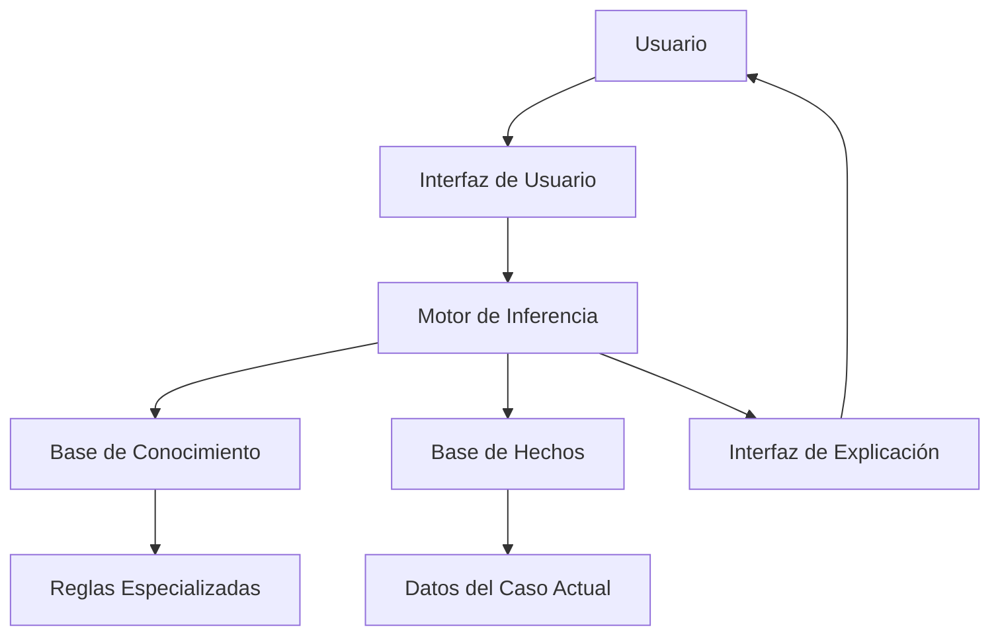
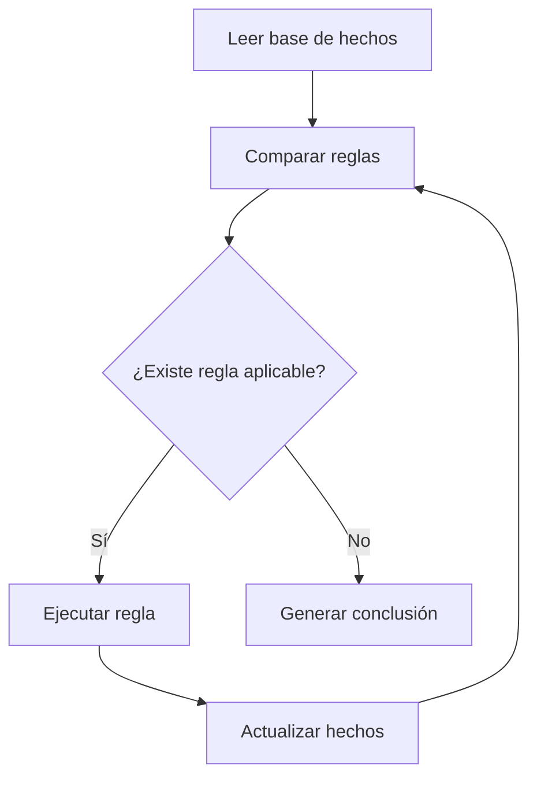
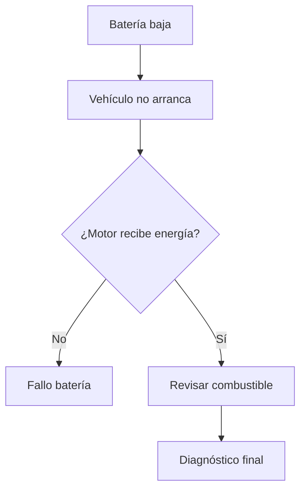

# Redes Neuronales y Sistemas Expertos en Inteligencia Artificial

## 1. Redes Neuronales

### Visión para Principiantes

Las **redes neuronales artificiales** son modelos de inteligencia artificial inspirados en el funcionamiento básico del cerebro humano. Su objetivo principal es **aprender patrones a partir de datos**.

En lugar de recibir reglas creadas manualmente por una persona, una red neuronal analiza muchos ejemplos y encuentra relaciones ocultas dentro de la información.

Por ejemplo:

* Un sistema tradicional necesita reglas como:

  * "Si tiene cuatro patas, cola y ladra → probablemente es un perro".

* Una red neuronal recibe miles de imágenes de perros y gatos, aprende sus características y posteriormente puede identificar nuevas imágenes.

En resumen:

> Una red neuronal aprende observando ejemplos, detectando patrones y utilizando esos patrones para realizar predicciones o tomar decisiones.

---

## Profundidad Técnica

Una **red neuronal artificial (Artificial Neural Network, ANN)** es un modelo computacional compuesto por unidades llamadas **neuronas artificiales**, organizadas en capas.

Su arquitectura generalmente está formada por:

* **Capa de entrada:** recibe los datos iniciales.
* **Capas ocultas:** procesan la información mediante transformaciones matemáticas.
* **Capa de salida:** genera la predicción o clasificación final.

Cada neurona recibe valores de entrada, aplica pesos, una función de activación y produce una salida.

La operación básica de una neurona artificial es:

[
y = f(w_1x_1 + w_2x_2 + ... + w_nx_n + b)
]

Donde:

* `x` representa las entradas.
* `w` representa los pesos aprendidos.
* `b` representa el sesgo.
* `f` representa la función de activación.
* `y` representa la salida generada.

El aprendizaje ocurre mediante algoritmos como:

* **Descenso del gradiente (Gradient Descent).**
* **Retropropagación del error (Backpropagation).**

Durante el entrenamiento, la red ajusta sus pesos internos para reducir la diferencia entre la predicción realizada y el resultado esperado.

Ejemplo:

```
Entrada:
Imagen de una mascota

Proceso:
Neuronas analizan características:
- Forma
- Color
- Textura
- Tamaño

Salida:
95% probabilidad de ser un perro
```

---

# 2. Sistema Experto

## Visión para Principiantes

Un **sistema experto** es un programa diseñado para imitar la forma en que un especialista humano toma decisiones dentro de un área específica.

No intenta ser inteligente en todos los campos, sino resolver problemas concretos de un dominio limitado.

Ejemplos:

* Diagnóstico médico.
* Detección de fallas mecánicas.
* Asesoría financiera.
* Soporte técnico.

Un sistema experto funciona utilizando:

1. Conocimiento almacenado.
2. Reglas creadas por especialistas.
3. Un motor que analiza esas reglas.
4. Una conclusión final.

Ejemplo sencillo:

```
Si:
    El motor no enciende
    Y
    La batería tiene poca carga

Entonces:
    La posible causa es batería descargada.
```

---

# Profundidad Técnica

Un **sistema experto (Expert System)** es un sistema basado en conocimiento que utiliza técnicas de inteligencia artificial simbólica para representar el razonamiento humano dentro de un dominio específico.

A diferencia de las redes neuronales:

| Sistema Experto                                  | Red Neuronal                                        |
| ------------------------------------------------ | --------------------------------------------------- |
| Usa reglas explícitas                            | Aprende patrones                                    |
| El conocimiento lo proporciona un experto humano | El conocimiento se obtiene de datos                 |
| Puede explicar sus decisiones                    | Generalmente es difícil interpretar su razonamiento |
| No aprende automáticamente                       | Aprende mediante entrenamiento                      |

Un sistema experto se basa en la idea:

> "El poder de un programa de computadora no proviene únicamente de sus métodos de razonamiento, sino del conocimiento especializado que posee sobre un dominio."

---

# Características principales de un Sistema Experto

## 1. Contiene conocimiento especializado

El sistema almacena información específica de un área.

Ejemplo:

Sistema experto médico:

```
Enfermedad:
Gripe

Síntomas:
- Fiebre
- Tos
- Dolor muscular
```

---

## 2. Aplica conocimiento para resolver problemas

Utiliza reglas para analizar información recibida.

Ejemplo:

```
SI:
Paciente tiene fiebre
Y
Paciente tiene tos

ENTONCES:
Existe posibilidad de infección respiratoria
```

---

## 3. Puede explicar sus razonamientos

Un sistema experto puede justificar cómo obtuvo una conclusión.

Ejemplo:

```
Conclusión:
Posible fallo de batería.

Razón:
1. La batería tiene bajo voltaje.
2. El vehículo no inicia.
3. La regla R15 fue activada.
```

---

# 3. Origen y Limitaciones de los Sistemas Expertos

## Historia

Los sistemas expertos tuvieron gran popularidad durante los años 70 y 80 debido a su capacidad para capturar conocimiento humano.

Ejemplos históricos:

* MYCIN → diagnóstico médico.
* DENDRAL → análisis químico.

---

## Problemas que provocaron su decadencia

### 1. Alto costo de mantenimiento

Actualizar las reglas requería expertos humanos constantemente.

Ejemplo:

Si cambiaba un procedimiento médico:

```
Regla antigua:
SI fiebre alta → medicamento A

Nueva regla:
SI fiebre alta → medicamento B
```

Era necesario modificar manualmente la base de conocimiento.

---

### 2. Costosa adquisición de conocimiento

Obtener información de expertos humanos era lento y complicado.

Proceso:

```
Experto humano
        |
        v
Entrevistas
        |
        v
Extracción de reglas
        |
        v
Sistema experto
```

---

### 3. No aprende automáticamente

Un sistema experto tradicional no mejora con nuevos datos.

Necesita intervención humana:

```
Nuevo conocimiento
        |
        v
Experto humano
        |
        v
Nueva regla agregada
        |
        v
Sistema actualizado
```

---

# 4. Componentes de un Sistema Experto

## Arquitectura general



---

# Base de Conocimiento

## Visión para Principiantes

Es la parte donde el sistema guarda el conocimiento del experto.

Contiene:

* Reglas.
* Conceptos.
* Relaciones entre elementos.

Ejemplo:

```
SI:
Temperatura > 38°C

ENTONCES:
Existe fiebre.
```

---

## Profundidad Técnica

La base de conocimiento separa la información del mecanismo de razonamiento.

Esta separación permite modificar reglas sin cambiar el motor de inferencia.

Ejemplo:

```
Base de conocimiento:

Regla 1:
SI A entonces B

Regla 2:
SI B entonces C
```

El motor simplemente ejecuta las reglas disponibles.

---

# Base de Hechos

## Visión para Principiantes

Es la memoria temporal donde se almacenan los datos del problema actual.

Ejemplo:

Paciente:

```
Nombre:
Carlos

Síntomas:
- Fiebre
- Tos
```

---

## Profundidad Técnica

La base de hechos representa el estado actual del sistema durante una consulta.

Puede contener:

* Mediciones.
* Datos ingresados.
* Resultados intermedios.

Ejemplo:

```json
{
  "temperatura": 39,
  "tos": true,
  "dolor_muscular": true
}
```

---

# Motor de Inferencia

## Visión para Principiantes

Es el cerebro del sistema experto.

Se encarga de revisar los datos y decidir qué reglas aplicar.

---

## Funcionamiento



---

## Algoritmo básico

1. Lee la base de hechos.
2. Revisa las reglas disponibles.
3. Encuentra reglas compatibles.
4. Selecciona una regla.
5. Ejecuta la acción.
6. Actualiza la información.
7. Repite hasta encontrar una conclusión.

---

# Interfaz de Explicación

## Visión para Principiantes

Permite que el sistema explique por qué llegó a una respuesta.

Ejemplo:

Usuario:

```
¿Por qué recomienda cambiar la batería?
```

Sistema:

```
Porque detectó:
- Bajo voltaje.
- Fallo de encendido.
- Regla aplicada: BATERIA_01.
```

---

# Adquisición de Conocimiento

Es el proceso de obtener, organizar y actualizar información dentro del sistema experto.

Proceso:


---

# Interfaz de Usuario

Es la capa mediante la cual una persona interactúa con el sistema.

Puede ser:

* Línea de comandos.
* Aplicación web.
* Aplicación móvil.
* Chatbot.

---

# 5. Conceptos Fundamentales

# ¿Qué es el conocimiento?

El conocimiento es la información estructurada que permite comprender un problema y tomar decisiones.

Ejemplo:

```
Dato:
Temperatura = 39°C

Conocimiento:
Una temperatura superior a 38°C puede indicar fiebre.
```

---

# ¿Qué son las reglas?

Son instrucciones lógicas que relacionan condiciones con acciones.

Estructura:

```
SI condición

ENTONCES acción
```

Ejemplo:

```
SI:
Edad < 18

ENTONCES:
Es menor de edad.
```

---

# 6. Operadores Lógicos en Sistemas Expertos

Los operadores lógicos permiten construir reglas complejas.

---

# AND (&)

Representa una condición donde todas las partes deben cumplirse.

Ejemplo:

```
SI:
Tiene fiebre
AND
Tiene tos

ENTONCES:
Posible gripe
```

Tabla:

| A         | B         | Resultado |
| --------- | --------- | --------- |
| Verdadero | Verdadero | Verdadero |
| Verdadero | Falso     | Falso     |
| Falso     | Verdadero | Falso     |
| Falso     | Falso     | Falso     |

---

# OR

Solo necesita una condición verdadera.

Ejemplo:

```
SI:
Tiene fiebre

OR

Tiene dolor muscular

ENTONCES:
Evaluar infección
```

---

# NOT

Invierte el valor lógico.

Ejemplo:

```
NOT tiene licencia

Resultado:

No tiene licencia
```

---

# 7. Equiparación (Matching)

## Visión para Principiantes

La equiparación es el proceso donde el motor de inferencia compara los datos actuales con las reglas existentes.

Ejemplo:

Datos:

```
fiebre = verdadero
tos = verdadero
```

Regla:

```
SI fiebre AND tos
ENTONCES gripe
```

Resultado:

```
La regla coincide.
```

---

## Profundidad Técnica

El proceso de matching es fundamental en sistemas basados en reglas.

El motor analiza:

1. Estado actual de hechos.
2. Condiciones de reglas.
3. Compatibilidad lógica.
4. Ejecución de reglas aplicables.

---

# 8. Inferencia

## Visión para Principiantes

La inferencia es el proceso de llegar a una conclusión utilizando información disponible.

Ejemplo:

```
Dato:
El vehículo no arranca.

Regla:
Si batería baja entonces falla el arranque.

Conclusión:
Posible problema de batería.
```

---

# Red de Inferencia

## Visión para Principiantes

Una red de inferencia es una representación visual del camino que sigue el sistema para obtener una respuesta.

Permite entender:

* Qué reglas fueron usadas.
* Qué decisiones tomó.
* Cómo llegó al resultado.

---

## Ejemplo



---

# Glosario

| Término                 | Definición                                                                                                    |
| ----------------------- | ------------------------------------------------------------------------------------------------------------- |
| Inteligencia Artificial | Campo de la informática que desarrolla sistemas capaces de realizar tareas que requieren inteligencia humana. |
| Red neuronal            | Modelo matemático inspirado en neuronas biológicas que aprende patrones desde datos.                          |
| Patrón                  | Relación o característica repetitiva encontrada en información.                                               |
| Sistema experto         | Programa que imita decisiones humanas mediante conocimiento y reglas.                                         |
| Dominio                 | Área específica donde se aplica un sistema.                                                                   |
| Regla                   | Instrucción lógica que relaciona condiciones con acciones.                                                    |
| Base de conocimiento    | Repositorio donde se almacenan reglas y conocimiento especializado.                                           |
| Base de hechos          | Memoria temporal con datos del problema actual.                                                               |
| Motor de inferencia     | Componente que ejecuta reglas para obtener conclusiones.                                                      |
| Inferencia              | Proceso lógico para obtener una conclusión desde información conocida.                                        |
| Matching                | Comparación entre hechos actuales y condiciones de reglas.                                                    |
| Retropropagación        | Algoritmo utilizado para entrenar redes neuronales ajustando pesos internos.                                  |
| Peso neuronal           | Valor numérico que determina la importancia de una entrada en una neurona.                                    |
| Función de activación   | Función matemática que decide la salida de una neurona.                                                       |

---

# Ejemplo práctico básico de un Sistema Experto en Python

```python
# Base de conocimiento
reglas = [
    {
        "condiciones": ["fiebre", "tos"],
        "resultado": "Posible gripe"
    },
    {
        "condiciones": ["dolor_pecho"],
        "resultado": "Consultar médico"
    }
]


# Base de hechos del usuario
hechos = [
    "fiebre",
    "tos"
]


# Motor de inferencia
def ejecutar_motor(reglas, hechos):

    conclusiones = []

    for regla in reglas:

        # Verifica si todas las condiciones existen
        if all(condicion in hechos for condicion in regla["condiciones"]):
            conclusiones.append(regla["resultado"])

    return conclusiones


resultado = ejecutar_motor(reglas, hechos)

print(resultado)
```

Salida:

```
['Posible gripe']
```

---

# Conclusión

Las **redes neuronales** y los **sistemas expertos** representan dos enfoques diferentes dentro de la inteligencia artificial:

* Las redes neuronales aprenden automáticamente mediante datos y patrones.
* Los sistemas expertos utilizan conocimiento humano representado mediante reglas.

Los sistemas expertos fueron fundamentales en la historia de la IA porque demostraron que una computadora podía razonar en dominios específicos, aunque sus limitaciones de mantenimiento y aprendizaje dieron paso al auge moderno del aprendizaje automático.
