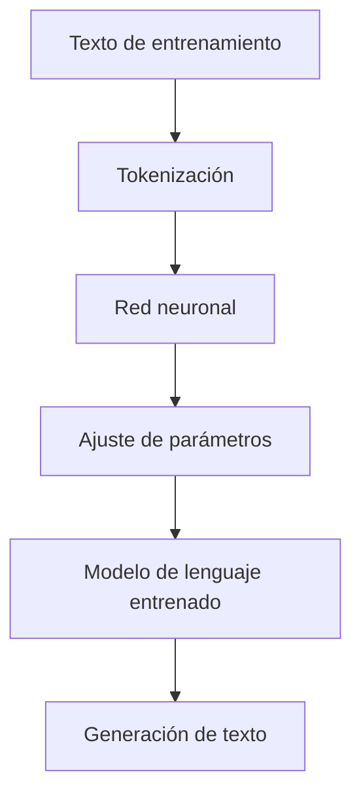
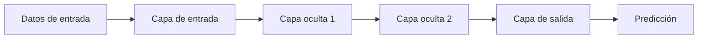
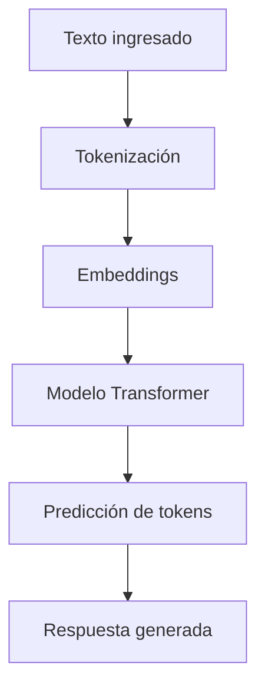
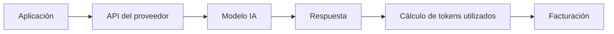
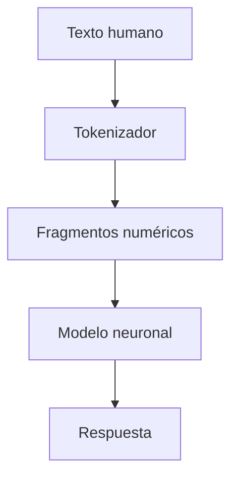

# Evaluación de Modelos Ligeros y Modelos de Lenguaje

# 1. Modelo de Lenguaje (Language Model)

## Visión para Principiantes

Un **modelo de lenguaje** es un sistema de inteligencia artificial diseñado para comprender y generar texto utilizando patrones aprendidos del lenguaje humano.

Su objetivo es predecir cuál es la siguiente palabra o fragmento de texto más probable según el contexto recibido.

Ejemplo:

Entrada:

```text
La capital de Francia es...
```

El modelo analiza patrones aprendidos y genera:

```text
París.
```

El modelo no piensa como un humano ni entiende el mundo como una persona; en cambio, calcula probabilidades basadas en millones o miles de millones de ejemplos de texto.

---

# Profundidad Técnica

Un **modelo de lenguaje (Language Model, LM)** es un sistema computacional entrenado para modelar la distribución probabilística de secuencias de texto.

Matemáticamente intenta resolver:

[
P(\text{siguiente token} | contexto)
]

Es decir:

> Dado un conjunto de elementos anteriores, calcula cuál es el siguiente elemento más probable.

Los modelos modernos utilizan principalmente arquitecturas basadas en **redes neuronales profundas**, especialmente:

* Transformers.
* Redes neuronales con mecanismos de atención.
* Grandes conjuntos de datos de entrenamiento.

Proceso general:



---

# 2. Redes Neuronales Artificiales

## Visión para Principiantes

Una red neuronal artificial es un sistema matemático inspirado en la forma en que funcionan las neuronas del cerebro.

Está formada por pequeños componentes llamados **neuronas artificiales**, conectadas entre sí.

Cada conexión tiene un valor llamado **peso**, que indica qué tan importante es cierta información.

Ejemplo:

Una red neuronal para reconocer perros:

```text
Imagen
 |
 ├── Forma
 ├── Color
 ├── Tamaño
 |
Red neuronal
 |
Resultado:
95% perro
```

---

# Profundidad Técnica

Una red neuronal es un modelo matemático compuesto por nodos interconectados que realizan transformaciones sobre datos de entrada.

Cada conexión contiene un peso:

[
Salida = Función(Peso * Entrada + Sesgo)
]

Durante el entrenamiento:

1. Recibe datos.
2. Genera una predicción.
3. Compara la predicción con el resultado esperado.
4. Calcula el error.
5. Ajusta los pesos.

Este proceso permite mejorar progresivamente las predicciones.

Arquitectura básica:



---

# 3. LLM (Large Language Model)

## Visión para Principiantes

Un **LLM (Large Language Model)** es un modelo de lenguaje con una cantidad extremadamente grande de parámetros entrenados con enormes cantidades de texto.

Estos modelos pueden:

* Responder preguntas.
* Crear textos.
* Resumir información.
* Traducir idiomas.
* Generar código.

Ejemplo:

Usuario:

```text
Explica qué es una API.
```

LLM:

```text
Una API es una interfaz que permite que dos sistemas se comuniquen...
```

---

# Profundidad Técnica

Un **LLM** es una arquitectura neuronal de gran escala basada normalmente en Transformers.

Sus componentes principales son:

* Parámetros neuronales.
* Capas Transformer.
* Mecanismo de atención.
* Embeddings.
* Datos de entrenamiento.

Un modelo puede contener desde millones hasta cientos de miles de millones de parámetros.

Arquitectura simplificada:



---

# 4. Evaluación de Modelos Ligeros

## Visión para Principiantes

Los modelos ligeros son versiones más pequeñas de modelos de inteligencia artificial diseñadas para funcionar con menos recursos.

Sus objetivos principales son:

* Menor consumo de memoria.
* Mayor velocidad.
* Funcionamiento en equipos con menos capacidad.
* Menor costo operativo.

Ejemplo:

Un modelo grande puede necesitar:

```text
Servidor con múltiples GPUs
```

Mientras un modelo ligero puede ejecutarse en:

```text
Laptop personal
```

---

# Profundidad Técnica

Los modelos ligeros reducen la complejidad computacional mediante técnicas como:

## 1. Reducción de parámetros

Menos parámetros significa menor consumo de memoria.

Ejemplo:

```
Modelo grande:
70B parámetros

Modelo ligero:
7B parámetros
```

---

## 2. Cuantización

Convierte números utilizados por la red neuronal a formatos más pequeños.

Ejemplo:

Antes:

```
32 bits
```

Después:

```
8 bits
```

Beneficios:

* Menor uso de RAM.
* Mayor velocidad.
* Menor costo.

---

## 3. Destilación del conocimiento

Un modelo grande enseña a un modelo pequeño.

Proceso:


---

# 5. Limitaciones Importantes de los LLM

# 5.1 Alucinaciones

## Visión para Principiantes

Una alucinación ocurre cuando un modelo genera información falsa pero parece correcta.

Puede inventar:

* Datos.
* Personas.
* URLs.
* Referencias.
* Citas.

Ejemplo:

Usuario:

```text
Dame una fuente científica sobre este tema.
```

Modelo:

```text
Artículo inventado con autor y enlace falso.
```

---

## Profundidad Técnica

Los LLM no poseen una base de conocimiento verdadera ni un mecanismo interno de verificación.

Generan respuestas mediante probabilidad:

[
P(token|contexto)
]

Si una secuencia parece probable, puede producirla aunque sea incorrecta.

El modelo no tiene conciencia de:

* Verdad.
* Falsedad.
* Incertidumbre.

---

# 5.2 Sesgo

## Visión para Principiantes

Los modelos aprenden de los datos utilizados para entrenarlos.

Si los datos contienen errores o prejuicios, el modelo puede repetirlos.

Ejemplo:

```text
Datos con información incorrecta

        ↓

Modelo aprende patrones incorrectos

        ↓

Respuesta con sesgo
```

---

## Profundidad Técnica

El sesgo puede aparecer por:

* Distribución desigual de datos.
* Falta de representación.
* Información histórica incorrecta.
* Sesgos humanos presentes en textos.

La mitigación requiere:

* Curación de datos.
* Evaluación constante.
* Técnicas de alineamiento.

---

# 5.3 Ventana de Contexto

## Visión para Principiantes

Un modelo no puede recordar infinitamente una conversación.

Existe un límite de información que puede procesar al mismo tiempo.

Ejemplo:

```text
Usuario:
Envía 100 páginas de información.

Modelo:
Solo puede analizar una cantidad limitada.
```

---

## Profundidad Técnica

La ventana de contexto representa la cantidad máxima de tokens que el modelo puede procesar simultáneamente.

Incluye:

* Mensaje del usuario.
* Historial de conversación.
* Instrucciones del sistema.
* Respuesta generada.

---

# 6. Pricing de Modelos de IA

## Visión para Principiantes

Ejecutar un modelo grande requiere mucho hardware.

Los proveedores necesitan:

* Centros de datos.
* GPUs especializadas.
* Electricidad.
* Infraestructura.

Por eso cobran por el uso del modelo.

---

# Profundidad Técnica

Los proveedores suelen utilizar diferentes modelos comerciales:

## 1. Suscripción Web

Orientada a usuarios finales.

Ejemplo:

```text
Usuario paga mensualidad.

Obtiene acceso mediante una aplicación.
```

---

## 2. API por Tokens

Modelo utilizado normalmente por desarrolladores.

El costo depende de:

* Tokens de entrada.
* Tokens de salida.

Flujo:



---

# 7. Tokens

## Visión para Principiantes

Los tokens son fragmentos de texto que utiliza un modelo para procesar información.

Una palabra no siempre representa un token.

Ejemplo:

Palabra:

```text
programación
```

Puede dividirse como:

```text
pro
gram
ación
```

---

# ¿Por qué se utilizan tokens y no palabras?

Porque permiten manejar:

* Palabras nuevas.
* Idiomas diferentes.
* Errores ortográficos.
* Palabras muy largas.

Ejemplo:

Si el modelo nunca vio:

```text
hiperautomatización
```

Puede dividirla:

```text
hiper
auto
matización
```

Y utilizar partes conocidas.

---

# Proceso de Tokenización



---

# 8. Embeddings

## Visión para Principiantes

Un **embedding** convierte texto en números para que una computadora pueda entender relaciones entre conceptos.

Ejemplo:

Palabras similares generan posiciones cercanas:

```
Perro  → [0.23, 0.54, 0.81]

Gato   → [0.25, 0.50, 0.79]

Avión  → [0.90, 0.12, 0.31]
```

Perro y gato estarán más cerca porque tienen relación semántica.

---

# Profundidad Técnica

Un embedding es una representación vectorial de alta dimensión que captura características semánticas de una entrada.

En lugar de representar texto como caracteres:

```
"perro"
```

Se transforma en un vector:

```
[0.234, -0.521, 0.842, ...]
```

Estos vectores permiten realizar operaciones matemáticas como:

* Búsqueda semántica.
* Clasificación.
* Recomendaciones.
* Sistemas RAG.

---

# Ejemplo práctico: Embeddings en Python

```python
# Ejemplo conceptual de un embedding

texto = "Aprender inteligencia artificial"

# El modelo transforma el texto
embedding = [
    0.23,
    0.54,
    -0.12,
    0.87
]


print("Vector generado:")
print(embedding)
```

---

# Glosario

| Término             | Definición                                                                     |
| ------------------- | ------------------------------------------------------------------------------ |
| Modelo de lenguaje  | Sistema de IA que aprende patrones del lenguaje para generar texto.            |
| LLM                 | Modelo de lenguaje de gran escala entrenado con enormes cantidades de datos.   |
| Token               | Unidad pequeña de texto utilizada por un modelo para procesar información.     |
| Tokenización        | Proceso de dividir texto en unidades procesables por una IA.                   |
| Red neuronal        | Modelo matemático inspirado en neuronas biológicas.                            |
| Peso neuronal       | Valor que determina la importancia de una conexión dentro de una red neuronal. |
| Parámetro           | Valor interno aprendido durante el entrenamiento de un modelo.                 |
| Embedding           | Representación numérica que captura significado semántico.                     |
| Semántica           | Relación relacionada con el significado de las palabras.                       |
| Cuantización        | Técnica para reducir el tamaño de un modelo usando números más pequeños.       |
| Destilación         | Proceso donde un modelo grande transfiere conocimiento a uno pequeño.          |
| GPU                 | Procesador especializado en cálculos paralelos usado en IA.                    |
| API                 | Interfaz que permite comunicación entre aplicaciones.                          |
| Alucinación         | Respuesta generada por IA que parece correcta pero contiene información falsa. |
| Ventana de contexto | Cantidad máxima de información que un modelo puede procesar simultáneamente.   |

---

# Conclusión

Los modelos ligeros representan una evolución importante dentro de la inteligencia artificial porque permiten ejecutar capacidades avanzadas utilizando menos recursos.

Los LLM modernos funcionan mediante redes neuronales profundas capaces de aprender patrones del lenguaje, pero presentan desafíos como:

* Generación de información incorrecta.
* Dependencia de los datos utilizados.
* Costos computacionales elevados.
* Limitaciones de contexto.

Conceptos como **tokens** y **embeddings** son fundamentales para comprender cómo los modelos actuales transforman lenguaje humano en información procesable por sistemas computacionales.
