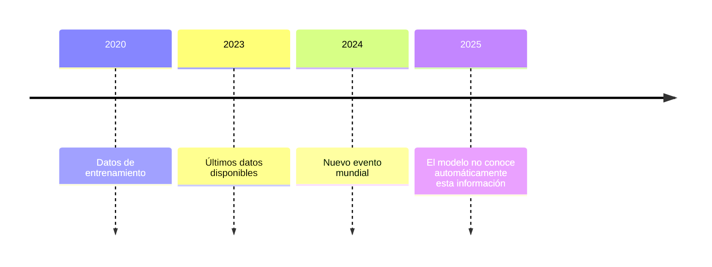
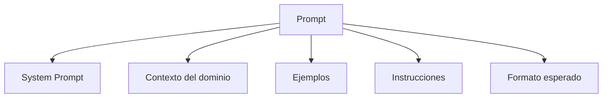
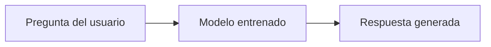
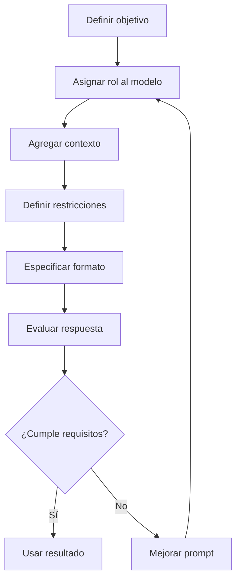

# Diseño Responsable de Prompts y Verificaciones en Modelos de Inteligencia Artificial

# 1. Diseño Responsable de Prompts

## Visión para Principiantes

Diseñar un **prompt responsable** significa crear instrucciones claras y cuidadosas para una inteligencia artificial con el objetivo de obtener respuestas:

* Útiles.
* Correctas.
* Comprensibles.
* Seguras.
* Adecuadas para el propósito.

Un prompt es la información que una persona proporciona a un modelo de IA para indicarle qué tarea debe realizar.

Ejemplo:

Prompt básico:

```text
Dame información sobre bases de datos.
```

Este prompt es demasiado general porque no indica:

* Nivel técnico.
* Cantidad de información.
* Formato esperado.
* Objetivo.

Un prompt responsable sería:

```text
Actúa como un profesor de bases de datos.
Explica qué es una base de datos relacional para estudiantes principiantes.
Incluye ejemplos simples utilizando SQL.
```

Ahora el modelo tiene más contexto para generar una respuesta adecuada.

---

# Profundidad Técnica

El diseño responsable de prompts es una disciplina dentro de la interacción humano-modelo que busca optimizar la comunicación entre un usuario y un sistema de inteligencia artificial.

Un prompt bien diseñado reduce:

* Ambigüedad.
* Errores de interpretación.
* Respuestas irrelevantes.
* Sesgos no deseados.

Un modelo de lenguaje genera respuestas basándose en probabilidades:

[
P(respuesta | prompt, contexto)
]

Por lo tanto, cambiar la estructura del prompt modifica la distribución de probabilidad de las posibles respuestas.

---

# 2. Principios del Diseño Responsable de Prompts

## 2.1 Claridad

### Visión para Principiantes

El prompt debe explicar exactamente qué se necesita.

Ejemplo incorrecto:

```text
Haz un sistema.
```

Problema:

No especifica:

* Qué sistema.
* Tecnología.
* Funcionalidad.
* Resultado esperado.

Ejemplo correcto:

```text
Crea un sistema de autenticación utilizando Python y Flask.
Debe incluir registro de usuarios, inicio de sesión y validación de contraseña.
```

---

## 2.2 Especificidad

Un prompt debe reducir interpretaciones posibles.

Ejemplo:

```text
Explícame programación.
```

Puede generar respuestas sobre:

* Python.
* Java.
* Desarrollo web.
* Algoritmos.

Mejor:

```text
Explica programación orientada a objetos en Python
para estudiantes principiantes.
```

---

## 2.3 Contexto Adecuado

El modelo necesita información suficiente para responder correctamente.

Ejemplo:

Sin contexto:

```text
Corrige este código.
```

Con contexto:

```text
Actúa como desarrollador backend senior.
Analiza este código Python y encuentra errores de seguridad.
El proyecto utiliza Flask y PostgreSQL.
```

---

# 3. Ejemplo de Prompt Irresponsable

## Prompt:

```text
Dame el código para hacer un sistema de login en Python.
```

---

## Problemas del Prompt

### Falta de especificación técnica

No indica:

* Framework.
* Base de datos.
* Tipo de autenticación.
* Nivel de seguridad.
* Arquitectura.

---

### Posibles respuestas incorrectas

El modelo podría generar:

```text
Login básico almacenando contraseñas en texto plano.
```

Aunque funciona como ejemplo, sería una mala práctica profesional.

---

## Prompt mejorado

```text
Actúa como desarrollador backend senior.

Diseña un sistema de autenticación seguro utilizando Python,
Flask y PostgreSQL.

Requisitos:
- Contraseñas cifradas con hashing.
- Manejo de sesiones.
- Validación de entradas.
- Código organizado por capas.
- Explica las decisiones técnicas.
```

---

# 4. Conocimiento Factual de los Modelos

## Visión para Principiantes

Una IA responde utilizando la información que aprendió durante su entrenamiento.

No tiene acceso automático a todo el conocimiento existente.

Ejemplo:

Si un modelo fue entrenado hasta:

```text
Fecha límite: enero 2025
```

Puede no conocer:

```text
Eventos posteriores a enero 2025.
```

---

# Profundidad Técnica

Los LLM son modelos estadísticos entrenados con grandes conjuntos de datos.

Durante el entrenamiento aprenden:

* Patrones lingüísticos.
* Relaciones entre conceptos.
* Estructuras de información.

Sin embargo, no almacenan una copia exacta del conocimiento humano.

Funcionan mediante:

[
Predicción = patrones aprendidos + contexto recibido
]

---

# Fecha de Corte del Entrenamiento

Los modelos poseen una fecha llamada:

**Knowledge Cutoff Date**

Representa el límite temporal de los datos utilizados durante su entrenamiento.

Ejemplo:



---

# 5. Prompt Based Querying (PBQ)

## Visión para Principiantes

El **Prompt Based Querying (PBQ)** consiste en hacer consultas a un modelo proporcionando más información además de una pregunta.

No solamente se pregunta:

```text
¿Qué es una API?
```

Sino que se agrega:

* Rol.
* Contexto.
* Ejemplos.
* Restricciones.

Ejemplo:

```text
Actúa como arquitecto de software.

Explica qué es una API REST.

Contexto:
Estoy creando una aplicación móvil educativa.

Formato:
Explicación con ejemplos.
```

---

# Profundidad Técnica

PBQ es un paradigma donde el usuario modifica la entrada del modelo mediante instrucciones estructuradas.

Un prompt avanzado puede contener:



---

# Componentes de un Prompt PBQ

## 1. System Prompt

Define el rol y comportamiento del modelo.

Ejemplo:

```text
Actúa como un arquitecto de software senior.
```

---

## 2. Contexto del Dominio

Información específica del problema.

Ejemplo:

```text
El proyecto utiliza:
- React Native.
- TypeScript.
- PostgreSQL.
```

---

## 3. Ejemplos

Permiten enseñar al modelo el patrón esperado.

Ejemplo:

```text
Ejemplo de respuesta:

Título:
Explicación técnica

Contenido:
Descripción detallada.
```

---

# 6. Técnicas Principales de PBQ

# Prompt Only Querying (POQ)

## Visión para Principiantes

Es la forma más básica de usar una IA.

El usuario solamente hace una pregunta y espera una respuesta.

Ejemplo:

```text
¿Qué es Docker?
```

El modelo responde utilizando únicamente:

* Su entrenamiento.
* Su conocimiento interno.

---

# Profundidad Técnica

POQ utiliza exclusivamente los parámetros aprendidos durante el entrenamiento.

Flujo:



---

# Limitaciones de POQ

## 1. Dependencia del entrenamiento

Si el modelo no conoce información específica:

Puede:

* Responder incorrectamente.
* Inventar información.
* Dar una respuesta incompleta.

---

## 2. Falta de contexto

Ejemplo:

```text
Optimiza este código.
```

El modelo no sabe:

* Lenguaje.
* Objetivo.
* Restricciones.

---

# 7. Ambigüedad en Prompts

## Visión para Principiantes

La ambigüedad ocurre cuando un prompt puede interpretarse de varias maneras.

Ejemplo:

```text
Dame información sobre Java.
```

Puede significar:

* Lenguaje Java.
* Isla Java.
* Café Java.

---

# Profundidad Técnica

Los LLM generan respuestas mediante distribuciones probabilísticas.

Una consulta ambigua puede producir:

[
P(respuesta A | prompt) \approx P(respuesta B | prompt)
]

Significa que dos respuestas diferentes pueden tener probabilidades similares porque la instrucción no define cuál interpretación es correcta.

---

# Tipos de Ambigüedad

## 7.1 Ambigüedad Léxica

Una palabra tiene múltiples significados.

Ejemplo:

```text
Banco
```

Puede significar:

* Institución financiera.
* Asiento.

---

## 7.2 Ambigüedad Sintáctica

La estructura de la frase permite varias interpretaciones.

Ejemplo:

```text
Vi al hombre con el telescopio.
```

Puede significar:

* El hombre tenía telescopio.
* Yo usé el telescopio.

---

## 7.3 Ambigüedad de Referencia

No está claro a qué elemento se refiere.

Ejemplo:

```text
Juan habló con Pedro después de verlo.
```

Pregunta:

¿Quién fue visto?

---

## 7.4 Ambigüedad de Alcance

Una instrucción puede afectar diferentes elementos.

Ejemplo:

```text
Resume todos los documentos importantes.
```

¿Qué significa importante?

---

## 7.5 Ambigüedad de Intención

No se conoce el objetivo real del usuario.

Ejemplo:

```text
Explícame Python.
```

Puede ser:

* Aprender desde cero.
* Prepararse para una entrevista.
* Mejorar código profesional.

---

# 8. Sesgos en Prompts e Inteligencia Artificial

## Visión para Principiantes

La IA aprende patrones de datos existentes.

Si los datos contienen errores, el modelo puede reproducirlos.

Además, un prompt mal diseñado puede aumentar ciertos sesgos.

Ejemplo:

```text
Explica por qué los programadores son mejores que otras profesiones.
```

El prompt ya contiene una idea sesgada.

---

# Profundidad Técnica

El resultado de un LLM depende de:

[
Respuesta = Modelo + Datos de entrenamiento + Prompt + Contexto
]

El prompt actúa como una señal que puede modificar la generación.

Un prompt sesgado puede:

* Guiar la respuesta.
* Excluir información.
* Favorecer una interpretación.

---

# 9. Mitigación de Ambigüedad en Prompts

La ambigüedad puede reducirse utilizando técnicas de ingeniería de prompts.

---

# Estrategias principales

## 1. Definición de Roles

Permite establecer experiencia y perspectiva.

Ejemplo:

```text
Actúa como ingeniero backend senior especializado en seguridad.
```

---

## 2. Especificar Formato de Salida

Define cómo debe responder el modelo.

Ejemplo:

```text
Responde utilizando:

1. Explicación sencilla.
2. Profundidad técnica.
3. Ejemplo práctico.
4. Conclusión.
```

---

## 3. Instrucciones de Restricción

Limitan comportamientos no deseados.

Ejemplo:

```text
No inventes información.
Si no tienes datos suficientes, indica la incertidumbre.
```

---

# Flujo de Diseño Responsable de Prompts



---

# Ejemplo Profesional de Prompt Responsable

```text
Actúa como desarrollador Full-Stack Senior.

Objetivo:
Diseñar una API REST para gestión de usuarios.

Tecnologías:
- Node.js.
- Express.
- PostgreSQL.

Requisitos:
- Aplicar buenas prácticas de seguridad.
- Separar capas de arquitectura.
- Explicar decisiones técnicas.

Formato de respuesta:
1. Arquitectura.
2. Código.
3. Explicación.
4. Recomendaciones.
```

---

# Glosario

| Término               | Definición                                                                                 |
| --------------------- | ------------------------------------------------------------------------------------------ |
| Prompt                | Instrucción proporcionada a un modelo de IA para obtener una respuesta.                    |
| Ingeniería de prompts | Disciplina dedicada a diseñar instrucciones efectivas para modelos de IA.                  |
| LLM                   | Modelo de lenguaje de gran escala capaz de generar texto mediante aprendizaje estadístico. |
| Sesgo                 | Tendencia sistemática que puede producir resultados injustos o incorrectos.                |
| Contexto              | Información adicional entregada al modelo para mejorar una respuesta.                      |
| System Prompt         | Instrucción inicial que define comportamiento y rol del modelo.                            |
| PBQ                   | Método donde la consulta incluye instrucciones, contexto y ejemplos adicionales.           |
| POQ                   | Consulta simple donde solo se envía una pregunta al modelo.                                |
| Token                 | Unidad de texto utilizada internamente por un modelo de lenguaje.                          |
| Modelo probabilístico | Sistema que calcula probabilidades para generar resultados.                                |
| Fecha de corte        | Fecha límite de información utilizada durante el entrenamiento del modelo.                 |
| Alucinación           | Generación de información falsa presentada como verdadera.                                 |
| Restricción           | Regla que limita el comportamiento esperado del modelo.                                    |

---

# Conclusión

El diseño responsable de prompts es fundamental para obtener resultados confiables de los modelos de inteligencia artificial.

Un buen prompt no consiste únicamente en realizar una pregunta, sino en diseñar una instrucción completa considerando:

* Objetivo.
* Contexto.
* Rol.
* Restricciones.
* Formato esperado.

La calidad de la respuesta depende directamente de la calidad de la información proporcionada al modelo.
