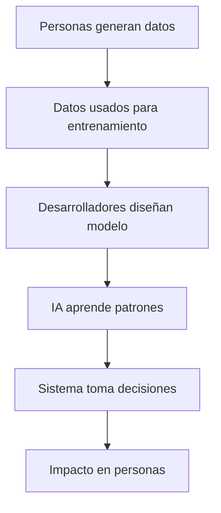
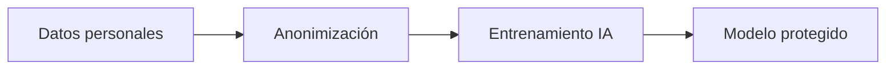
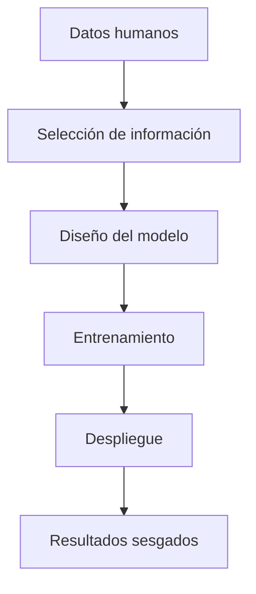
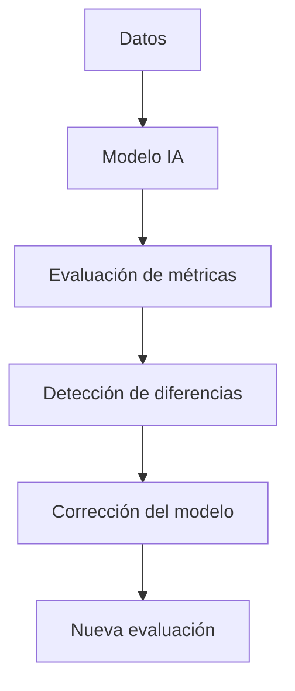
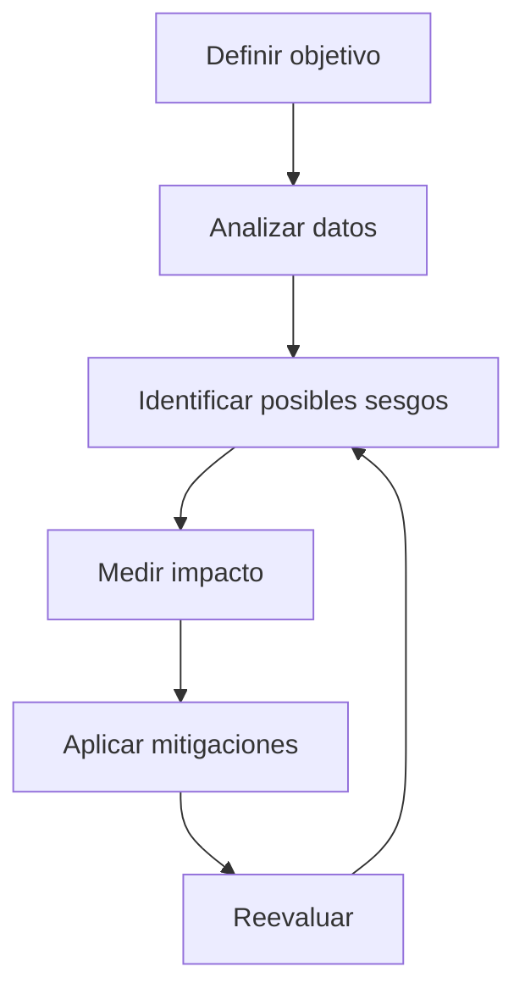
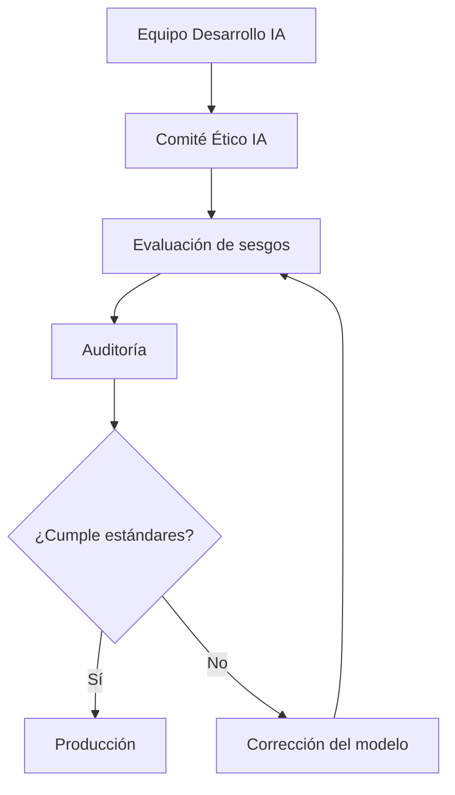

# Ética en Inteligencia Artificial y Gestión de Sesgos Algorítmicos

# 1. Ética en Inteligencia Artificial

## Visión para Principiantes

La **ética** es una rama de la filosofía que estudia qué acciones son correctas o incorrectas, y qué consecuencias tienen nuestras decisiones sobre otras personas.

Cuando hablamos de **ética en inteligencia artificial (IA)**, nos preguntamos:

* ¿La IA toma decisiones justas?
* ¿Puede causar daño?
* ¿Las personas entienden cómo funciona?
* ¿Quién es responsable cuando algo sale mal?

La importancia de la ética en IA surge porque estos sistemas pueden tomar decisiones automáticamente sobre grandes cantidades de personas.

Ejemplos:

* Un sistema que decide aprobar un crédito.
* Una IA que filtra candidatos para un empleo.
* Un algoritmo que recomienda tratamientos médicos.

Un error humano tradicional puede afectar a una persona, pero un sistema de IA puede afectar a miles o millones de usuarios en poco tiempo.

---

# Profundidad Técnica

La ética en IA es un campo interdisciplinario que analiza las implicaciones sociales, legales y morales del diseño, entrenamiento y despliegue de sistemas inteligentes.

Los sistemas de IA tienen impacto porque:

* Aprenden de datos generados por humanos.
* Incorporan decisiones realizadas por desarrolladores.
* Automatizan procesos anteriormente realizados por personas.
* Operan a gran escala.

La cadena completa contiene decisiones humanas:



Por esta razón:

> La subjetividad humana puede estar presente en cada etapa del ciclo de vida de un sistema de IA.

---

# 2. ¿Por qué la Ética Aplica a la IA?

## Visión para Principiantes

Los algoritmos no aparecen automáticamente.

Son creados por personas:

* Personas escriben el código.
* Personas seleccionan los datos.
* Personas definen qué significa "un buen resultado".

Por ejemplo:

Un sistema de selección laboral necesita decidir qué características considera importantes.

La pregunta ética es:

¿Quién decidió que esas características eran correctas?

---

## Profundidad Técnica

Un sistema de IA puede representarse como una cadena de decisiones:

[
Datos + Diseño + Modelo + Implementación = Resultado
]

Cada componente puede introducir errores o sesgos.

Ejemplo:

```text
Datos históricos incorrectos
          +
Variable mal seleccionada
          +
Modelo automático
          =
Decisión injusta
```

---

# 3. Principios Éticos Fundamentales en IA

---

# 3.1 Transparencia

## Visión para Principiantes

Las personas deben entender cómo y por qué una IA tomó una decisión.

Ejemplo:

Un banco rechaza una solicitud de crédito.

La persona debería conocer:

* Qué factores influyeron.
* Qué información fue utilizada.
* Por qué obtuvo ese resultado.

---

## Profundidad Técnica

La transparencia busca que los modelos sean interpretables y auditables.

Incluye:

* Documentación del modelo.
* Registro de datos utilizados.
* Explicaciones de predicciones.
* Trazabilidad de decisiones.

Ejemplo:

```text
Predicción:
Solicitud rechazada.

Factores principales:
1. Historial crediticio.
2. Ingresos reportados.
3. Nivel de deuda.
```

---

# 3.2 Equidad (Fairness)

## Visión para Principiantes

Una IA debe evitar tratar injustamente a personas o grupos.

Ejemplo:

Un sistema de contratación no debería favorecer o perjudicar candidatos por características personales irrelevantes.

---

## Profundidad Técnica

La equidad algorítmica busca minimizar diferencias injustificadas entre grupos.

Analiza:

* Tasas de aprobación.
* Errores.
* Calidad de predicciones.
* Impacto diferencial.

---

# 3.3 Privacidad

## Visión para Principiantes

Los datos son fundamentales para entrenar IA, pero muchos datos pertenecen a personas.

Ejemplos:

* Nombre.
* Ubicación.
* Información médica.
* Información financiera.

La IA debe utilizar datos respetando:

* Consentimiento.
* Protección.
* Seguridad.

---

## Profundidad Técnica

La privacidad en IA implica:

* Minimización de datos.
* Anonimización.
* Control de acceso.
* Cifrado.
* Cumplimiento normativo.

Ejemplo:



---

# 3.4 Responsabilidad (Accountability)

## Visión para Principiantes

Cuando una IA causa un problema, alguien debe hacerse responsable.

No basta con decir:

> "Fue culpa del algoritmo".

Debe existir responsabilidad humana.

---

## Profundidad Técnica

La responsabilidad se distribuye entre:

* Desarrolladores.
* Empresas.
* Arquitectos del sistema.
* Equipos legales.
* Usuarios finales.

Debe existir:

* Auditoría.
* Documentación.
* Supervisión humana.

---

# 3.5 Seguridad y Confiabilidad

## Visión para Principiantes

Una IA debe funcionar correctamente y evitar causar daños.

Debe ser:

* Segura.
* Estable.
* Predecible.

---

## Profundidad Técnica

Incluye:

* Resistencia a ataques.
* Validación de entradas.
* Monitoreo continuo.
* Pruebas antes del despliegue.

---

# 4. Reflexión del Desarrollador Ético

Un desarrollador debe preguntarse:

## Antes de iniciar un proyecto

* ¿Qué problema estoy resolviendo?
* ¿Quién será afectado?
* ¿Qué datos utilizaré?
* ¿Puede causar daño?

---

## Si descubre un sesgo

Debe:

1. Analizar la causa.
2. Medir el impacto.
3. Corregir datos o modelo.
4. Documentar la solución.

---

## ¿Debe negarse a construir algo dañino?

Sí, un desarrollador tiene responsabilidad profesional.

El código no es neutral:

```text
Decisión técnica
        +
Impacto social
        =
Responsabilidad profesional
```

---

# 5. Sesgos en Inteligencia Artificial

# ¿Qué es un sesgo?

## Visión para Principiantes

Un sesgo es una tendencia que provoca que una decisión favorezca o perjudique ciertos resultados.

En IA, un sesgo ocurre cuando el sistema genera resultados sistemáticamente injustos o incorrectos.

---

# Profundidad Técnica

Un sesgo algorítmico es una desviación sistemática entre el comportamiento esperado de un modelo y su impacto real sobre diferentes grupos.

Puede aparecer en:

* Datos.
* Diseño.
* Entrenamiento.
* Implementación.
* Uso final.

---

# 6. Origen de los Sesgos en IA

## Ciclo del sesgo



---

# 6.1 Sesgo en el Diseño

Surge por decisiones humanas:

* Qué datos recolectar.
* Qué variables utilizar.
* Cómo definir éxito.
* Qué métricas evaluar.

Ejemplo:

Un sistema educativo mide éxito únicamente por velocidad de respuesta.

Puede ignorar:

* Creatividad.
* Comprensión profunda.

---

# 6.2 Sesgo en el Despliegue

Un modelo correcto durante pruebas puede fallar en producción.

Causas:

* Cambio de usuarios.
* Nuevos escenarios.
* Diferencias entre entrenamiento y realidad.

Ejemplo:

```text
Modelo entrenado:
Usuarios urbanos

Producción:
Usuarios rurales

Resultado:
Menor precisión.
```

---

# 7. Tipos de Sesgos

# 7.1 Sesgo de Datos

Ocurre cuando los datos de entrenamiento no representan correctamente la realidad.

Causas:

* Falta de diversidad.
* Errores de recopilación.
* Datos históricos incompletos.

Ejemplo:

```text
Datos:
90% usuarios de una región

Aplicación:
Todo el país

Resultado:
Modelo menos preciso para otros grupos.
```

---

# 7.2 Sesgo de Selección

La muestra utilizada para entrenar no representa la población objetivo.

Ejemplo:

Entrenar un sistema médico usando únicamente pacientes jóvenes.

---

# 7.3 Sesgo de Confirmación

El sistema o los desarrolladores buscan información que confirme una idea previa.

Ejemplo:

Un desarrollador cree que una variable es importante y diseña el modelo alrededor de esa hipótesis.

---

# 7.4 Sesgo de Medición

Aparece cuando los datos contienen errores sistemáticos.

Ejemplo:

Un sensor registra siempre temperaturas superiores al valor real.

---

# 7.5 Sesgo de Automatización

No proviene directamente del algoritmo.

Ocurre cuando las personas confían demasiado en una recomendación automática.

Ejemplo:

Un médico acepta una predicción de IA sin revisar el caso.

---

# 8. Evaluación del Sesgo

La evaluación busca medir si un modelo trata justamente a diferentes grupos.

---

# 8.1 Paridad Demográfica

## Concepto

Busca que diferentes grupos tengan tasas similares de resultados positivos.

Ejemplo:

```text
Grupo A:
50% aprobados

Grupo B:
50% aprobados
```

---

## Limitaciones

No siempre es la métrica correcta.

Si los grupos tienen diferencias reales relacionadas con el problema, forzar igualdad puede reducir precisión.

---

# 8.2 Igualdad de Oportunidad

Busca que personas calificadas tengan la misma probabilidad de recibir resultados positivos.

Se enfoca principalmente en reducir diferencias en falsos negativos.

Ejemplo:

Dos grupos igualmente capacitados deberían tener tasas similares de aceptación.

---

# 8.3 Calibración

Evalúa si las probabilidades predichas son igualmente confiables entre grupos.

Ejemplo:

Si el modelo dice:

```text
80% probabilidad de éxito
```

Debe significar aproximadamente lo mismo para todos los grupos.

---

# 9. Herramientas de Evaluación de Sesgo

## Fairness Toolkit

Un **fairness toolkit** es una colección de herramientas diseñadas para analizar modelos de IA buscando problemas de equidad.

Su objetivo:

* Detectar diferencias entre grupos.
* Medir métricas de justicia.
* Ayudar a corregir modelos.

---

# Funcionamiento Conceptual



---

# 10. Flujo Evaluativo de Sesgos

La evaluación no es un proceso único, sino iterativo.



---

# 11. Dimensiones del Sesgo

# 11.1 Sesgo No Intencional

Es uno de los más comunes.

Nadie busca discriminar, pero ocurre por:

* Falta de diversidad.
* Supuestos incorrectos.
* Datos incompletos.

Ejemplo:

```text
Equipo pequeño
        +
Datos limitados
        =
Modelo con impacto desigual
```

---

# 11.2 Sesgo Sistemático

Proviene de estructuras existentes.

Ejemplo:

Datos históricos que reflejan desigualdades anteriores.

---

# 11.3 Sesgo de Diseño

Introducido directamente por decisiones del equipo:

* Variables seleccionadas.
* Métricas utilizadas.
* Definición de éxito.

---

# 12. Comité de Identificación de Sesgos

## Visión para Principiantes

Es un grupo dentro de una organización encargado de revisar que los sistemas de IA sean responsables antes de usarse.

---

## Responsabilidades

* Revisar modelos antes de producción.
* Evaluar riesgos.
* Definir estándares éticos.
* Aprobar despliegues.

---

# Composición del Comité

Un comité responsable debería incluir:

| Rol                       | Responsabilidad                 |
| ------------------------- | ------------------------------- |
| Ingenieros de IA          | Analizar modelos y datos.       |
| Científicos de datos      | Evaluar métricas y resultados.  |
| Expertos legales          | Revisar regulaciones.           |
| Especialistas del dominio | Validar impacto real.           |
| Representantes éticos     | Evaluar consecuencias sociales. |
| Usuarios afectados        | Aportar perspectivas reales.    |

---

# Arquitectura de Gobernanza de IA



---

# Glosario

| Término             | Definición                                                           |
| ------------------- | -------------------------------------------------------------------- |
| Ética               | Disciplina que estudia principios sobre lo correcto e incorrecto.    |
| IA responsable      | Desarrollo de sistemas considerando impacto social y riesgos.        |
| Sesgo               | Tendencia sistemática que afecta la imparcialidad de resultados.     |
| Equidad             | Tratamiento justo entre individuos o grupos.                         |
| Transparencia       | Capacidad de comprender cómo funciona un sistema.                    |
| Privacidad          | Protección de información personal.                                  |
| Responsabilidad     | Obligación de responder por decisiones y consecuencias.              |
| Auditoría           | Proceso de revisión sistemática de un sistema.                       |
| Paridad demográfica | Métrica que compara tasas de resultados entre grupos.                |
| Calibración         | Medida que evalúa la confiabilidad de probabilidades predichas.      |
| Modelo predictivo   | Sistema que estima resultados futuros usando datos.                  |
| Fairness            | Concepto de justicia y equidad aplicado a algoritmos.                |
| Gobernanza de IA    | Conjunto de procesos para controlar el desarrollo responsable de IA. |

---

# Conclusión

La ética en inteligencia artificial no es un componente adicional, sino una parte fundamental del desarrollo de sistemas modernos.

Los desarrolladores tienen responsabilidad porque:

* Seleccionan datos.
* Diseñan algoritmos.
* Definen métricas.
* Implementan sistemas que afectan personas.

Un sistema de IA profesional no solamente debe funcionar correctamente; también debe ser:

* Justo.
* Explicable.
* Seguro.
* Responsable.
* Auditable.
