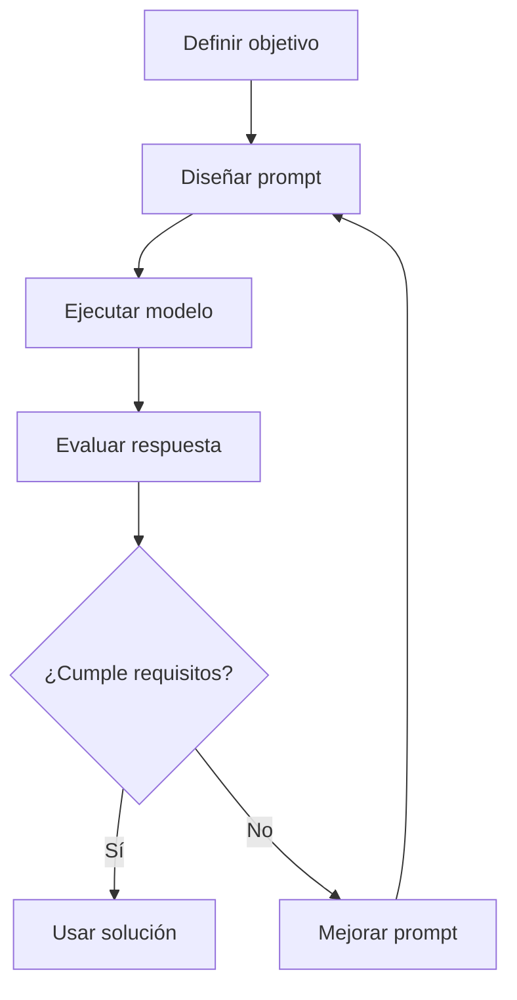
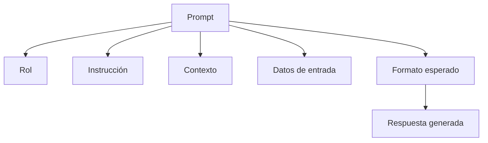
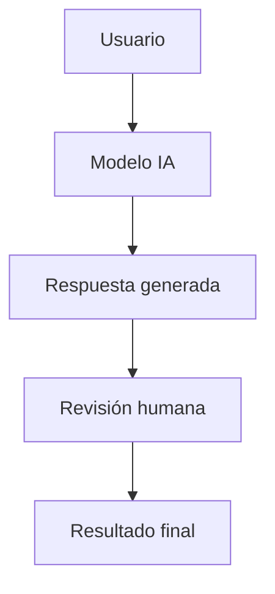
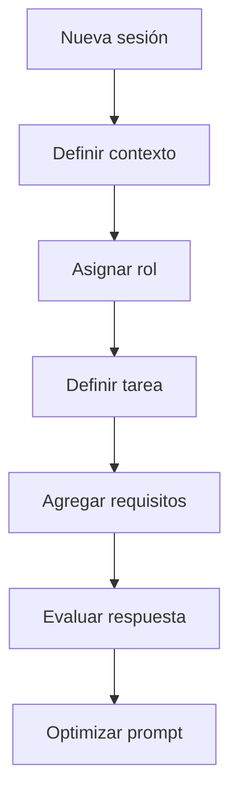
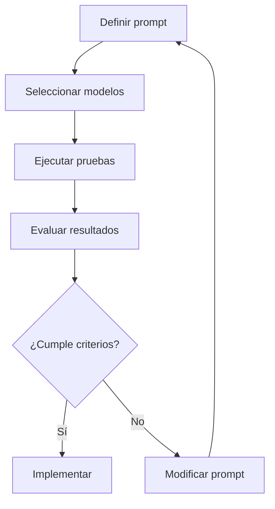
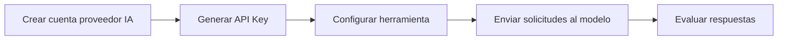

# Fundamentos Básicos de Ingeniería de Prompts y Evaluación de Prompts

# 1. ¿Qué es la Ingeniería de Prompts?

## Visión para Principiantes

La **ingeniería de prompts** es la disciplina encargada de diseñar instrucciones claras y estratégicas para comunicarse con modelos de inteligencia artificial, especialmente modelos de lenguaje (LLM).

Un prompt es la forma en que una persona le explica a una IA qué necesita realizar.

Ejemplo simple:

Prompt básico:

```text
Explícame Python.
```

Prompt diseñado:

```text
Actúa como profesor de programación.

Explica Python desde cero para un estudiante principiante.
Incluye:
- Conceptos básicos.
- Ejemplos prácticos.
- Ejercicios simples.
```

El segundo prompt produce una respuesta más controlada porque proporciona:

* Rol.
* Objetivo.
* Contexto.
* Formato esperado.

---

# Profundidad Técnica

La ingeniería de prompts es una disciplina dentro de la interacción humano-modelo que busca optimizar la comunicación con modelos generativos.

Su objetivo es controlar la entrada entregada al modelo para obtener resultados:

* Más precisos.
* Más consistentes.
* Más seguros.
* Más útiles.

Un modelo de lenguaje genera respuestas mediante probabilidades:

[
P(respuesta | instrucciones + contexto)
]

Por lo tanto, modificar la estructura del prompt cambia la distribución de posibles respuestas.

---

# 2. Características de un Prompt Bien Diseñado

Un prompt profesional:

## Reduce ambigüedad

Permite que el modelo interprete correctamente la intención.

Ejemplo:

Incorrecto:

```text
Haz un reporte.
```

Correcto:

```text
Genera un reporte técnico de 5 páginas sobre seguridad informática.
Incluye introducción, análisis, conclusiones y referencias.
```

---

## Mejora la precisión

Entrega información relevante para que el modelo pueda responder correctamente.

---

## Disminuye correcciones posteriores

Un buen prompt reduce la cantidad de modificaciones manuales después de recibir la respuesta.

---

## Controla el formato de salida

Permite definir cómo debe responder la IA.

Ejemplo:

```text
Responde utilizando:

1. Definición.
2. Explicación técnica.
3. Ejemplo.
4. Conclusión.
```

---

# 3. La Ingeniería de Prompts como Arte y Ciencia

## Visión para Principiantes

Se dice que la ingeniería de prompts combina arte y ciencia porque requiere:

### Arte

Utilizar creatividad para:

* Formular instrucciones.
* Encontrar mejores formas de explicar una necesidad.
* Diseñar estructuras eficientes.

### Ciencia

Aplicar principios técnicos:

* Lógica.
* Experimentación.
* Evaluación de resultados.
* Medición de calidad.

---

## Profundidad Técnica

La ingeniería de prompts combina elementos creativos y metodológicos.

Parte creativa:

```text
Diseño de instrucciones
Comunicación efectiva
Definición de objetivos
```

Parte científica:

```text
Pruebas
Métricas
Comparación de modelos
Optimización iterativa
```

Proceso:



---

# 4. Aplicaciones de la Ingeniería de Prompts

La ingeniería de prompts permite utilizar IA para:

## Generación de texto

Ejemplo:

* Correos electrónicos.
* Documentación.
* Informes.
* Artículos.

---

## Aprendizaje

Ejemplo:

```text
Explícame redes neuronales como si fuera estudiante universitario.
Incluye ejemplos prácticos.
```

---

## Resolución de problemas complejos

Ejemplo:

```text
Actúa como arquitecto de software.
Analiza esta arquitectura y encuentra posibles problemas.
```

---

# 5. Elementos de un Buen Prompt

Un prompt completo normalmente contiene:

---

# 5.1 Instrucción

## Visión para Principiantes

Indica qué debe hacer el modelo.

Ejemplo:

```text
Genera un resumen.
```

---

## Profundidad Técnica

Define la acción esperada del modelo.

Ejemplos:

* Analizar.
* Clasificar.
* Crear.
* Resumir.
* Explicar.
* Comparar.

---

# 5.2 Contexto

## Visión para Principiantes

Es información adicional que ayuda a la IA a comprender la situación.

Ejemplo:

Sin contexto:

```text
Crea una aplicación.
```

Con contexto:

```text
Crea una aplicación móvil educativa para niños de 8 a 12 años.
```

---

# 5.3 Datos de Entrada

Son los datos específicos con los cuales trabajará el modelo.

Ejemplo:

```text
Analiza este texto:

"Contenido del documento..."
```

---

# Arquitectura de un Prompt



---

# 6. Tipos de Prompts

Dependiendo del objetivo existen diferentes tipos.

---

# 6.1 Resumen de Texto

## Objetivo

Reducir información manteniendo los puntos importantes.

Ejemplo:

```text
Resume este documento en 5 puntos principales.
```

---

# 6.2 Extracción de Información

Obtiene datos específicos desde un texto.

Ejemplo:

Entrada:

```text
El cliente Carlos realizó una compra el día 10.
```

Prompt:

```text
Extrae nombre del cliente y fecha de compra.
```

Salida:

```json
{
 "cliente":"Carlos",
 "fecha":"10"
}
```

---

# 6.3 Preguntas y Respuestas

Permite responder consultas utilizando contexto.

Ejemplo:

```text
Contexto:
Documento sobre bases de datos.

Pregunta:
¿Qué es una clave primaria?
```

---

# 6.4 Clasificación de Texto

Clasifica información según categorías.

Ejemplo:

Clasificación de comentarios:

```text
"El servicio fue excelente"

Resultado:

Sentimiento:
Positivo
```

---

# 6.5 Generación de Código

Utiliza LLM para crear código.

Ejemplo:

```text
Actúa como desarrollador backend.

Genera una API REST usando Python Flask.
Incluye autenticación y validaciones.
```

---

# 7. Supervisión Humana en Sistemas con IA

## Visión para Principiantes

La inteligencia artificial siempre debe estar supervisada por una persona con conocimiento del área.

La IA puede:

* Equivocarse.
* Inventar información.
* Interpretar mal una instrucción.

---

## Profundidad Técnica

El modelo debe formar parte de un sistema **Human in the Loop**.

Arquitectura:



---

# 8. Flujo Profesional de Creación de Prompts

Proceso recomendado:



---

# 9. Prompt Unit Testing

# ¿Qué es Prompt Unit Testing?

## Visión para Principiantes

En programación tradicional, las pruebas unitarias verifican que una parte del código funcione correctamente.

Ejemplo:

```python
2 + 2 = 4
```

En inteligencia artificial es diferente porque los modelos son **estocásticos**.

Esto significa que pueden generar respuestas diferentes ante la misma entrada.

Por eso, Prompt Unit Testing no busca comprobar que la respuesta sea exactamente igual, sino verificar que mantenga características esperadas.

---

# Profundidad Técnica

Prompt Unit Testing es un proceso de evaluación automatizada de prompts para validar:

* Calidad.
* Consistencia.
* Seguridad.
* Cumplimiento de requisitos.

Evalúa características, no coincidencia exacta.

Ejemplo:

No se prueba:

```text
Respuesta exacta:
"Python es un lenguaje..."
```

Se prueba:

```text
Debe:
✔ Explicar Python correctamente.
✔ Usar tono profesional.
✔ Incluir ejemplos.
```

---

# Ventajas del Prompt Unit Testing

## Código más confiable

Reduce errores antes de producción.

---

## Facilita mantenimiento

Permite detectar cambios negativos después de modificar prompts.

---

## Control de calidad

Garantiza estabilidad en resultados generados por IA.

---

# 10. Importancia en la Industria

## Detección de regresiones

Evita que una modificación en un prompt destruya funcionalidades existentes.

Ejemplo:

Antes:

```text
Respuesta correcta
```

Después de cambio:

```text
Respuesta incorrecta
```

El test detecta el problema.

---

# Benchmarking

Permite comparar modelos.

Ejemplo:

```text
Modelo Flash:
Más rápido y barato.

Modelo Pro:
Más lento y preciso.
```

---

# Seguimiento de desempeño

Permite evaluar:

* Diferentes versiones.
* Diferentes modelos.
* Cambios de comportamiento.

---

# 11. Componentes de Evaluación de Prompts

## Exactitud

Pregunta:

¿La respuesta es correcta?

---

## Formato

Pregunta:

¿Cumple la estructura solicitada?

Ejemplo:

Se pidió JSON:

```json
{
 "nombre":"Carlos"
}
```

---

## Robustez

Pregunta:

¿Funciona con diferentes entradas?

---

## Seguridad y Sesgos

Pregunta:

¿La respuesta es ética y segura?

---

# 12. Promptfoo

## Visión para Principiantes

**Promptfoo** es una herramienta que permite probar y comparar prompts de inteligencia artificial.

Ayuda a verificar si un prompt funciona correctamente antes de utilizarlo en producción.

---

## Profundidad Técnica

Promptfoo es una herramienta de código abierto orientada a desarrolladores para evaluar aplicaciones basadas en LLM.

Permite:

* Comparar modelos.
* Ejecutar pruebas automáticas.
* Evaluar respuestas.
* Detectar problemas.

Funciona como una capa de evaluación para entradas y salidas de sistemas generativos.

---

# Flujo de Evaluación con Promptfoo



---

# 13. Proceso Inicial con Promptfoo

Pasos generales:

## 1. Definir el prompt

Ejemplo:

```text
Actúa como experto en programación Python.
Explica errores del código proporcionado.
```

---

## 2. Definir modelos de lenguaje

Ejemplo:

```text
Modelo A
Modelo B
Modelo C
```

---

## 3. Ejecutar pruebas

Comparar resultados obtenidos.

---

## 4. Mejorar prompt

Si los resultados no cumplen:

* Cambiar instrucciones.
* Agregar contexto.
* Definir restricciones.

---

# 14. API Key y Modelos

Para utilizar modelos externos normalmente se requiere una clave de acceso (**API Key**).

Ejemplo de flujo:



---

# 15. Glosario

| Término               | Definición                                                                 |
| --------------------- | -------------------------------------------------------------------------- |
| Prompt                | Instrucción enviada a un modelo de IA.                                     |
| Ingeniería de prompts | Disciplina que diseña instrucciones optimizadas para IA.                   |
| LLM                   | Modelo de lenguaje capaz de generar texto mediante aprendizaje automático. |
| Contexto              | Información adicional proporcionada al modelo.                             |
| Dato de entrada       | Información específica utilizada por la IA para procesar una tarea.        |
| Human in the Loop     | Modelo donde una persona supervisa decisiones de IA.                       |
| Prompt Testing        | Evaluación sistemática de prompts.                                         |
| Unit Testing          | Pruebas automatizadas para verificar comportamiento esperado.              |
| Regresión             | Pérdida de una funcionalidad después de un cambio.                         |
| Benchmarking          | Comparación de rendimiento entre sistemas.                                 |
| API Key               | Clave utilizada para autenticar acceso a un servicio.                      |
| Estocástico           | Sistema que puede producir resultados diferentes con la misma entrada.     |
| Formato de salida     | Estructura esperada de la respuesta generada.                              |

---

# Conclusión

La ingeniería de prompts es una habilidad fundamental para trabajar profesionalmente con modelos de inteligencia artificial.

Un prompt bien diseñado permite:

* Controlar respuestas.
* Reducir errores.
* Mejorar productividad.
* Automatizar tareas.
* Obtener resultados consistentes.

Sin embargo, los modelos de IA siempre requieren evaluación y supervisión humana. La combinación entre buenos prompts, pruebas automatizadas y revisión profesional permite construir sistemas más confiables y seguros.
