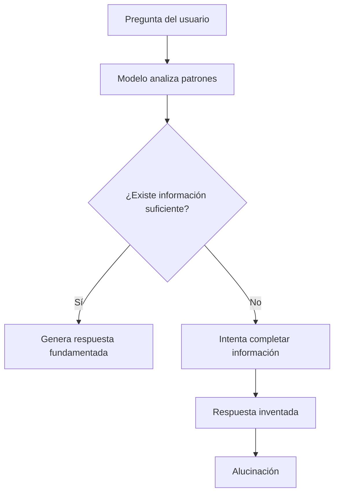
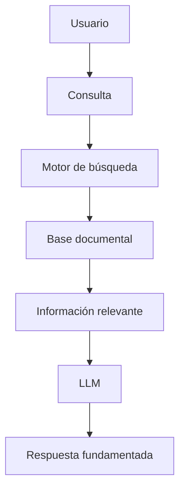
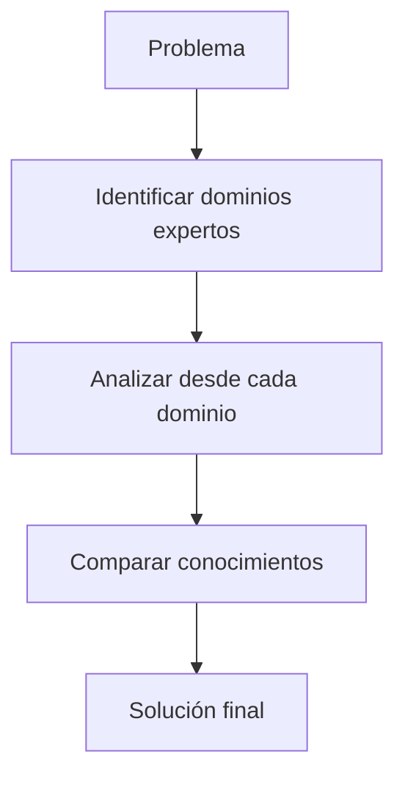
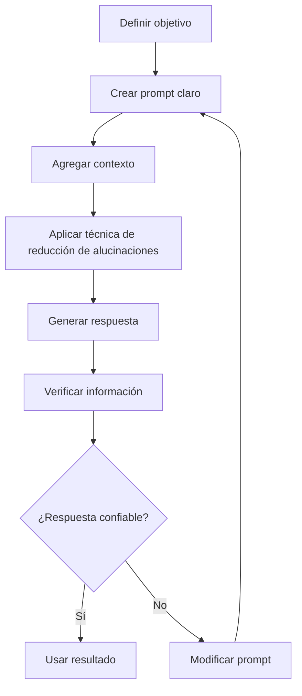

# Mitigación de Alucinaciones en Modelos de Lenguaje mediante Ajustes de Instrucciones

# 1. ¿Qué son las Alucinaciones en Modelos de Lenguaje?

## Visión para Principiantes

Una **alucinación en inteligencia artificial** ocurre cuando un modelo de lenguaje genera una respuesta que parece correcta, está bien escrita y tiene sentido, pero contiene información falsa o sin evidencia real.

Ejemplo:

Usuario:

```text
Dame una referencia científica sobre este tema.
```

Modelo:

```text
Según el estudio "Advanced Neural Systems 2022" de John Smith...
```

Problema:

El artículo, autor o enlace pueden no existir.

---

Las alucinaciones ocurren porque los modelos de lenguaje no funcionan como una base de datos tradicional.

No buscan una respuesta almacenada, sino que generan texto prediciendo qué palabras tienen mayor probabilidad de aparecer.

---

# Profundidad Técnica

Un LLM genera respuestas mediante modelos probabilísticos:

[
P(respuesta | contexto)
]

El modelo no verifica automáticamente si una información es verdadera.

Puede producir una respuesta:

* Lingüísticamente correcta.
* Coherente.
* Convincente.

Pero sin respaldo factual.

---

# 2. Causas Principales de las Alucinaciones

## 2.1 Tendencia a ser excesivamente útil

Los modelos están entrenados para ayudar al usuario.

Cuando no poseen suficiente información pueden intentar completar la respuesta.

Ejemplo:

Usuario:

```text
¿Cuál es la API secreta de esta empresa?
```

Respuesta incorrecta:

```text
La API es https://api.empresa.com/v2
```

El modelo puede inventar una respuesta porque intenta satisfacer la solicitud.

---

# 2.2 Falta de información verificable

Cuando el modelo no tiene:

* Datos confiables.
* Documentación.
* Contexto suficiente.

Aumenta la probabilidad de errores.

---

# 2.3 Falta de entrenamiento orientado a evitar errores

Un modelo puede aprender patrones del lenguaje, pero eso no significa que siempre pueda distinguir:

* Información verdadera.
* Información falsa.
* Información desconocida.

---

# Flujo de generación de una alucinación



---

# 3. Técnicas para Reducir Alucinaciones

Las principales técnicas son:

* Retrieval Augmented Generation (RAG).
* ReAct Prompting.
* Chain-of-Verification (CoVe).
* Chain-of-Notes (CoN).
* Chain-of-Knowledge (CoK).

---

# 4. Retrieval Augmented Generation (RAG)

## Visión para Principiantes

**RAG (Retrieval Augmented Generation)** es una técnica que combina un modelo de lenguaje con una fuente externa de información.

En lugar de responder solamente con lo aprendido durante entrenamiento, el modelo primero busca información relevante y después genera la respuesta.

Ejemplo:

Sin RAG:

```text
Pregunta
   |
   v
Modelo
   |
   v
Respuesta basada en entrenamiento
```

Con RAG:

```text
Pregunta
   |
   v
Buscar información
   |
   v
Documentos confiables
   |
   v
Modelo genera respuesta
```

---

# Profundidad Técnica

RAG combina dos componentes:

## 1. Recuperador (Retriever)

Busca información relevante en:

* Bases documentales.
* Bases vectoriales.
* APIs.
* Sistemas internos.

## 2. Generador (Generator)

Utiliza el contexto recuperado para producir una respuesta.

Arquitectura:



---

# Ventajas de RAG

✓ Reduce alucinaciones utilizando información externa.

✓ Permite actualizar conocimiento sin volver a entrenar el modelo.

✓ Facilita respuestas basadas en documentación propia.

✓ Mejora aplicaciones empresariales.

Ejemplo:

Un chatbot empresarial puede consultar:

* Manuales internos.
* Políticas.
* Documentación técnica.

---

# Limitaciones de RAG

✓ Requiere construir y mantener bases de conocimiento.

✓ Si la fuente contiene errores, el modelo puede repetirlos.

✓ La calidad depende del sistema de recuperación.

✓ Puede aumentar la complejidad del sistema.

---

# 5. ReAct Prompting

## Visión para Principiantes

**ReAct (Reasoning and Acting)** es una técnica donde se obliga al modelo a analizar una tarea antes de responder.

Busca evitar respuestas impulsivas.

Ejemplo:

Sin ReAct:

```text
Pregunta
   |
   v
Respuesta inmediata
```

Con ReAct:

```text
Pregunta

↓

Analizar problema

↓

Identificar información necesaria

↓

Responder
```

---

# Profundidad Técnica

ReAct combina:

* Razonamiento.
* Acciones.
* Observaciones.

El modelo genera una secuencia:

```
Pensamiento → Acción → Observación → Respuesta
```

Ejemplo conceptual:

```text
Problema:
Calcular costo de infraestructura.

Análisis:
Necesito conocer usuarios, tráfico y recursos.

Acción:
Solicitar datos faltantes.

Respuesta:
Propuesta basada en información disponible.
```

---

# Ventajas de ReAct

✓ Mejora la transparencia del proceso.

✓ Permite identificar incertidumbre.

✓ Ayuda a detectar información faltante.

✓ Reduce respuestas generadas sin análisis previo.

---

# Limitaciones de ReAct

✓ Puede generar respuestas más largas.

✓ No garantiza verificación externa.

✓ Un razonamiento bien explicado no significa necesariamente que sea verdadero.

---

# 6. Chain-of-Verification (CoVe)

## Visión para Principiantes

**Chain-of-Verification** obliga al modelo a revisar su propia respuesta antes de entregarla.

El objetivo es reducir información inventada.

Proceso:

```text
Generar respuesta

↓

Crear preguntas de verificación

↓

Comprobar información

↓

Entregar respuesta final
```

---

# Profundidad Técnica

CoVe crea una cadena de validaciones donde cada afirmación debe estar respaldada.

Estructura:

```text
Hecho inicial

↓

Deducción verificable 1

↓

Deducción verificable 2

↓

Respuesta final
```

---

# Ejemplo

Información inicial:

```text
Srinivasa Ramanujan nació en Erode, Tamil Nadu.
```

Verificación:

```
Erode pertenece a Tamil Nadu.

↓

Tamil Nadu pertenece a India.

↓

Ramanujan nació en India.
```

---

# Ventajas de CoVe

✓ Reduce respuestas especulativas.

✓ Fuerza validación explícita.

✓ Mejora organización lógica.

---

# Limitaciones de CoVe

✓ Puede ser complejo para problemas ambiguos.

✓ Depende de fuentes externas disponibles.

✓ Puede ser demasiado rígido en algunos casos.

---

# 7. Chain-of-Notes (CoN)

## Visión para Principiantes

Chain-of-Notes busca que el modelo registre notas intermedias sobre:

* Qué sabe.
* Qué no sabe.
* Qué información falta.

---

# Profundidad Técnica

La estructura conceptual es:

```text
Pregunta inicial

↓

Nota 1:
Comprensión inicial

↓

Nota 2:
Información faltante

↓

Nota 3:
Contexto adicional

↓

Respuesta final
```

---

# Plantilla CoN

```text
Pregunta:

[Pregunta del usuario]

Nota 1:
Analiza conceptos conocidos.

Nota 2:
Identifica incertidumbres.

Nota 3:
Indica información necesaria.

Respuesta final:
Genera conclusión basada en las notas.
```

---

# Ventajas de CoN

✓ Reconoce incertidumbre.

✓ Evita respuestas apresuradas.

✓ Mejora análisis previo.

---

# Limitaciones de CoN

✓ Puede aumentar tiempo de respuesta.

✓ Puede producir explicaciones innecesarias.

✓ Mostrar demasiada incertidumbre puede afectar experiencia del usuario.

---

# 8. Chain-of-Knowledge (CoK)

## Visión para Principiantes

Chain-of-Knowledge busca que la IA construya respuestas utilizando conocimiento especializado.

La idea es que diferentes áreas aporten perspectivas para mejorar la calidad.

Ejemplo:

Problema:

Diseñar sistema financiero.

Participan:

* Arquitectura de software.
* Seguridad.
* Bases de datos.
* Finanzas.

---

# Profundidad Técnica

CoK obliga al modelo a fundamentar respuestas mediante conocimiento especializado.

Funciona como una revisión conceptual.

Proceso:



---

# Ventajas de CoK

✓ Reduce saltos lógicos.

✓ Mejora fundamentación técnica.

✓ Permite análisis multidisciplinario.

---

# Limitaciones de CoK

✓ Requiere identificar expertos adecuados.

✓ Puede introducir sesgo por selección.

✓ Diferentes expertos pueden tener opiniones contradictorias.

---

# 9. Comparación de Técnicas

| Técnica | Objetivo principal                              |
| ------- | ----------------------------------------------- |
| RAG     | Agregar información externa verificable         |
| ReAct   | Mejorar análisis antes de responder             |
| CoVe    | Verificar afirmaciones generadas                |
| CoN     | Reconocer incertidumbre y contexto faltante     |
| CoK     | Fundamentar respuestas con conocimiento experto |

---

# 10. Prompt Profesional para Reducir Alucinaciones

Ejemplo:

```text
Eres un arquitecto de software especializado en sistemas de alta disponibilidad.

Tu tarea es resolver escenarios técnicos utilizando principios de arquitectura empresarial.

Reglas:

- No inventes información.
- Si falta información, indica la incertidumbre.
- Justifica las decisiones técnicas.
- Considera limitaciones reales de presupuesto y escalabilidad.

Analiza el siguiente escenario:

Una aplicación financiera procesa 10,000 TPS.
Necesita migrar desde una base de datos relacional hacia una arquitectura distribuida.

Requisitos:
- Alta disponibilidad.
- Replicación geográfica.
- Consistencia de datos.
- Presupuesto limitado.

Entrega:

1. Análisis del problema.
2. Restricciones técnicas.
3. Alternativas posibles.
4. Arquitectura recomendada.
5. Riesgos y mitigaciones.
```

---

# 11. Prompt con Chain-of-Knowledge

```text
Eres un arquitecto de software y consultor experto en sistemas de alta disponibilidad.

Aplica Chain-of-Knowledge para estructurar la solución.

FASE 1:
Identifica conceptos técnicos relacionados:

- Sistemas distribuidos.
- Consistencia de datos.
- Alta disponibilidad.
- Replicación.
- Escalabilidad.

FASE 2:
Relaciona estos conceptos con el escenario presentado.

FASE 3:
Propón una solución técnica considerando:
- Rendimiento.
- Costos.
- Seguridad.
- Mantenimiento.

Escenario:

Una aplicación financiera procesa 10,000 TPS.
Necesita una arquitectura distribuida con alta disponibilidad y consistencia global.
```

---

# 12. Flujo General de Mitigación de Alucinaciones



---

# Glosario

| Término            | Definición                                                                     |
| ------------------ | ------------------------------------------------------------------------------ |
| Alucinación        | Respuesta generada por IA que parece correcta pero contiene información falsa. |
| RAG                | Técnica que combina LLM con recuperación de información externa.               |
| Retriever          | Componente encargado de buscar información relevante.                          |
| Generator          | Modelo encargado de producir la respuesta final.                               |
| ReAct              | Técnica que combina razonamiento y acciones antes de responder.                |
| CoVe               | Método que verifica afirmaciones antes de entregar resultados.                 |
| CoN                | Método basado en notas intermedias para reconocer incertidumbre.               |
| CoK                | Método que fundamenta respuestas mediante conocimiento experto.                |
| Contexto           | Información adicional que ayuda al modelo a responder.                         |
| Fuente verificable | Información respaldada por una referencia confiable.                           |
| Modelo estocástico | Sistema que puede generar resultados diferentes con la misma entrada.          |
| Base vectorial     | Sistema que almacena representaciones numéricas para búsqueda semántica.       |

---

# Conclusión

Las alucinaciones son uno de los principales problemas de los modelos de lenguaje porque una respuesta bien redactada no garantiza que sea verdadera.

La mitigación requiere combinar:

* Prompts bien diseñados.
* Contexto suficiente.
* Fuentes externas.
* Técnicas de verificación.
* Evaluación humana.

Los modelos de IA no deben considerarse fuentes absolutas de conocimiento, sino herramientas que necesitan controles para producir resultados confiables y profesionales.
