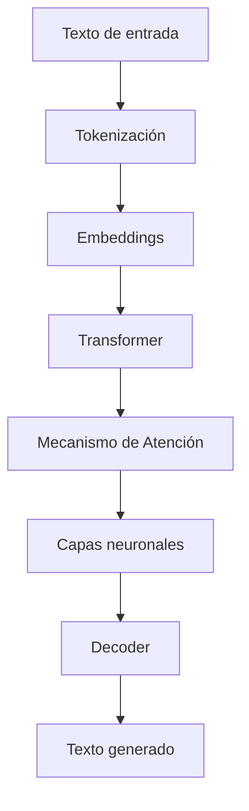
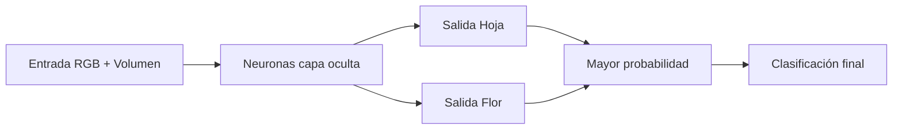
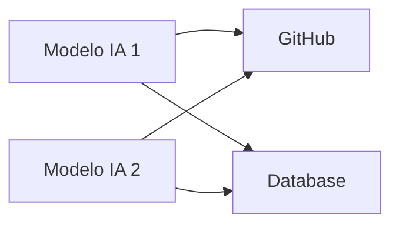
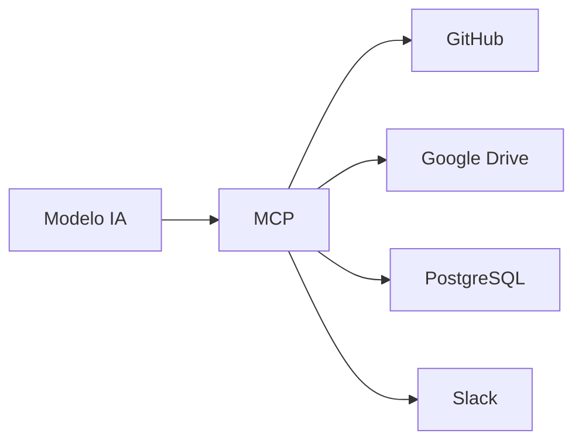
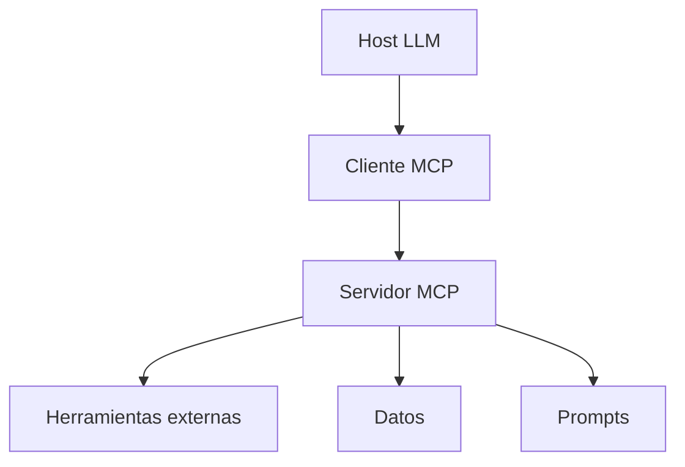

# Modelos de Lenguaje de Gran Escala (LLM), Redes Neuronales y Model Context Protocol (MCP)

# 1. ¿Qué es un Large Language Model (LLM)?

## Visión para Principiantes

Un **Large Language Model (LLM)** o **Modelo de Lenguaje Grande** es un tipo de inteligencia artificial entrenada utilizando enormes cantidades de texto para aprender cómo funciona el lenguaje humano.

Un LLM puede:

* Comprender texto.
* Generar respuestas.
* Resumir información.
* Traducir idiomas.
* Crear código.
* Transformar contenido.

Ejemplos de uso:

* Asistentes virtuales.
* Chatbots.
* Generadores de contenido.
* Herramientas de programación.

---

A diferencia de un programa tradicional basado en reglas:

Sistema tradicional:

```text
Si ocurre A:
    ejecutar acción B
```

LLM:

```text
Aprende patrones del lenguaje

↓

Predice cuál es la respuesta más probable
```

Los LLM no tienen reglas escritas manualmente para cada situación, sino que aprenden relaciones estadísticas entre palabras y conceptos.

---

# Profundidad Técnica

Un LLM es un modelo de aprendizaje profundo entrenado con grandes corpus de datos textuales.

Su objetivo principal es estimar:

[
P(token_{siguiente}|tokens\ anteriores)
]

Es decir:

> Dado un conjunto de palabras anteriores, calcula cuál es la continuación más probable.

Ejemplo:

Entrada:

```text
La capital de Francia es
```

El modelo calcula probabilidades:

```
París     95%
Madrid     2%
Roma       1%
Londres    2%
```

Selecciona una respuesta basada en la distribución probabilística.

---

# 2. Arquitectura de los LLM

## Visión para Principiantes

La mayoría de los LLM modernos utilizan una arquitectura llamada **Transformer**.

Esta arquitectura permite que la inteligencia artificial pueda analizar relaciones entre palabras dentro de un texto.

Sus componentes principales son:

* Codificación.
* Atención.
* Decodificación.

---

# Profundidad Técnica

La arquitectura Transformer está basada en redes neuronales profundas que procesan secuencias mediante mecanismos de atención.

Componentes principales:

---

# 2.1 Codificador (Encoder)

## Función

Transforma la información de entrada en una representación matemática.

Permite:

* Analizar contexto.
* Comprender relaciones.
* Extraer significado.

Ejemplo:

Entrada:

```text
El banco está cerca del río.
```

El encoder analiza que "banco" probablemente significa una estructura junto al río y no una institución financiera.

---

# 2.2 Decodificador (Decoder)

## Función

Genera la salida del modelo.

Ejemplo:

Entrada:

```text
Explícame redes neuronales.
```

Decoder:

```text
Una red neuronal es un modelo matemático inspirado en el cerebro...
```

---

# 2.3 Mecanismo de Atención (Attention)

## Visión para Principiantes

La atención permite que el modelo se enfoque en las partes más importantes del texto.

Ejemplo:

Frase:

```text
Juan dejó el libro sobre la mesa porque estaba roto.
```

La IA debe determinar:

¿Quién estaba roto?

El mecanismo de atención analiza las relaciones entre palabras.

---

## Profundidad Técnica

El mecanismo de atención calcula qué palabras tienen mayor relación entre sí.

La fórmula base es:

[
Attention(Q,K,V)=softmax(\frac{QK^T}{\sqrt{d_k}})V
]

Donde:

* Q = Query.
* K = Key.
* V = Value.

---

# Importancia de la Atención

Permite:

✓ Relacionar palabras separadas.

✓ Mantener coherencia en textos largos.

✓ Comprender contexto.

✓ Procesar información paralela.

---

# Arquitectura general de un Transformer



---

# 3. Historia de los Modelos de Lenguaje

# Etapa 1: Modelos de Comprensión

## Visión para Principiantes

Los primeros modelos estaban diseñados principalmente para entender texto, no para generar conversaciones completas.

Ejemplos:

* ELMo.
* BERT.
* RoBERTa.

---

## Características

* Analizan significado.
* Clasifican información.
* Extraen características del texto.
* Son utilizados en NLP tradicional.

Ejemplo:

Clasificación:

```text
Texto:
"El producto llegó tarde"

Resultado:
Sentimiento negativo
```

---

# Etapa 2: Modelos Generativos

Ejemplos:

* GPT-1.
* GPT-2.
* GPT-3.

---

# Avances principales

Permitieron:

✓ Generación coherente de texto.

✓ Escritura similar a humanos.

✓ Creación automática de código.

✓ Conversaciones más naturales.

---

# 4. GPT-3: Una Nueva Dimensión

## Visión para Principiantes

GPT-3 demostró que un modelo podía aprender nuevas tareas solamente observando ejemplos dentro del prompt.

---

# In-Context Learning

Es la capacidad del modelo de aprender temporalmente una tarea sin modificar sus parámetros internos.

Ejemplo:

Prompt:

```text
Ejemplo:

Entrada:
2+2

Salida:
4


Ahora resuelve:

5+5
```

El modelo entiende el patrón.

---

# Escalabilidad

GPT-3 utilizó aproximadamente:

[
175\ mil\ millones
]

de parámetros.

Los parámetros son valores internos aprendidos durante entrenamiento.

---

# 5. Limitaciones de los LLM

Aumentar el tamaño del modelo no resuelve todos los problemas.

---

## 5.1 Costos elevados

Los modelos grandes requieren:

* Miles de GPUs.
* Infraestructura especializada.
* Grandes centros de datos.

---

## 5.2 Consumo energético

Entrenar y ejecutar LLM requiere mucha energía.

---

## 5.3 Datos limitados

Existe una cantidad finita de información útil disponible para entrenamiento.

---

# Principio importante:

> No todo problema se resuelve creando modelos más grandes.

También se necesitan:

* Mejores datos.
* Mejores arquitecturas.
* Sistemas externos.
* Evaluación humana.

---

# 6. Redes Neuronales

## Visión para Principiantes

Una red neuronal es un modelo matemático inspirado en la estructura del cerebro humano.

Está formada por nodos llamados neuronas artificiales.

Una red neuronal:

1. Recibe números.
2. Procesa números.
3. Devuelve números.

No entiende conceptos directamente.

---

Ejemplo:

Una red no sabe qué es una flor.

Recibe:

```
Color rojo
Color verde
Volumen
Tamaño
```

Y aprende patrones relacionados con etiquetas:

```
Flor
Hoja
```

---

# Profundidad Técnica

Una neurona artificial realiza:

[
Salida = Peso_1*x_1 + Peso_2*x_2 + ... + Bias
]

Los pesos representan la importancia de cada entrada.

---

# Ejemplo de Clasificación Neural

Objetivo:

Diferenciar:

* Hoja.
* Flor.

Datos:

| Característica | Hoja | Flor |
| -------------- | ---- | ---- |
| R              | 32   | 241  |
| G              | 107  | 200  |
| B              | 56   | 4    |
| Volumen        | 11.2 | 59.5 |

---

La red recibe:

```
R = 32
G = 107
B = 56
Vol = 11.2
```

---

Primera salida:

[
(32*0.35)+(107*-0.25)+(56*-0.31)+(11.2*0.45)
]

Resultado:

[
-26.8
]

Segunda salida:

[
(32*-0.35)+(107*-0.21)+(56*-0.27)+(11.2*0.18)
]

Resultado:

[
-47.1
]

La red interpreta los valores según la función de salida.

---

# Arquitectura de red neuronal simple



---

# 7. Model Context Protocol (MCP)

# ¿Qué es MCP?

## Visión para Principiantes

**Model Context Protocol (MCP)** es un estándar abierto creado para permitir que los modelos de inteligencia artificial puedan conectarse fácilmente con herramientas y datos externos.

Ejemplos:

Una IA puede conectarse con:

* Google Drive.
* GitHub.
* Bases de datos.
* Sistemas empresariales.

---

# Problema que resuelve MCP

Antes de MCP:

Cada modelo necesitaba una integración diferente con cada herramienta.

Esto genera el problema:

[
N \times M
]

Donde:

* N = cantidad de modelos.
* M = cantidad de herramientas.

---

Ejemplo:

3 modelos:

```
GPT
Claude
Gemini
```

5 herramientas:

```
GitHub
Drive
Slack
Postgres
CRM
```

Integraciones:

[
3 \times 5 = 15
]

---

# Problema N x M



Problema:

* Muchas conexiones.
* Alto mantenimiento.
* Poco escalable.

---

# Solución con MCP

MCP funciona como una capa estándar.



---

# 8. Características Principales de MCP

# 8.1 Conector Universal

Permite reemplazar muchas integraciones personalizadas por un protocolo común.

---

# 8.2 Conexiones Seguras y Bidireccionales

La IA puede:

* Consultar información.
* Ejecutar acciones.
* Interactuar con sistemas externos.

---

# 8.3 Ecosistema Abierto

Permite crear:

* SDKs.
* Conectores.
* Servidores MCP.

---

# 9. Arquitectura MCP

MCP utiliza un modelo cliente-servidor.

Tiene tres componentes:

---

# Host

Aplicación donde vive el modelo.

Ejemplos:

* Asistentes IA.
* Aplicaciones con LLM.

---

# Cliente MCP

Componente encargado de:

* Administrar conexiones.
* Manejar contexto.
* Comunicarse con servidores.

---

# Servidor MCP

Expone:

* Datos.
* Herramientas.
* Prompts.

---

# Arquitectura MCP



---

# 10. MCP y Function Calling

MCP no reemplaza las integraciones existentes.

Las organiza y estandariza utilizando conceptos como:

**Function Calling**

La IA puede solicitar ejecutar una función externa.

Ejemplo:

```json
{
 "function":"buscar_usuario",
 "parameters":{
   "id":123
 }
}
```

---

# 11. Glosario

| Término          | Definición                                                             |
| ---------------- | ---------------------------------------------------------------------- |
| LLM              | Modelo de lenguaje entrenado con grandes cantidades de texto.          |
| Transformer      | Arquitectura neuronal utilizada por modelos modernos de lenguaje.      |
| Token            | Unidad mínima de texto procesada por un modelo.                        |
| Parámetro        | Valor interno aprendido durante entrenamiento.                         |
| Embedding        | Representación matemática de información.                              |
| Attention        | Mecanismo que permite priorizar partes importantes del texto.          |
| Encoder          | Componente que interpreta información de entrada.                      |
| Decoder          | Componente que genera salida.                                          |
| Deep Learning    | Aprendizaje basado en redes neuronales profundas.                      |
| Red neuronal     | Modelo matemático formado por neuronas artificiales conectadas.        |
| Peso             | Valor que determina la importancia de una entrada.                     |
| MCP              | Protocolo abierto para conectar IA con herramientas externas.          |
| Host             | Aplicación que contiene el modelo de IA.                               |
| Cliente MCP      | Componente que administra conexiones MCP.                              |
| Servidor MCP     | Sistema que expone herramientas y datos.                               |
| Function Calling | Capacidad de un modelo para solicitar ejecución de funciones externas. |

---

# Conclusión

Los LLM representan una evolución de los sistemas tradicionales porque no dependen únicamente de reglas programadas, sino que aprenden patrones complejos del lenguaje mediante redes neuronales.

Sin embargo, los modelos grandes tienen limitaciones:

* Costos elevados.
* Posibles errores.
* Dependencia de datos.

Por esta razón, tecnologías como **RAG, evaluación de prompts y MCP** permiten construir sistemas más confiables, conectados y útiles en escenarios reales.
