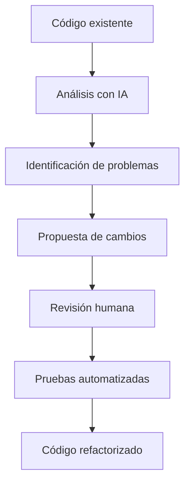
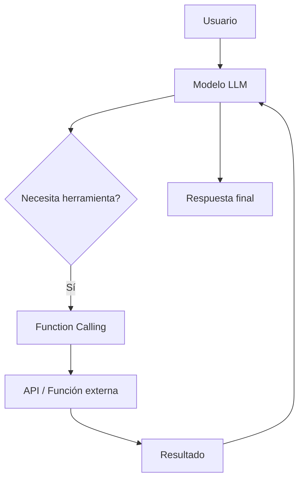
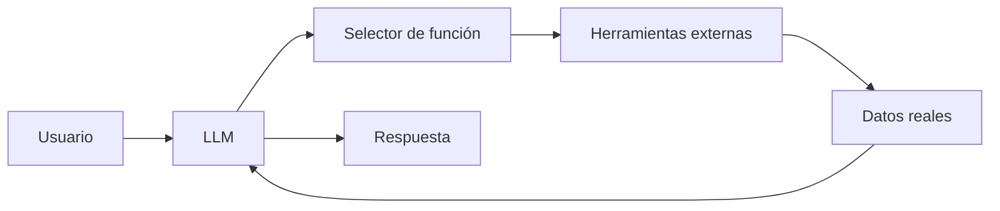
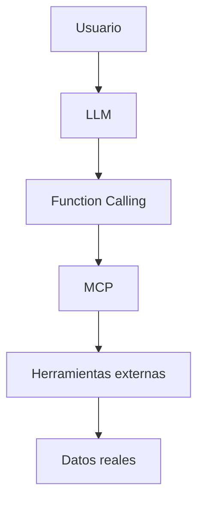

# Refactorización Asistida por Inteligencia Artificial y Generación de Funciones mediante LLM

# 1. Refactorización de Código Asistida por Inteligencia Artificial

## Visión para Principiantes

La **refactorización** es el proceso de mejorar la estructura interna de un programa sin cambiar lo que hace.

El objetivo es que el código sea:

* Más fácil de leer.
* Más fácil de mantener.
* Más organizado.
* Más seguro para modificar.

Ejemplo:

Código original:

```python
def calcular(x,y):
    return x+y
```

Después de refactorizar:

```python
def sumar_numeros(numero_a, numero_b):
    return numero_a + numero_b
```

La funcionalidad es la misma, pero el código es más entendible.

---

La inteligencia artificial ayuda automatizando tareas repetitivas como:

* Cambiar nombres de variables.
* Separar funciones grandes.
* Eliminar código innecesario.
* Generar documentación.
* Aplicar estándares de programación.

---

# Profundidad Técnica

La refactorización asistida por IA combina técnicas tradicionales de ingeniería de software con modelos especializados en código.

Un modelo de IA analiza:

* Estructura del código.
* Relaciones entre archivos.
* Dependencias.
* Patrones arquitectónicos.
* Convenciones del proyecto.

El objetivo es modificar el código manteniendo:

[
Comportamiento\ original = Comportamiento\ refactorizado
]

Es decir:

```text
Código antes

        ↓

Cambio estructural

        ↓

Mismo resultado funcional
```

---

# Flujo de Refactorización con IA



---

# 2. Problema de los Sistemas Heredados (Legacy Systems)

## Visión para Principiantes

Un sistema heredado es un software antiguo que sigue funcionando, pero cuyo código puede ser difícil de modificar.

Problemas comunes:

* Muchos archivos.
* Código antiguo.
* Poca documentación.
* Dependencias desconocidas.

Modificar una pequeña parte puede romper otras funcionalidades.

---

## Profundidad Técnica

Los sistemas heredados acumulan **deuda técnica**.

La deuda técnica representa el costo futuro generado por decisiones rápidas o estructuras deficientes.

Ejemplo:

```text
Código antiguo

+
Falta de documentación

+
Dependencias acopladas

=

Mayor costo de mantenimiento
```

---

# Problemas frecuentes

## 1. Conflictos de fusión (Merge Conflicts)

Cuando varios desarrolladores modifican las mismas áreas del código aparecen conflictos.

Ejemplo:

```text
Desarrollador A modifica archivo X

Desarrollador B modifica archivo X

↓

Git no sabe qué versión conservar
```

---

## 2. Acumulación de deuda técnica

Con el tiempo:

* Aumenta la complejidad.
* Disminuye la velocidad de desarrollo.
* Incrementa el riesgo de errores.

---

# 3. Refactorización mediante IA

## Visión para Principiantes

La IA no solamente cambia texto.

Puede comprender la estructura del código y sugerir mejoras.

Ejemplo:

Antes:

```python
def procesar_usuario(usuario):
    validar(usuario)
    guardar(usuario)
    enviar_email(usuario)
```

Después:

```python
def procesar_usuario(usuario):
    validar_usuario(usuario)
    guardar_usuario(usuario)
    notificar_usuario(usuario)
```

La lógica sigue siendo la misma, pero cada función tiene una responsabilidad clara.

---

# Profundidad Técnica

Los modelos modernos de código utilizan análisis estructural mediante:

* AST (Abstract Syntax Tree).
* Análisis semántico.
* Relaciones entre archivos.
* Dependencias.

---

# Abstract Syntax Tree (AST)

Un AST representa el código como una estructura de datos.

Ejemplo:

Código:

```python
resultado = suma(2,3)
```

Representación:

```text
Asignación

├── Variable: resultado

└── Llamada:
      suma()
        ├── 2
        └── 3
```

La IA puede modificar esta estructura sin romper la sintaxis.

---

# 4. Capacidades de la Refactorización con IA

# 4.1 Renombrado de Variables en Todo el Alcance

## Visión para Principiantes

La IA puede cambiar una variable en todos los lugares donde aparece.

Ejemplo:

Antes:

```python
usr = "Carlos"

print(usr)
```

Después:

```python
usuario = "Carlos"

print(usuario)
```

---

## Profundidad Técnica

El sistema analiza:

* Alcance de variables.
* Referencias.
* Importaciones.
* Dependencias.

Evita errores como:

```python
usuario = "Carlos"

print(usr)
```

---

# 4.2 Extracción y Descomposición de Funciones

## Visión para Principiantes

Una función muy grande puede dividirse en funciones pequeñas.

Antes:

```python
def registrar_usuario():
    validar()
    guardar()
    enviar_correo()
    generar_reporte()
```

Después:

```python
def registrar_usuario():
    validar_usuario()
    guardar_usuario()
    notificar_usuario()
```

---

## Profundidad Técnica

La IA identifica:

* Código repetido.
* Alta complejidad ciclomática.
* Violaciones del principio de responsabilidad única.

Principio:

> Una función debe tener una sola responsabilidad.

---

# 4.3 Consistencia del Estilo de Código

La IA puede aplicar estándares como:

* Formato.
* Nombres.
* Organización.
* Patrones.

---

# Convenciones de nombres

## Snake Case

Usado principalmente en Python.

```python
nota_final = 20
```

---

## Camel Case

Común en JavaScript.

```javascript
notaFinal = 20;
```

---

## Pascal Case

Usado para clases.

```java
NotaFinal = 20;
```

---

## Kebab Case

Común en URLs y CSS.

```text
nota-final = 20
```

---

# 5. Implementación Profesional de Refactorización con IA

## Paso 1: Seleccionar un objetivo seguro

No comenzar con módulos críticos.

Ejemplos seguros:

* Helpers.
* Funciones pequeñas.
* Utilidades.

Evitar inicialmente:

* Sistemas de pago.
* Autenticación.
* Procesos financieros.

---

# Paso 2: Diseñar el Prompt

Ejemplo:

```text
Actúa como desarrollador senior.

Analiza esta función Python.

Objetivo:
- Mejorar legibilidad.
- Reducir complejidad.
- Mantener exactamente la misma funcionalidad.

No cambies:
- Entradas.
- Salidas.
- Reglas de negocio.
```

---

# Paso 3: Revisar el Diff

La IA debe generar una comparación:

```diff
- código anterior
+ código nuevo
```

La revisión humana es obligatoria.

---

# Paso 4: Ejecutar pruebas locales

Después de modificar:

Ejecutar:

* Tests unitarios.
* Tests integración.
* Validadores de estilo.

---

# Paso 5: Commit con contexto

Ejemplo:

```bash
git commit -m "Refactoriza servicio de usuarios reduciendo duplicación"
```

Un buen commit explica:

* Qué cambió.
* Por qué cambió.
* Qué impacto tiene.

---

# 6. Function Calling en Modelos de IA

## Visión para Principiantes

Tradicionalmente una IA solamente generaba texto.

Ejemplo:

Usuario:

```text
¿Cuánto inventario queda?
```

IA tradicional:

```text
No tengo acceso a esa información.
```

Con Function Calling:

```text
Usuario

↓

IA

↓

Consulta base de datos

↓

Respuesta real
```

---

# Profundidad Técnica

**Function Calling** permite que un modelo de lenguaje invoque funciones externas.

La IA no ejecuta directamente código arbitrario.

En cambio:

1. Decide qué función necesita.
2. Genera los parámetros.
3. El sistema ejecuta la función.
4. Devuelve el resultado al modelo.

---

# Arquitectura Function Calling



---

# 7. Aplicaciones de Function Calling

## Automatización financiera

Ejemplo:

```text
Consultar saldo bancario
```

---

## Gestión de inventarios

Ejemplo:

```text
Actualizar cantidad de productos
```

---

## Atención al cliente

Ejemplo:

```text
Consultar estado de pedido
```

---

## Monitorización de sistemas

Ejemplo:

```text
Obtener estado del servidor
```

---

# 8. Arquitectura de Generación de Funciones

## Visión para Principiantes

Una IA puede conectarse con herramientas externas para realizar acciones reales.

Ejemplo:

```text
Pregunta humana

↓

Modelo IA

↓

Función externa

↓

Resultado real
```

---

# Profundidad Técnica

Los LLM modernos funcionan como un componente de decisión.

No contienen todos los datos.

Utilizan herramientas externas:

* APIs.
* Bases de datos.
* Servicios internos.
* Sistemas empresariales.

---

# Arquitectura general



---

# 9. Uso de Herramientas Específicas

## Visión para Principiantes

Los desarrolladores pueden crear herramientas para que la IA pueda realizar tareas específicas.

Ejemplo:

Una empresa puede crear:

```text
buscar_cliente()

crear_factura()

consultar_inventario()
```

La IA decide cuándo utilizarlas.

---

# Profundidad Técnica

Las funciones actúan como puentes entre:

* Lenguaje natural.
* Sistemas externos.

Ejemplo:

Usuario:

```text
¿Cuántos productos quedan?
```

Modelo:

```json
{
 "function":"consultar_inventario",
 "parameters":{
   "producto":"Laptop"
 }
}
```

Sistema:

```json
{
 "cantidad":25
}
```

Respuesta:

```text
Hay 25 unidades disponibles.
```

---

# 10. MCP y Function Calling

Function Calling es uno de los fundamentos utilizados por arquitecturas modernas como MCP.

Relación:



---

# Glosario

| Término               | Definición                                                 |
| --------------------- | ---------------------------------------------------------- |
| Refactorización       | Proceso de mejorar código sin cambiar su comportamiento.   |
| Código legado         | Software antiguo que sigue en funcionamiento.              |
| Deuda técnica         | Costo futuro generado por decisiones técnicas deficientes. |
| AST                   | Representación estructurada del código fuente.             |
| Merge Conflict        | Conflicto generado al combinar cambios de código.          |
| Función               | Bloque de código reutilizable que realiza una tarea.       |
| Responsabilidad única | Principio donde una función debe cumplir una sola tarea.   |
| Diff                  | Comparación entre dos versiones de código.                 |
| Function Calling      | Capacidad de un LLM para invocar funciones externas.       |
| API                   | Interfaz que permite comunicación entre sistemas.          |
| Herramienta externa   | Servicio conectado que proporciona datos o acciones.       |
| LLM                   | Modelo de lenguaje de gran escala.                         |
| Parámetro             | Dato enviado a una función para ejecutar una operación.    |

---

# Conclusión

La combinación entre modelos de lenguaje y herramientas de desarrollo permite transformar la forma tradicional de mantener software.

La IA aplicada a refactorización permite:

* Reducir deuda técnica.
* Mejorar calidad del código.
* Automatizar tareas repetitivas.
* Mantener estándares.

Por otro lado, **Function Calling** convierte los LLM en sistemas capaces de interactuar con el mundo real mediante APIs y herramientas externas.

La IA deja de ser únicamente un generador de texto y se convierte en un componente activo dentro de arquitecturas modernas de software.
