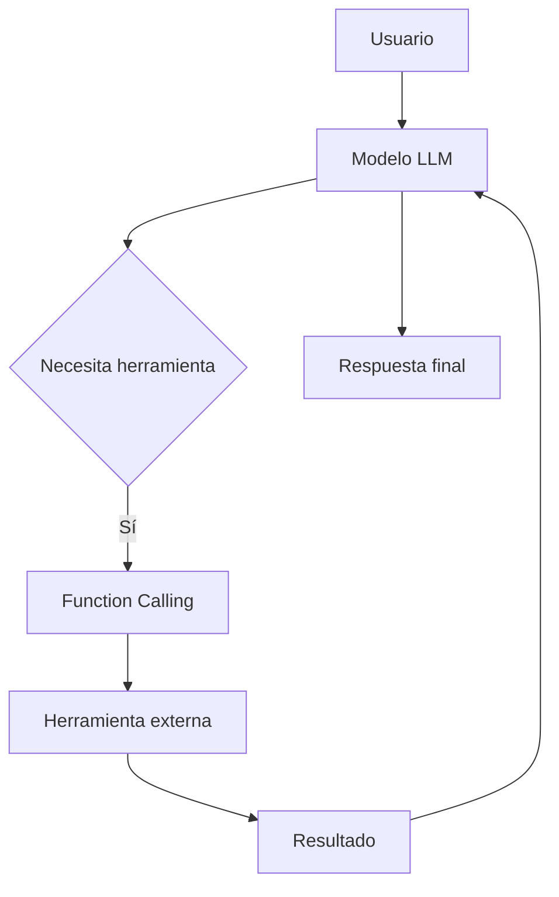
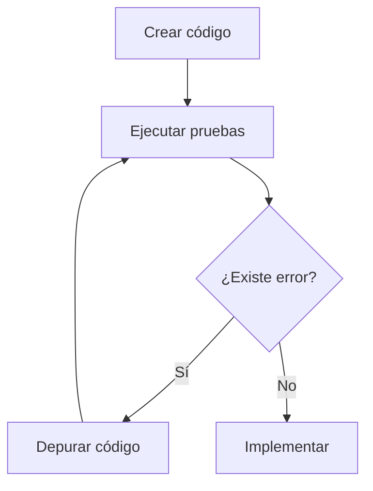
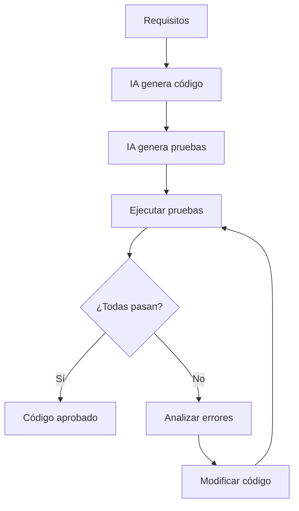
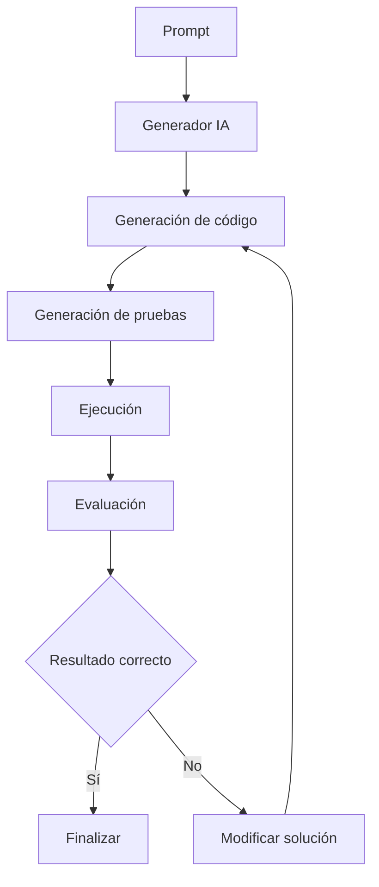
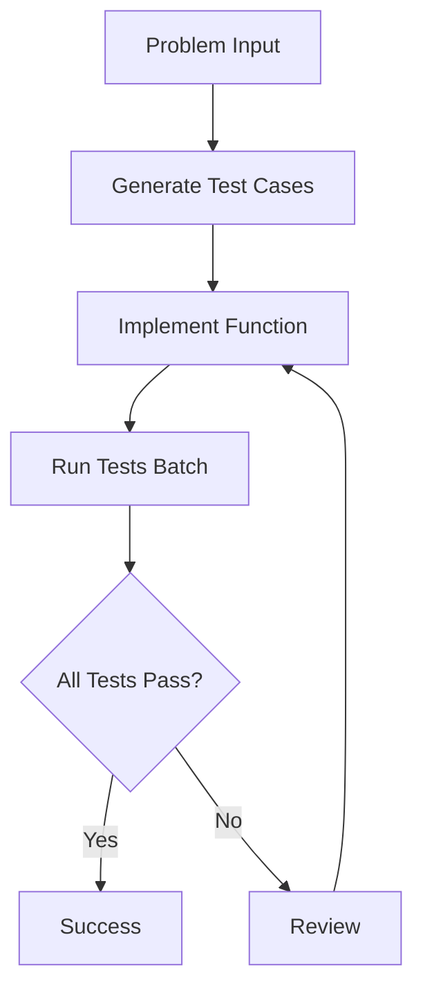
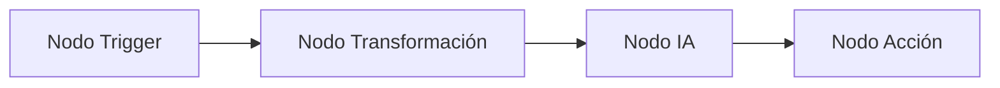

# Testeo Automatizado con Sugerencias de IA, PocketFlow y Automatización con n8n

# 1. Continuación de Function Calling aplicado al Desarrollo de Software

## Visión para Principiantes

Los modelos de inteligencia artificial no solamente pueden generar texto o código. Mediante **Function Calling**, una IA puede conectarse con herramientas externas para realizar tareas reales.

Ejemplo:

Un desarrollador puede crear una función:

```python
def ejecutar_pruebas(codigo):
    resultado = ejecutar_tests(codigo)
    return resultado
```

La IA puede decidir cuándo utilizar esa función para comprobar si el código funciona correctamente.

---

En desarrollo de software esto permite crear sistemas donde la IA puede:

* Generar código.
* Ejecutar pruebas.
* Detectar errores.
* Proponer soluciones.
* Repetir el proceso hasta obtener un resultado correcto.

---

# Profundidad Técnica

Function Calling transforma un LLM tradicional en un componente capaz de interactuar con sistemas externos.

Arquitectura:



El modelo no ejecuta directamente la función.

El flujo real es:

1. El usuario solicita una tarea.
2. El LLM identifica una acción necesaria.
3. Genera una llamada estructurada.
4. El sistema ejecuta la función.
5. El resultado vuelve al modelo.
6. La IA genera una respuesta final.

---

# 2. Herramientas utilizadas en Ecosistemas de IA y Testing

# 2.1 Pandas

## Visión para Principiantes

**Pandas** es una biblioteca de Python utilizada para trabajar con datos.

Permite:

* Leer información.
* Organizar tablas.
* Analizar datos.
* Preparar información para modelos de IA.

Ejemplo:

```python
import pandas as pd

datos = {
    "usuario": ["Ana", "Carlos"],
    "edad": [20, 25]
}

tabla = pd.DataFrame(datos)

print(tabla)
```

---

## Profundidad Técnica

Pandas pertenece al ecosistema de análisis de datos y ciencia de datos.

Sus estructuras principales son:

### Series

Representa una columna de datos.

### DataFrame

Representa una tabla completa.

Ejemplo:

```text
Usuario     Edad
Ana         20
Carlos      25
```

---

# 2.2 Mistral

## Visión para Principiantes

Mistral es una familia de modelos de inteligencia artificial especializada en procesamiento de lenguaje natural.

Puede utilizarse para:

* Generar texto.
* Analizar información.
* Generar código.
* Crear agentes inteligentes.

---

## Profundidad Técnica

Mistral proporciona modelos LLM que pueden integrarse mediante APIs o librerías oficiales.

En aplicaciones con agentes IA puede utilizarse como motor de razonamiento.

Arquitectura:


---

# 3. Testing Automatizado

## Visión para Principiantes

El **testing** es el proceso de comprobar que un programa funciona correctamente antes de entregarlo.

Una prueba verifica:

* Si una función funciona.
* Si los resultados son correctos.
* Si los cambios no rompieron funcionalidades anteriores.

Ejemplo:

Código:

```python
def sumar(a,b):
    return a+b
```

Prueba:

```python
assert sumar(2,3) == 5
```

---

# Profundidad Técnica

El testing automatizado consiste en crear conjuntos de pruebas ejecutables que validan el comportamiento esperado del software.

Proceso tradicional:



---

# 4. Aporte de la Inteligencia Artificial al Testing

La IA transforma el ciclo tradicional agregando automatización inteligente.

---

# 4.1 Cobertura de Pruebas Exhaustiva

## Concepto

La IA puede generar casos de prueba incluyendo:

* Casos normales.
* Casos extremos.
* Entradas inválidas.
* Situaciones poco comunes.

Ejemplo:

Función:

```python
def dividir(a,b):
    return a/b
```

La IA puede generar:

```python
dividir(10,2)

dividir(5,0)

dividir(-10,2)
```

---

# 4.2 Implementación alineada a requisitos

La IA puede analizar:

* Requerimientos.
* Documentación.
* Historias de usuario.

Y generar código siguiendo:

* Buenas prácticas.
* Estándares.
* Arquitectura definida.

---

# 4.3 Ejecución y análisis automatizado

La IA puede generar reportes:

Ejemplo:

```text
Pruebas ejecutadas: 150

Correctas: 148

Fallidas: 2

Estado: Requiere corrección
```

---

# 4.4 Depuración inteligente

La IA analiza si el problema está en:

* Código incorrecto.
* Prueba mal diseñada.
* Requisito ambiguo.

---

# 4.5 Iteración hasta corrección total

El proceso continúa hasta obtener:

```text
Todas las pruebas aprobadas
          |
          v
Código estable
```

---

# Ciclo de Desarrollo con IA



---

# 5. PocketFlow aplicado a Testing

## Visión para Principiantes

PocketFlow puede entenderse como un sistema que organiza tareas de inteligencia artificial en pasos ordenados.

Funciona como un coordinador.

Ejemplo:

```text
Generar prueba

↓

Crear código

↓

Ejecutar prueba

↓

Corregir errores
```

---

# Profundidad Técnica

PocketFlow actúa como una capa de coordinación para agentes de IA.

No reemplaza al modelo.

Organiza:

* Entradas.
* Procesos.
* Resultados.
* Validaciones.

Su objetivo es convertir procesos complejos en flujos controlados.

---

# Arquitectura conceptual PocketFlow



---

# Caso de Estudio: Generación Automática de Casos de Prueba

Flujo:



---

# Ejemplo de ciclo PocketFlow

Entrada:

```text
Crear función para validar correo electrónico.
```

La IA:

1. Analiza requisitos.
2. Genera casos de prueba.
3. Implementa función.
4. Ejecuta pruebas.
5. Corrige errores.
6. Repite hasta aprobar.

---

# 6. Introducción a n8n

## Visión para Principiantes

**n8n** es una plataforma de automatización visual que permite conectar diferentes aplicaciones mediante flujos de trabajo.

Permite crear automatizaciones sin programar todo desde cero.

Ejemplo:

```text
Nuevo correo

↓

Procesar información con IA

↓

Guardar resultado en base de datos

↓

Enviar respuesta
```

---

# Profundidad Técnica

n8n utiliza una arquitectura basada en nodos.

Cada nodo representa:

* Una acción.
* Una integración.
* Una transformación.

Un workflow es una secuencia organizada de nodos.

---

# Arquitectura n8n


---

# 7. Características principales de n8n

## Open Source

Significa que:

* El código está disponible.
* Puede modificarse.
* Puede instalarse localmente.

Ventajas:

* Control de datos.
* Personalización.
* Privacidad.

---

## Integración con IA

Permite incorporar:

* Agentes inteligentes.
* Modelos LLM.
* Herramientas externas.

---

# 8. Programación Visual con Nodos

## Visión para Principiantes

Los nodos funcionan como bloques conectados.

Ejemplo:

```text
[Recibir datos]

        ↓

[Procesar]

        ↓

[Enviar resultado]
```

---

## Profundidad Técnica

Aunque la interfaz es visual, los workflows representan lógica de programación.

Permiten:

* Condiciones.
* Variables.
* Transformaciones.
* Ejecución de código.

---

# 9. Instalación de n8n

# Opción 1: n8n Cloud

## Características

Servicio administrado.

Ventajas:

* Instalación inmediata.
* Sin configuración del servidor.
* Actualizaciones automáticas.

Ideal para:

* Usuarios principiantes.
* Prototipos rápidos.

---

# Opción 2: Self Hosted

## Visión para Principiantes

Consiste en instalar n8n en un servidor propio.

Permite mayor control.

---

## Profundidad Técnica

Ventajas:

* Control completo de datos.
* Personalización.
* Integración empresarial.

Puede ejecutarse mediante:

* Node.js.
* Docker.
* Servidores privados.

---

# 10. Instalación mediante Node.js

## Ejecutar sin instalación permanente

Requiere:

* Node.js 20.19+
* Node.js 24.x

Comando:

```bash
npx n8n
```

---

# Instalación global con npm

```bash
npm install -g n8n
```

Versión específica:

```bash
npm install -g n8n@0.126.1
```

---

# Versión experimental

```bash
npm install -g n8n@next
```

---

# Actualización

```bash
npm update -g n8n
```

o:

```bash
npm install -g n8n@next
```

---

# 11. Workflow Canvas de n8n

## Visión para Principiantes

El **Workflow Canvas** es el espacio visual donde se diseñan automatizaciones.

Permite:

* Crear nodos.
* Conectar procesos.
* Visualizar flujo.

---

# Profundidad Técnica

El Canvas representa gráficamente una arquitectura de ejecución.

Cada nodo contiene:

* Configuración.
* Entrada.
* Salida.
* Estado.

Ejemplo:



---

# Glosario

| Término              | Definición                                                             |
| -------------------- | ---------------------------------------------------------------------- |
| Testing              | Proceso de verificar que un software funciona correctamente.           |
| Prueba unitaria      | Prueba enfocada en una unidad pequeña de código.                       |
| Depuración           | Proceso de encontrar y corregir errores.                               |
| Cobertura de pruebas | Porcentaje del código validado mediante pruebas.                       |
| Pandas               | Biblioteca Python para análisis de datos.                              |
| Mistral              | Familia de modelos de lenguaje e infraestructura IA.                   |
| PocketFlow           | Framework para organizar flujos de trabajo con agentes IA.             |
| Workflow             | Secuencia organizada de tareas automatizadas.                          |
| Nodo                 | Elemento individual dentro de un flujo de automatización.              |
| n8n                  | Herramienta open-source de automatización mediante workflows visuales. |
| Self-hosted          | Software instalado y administrado por el propio usuario.               |
| Open Source          | Software cuyo código fuente puede ser revisado y modificado.           |
| Canvas               | Área visual donde se diseñan flujos.                                   |

---

# Conclusión

La integración entre inteligencia artificial, testing automatizado y herramientas de automatización representa una evolución importante en el desarrollo moderno de software.

La IA permite:

* Generar pruebas automáticamente.
* Detectar errores.
* Mejorar código.
* Automatizar ciclos completos.

Herramientas como PocketFlow permiten estructurar estos procesos mediante agentes inteligentes, mientras que n8n amplía estas capacidades conectando aplicaciones, servicios y modelos de IA mediante flujos visuales.

El resultado es un ecosistema donde la IA deja de ser únicamente un asistente de consulta y se convierte en un componente activo dentro del ciclo completo de desarrollo.
