# Entornos de Ejecución con Node.js

## Introducción

Un **entorno de ejecución** (*runtime environment*) es el conjunto de componentes de software, configuración y recursos necesarios para que un programa pueda ejecutarse correctamente.

Este entorno proporciona los mecanismos necesarios para:

* Ejecutar instrucciones.
* Administrar memoria y otros recursos.
* Interactuar con el sistema operativo.
* Gestionar entrada y salida de datos.
* Proporcionar APIs y servicios necesarios para la aplicación.
* Producir los resultados esperados por el sistema.

En términos generales:

```text
Código fuente
     ↓
Entorno de ejecución
     ↓
Motor de ejecución + APIs + recursos del sistema
     ↓
Programa ejecutándose
```

> [!IMPORTANT]
> Un **lenguaje de programación** y un **entorno de ejecución** no son exactamente lo mismo. JavaScript es un lenguaje; Node.js es un entorno de ejecución que permite ejecutar JavaScript fuera del navegador.

---

# 1. ¿Qué es Node.js?

**Node.js** es un entorno de ejecución de JavaScript construido sobre el motor **V8**. El proyecto oficial de Node.js lo define precisamente como un *JavaScript runtime built on the V8 JavaScript engine*. ([Node.js][1])

Su principal característica es permitir ejecutar JavaScript fuera del navegador, por ejemplo, en:

* Servidores.
* APIs REST.
* Aplicaciones de línea de comandos.
* Servicios backend.
* Herramientas de automatización.
* Aplicaciones de red.
* Microservicios.

Esto permite utilizar JavaScript tanto en el frontend como en diferentes componentes del backend.

```text
                    JAVASCRIPT
                        │
          ┌─────────────┴─────────────┐
          │                           │
       Navegador                  Node.js
          │                           │
          ↓                           ↓
        DOM                    APIs de Node.js
          │                           │
          ↓                           ↓
       Interfaz              Sistema / Red / Archivos
```

> [!NOTE]
> Node.js **no es un lenguaje de programación**. El lenguaje continúa siendo JavaScript; Node.js proporciona el entorno necesario para ejecutarlo fuera del navegador.

---

# 2. Entorno de ejecución

El concepto de **runtime** puede entenderse como la infraestructura que existe mientras un programa está siendo ejecutado.

En el caso de Node.js, esta infraestructura incluye, entre otros elementos:

* Motor V8 para ejecutar JavaScript.
* APIs propias de Node.js.
* Sistema de módulos.
* APIs para archivos.
* APIs de red.
* Gestión de procesos.
* Mecanismos para trabajar con operaciones asíncronas.
* Integración con el sistema operativo.

Una representación simplificada sería:

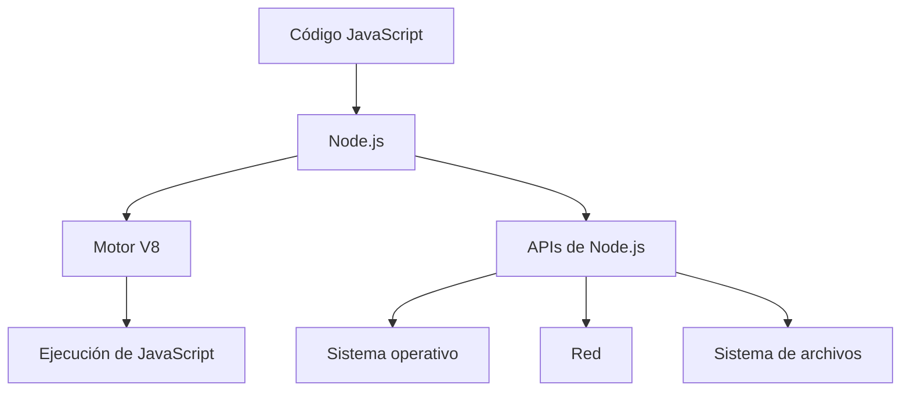

### ¿Por qué es importante?

Porque JavaScript por sí mismo no proporciona todas las capacidades necesarias para construir una aplicación backend.

Node.js añade el entorno y las APIs necesarias para interactuar con recursos externos.

Por ejemplo:

```javascript
import fs from "node:fs";

const contenido = fs.readFileSync("archivo.txt", "utf8");

console.log(contenido);
```

Aquí JavaScript proporciona la sintaxis del lenguaje, mientras que Node.js proporciona la API `fs` para trabajar con el sistema de archivos.

---

# 3. JavaScript, navegador y Node.js

Una distinción fundamental es que **JavaScript no siempre se ejecuta en el mismo entorno**.

El mismo lenguaje puede ejecutarse en diferentes runtimes.

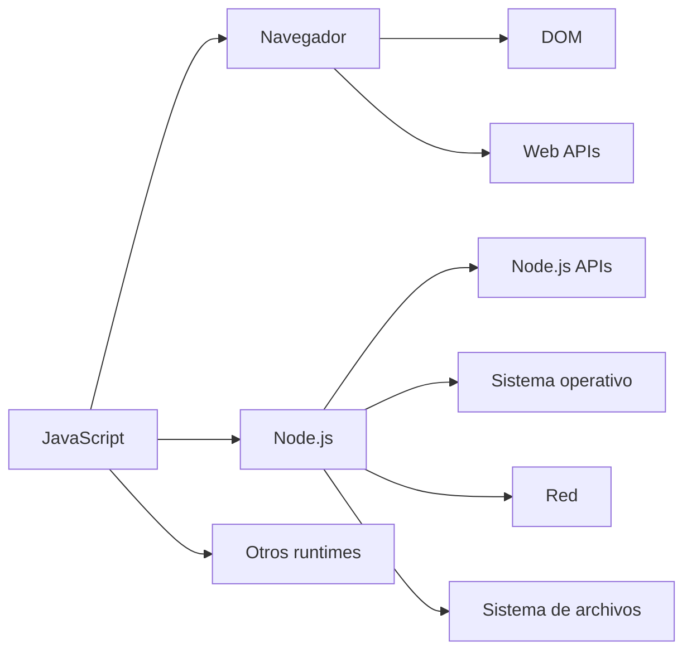

Esto explica por qué un código JavaScript que funciona en un navegador puede no funcionar directamente en Node.js.

Por ejemplo:

```javascript
document.querySelector("h1");
```

`document` pertenece al entorno web y al modelo DOM proporcionado por el navegador.

En Node.js, una aplicación no dispone automáticamente del DOM de una página HTML.

---

# 4. DOM — Document Object Model

## ¿Qué es el DOM?

**DOM** significa **Document Object Model** o **Modelo de Objetos del Documento**.

El DOM es una representación estructurada de un documento, normalmente HTML, mediante un **árbol de nodos** que puede ser manipulado mediante JavaScript. ([MDN Web Docs][2])

Por ejemplo, este HTML:

```html
<html>
    <body>
        <h1>Hola</h1>
        <p>Bienvenido</p>
    </body>
</html>
```

puede representarse conceptualmente mediante un árbol:

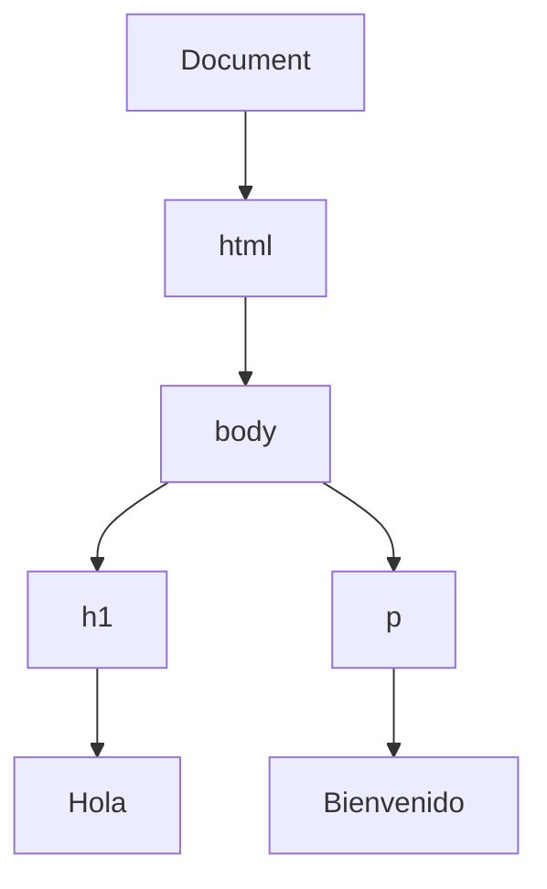

### Elementos del árbol

| Concepto   | Significado                             |
| ---------- | --------------------------------------- |
| `Document` | Representa el documento completo        |
| `html`     | Elemento raíz del documento HTML        |
| `body`     | Contiene el contenido visible principal |
| `h1`       | Elemento HTML de encabezado             |
| `p`        | Elemento HTML de párrafo                |
| Texto      | Nodo que contiene contenido textual     |

> [!IMPORTANT]
> Técnicamente, **no todos los nodos del DOM son elementos**. Existen nodos de elemento, texto, atributos y otros tipos. MDN distingue explícitamente entre `Node` y `Element`. ([MDN Web Docs][2])

---

## 4.1 Relación entre HTML, DOM y JavaScript

El navegador analiza el documento HTML y construye una representación DOM.

Posteriormente, JavaScript puede utilizar las APIs del DOM para consultar o modificar esa estructura. ([MDN Web Docs][2])

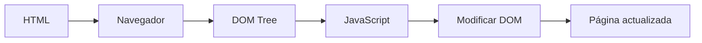

Por ejemplo:

```html
<h1 id="titulo">Hola</h1>
```

JavaScript puede acceder al elemento:

```javascript
const titulo = document.querySelector("#titulo");

titulo.textContent = "Hola desde JavaScript";
```

El DOM permite que JavaScript interactúe programáticamente con la estructura del documento.

---

## 4.2 DOM y Node.js

Una confusión frecuente es pensar que **Node.js contiene el DOM**.

No es así.

El DOM está asociado principalmente al entorno web proporcionado por navegadores. Node.js no proporciona automáticamente objetos como:

```javascript
document
window
HTMLElement
```

Por tanto:

```text
JavaScript
    │
    ├── Navegador
    │     └── DOM + Web APIs
    │
    └── Node.js
          └── Node.js APIs
```

> [!WARNING]
> **Node.js no es "el DOM de JavaScript".** Node.js es un runtime de JavaScript; el DOM es un modelo de representación de documentos proporcionado normalmente por el entorno web.

---

# 5. Arquitectura de Node.js

Una representación simplificada de Node.js es:

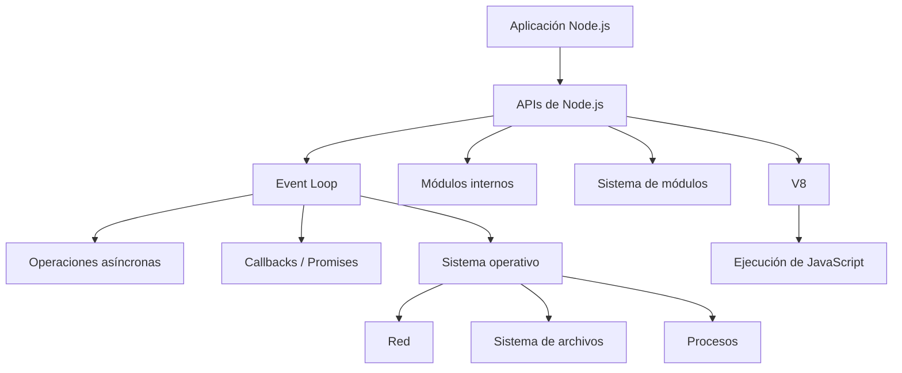

### Componentes importantes

| Componente            | Función                                                      |
| --------------------- | ------------------------------------------------------------ |
| **V8**                | Ejecuta código JavaScript                                    |
| **Node.js APIs**      | Proporcionan funcionalidades para interactuar con el sistema |
| **Event Loop**        | Coordina determinadas operaciones asíncronas                 |
| **Sistema operativo** | Proporciona recursos como red, archivos y procesos           |
| **Módulos**           | Permiten organizar y reutilizar código                       |

> [!NOTE]
> Este diagrama es una **simplificación conceptual**. La arquitectura interna de Node.js involucra componentes adicionales, como `libuv`, que participa en el modelo de I/O y en el event loop.

---

# 6. Motor JavaScript utilizado por Node.js

Las aplicaciones Node.js se ejecutan sobre el motor **V8**, desarrollado originalmente por Google para Chrome.

La documentación oficial de Node.js identifica explícitamente a V8 como el motor sobre el cual está construido Node.js. ([Node.js][1])

```text
Node.js
   │
   └── V8
        │
        └── Ejecuta JavaScript
```

Esto permite que Node.js ejecute código JavaScript sin necesitar una página web abierta en un navegador.

---

# 7. Programas escalables

## ¿Qué es un programa escalable?

Un **programa escalable** es aquel que puede aumentar su capacidad para atender más usuarios, solicitudes, datos o trabajo sin que sea necesario rediseñar completamente el sistema.

La escalabilidad puede abordarse de diferentes maneras.

### Escalabilidad vertical

Consiste en aumentar los recursos de una máquina:

```text
Servidor
   │
   ├── Más CPU
   ├── Más RAM
   └── Más almacenamiento
```

### Escalabilidad horizontal

Consiste en ejecutar múltiples instancias de una aplicación:

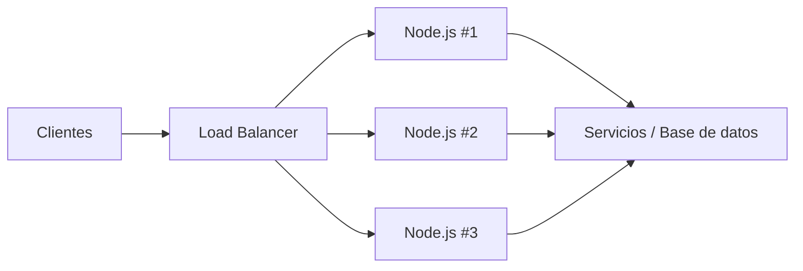

La escalabilidad horizontal permite distribuir las solicitudes entre varias instancias.

---

## 7.1 Desacoplamiento

Una arquitectura desacoplada intenta evitar que los componentes dependan excesivamente unos de otros.

Por ejemplo:

```text
           ┌─────────────────┐
           │ Lógica de       │
           │ negocio         │
           └────────┬────────┘
                    │
          ┌─────────┴─────────┐
          ↓                   ↓
     Base de datos          API
```

Arquitecturas como:

* **Clean Architecture**
* **Hexagonal Architecture**
* **Layered Architecture**

pueden utilizarse para separar responsabilidades.

> [!IMPORTANT]
> El desacoplamiento **no garantiza por sí solo la escalabilidad**. Una arquitectura limpia puede facilitar mantenimiento, pruebas y sustitución de componentes, mientras que la escalabilidad depende además de aspectos como capacidad computacional, almacenamiento, concurrencia, arquitectura de datos, caché y estrategia de despliegue.

---

## 7.2 Versatilidad de despliegue

Una aplicación Node.js puede desplegarse en diferentes entornos, por ejemplo:

```text
Node.js
   │
   ├── Servidor físico
   ├── Máquina virtual
   ├── Contenedor Docker
   ├── Cloud
   └── Plataforma administrada
```

Esto permite utilizar la misma aplicación en diferentes estrategias de infraestructura, siempre que se respeten sus requisitos de ejecución.

---

# 8. NVM — Node Version Manager

## ¿Qué es NVM?

**NVM (Node Version Manager)** es una herramienta utilizada para instalar y administrar múltiples versiones de Node.js dentro de un mismo sistema.

Permite:

* Instalar diferentes versiones de Node.js.
* Cambiar entre versiones.
* Consultar versiones instaladas.
* Consultar versiones disponibles.
* Definir una versión predeterminada.
* Crear alias para versiones.

El proyecto oficial `nvm-sh/nvm` proporciona estos mecanismos mediante comandos como `nvm install`, `nvm use`, `nvm ls`, `nvm ls-remote` y `nvm alias`. 

---

## 8.1 ¿Por qué utilizar NVM?

Supongamos que tenemos dos proyectos:

```text
Proyecto A → Node.js 20
Proyecto B → Node.js 22
```

Sin un gestor de versiones, cambiar entre ellas puede resultar incómodo.

Con NVM:

```bash
nvm use 20
```

o:

```bash
nvm use 22
```

La versión activa puede cambiarse desde la terminal.

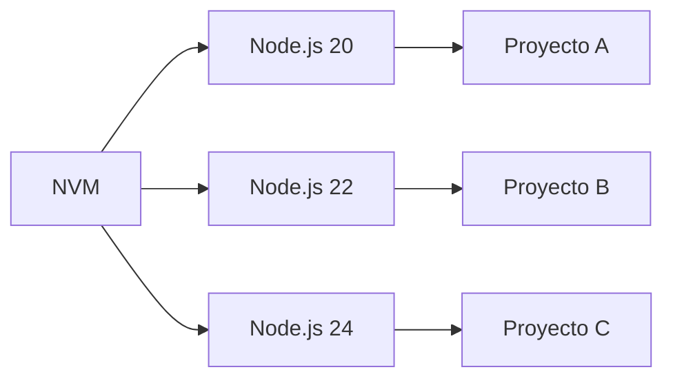

---

# 9. Instalación de NVM

El proyecto oficial de NVM proporciona un script de instalación para sistemas Unix-like.

Una forma habitual de instalarlo es:

```bash
curl -o- https://raw.githubusercontent.com/nvm-sh/nvm/master/install.sh | bash
```

Después de instalarlo, puede ser necesario cargar nuevamente la configuración del shell o abrir una nueva terminal.

> [!WARNING]
> La instalación mediante `curl | bash` ejecuta un script descargado de Internet. En entornos donde la seguridad sea una prioridad, conviene revisar el contenido del script y utilizar la documentación oficial antes de ejecutarlo.

NVM está orientado principalmente a sistemas Unix-like como Linux y macOS. Para Windows existe un proyecto diferente conocido como **nvm-windows**.

---

# 10. Comprobar Node.js y npm

Una vez instalado Node.js:

```bash
node --version
```

También puede utilizarse:

```bash
node -v
```

Para comprobar npm:

```bash
npm --version
```

o:

```bash
npm -v
```

Para comprobar que NVM está disponible:

```bash
command -v nvm
```

Ejemplo:

```text
$ node --version
v22.x.x

$ npm --version
xx.x.x

$ command -v nvm
nvm
```

---

# 11. Comandos principales de NVM

## Ver versiones instaladas

```bash
nvm ls
```

Muestra las versiones de Node.js instaladas mediante NVM.

---

## Ver versiones disponibles

```bash
nvm ls-remote
```

Consulta las versiones de Node.js disponibles para instalación. 

---

## Ver versiones LTS disponibles

```bash
nvm ls-remote --lts
```

El modificador `--lts` permite trabajar con las líneas de versiones identificadas como **LTS (Long-Term Support)**. ([GitHub][3])

---

## Instalar una versión específica

```bash
nvm install 22
```

También puede especificarse una versión concreta:

```bash
nvm install 22.20.0
```

La primera forma solicita una línea de versión compatible con `22`; la segunda fija una versión concreta.

---

## Cambiar de versión

```bash
nvm use 22
```

Después:

```bash
node --version
```

permite comprobar la versión activa.

---

## Ver la versión actualmente utilizada

```bash
nvm current
```

---

## Establecer una versión predeterminada

```bash
nvm alias default 22
```

Esto establece el alias `default` para esa línea de Node.js. NVM utiliza este alias para determinar qué versión debe activarse como predeterminada en nuevas sesiones. 

---

# 12. Referencia rápida de NVM

| Comando                            | Función                                     |
| ---------------------------------- | ------------------------------------------- |
| `nvm install <version>`            | Instala una versión                         |
| `nvm use <version>`                | Activa una versión                          |
| `nvm current`                      | Muestra la versión activa                   |
| `nvm ls`                           | Muestra versiones instaladas                |
| `nvm ls-remote`                    | Muestra versiones disponibles               |
| `nvm ls-remote --lts`              | Muestra versiones LTS disponibles           |
| `nvm alias <name> <version>`       | Crea un alias                               |
| `nvm use <alias>`                  | Utiliza un alias                            |
| `nvm alias default <version>`      | Define la versión predeterminada            |
| `nvm uninstall <version>`          | Desinstala una versión                      |
| `nvm reinstall-packages <version>` | Reinstala paquetes globales en otra versión |

---

# 13. NPM — Node Package Manager

## ¿Qué es npm?

**npm** es el sistema de gestión de paquetes asociado al ecosistema de Node.js.

npm está compuesto conceptualmente por tres partes:

1. **Website**
2. **CLI**
3. **Registry**

La documentación oficial de npm describe estos tres componentes y explica que la CLI es la principal interfaz utilizada desde la terminal. ([Documentación de npm][4])

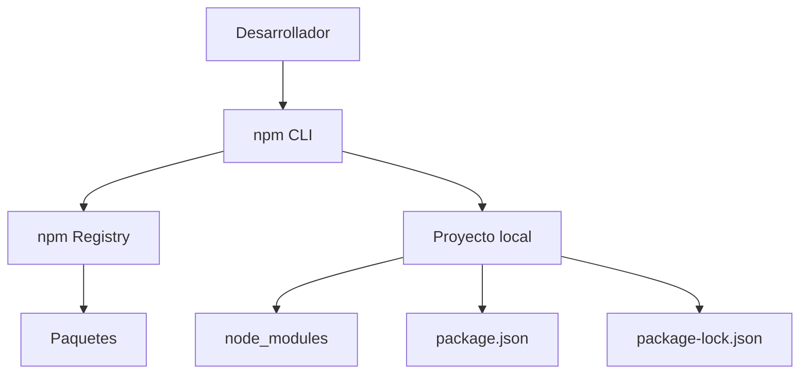

---

# 14. ¿Para qué sirve npm?

npm permite:

* Instalar paquetes.
* Actualizar dependencias.
* Eliminar paquetes.
* Ejecutar scripts.
* Administrar dependencias.
* Publicar paquetes.
* Consultar información de paquetes.
* Trabajar con diferentes versiones de dependencias.

Por ejemplo:

```bash
npm install express
```

Esto permite agregar `express` como dependencia del proyecto.

La dependencia queda registrada en `package.json` y npm puede instalarla dentro de `node_modules`.

---

# 15. Paquete, módulo y dependencia

Estos términos están relacionados, pero no son idénticos.

## Paquete

Un **package** es una unidad de software descrita mediante un `package.json`. La documentación de npm define un paquete como un archivo o directorio descrito por `package.json`. ([Documentación de npm][5])

Ejemplo:

```text
lodash
express
axios
```

---

## Módulo

Un **module** es una unidad de código que puede ser cargada mediante mecanismos como `import` o `require`.

npm señala que los módulos pueden encontrarse dentro de `node_modules`, aunque **no todos los módulos son necesariamente paquetes**. ([Documentación de npm][5])

---

## Dependencia

Una **dependencia** es un paquete del que nuestro proyecto depende para funcionar.

Por ejemplo:

```json
{
  "dependencies": {
    "lodash": "^4.18.1"
  }
}
```

Aquí el proyecto declara a `lodash` como dependencia.

---

# 16. NPM Registry

El **npm Registry** es el registro desde el cual npm obtiene información y paquetes.

El registro público predeterminado utilizado por npm es:

```text
https://registry.npmjs.org/
```

La documentación oficial indica que npm puede configurarse para utilizar otros registros compatibles, incluidos registros privados. ([Documentación de npm][6])

La página pública para buscar y consultar paquetes es:

```text
https://www.npmjs.com/
```

([Documentación de npm][6])

---

# 17. Marketplace de npm

El sitio de npm permite buscar paquetes y consultar información asociada.

Por ejemplo:

```text
https://www.npmjs.com/
```

Al consultar un paquete pueden encontrarse elementos como:

* Versión.
* Descripción.
* Dependencias.
* Historial de versiones.
* Descargas.
* Documentación.
* Repositorio.
* Información de publicación.

Esto permite evaluar un paquete antes de incorporarlo a un proyecto.

> [!IMPORTANT]
> La cantidad de descargas **no significa automáticamente que un paquete sea seguro, correcto o adecuado**. También deben revisarse mantenimiento, vulnerabilidades, licencia, dependencias, reputación y compatibilidad.

---

# 18. Arquitectura de npm y registros

Los apuntes originales presentan varios registros conectados mediante *uplinks*. Esa arquitectura corresponde principalmente a escenarios de **registros privados/proxy**, no a la arquitectura básica de npm.

Una representación más general es:

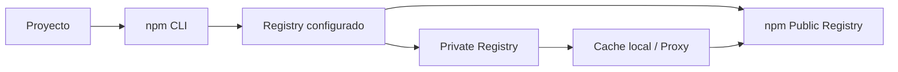

El registro configurado por npm puede cambiarse, y es posible utilizar un registro privado compatible. ([Documentación de npm][6])

---

## 18.1 Uplink

Un **uplink** es un mecanismo utilizado por determinados registros privados para obtener paquetes desde otro registro remoto.

Por ejemplo, un registro privado podría funcionar conceptualmente así:

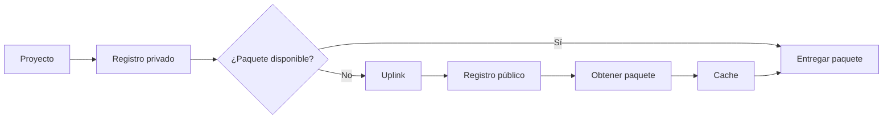

> [!NOTE]
> `uplink` no es una característica conceptual necesaria de npm como gestor de paquetes. Es un patrón de funcionamiento utilizado por determinados servidores de registro/proxy.

---

# 19. Verdaccio y registros privados

**Verdaccio** es una solución que puede utilizarse para crear un registro privado de paquetes npm.

Un entorno empresarial puede tener:

```text
                  ┌──────────────────────┐
                  │ Proyecto Node.js     │
                  └──────────┬───────────┘
                             │
                             ↓
                  ┌──────────────────────┐
                  │ Registro privado     │
                  │ Verdaccio            │
                  └──────────┬───────────┘
                             │
                         Uplink
                             │
                             ↓
                  ┌──────────────────────┐
                  │ npm Registry público │
                  └──────────────────────┘
```

Esto permite combinar:

* Paquetes internos.
* Paquetes públicos.
* Cache.
* Control de acceso.
* Registro privado.

---

# 20. Creación de un proyecto Node.js con npm

Para comenzar un proyecto Node.js puede crearse una carpeta:

```bash
mkdir primeraapp
cd primeraapp
```

Después se inicializa npm:

```bash
npm init -y
```

El comando `npm init` crea o inicializa un `package.json`; la opción `-y` permite omitir el cuestionario interactivo y aceptar los valores predeterminados. ([Documentación de npm][7])

---

# 21. Estructura inicial del proyecto

Después de ejecutar:

```bash
npm init -y
```

podemos tener:

```text
primeraapp/
├── package.json
└── index.js
```

Una estructura más completa después de instalar dependencias podría ser:

```text
primeraapp/
├── node_modules/
├── index.js
├── package.json
└── package-lock.json
```

### Función de cada elemento

| Archivo / directorio | Función                                                            |
| -------------------- | ------------------------------------------------------------------ |
| `index.js`           | Archivo JavaScript utilizado como punto de entrada en este ejemplo |
| `package.json`       | Metadatos, configuración, scripts y dependencias del proyecto      |
| `package-lock.json`  | Registra información concreta de las dependencias instaladas       |
| `node_modules/`      | Contiene los paquetes instalados localmente                        |

> [!NOTE]
> `index.js` no es obligatorio en todos los proyectos Node.js. Es simplemente una convención común y puede existir otro punto de entrada dependiendo de la configuración del proyecto.

---

# 22. `package.json`

`package.json` es uno de los archivos fundamentales del ecosistema npm.

Un ejemplo basado en los apuntes es:

```json
{
  "name": "primeraapp",
  "version": "0.0.1",
  "description": "Aplicación de ejemplo de uso de paquetes con npm",
  "keywords": [
    "NodeJS",
    "NPM"
  ],
  "license": "ISC",
  "author": "Velasco-c",
  "type": "module",
  "main": "index.js",
  "scripts": {
    "test": "echo \"Error: no test specified\" && exit 1"
  },
  "dependencies": {
    "lodash": "^4.18.1"
  }
}
```

---

# 23. Explicación de `package.json`

## `name`

```json
"name": "primeraapp"
```

Es el nombre del paquete/proyecto.

---

## `version`

```json
"version": "0.0.1"
```

Representa la versión del proyecto.

Normalmente se utiliza **Semantic Versioning (SemVer)**:

```text
MAJOR.MINOR.PATCH
```

Por ejemplo:

```text
1.4.2
```

---

## `description`

```json
"description": "Aplicación de ejemplo de uso de paquetes con npm"
```

Contiene una descripción breve del proyecto.

---

## `keywords`

```json
"keywords": [
  "NodeJS",
  "NPM"
]
```

Permite definir palabras clave asociadas al paquete, especialmente útil cuando el paquete se publica.

---

## `license`

```json
"license": "ISC"
```

Indica la licencia bajo la cual se distribuye el paquete.

---

## `author`

```json
"author": "Velasco-c"
```

Indica el autor del proyecto o paquete.

---

## `type`

```json
"type": "module"
```

Esta propiedad es especialmente importante en Node.js moderno.

Con:

```json
"type": "module"
```

los archivos `.js` del paquete se interpretan como **ECMAScript Modules (ESM)**.

Esto permite utilizar:

```javascript
import ...
export ...
```

Por ejemplo:

```javascript
import fs from "node:fs";
```

Sin esta configuración, el comportamiento de los archivos `.js` puede corresponder al sistema CommonJS, dependiendo de la extensión y configuración utilizada.

---

## `main`

```json
"main": "index.js"
```

Indica el punto de entrada tradicional de un paquete cuando este es consumido mediante mecanismos compatibles con ese campo.

> [!NOTE]
> En aplicaciones modernas, el punto de entrada de ejecución puede gestionarse de otras maneras y `main` no debe interpretarse como "el archivo obligatorio que Node.js siempre ejecutará".

---

## `scripts`

```json
"scripts": {
  "test": "echo \"Error: no test specified\" && exit 1"
}
```

Define comandos que pueden ejecutarse mediante npm.

Por ejemplo:

```bash
npm test
```

o:

```bash
npm run test
```

También pueden definirse scripts personalizados:

```json
{
  "scripts": {
    "start": "node index.js"
  }
}
```

Después:

```bash
npm start
```

---

# 24. Dependencias

La sección:

```json
"dependencies": {
  "lodash": "^4.18.1"
}
```

indica que el proyecto depende de `lodash`.

npm utiliza `package.json` para describir las dependencias del proyecto. La documentación oficial distingue, entre otras, las dependencias normales de las dependencias de desarrollo. ([Documentación de npm][8])

Una dependencia puede instalarse mediante:

```bash
npm install lodash
```

Esto normalmente produce:

```text
package.json
package-lock.json
node_modules/
```

---

# 25. Versionado de dependencias

La expresión:

```json
"lodash": "^4.18.1"
```

utiliza un rango de versiones compatible con las reglas de **SemVer**.

El símbolo:

```text
^
```

indica un rango de versiones compatible con la versión especificada, sujeto a las reglas de SemVer y a la resolución de dependencias de npm.

Por ejemplo:

```text
^4.18.1
```

no significa simplemente:

> "Instalar exactamente 4.18.1".

Significa que npm puede resolver una versión compatible dentro del rango permitido.

> [!IMPORTANT]
> La versión `4.18.1` mostrada en tus apuntes es actualmente una versión publicada de Lodash y aparece como `latest` en npm. Por tanto, no debe corregirse a `4.17.21` como se hacía en documentación antigua. ([npmjs.com][9])

---

# 26. Flujo básico de creación de un proyecto

El proceso completo puede resumirse así:

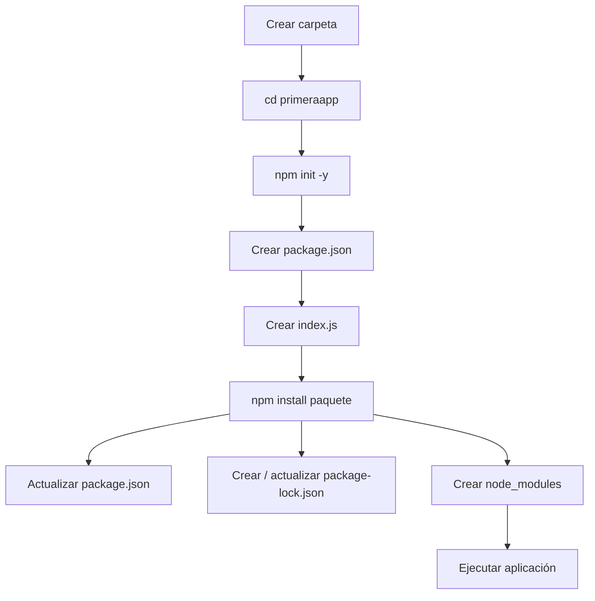

Ejemplo:

```bash
mkdir primeraapp
cd primeraapp

npm init -y

npm install lodash

node index.js
```

---

# 27. Relación entre Node.js, npm y el proyecto

Es importante no confundir las responsabilidades:

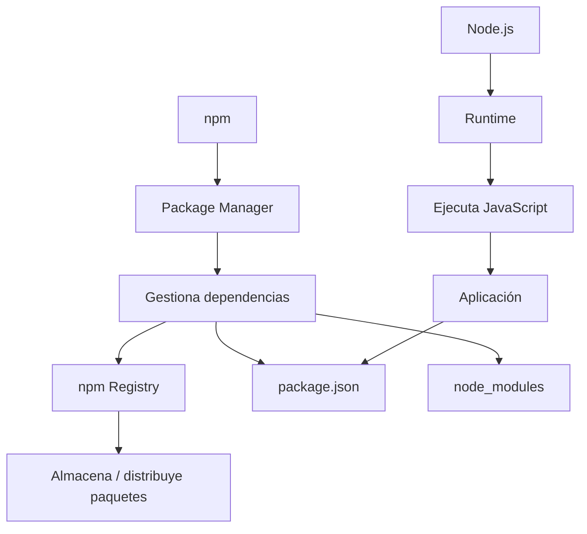

### En una frase

> **Node.js ejecuta JavaScript; npm administra paquetes y dependencias; el npm Registry distribuye paquetes.**

Esta distinción es fundamental.

---

# 28. Errores conceptuales corregidos de los apuntes

## 28.1 "DOM es la estructura de JavaScript"

Esta afirmación es incorrecta.

El DOM **no es la estructura interna de JavaScript**.

La relación correcta es:

```text
HTML
 ↓
DOM
 ↓
JavaScript puede manipularlo
```

El DOM representa documentos mediante una estructura de nodos y proporciona APIs para interactuar con ellos. ([MDN Web Docs][2])

---

## 28.2 "Node.js corre sobre JavaScript Engine"

La idea es correcta, pero puede expresarse con mayor precisión:

> **Node.js es un runtime de JavaScript construido sobre el motor V8.**

([Node.js][1])

---

## 28.3 "NPM es el entorno de ejecución"

No.

La separación correcta es:

```text
Node.js → Runtime
npm     → Package manager + CLI
Registry → Repositorio/registro de paquetes
```

npm complementa el ecosistema de Node.js, pero no es el runtime.

---

## 28.4 "Marketplace de npm"

Es comprensible utilizar informalmente "marketplace", pero técnicamente es mejor hablar de:

* **npm website**
* **npm Registry**
* **public npm registry**

La documentación oficial distingue entre el sitio web, la CLI y el registry. ([Documentación de npm][4])

---

## 28.5 "CPM"

En los apuntes aparece:

> Implementación de proyectos de Node.js con CPM

En este contexto, probablemente se quiso escribir **npm**, no `CPM`.

La forma correcta sería:

```text
Implementación de proyectos Node.js con npm
```

---

# 29. Errores comunes

## 29.1 Confundir Node.js con JavaScript

Incorrecto:

> Node.js es un lenguaje.

Correcto:

> Node.js es un entorno de ejecución para JavaScript.

---

## 29.2 Confundir Node.js con el navegador

Node.js y un navegador pueden ejecutar JavaScript, pero no proporcionan exactamente las mismas APIs.

```text
Navegador
├── JavaScript
├── DOM
├── window
└── Web APIs

Node.js
├── JavaScript
├── V8
├── Node.js APIs
├── fs
├── process
└── módulos
```

---

## 29.3 Pensar que `npm install` instala Node.js

No.

```bash
npm install express
```

instala un paquete para el proyecto.

Node.js debe estar instalado previamente.

---

## 29.4 Confundir npm con el Registry

Son componentes relacionados, pero diferentes:

```text
npm CLI
    ↓
consulta
    ↓
npm Registry
    ↓
obtiene paquete
    ↓
proyecto
```

---

## 29.5 Instalar paquetes globalmente sin necesidad

No todos los paquetes deben instalarse globalmente.

Para una dependencia de una aplicación normalmente se utiliza:

```bash
npm install paquete
```

Esto instala la dependencia localmente en el proyecto.

---

# 30. Buenas prácticas

## Utilizar una versión de Node.js apropiada

Para proyectos reales, evita seleccionar versiones arbitrariamente.

Utiliza una línea de Node.js compatible con:

* El proyecto.
* Sus dependencias.
* El framework utilizado.
* El entorno de despliegue.

NVM facilita mantener varias versiones.

---

## Mantener las dependencias declaradas

Las dependencias deben estar correctamente registradas en:

```text
package.json
```

y su resolución concreta queda reflejada en:

```text
package-lock.json
```

---

## No subir `node_modules`

Normalmente no se versiona:

```text
node_modules/
```

en Git.

En su lugar se conserva:

```text
package.json
package-lock.json
```

para que otro desarrollador pueda ejecutar:

```bash
npm install
```

y reconstruir las dependencias.

---

## Utilizar `npm ci` en determinados entornos automatizados

En entornos de integración continua, cuando existe un `package-lock.json` adecuado, `npm ci` está diseñado para realizar instalaciones reproducibles basadas en el lockfile.

```bash
npm ci
```

Esto es especialmente útil en:

* CI/CD.
* Pipelines.
* Builds automatizados.
* Entornos de despliegue.

---

# 31. Ejemplo completo

Una aplicación mínima podría tener:

```text
primeraapp/
├── index.js
├── package.json
├── package-lock.json
└── node_modules/
```

### `package.json`

```json
{
  "name": "primeraapp",
  "version": "0.0.1",
  "description": "Aplicación de ejemplo de Node.js y npm",
  "type": "module",
  "main": "index.js",
  "scripts": {
    "start": "node index.js"
  },
  "dependencies": {
    "lodash": "^4.18.1"
  }
}
```

### `index.js`

```javascript
import _ from "lodash";

const numeros = [1, 2, 3, 4, 5];

const resultado = _.reverse([...numeros]);

console.log(resultado);
```

### Ejecutar

```bash
npm start
```

El flujo sería:

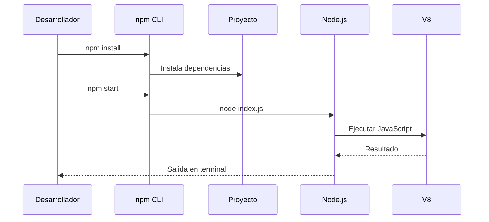

---

# Glosario

| Término                      | Definición                                                                                                            |
| ---------------------------- | --------------------------------------------------------------------------------------------------------------------- |
| **Runtime**                  | Entorno que proporciona los componentes necesarios para ejecutar un programa.                                         |
| **Node.js**                  | Entorno de ejecución de JavaScript construido sobre V8.                                                               |
| **V8**                       | Motor JavaScript utilizado por Node.js para ejecutar código JavaScript.                                               |
| **JavaScript**               | Lenguaje de programación utilizado tanto en navegadores como en runtimes como Node.js.                                |
| **DOM**                      | Modelo que representa estructuralmente un documento mediante un árbol de nodos.                                       |
| **Node**                     | Unidad de información dentro de un árbol DOM.                                                                         |
| **Element**                  | Tipo de nodo que representa un elemento del documento, como `div`, `p` o `h1`.                                        |
| **NVM**                      | Node Version Manager; herramienta para instalar y administrar versiones de Node.js.                                   |
| **npm**                      | Gestor de paquetes y CLI del ecosistema Node.js.                                                                      |
| **Package**                  | Unidad de software descrita mediante un `package.json`.                                                               |
| **Module**                   | Unidad de código que puede cargarse mediante mecanismos como `import` o `require`.                                    |
| **Dependency**               | Paquete que un proyecto necesita para funcionar.                                                                      |
| **Registry**                 | Servicio que almacena y distribuye paquetes.                                                                          |
| **npm Registry**             | Registro utilizado para almacenar y distribuir paquetes npm.                                                          |
| **`package.json`**           | Archivo que contiene metadatos, configuración, scripts y dependencias de un proyecto o paquete.                       |
| **`package-lock.json`**      | Archivo que registra información detallada de las dependencias resueltas e instaladas.                                |
| **`node_modules`**           | Directorio donde npm instala las dependencias locales de un proyecto.                                                 |
| **ESM**                      | Sistema de módulos de ECMAScript utilizado mediante `import` y `export`.                                              |
| **CommonJS**                 | Sistema de módulos tradicional ampliamente utilizado en Node.js mediante `require()` y `module.exports`.              |
| **Semantic Versioning**      | Convención de versionado basada en `MAJOR.MINOR.PATCH`.                                                               |
| **LTS**                      | Long-Term Support; línea de versión que recibe soporte durante un periodo prolongado.                                 |
| **Uplink**                   | Conexión mediante la cual un registro privado/proxy puede obtener paquetes desde otro registro remoto.                |
| **Load Balancer**            | Componente que distribuye solicitudes entre múltiples instancias de una aplicación.                                   |
| **Escalabilidad horizontal** | Capacidad de aumentar la capacidad agregando múltiples instancias del sistema.                                        |
| **Escalabilidad vertical**   | Capacidad de aumentar recursos de una instancia existente, como CPU o RAM.                                            |
| **Desacoplamiento**          | Diseño en el que los componentes tienen una dependencia reducida entre sí.                                            |
| **Clean Architecture**       | Enfoque arquitectónico que busca separar la lógica de negocio de detalles externos como frameworks e infraestructura. |
| **Hexagonal Architecture**   | Arquitectura basada en puertos y adaptadores que busca aislar la lógica central de las dependencias externas.         |

# Resumen

* **Node.js es un entorno de ejecución de JavaScript**, no un lenguaje de programación.
* Node.js está construido sobre el motor **V8**. ([Node.js][1])
* Un **runtime** proporciona los componentes necesarios para ejecutar un programa.
* JavaScript puede ejecutarse en distintos entornos, como navegadores y Node.js.
* El **DOM** representa documentos HTML como un árbol de nodos y permite manipularlos mediante APIs. ([MDN Web Docs][2])
* El DOM pertenece principalmente al entorno web y **no forma parte del runtime de Node.js por defecto**.
* **NVM** permite instalar y cambiar entre múltiples versiones de Node.js. 
* `nvm install` instala versiones de Node.js.
* `nvm use` cambia la versión activa.
* `nvm ls` muestra las versiones instaladas.
* `nvm ls-remote` muestra las versiones disponibles.
* `nvm alias default` permite definir una versión predeterminada.
* **npm** es el gestor de paquetes y CLI del ecosistema Node.js.
* npm está compuesto conceptualmente por **website, CLI y registry**. ([Documentación de npm][4])
* El **npm Registry** almacena y distribuye paquetes JavaScript. ([Documentación de npm][10])
* `npm init -y` permite inicializar rápidamente un proyecto y crear `package.json`. ([Documentación de npm][7])
* `package.json` describe información importante del proyecto, incluyendo dependencias y scripts.
* `dependencies` declara paquetes necesarios para la aplicación.
* `node_modules` contiene las dependencias instaladas localmente.
* `package-lock.json` ayuda a registrar las versiones concretas resueltas durante la instalación.
* Un **package**, un **module** y una **dependency** son conceptos relacionados, pero no equivalentes.
* Un registro privado puede utilizar mecanismos como **uplinks** y caché para obtener paquetes desde otros registros.
* La escalabilidad horizontal permite ejecutar múltiples instancias de una aplicación y distribuir el tráfico mediante un balanceador.
* El desacoplamiento facilita el mantenimiento y la sustitución de componentes, pero **no garantiza por sí solo la escalabilidad**.
* La distinción fundamental que debe recordarse es:

```text
JavaScript → Lenguaje
Node.js    → Runtime
V8         → Motor JavaScript
npm        → Package manager / CLI
Registry   → Registro de paquetes
DOM        → Modelo de documentos del entorno web
```