# Introducción a la Programación Orientada a Objetos (POO) en JavaScript

## Introducción

La **Programación Orientada a Objetos (POO)** es un paradigma de programación que permite organizar un sistema alrededor de **objetos**, agrupando datos y comportamientos relacionados.

En lugar de mantener una gran cantidad de variables y funciones independientes, la POO permite modelar entidades del problema mediante objetos que poseen:

* **Propiedades:** representan datos o estado.
* **Métodos:** representan comportamientos.
* **Encapsulamiento:** controla el acceso al estado interno.
* **Abstracción:** oculta detalles innecesarios.
* **Herencia:** permite reutilizar y especializar comportamientos.
* **Polimorfismo:** permite que una misma interfaz pueda tener diferentes implementaciones.

JavaScript es un lenguaje **orientado a objetos y basado en prototipos**. Por tanto, la afirmación de que "JavaScript no es orientado a objetos" es incorrecta. JavaScript soporta múltiples paradigmas, entre ellos el orientado a objetos, pero su modelo fundamental de objetos se basa en **prototipos**, no en un modelo clásico basado exclusivamente en clases.

---

> [!IMPORTANT]
> **Corrección técnica de los apuntes**
>
> No es correcto decir:
>
> > "JavaScript no es orientado a objetos."
>
> Una formulación técnicamente correcta es:
>
> > **JavaScript es un lenguaje orientado a objetos cuyo modelo de objetos está basado en prototipos.**
>
> Desde ECMAScript 2015 (ES6), JavaScript dispone además de una sintaxis `class`, pero las clases son una abstracción construida sobre el mecanismo de prototipos existente. ([MDN Web Docs][2])

---

# 1. ¿Qué es la Programación Orientada a Objetos?

La **Programación Orientada a Objetos (POO)** es un paradigma que organiza el software alrededor de objetos que combinan:

```text
                    OBJETO
                      │
             ┌────────┴────────┐
             ↓                 ↓
        PROPIEDADES          MÉTODOS
             │                 │
             ↓                 ↓
           Datos           Comportamiento
```

Por ejemplo, si estamos desarrollando un sistema para una tienda, podemos representar un producto como:

```javascript
const producto = {
    nombre: "Laptop",
    precio: 5000,
    stock: 10,

    vender() {
        this.stock--;
    }
};
```

El objeto contiene tanto **información** como **comportamiento relacionado con esa información**.

---

# 2. ¿Por qué utilizar POO?

Uno de los problemas que aparece al desarrollar aplicaciones grandes es la acumulación de variables y funciones independientes.

Por ejemplo:

```javascript
let nombreUsuario = "Carlos";
let emailUsuario = "carlos@example.com";
let passwordUsuario = "123456";

function validarPassword() {
    // ...
}

function cambiarEmail() {
    // ...
}
```

A medida que aumenta la aplicación, pueden aparecer:

```text
Variables
Funciones
Validaciones
Reglas de negocio
Estados
Dependencias
```

sin una estructura clara que indique qué elementos pertenecen entre sí.

La POO permite agrupar esos elementos:

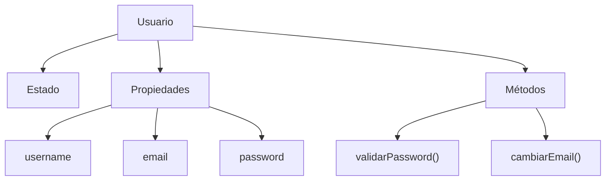

De esta manera, la estructura del programa puede representar mejor las entidades y responsabilidades del dominio.

---

# 3. Conceptos fundamentales

La POO suele explicarse mediante varios conceptos fundamentales:

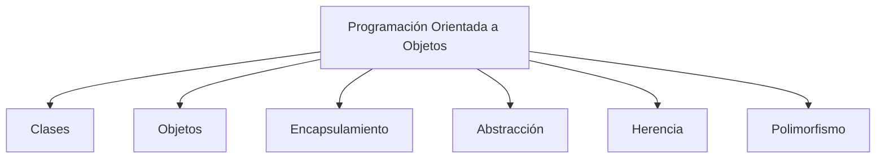

Los apuntes se concentran principalmente en:

* Clases.
* Objetos.
* Propiedades.
* Métodos.
* Constructores.
* Instanciación.
* Encapsulamiento.
* Getters y setters.
* Abstracción.

La **herencia y el polimorfismo** forman parte importante de la POO, aunque todavía no se desarrollan mediante ejemplos completos en estos apuntes.

---

# 4. Clases y objetos

## 4.1 ¿Qué es una clase?

Una **clase** es una estructura utilizada para definir las características y comportamientos que tendrán determinadas instancias.

Conceptualmente puede entenderse como una plantilla:

```text
                    CLASE
                     │
          ┌──────────┴──────────┐
          ↓                     ↓
     Propiedades              Métodos
          │                     │
          ↓                     ↓
       Estado              Comportamiento
```

Por ejemplo:

```javascript
class Animal {
    tipo;
    edad;

    mover() {
        console.log("El animal se está moviendo.");
    }

    comer() {
        console.log("El animal está comiendo.");
    }
}
```

La clase describe qué características y comportamientos pueden tener los objetos creados a partir de ella.

---

## 4.2 ¿Qué es un objeto?

Un **objeto** es una entidad concreta que contiene propiedades y comportamientos.

Por ejemplo:

```javascript
const gato = new Animal();
const perro = new Animal();
```

Aquí:

```text
Animal → clase
gato   → objeto / instancia
perro  → objeto / instancia
```

Cada instancia puede tener su propio estado.

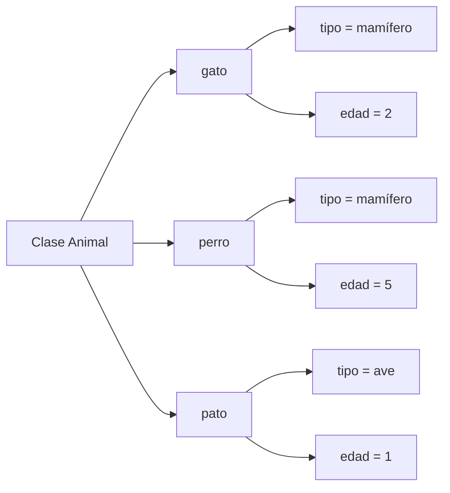

---

# 5. Clase vs. objeto

| Concepto      | Descripción                         | Ejemplo        |
| ------------- | ----------------------------------- | -------------- |
| **Clase**     | Define una estructura general       | `Animal`       |
| **Objeto**    | Instancia concreta de una clase     | `gato`         |
| **Propiedad** | Representa datos o estado           | `edad`         |
| **Método**    | Representa comportamiento           | `mover()`      |
| **Instancia** | Objeto creado a partir de una clase | `new Animal()` |

Una forma sencilla de recordarlo:

> **La clase define; el objeto representa una instancia concreta.**

---

# 6. Clases en JavaScript

JavaScript incorporó la sintaxis `class` con **ECMAScript 2015 (ES6)**.

Por ejemplo:

```javascript
class Animal {
    tipo;
    edad;

    mover() {
        console.log("El animal se está moviendo.");
    }
}
```

Sin embargo, es importante comprender qué ocurre internamente.

Las clases de JavaScript **no reemplazaron el modelo de prototipos**. La sintaxis `class` proporciona una forma más conveniente de trabajar con estructuras orientadas a objetos, pero continúa utilizando prototipos internamente. ([MDN Web Docs][2])

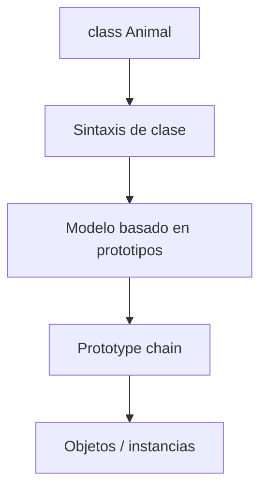

> [!IMPORTANT]
> Por eso es importante diferenciar:
>
> **POO en JavaScript ≠ POO clásica basada exclusivamente en clases.**
>
> JavaScript proporciona `class`, pero su mecanismo fundamental de herencia sigue siendo la cadena de prototipos. ([MDN Web Docs][3])

---

# 7. Prototipos en JavaScript

Cada objeto de JavaScript puede tener un vínculo interno con otro objeto denominado **prototype**.

Cuando JavaScript busca una propiedad o método, puede buscarlo primero en el objeto y después continuar por su cadena de prototipos. ([MDN Web Docs][3])

Conceptualmente:

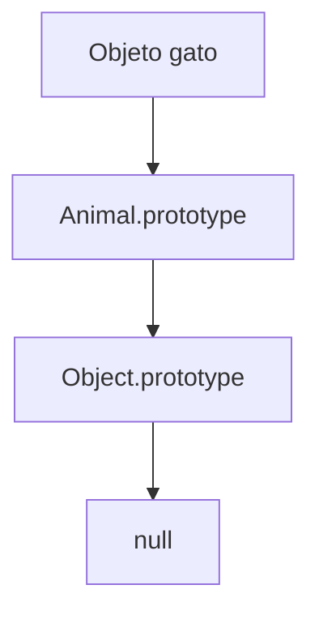

Por ejemplo:

```javascript
class Animal {
    mover() {
        console.log("Moviéndose");
    }
}

const gato = new Animal();

gato.mover();
```

El método `mover()` está asociado al prototipo de la clase y puede ser utilizado por las instancias.

> [!NOTE]
> No es necesario dominar todavía toda la mecánica interna de `prototype` para comenzar con `class`, pero entenderla será importante cuando se estudie herencia, cadena de prototipos y funcionamiento interno de JavaScript.

---

# 8. Sintaxis de una clase

La sintaxis básica es:

```javascript
class NombreClase {
    // propiedades

    // constructor

    // métodos
}
```

Por ejemplo:

```javascript
class Animal {
    nombre;
    tipo;

    hablar() {
        return "El animal está hablando.";
    }
}
```

Por convención, los nombres de clases utilizan **PascalCase**:

```javascript
class Animal {}
class Usuario {}
class Vehiculo {}
class Calculadora {}
```

Mientras que variables, propiedades y métodos normalmente utilizan **camelCase**:

```javascript
const miUsuario = new Usuario();

miUsuario.nombreUsuario;
miUsuario.validarPassword();
```

---

# 9. Propiedades y métodos

Los miembros de una clase pueden incluir datos y comportamientos.

## Propiedades

Las propiedades representan datos o estado.

```javascript
class Animal {
    nombre = "Garfield";
    tipo = "gato";
}
```

En este caso:

```text
nombre → propiedad
tipo   → propiedad
```

Las propiedades de instancia públicas existen en cada objeto creado a partir de la clase. ([MDN Web Docs][4])

---

## Métodos

Un método es una función asociada a un objeto.

```javascript
class Animal {
    hablar() {
        return "¡Quiero lasaña!";
    }
}
```

Aquí:

```text
hablar() → método
```

Los métodos representan comportamientos.

---

# 10. Propiedades públicas

Una propiedad pública puede ser accedida desde fuera de la clase.

```javascript
class Animal {
    tipo = "mamífero";
}

const gato = new Animal();

console.log(gato.tipo);
```

Resultado:

```text
mamífero
```

También puede modificarse:

```javascript
gato.tipo = "felino";
```

---

# 11. Propiedades privadas

JavaScript permite declarar miembros privados utilizando `#`.

```javascript
class Usuario {
    #password;

    constructor(password) {
        this.#password = password;
    }
}
```

El campo:

```javascript
#password
```

solo puede utilizarse desde el cuerpo de la clase que lo declara. El lenguaje impide acceder directamente a él desde fuera. ([MDN Web Docs][5])

Por ejemplo:

```javascript
const usuario = new Usuario("123456");
```

Esto es válido:

```javascript
class Usuario {
    #password;

    mostrarPassword() {
        return this.#password;
    }
}
```

Pero esto no:

```javascript
usuario.#password;
```

Producirá un error de sintaxis.

---

> [!WARNING]
> Utilizar `_password` **no convierte una propiedad en privada**:
>
> ```javascript
> this._password = "123456";
> ```
>
> El guion bajo `_` es solamente una convención utilizada históricamente para indicar que una propiedad debería tratarse como interna.
>
> La privacidad real proporcionada por JavaScript utiliza `#`. ([MDN Web Docs][5])

---

# 12. Métodos públicos y privados

De la misma manera que existen campos privados, JavaScript permite declarar **métodos privados**:

```javascript
class Usuario {
    #validarPassword() {
        console.log("Validando...");
    }

    iniciarSesion() {
        this.#validarPassword();
    }
}
```

Desde fuera de la clase:

```javascript
usuario.iniciarSesion();
```

es válido.

Pero:

```javascript
usuario.#validarPassword();
```

no es válido.

Los métodos privados forman parte de los elementos privados del lenguaje y utilizan el prefijo `#`. ([MDN Web Docs][5])

---

# 13. Constructor de una clase

El **constructor** es un método especial que se ejecuta cuando se crea una instancia mediante `new`.

Su función principal es inicializar el estado inicial del objeto.

```javascript
class Usuario {
    constructor(nombre, email) {
        this.nombre = nombre;
        this.email = email;
    }
}
```

Al crear el objeto:

```javascript
const usuario = new Usuario(
    "Carlos",
    "carlos@example.com"
);
```

JavaScript ejecuta el constructor y asigna:

```text
nombre → Carlos
email  → carlos@example.com
```

---

# 14. Constructor sin parámetros

Un constructor puede no recibir parámetros:

```javascript
class Ejemplo {
    constructor() {
        this.numero = 0;
        this.cadena = "Mi cadena";
    }
}
```

Al crear:

```javascript
const ejemplo = new Ejemplo();
```

se obtiene un objeto inicializado con esos valores.

---

## 14.1 Constructor predeterminado

Si una clase base no declara un constructor, JavaScript proporciona un constructor predeterminado implícito. En términos prácticos, permite crear una instancia sin realizar una inicialización personalizada. ([MDN Web Docs][6])

Por ejemplo:

```javascript
class Animal {}
```

permite:

```javascript
const gato = new Animal();
```

No es necesario escribir explícitamente:

```javascript
constructor() {}
```

si no necesitamos realizar ninguna inicialización.

---

# 15. Constructor parametrizado

Un constructor puede recibir argumentos:

```javascript
class Ejemplo {
    constructor(numero, cadena) {
        this.numero = numero;
        this.cadena = cadena;
    }
}
```

Después:

```javascript
const ejemplo = new Ejemplo(
    10,
    "Hola"
);
```

Cada instancia puede recibir valores diferentes:

```javascript
const ejemplo1 = new Ejemplo(10, "Hola");
const ejemplo2 = new Ejemplo(20, "Mundo");
```

Conceptualmente:

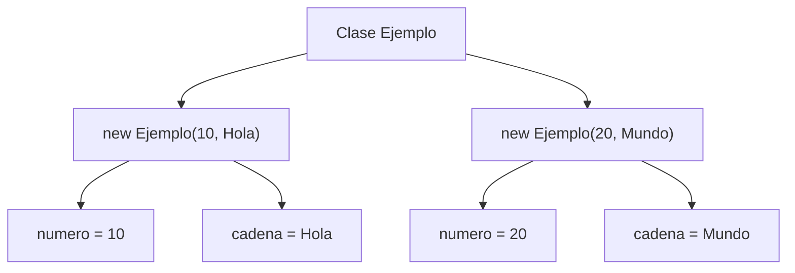

---

# 16. Creación de una instancia

Crear un objeto a partir de una clase se denomina **instanciación**.

Se utiliza la palabra clave:

```javascript
new
```

Ejemplo:

```javascript
class Animal {}

const pato = new Animal();
```

Aquí:

```text
Animal → clase
new    → crea una instancia
pato   → referencia al objeto creado
```

Cuando el constructor recibe parámetros:

```javascript
class Animal {
    constructor(tipo, edad) {
        this.tipo = tipo;
        this.edad = edad;
    }
}

const gato = new Animal("mamífero", 2);
```

---

# 17. Getters y setters

Los **getters** y **setters** permiten definir cómo se consulta o modifica una propiedad mediante una interfaz controlada.

Se utilizan las palabras clave:

```javascript
get
set
```

---

## 17.1 Getter

Un getter permite controlar la lectura de un valor:

```javascript
class Usuario {
    #nombre;

    get nombre() {
        return this.#nombre;
    }
}
```

Se utiliza como una propiedad:

```javascript
console.log(usuario.nombre);
```

No se llama como un método:

```javascript
usuario.nombre();
```

---

## 17.2 Setter

Un setter permite controlar la asignación de un valor:

```javascript
class Usuario {
    #nombre;

    set nombre(nuevoNombre) {
        if (
            typeof nuevoNombre === "string" &&
            nuevoNombre.length >= 3
        ) {
            this.#nombre = nuevoNombre;
        }
    }
}
```

Se utiliza:

```javascript
usuario.nombre = "Carlos";
```

No:

```javascript
usuario.nombre("Carlos");
```

---

# 18. Getters y setters como interfaz controlada

Una combinación común es:

```javascript
class Usuario {
    #nombre;

    set nombre(valor) {
        if (
            typeof valor === "string" &&
            valor.length >= 3
        ) {
            this.#nombre = valor;
        }
    }

    get nombre() {
        return this.#nombre;
    }
}
```

El flujo es:

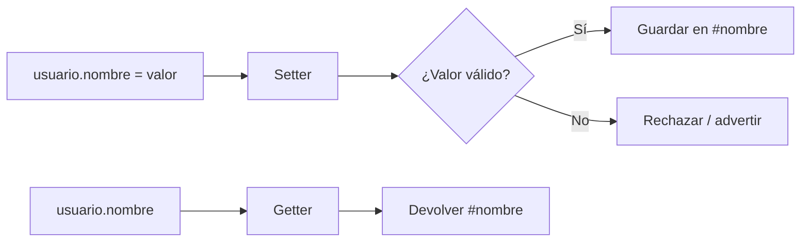

Esto permite separar:

```text
Interfaz pública
       ↓
Validación
       ↓
Estado interno privado
```

---

# 19. Encapsulamiento

El **encapsulamiento** consiste en controlar el acceso al estado y comportamiento interno de un objeto, exponiendo una interfaz pública y ocultando detalles que no deberían manipularse directamente.

En JavaScript puede implementarse mediante elementos privados `#`, métodos públicos y getters/setters. ([MDN Web Docs][7])

Por ejemplo:

```javascript
class Usuario {
    #password;

    constructor(password) {
        this.#password = password;
    }

    validarPassword(intento) {
        return this.#password === intento;
    }
}
```

Desde fuera:

```javascript
const usuario = new Usuario("123456");

usuario.validarPassword("123456");
```

Pero no:

```javascript
usuario.#password;
```

El usuario del objeto no necesita conocer cómo se almacena internamente la contraseña para utilizar el método público.

---

# 20. Abstracción

La **abstracción** consiste en exponer lo necesario para utilizar un objeto mientras se ocultan detalles internos de implementación.

Por ejemplo:

```javascript
carro.acelerar();
```

El consumidor del objeto no necesita conocer necesariamente:

* Cómo se almacena la velocidad.
* Cómo se verifica el estado.
* Cómo se actualiza internamente.
* Qué variables privadas participan.

Solo necesita conocer la interfaz:

```text
acelerar()
frenar()
encender()
apagar()
```

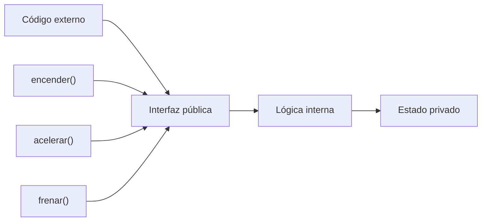

> [!IMPORTANT]
> **Encapsulamiento y abstracción están relacionados, pero no son sinónimos.**
>
> * **Encapsulamiento:** controla y protege el acceso al estado/comportamiento interno.
> * **Abstracción:** muestra una interfaz relevante y oculta detalles innecesarios.

---

# 21. Los cuatro pilares de la POO

Tradicionalmente se enseñan cuatro conceptos como pilares de la POO:

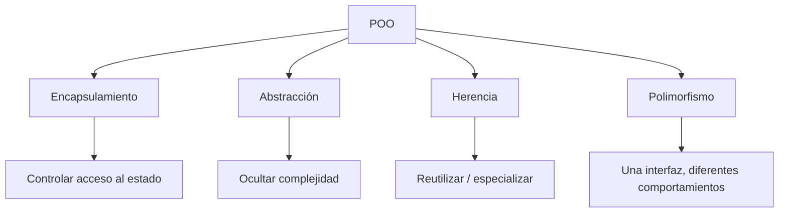

## 21.1 Encapsulamiento

Controla el acceso a los detalles internos.

```javascript
class Cuenta {
    #saldo = 0;

    depositar(valor) {
        this.#saldo += valor;
    }

    get saldo() {
        return this.#saldo;
    }
}
```

---

## 21.2 Abstracción

Expone una interfaz sencilla y oculta la complejidad.

```javascript
cuenta.depositar(100);
```

El consumidor no necesita conocer cómo se almacena internamente `#saldo`.

---

## 21.3 Herencia

Permite crear una clase basada en otra.

JavaScript utiliza `extends` para expresar herencia mediante clases. ([MDN Web Docs][2])

Ejemplo:

```javascript
class Animal {
    mover() {
        console.log("Moviéndose");
    }
}

class Perro extends Animal {
    ladrar() {
        console.log("Guau");
    }
}
```

```javascript
const perro = new Perro();

perro.mover();
perro.ladrar();
```

Aquí `Perro` hereda el comportamiento disponible de `Animal`.

---

## 21.4 Polimorfismo

El polimorfismo permite trabajar con una interfaz común mientras diferentes objetos proporcionan comportamientos diferentes.

Ejemplo:

```javascript
class Animal {
    hablar() {
        console.log("Sonido");
    }
}

class Perro extends Animal {
    hablar() {
        console.log("Guau");
    }
}

class Gato extends Animal {
    hablar() {
        console.log("Miau");
    }
}
```

Ahora:

```javascript
const animales = [
    new Perro(),
    new Gato()
];

for (const animal of animales) {
    animal.hablar();
}
```

Resultado:

```text
Guau
Miau
```

La llamada es la misma:

```javascript
animal.hablar();
```

pero el comportamiento depende del objeto concreto.

---

# 22. Ejemplo práctico: clase `Usuario`

El ejercicio original puede reorganizarse para mostrar claramente encapsulamiento y getters/setters.

```javascript
class Usuario {
    #username;
    #email;
    #password;

    set nombreUsuario(nuevoValor) {
        if (
            typeof nuevoValor === "string" &&
            nuevoValor.length >= 3
        ) {
            this.#username = nuevoValor;
        } else {
            console.warn("Nombre de usuario inválido.");
        }
    }

    get nombreUsuario() {
        return this.#username?.toUpperCase();
    }

    set correoElectronico(nuevoValor) {
        if (typeof nuevoValor === "string") {
            this.#email = nuevoValor;
        }
    }

    get correoElectronico() {
        return this.#email?.toLowerCase();
    }

    set contraseña(nuevoValor) {
        if (typeof nuevoValor === "string") {
            this.#password = nuevoValor;
        }
    }

    validarContraseña(intentoContraseña) {
        if (this.#password === intentoContraseña) {
            console.log("Ingreso exitoso");
        } else {
            console.log("Contraseña inválida");
        }
    }
}
```

Uso:

```javascript
const sergio = new Usuario();

sergio.nombreUsuario = "camper_pro_01";
sergio.contraseña = "123456";
sergio.correoElectronico = "sergio@gmail.com";

console.log(
    "Usuario:",
    sergio.nombreUsuario
);

console.log(
    "Correo:",
    sergio.correoElectronico
);

sergio.validarContraseña("123456");
```

### ¿Qué conceptos aparecen?

| Elemento              | Concepto       |
| --------------------- | -------------- |
| `class Usuario`       | Clase          |
| `new Usuario()`       | Instanciación  |
| `#username`           | Campo privado  |
| `#email`              | Campo privado  |
| `#password`           | Campo privado  |
| `set nombreUsuario()` | Setter         |
| `get nombreUsuario()` | Getter         |
| `validarContraseña()` | Método público |
| `sergio`              | Instancia      |

> [!WARNING]
> En una aplicación real **no se debería almacenar una contraseña en texto plano** como en este ejercicio. Las contraseñas deben almacenarse utilizando mecanismos adecuados de hashing y nunca deberían imprimirse o devolverse directamente.
>
> En este ejemplo se conserva el concepto de POO; el manejo de contraseñas reales pertenece al ámbito de seguridad de aplicaciones.

---

# 23. Ejemplo práctico: clase `Vehiculo`

El ejercicio representa un vehículo cuyo estado interno está encapsulado.

```javascript
class Vehiculo {
    #estado;
    #velocidad;

    constructor() {
        this.#estado = "Off";
        this.#velocidad = 0;
    }

    encender() {
        this.#estado = "On";
    }

    acelerar() {
        if (this.#estado === "On") {
            this.#velocidad += 1;
        } else {
            console.warn("El vehículo está apagado.");
        }
    }

    frenar() {
        this.#velocidad = 0;
    }

    apagar() {
        this.#velocidad = 0;
        this.#estado = "Off";
    }

    estado() {
        console.log(
            `Estado: ${this.#estado}\n` +
            `Velocidad: ${this.#velocidad}`
        );
    }
}
```

Uso:

```javascript
const carro = new Vehiculo();

carro.encender();
carro.estado();

carro.acelerar();
carro.estado();

carro.frenar();
carro.estado();

carro.apagar();
carro.estado();
```

### ¿Dónde está el encapsulamiento?

El código externo no puede hacer:

```javascript
carro.#velocidad = 100;
```

porque `#velocidad` es privado.

En cambio, debe utilizar la interfaz pública:

```javascript
carro.acelerar();
carro.frenar();
```

La clase controla cómo puede modificarse su estado.

---

# 24. Método privado `#estadoActual()`

Una variante de tu ejercicio utiliza un método privado:

```javascript
class Vehiculo {
    #estado;
    #velocidad;

    constructor() {
        this.#estado = "Off";
        this.#velocidad = 0;
    }

    encender() {
        this.#estado = "On";
        this.#estadoActual();
    }

    acelerar() {
        this.#velocidad += 1;
        this.#estadoActual();
    }

    frenar() {
        this.#velocidad = 0;
        this.#estadoActual();
    }

    apagar() {
        this.#estado = "Off";
        this.#estadoActual();
    }

    #estadoActual() {
        console.log(
            `Estado: ${this.#estado}\n` +
            `Velocidad: ${this.#velocidad}`
        );
    }
}
```

Aquí:

```javascript
#estadoActual()
```

es un método privado.

El método solo se utiliza internamente:

```text
encender()
    ↓
#estadoActual()

acelerar()
    ↓
#estadoActual()

frenar()
    ↓
#estadoActual()
```

Esto es un buen ejemplo de encapsulamiento porque el consumidor no necesita conocer ni utilizar directamente el método interno.

---

# 25. Ejemplo práctico: clase `Animal`

El ejercicio original puede corregirse y simplificarse:

```javascript
class Animal {
    tipo;
    #edad;

    constructor(nuevoTipo, nuevaEdad) {
        this.tipo = nuevoTipo;
        this.edad = nuevaEdad;
    }

    set edad(nuevaEdad) {
        if (
            typeof nuevaEdad === "number" &&
            nuevaEdad >= 0
        ) {
            this.#edad = nuevaEdad;
        } else {
            console.warn(
                "Edad inválida. Inténtalo nuevamente."
            );
        }
    }

    get edad() {
        return this.#edad;
    }

    mover() {
        console.log("El animal se está moviendo.");
    }

    #respirar() {
        console.log("El animal está respirando.");
    }
}
```

Crear una instancia:

```javascript
const gato = new Animal("mamífero", 1);
```

Consultar propiedades:

```javascript
console.log(
    "El gato es de tipo:",
    gato.tipo
);

console.log(
    "El gato tiene:",
    gato.edad,
    "años"
);
```

Modificar la edad:

```javascript
gato.edad = 2;
```

Ejecutar un método público:

```javascript
gato.mover();
```

---

## 25.1 Flujo del setter `edad`

Cuando se ejecuta:

```javascript
gato.edad = 2;
```

no se modifica directamente `#edad`.

El flujo es:

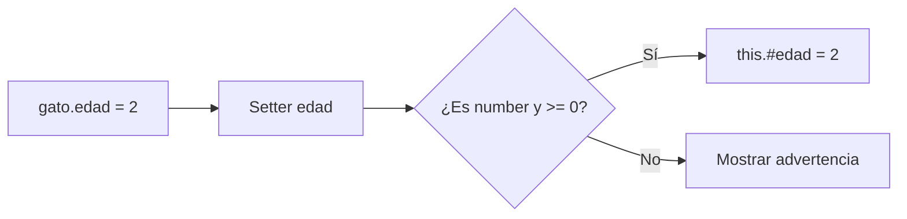

Esto permite aplicar una regla de validación antes de modificar el estado interno.

---

# 26. Ejemplo: clase `Figura`

El ejercicio:

```javascript
class Figura {
    #numerosLados;

    set numerosLados(num) {
        this.#numerosLados = num;
    }

    get numerosLados() {
        return this.#numerosLados;
    }
}

const triangulo = new Figura();

triangulo.numerosLados = 3;

console.log(triangulo.numerosLados);
```

demuestra:

```text
#numerosLados
      ↓
  campo privado
      ↑
      │
 ┌────┴────┐
 │         │
Getter   Setter
 │         │
 ↓         ↑
Lectura   Escritura
```

Sin embargo, el setter podría mejorarse agregando validación:

```javascript
class Figura {
    #numerosLados;

    set numerosLados(num) {
        if (
            Number.isInteger(num) &&
            num > 0
        ) {
            this.#numerosLados = num;
        } else {
            console.warn(
                "El número de lados debe ser un entero positivo."
            );
        }
    }

    get numerosLados() {
        return this.#numerosLados;
    }
}
```

---

# 27. Ejercicio: clase `Calculadora`

El ejercicio de la calculadora contiene un **error importante** en los getters originales.

El código original tenía:

```javascript
get numero01() {
    return this.numero01;
}
```

Esto provoca una llamada recursiva al propio getter:

```text
numero01
   ↓
getter numero01
   ↓
this.numero01
   ↓
getter numero01
   ↓
this.numero01
   ↓
...
```

Finalmente se produce un error por recursión infinita.

> [!WARNING]
> Un getter no debe devolver mediante `this.numero01` la misma propiedad cuyo acceso está controlando. Debe existir un campo diferente para almacenar el valor o utilizar directamente una propiedad pública sin getter.

Una versión corregida y coherente con el objetivo de practicar encapsulamiento sería:

```javascript
class Calculadora {
    #numero01;
    #numero02;

    constructor(numero01, numero02) {
        this.#numero01 = numero01;
        this.#numero02 = numero02;
    }

    set numeros({ numero01, numero02 }) {
        if (
            typeof numero01 === "number" &&
            typeof numero02 === "number"
        ) {
            this.#numero01 = numero01;
            this.#numero02 = numero02;
        } else {
            console.warn(
                "Los valores deben ser números."
            );
        }
    }

    get numero01() {
        return this.#numero01;
    }

    get numero02() {
        return this.#numero02;
    }

    suma() {
        console.log(
            "La suma es:",
            this.#numero01 + this.#numero02
        );
    }

    resta() {
        console.log(
            "La resta es:",
            this.#numero01 - this.#numero02
        );
    }

    multiplicar() {
        console.log(
            "La multiplicación es:",
            this.#numero01 * this.#numero02
        );
    }

    dividir() {
        if (this.#numero02 === 0) {
            console.warn(
                "No se puede dividir entre cero."
            );
            return;
        }

        console.log(
            "La división es:",
            this.#numero01 / this.#numero02
        );
    }
}
```

Uso:

```javascript
const calculadora = new Calculadora(3, 1);

console.log(
    "Número 01:",
    calculadora.numero01
);

console.log(
    "Número 02:",
    calculadora.numero02
);

calculadora.suma();
calculadora.resta();
calculadora.multiplicar();
calculadora.dividir();
```

Resultado conceptual:

```text
Número 01: 3
Número 02: 1
La suma es: 4
La resta es: 2
La multiplicación es: 3
La división es: 3
```

---

# 28. ¿Qué demuestra el ejercicio de `Calculadora`?

Este ejemplo reúne varios conceptos:

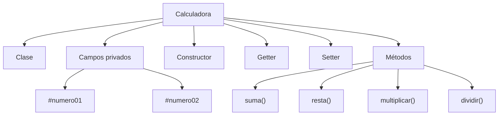

| Concepto        | Implementación            |
| --------------- | ------------------------- |
| Clase           | `class Calculadora`       |
| Campos privados | `#numero01`, `#numero02`  |
| Constructor     | `constructor()`           |
| Getter          | `get numero01()`          |
| Setter          | `set numeros()`           |
| Métodos         | `suma()`, `resta()`, etc. |
| Instancia       | `new Calculadora(3, 1)`   |
| Encapsulamiento | Uso de campos `#`         |

---

# 29. Errores encontrados en los apuntes

## Error 1 — "JavaScript no es orientado a objetos"

Corrección:

> JavaScript es un lenguaje orientado a objetos basado en prototipos y soporta múltiples paradigmas. ([MDN Web Docs][8])

---

## Error 2 — `_propiedad` como privacidad real

Esto:

```javascript
this._nombre;
```

no crea una propiedad privada.

La privacidad real de los elementos de clase se expresa mediante:

```javascript
this.#nombre;
```

([MDN Web Docs][5])

---

## Error 3 — Getter recursivo en `Calculadora`

Original:

```javascript
get numero01() {
    return this.numero01;
}
```

Incorrecto.

Debe utilizarse otro almacenamiento:

```javascript
#numero01;

get numero01() {
    return this.#numero01;
}
```

---

## Error 4 — `this.edad` frente a `#edad`

En el constructor de `Animal`:

```javascript
constructor(nuevotipo, nuevaedad) {
    this.tipo = nuevotipo;
    this.edad = nuevaedad;
}
```

Esto **no es necesariamente un error**.

Como existe:

```javascript
set edad(nuevaEdad) {
    ...
}
```

la instrucción:

```javascript
this.edad = nuevaedad;
```

invoca el setter.

El setter posteriormente almacena el valor en:

```javascript
this.#edad
```

El flujo es:

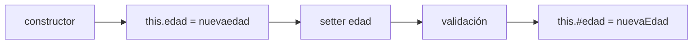

---

## Error 5 — Contraseña expuesta

El ejercicio de `Usuario` intenta proteger la contraseña mediante:

```javascript
#password
```

lo cual es correcto para practicar encapsulamiento.

Sin embargo, una aplicación real no debe tratar una contraseña de esta manera.

Debe utilizar mecanismos de autenticación y almacenamiento seguro de credenciales.

---

# 30. Diferencia entre encapsulamiento y abstracción

| Concepto            | Pregunta que responde                                            | Ejemplo                      |
| ------------------- | ---------------------------------------------------------------- | ---------------------------- |
| **Encapsulamiento** | ¿Quién puede acceder al estado interno?                          | `#password`                  |
| **Abstracción**     | ¿Qué detalles necesito conocer para utilizar el objeto?          | `carro.acelerar()`           |
| **Herencia**        | ¿Cómo reutilizo/especializo comportamiento?                      | `class Perro extends Animal` |
| **Polimorfismo**    | ¿Cómo una misma interfaz puede tener diferentes comportamientos? | `animal.hablar()`            |

Una forma sencilla de recordarlos:

```text
ENCAPSULAMIENTO
"Protejo el interior."

ABSTRACCIÓN
"Oculto la complejidad."

HERENCIA
"Reutilizo y especializo."

POLIMORFISMO
"Una interfaz, diferentes comportamientos."
```

---

# 31. Clase, instancia y prototipo

Estos tres conceptos suelen confundirse:

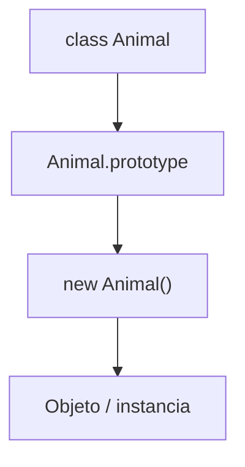

### Clase

```javascript
class Animal {}
```

Define la estructura mediante la sintaxis `class`.

### Instancia

```javascript
const gato = new Animal();
```

Es el objeto concreto creado a partir de la clase.

### Prototipo

```javascript
Animal.prototype
```

Es parte del mecanismo que JavaScript utiliza para compartir comportamiento y construir la cadena de prototipos. Las clases proporcionan una abstracción sobre este modelo. ([MDN Web Docs][2])

---

# 32. Flujo general de una clase

Cuando se trabaja con clases puede visualizarse el proceso:

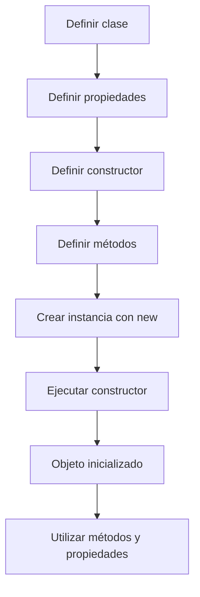

Por ejemplo:

```javascript
class Usuario {
    #nombre;

    constructor(nombre) {
        this.#nombre = nombre;
    }

    saludar() {
        console.log(
            `Hola, soy ${this.#nombre}`
        );
    }
}

const usuario = new Usuario("Carlos");

usuario.saludar();
```

---

# 33. Buenas prácticas

## 33.1 Mantener una responsabilidad clara

Una clase debería representar una responsabilidad coherente.

Evita crear clases gigantes que hagan:

```text
Autenticación
Base de datos
Envío de correos
Generación de PDF
Pagos
Logs
...
```

al mismo tiempo.

---

## 33.2 Proteger el estado cuando sea necesario

Si una propiedad necesita validación o no debería modificarse directamente:

```javascript
#saldo;
```

puede ser más apropiado que una propiedad pública.

---

## 33.3 Validar datos en setters cuando tenga sentido

```javascript
set edad(valor) {
    if (typeof valor === "number" && valor >= 0) {
        this.#edad = valor;
    }
}
```

Esto evita que el objeto acepte determinados estados inválidos.

---

## 33.4 No utilizar getters y setters automáticamente

No toda propiedad necesita un getter y un setter.

Si una propiedad pública sencilla es suficiente:

```javascript
class Producto {
    nombre;
}
```

no es necesario crear automáticamente:

```javascript
get nombre() {}
set nombre() {}
```

Utiliza accesores cuando aporten control, validación, transformación u otra lógica relevante.

---

## 33.5 No confundir POO con utilizar `class`

Es posible escribir JavaScript orientado a objetos utilizando:

```javascript
const usuario = {
    nombre: "Carlos",

    saludar() {
        console.log("Hola");
    }
};
```

sin declarar una clase.

JavaScript permite crear objetos directamente y también utilizar funciones constructoras y prototipos. La sintaxis `class` proporciona una forma estructurada de trabajar con este modelo. ([MDN Web Docs][7])

---

# 34. Resumen visual

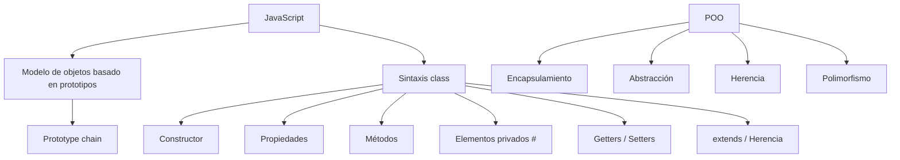

# Glosario

| Término                  | Definición                                                                                                                           |
| ------------------------ | ------------------------------------------------------------------------------------------------------------------------------------ |
| **POO / OOP**            | Paradigma de programación que organiza el software alrededor de objetos que encapsulan datos y comportamientos.                      |
| **Objeto**               | Entidad que contiene propiedades y métodos.                                                                                          |
| **Clase**                | Estructura utilizada como plantilla para crear y organizar objetos mediante la sintaxis `class`.                                     |
| **Instancia**            | Objeto concreto creado a partir de una clase.                                                                                        |
| **Propiedad**            | Dato o estado asociado a un objeto.                                                                                                  |
| **Método**               | Función asociada a un objeto o clase que representa comportamiento.                                                                  |
| **Constructor**          | Método especial ejecutado durante la creación de una instancia mediante `new`.                                                       |
| **Instanciación**        | Proceso de crear un objeto a partir de una clase.                                                                                    |
| **`new`**                | Operador utilizado para crear una nueva instancia.                                                                                   |
| **Prototype**            | Objeto utilizado por JavaScript como parte de su mecanismo de herencia y reutilización de propiedades y métodos.                     |
| **Prototype chain**      | Cadena de objetos mediante la cual JavaScript busca propiedades y métodos heredados.                                                 |
| **Encapsulamiento**      | Mecanismo conceptual para controlar el acceso al estado y comportamiento interno de un objeto.                                       |
| **Abstracción**          | Técnica de diseño que oculta detalles innecesarios y expone una interfaz relevante.                                                  |
| **Herencia**             | Mecanismo mediante el cual una estructura puede reutilizar y especializar características de otra.                                   |
| **Polimorfismo**         | Capacidad de utilizar una interfaz común con diferentes implementaciones o comportamientos.                                          |
| **Campo privado**        | Campo de una clase declarado con `#` y accesible únicamente desde el ámbito de la clase que lo define.                               |
| **Método privado**       | Método de una clase declarado con `#` que solo puede ser utilizado desde el ámbito de la clase.                                      |
| **Getter**               | Accesor declarado con `get` que controla la lectura de un valor mediante una sintaxis de propiedad.                                  |
| **Setter**               | Accesor declarado con `set` que controla la asignación de un valor mediante una sintaxis de propiedad.                               |
| **PascalCase**           | Convención de nombres en la que cada palabra comienza con mayúscula, por ejemplo `CalculadoraFinanciera`.                            |
| **camelCase**            | Convención de nombres en la que la primera palabra comienza en minúscula y las siguientes en mayúscula, por ejemplo `nombreUsuario`. |
| **`extends`**            | Palabra clave utilizada para crear una clase derivada de otra clase.                                                                 |
| **`super()`**            | Llamada utilizada en una clase derivada para ejecutar el constructor de la clase padre.                                              |
| **Estado**               | Conjunto de valores que representan la situación actual de un objeto.                                                                |
| **Interfaz pública**     | Conjunto de propiedades y métodos que un objeto expone para ser utilizado desde código externo.                                      |
| **Abstracción de clase** | Forma de utilizar la sintaxis `class` para estructurar objetos y comportamientos sobre el modelo de prototipos de JavaScript.        |

# Resumen

* **JavaScript sí soporta Programación Orientada a Objetos**.
* JavaScript es **orientado a objetos y basado en prototipos**.
* La afirmación "JavaScript no es orientado a objetos" debe corregirse.
* JavaScript también proporciona la sintaxis `class`, introducida en **ECMAScript 2015**.
* Las clases de JavaScript son una abstracción sobre el mecanismo de prototipos existente. ([MDN Web Docs][2])
* Una **clase** define una estructura.
* Un **objeto** es una instancia concreta.
* Una **propiedad** representa datos o estado.
* Un **método** representa comportamiento.
* `new` permite crear instancias.
* `constructor()` permite inicializar el estado inicial de una instancia.
* Los campos públicos pueden declararse directamente dentro de una clase.
* Los campos privados utilizan `#`.
* Un `_nombre` no constituye privacidad real en JavaScript.
* Los **getters** controlan la lectura de propiedades.
* Los **setters** controlan la asignación de propiedades.
* El **encapsulamiento** permite controlar el acceso al estado interno.
* La **abstracción** permite utilizar un objeto sin conocer todos sus detalles internos.
* La **herencia** puede expresarse mediante `extends`.
* El **polimorfismo** permite utilizar una interfaz común con comportamientos diferentes.
* Los prototipos y la *prototype chain* son fundamentales para comprender cómo funciona la herencia en JavaScript. ([MDN Web Docs][3])
* Un getter no debe acceder recursivamente a la misma propiedad que está definiendo.
* La POO no consiste simplemente en escribir `class`; es una forma de organizar responsabilidades, estado y comportamiento.
* La idea fundamental que debes conservar es:

```text
                  POO
                   │
        ┌──────────┴──────────┐
        ↓                     ↓
     OBJETOS                CLASES
        │                     │
        ├── Propiedades       ├── Constructor
        └── Métodos           ├── Métodos
                              └── Estado
                   │
          ┌────────┼────────┐
          ↓        ↓        ↓
     Encapsul. Abstracción Herencia
                              │
                              ↓
                         Polimorfismo
```