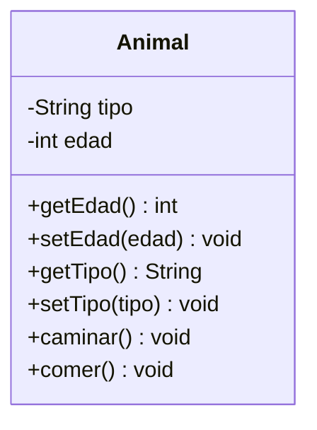
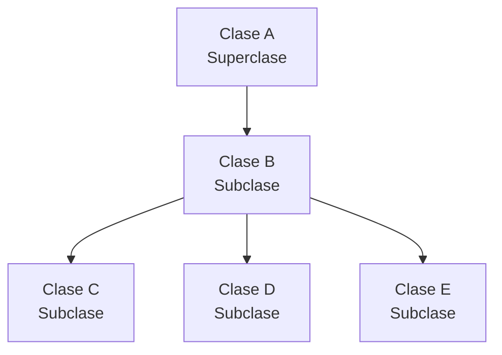
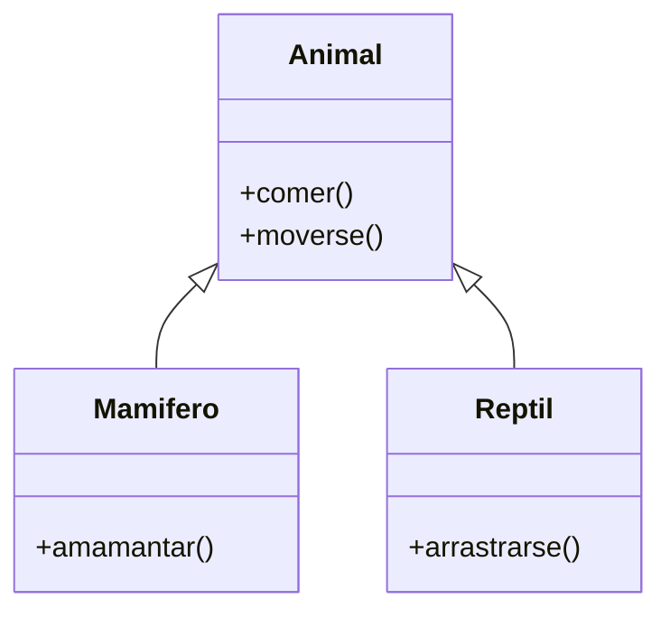
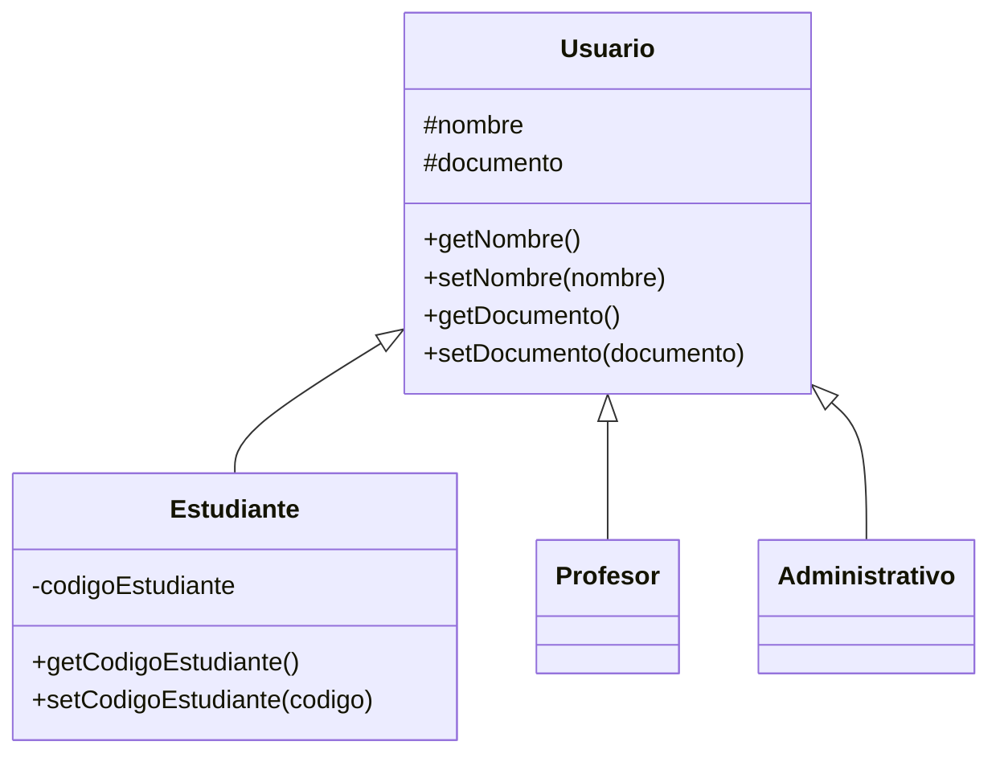
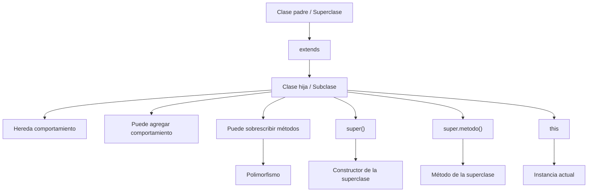

# Herencia y Polimorfismo en JavaScript

La **herencia** y el **polimorfismo** son dos conceptos fundamentales de la programación orientada a objetos (POO). En JavaScript se implementan mediante el sistema de **prototipos**, aunque desde ECMAScript 2015 (ES6) existe la sintaxis `class`, `extends` y `super`, que permite expresar estas relaciones de una forma más cercana a los lenguajes orientados a objetos basados en clases.

> [!IMPORTANT]
> Las clases de JavaScript **no reemplazaron el sistema de prototipos**. La sintaxis `class` es una abstracción sobre la herencia basada en prototipos. Por debajo, JavaScript continúa utilizando su cadena de prototipos.

---

## 1. Diagrama de clases

Un **diagrama de clases** es una representación visual de la estructura de un sistema orientado a objetos.

Permite representar:

* Clases.
* Atributos.
* Métodos.
* Visibilidad.
* Relaciones entre clases.
* Herencia.
* Tipos de datos.
* Asociaciones entre clases.

Es una herramienta de **modelado estático**, porque representa la estructura del sistema y no la ejecución paso a paso del programa.

### 1.1 Visibilidad en diagramas de clases

En UML se suelen utilizar los siguientes símbolos:

| Símbolo | Visibilidad | Significado                                                                             |
| ------- | ----------- | --------------------------------------------------------------------------------------- |
| `+`     | Pública     | Accesible desde fuera de la clase                                                       |
| `-`     | Privada     | Accesible únicamente desde la clase                                                     |
| `#`     | Protegida   | Visible para la clase y sus descendientes en lenguajes que implementan esta visibilidad |
| `~`     | Paquete     | Acceso limitado al paquete, según el lenguaje/modelo                                    |

> [!NOTE]
> La notación UML y la sintaxis real de JavaScript no son exactamente lo mismo. Por ejemplo, `#` representa visibilidad protegida en UML, pero en JavaScript `#campo` significa un **campo privado real**, no un campo protegido. Los elementos privados de JavaScript no son accesibles directamente desde las subclases.

### 1.2 Ejemplo



---

# 2. Herencia

La **herencia** es un mecanismo de la POO que permite que una clase reutilice y extienda características de otra clase.

La clase que proporciona las características se conoce como:

* **Superclase**
* **Clase padre**
* **Clase base**

La clase que hereda se conoce como:

* **Subclase**
* **Clase hija**
* **Clase derivada**

En JavaScript se utiliza la palabra reservada `extends` para crear una subclase.

### 2.1 Ejemplo conceptual



En este ejemplo:

* `A` es la superclase de `B`.
* `B` es la subclase de `A`.
* `B` es la superclase de `C`, `D` y `E`.
* `C`, `D` y `E` son subclases de `B`.

---

## 2.2 Herencia con `extends`

```javascript
class Animal {
    comer() {
        console.log("El animal está comiendo.");
    }

    caminar() {
        console.log("El animal está caminando.");
    }
}

class Mamifero extends Animal {
    amamantar() {
        console.log("El mamífero está amamantando.");
    }
}

const perro = new Mamifero();

perro.comer();
perro.caminar();
perro.amamantar();
```

Aunque `Mamifero` no declara `comer()` ni `caminar()`, puede utilizarlos porque los hereda de `Animal`.

Una clase derivada puede además agregar sus propias propiedades y métodos.

---

# 3. Jerarquías de herencia

La herencia permite construir jerarquías de clases.



En este caso:

```text
             Animal
             /    \
            /      \
      Mamifero    Reptil
```

`Mamifero` y `Reptil` comparten comportamientos provenientes de `Animal`, pero cada uno puede agregar comportamientos propios.

---

# 4. Herencia con una jerarquía de usuarios

Un ejemplo común es tener una clase general `Usuario` y diferentes tipos de usuarios.



La relación puede interpretarse así:

```text
Usuario
├── Estudiante
├── Profesor
└── Administrativo
```

Todos son usuarios, pero cada tipo puede tener características específicas.

---

# 5. Herencia y la cadena de prototipos

Aunque utilicemos `class`, la herencia de JavaScript sigue basándose en prototipos.

```javascript
class Animal {
    caminar() {
        console.log("Caminando...");
    }
}

class Perro extends Animal {
}

const fido = new Perro();

fido.caminar();
```

Conceptualmente, la búsqueda del método puede seguir una cadena similar a:

```text
fido
 ↓
Perro.prototype
 ↓
Animal.prototype
 ↓
Object.prototype
 ↓
null
```

Si JavaScript no encuentra `caminar()` directamente en `fido`, continúa buscando en su prototipo y posteriormente en los prototipos superiores. Este mecanismo se denomina **prototype chain** o **cadena de prototipos**.

---

# 6. `this`

`this` es una palabra reservada que hace referencia al contexto del objeto sobre el que se está ejecutando una operación.

En un constructor llamado mediante `new`, `this` representa la instancia que se está creando. En un método de instancia, normalmente representa el objeto desde el cual se accede al método.

## 6.1 `this` en un constructor

```javascript
class Persona {
    constructor(nombre) {
        this.nombre = nombre;
    }
}

const persona = new Persona("Carlos");

console.log(persona.nombre);
```

Cuando se ejecuta:

```javascript
new Persona("Carlos");
```

`this` representa el nuevo objeto que está siendo construido.

Por eso:

```javascript
this.nombre = nombre;
```

significa:

```text
propiedad del objeto = valor recibido
```

---

## 6.2 `this` para diferenciar propiedades y parámetros

Es común que el parámetro y la propiedad tengan el mismo nombre:

```javascript
class Usuario {
    constructor(nombre) {
        this.nombre = nombre;
    }
}
```

Aquí:

* `nombre` → parámetro del constructor.
* `this.nombre` → propiedad de la instancia.

Por eso `this` es necesario para distinguir ambos.

---

## 6.3 Pasar `this` como argumento

`this` también puede pasarse como argumento a otro método.

```javascript
class MiClase {
    x = 24;

    metodo1() {
        this.metodo2(this);
    }

    metodo2(objeto) {
        console.log(objeto);
    }
}

const miObjeto = new MiClase();
miObjeto.metodo1();
```

En:

```javascript
this.metodo2(this);
```

ocurren dos cosas:

1. `this.metodo2` indica que se está ejecutando el método del objeto actual.
2. El segundo `this` pasa el objeto actual como argumento.

Por tanto, `objeto` recibe una referencia a la instancia.

---

# 7. `super`

`super` permite acceder a la superclase desde una subclase.

Tiene dos usos principales:

1. `super(...)` → llamar al constructor de la clase padre.
2. `super.metodo()` → llamar a un método de la clase padre.

---

## 7.1 `super()` y el constructor padre

```javascript
class Persona {
    constructor(nombre) {
        this.nombre = nombre;
    }
}

class Estudiante extends Persona {
    constructor(nombre, codigo) {
        super(nombre);

        this.codigo = codigo;
    }
}

const estudiante = new Estudiante("Carlos", "001");

console.log(estudiante.nombre);
console.log(estudiante.codigo);
```

Aquí:

```javascript
super(nombre);
```

llama al constructor de `Persona`.

La ejecución conceptual es:

```text
new Estudiante(...)
        │
        ▼
constructor de Estudiante
        │
        ▼
super(nombre)
        │
        ▼
constructor de Persona
        │
        ▼
this.nombre = nombre
        │
        ▼
this.codigo = codigo
```

### Regla importante

En un constructor de una clase derivada, `super()` debe ejecutarse **antes de utilizar `this`**.

Incorrecto:

```javascript
class Estudiante extends Persona {
    constructor(nombre) {
        this.nombre = nombre;

        super(nombre);
    }
}
```

Correcto:

```javascript
class Estudiante extends Persona {
    constructor(nombre) {
        super(nombre);

        this.nombre = nombre;
    }
}
```

Si se intenta utilizar `this` antes de `super()`, JavaScript genera un error.

---

## 7.2 `super.metodo()`

También podemos utilizar `super` para ejecutar la implementación del método perteneciente a la clase padre.

```javascript
class Animal {
    mover() {
        console.log("El animal se está moviendo.");
    }
}

class Perro extends Animal {
    mover() {
        super.mover();

        console.log("El perro está caminando.");
    }
}

const fido = new Perro();

fido.mover();
```

Resultado:

```text
El animal se está moviendo.
El perro está caminando.
```

Aquí `Perro` **sobrescribe** `mover()`, pero utiliza `super.mover()` para conservar el comportamiento original y después agregar comportamiento propio.

---

# 8. Sobrescritura de métodos

La **sobrescritura** (*method overriding*) ocurre cuando una subclase proporciona su propia implementación de un método que ya existe en la superclase.

```javascript
class Animal {
    hacerSonido() {
        console.log("Sonido de animal");
    }
}

class Perro extends Animal {
    hacerSonido() {
        console.log("Guau guau");
    }
}
```

Ahora:

```javascript
const animal = new Animal();
const perro = new Perro();

animal.hacerSonido();
perro.hacerSonido();
```

Resultado:

```text
Sonido de animal
Guau guau
```

El método tiene el mismo nombre:

```javascript
hacerSonido()
```

pero cada clase proporciona un comportamiento diferente.

---

# 9. Polimorfismo

El **polimorfismo** significa literalmente "muchas formas".

En POO, permite trabajar con diferentes objetos mediante una interfaz o comportamiento común, aunque cada objeto pueda responder de manera diferente.

En JavaScript, una manifestación muy común del polimorfismo ocurre cuando varias subclases sobrescriben el mismo método heredado.

```javascript
class Animal {
    hacerSonido() {
        console.log("Sonido desconocido");
    }
}

class Perro extends Animal {
    hacerSonido() {
        console.log("Guau guau");
    }
}

class Gato extends Animal {
    hacerSonido() {
        console.log("Miau miau");
    }
}

const fido = new Perro();
const garfield = new Gato();

fido.hacerSonido();
garfield.hacerSonido();
```

Resultado:

```text
Guau guau
Miau miau
```

La operación es la misma:

```javascript
hacerSonido()
```

pero el comportamiento depende del objeto que la ejecuta.

---

## 9.1 Polimorfismo con una colección

El concepto se vuelve más evidente cuando almacenamos diferentes tipos de animales en una misma colección:

```javascript
class Animal {
    hacerSonido() {
        console.log("Sonido de animal");
    }
}

class Perro extends Animal {
    hacerSonido() {
        console.log("Guau");
    }
}

class Gato extends Animal {
    hacerSonido() {
        console.log("Miau");
    }
}

class Vaca extends Animal {
    hacerSonido() {
        console.log("Muuu");
    }
}

const animales = [
    new Perro(),
    new Gato(),
    new Vaca()
];

animales.forEach(animal => {
    animal.hacerSonido();
});
```

Resultado:

```text
Guau
Miau
Muuu
```

El código que recorre la colección no necesita conocer los detalles internos de cada clase.

Solo necesita saber que los objetos proporcionan:

```javascript
hacerSonido()
```

Esto permite escribir código más flexible.

---

# 10. Sobrescritura vs sobrecarga

Es importante no confundir estos dos conceptos.

## Sobrescritura

Una subclase reemplaza la implementación de un método heredado.

```javascript
class Animal {
    hacerSonido() {
        console.log("Sonido");
    }
}

class Perro extends Animal {
    hacerSonido() {
        console.log("Guau");
    }
}
```

Esto es **sobrescritura**.

---

## Sobrecarga

La sobrecarga tradicional permite tener varios métodos con el mismo nombre pero diferentes parámetros.

Por ejemplo, en algunos lenguajes:

```text
sumar(int, int)
sumar(int, int, int)
```

JavaScript **no tiene sobrecarga de métodos tradicional basada en firmas**. Si se declara varias veces un método con el mismo nombre dentro de una clase, la definición posterior reemplaza a la anterior.

Sin embargo, se puede simular un comportamiento parecido utilizando parámetros variables, valores por defecto, `arguments`, validaciones, etc.

El ejemplo:

```javascript
class Matematicas {
    sumar(...args) {
        if (args.length === 2) {
            return args[0] + args[1];
        }

        if (args.length === 3) {
            return args[0] + args[1] + args[2];
        }

        return 0;
    }
}

const m = new Matematicas();

console.log(m.sumar(3, 4));
console.log(m.sumar(1, 2, 3));
```

produce:

```text
7
6
```

> [!NOTE]
> Esto es una **simulación de sobrecarga**, no sobrecarga de métodos real basada en firmas como la disponible en lenguajes como Java o C#.

---

# 11. Herencia multinivel

Una clase puede heredar de otra clase que, a su vez, hereda de otra.

```javascript
class Persona {
    nombre = "John Lennon";

    obtenerNombre() {
        return this.nombre;
    }
}

class Estudiante extends Persona {
    codigo = "001";

    getEstudiante() {
        return `El código es ${this.codigo} del estudiante ${this.obtenerNombre()}`;
    }
}

class EstudianteBachiller extends Estudiante {
    sede = "Guate";

    getSede() {
        return this.sede;
    }
}

const estudiante = new EstudianteBachiller();

console.log(estudiante.getEstudiante());
console.log(estudiante.getSede());
```

La jerarquía es:

```text
Persona
   │
   ▼
Estudiante
   │
   ▼
EstudianteBachiller
```

El objeto `estudiante` puede utilizar características de los tres niveles.

```text
EstudianteBachiller
        │
        ├── getSede()
        │
        ├── getEstudiante()
        │
        └── obtenerNombre()
                │
                └── Persona
```

---

# 12. Herencia simple

JavaScript permite que una clase tenga una única superclase directa.

```javascript
class MiClase1 {
    metodo1() {
        console.log("Método 1");
    }
}

class MiClaseHereda extends MiClase1 {
}

const objeto = new MiClaseHereda();

objeto.metodo1();
```

`MiClaseHereda` recibe el comportamiento de `MiClase1`.

```text
MiClase1
   │
   ▼
MiClaseHereda
```

> [!IMPORTANT]
> JavaScript no permite herencia múltiple directa mediante `extends`, es decir, no existe una sintaxis como `class C extends A, B`. Cuando se necesita combinar comportamientos, pueden utilizarse composición o *mixins*.

---

# 13. Clases abstractas

Una **clase abstracta** es un concepto utilizado para representar una clase base que establece una estructura o contrato para sus subclases y que, conceptualmente, no debería instanciarse directamente.

JavaScript no proporciona una palabra reservada nativa como:

```text
abstract class Animal
```

ni un modificador `abstract` como Java.

Sin embargo, podemos **simular** este comportamiento mediante comprobaciones y métodos que lanzan errores.

---

## 13.1 Simulación de una clase abstracta

```javascript
class Animal {
    constructor() {
        if (this.constructor === Animal) {
            throw new Error(
                "No se puede instanciar directamente Animal"
            );
        }
    }

    hacerSonido() {
        throw new Error(
            "La subclase debe implementar hacerSonido()"
        );
    }
}

class Perro extends Animal {
    hacerSonido() {
        console.log("Guau guau");
    }
}

const fido = new Perro();

fido.hacerSonido();
```

Si intentamos:

```javascript
const animal = new Animal();
```

se produce un error:

```text
No se puede instanciar directamente Animal
```

La idea es utilizar `Animal` como una clase base.

---

## 13.2 Método que funciona como contrato

El siguiente método:

```javascript
hacerSonido() {
    throw new Error(
        "La subclase debe implementar hacerSonido()"
    );
}
```

establece una expectativa:

> Toda clase hija debe proporcionar su propia implementación de `hacerSonido()`.

Por ejemplo:

```javascript
class Perro extends Animal {
    hacerSonido() {
        console.log("Guau");
    }
}

class Gato extends Animal {
    hacerSonido() {
        console.log("Miau");
    }
}
```

Esto combina dos conceptos:

```text
Clase base
    │
    ├── define el contrato
    │
    └── clases hijas
            ├── Perro → implementa hacerSonido()
            └── Gato  → implementa hacerSonido()
```

---

# 14. Interfaces en JavaScript

Una **interfaz** define un contrato que especifica qué operaciones debería proporcionar una clase, sin necesariamente definir su implementación.

JavaScript no tiene una palabra reservada nativa:

```javascript
interface Animal {
}
```

como ocurre en TypeScript o Java.

Sin embargo, JavaScript puede implementar ideas similares mediante convenciones, clases base, validaciones, composición u objetos que funcionen como contratos.

Por ejemplo, podemos definir una expectativa de comportamiento:

```javascript
class Impresora {
    imprimir() {
        throw new Error(
            "La clase debe implementar imprimir()"
        );
    }
}
```

Una clase concreta podría proporcionar la implementación:

```javascript
class ImpresoraPDF extends Impresora {
    imprimir() {
        console.log("Imprimiendo PDF...");
    }
}
```

> [!NOTE]
> Si se necesita definir interfaces formales en un proyecto JavaScript con tipado estático, normalmente se utiliza **TypeScript**, que sí proporciona la palabra reservada `interface`. Esto pertenece a TypeScript, no al lenguaje JavaScript estándar.

---

# 15. Diferencia entre clase abstracta e interfaz

Aunque ambos conceptos pueden utilizarse para establecer contratos, no son exactamente lo mismo.

| Concepto                         | Clase abstracta                        | Interfaz                                        |
| -------------------------------- | -------------------------------------- | ----------------------------------------------- |
| Propósito                        | Servir como base para otras clases     | Definir un contrato                             |
| Puede contener implementación    | Sí                                     | Conceptualmente define comportamiento requerido |
| Puede contener estado            | Sí                                     | Depende del lenguaje                            |
| Se puede instanciar directamente | No, conceptualmente                    | No                                              |
| JavaScript nativo                | No existe como construcción `abstract` | No existe como construcción `interface`         |
| Simulación en JS                 | Clases + errores + herencia            | Convenciones, validaciones, composición         |
| TypeScript                       | `abstract class`                       | `interface`                                     |

---

# 16. Ejemplo completo: herencia + `this` + `super` + polimorfismo

El siguiente ejemplo reúne los conceptos principales:

```javascript
class Animal {
    constructor(nombre) {
        this.nombre = nombre;
    }

    hablar() {
        console.log(`${this.nombre} hace un sonido.`);
    }
}

class Perro extends Animal {
    constructor(nombre, raza) {
        super(nombre);

        this.raza = raza;
    }

    hablar() {
        super.hablar();

        console.log(`${this.nombre} dice: Guau guau.`);
    }

    correr() {
        console.log(`${this.nombre} está corriendo.`);
    }
}

class Gato extends Animal {
    hablar() {
        console.log(`${this.nombre} dice: Miau miau.`);
    }
}

const fido = new Perro("Fido", "Labrador");
const garfield = new Gato("Garfield");

fido.hablar();
fido.correr();

garfield.hablar();
```

Aquí aparecen varios conceptos:

### `Animal`

Es la clase padre:

```javascript
class Animal
```

### `Perro extends Animal`

Establece la herencia:

```javascript
class Perro extends Animal
```

### `super(nombre)`

Ejecuta el constructor de `Animal`:

```javascript
super(nombre);
```

### `this.raza`

Agrega una propiedad propia de `Perro`:

```javascript
this.raza = raza;
```

### `super.hablar()`

Ejecuta el método de la clase padre:

```javascript
super.hablar();
```

### Sobrescritura

`Perro` redefine:

```javascript
hablar()
```

### Polimorfismo

`Perro` y `Gato` responden de manera diferente a:

```javascript
hablar()
```

---

# 17. Ejemplo de consola con herencia

El siguiente ejemplo conserva la idea de los apuntes:

```javascript
class Consola {
    constructor(nombre, compania) {
        this.nombre = nombre;
        this.compania = compania;
    }

    encender() {
        console.log(`${this.nombre} está encendida.`);
    }

    mostrarLogo() {
        console.log(
            `La consola ha iniciado correctamente y muestra el logo de ${this.compania}.`
        );
    }
}

class Nintendo extends Consola {
    tema() {
        console.log(
            `${this.nombre} está ejecutando el tema oscuro.`
        );
    }
}

const nintendoSwitch = new Nintendo(
    "Switch",
    "Nintendo"
);

nintendoSwitch.encender();
nintendoSwitch.mostrarLogo();
nintendoSwitch.tema();
```

La relación es:

```text
Consola
   │
   ▼
Nintendo
```

`Nintendo` reutiliza:

```text
encender()
mostrarLogo()
```

y agrega:

```text
tema()
```

---

# 18. Errores comunes

## 18.1 Usar `this` antes de `super()`

Incorrecto:

```javascript
class Hija extends Padre {
    constructor(nombre) {
        this.nombre = nombre;
        super(nombre);
    }
}
```

Correcto:

```javascript
class Hija extends Padre {
    constructor(nombre) {
        super(nombre);
        this.nombre = nombre;
    }
}
```

En una clase derivada, `super()` debe inicializar el contexto antes de utilizar `this`.

---

## 18.2 Confundir `super()` con `super.metodo()`

No son exactamente lo mismo.

### Constructor:

```javascript
super(nombre);
```

Llama al constructor de la clase padre.

### Método:

```javascript
super.hablar();
```

Accede a la implementación del método heredado.

---

## 18.3 Pensar que `super` representa simplemente "el objeto padre"

Esta simplificación puede producir errores conceptuales.

`super` es una sintaxis especial para acceder a la superclase o a su prototipo desde el contexto correspondiente.

---

## 18.4 Intentar acceder a campos privados del padre

```javascript
class Padre {
    #secreto = "dato privado";
}

class Hija extends Padre {
    mostrar() {
        console.log(this.#secreto);
    }
}
```

Esto produce un error.

Los campos privados `#` pertenecen al cuerpo de la clase donde fueron declarados. Una subclase no puede acceder directamente a ellos.

Una alternativa es proporcionar un método o getter público/protegido mediante una convención:

```javascript
class Padre {
    #secreto = "dato privado";

    getSecreto() {
        return this.#secreto;
    }
}

class Hija extends Padre {
    mostrar() {
        console.log(this.getSecreto());
    }
}
```

---

## 18.5 Confundir sobreescritura con sobrecarga

```javascript
class Animal {
    hablar() {}
}

class Perro extends Animal {
    hablar() {}
}
```

Esto es:

**Sobrescritura.**

Mientras que:

```javascript
sumar(1, 2)
sumar(1, 2, 3)
```

representa una idea de:

**Sobrecarga**, que en JavaScript se simula mediante otras técnicas.

---

# 19. Buenas prácticas

### 19.1 Utilizar herencia cuando exista una relación clara

Una relación como:

```text
Perro → Animal
```

tiene sentido porque un perro es un animal.

En cambio, utilizar herencia solamente para reutilizar unas pocas funciones puede generar un acoplamiento innecesario.

La herencia crea una relación fuerte entre la subclase y la superclase; en algunos diseños, la **composición** resulta más apropiada.

### 19.2 Mantener las clases base enfocadas

Una superclase debería representar características realmente comunes.

Evitar crear una clase padre gigantesca que contenga funcionalidades que solamente algunas subclases necesitan.

### 19.3 Utilizar `super()` para evitar duplicación

Si la clase padre ya inicializa una propiedad:

```javascript
class Persona {
    constructor(nombre) {
        this.nombre = nombre;
    }
}
```

la subclase puede reutilizar ese comportamiento:

```javascript
class Estudiante extends Persona {
    constructor(nombre, codigo) {
        super(nombre);
        this.codigo = codigo;
    }
}
```

No es necesario repetir:

```javascript
this.nombre = nombre;
```

### 19.4 Diseñar métodos polimórficos

Si diferentes clases necesitan realizar una misma operación de manera diferente, utilizar un método común puede simplificar el código:

```javascript
hacerSonido()
```

en lugar de llenar el programa de comprobaciones como:

```javascript
if (animal instanceof Perro) {
    // ...
} else if (animal instanceof Gato) {
    // ...
}
```

### 19.5 No abusar de la herencia

La herencia no debe utilizarse simplemente porque existe `extends`.

Una alternativa puede ser la composición:

```text
Objeto
├── comportamiento A
├── comportamiento B
└── comportamiento C
```

En sistemas grandes, esta estrategia puede reducir el acoplamiento.

---

# 20. Resumen visual de los conceptos



---

# Glosario

| Término                | Definición                                                                                                                                                            |
| ---------------------- | --------------------------------------------------------------------------------------------------------------------------------------------------------------------- |
| **POO**                | Programación Orientada a Objetos. Paradigma que organiza el software alrededor de objetos y comportamientos.                                                          |
| **Clase**              | Estructura utilizada para definir propiedades y comportamientos de objetos.                                                                                           |
| **Objeto**             | Instancia concreta de una clase.                                                                                                                                      |
| **Superclase**         | Clase de la que otra clase hereda.                                                                                                                                    |
| **Subclase**           | Clase que hereda de otra clase.                                                                                                                                       |
| **Clase padre**        | Sinónimo de superclase.                                                                                                                                               |
| **Clase hija**         | Sinónimo de subclase.                                                                                                                                                 |
| **Herencia**           | Mecanismo mediante el cual una clase reutiliza y extiende características de otra.                                                                                    |
| **`extends`**          | Palabra reservada utilizada para crear una subclase.                                                                                                                  |
| **`super()`**          | Llama al constructor de la superclase desde el constructor de una subclase.                                                                                           |
| **`super.metodo()`**   | Accede a un método de la superclase.                                                                                                                                  |
| **`this`**             | Referencia cuyo valor depende del contexto de ejecución; en un constructor llamado con `new`, representa la nueva instancia.                                          |
| **Sobrescritura**      | Redefinición de un método heredado en una subclase.                                                                                                                   |
| **Sobrecarga**         | Existencia de varias implementaciones de una operación diferenciadas por sus parámetros; JavaScript no implementa sobrecarga tradicional de métodos basada en firmas. |
| **Polimorfismo**       | Capacidad de trabajar con una operación común cuyos objetos pueden proporcionar diferentes comportamientos.                                                           |
| **Prototipo**          | Objeto utilizado por JavaScript para implementar delegación y herencia mediante la cadena de prototipos.                                                              |
| **Prototype chain**    | Cadena de objetos que JavaScript recorre al buscar propiedades y métodos.                                                                                             |
| **Clase abstracta**    | Clase base que conceptualmente no debe instanciarse directamente y que establece una estructura para las subclases.                                                   |
| **Interfaz**           | Contrato que define comportamientos que una implementación debe proporcionar. JavaScript no posee `interface` de forma nativa.                                        |
| **UML**                | Lenguaje de modelado utilizado para representar visualmente sistemas y relaciones entre sus componentes.                                                              |
| **Diagrama de clases** | Representación estática de clases, atributos, métodos y relaciones.                                                                                                   |
| **Composición**        | Técnica que construye objetos combinando otros objetos o comportamientos en lugar de depender de una jerarquía de herencia.                                           |
| **Mixin**              | Patrón que permite combinar comportamientos de diferentes fuentes en una clase.                                                                                       |

# Resumen

* **Herencia** permite crear una clase a partir de otra y reutilizar sus comportamientos.
* En JavaScript se utiliza `extends` para crear una subclase.
* La clase de la que se hereda es la **superclase**.
* La clase que hereda es la **subclase**.
* JavaScript implementa la herencia mediante **prototipos**, aunque `class` proporciona una sintaxis más cómoda para trabajar con ella.
* `this` representa el contexto de la operación y, en un constructor utilizado con `new`, representa la instancia que se está creando.
* `super()` permite ejecutar el constructor de la superclase.
* En un constructor derivado, `super()` debe ejecutarse antes de utilizar `this`.
* `super.metodo()` permite reutilizar un método de la superclase.
* La **sobrescritura** ocurre cuando una subclase redefine un método heredado.
* El **polimorfismo** permite que diferentes objetos respondan de manera distinta ante una misma operación.
* JavaScript no tiene sobrecarga tradicional de métodos basada en firmas; esta puede simularse mediante parámetros variables u otras técnicas.
* JavaScript no tiene `abstract class` ni `interface` como construcciones nativas del lenguaje.
* Las clases abstractas pueden simularse mediante clases base y métodos que lanzan errores.
* Las interfaces pueden simularse mediante contratos, convenciones y validaciones, mientras que **TypeScript** proporciona mecanismos formales para interfaces y clases abstractas.
* La herencia debe utilizarse cuando exista una relación conceptual clara; para algunos diseños, la composición puede ser una alternativa más flexible.
