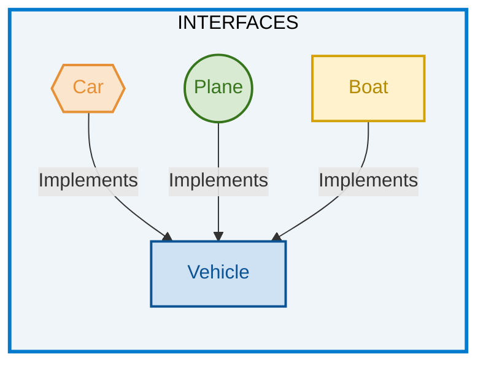

# Interfaces y Relaciones entre Clases en JavaScript

## 1. Interfaces

Una **interfaz** puede entenderse como un contrato que establece qué operaciones debe proporcionar una clase.

En lenguajes como Java existen construcciones específicas para definir interfaces. JavaScript, en cambio, **no posee una palabra reservada `interface` como parte del lenguaje estándar**.

En JavaScript se pueden representar ideas similares mediante:

* Clases base.
* Métodos que lanzan errores.
* Objetos utilizados como contratos.
* Convenciones de diseño.
* Composición.
* Validaciones en tiempo de ejecución.

> [!IMPORTANT]
> Una interfaz no es exactamente una "clase completamente abstracta". Es más preciso entenderla como un **contrato de comportamiento**. JavaScript no tiene interfaces nativas como construcción del lenguaje; TypeScript sí proporciona `interface`.

### Diagrama de interfaces

El siguiente diagrama representa conceptualmente una interfaz `Vehicle` que debe ser implementada por diferentes tipos de vehículos.



El concepto representado sería:

```text
             Vehicle
            /   |   \
           /    |    \
        Car   Plane   Boat
```

Las tres clases deberían cumplir el contrato definido por `Vehicle`.

---

# 2. Relaciones entre clases

Las **relaciones entre clases** representan la manera en que diferentes clases se conectan, colaboran o dependen unas de otras.

Entre las relaciones más comunes se encuentran:

1. **Asociación**
2. **Agregación**
3. **Composición**
4. **Herencia**

Estas relaciones son conceptos de modelado orientado a objetos y pueden representarse mediante diagramas de clases.

En JavaScript no existe una palabra reservada diferente para cada una de estas relaciones. Se representan mediante referencias entre objetos, composición, `extends` y otras estructuras del lenguaje.

---

# 3. Multiplicidad

La **multiplicidad** indica cuántas instancias de una clase pueden participar en una relación con una instancia de otra clase.

Algunos valores comunes son:

| Multiplicidad | Significado               |
| ------------- | ------------------------- |
| `1`           | Exactamente una instancia |
| `0..1`        | Cero o una instancia      |
| `*`           | Cero o muchas instancias  |
| `1..*`        | Una o muchas instancias   |
| `0..*`        | Cero o muchas instancias  |

Por ejemplo:

```text
Empresa 1 ───────── * Empleado
```

significa que:

> Una empresa puede estar relacionada con muchos empleados.

---

# 4. Asociación

Una **asociación** representa una relación entre objetos que permite que una clase conozca o utilice objetos de otra clase.

En JavaScript esta relación normalmente se implementa mediante **referencias entre objetos**.

Existen diferentes formas de asociación. Las principales estudiadas aquí son:

* Asociación unidireccional.
* Asociación bidireccional.

---

# 5. Asociación unidireccional

En una asociación unidireccional, una clase mantiene una referencia hacia otra clase, pero la segunda no mantiene necesariamente una referencia hacia la primera.

Por ejemplo:

```text
Empleado ───────> Empresa
```

El empleado conoce a la empresa, pero la empresa no tiene una referencia al empleado.

## 5.1 Código completo

```javascript
// 1. Clase Empresa
class Empresa {
    constructor(nombre) {
        this.nombre = nombre;
    }
}

// 2. Clase Empleado
class Empleado {
    constructor(nombre, empresa) {
        this.nombre = nombre;
        this.empresa = empresa;
    }
}

// 3. Crear objetos
const empresa1 = new Empresa("Acme Corp");
const empleado1 = new Empleado("Anita", empresa1);
```

---

## 5.2 Desglose del código

### 5.2.1 Clase `Empresa`

```javascript
class Empresa {
    constructor(nombre) {
        this.nombre = nombre;
    }
}
```

La clase `Empresa` representa una empresa.

El constructor recibe:

```javascript
nombre
```

y lo almacena en:

```javascript
this.nombre
```

Por ejemplo:

```javascript
const empresa1 = new Empresa("Acme Corp");
```

produce conceptualmente:

```text
empresa1
└── nombre: "Acme Corp"
```

---

### 5.2.2 Clase `Empleado`

```javascript
class Empleado {
    constructor(nombre, empresa) {
        this.nombre = nombre;
        this.empresa = empresa;
    }
}
```

`Empleado` recibe dos datos:

```text
nombre
empresa
```

La propiedad:

```javascript
this.empresa = empresa;
```

es la que establece la relación.

---

### 5.2.3 Crear la empresa

```javascript
const empresa1 = new Empresa("Acme Corp");
```

Se crea una instancia de `Empresa`.

```text
empresa1
└── nombre: "Acme Corp"
```

---

### 5.2.4 Crear el empleado

```javascript
const empleado1 = new Empleado("Anita", empresa1);
```

Aquí se pasa el objeto `empresa1` como argumento.

Por lo tanto:

```text
empleado1
├── nombre: "Anita"
└── empresa ─────> empresa1
```

Esto establece una **asociación unidireccional**.

La dirección conceptual es:

```text
Empleado ─────> Empresa
```

---

# 6. Asociación bidireccional

En una asociación bidireccional, ambos objetos mantienen referencias que permiten navegar la relación en ambos sentidos.

```text
Empresa ─────> Empleado
   ▲              │
   └──────────────┘
```

En el ejemplo:

* `Empresa` mantiene una colección de empleados.
* `Empleado` mantiene una referencia a su empresa.

Por lo tanto, podemos navegar:

```javascript
empresa.empleados
```

y también:

```javascript
empleado.empresa
```

---

## 6.1 Código completo

```javascript
// 1. Clase Empresa
class Empresa {
    constructor(nombre) {
        this.nombre = nombre;
        this.empleados = [];
    }

    agregarEmpleado(empleado) {
        this.empleados.push(empleado);
        empleado.setEmpresa(this);
    }
}

// 2. Clase Empleado
class Empleado {
    constructor(nombre) {
        this.nombre = nombre;
        this.empresa = null;
    }

    setEmpresa(empresa) {
        this.empresa = empresa;
    }
}

// 3. Crear objetos
const empresa1 = new Empresa("Acme Corp");
const empleado1 = new Empleado("Anita");

// 4. Establecer relación
empresa1.agregarEmpleado(empleado1);

// 5. Comprobar relación
console.log("acme> ", empresa1.empleados[0].nombre);
console.log("empleado> ", empleado1.empresa.nombre);
```

---

## 6.2 Desglose del código

### 6.2.1 La empresa tiene una colección

```javascript
class Empresa {
    constructor(nombre) {
        this.nombre = nombre;
        this.empleados = [];
    }
}
```

La propiedad:

```javascript
this.empleados = [];
```

crea un arreglo donde se almacenarán los empleados relacionados con la empresa.

Inicialmente:

```text
empresa1
├── nombre: "Acme Corp"
└── empleados: []
```

---

### 6.2.2 Agregar un empleado

```javascript
agregarEmpleado(empleado) {
    this.empleados.push(empleado);
    empleado.setEmpresa(this);
}
```

Este método establece las dos direcciones de la relación.

Primero:

```javascript
this.empleados.push(empleado);
```

agrega el empleado a la empresa.

Después:

```javascript
empleado.setEmpresa(this);
```

le indica al empleado cuál es su empresa.

---

### 6.2.3 ¿Qué significa `this` aquí?

Dentro de:

```javascript
empresa1.agregarEmpleado(empleado1);
```

`this` representa:

```text
empresa1
```

Por eso:

```javascript
empleado.setEmpresa(this);
```

equivale conceptualmente a:

```javascript
empleado.setEmpresa(empresa1);
```

---

### 6.2.4 Crear el empleado

```javascript
const empleado1 = new Empleado("Anita");
```

Inicialmente:

```text
empleado1
├── nombre: "Anita"
└── empresa: null
```

Todavía no existe una relación.

---

### 6.2.5 Establecer la relación

```javascript
empresa1.agregarEmpleado(empleado1);
```

Después de ejecutarlo:

```text
empresa1
├── nombre: "Acme Corp"
└── empleados
       └── empleado1
              ├── nombre: "Anita"
              └── empresa ─────> empresa1
```

Ahora se puede navegar en ambos sentidos:

```javascript
empresa1.empleados[0]
```

y:

```javascript
empleado1.empresa
```

---

### 6.2.6 Comprobar la relación

```javascript
console.log(empresa1.empleados[0].nombre);
console.log(empleado1.empresa.nombre);
```

El primer acceso navega:

```text
empresa → empleados → primer empleado → nombre
```

El segundo:

```text
empleado → empresa → nombre
```

---

# 7. Agregación

La **agregación** representa una relación de tipo **todo-parte** en la que el objeto contenido puede existir independientemente del objeto que lo contiene.

Por ejemplo:

```text
Equipo ─────> Jugador
```

Un jugador puede existir antes de pertenecer a un equipo y puede continuar existiendo aunque deje de pertenecer a ese equipo.

---

## 7.1 Código completo

```javascript
// 1. Clase Jugador
class Jugador {
    constructor(nombre) {
        this.nombre = nombre;
    }
}

// 2. Clase Equipo
class Equipo {
    constructor(nombre) {
        this.nombre = nombre;
        this.jugadores = [];
    }

    agregarJugador(jugador) {
        this.jugadores.push(jugador);
    }
}

// 3. Crear jugadores
const jugador1 = new Jugador("Pele");
const jugador2 = new Jugador("Maradona");

// 4. Crear equipo
const elMejorEquipo = new Equipo("The Best");

// 5. Establecer relaciones
elMejorEquipo.agregarJugador(jugador1);
elMejorEquipo.agregarJugador(jugador2);
```

---

## 7.2 Desglose del código

### 7.2.1 Clase `Jugador`

```javascript
class Jugador {
    constructor(nombre) {
        this.nombre = nombre;
    }
}
```

Cada jugador es un objeto independiente.

```javascript
const jugador1 = new Jugador("Pele");
const jugador2 = new Jugador("Maradona");
```

Los jugadores existen independientemente del equipo.

---

### 7.2.2 Clase `Equipo`

```javascript
class Equipo {
    constructor(nombre) {
        this.nombre = nombre;
        this.jugadores = [];
    }
}
```

El equipo mantiene una colección de jugadores.

```javascript
this.jugadores = [];
```

---

### 7.2.3 Agregar jugadores

```javascript
agregarJugador(jugador) {
    this.jugadores.push(jugador);
}
```

El método recibe un objeto `Jugador` que ya existe y guarda una referencia hacia él.

Esto es importante.

El `Equipo` **no crea al jugador**:

```javascript
const jugador1 = new Jugador("Pele");
```

se creó independientemente.

Posteriormente:

```javascript
elMejorEquipo.agregarJugador(jugador1);
```

lo relaciona con el equipo.

---

## 7.3 Representación conceptual

```text
jugador1 ─────────┐
                  ▼
             The Best
                  ▲
jugador2 ─────────┘
```

Los jugadores pueden existir independientemente del equipo.

> [!IMPORTANT]
> La agregación es principalmente una **relación conceptual de modelado**. JavaScript no elimina automáticamente los objetos "contenidos" cuando desaparece el contenedor. La vida de los objetos depende de si todavía existen referencias hacia ellos y del recolector de basura.

---

# 8. Composición

La **composición** también representa una relación de tipo **todo-parte**, pero expresa una relación de propiedad más fuerte.

Conceptualmente:

```text
Casa ─────> Habitación
```

En el ejemplo, la `Casa` crea sus propias habitaciones.

A diferencia de la agregación:

```javascript
new Habitacion(...)
```

se ejecuta dentro de la operación de creación de la parte.

---

## 8.1 Código completo

```javascript
// 1. Clase Habitacion
class Habitacion {
    constructor(tipo) {
        this.tipo = tipo;
    }
}

// 2. Clase Casa
class Casa {
    constructor(direccion) {
        this.direccion = direccion;
        this.habitaciones = [];
    }

    agregarHabitacion(tipo) {
        const habitacion = new Habitacion(tipo);
        this.habitaciones.push(habitacion);
    }
}

// 3. Crear casa
const micasa = new Casa("Av. Siempre Viva con Calle Falsa");

// 4. Agregar habitaciones
micasa.agregarHabitacion("Sala");
micasa.agregarHabitacion("Cocina");
micasa.agregarHabitacion("Sala de estar");
micasa.agregarHabitacion("Jardín");
micasa.agregarHabitacion("Baño");

// 5. Acceder a habitaciones
console.log(micasa.habitaciones[0].tipo);
console.log(micasa.habitaciones[1].tipo);
console.log(micasa.habitaciones[2].tipo);
```

---

## 8.2 Desglose del código

### 8.2.1 Clase `Habitacion`

```javascript
class Habitacion {
    constructor(tipo) {
        this.tipo = tipo;
    }
}
```

Representa una habitación individual.

Puede recibir diferentes tipos:

```text
Sala
Cocina
Sala de estar
Jardín
Baño
```

---

### 8.2.2 Clase `Casa`

```javascript
class Casa {
    constructor(direccion) {
        this.direccion = direccion;
        this.habitaciones = [];
    }
}
```

La casa contiene una colección de habitaciones.

---

### 8.2.3 Crear una habitación dentro de la casa

La parte fundamental de la composición está aquí:

```javascript
agregarHabitacion(tipo) {
    const habitacion = new Habitacion(tipo);
    this.habitaciones.push(habitacion);
}
```

La casa recibe únicamente:

```javascript
tipo
```

y se encarga de crear el objeto:

```javascript
new Habitacion(tipo)
```

Después guarda la referencia:

```javascript
this.habitaciones.push(habitacion);
```

---

### 8.2.4 Crear la casa

```javascript
const micasa = new Casa(
    "Av. Siempre Viva con Calle Falsa"
);
```

Se crea el objeto principal.

Inicialmente:

```text
micasa
├── direccion
└── habitaciones: []
```

---

### 8.2.5 Agregar habitaciones

```javascript
micasa.agregarHabitacion("Sala");
micasa.agregarHabitacion("Cocina");
micasa.agregarHabitacion("Sala de estar");
micasa.agregarHabitacion("Jardín");
micasa.agregarHabitacion("Baño");
```

Cada llamada crea una nueva instancia de `Habitacion`.

Conceptualmente:

```text
Casa
├── Habitacion("Sala")
├── Habitacion("Cocina")
├── Habitacion("Sala de estar")
├── Habitacion("Jardín")
└── Habitacion("Baño")
```

---

## 8.3 Agregación vs composición

La diferencia fundamental está en **quién crea y controla conceptualmente las partes**.

| Característica                       | Agregación          | Composición               |
| ------------------------------------ | ------------------- | ------------------------- |
| Relación                             | Todo-parte          | Todo-parte                |
| Fuerza                               | Más débil           | Más fuerte                |
| Parte independiente                  | Sí                  | Conceptualmente no        |
| Quién crea la parte                  | Puede crearse fuera | Normalmente el contenedor |
| Ejemplo                              | Equipo → Jugador    | Casa → Habitación         |
| Referencia externa                   | Normalmente posible | Conceptualmente se evita  |
| JavaScript la impone automáticamente | No                  | No                        |

### Agregación

```javascript
const jugador = new Jugador("Pele");

equipo.agregarJugador(jugador);
```

El jugador ya existía.

### Composición

```javascript
agregarHabitacion(tipo) {
    const habitacion = new Habitacion(tipo);
    this.habitaciones.push(habitacion);
}
```

La casa crea la habitación.

> [!WARNING]
> No debe interpretarse literalmente que JavaScript "destruye" las habitaciones cuando desaparece una casa. JavaScript utiliza **recolección de basura** basada en referencias alcanzables. La composición describe principalmente una relación de propiedad y ciclo de vida a nivel de diseño; no existe un destructor automático de objetos por pertenecer a un contenedor.

---

# 9. Aplicación completa: gestión de cursos

El siguiente programa reúne varios conceptos estudiados anteriormente:

* Clases.
* Objetos.
* Encapsulamiento.
* Campos privados.
* Getters.
* Setters.
* Asociación entre objetos.
* Composición.
* Colecciones de objetos.
* Funciones asíncronas.
* `readline`.
* Módulos ES.
* Menú interactivo.

El programa permite administrar cursos y estudiantes desde la terminal.

---

# 10. Código completo

```javascript
// 1. Importar readline
import * as readline from "readline/promises";

// 2. Crear interfaz
const rl = readline.createInterface({
    input: process.stdin,
    output: process.stdout
});

// 3. Clase Estudiante
class Estudiante {
    constructor(dpi, nombre, edad, genero) {
        this.dpi = dpi;
        this.nombre = nombre;
        this.edad = edad;
        this.genero = genero;
    }
}

// 4. Clase Curso
class Curso {
    #codigo = "000";
    #nombre = "SIN NOMBRE";
    #capacidad = 0;
    #estudiantes = [];

    constructor(nombre, capacidad, codigo) {
        this.nombre = nombre;
        this.capacidad = capacidad;
        this.codigo = codigo;
    }

    set codigo(codigo) {
        this.#codigo = codigo.toUpperCase();
    }

    set nombre(nombre) {
        this.#nombre = nombre.toUpperCase();
    }

    set capacidad(valor) {
        this.#capacidad = valor > 0 ? valor : 1;
    }

    get codigo() {
        return this.#codigo;
    }

    get nombre() {
        return this.#nombre;
    }

    get capacidad() {
        return this.#capacidad;
    }

    get estudiantes() {
        return this.#estudiantes;
    }

    agregarEstudiante(dpi, nombre, edad, genero) {
        const estudiante = new Estudiante(
            dpi,
            nombre,
            edad,
            genero
        );

        this.#estudiantes.push(estudiante);
    }
}

// 5. Crear curso
const crearCurso = async () => {
    console.clear();

    console.log("============= GESTIÓN DE CURSOS =================");
    console.log("============= CREAR CURSO =================\n");

    const codigoCurso = await rl.question(
        "--> Código del curso: "
    );

    const nombreCurso = await rl.question(
        "--> Nombre del curso: "
    );

    const capacidadCurso = await rl.question(
        "--> Capacidad del curso: "
    );

    cursos.push(
        new Curso(
            nombreCurso,
            Number(capacidadCurso),
            codigoCurso
        )
    );

    console.log("Curso creado satisfactoriamente");
};

// 6. Agregar estudiante
const agregarEstudiante = async () => {
    console.clear();

    console.log("============= GESTIÓN DE CURSOS =================");
    console.log("============= AGREGAR ESTUDIANTE =================\n");

    const codCurso = await rl.question(
        "---> Código del curso: "
    );

    const index = cursos.findIndex(
        c => c.codigo === codCurso.toUpperCase()
    );

    if (index >= 0) {
        console.log("== Curso: " + cursos[index].nombre);

        const dpi = await rl.question("--> DPI: ");
        const nombre = await rl.question("--> Nombre: ");
        const edad = await rl.question("--> Edad: ");
        const genero = await rl.question("--> Género: ");

        cursos[index].agregarEstudiante(
            dpi,
            nombre,
            edad,
            genero
        );

        console.log(
            "--> ¡Estudiante agregado al curso exitosamente!"
        );
    } else {
        console.log("--> Curso no encontrado.....");
    }

    await rl.question(
        "----> Presione Enter para continuar... "
    );
};

// 7. Listar cursos
const listarCursos = async () => {
    console.clear();

    console.log("============= GESTIÓN DE CURSOS =================");
    console.log("============= LISTAR CURSOS =================\n");

    cursos.forEach(c => {
        console.log(`Código: ${c.codigo}`);
        console.log(`Nombre: ${c.nombre}`);
        console.log(`Capacidad: ${c.capacidad}`);
        console.log("-----------------------------------------------");
    });

    await rl.question(
        "----> Presione Enter para continuar... "
    );
};

// 8. Listar estudiantes
const listarEstudiante = async () => {
    console.clear();

    console.log("============= GESTIÓN DE CURSOS =================");
    console.log("============= LISTAR ESTUDIANTES ================\n");

    const codCurso = await rl.question(
        "---> Código del curso: "
    );

    const index = cursos.findIndex(
        c => c.codigo === codCurso.toUpperCase()
    );

    if (index >= 0) {
        console.log(
            `== Curso: ${cursos[index].nombre}\n`
        );

        cursos[index].estudiantes.forEach(e => {
            console.log(`DPI: ${e.dpi}`);
            console.log(`Nombre: ${e.nombre}`);
            console.log(`Edad: ${e.edad}`);
            console.log(`Género: ${e.genero}`);
            console.log("-----------------------------------------------");
        });
    } else {
        console.log("--> Curso no encontrado.....");
    }

    await rl.question(
        "----> Presione Enter para continuar... "
    );
};

// 9. Estado del programa
let opc = "1";
const cursos = [];

// 10. Menú principal
while (opc !== "0") {
    console.clear();

    console.log("============= GESTIÓN DE CURSOS =================");
    console.log("1. Crear Curso");
    console.log("2. Agregar Estudiante");
    console.log("3. Listar Cursos");
    console.log("4. Listar Estudiantes");
    console.log("0. Salir");

    opc = await rl.question(
        "--->> Elija una opción: "
    );

    switch (opc) {
        case "0":
            console.log("Saliendo del programa...");
            break;

        case "1":
            await crearCurso();
            break;

        case "2":
            await agregarEstudiante();
            break;

        case "3":
            await listarCursos();
            break;

        case "4":
            await listarEstudiante();
            break;

        default:
            console.log("Opción no válida");
    }
}

// 11. Cerrar readline
rl.close();
```

---

# 11. Desglose del programa

## 11.1 Importar `readline`

```javascript
import * as readline from "readline/promises";
```

Se importa el módulo `readline/promises` de Node.js.

La versión basada en promesas permite utilizar:

```javascript
await rl.question(...)
```

en lugar de trabajar con callbacks.

Esto facilita la lectura secuencial de información desde la terminal.

---

# 12. Crear la interfaz de terminal

```javascript
const rl = readline.createInterface({
    input: process.stdin,
    output: process.stdout
});
```

`createInterface()` crea una interfaz entre el programa y la terminal.

### `process.stdin`

Representa la entrada estándar.

En este caso:

```text
Teclado → process.stdin
```

### `process.stdout`

Representa la salida estándar.

```text
process.stdout → Terminal
```

Por lo tanto:

```text
Usuario
   │
   ▼
Teclado
   │
   ▼
process.stdin
   │
   ▼
readline
   │
   ▼
Programa
```

---

# 13. Clase `Estudiante`

```javascript
class Estudiante {
    constructor(dpi, nombre, edad, genero) {
        this.dpi = dpi;
        this.nombre = nombre;
        this.edad = edad;
        this.genero = genero;
    }
}
```

La clase representa un estudiante.

Cada instancia contiene:

```text
dpi
nombre
edad
genero
```

Por ejemplo:

```javascript
const estudiante = new Estudiante(
    "1234567890101",
    "Anita",
    20,
    "F"
);
```

produce conceptualmente:

```text
Estudiante
├── dpi
├── nombre
├── edad
└── genero
```

---

# 14. Clase `Curso`

```javascript
class Curso {
    #codigo = "000";
    #nombre = "SIN NOMBRE";
    #capacidad = 0;
    #estudiantes = [];
}
```

Esta clase utiliza **campos privados**.

El prefijo:

```javascript
#
```

hace que los campos sean privados para el cuerpo de la clase.

Por ejemplo:

```javascript
#codigo
```

no puede utilizarse directamente desde fuera:

```javascript
curso.#codigo;
```

Esto genera un error.

---

# 15. Constructor de `Curso`

```javascript
constructor(nombre, capacidad, codigo) {
    this.nombre = nombre;
    this.capacidad = capacidad;
    this.codigo = codigo;
}
```

Aquí existe un detalle importante.

Aunque los campos sean privados:

```javascript
#nombre
#capacidad
#codigo
```

el constructor no modifica directamente:

```javascript
this.#nombre
```

sino que utiliza:

```javascript
this.nombre
this.capacidad
this.codigo
```

Estas propiedades corresponden a setters.

Por ejemplo:

```javascript
this.nombre = nombre;
```

provoca la ejecución de:

```javascript
set nombre(nombre) {
    this.#nombre = nombre.toUpperCase();
}
```

Por lo tanto, el constructor está utilizando los **setters** para establecer los valores.

---

# 16. Setter `codigo`

```javascript
set codigo(codigo) {
    this.#codigo = codigo.toUpperCase();
}
```

Permite asignar el código mediante:

```javascript
curso.codigo = "mat101";
```

pero internamente almacena:

```text
MAT101
```

El setter transforma el valor mediante:

```javascript
toUpperCase()
```

---

# 17. Setter `nombre`

```javascript
set nombre(nombre) {
    this.#nombre = nombre.toUpperCase();
}
```

Hace lo mismo con el nombre.

Si recibimos:

```text
programación
```

se almacena:

```text
PROGRAMACIÓN
```

---

# 18. Setter `capacidad`

```javascript
set capacidad(valor) {
    this.#capacidad = valor > 0 ? valor : 1;
}
```

Utiliza un operador ternario:

```javascript
condición ? valorSiVerdadero : valorSiFalso
```

Por lo tanto:

```javascript
valor > 0 ? valor : 1
```

significa:

```text
Si valor > 0
    guardar valor
si no
    guardar 1
```

Ejemplos:

```javascript
curso.capacidad = 30;
```

guarda:

```text
30
```

Mientras que:

```javascript
curso.capacidad = 0;
```

guarda:

```text
1
```

---

# 19. Getters

Los getters permiten leer los campos privados mediante una propiedad pública.

```javascript
get codigo() {
    return this.#codigo;
}

get nombre() {
    return this.#nombre;
}

get capacidad() {
    return this.#capacidad;
}
```

Esto permite escribir:

```javascript
curso.codigo
```

en lugar de:

```javascript
curso.getCodigo()
```

El getter se utiliza como propiedad, no como método.

---

# 20. Getter `estudiantes`

```javascript
get estudiantes() {
    return this.#estudiantes;
}
```

Permite acceder al arreglo privado:

```javascript
curso.estudiantes
```

y recorrerlo:

```javascript
curso.estudiantes.forEach(...)
```

> [!WARNING]
> En este ejemplo el getter devuelve directamente el arreglo privado. Por tanto, código externo puede modificarlo:
>
> ```javascript
> curso.estudiantes.push(...)
> ```
>
> Eso reduce el encapsulamiento. Para una implementación más estricta podría devolverse una copia:
>
> ```javascript
> get estudiantes() {
>     return [...this.#estudiantes];
> }
> ```
>
> El código original es válido para fines didácticos, pero conviene conocer esta diferencia.

---

# 21. `agregarEstudiante()`

```javascript
agregarEstudiante(dpi, nombre, edad, genero) {
    const estudiante = new Estudiante(
        dpi,
        nombre,
        edad,
        genero
    );

    this.#estudiantes.push(estudiante);
}
```

Este método muestra una relación entre `Curso` y `Estudiante`.

El curso recibe los datos:

```text
dpi
nombre
edad
genero
```

Después crea:

```javascript
new Estudiante(...)
```

y finalmente guarda el objeto:

```javascript
this.#estudiantes.push(estudiante);
```

Conceptualmente:

```text
Curso
└── estudiantes
      ├── Estudiante
      ├── Estudiante
      └── Estudiante
```

Aquí aparece una relación de **todo-parte con fuerte control del contenedor**, similar al concepto de composición utilizado anteriormente.

---

# 22. Crear un curso

```javascript
const crearCurso = async () => {
```

Se define una función asíncrona.

Esto permite utilizar:

```javascript
await
```

para esperar las respuestas del usuario.

Por ejemplo:

```javascript
const codigoCurso = await rl.question(
    "--> Código del curso: "
);
```

El programa se detiene en ese punto hasta recibir la entrada.

---

# 23. Crear la instancia de `Curso`

```javascript
cursos.push(
    new Curso(
        nombreCurso,
        Number(capacidadCurso),
        codigoCurso
    )
);
```

Primero:

```javascript
new Curso(...)
```

crea el objeto.

Después:

```javascript
cursos.push(...)
```

lo almacena en la colección general de cursos.

El flujo es:

```text
Datos del usuario
       │
       ▼
new Curso(...)
       │
       ▼
Objeto Curso
       │
       ▼
cursos.push(...)
       │
       ▼
Arreglo cursos
```

---

# 24. Conversión de capacidad

`readline` devuelve los datos introducidos como texto.

Por eso:

```javascript
const capacidadCurso = await rl.question(...);
```

produce un `string`.

Antes de enviarlo al constructor se convierte:

```javascript
Number(capacidadCurso)
```

Por ejemplo:

```text
"30"
```

se convierte en:

```text
30
```

de tipo `number`.

---

# 25. Buscar un curso

En `agregarEstudiante()` se utiliza:

```javascript
const index = cursos.findIndex(
    c => c.codigo === codCurso.toUpperCase()
);
```

`findIndex()` busca el índice del primer elemento que cumple la condición.

Si encuentra:

```text
MAT101
```

podría devolver:

```text
0
```

Si no encuentra ningún curso:

```text
-1
```

Por eso posteriormente se comprueba:

```javascript
if (index >= 0)
```

---

# 26. Agregar un estudiante al curso

Cuando el curso existe:

```javascript
cursos[index].agregarEstudiante(
    dpi,
    nombre,
    edad,
    genero
);
```

se llama al método del objeto `Curso`.

El método:

```javascript
agregarEstudiante()
```

crea internamente el objeto `Estudiante`.

Por lo tanto, el código exterior no necesita hacer:

```javascript
const estudiante = new Estudiante(...);
```

La clase `Curso` controla esa operación.

---

# 27. Listar cursos

```javascript
cursos.forEach(c => {
    console.log(`Código: ${c.codigo}`);
    console.log(`Nombre: ${c.nombre}`);
    console.log(`Capacidad: ${c.capacidad}`);
});
```

`forEach()` recorre todos los objetos almacenados en `cursos`.

Cada elemento se representa mediante:

```javascript
c
```

Por ejemplo:

```text
c → Curso 1
c → Curso 2
c → Curso 3
```

Los getters permiten acceder a:

```javascript
c.codigo
c.nombre
c.capacidad
```

---

# 28. Listar estudiantes

Primero se busca el curso:

```javascript
const index = cursos.findIndex(
    c => c.codigo === codCurso.toUpperCase()
);
```

Después se accede a su colección:

```javascript
cursos[index].estudiantes
```

y se recorren los estudiantes:

```javascript
cursos[index].estudiantes.forEach(e => {
    console.log(`DPI: ${e.dpi}`);
    console.log(`Nombre: ${e.nombre}`);
    console.log(`Edad: ${e.edad}`);
    console.log(`Género: ${e.genero}`);
});
```

Aquí:

```text
c → Curso
e → Estudiante
```

La navegación es:

```text
cursos
   │
   ▼
Curso
   │
   ▼
estudiantes
   │
   ▼
Estudiante
```

---

# 29. Colección principal de cursos

```javascript
const cursos = [];
```

Este arreglo mantiene las instancias de `Curso`.

Por ejemplo:

```text
cursos
├── Curso("MAT101")
├── Curso("PROG201")
└── Curso("BD301")
```

Mientras el programa está ejecutándose, esta colección mantiene las referencias a los cursos creados.

---

# 30. Menú principal

```javascript
while (opc !== "0") {
```

El ciclo continúa mientras la opción sea diferente de `"0"`.

Cada iteración muestra:

```text
1. Crear Curso
2. Agregar Estudiante
3. Listar Cursos
4. Listar Estudiantes
0. Salir
```

Después:

```javascript
opc = await rl.question(
    "--->> Elija una opción: "
);
```

recibe la selección.

---

# 31. `switch`

```javascript
switch (opc) {
    case "0":
        console.log("Saliendo del programa...");
        break;

    case "1":
        await crearCurso();
        break;

    case "2":
        await agregarEstudiante();
        break;

    case "3":
        await listarCursos();
        break;

    case "4":
        await listarEstudiante();
        break;

    default:
        console.log("Opción no válida");
}
```

El `switch` decide qué función ejecutar.

La relación es:

```text
Entrada
   │
   ▼
switch
   ├── "1" → crearCurso()
   ├── "2" → agregarEstudiante()
   ├── "3" → listarCursos()
   ├── "4" → listarEstudiante()
   └── "0" → salir
```

---

# 32. Cerrar `readline`

```javascript
rl.close();
```

Cuando el usuario selecciona `"0"` y termina el ciclo, se cierra la interfaz de `readline`.

---

# 33. Relación entre `Curso` y `Estudiante`

Este programa permite observar una relación importante:

```text
Curso
  │
  ├── código
  ├── nombre
  ├── capacidad
  │
  └── estudiantes
          │
          ├── Estudiante
          ├── Estudiante
          └── Estudiante
```

El `Curso` crea los estudiantes mediante:

```javascript
new Estudiante(...)
```

y mantiene sus referencias en:

```javascript
#estudiantes
```

Esto representa una relación **todo-parte** con características de composición desde el punto de vista del diseño del ejemplo.

---

# 34. Diferencia general entre las relaciones

Una forma práctica de recordarlas es:

```text
HERENCIA
"ES UN"

Perro ─────> Animal


ASOCIACIÓN
"CONOCE / USA"

Empleado ─────> Empresa


AGREGACIÓN
"TIENE, PERO LA PARTE PUEDE EXISTIR SOLA"

Equipo ─────> Jugador


COMPOSICIÓN
"POSEE UNA PARTE CUYO CICLO DE VIDA DEPENDE DEL TODO"

Casa ─────> Habitación
```

---

# 35. Comparación general

| Relación    | Pregunta conceptual                   | Ejemplo                       |
| ----------- | ------------------------------------- | ----------------------------- |
| Herencia    | ¿Es un tipo de...?                    | `Perro` es un `Animal`        |
| Asociación  | ¿Conoce o utiliza...?                 | `Empleado` conoce a `Empresa` |
| Agregación  | ¿Contiene partes independientes?      | `Equipo` contiene `Jugador`   |
| Composición | ¿Posee partes fuertemente vinculadas? | `Casa` contiene `Habitacion`  |

---

# 36. Correcciones importantes de los apuntes

### Interfaces

No es exacto afirmar:

> "Las interfaces son clases completamente abstractas."

Es mejor decir:

> **Una interfaz es un contrato que define los comportamientos que una implementación debe proporcionar.**

JavaScript estándar no tiene una construcción `interface`.

---

### Composición

No es correcto afirmar que JavaScript elimina automáticamente los objetos internos cuando desaparece el contenedor.

La composición representa una relación de **propiedad y ciclo de vida a nivel de diseño**.

El recolector de basura de JavaScript determina cuándo un objeto puede ser reclamado basándose en si existen referencias alcanzables.

---

### Asociación

Una asociación no requiere necesariamente herencia.

Por ejemplo:

```javascript
this.empresa = empresa;
```

establece una relación mediante una referencia, no mediante:

```javascript
extends
```

---

### Agregación

La característica importante es que el objeto contenido puede existir independientemente:

```javascript
const jugador = new Jugador("Pele");
```

y posteriormente:

```javascript
equipo.agregarJugador(jugador);
```

El jugador no fue creado por el equipo.

---

### Composición

En el ejemplo:

```javascript
const habitacion = new Habitacion(tipo);
```

la `Casa` crea sus propias habitaciones.

Por eso el diseño representa una relación de composición.

---

# Glosario

| Término                       | Definición                                                                                                                                      |
| ----------------------------- | ----------------------------------------------------------------------------------------------------------------------------------------------- |
| **Interfaz**                  | Contrato que define los comportamientos que una implementación debe proporcionar.                                                               |
| **Contrato**                  | Conjunto de reglas o comportamientos que una implementación debe cumplir.                                                                       |
| **Clase abstracta**           | Clase utilizada como base conceptual para otras clases y que normalmente no se instancia directamente.                                          |
| **Asociación**                | Relación entre objetos donde uno conoce o utiliza a otro.                                                                                       |
| **Asociación unidireccional** | Relación donde solamente una de las partes mantiene una referencia hacia la otra.                                                               |
| **Asociación bidireccional**  | Relación donde ambas partes mantienen referencias entre sí.                                                                                     |
| **Agregación**                | Relación todo-parte donde las partes pueden existir independientemente del contenedor.                                                          |
| **Composición**               | Relación todo-parte fuerte donde el contenedor tiene una responsabilidad importante sobre la creación y ciclo de vida conceptual de sus partes. |
| **Multiplicidad**             | Indica cuántas instancias pueden participar en una relación.                                                                                    |
| **Referencia**                | Valor que permite acceder a un objeto desde otro objeto.                                                                                        |
| **Todo-parte**                | Relación en la que un objeto representa un conjunto que contiene otras partes.                                                                  |
| **UML**                       | Lenguaje de modelado utilizado para representar visualmente sistemas y relaciones.                                                              |
| **Diagrama de clases**        | Representación visual de clases, atributos, métodos y relaciones.                                                                               |
| **`extends`**                 | Palabra reservada utilizada para establecer herencia entre clases.                                                                              |
| **`this`**                    | Referencia cuyo valor depende del contexto de ejecución; en métodos de instancia permite acceder al objeto correspondiente.                     |
| **Getter**                    | Método accesor que permite obtener un valor utilizando sintaxis de propiedad.                                                                   |
| **Setter**                    | Método accesor que permite asignar un valor utilizando sintaxis de propiedad.                                                                   |
| **Campo privado**             | Propiedad declarada con `#` que solamente puede utilizarse dentro de la clase donde fue declarada.                                              |
| **`readline`**                | Módulo de Node.js utilizado para trabajar con entrada y salida de texto, especialmente desde la terminal.                                       |
| **`stdin`**                   | Entrada estándar del proceso, utilizada aquí para recibir datos del teclado.                                                                    |
| **`stdout`**                  | Salida estándar del proceso, utilizada aquí para mostrar información en la terminal.                                                            |
| **`findIndex()`**             | Método de arrays que devuelve el índice del primer elemento que cumple una condición.                                                           |
| **`forEach()`**               | Método que permite ejecutar una función para cada elemento de un array.                                                                         |
| **Composición de objetos**    | Construcción de objetos utilizando otros objetos o componentes como partes.                                                                     |
| **Recolector de basura**      | Mecanismo de JavaScript que recupera memoria de objetos que ya no pueden ser alcanzados mediante referencias.                                   |

# Resumen

* Una **interfaz** representa conceptualmente un contrato de comportamiento; JavaScript estándar no posee una construcción `interface`.
* Las relaciones entre clases permiten modelar cómo diferentes objetos interactúan.
* La **multiplicidad** indica cuántas instancias participan en una relación.
* La **asociación unidireccional** permite navegar desde una clase hacia otra.
* La **asociación bidireccional** permite navegar en ambos sentidos.
* La **agregación** representa una relación todo-parte en la que las partes pueden existir independientemente.
* La **composición** representa una relación todo-parte más fuerte y expresa una dependencia conceptual del ciclo de vida.
* JavaScript representa estas relaciones mediante referencias entre objetos, composición y otras capacidades del lenguaje; no existe una palabra reservada `agregacion` o `composicion`.
* `this` permite trabajar con la instancia correspondiente dentro de métodos y constructores.
* Los getters y setters permiten controlar cómo se leen y modifican propiedades.
* Los campos `#privados` proporcionan encapsulamiento real dentro de la clase.
* En el programa de gestión de cursos, `Curso` mantiene una colección de objetos `Estudiante`.
* `readline/promises` permite recibir datos de la terminal utilizando `async`/`await`.
* La diferencia entre agregación y composición debe entenderse principalmente como una **decisión de modelado y propiedad**, no como un mecanismo automático de destrucción de objetos en JavaScript.
