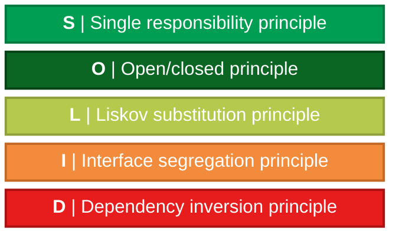

# Principios de diseño — SOLID

## Introducción

Los **principios SOLID** son un conjunto de cinco principios de diseño orientados principalmente a la programación orientada a objetos. Su objetivo es ayudar a construir software que sea más fácil de **entender, mantener, modificar, extender y probar**.

SOLID no representa un conjunto de reglas obligatorias del lenguaje. Son **principios de diseño y heurísticas** que ayudan a controlar la complejidad de los sistemas de software.

Los cinco principios son:

| Letra | Principio                           | Idea principal                                                                        |
| :---: | ----------------------------------- | ------------------------------------------------------------------------------------- |
| **S** | **Single Responsibility Principle** | Una clase debe tener una sola razón para cambiar.                                     |
| **O** | **Open/Closed Principle**           | El software debe estar abierto para extensión y cerrado para modificación.            |
| **L** | **Liskov Substitution Principle**   | Un subtipo debe poder sustituir a su tipo base sin romper el comportamiento esperado. |
| **I** | **Interface Segregation Principle** | Los clientes no deben depender de métodos que no necesitan.                           |
| **D** | **Dependency Inversion Principle**  | Las partes de alto nivel deben depender de abstracciones, no de detalles concretos.   |

Los principios fueron desarrollados y recopilados por **Robert C. Martin** a partir de ideas de diseño orientado a objetos, incluyendo su trabajo de finales de los años 90 y su artículo **Design Principles and Design Patterns**, publicado en 2000. El acrónimo **SOLID** fue acuñado posteriormente por **Michael Feathers** como una forma de recordar los cinco principios.

Es importante aclarar que no todos los principios se originaron exclusivamente con Martin. Por ejemplo, el Open/Closed Principle está relacionado con el trabajo de **Bertrand Meyer**, mientras que el principio de sustitución lleva el nombre de **Barbara Liskov**.

> [!IMPORTANT]
> **SOLID no significa que una clase deba ser pequeña a toda costa ni que siempre debamos crear más clases, interfaces o abstracciones.**
>
> Son principios para gestionar la complejidad y el cambio. Aplicarlos mecánicamente puede producir sobreingeniería.

---

# 1. Los cinco principios SOLID

El acrónimo representa:

```text
S → Single Responsibility Principle
O → Open/Closed Principle
L → Liskov Substitution Principle
I → Interface Segregation Principle
D → Dependency Inversion Principle
```

El objetivo general puede resumirse como:

```text
Código fácil de entender
        ↓
Menor acoplamiento
        ↓
Mayor cohesión
        ↓
Cambios más localizados
        ↓
Software más mantenible
```

### Diagrama original



---

# 2. Acoplamiento y cohesión

Antes de estudiar SOLID conviene comprender dos conceptos que aparecen constantemente en diseño de software:

* **Acoplamiento**
* **Cohesión**

Estos conceptos ayudan a evaluar cómo están organizadas las responsabilidades y dependencias dentro de un sistema.

---

## 2.1 Acoplamiento

El **acoplamiento** representa el nivel de dependencia o interconexión entre diferentes unidades de software.

Estas unidades pueden ser:

* Clases.
* Módulos.
* Funciones.
* Métodos.
* Componentes.
* Subtipos.
* Servicios.

Por ejemplo, si una clase depende directamente de muchas clases concretas, existe un mayor nivel de acoplamiento.

### Bajo acoplamiento

Un sistema con **bajo acoplamiento** intenta que los cambios realizados en un componente tengan un impacto reducido sobre otros componentes.

Esto favorece:

* Mantenibilidad.
* Reutilización.
* Flexibilidad.
* Pruebas.
* Evolución del software.

---

## 2.2 Cohesión

La **cohesión** representa qué tan relacionadas están las responsabilidades internas de un componente.

Un componente tiene **alta cohesión** cuando sus elementos trabajan alrededor de un objetivo común.

Por ejemplo:

```text
Clase Reporte
├── crear reporte
├── modificar reporte
└── obtener información del reporte
```

Estas responsabilidades están relacionadas.

En cambio:

```text
Clase Reporte
├── crear reporte
├── conectarse a MySQL
├── enviar correo
├── generar HTML
└── comprimir archivos ZIP
```

La clase contiene responsabilidades diferentes y, por lo tanto, presenta una cohesión menor.

---

## 2.3 Relación entre cohesión y acoplamiento

En diseño de software generalmente se busca:

```text
ALTA COHESIÓN
      +
BAJO ACOPLAMIENTO
      ↓
MEJOR DISEÑO
```

El objetivo no es conseguir valores matemáticos concretos, sino organizar el sistema de manera que cada componente tenga responsabilidades relacionadas y dependa lo menos posible de detalles innecesarios de otros componentes.

### Diagrama original

```mermaid
block-beta
   columns 3
   Q1["<div style='padding:15px; text-align\:center;'><span style='color:#d32f2f; font-weight\:bold; font-size:22px;'>Malo™</span><br/><br/>Baja cohesión<br/><b><span style='border-bottom:3px double #d32f2f;'>Alto acoplamiento</span></b></div>"]:1
   Y\_AXIS["<div style='writing-mode: vertical-rl; transform: rotate(180deg); color:#b71c1c; font-weight\:bold; font-size:16px; padding:10px;'>▲ Acoplamiento ▲</div>"]:1
   Q2["<div style='padding:15px; text-align\:center;'><span style='color:#f57c00; font-weight\:bold; font-size:28px;'>¿?</span><br/><br/>Alta cohesión<br/>Alto acoplamiento</div>"]:1
   X\_LINE["<div style='border-top: 3px solid #b71c1c;'></div>"]:3
   Q3["<div style='padding:15px; text-align\:center;'><br/>Baja cohesión<br/>Bajo acoplamiento<br/><br/><span style='color:#f57c00; font-weight\:bold; font-size:28px;'>¿?</span></div>"]:1
   CENTER["<div style='color:#b71c1c; font-weight\:bold; text-align\:left; padding-left:5px;'>Cohesión ►</div>"]:1
   Q4["<div style='padding:15px; text-align\:center;'><br/>Alta cohesión<br/>Bajo acoplamiento<br/><br/><span style='color:#2e7d32; font-weight\:bold; font-size:22px; border-top:3px double #2e7d32; display\:inline-block; padding-top:4px;'>Bueno™</span></div>"]:1
   style Q1 fill:#fafafa,stroke:#e0e0e0
   style Q2 fill:#fafafa,stroke:#e0e0e0
   style Q3 fill:#fafafa,stroke:#e0e0e0
   style Q4 fill:#fafafa,stroke:#e0e0e0
   style Y\_AXIS fill\:none,stroke\:none
   style X\_LINE fill\:none,stroke\:none
   style CENTER fill\:none,stroke\:none
```

> [!IMPORTANT]
> Una forma sencilla de recordar la relación es:
>
> **Alta cohesión dentro de los componentes + bajo acoplamiento entre componentes.**

---

# 3. Single Responsibility Principle — SRP

## Principio de responsabilidad única

El **Single Responsibility Principle (SRP)** establece que una clase debe tener **una sola razón para cambiar**.

Una interpretación demasiado simplificada sería:

> "Una clase debe hacer una sola cosa."

Esta explicación puede servir como introducción, pero la formulación más precisa es:

> Una clase debería tener una sola razón para cambiar.

La idea de **razón para cambiar** ayuda a identificar responsabilidades diferentes.

Por ejemplo, si una clase cambia cuando:

* cambian las reglas de negocio;
* cambia la forma de guardar información;
* cambia el formato HTML;

entonces posiblemente contiene responsabilidades diferentes.

---

## 3.1 ¿Qué problema intenta evitar?

Sin SRP, una sola clase puede terminar encargándose de:

```text
Modelo
   +
Persistencia
   +
Presentación
   +
Formato
   +
Comunicación externa
```

Esto aumenta la cantidad de motivos por los que esa clase puede necesitar modificaciones.

Como consecuencia, un cambio aparentemente pequeño puede afectar código que no debería estar relacionado.

---

## 3.2 Código completo

### Ejemplo sin aplicar SRP y aplicando SRP

```javascript
// REPORTE SIN SRP
class Reporte {
  constructor(titulo, contenido) {
    this.titulo = titulo;
    this.contenido = contenido;
  }

  obtenerDatos() {
    return {
      titulo: this.titulo,
      contenido: this.contenido
    };
  }

  guardarDatosEnBD() {
    console.log(`Guardando el reporte ${this.titulo} en la base de datos`);
  }

  generaHTML() {
    return `
      <div>
        <h1>${this.titulo}</h1>
        <p>${this.contenido}</p>
      </div>
    `;
  }
}

// CREAR REPORTE
const reporte = new Reporte(
  'Ventas 1Q',
  'Las ventas subieron 15%'
);

reporte.guardarDatosEnBD();
console.log(reporte.generaHTML());

// REPORTE APLICANDO SRP
class ReporteSRP {
  constructor(titulo, contenido) {
    this.titulo = titulo;
    this.contenido = contenido;
  }

  obtenerDatos1() {
    return {
      titulo: this.titulo,
      contenido: this.contenido
    };
  }
}

// PERSISTENCIA
class RepositorioReporte {
  guardar(reporte) {
    const datos = reporte.obtenerDatos1();

    console.log(
      `Guardando el reporte ${datos.titulo} en la base de datos`
    );
  }
}

// PRESENTACION
class FormateadorReporteHTML {
  generar(reporte) {
    const datos = reporte.obtenerDatos1();

    return `
      <div>
        <h1>${datos.titulo}</h1>
        <p>${datos.contenido}</p>
      </div>
    `;
  }
}

// CREAR REPORTE SRP
const reporte2 = new ReporteSRP(
  'Ventas 1Q',
  'Las ventas subieron 15%'
);

// GUARDAR Y FORMATEAR
const repositorio = new RepositorioReporte();
repositorio.guardar(reporte2);

const formateado = new FormateadorReporteHTML();
console.log(formateado.generar(reporte2));
```

---

## 3.3 Explicación del código

### Clase `Reporte`

En la primera versión:

```javascript
class Reporte {
  constructor(titulo, contenido) {
    this.titulo = titulo;
    this.contenido = contenido;
  }
}
```

La clase representa la información del reporte.

Sin embargo, además de representar los datos, también se encarga de otras tareas.

---

### Persistencia

```javascript
guardarDatosEnBD() {
  console.log(
    `Guardando el reporte ${this.titulo} en la base de datos`
  );
}
```

Esta responsabilidad está relacionada con el almacenamiento.

El reporte ahora conoce una preocupación que pertenece a la persistencia.

---

### Presentación

```javascript
generaHTML() {
  return `
    <div>
      <h1>${this.titulo}</h1>
      <p>${this.contenido}</p>
    </div>
  `;
}
```

Esta responsabilidad está relacionada con la presentación HTML.

Ahora la misma clase tiene responsabilidades relacionadas con:

```text
Datos del reporte
Persistencia
Presentación
```

Esto es lo que el segundo ejemplo intenta separar.

---

## 3.4 Aplicando SRP

La segunda versión divide las responsabilidades:

```text
ReporteSRP
    ↓
Representar los datos

RepositorioReporte
    ↓
Guardar el reporte

FormateadorReporteHTML
    ↓
Generar HTML
```

Cada componente tiene una responsabilidad más específica.

> [!NOTE]
> Aplicar SRP no significa que cada clase deba contener exactamente un método. Significa que sus responsabilidades deben estar relacionadas y tener una razón coherente para cambiar.

---

# 4. Open/Closed Principle — OCP

## Principio abierto/cerrado

El **Open/Closed Principle (OCP)** establece que las entidades de software deben estar:

> **Abiertas para extensión, pero cerradas para modificación.**

Esto significa que debemos poder agregar nuevo comportamiento sin tener que modificar constantemente código existente que ya funciona.

Una forma frecuente de conseguirlo es utilizar:

* Abstracciones.
* Polimorfismo.
* Composición.
* Inyección de dependencias.
* Estrategias.
* Interfaces cuando el lenguaje las soporte.

La herencia es una posibilidad, pero **no es la única forma de aplicar OCP**.

---

## 4.1 El problema

Un enfoque inicial podría utilizar una cadena de condiciones:

```javascript
class CalculadoraEnvio {
  calcularCosto(pedido) {
    if (pedido.tipoEnvio === 'estandar') {
      return pedido.peso * 2.5;
    } else if (pedido.tipoEnvio === 'express') {
      return pedido.peso * 5.0;
    } else if (pedido.tipoEnvio === 'internacional') {
      return pedido.peso * 10.0 + 20.0;
    }
  }
}
```

Si posteriormente aparece:

```text
Envío por dron
```

sería necesario modificar `CalculadoraEnvio`.

Cada nuevo tipo de envío obliga a editar una clase existente.

---

## 4.2 Código completo aplicando OCP

```javascript
// CLASE BASE
class Envio {
  calcular() {
    throw new Error('Implementar método abstracto');
  }
}

// ENVIO ESTANDAR
class EnvioEstandar extends Envio {
  calcular(peso) {
    return peso * 2.5;
  }
}

// ENVIO EXPRESS
class EnvioExpress extends Envio {
  calcular(peso) {
    return peso * 5.0;
  }
}

// ENVIO INTERNACIONAL
class EnvioInternacional extends Envio {
  calcular(peso) {
    return peso * 10.0 + 20.0;
  }
}

// ENVIO POR DRON
class EnvioDron extends Envio {
  calcular(peso) {
    return peso * 15;
  }
}

// CALCULADORA
class CalculadoraEnvio {
  calcularCosto(pedido, estrategiaEnvio) {
    return estrategiaEnvio.calcular(pedido.peso);
  }
}

// EJECUTAR EJEMPLO
const pedido = {
  peso: 10
};

const calculadora = new CalculadoraEnvio();

console.log(
  calculadora.calcularCosto(
    pedido,
    new EnvioEstandar()
  )
);
```

---

## 4.3 Corrección técnica del código original

En el código original aparecía:

```javascript
throw new error('implmentar metodo abstacto')
```

La forma correcta es:

```javascript
throw new Error('Implementar método abstracto');
```

JavaScript distingue entre `Error` y `error`.

Además, `Error` es un objeto integrado de JavaScript que puede utilizarse para representar errores.

> [!WARNING]
> JavaScript no proporciona clases abstractas mediante una palabra clave `abstract` como algunos lenguajes. En este ejemplo, `Envio` funciona como una **abstracción convencional**: su método `calcular()` lanza un error para indicar que las subclases deben proporcionar su propia implementación.

---

## 4.4 ¿Cómo se aplica OCP?

La calculadora:

```javascript
class CalculadoraEnvio {
  calcularCosto(pedido, estrategiaEnvio) {
    return estrategiaEnvio.calcular(pedido.peso);
  }
}
```

no necesita conocer los tipos concretos de envío.

Puede recibir:

```javascript
new EnvioEstandar()
```

o:

```javascript
new EnvioExpress()
```

o:

```javascript
new EnvioInternacional()
```

o:

```javascript
new EnvioDron()
```

Para agregar un nuevo método de envío, podemos crear otra implementación:

```javascript
class EnvioMaritimo extends Envio {
  calcular(peso) {
    return peso * 3;
  }
}
```

La clase `CalculadoraEnvio` no necesita modificarse.

---

## 4.5 Idea principal

```text
ANTES

CalculadoraEnvio
      ↓
if / else if / else
      ↓
Modificar la clase para cada nuevo tipo


DESPUÉS

CalculadoraEnvio
      ↓
Abstracción / estrategia
      ↓
EnvioEstandar
EnvioExpress
EnvioInternacional
EnvioDron
EnvioMaritimo
```

> [!IMPORTANT]
> OCP no significa que **nunca** se pueda modificar una clase. Significa diseñar las partes que probablemente cambien de manera que las nuevas variantes puedan agregarse sin modificar constantemente el código estable.

---

# 5. Liskov Substitution Principle — LSP

## Principio de sustitución de Liskov

El **Liskov Substitution Principle (LSP)** establece que los objetos de un subtipo deben poder utilizarse donde se espera un objeto de su tipo base **sin romper las expectativas del programa**.

En términos sencillos:

> Si `B` es un subtipo de `A`, utilizar `B` donde se espera `A` no debería provocar que el programa deje de funcionar correctamente.

El principio recibe su nombre de **Barbara Liskov**.

---

## 5.1 El problema clásico

Consideremos:

```javascript
class Ave {
  volar() {
    return 'Estoy volando';
  }
}
```

Si posteriormente hacemos:

```javascript
class Pinguino extends Ave {
  volar() {
    throw new Error('No puedo volar');
  }
}
```

tenemos un problema de diseño.

El programa podría asumir:

```javascript
function hacerVolar(ave) {
  return ave.volar();
}
```

Pero un `Pinguino` no puede cumplir correctamente ese contrato.

El problema no es que un pingüino no pueda volar.

El problema es que **la abstracción `Ave` está definiendo una capacidad que no todas sus subclases pueden cumplir**.

---

## 5.2 Código completo

```javascript
// CLASE BASE
class Ave {
  comer() {
    return 'Estoy comiendo algo....';
  }
}

// AVE VOLADORA
class AveVoladora extends Ave {
  volar() {
    return 'Estoy volandoooooooo....';
  }
}

// PALOMA
class Paloma extends AveVoladora {}

// PINGUINO
class Pinguino extends Ave {
  nadar() {
    return 'Miren soy un ave y estoy nadando';
  }
}

// FUNCION QUE UTILIZA LA ABSTRACCION
function hacerComer(ave) {
  return ave.comer();
}

// CREAR INSTANCIAS
const ave = new Ave();
const paloma = new Paloma();
const pinky = new Pinguino();

// EJECUTAR
console.log(hacerComer(ave));
```

---

## 5.3 Explicación

La clase base:

```javascript
class Ave {
  comer() {
    return 'Estoy comiendo algo....';
  }
}
```

define una característica que todas las aves del modelo pueden compartir.

La capacidad de volar se separa:

```javascript
class AveVoladora extends Ave {
  volar() {
    return 'Estoy volandoooooooo....';
  }
}
```

Ahora:

```text
Ave
├── comer()

AveVoladora
├── comer()
└── volar()

Paloma
├── comer()
└── volar()

Pinguino
├── comer()
└── nadar()
```

La abstracción ya no obliga a `Pinguino` a implementar una capacidad que no puede cumplir.

---

## 5.4 El papel de `hacerComer()`

```javascript
function hacerComer(ave) {
  return ave.comer();
}
```

La función necesita únicamente la capacidad:

```text
comer()
```

Por lo tanto, puede recibir:

```javascript
hacerComer(ave);
hacerComer(paloma);
hacerComer(pinky);
```

Los tres objetos pueden utilizarse correctamente porque cumplen el comportamiento esperado.

---

## 5.5 Idea principal

LSP no significa simplemente:

> "Toda clase hija debe tener los mismos métodos que su padre."

Es más preciso pensar:

```text
TIPO BASE
    ↓
DEFINE UN CONTRATO
    ↓
SUBTIPO
    ↓
DEBE RESPETAR ESE CONTRATO
```

Si una subclase necesita romper las expectativas establecidas por la clase base, posiblemente la abstracción está mal diseñada.

> [!IMPORTANT]
> La herencia representa una relación de sustitución, no solamente una relación de reutilización de código.

---

# 6. Interface Segregation Principle — ISP

## Principio de segregación de interfaces

El **Interface Segregation Principle (ISP)** establece que los clientes no deberían verse obligados a depender de métodos que no utilizan.

Una formulación habitual es:

> Es preferible tener varias interfaces pequeñas y específicas que una única interfaz grande y general.

---

## 6.1 ¿Qué problema intenta evitar?

Imaginemos una interfaz conceptual:

```text
Trabajador
├── trabajar()
├── comer()
├── dormir()
├── programar()
└── conducir()
```

Si una clase solamente necesita:

```text
trabajar()
```

no debería estar obligada a depender de todas las demás operaciones.

Una interfaz demasiado grande puede provocar:

* Dependencias innecesarias.
* Implementaciones vacías.
* Métodos que lanzan errores.
* Clases obligadas a implementar capacidades que no necesitan.
* Mayor acoplamiento.

---

## 6.2 Interfaces pequeñas

La idea sería separar responsabilidades:

```text
Trabajable
└── trabajar()

Programable
└── programar()

Conducible
└── conducir()
```

Una clase puede utilizar únicamente las capacidades que necesita.

---

## 6.3 ISP en JavaScript

JavaScript no posee una construcción nativa llamada `interface`.

Por lo tanto, cuando hablamos de ISP en JavaScript estamos aplicando el **concepto de segregación de contratos y responsabilidades**, utilizando mecanismos como:

* Clases.
* Composición.
* Objetos.
* Funciones.
* TypeScript, si se utiliza.

Por ejemplo, en TypeScript podríamos expresar explícitamente:

```typescript
interface Trabajable {
  trabajar(): void;
}

interface Programable {
  programar(): void;
}
```

Mientras que en JavaScript podemos modelar las capacidades mediante composición u otros mecanismos.

> [!NOTE]
> ISP es un principio de diseño. La palabra `interface` puede representar una abstracción conceptual aunque el lenguaje utilizado no tenga una palabra clave `interface`.

---

## 6.4 Idea principal

```text
INTERFAZ GRANDE

          Cliente
             ↓
   ┌─────────┼─────────┐
   ↓         ↓         ↓
 método A  método B  método C
                      ↑
              no lo necesita


INTERFACES SEGREGADAS

Cliente
   ↓
Interfaz específica
   ↓
Solo los métodos necesarios
```

El objetivo es que cada cliente dependa únicamente del contrato que realmente necesita.

---

# 7. Dependency Inversion Principle — DIP

## Principio de inversión de dependencias

El **Dependency Inversion Principle (DIP)** establece que los componentes de alto nivel no deberían depender directamente de componentes de bajo nivel concretos.

En cambio:

```text
ALTO NIVEL
     ↓
ABSTRACCIÓN
     ↑
BAJO NIVEL
```

La idea fundamental es:

> **Depender de abstracciones, no de implementaciones concretas.**

El DIP tiene dos ideas principales:

1. Los módulos de alto nivel no deberían depender de módulos de bajo nivel; ambos deberían depender de abstracciones.
2. Las abstracciones no deberían depender de los detalles; los detalles deberían depender de las abstracciones.

---

# 8. Problema sin aplicar DIP

El código original planteaba una situación como:

```javascript
class servicioUsuario {
  constructor() {
    this.db = new MysqlDatabase();
  }
}
```

El servicio crea directamente su dependencia.

Esto provoca:

```text
servicioUsuario
      ↓
MysqlDatabase
```

Si posteriormente queremos utilizar MongoDB, el servicio debe modificarse.

---

# 9. Código completo aplicando DIP

```javascript
// IMPLEMENTACION MYSQL
class MysqlDatabase {
  guardarDatos(datos) {
    console.log(
      '[Mysql] Guardando en la base de datos: ',
      datos
    );
  }
}

// IMPLEMENTACION MONGODB
class MongoDatabase {
  guardarDatos(datos) {
    console.log(
      '[MONGODB] Guardando en la base de datos: ',
      datos
    );
  }
}

// SERVICIO
class ServicioUsuario {
  constructor(repositorio) {
    this.repositorio = repositorio;
  }

  registrarUsuario(usuario) {
    this.repositorio.guardarDatos(usuario);
  }
}

// INYECCION DE DEPENDENCIAS
const mysql = new MysqlDatabase();
const mongo = new MongoDatabase();

const servicio = new ServicioUsuario(mysql);
const servicio2 = new ServicioUsuario(mongo);

// EJECUTAR
servicio.registrarUsuario({
  dpi: 111,
  nombre: 'pepe'
});

servicio2.registrarUsuario({
  dpi: 111,
  nombre: 'pepe'
});
```

---

## 9.1 Explicación del código

### `MysqlDatabase`

```javascript
class MysqlDatabase {
  guardarDatos(datos) {
    console.log(
      '[Mysql] Guardando en la base de datos: ',
      datos
    );
  }
}
```

Representa una implementación concreta de almacenamiento.

---

### `MongoDatabase`

```javascript
class MongoDatabase {
  guardarDatos(datos) {
    console.log(
      '[MONGODB] Guardando en la base de datos: ',
      datos
    );
  }
}
```

Representa otra implementación.

Ambas ofrecen el mismo comportamiento esperado:

```javascript
guardarDatos(datos)
```

---

### `ServicioUsuario`

```javascript
class ServicioUsuario {
  constructor(repositorio) {
    this.repositorio = repositorio;
  }
}
```

El servicio no crea directamente:

```javascript
new MysqlDatabase()
```

ni:

```javascript
new MongoDatabase()
```

La dependencia llega desde fuera.

Esto se conoce como **inyección de dependencias**.

---

## 9.2 Inyección de dependencias

La dependencia se proporciona al crear el servicio:

```javascript
const servicio = new ServicioUsuario(mysql);
```

o:

```javascript
const servicio2 = new ServicioUsuario(mongo);
```

Por lo tanto:

```text
                  ┌── MysqlDatabase
                  │
ServicioUsuario ──┤
                  │
                  └── MongoDatabase
```

El servicio puede trabajar con cualquiera de las implementaciones siempre que cumpla el comportamiento esperado.

---

## 9.3 Abstracción implícita en JavaScript

JavaScript no exige mediante una interfaz formal que ambas clases tengan:

```javascript
guardarDatos()
```

El contrato está implícito.

Si utilizamos TypeScript podríamos expresar la abstracción explícitamente:

```typescript
interface Repositorio {
  guardarDatos(datos: unknown): void;
}
```

y después:

```typescript
class MysqlDatabase implements Repositorio {
  guardarDatos(datos: unknown): void {
    // ...
  }
}
```

En JavaScript, el mismo concepto puede lograrse mediante **duck typing**:

> Si un objeto proporciona el comportamiento que el consumidor necesita, puede utilizarse.

---

# 10. Relación entre DIP e inyección de dependencias

Estos conceptos están relacionados, pero no son exactamente lo mismo.

| Concepto                      | Significado                                                                                    |
| ----------------------------- | ---------------------------------------------------------------------------------------------- |
| **DIP**                       | Principio de diseño que busca depender de abstracciones y no de detalles concretos.            |
| **Inyección de dependencias** | Técnica mediante la cual una dependencia se proporciona desde fuera del objeto que la utiliza. |
| **Abstracción**               | Contrato o comportamiento que oculta detalles de implementación.                               |
| **Implementación concreta**   | Clase u objeto que proporciona el comportamiento real.                                         |

Por ejemplo:

```javascript
const servicio = new ServicioUsuario(mysql);
```

La inyección de `mysql` ayuda a evitar que `ServicioUsuario` cree directamente la implementación concreta.

> [!IMPORTANT]
> **DIP e inyección de dependencias no son sinónimos.**
>
> La inyección de dependencias es una técnica que puede utilizarse para implementar diseños compatibles con DIP.

---

# 11. Relación entre los cinco principios

Los principios SOLID no deben entenderse como reglas aisladas.

Se relacionan entre sí.

```text
SRP
 ↓
Responsabilidades bien separadas
 ↓
Mayor cohesión

OCP
 ↓
Extender comportamiento sin modificar código estable
 ↓
Menos cambios sobre código existente

LSP
 ↓
Subtipos que respetan sus contratos
 ↓
Polimorfismo confiable

ISP
 ↓
Contratos pequeños y específicos
 ↓
Menos dependencias innecesarias

DIP
 ↓
Dependencias hacia abstracciones
 ↓
Menor acoplamiento
```

Una arquitectura puede utilizar varios principios simultáneamente.

Por ejemplo:

```text
SRP
 ↓
Separamos responsabilidades

ISP
 ↓
Definimos contratos pequeños

DIP
 ↓
Inyectamos las implementaciones

OCP
 ↓
Agregamos nuevas implementaciones

LSP
 ↓
Las implementaciones respetan el contrato
```

---

# 12. SOLID y acoplamiento

Varios principios SOLID tienen una relación directa con la reducción del acoplamiento.

Especialmente:

* **OCP** permite agregar nuevas implementaciones sin modificar componentes estables.
* **ISP** evita dependencias sobre métodos innecesarios.
* **DIP** reduce la dependencia directa de implementaciones concretas.
* **LSP** permite utilizar subtipos mediante contratos comunes.
* **SRP** evita concentrar demasiadas responsabilidades en una sola clase.

Por eso, SOLID no consiste simplemente en "crear muchas clases".

El objetivo es conseguir una estructura donde los cambios sean más controlables.

---

# 13. SOLID no significa sobreingeniería

Aplicar SOLID sin analizar el contexto puede producir una arquitectura innecesariamente compleja.

Por ejemplo, para un programa pequeño:

```javascript
function sumar(a, b) {
  return a + b;
}
```

no necesariamente necesitamos crear:

```text
ISuma
    ↓
SumaService
    ↓
SumaRepository
    ↓
SumaFactory
    ↓
SumaStrategy
```

Los principios deben utilizarse para resolver problemas reales de diseño.

> [!WARNING]
> No conviertas SOLID en una lista de reglas mecánicas.
>
> Una abstracción debe justificar su existencia mediante una necesidad real de cambio, sustitución, desacoplamiento o evolución del sistema.

---

# 14. ¿Cuándo aplicar SOLID?

SOLID resulta especialmente útil cuando:

* El proyecto está creciendo.
* Existen múltiples funcionalidades relacionadas.
* Las clases comienzan a tener demasiadas responsabilidades.
* Los cambios producen efectos secundarios.
* Hay muchas dependencias entre módulos.
* Existen varias implementaciones de un mismo comportamiento.
* Se necesita facilitar las pruebas.
* Se espera que determinados comportamientos cambien con frecuencia.

No necesariamente es necesario aplicar todos los principios desde el primer momento de un proyecto pequeño.

---

# 15. Errores comunes al estudiar SOLID

## 15.1 Confundir SRP con "una clase = un método"

Incorrecto:

> SRP significa que una clase solamente puede tener un método.

Correcto:

> SRP busca que una clase tenga una responsabilidad coherente y una sola razón para cambiar.

---

## 15.2 Pensar que OCP significa no modificar nunca el código

OCP no significa que una clase jamás pueda modificarse.

Busca que las partes estables del sistema no tengan que modificarse continuamente para agregar nuevas variantes.

---

## 15.3 Pensar que LSP significa solamente herencia

LSP está relacionado con la **sustituibilidad**.

No basta con escribir:

```javascript
class Hija extends Padre
```

La subclase debe respetar las expectativas establecidas por el tipo base.

---

## 15.4 Confundir ISP con interfaces de JavaScript

JavaScript no posee interfaces nativas como TypeScript.

ISP es un principio de diseño que puede aplicarse mediante diferentes mecanismos.

---

## 15.5 Confundir DIP con inyección de dependencias

DIP es un principio.

La inyección de dependencias es una técnica.

Pueden utilizarse juntas, pero no significan exactamente lo mismo.

---

## 15.6 Crear abstracciones innecesarias

No todo código necesita:

* Interfaces.
* Clases abstractas.
* Fábricas.
* Repositorios.
* Inyección de dependencias.
* Múltiples capas.

La abstracción debe responder a una necesidad real.

---

# 16. Buenas prácticas

* Mantener responsabilidades relacionadas dentro del mismo componente.
* Evitar que una clase conozca detalles innecesarios de otras clases.
* Preferir dependencias hacia contratos o comportamientos esperados.
* Utilizar composición cuando permita reducir dependencias innecesarias.
* Diseñar interfaces o contratos pequeños cuando existan múltiples clientes.
* Revisar las jerarquías de herencia para garantizar la sustitución correcta.
* Evitar condicionales que crecen continuamente cuando existen estrategias extensibles.
* Separar reglas de negocio de detalles de infraestructura cuando el tamaño del sistema lo justifique.
* No introducir abstracciones únicamente para cumplir artificialmente con SOLID.
* Refactorizar cuando aparezcan señales reales de diseño problemático.

---

# 17. Resumen comparativo de SOLID

| Letra | Principio             | Problema que intenta evitar                            | Idea principal                           |
| :---: | --------------------- | ------------------------------------------------------ | ---------------------------------------- |
| **S** | Single Responsibility | Clases con demasiadas responsabilidades                | Una razón para cambiar.                  |
| **O** | Open/Closed           | Modificar constantemente código estable                | Extender sin modificar innecesariamente. |
| **L** | Liskov Substitution   | Subtipos que rompen las expectativas del tipo base     | Los subtipos deben ser sustituibles.     |
| **I** | Interface Segregation | Interfaces demasiado grandes                           | Contratos pequeños y específicos.        |
| **D** | Dependency Inversion  | Dependencias directas hacia implementaciones concretas | Depender de abstracciones.               |

---

# Glosario

| Término                       | Definición                                                                                                                      |
| ----------------------------- | ------------------------------------------------------------------------------------------------------------------------------- |
| **Acoplamiento**              | Nivel de dependencia o interconexión entre diferentes componentes de software.                                                  |
| **Abstracción**               | Representación que expone lo necesario y oculta detalles de implementación.                                                     |
| **Cohesión**                  | Grado en que las responsabilidades de un componente están relacionadas entre sí.                                                |
| **Composición**               | Técnica de diseño que construye objetos utilizando otros objetos o componentes.                                                 |
| **DIP**                       | Dependency Inversion Principle, principio que promueve depender de abstracciones en lugar de detalles concretos.                |
| **Duck typing**               | Enfoque en el que un objeto puede utilizarse si proporciona las operaciones esperadas, independientemente de su clase concreta. |
| **ISP**                       | Interface Segregation Principle, principio que promueve contratos pequeños y específicos.                                       |
| **LSP**                       | Liskov Substitution Principle, principio que exige que los subtipos puedan sustituir correctamente a sus tipos base.            |
| **OCP**                       | Open/Closed Principle, principio que promueve extender comportamiento sin modificar innecesariamente código estable.            |
| **Polimorfismo**              | Capacidad de utilizar diferentes implementaciones mediante una interfaz o contrato común.                                       |
| **SRP**                       | Single Responsibility Principle, principio que indica que una clase debe tener una sola razón para cambiar.                     |
| **SOLID**                     | Acrónimo formado por cinco principios de diseño orientado a objetos: SRP, OCP, LSP, ISP y DIP.                                  |
| **Inyección de dependencias** | Técnica que proporciona las dependencias de un componente desde fuera en lugar de crearlas directamente dentro de él.           |
| **Responsabilidad**           | Conjunto de tareas o decisiones que pertenecen conceptualmente a un componente.                                                 |
| **Sustituibilidad**           | Capacidad de utilizar un subtipo donde se espera su tipo base sin romper las expectativas del sistema.                          |
| **Implementación concreta**   | Clase u objeto que proporciona una implementación específica de un comportamiento.                                              |
| **Contrato**                  | Conjunto de comportamientos que un componente espera proporcionar o recibir.                                                    |
| **Sobreingeniería**           | Complejidad adicional introducida sin una necesidad real que la justifique.                                                     |

# Resumen

* **SOLID** reúne cinco principios de diseño orientado principalmente a objetos.
* **S — SRP:** una clase debe tener una sola razón para cambiar.
* **O — OCP:** el software debe estar abierto para extensión y cerrado para modificación innecesaria.
* **L — LSP:** un subtipo debe poder sustituir a su tipo base sin romper las expectativas del programa.
* **I — ISP:** los clientes no deben depender de métodos que no necesitan.
* **D — DIP:** los componentes deben depender de abstracciones y no directamente de detalles concretos.
* **Acoplamiento bajo** significa reducir dependencias innecesarias entre componentes.
* **Cohesión alta** significa mantener juntas responsabilidades que pertenecen al mismo objetivo.
* Una buena regla general de diseño es buscar **alta cohesión y bajo acoplamiento**.
* En JavaScript, conceptos como interfaces y abstracciones pueden modelarse mediante clases, composición, duck typing o TypeScript.
* La **inyección de dependencias** es una técnica que puede ayudar a aplicar DIP, pero no es lo mismo que el principio.
* SOLID no significa crear clases o interfaces innecesariamente.
* Los principios deben utilizarse como **guías para controlar la complejidad**, no como reglas absolutas.
* El objetivo final es facilitar que el software pueda **cambiar, extenderse, mantenerse y probarse** con menor riesgo.
