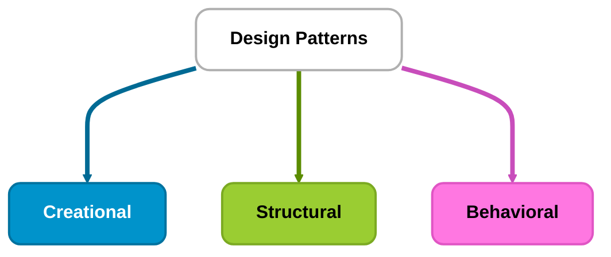
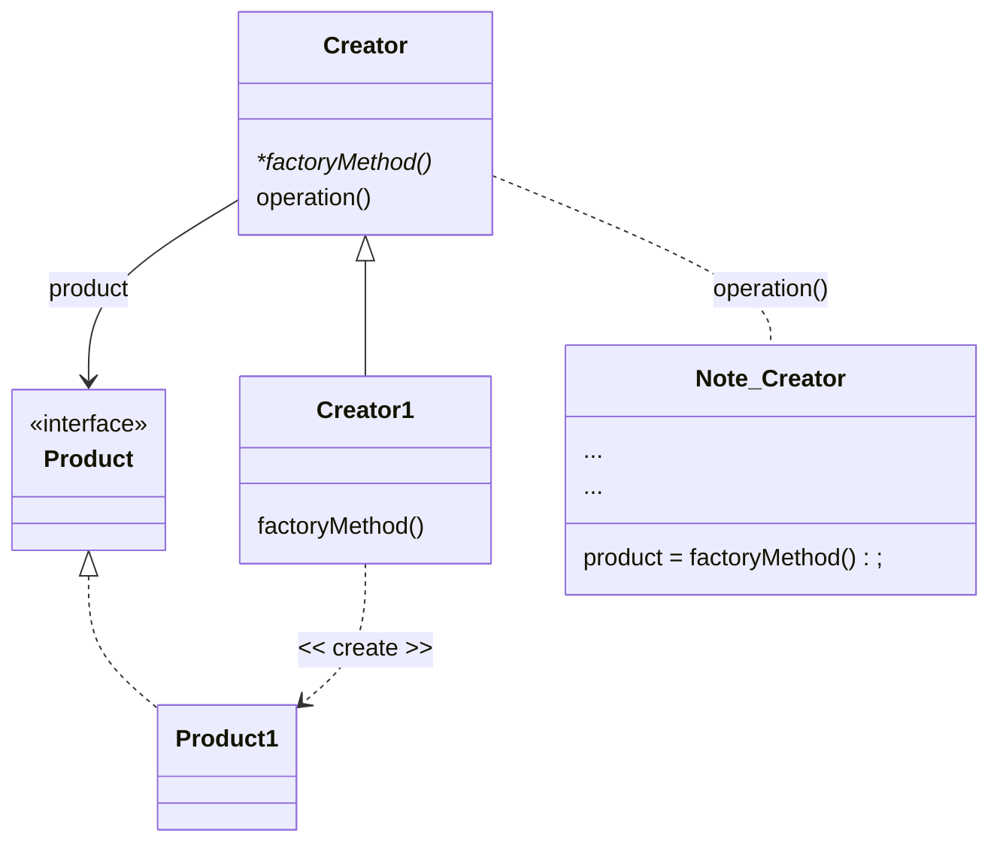
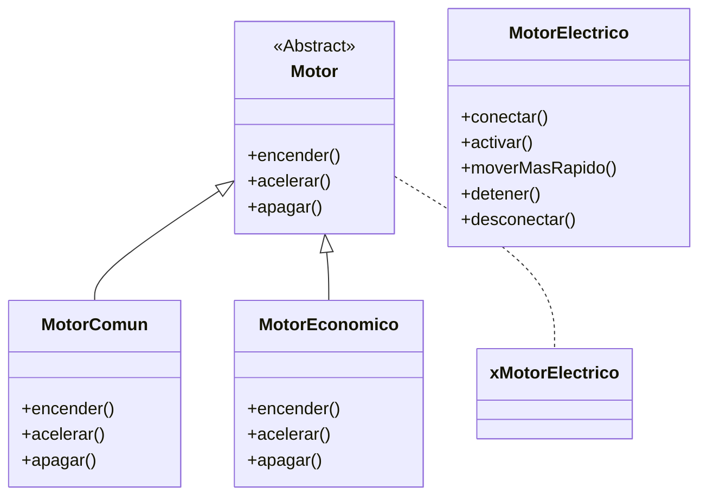
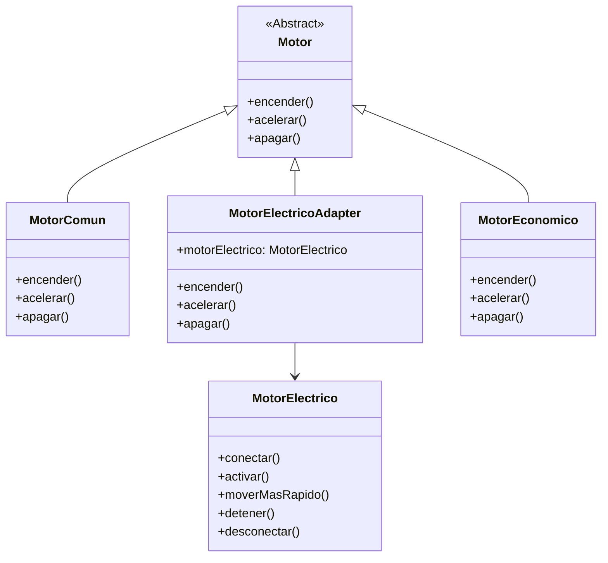
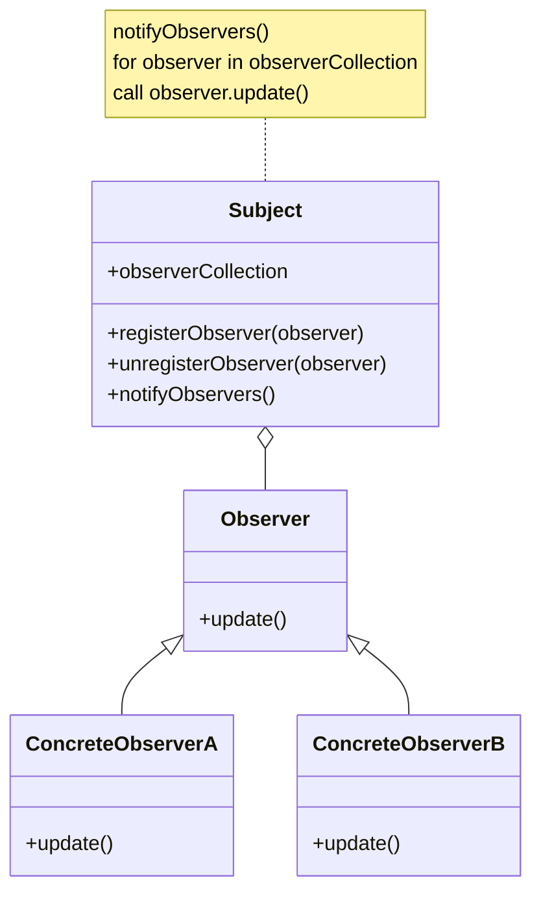

# Patrones de diseño de software

## 1. ¿Qué es un patrón de software?

Los **patrones de diseño** son soluciones generales y reutilizables para problemas que aparecen con frecuencia durante el diseño de software.

Pueden entenderse como **planos o guías de diseño** que se pueden adaptar a diferentes proyectos y lenguajes de programación.

Un patrón de diseño no es:

* Una función lista para copiar.
* Una biblioteca.
* Un fragmento de código obligatorio.
* Una solución que debe aplicarse en todos los proyectos.

Un patrón de diseño es una **idea estructurada para resolver un problema recurrente**.

Por ejemplo, un patrón puede indicar:

```text
Qué problema existe
        ↓
Qué responsabilidades deben separarse
        ↓
Qué objetos deben colaborar
        ↓
Cómo deben comunicarse
```

El código final dependerá de:

* El lenguaje utilizado.
* La arquitectura del proyecto.
* Las necesidades del sistema.
* Las responsabilidades de cada clase.
* El nivel de complejidad del problema.

> [!IMPORTANT]
> No se debe elegir un patrón y copiarlo automáticamente.
>
> Primero se debe identificar el problema y después evaluar si el patrón realmente ayuda a resolverlo.

---

## 2. Clasificación de los patrones de diseño

Los patrones de diseño clásicos descritos por el libro **Design Patterns: Elements of Reusable Object-Oriented Software**, escrito por Erich Gamma, Richard Helm, Ralph Johnson y John Vlissides, conocidos como la **Gang of Four (GoF)**, se dividen en tres categorías principales.

En total, el catálogo clásico contiene **23 patrones**.

| Categoría             | Cantidad | Propósito                                               |
| --------------------- | :------: | ------------------------------------------------------- |
| **Creacionales**      |     5    | Controlar y organizar la creación de objetos.           |
| **Estructurales**     |     7    | Organizar la composición de clases y objetos.           |
| **De comportamiento** |    11    | Organizar la comunicación y colaboración entre objetos. |

---

### 2.1 Patrones creacionales

Los patrones creacionales se enfocan en la forma en que se crean los objetos.

Proporcionan mecanismos para controlar la instanciación y separar el código cliente de los detalles concretos de creación.

Los cinco patrones creacionales clásicos son:

1. Abstract Factory.
2. Builder.
3. Factory Method.
4. Prototype.
5. Singleton.

---

### 2.2 Patrones estructurales

Los patrones estructurales se ocupan de cómo se componen y organizan las clases y los objetos para formar estructuras más grandes.

Ayudan a definir relaciones entre componentes y permiten construir sistemas más flexibles.

Los siete patrones estructurales clásicos son:

1. Adapter.
2. Bridge.
3. Composite.
4. Decorator.
5. Facade.
6. Flyweight.
7. Proxy.

---

### 2.3 Patrones de comportamiento

Los patrones de comportamiento se enfocan en la comunicación y colaboración entre clases y objetos.

Ayudan a organizar:

* El intercambio de mensajes.
* La distribución de responsabilidades.
* La coordinación entre objetos.
* El cambio de comportamiento.
* La comunicación basada en eventos.

Los once patrones de comportamiento clásicos son:

1. Chain of Responsibility.
2. Command.
3. Interpreter.
4. Iterator.
5. Mediator.
6. Memento.
7. Observer.
8. State.
9. Strategy.
10. Template Method.
11. Visitor.

---

### Diagrama original



---

# 3. Patrón Factory Method

## 3.1 Definición

**Factory Method** es un patrón de diseño creacional que proporciona un método para crear objetos, permitiendo que las subclases o implementaciones concretas decidan qué tipo de objeto se debe crear.

Su objetivo principal es separar:

```text
Código cliente
      ↓
Creación del objeto
      ↓
Clase concreta
```

De esta forma, el código cliente no necesita conocer directamente todos los detalles de creación.

La definición clásica de Factory Method es:

> Define una interfaz para crear un objeto, pero permite que las subclases decidan qué clase instanciar.

---

## 3.2 Objetivo

Factory Method puede ayudar a:

* Separar la creación de objetos de su utilización.
* Reducir el acoplamiento con clases concretas.
* Facilitar la incorporación de nuevos productos.
* Centralizar reglas de creación.
* Aplicar polimorfismo.
* Mejorar la mantenibilidad cuando existen varias implementaciones.

---

## 3.3 Componentes del patrón

| Componente           | Responsabilidad                                                       |
| -------------------- | --------------------------------------------------------------------- |
| **Product**          | Define el contrato común de los objetos creados.                      |
| **Concrete Product** | Implementa un producto específico.                                    |
| **Creator**          | Declara el método de fábrica.                                         |
| **Concrete Creator** | Implementa la creación de un producto concreto.                       |
| **Client**           | Utiliza el producto sin depender necesariamente de su clase concreta. |

---

### Diagrama original



> [!NOTE]
> El diagrama representa una estructura conceptual de Factory Method.
>
> En JavaScript no existe una palabra clave nativa `interface`. El contrato `Product` puede representarse mediante una clase base, una convención de métodos o TypeScript.

---

# 4. Factory Method en JavaScript

En JavaScript existen diferentes formas de implementar una fábrica.

Una forma sencilla consiste en utilizar una clase con un método estático que decide qué objeto crear.

Este enfoque es útil para aprender el concepto, aunque técnicamente se parece más a una **Simple Factory** que al Factory Method clásico de la Gang of Four.

## Diferencia importante

### Simple Factory

Una clase central decide qué objeto crear:

```text
Fabrica
├── crea Perro
├── crea Gato
└── crea Pato
```

### Factory Method clásico

Una clase base define el método de fábrica y las subclases deciden qué producto concreto crear:

```text
Creator
├── factoryMethod()

CreatorPerro
└── crea Perro

CreatorGato
└── crea Gato
```

Los ejercicios de clase utilizan una fábrica central con un método estático. Es una forma válida de practicar el concepto de creación desacoplada, pero conviene conocer esta diferencia terminológica.

---

# 5. Ejercicio de clase: fábrica de animales

## 5.1 Código completo

```javascript
// CLASE BASE: ANIMAL
class Animal {
  hacerSonido() {
    console.log('Animal haciendo sonido....');
  }
}

// CLASE PERRO
class Perro extends Animal {
  hacerSonido() {
    console.log('Guau Guau...');
  }
}

// CLASE GATO
class Gato extends Animal {
  hacerSonido() {
    console.log('Miau Miau...');
  }
}

// CLASE PATO
class Pato extends Animal {
  hacerSonido() {
    console.log('Cuak Cuak...');
  }
}

// FABRICA DE ANIMALES
class FabricaAnimales {
  static crearAnimal(tipo) {
    tipo = tipo.toLowerCase();

    if (tipo === 'perro') {
      return new Perro();
    } else if (tipo === 'gato') {
      return new Gato();
    } else if (tipo === 'pato') {
      return new Pato();
    }

    return null;
  }
}

// CREACION DE ANIMALES
const perro1 = FabricaAnimales.crearAnimal('perro');
const perro2 = FabricaAnimales.crearAnimal('perro');
const pato1 = FabricaAnimales.crearAnimal('pato');
const gato1 = FabricaAnimales.crearAnimal('gato');

// EJECUTAR METODOS
perro1.hacerSonido();
perro2.hacerSonido();
pato1.hacerSonido();
gato1.hacerSonido();
```

---

## 5.2 Clase base `Animal`

```javascript
class Animal {
  hacerSonido() {
    console.log('Animal haciendo sonido....');
  }
}
```

`Animal` representa el comportamiento general de los animales.

Las clases específicas heredan de ella:

```javascript
class Perro extends Animal {}
class Gato extends Animal {}
class Pato extends Animal {}
```

La herencia permite reutilizar la estructura y definir comportamientos especializados.

---

## 5.3 Sobrescritura del método

Cada clase concreta sobrescribe `hacerSonido()`:

```javascript
class Perro extends Animal {
  hacerSonido() {
    console.log('Guau Guau...');
  }
}
```

```javascript
class Gato extends Animal {
  hacerSonido() {
    console.log('Miau Miau...');
  }
}
```

```javascript
class Pato extends Animal {
  hacerSonido() {
    console.log('Cuak Cuak...');
  }
}
```

El método tiene el mismo nombre, pero cada clase tiene una implementación diferente.

Esto demuestra **polimorfismo**.

---

## 5.4 Método estático de fábrica

```javascript
class FabricaAnimales {
  static crearAnimal(tipo) {
    // ...
  }
}
```

La palabra clave `static` permite utilizar el método desde la clase sin crear una instancia de `FabricaAnimales`.

Por eso se puede escribir:

```javascript
FabricaAnimales.crearAnimal('perro');
```

No es necesario hacer:

```javascript
const fabrica = new FabricaAnimales();
fabrica.crearAnimal('perro');
```

---

## 5.5 Normalización del tipo

```javascript
tipo = tipo.toLowerCase();
```

Esta línea permite aceptar diferentes combinaciones de mayúsculas y minúsculas:

```javascript
'perro'
'Perro'
'PERRO'
```

Todas se convierten en:

```javascript
'perro'
```

> [!WARNING]
> Si `tipo` no es una cadena, `toLowerCase()` producirá un error.
>
> Una validación más robusta podría comprobar primero que el valor sea un string.

---

## 5.6 Creación de objetos

```javascript
if (tipo === 'perro') {
  return new Perro();
}
```

La fábrica crea y devuelve una instancia de `Perro`.

El código cliente no necesita escribir directamente:

```javascript
new Perro();
```

Puede utilizar:

```javascript
FabricaAnimales.crearAnimal('perro');
```

La responsabilidad de decidir qué clase instanciar está centralizada en la fábrica.

---

## 5.7 Resultado de la fábrica

```javascript
const perro1 = FabricaAnimales.crearAnimal('perro');
const pato1 = FabricaAnimales.crearAnimal('pato');
const gato1 = FabricaAnimales.crearAnimal('gato');
```

Cada variable contiene un objeto diferente:

```text
perro1 → instancia de Perro
pato1  → instancia de Pato
gato1  → instancia de Gato
```

Después todos pueden utilizar el mismo método:

```javascript
perro1.hacerSonido();
pato1.hacerSonido();
gato1.hacerSonido();
```

Pero cada objeto ejecuta su propia implementación.

---

## 5.8 Valor devuelto cuando no existe el tipo

```javascript
return null;
```

Si el tipo no coincide con ninguno de los animales conocidos, la fábrica devuelve `null`.

Ejemplo:

```javascript
const animal = FabricaAnimales.crearAnimal('leon');

console.log(animal);
```

Resultado:

```text
null
```

> [!NOTE]
> Devolver `null` es una decisión de diseño. Otra posibilidad sería lanzar un error:

```javascript
throw new Error(`Tipo de animal no soportado: ${tipo}`);
```

Lanzar un error puede ser más adecuado cuando un tipo inválido representa un problema que no debería ignorarse.

---

# 6. Ejercicio adicional: fábrica de vehículos

## 6.1 Código completo

```javascript
// CLASE BASE
class Vehiculo {
  color() {
    console.log('Vehículo de color desconocido');
  }

  marca() {
    console.log('Vehículo de marca desconocida');
  }
}

// FABRICA
class FabricaVehiculos {
  static crearVehiculo(tipo) {
    if (tipo.toLowerCase() === 'ferrari') {
      return new Ferrari();
    }

    if (tipo.toLowerCase() === 'toyota') {
      return new Toyota();
    }

    if (tipo.toLowerCase() === 'tesla') {
      return new Tesla();
    }

    return null;
  }
}

// PRODUCTO CONCRETO: FERRARI
class Ferrari extends Vehiculo {
  color() {
    console.log('Vehículo de color rojo');
  }

  marca() {
    console.log('Vehículo de la marca Ferrari');
  }
}

// PRODUCTO CONCRETO: TOYOTA
class Toyota extends Vehiculo {
  color() {
    console.log('Vehículo de color gris');
  }

  marca() {
    console.log('Vehículo de la marca Toyota');
  }
}

// PRODUCTO CONCRETO: TESLA
class Tesla extends Vehiculo {
  color() {
    console.log('Vehículo de color verde');
  }

  marca() {
    console.log('Vehículo de la marca Tesla');
  }
}

// CREAR VEHICULOS
const carro1 = FabricaVehiculos.crearVehiculo('ferrari');
const carro2 = FabricaVehiculos.crearVehiculo('toyota');
const carro3 = FabricaVehiculos.crearVehiculo('tesla');

// USAR LOS OBJETOS
carro1.color();
carro1.marca();

carro2.color();
carro2.marca();

carro3.color();
carro3.marca();
```

---

## 6.2 Explicación

La clase base `Vehiculo` define dos operaciones:

```javascript
class Vehiculo {
  color() {
    console.log('Vehículo de color desconocido');
  }

  marca() {
    console.log('Vehículo de marca desconocida');
  }
}
```

Las clases concretas heredan de `Vehiculo`:

```javascript
class Ferrari extends Vehiculo {}
class Toyota extends Vehiculo {}
class Tesla extends Vehiculo {}
```

Cada clase redefine los métodos:

```javascript
color()
marca()
```

Por ejemplo:

```javascript
class Ferrari extends Vehiculo {
  color() {
    console.log('Vehículo de color rojo');
  }

  marca() {
    console.log('Vehículo de la marca Ferrari');
  }
}
```

La fábrica decide qué clase crear:

```javascript
FabricaVehiculos.crearVehiculo('ferrari');
```

El resultado es una instancia de `Ferrari`.

---

## 6.3 Relación con polimorfismo

Aunque los objetos son de clases diferentes:

```text
Ferrari
Toyota
Tesla
```

todos comparten el contrato de `Vehiculo`:

```text
color()
marca()
```

Por eso el código cliente puede trabajar con ellos de forma uniforme.

```javascript
carro1.color();
carro2.color();
carro3.color();
```

Cada objeto ejecuta su propia versión del método.

---

# 7. Patrón Adapter

## 7.1 Definición

**Adapter** es un patrón de diseño estructural que permite que objetos con interfaces incompatibles trabajen juntos.

Para conseguirlo, se crea un objeto adaptador que funciona como puente entre:

```text
Interfaz existente
        ↓
Adapter
        ↓
Interfaz esperada por el cliente
```

El adaptador traduce las llamadas del cliente al formato que entiende la clase existente.

---

## 7.2 Problema que resuelve

Imaginemos que un sistema espera un motor con estos métodos:

```javascript
encender()
acelerar()
apagar()
```

Pero un motor eléctrico existente utiliza otros métodos:

```javascript
conectar()
activar()
moverMasRapido()
detener()
desconectar()
```

Las interfaces son incompatibles.

El cliente espera:

```javascript
motor.encender();
motor.acelerar();
motor.apagar();
```

Pero `MotorElectrico` no proporciona esos métodos.

El Adapter permite utilizar el motor eléctrico sin modificar su clase original.

---

## 7.3 Componentes del patrón

| Componente  | Responsabilidad                                           |
| ----------- | --------------------------------------------------------- |
| **Target**  | Interfaz que el cliente espera utilizar.                  |
| **Client**  | Código que utiliza el contrato esperado.                  |
| **Adaptee** | Clase existente con una interfaz incompatible.            |
| **Adapter** | Traduce la interfaz esperada hacia la interfaz existente. |

---

## 7.4 Diagrama original: sin Adapter



---

## 7.5 Diagrama original: con Adapter



---

# 8. Ejercicio de clase: Adapter de motores

## 8.1 Código completo

```javascript
// CLASE BASE
class Motor {
  encender() {
    throw new Error('Debe implementar el método abstracto.');
  }

  acelerar() {
    throw new Error('Debe implementar el método abstracto.');
  }

  apagar() {
    throw new Error('Debe implementar el método abstracto.');
  }
}

// MOTOR COMUN
class MotorComun extends Motor {
  constructor() {
    super();
    console.log('Creando motor común.....');
  }

  encender() {
    console.log('Encendiendo el motor común....');
  }

  acelerar() {
    console.log('Acelerando el motor común....');
  }

  apagar() {
    console.log('Apagando el motor común....');
  }
}

// MOTOR ELECTRICO
class MotorElectrico {
  constructor() {
    this.conectado = false;
  }

  conectar() {
    this.conectado = true;
    console.log('Conectando motor eléctrico....');
  }

  activar() {
    if (!this.conectado) {
      console.log(
        'El motor no se puede activar porque no está conectado.'
      );
    } else {
      console.log(
        'El motor está conectado. Activando motor eléctrico....'
      );
    }
  }

  moverMasRapido() {
    if (!this.conectado) {
      console.log(
        'El motor no se puede mover porque no está conectado.'
      );
    } else {
      console.log(
        'El motor está conectado. Moviéndose más rápido.... Voltaje aumentado.'
      );
    }
  }

  detener() {
    if (!this.conectado) {
      console.log(
        'El motor no se puede detener porque no está conectado.'
      );
    } else {
      console.log('Deteniendo motor eléctrico......');
    }
  }

  desconectar() {
    this.conectado = false;
    console.log('Desconectando motor eléctrico......');
  }
}

// MOTOR ELECTRICO ADAPTER
class MotorElectricoAdapter extends Motor {
  constructor() {
    super();
    this.motorElectrico = new MotorElectrico();

    console.log(
      'Creando motor eléctrico adapter.....'
    );
  }

  encender() {
    console.log(
      'Encendiendo el motor eléctrico mediante Adapter....'
    );

    this.motorElectrico.conectar();
    this.motorElectrico.activar();
  }

  acelerar() {
    console.log(
      'Acelerando el motor eléctrico mediante Adapter....'
    );

    this.motorElectrico.moverMasRapido();
  }

  apagar() {
    console.log(
      'Apagando el motor eléctrico mediante Adapter....'
    );

    this.motorElectrico.detener();
    this.motorElectrico.desconectar();
  }
}

// CREAR INSTANCIAS
const carroGasolina = new MotorComun();
const carroElectrico = new MotorElectricoAdapter();

// USAR LOS OBJETOS
carroGasolina.encender();
carroGasolina.acelerar();
carroGasolina.apagar();

carroElectrico.encender();
carroElectrico.acelerar();
carroElectrico.apagar();
```

---

## 8.2 Clase base `Motor`

```javascript
class Motor {
  encender() {
    throw new Error('Debe implementar el método abstracto.');
  }

  acelerar() {
    throw new Error('Debe implementar el método abstracto.');
  }

  apagar() {
    throw new Error('Debe implementar el método abstracto.');
  }
}
```

`Motor` define el contrato esperado por el cliente.

El contrato exige tres métodos:

```text
encender()
acelerar()
apagar()
```

JavaScript no tiene clases abstractas nativas mediante la palabra clave `abstract`.

Por eso se utiliza una clase convencional cuyos métodos lanzan errores.

---

## 8.3 `MotorComun`

```javascript
class MotorComun extends Motor {
  encender() {
    console.log('Encendiendo el motor común....');
  }

  acelerar() {
    console.log('Acelerando el motor común....');
  }

  apagar() {
    console.log('Apagando el motor común....');
  }
}
```

`MotorComun` cumple directamente con la interfaz esperada.

No necesita un adaptador porque ya tiene los métodos correctos.

---

## 8.4 `MotorElectrico`

```javascript
class MotorElectrico {
  conectar() {}
  activar() {}
  moverMasRapido() {}
  detener() {}
  desconectar() {}
}
```

`MotorElectrico` tiene una interfaz diferente.

Sus operaciones son:

```text
conectar()
activar()
moverMasRapido()
detener()
desconectar()
```

Por lo tanto, no puede utilizarse directamente donde el cliente espera:

```text
encender()
acelerar()
apagar()
```

---

## 8.5 Estado `conectado`

```javascript
constructor() {
  this.conectado = false;
}
```

El motor comienza desconectado.

Cuando se llama:

```javascript
conectar()
```

el estado cambia:

```javascript
this.conectado = true;
```

Los métodos `activar()`, `moverMasRapido()` y `detener()` comprueban ese estado antes de ejecutar sus operaciones.

---

## 8.6 Clase `MotorElectricoAdapter`

```javascript
class MotorElectricoAdapter extends Motor {
  constructor() {
    super();
    this.motorElectrico = new MotorElectrico();
  }
}
```

El adaptador hereda de `Motor`, por lo que ofrece el contrato esperado:

```text
encender()
acelerar()
apagar()
```

Internamente contiene una instancia de `MotorElectrico`.

Esta relación se conoce como **composición**:

```text
MotorElectricoAdapter
        ↓
MotorElectrico
```

---

## 8.7 Traducción de `encender()`

El cliente espera:

```javascript
carroElectrico.encender();
```

El adaptador traduce esa llamada:

```javascript
encender() {
  this.motorElectrico.conectar();
  this.motorElectrico.activar();
}
```

La secuencia es:

```text
encender()
   ↓
conectar()
   ↓
activar()
```

El cliente no necesita conocer los métodos internos del motor eléctrico.

---

## 8.8 Traducción de `acelerar()`

```javascript
acelerar() {
  this.motorElectrico.moverMasRapido();
}
```

El cliente llama:

```javascript
carroElectrico.acelerar();
```

Pero internamente se ejecuta:

```javascript
motorElectrico.moverMasRapido();
```

El adaptador traduce el nombre y la operación.

---

## 8.9 Traducción de `apagar()`

```javascript
apagar() {
  this.motorElectrico.detener();
  this.motorElectrico.desconectar();
}
```

La operación de apagado requiere dos acciones:

```text
apagar()
   ↓
detener()
   ↓
desconectar()
```

El adaptador encapsula esa secuencia.

---

## 8.10 Beneficio principal

El cliente puede utilizar ambos motores de la misma manera:

```javascript
carroGasolina.encender();
carroGasolina.acelerar();
carroGasolina.apagar();

carroElectrico.encender();
carroElectrico.acelerar();
carroElectrico.apagar();
```

El cliente no necesita saber si el motor es:

* Común.
* Eléctrico.
* Económico.
* Otro tipo de motor compatible.

---

# 9. Ejercicio adicional de Adapter

## Enunciado

Crear clases que permitan utilizar un carro con:

1. Selector de velocidades mecánico.
2. Selector de velocidades automático.

El objetivo es que ambos selectores puedan utilizarse mediante una interfaz común.

Por ejemplo:

```text
Selector esperado por el carro
├── subirMarcha()
├── bajarMarcha()
└── ponerNeutro()
```

El selector mecánico podría utilizar:

```text
moverPalanca()
presionarEmbrague()
```

El selector automático podría utilizar:

```text
seleccionarModo()
activarTransmision()
```

El Adapter permitiría que ambos sistemas sean utilizados mediante el mismo contrato.

---

# 10. Patrón Observer

## 10.1 Definición

**Observer** es un patrón de diseño de comportamiento que define un mecanismo de suscripción.

Un objeto, llamado **Subject** o sujeto, mantiene una colección de observadores y les envía notificaciones cuando ocurre un evento o cambia su estado.

La estructura general es:

```text
Sujeto
   ↓
Colección de observadores
   ↓
Notificación
   ↓
Actualización de cada observador
```

---

## 10.2 Componentes del patrón

| Componente            | Responsabilidad                                                |
| --------------------- | -------------------------------------------------------------- |
| **Subject**           | Mantiene los observadores y envía notificaciones.              |
| **Observer**          | Define el comportamiento esperado al recibir una notificación. |
| **Concrete Subject**  | Implementa el sujeto concreto.                                 |
| **Concrete Observer** | Implementa un observador específico.                           |

---

## 10.3 Operaciones comunes

Un sujeto suele proporcionar métodos como:

```javascript
agregarObservador(observer)
eliminarObservador(observer)
notificarObservadores(mensaje)
```

Los observadores suelen proporcionar:

```javascript
actualizar(mensaje)
```

---

### Diagrama original



---

# 11. Ejercicio de clase: Observer

## 11.1 Código completo

```javascript
// OBSERVADOR
class Observador {
  actualizar() {
    throw new Error(
      'Debe implementar la clase abstracta...'
    );
  }
}

// SUJETO
class Sujeto {
  constructor() {
    this.observadores = [];
  }

  agregarObservador(observador) {
    this.observadores.push(observador);
  }

  eliminarObservador(observador) {
    this.observadores = this.observadores.filter(
      obs => obs !== observador
    );
  }

  notificarObservadores(mensaje) {
    this.observadores.forEach(observador => {
      observador.actualizar(mensaje);
    });
  }
}

// OBSERVADOR CONCRETO
class Chismoso extends Observador {
  constructor(nombre) {
    super();
    this.nombre = nombre;
  }

  actualizar(mensaje) {
    console.log(
      `${this.nombre} recibió la notificación: ${mensaje}`
    );
  }
}

// CREAR OBSERVADORES
const chismoso1 = new Chismoso('Allison');
const chismoso2 = new Chismoso('Majo');

// CREAR SUJETO
const anderson = new Sujeto();

// REGISTRAR OBSERVADORES
anderson.agregarObservador(chismoso1);
anderson.agregarObservador(chismoso2);

// NOTIFICAR OBSERVADORES
anderson.notificarObservadores(
  'Compré un carro último modelo... lero lero....'
);
```

---

## 11.2 Clase `Observador`

```javascript
class Observador {
  actualizar() {
    throw new Error(
      'Debe implementar la clase abstracta...'
    );
  }
}
```

La clase define el contrato que deben cumplir los observadores.

El método esperado es:

```javascript
actualizar(mensaje)
```

En JavaScript, este contrato se implementa mediante una clase base convencional.

---

## 11.3 Clase `Sujeto`

```javascript
class Sujeto {
  constructor() {
    this.observadores = [];
  }
}
```

El sujeto mantiene una colección de observadores.

La colección comienza vacía:

```javascript
this.observadores = [];
```

Cada observador se registra posteriormente.

---

## 11.4 Registrar observadores

```javascript
agregarObservador(observador) {
  this.observadores.push(observador);
}
```

Este método agrega un observador a la colección.

Ejemplo:

```javascript
anderson.agregarObservador(chismoso1);
anderson.agregarObservador(chismoso2);
```

La estructura queda así:

```text
anderson
├── chismoso1
└── chismoso2
```

---

## 11.5 Eliminar observadores

```javascript
eliminarObservador(observador) {
  this.observadores = this.observadores.filter(
    obs => obs !== observador
  );
}
```

`filter()` crea un nuevo arreglo que conserva todos los observadores excepto el que se desea eliminar.

Ejemplo:

```javascript
anderson.eliminarObservador(chismoso1);
```

Después de esa operación, solamente quedaría:

```text
anderson
└── chismoso2
```

---

## 11.6 Notificar observadores

```javascript
notificarObservadores(mensaje) {
  this.observadores.forEach(observador => {
    observador.actualizar(mensaje);
  });
}
```

El método recorre todos los observadores y ejecuta:

```javascript
observador.actualizar(mensaje);
```

La notificación se envía a cada objeto registrado.

---

## 11.7 Clase `Chismoso`

```javascript
class Chismoso extends Observador {
  constructor(nombre) {
    super();
    this.nombre = nombre;
  }

  actualizar(mensaje) {
    console.log(
      `${this.nombre} recibió la notificación: ${mensaje}`
    );
  }
}
```

`Chismoso` es un observador concreto.

Cada objeto tiene un nombre:

```javascript
const chismoso1 = new Chismoso('Allison');
const chismoso2 = new Chismoso('Majo');
```

Cuando recibe una notificación, muestra el mensaje en la terminal.

---

## 11.8 Flujo de ejecución

```javascript
anderson.agregarObservador(chismoso1);
anderson.agregarObservador(chismoso2);
```

Primero se registran los observadores.

Después:

```javascript
anderson.notificarObservadores(
  'Compré un carro último modelo... lero lero....'
);
```

El sujeto envía el mensaje a cada observador.

El resultado será similar a:

```text
Allison recibió la notificación: Compré un carro último modelo... lero lero....
Majo recibió la notificación: Compré un carro último modelo... lero lero....
```

---

# 12. Ventajas del patrón Observer

Observer puede ayudar a:

* Notificar a varios objetos cuando ocurre un evento.
* Reducir la dependencia directa entre el sujeto y los observadores concretos.
* Implementar sistemas de eventos.
* Actualizar interfaces gráficas.
* Crear sistemas de suscripción.
* Implementar notificaciones.
* Sincronizar componentes.
* Reaccionar a cambios de estado.

Ejemplos de uso:

```text
Sistema de notificaciones
        ↓
Varios usuarios suscritos
```

```text
Cambio de precio
        ↓
Actualizar carrito
Actualizar pantalla
Actualizar historial
```

```text
Nuevo mensaje
        ↓
Notificar usuario
Actualizar contador
Registrar evento
```

---

# 13. Riesgos y consideraciones de Observer

## 13.1 Notificaciones duplicadas

Si el mismo observador se registra varias veces:

```javascript
sujeto.agregarObservador(chismoso1);
sujeto.agregarObservador(chismoso1);
```

podría recibir la misma notificación dos veces.

Una implementación más robusta podría comprobar si el observador ya está registrado.

---

## 13.2 Observadores que generan errores

Si un observador lanza un error durante la notificación, puede interrumpir el recorrido.

En sistemas reales podría ser necesario controlar los errores individualmente.

---

## 13.3 Dependencias difíciles de rastrear

Observer reduce algunas dependencias directas, pero también puede hacer que el flujo del programa sea menos evidente.

Una notificación puede activar muchas operaciones en diferentes objetos.

Por eso conviene utilizarlo con nombres claros y una estructura controlada.

---

## 13.4 Memoria y suscripciones

Si un observador ya no debe recibir eventos, debe eliminarse:

```javascript
sujeto.eliminarObservador(observador);
```

En sistemas con eventos prolongados, olvidar eliminar suscripciones puede mantener objetos en memoria más tiempo del necesario.

---

# 14. Comparación de los patrones estudiados

| Patrón             | Categoría      | Problema que resuelve                  | Idea principal                              |
| ------------------ | -------------- | -------------------------------------- | ------------------------------------------- |
| **Factory Method** | Creacional     | Creación directa y acoplada de objetos | Separar la creación de los objetos.         |
| **Adapter**        | Estructural    | Interfaces incompatibles               | Traducir una interfaz hacia otra.           |
| **Observer**       | Comportamiento | Notificar cambios a varios objetos     | Suscripción y notificación de observadores. |

---

## 14.1 Factory Method

```text
Cliente
   ↓
Fábrica
   ↓
Producto concreto
```

Se utiliza cuando la creación de objetos debe separarse del código que los utiliza.

---

## 14.2 Adapter

```text
Cliente
   ↓
Interfaz esperada
   ↓
Adapter
   ↓
Clase existente
```

Se utiliza cuando una clase ya existente tiene una interfaz incompatible.

---

## 14.3 Observer

```text
Sujeto
   ↓
Observadores registrados
   ↓
Notificación
```

Se utiliza cuando varios objetos deben reaccionar ante un evento o cambio.

---

# 15. Relación con SOLID

Los patrones de diseño y los principios SOLID son conceptos diferentes, pero pueden complementarse.

| Concepto               | Propósito                                                      |
| ---------------------- | -------------------------------------------------------------- |
| **SOLID**              | Principios generales para organizar y diseñar el código.       |
| **Patrones de diseño** | Soluciones reutilizables para problemas específicos de diseño. |

Por ejemplo:

* Factory Method puede ayudar a reducir el acoplamiento.
* Adapter puede aislar una clase incompatible.
* Observer puede separar al objeto que produce un evento de los objetos que reaccionan.
* Strategy puede ayudar a aplicar OCP.
* Dependency Injection puede ayudar a aplicar DIP.

> [!IMPORTANT]
> Un patrón no garantiza automáticamente un buen diseño.
>
> Debe utilizarse cuando resuelve un problema real y cuando su complejidad está justificada.

---

# 16. Buenas prácticas al utilizar patrones

* Identificar primero el problema.
* Comprender la intención del patrón antes de implementarlo.
* No aplicar patrones únicamente porque son conocidos.
* Evitar crear abstracciones innecesarias.
* Mantener nombres claros.
* Separar responsabilidades.
* Preferir soluciones simples cuando sean suficientes.
* Documentar por qué se utiliza un patrón.
* Evaluar el costo de mantenimiento.
* Revisar si el patrón aumenta o reduce el acoplamiento.
* Verificar si el patrón facilita las pruebas.
* Adaptar el patrón al lenguaje y a la arquitectura del proyecto.

---

# 17. Errores frecuentes

## 17.1 Confundir Factory Method con cualquier fábrica

Una clase con un método estático que crea objetos es comúnmente llamada **Simple Factory**.

El Factory Method clásico utiliza un método de creación que puede ser redefinido por subclases concretas.

---

## 17.2 Pensar que Adapter modifica la clase original

El Adapter normalmente evita modificar la clase existente.

En lugar de cambiarla, crea una capa que traduce sus operaciones.

---

## 17.3 Pensar que Observer es solamente un arreglo

El arreglo de observadores es una parte de la implementación, pero el patrón también incluye:

* Registro.
* Eliminación.
* Notificación.
* Contrato de actualización.
* Colaboración entre sujeto y observadores.

---

## 17.4 Aplicar patrones sin necesidad

No todo proyecto necesita una fábrica, un adaptador o un sistema de observadores.

La solución más simple suele ser preferible cuando no existe un problema de diseño que justifique una estructura adicional.

---

# Glosario

| Término                      | Definición                                                                                 |
| ---------------------------- | ------------------------------------------------------------------------------------------ |
| **Adapter**                  | Patrón estructural que traduce una interfaz hacia otra compatible con el cliente.          |
| **Cliente**                  | Código que utiliza una clase, objeto o servicio.                                           |
| **Composición**              | Construcción de un objeto utilizando otros objetos como parte de su estructura.            |
| **Concrete Product**         | Implementación concreta del producto creado por una fábrica.                               |
| **Creacional**               | Categoría de patrones relacionados con la creación de objetos.                             |
| **Estructural**              | Categoría de patrones relacionados con la composición y organización de objetos y clases.  |
| **Factory Method**           | Patrón creacional que permite delegar la creación de objetos a implementaciones concretas. |
| **Gang of Four**             | Nombre con el que se conoce a los cuatro autores del libro clásico de patrones de diseño.  |
| **Interfaz**                 | Contrato que define las operaciones que un objeto debe proporcionar.                       |
| **Método estático**          | Método que pertenece a la clase y puede utilizarse sin crear una instancia.                |
| **Observer**                 | Patrón de comportamiento basado en suscripción y notificación de objetos.                  |
| **Patrón de comportamiento** | Patrón que organiza la comunicación y colaboración entre objetos.                          |
| **Patrón de diseño**         | Solución general y reutilizable para un problema recurrente de diseño de software.         |
| **Patrón creacional**        | Patrón que organiza o controla la creación de objetos.                                     |
| **Patrón estructural**       | Patrón que organiza la composición de clases y objetos.                                    |
| **Polimorfismo**             | Capacidad de utilizar diferentes objetos mediante un contrato o método común.              |
| **Product**                  | Contrato común de los objetos creados por una fábrica.                                     |
| **Subject**                  | Objeto observado que mantiene observadores y les envía notificaciones.                     |
| **Observer concreto**        | Objeto específico que recibe y procesa notificaciones.                                     |
| **Adaptee**                  | Clase existente cuya interfaz no coincide con la interfaz esperada.                        |
| **Simple Factory**           | Enfoque en el que una clase central decide qué objeto concreto crear.                      |
| **Suscripción**              | Registro de un observador para recibir notificaciones.                                     |
| **Notificación**             | Mensaje o evento enviado por un sujeto a sus observadores.                                 |
| **Abstracción**              | Representación de un comportamiento que oculta detalles innecesarios.                      |

# Resumen

* Los **patrones de diseño** son soluciones generales para problemas recurrentes de diseño de software.
* No son funciones, bibliotecas ni fragmentos de código que deban copiarse directamente.
* Los 23 patrones clásicos se dividen en:

  * Creacionales.
  * Estructurales.
  * De comportamiento.
* **Factory Method** organiza la creación de objetos y permite separar al cliente de las clases concretas.
* El ejercicio de animales utiliza una fábrica central y se acerca más al concepto de **Simple Factory**.
* **Adapter** permite que objetos con interfaces incompatibles trabajen juntos.
* El adaptador traduce las operaciones esperadas por el cliente hacia los métodos de una clase existente.
* **Observer** permite registrar objetos y notificarles cuando ocurre un evento o cambia un estado.
* Factory Method se relaciona con la creación.
* Adapter se relaciona con la estructura.
* Observer se relaciona con la comunicación.
* Los patrones pueden complementar los principios SOLID, pero no los reemplazan.
* No se deben aplicar patrones sin una necesidad real.
* La mejor implementación es la que resuelve el problema manteniendo una complejidad razonable.
