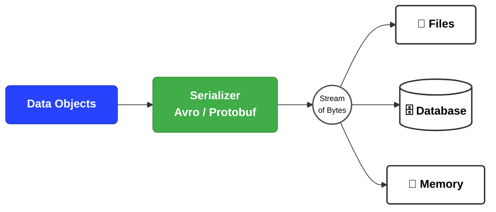
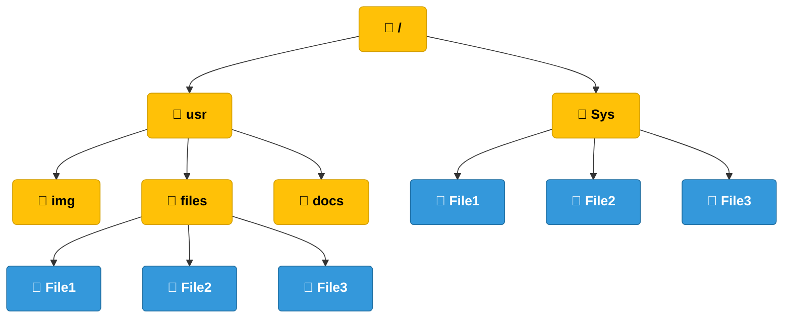

# Introducción a la persistencia de datos

## 1. Persistencia de datos

La **persistencia de datos** es la capacidad de conservar la información de un programa para utilizarla posteriormente, incluso después de que el programa finalice su ejecución.

Para un usuario, la persistencia puede consistir en guardar y abrir archivos. Para un programador, el concepto es más amplio e incluye:

* Guardar información en archivos.
* Guardar información en bases de datos.
* Serializar objetos y estructuras de datos.
* Recuperar información almacenada.
* Deserializar datos.
* Transmitir información a través de una red.

### Flujo general de persistencia

```text
Datos del programa
       ↓
Serialización
       ↓
Almacenamiento
       ↓
Recuperación
       ↓
Deserialización
       ↓
Datos nuevamente utilizables
```

### Ejemplo

Un programa para registrar videojuegos puede crear el siguiente objeto:

```js
const juego = {
  nombre: 'Minecraft',
  genero: 'Supervivencia',
  dificultad: 3,
  plataformas: ['PC', 'Xbox', 'PlayStation']
};
```

Si el objeto solamente existe en la memoria RAM, se perderá cuando el programa termine.

Si se guarda en un archivo JSON, podrá recuperarse posteriormente. En ese caso, la información se ha convertido en datos persistentes.

---

## 2. Información serializada

La **serialización** es el proceso de convertir una estructura de datos, como un objeto o un arreglo, en un formato que pueda ser almacenado o transmitido.

Posteriormente, ese formato puede convertirse nuevamente en una estructura de datos mediante la **deserialización**.

### Ejemplo de serialización

Objeto original en JavaScript:

```js
const usuario = {
  nombre: 'Carlos',
  edad: 20
};
```

Después de serializarlo:

```json
{
  "nombre": "Carlos",
  "edad": 20
}
```

El resultado es texto en formato JSON.

Para reconstruir el objeto se utiliza la deserialización:

```js
const usuario = JSON.parse(textoJson);
```

### Formatos de datos serializados

Los datos serializados pueden representarse en:

* Formato de texto.
* Formato binario.

La elección depende del medio de almacenamiento o transmisión y de los requerimientos del sistema.

| Formato          | Características                                    |
| ---------------- | -------------------------------------------------- |
| Texto            | Puede ser leído e inspeccionado por personas       |
| Binario          | Representa los datos mediante bytes                |
| JSON             | Común en aplicaciones web y APIs                   |
| Avro             | Utilizado en sistemas de datos                     |
| Protocol Buffers | Utilizado para transmitir datos de forma eficiente |

### Diagrama de serialización



---

# 3. Manejo de archivos

Un **archivo** o **fichero** es un conjunto de datos almacenados en un dispositivo.

Normalmente, un archivo se identifica mediante:

* Un nombre.
* Una ruta.
* Una extensión.

Ejemplo:

```text
/home/camper/Documentos/repos-locales/patrones_diseño/archivos.js
```

En este ejemplo:

| Elemento        | Valor                                                    |
| --------------- | -------------------------------------------------------- |
| Ruta            | `/home/camper/Documentos/repos-locales/patrones_diseño/` |
| Nombre          | `archivos`                                               |
| Extensión       | `.js`                                                    |
| Nombre completo | `archivos.js`                                            |

Los archivos pueden almacenarse en:

* Discos duros.
* Unidades SSD.
* Memorias USB.
* Tarjetas de memoria.
* CD y DVD.
* Otros dispositivos de almacenamiento.

Los sistemas de archivos organizan los datos mediante una estructura jerárquica de carpetas y archivos.

## 3.1. Estructura jerárquica

Una carpeta puede contener:

* Archivos.
* Otras carpetas.
* Subcarpetas.
* Diferentes niveles de organización.

Dos archivos pueden tener el mismo nombre si se encuentran en rutas diferentes:

```text
/sys/File1
/usr/files/File1
```

Aunque ambos se llamen `File1`, son archivos diferentes porque su ubicación no es la misma.

### Diagrama de archivos y carpetas



---

# 4. Tipos de archivos

## 4.1. Archivos estándar

Los **archivos estándar** almacenan diferentes tipos de información, como:

* Documentos.
* Imágenes.
* Audio.
* Video.
* Código fuente.
* Datos estructurados.
* Archivos comprimidos.

Ejemplos:

```text
documento.pdf
imagen.png
cancion.mp3
video.mp4
datos.json
```

## 4.2. Carpetas o directorios

Una **carpeta** o **directorio** es una estructura utilizada para almacenar y organizar archivos de forma jerárquica.

Ejemplo:

```text
proyecto/
├── src/
│   ├── app.js
│   └── server.js
├── data/
│   └── games.json
└── package.json
```

En esta estructura:

* `proyecto/` es la carpeta principal.
* `src/` contiene archivos de código.
* `data/` contiene información almacenada.
* `package.json` es un archivo.

## 4.3. Archivos especiales

Los **archivos especiales** están relacionados con la representación y administración de recursos del sistema y periféricos.

Pueden utilizarse para representar:

* Dispositivos de entrada.
* Dispositivos de salida.
* Discos.
* Terminales.
* Otros recursos del sistema operativo.

En sistemas Linux, muchos dispositivos se representan mediante archivos especiales dentro de:

```text
/dev
```

---

# 5. Rutas de archivos

Una **ruta** es la dirección que permite localizar un archivo o directorio dentro del sistema de archivos.

Cada nivel de la estructura jerárquica se representa mediante un separador.

## 5.1. Separadores de rutas

En Linux y otros sistemas Unix se utiliza:

```text
/
```

Ejemplo:

```text
/home/camper/Documentos/archivo.js
```

En Windows normalmente se utiliza:

```text
\
```

Ejemplo:

```text
C:\Users\Carlos\Documentos\archivo.js
```

## 5.2. Directorio actual: `.`

El punto representa el directorio actual.

```text
.
```

Ejemplo:

```text
./archivo.js
```

Esta ruta indica que `archivo.js` se encuentra en el directorio actual.

## 5.3. Directorio padre: `..`

Los dos puntos representan el directorio padre, es decir, el directorio anterior dentro de la jerarquía.

```text
..
```

Ejemplo:

```text
../archivo.js
```

Esta ruta busca el archivo dentro del directorio padre.

---

## 5.4. Rutas absolutas

Una **ruta absoluta** indica la ubicación completa de un archivo desde la raíz del sistema de archivos o desde la unidad correspondiente.

Ejemplo:

```text
/home/camper/Documentos/repos-locales/patrones_diseño/archivos.js
```

### Características

* Indica la ubicación completa.
* No depende del directorio actual.
* Es específica.
* Puede dejar de funcionar si el proyecto cambia de ubicación.

---

## 5.5. Rutas relativas

Una **ruta relativa** se interpreta tomando como referencia el directorio actual.

Ejemplo:

```text
./archivos.js
```

También puede utilizarse el directorio padre:

```text
../archivos.js
```

### Características

* Depende del directorio actual.
* Es más corta.
* Es útil dentro de proyectos.
* Facilita mover un proyecto completo.

### Comparación

| Tipo de ruta      | Ejemplo                   | Referencia                 |
| ----------------- | ------------------------- | -------------------------- |
| Absoluta          | `/home/camper/archivo.js` | Desde la raíz              |
| Relativa          | `./archivo.js`            | Desde el directorio actual |
| Relativa al padre | `../archivo.js`           | Desde el directorio padre  |

---

# 6. Extensión de un archivo

La **extensión** es la parte del nombre de un archivo que aparece después del último punto.

Su función es indicar el formato del archivo y ayudar a identificar qué programa puede abrirlo, interpretarlo o ejecutarlo.

## Ejemplo

```text
hola.doc
```

La extensión es:

```text
doc
```

En el siguiente caso:

```text
hola.doc.mp3
```

La extensión final es:

```text
mp3
```

La extensión se obtiene tomando el texto que aparece después del último punto.

### Diagrama de extensiones

```mermaid
flowchart TD
   subgraph Fila1 [" "]
       direction LR
       JPG["🖼️<br/><b>JPG</b>"]:::cJPG ---> PSD["<b>Ps</b><br/><b>PSD</b>"]:::cPSD ---> MP4["▶️<br/><b>MP4</b>"]:::cMP4 ---> PNG["🖼️<br/><b>PNG</b>"]:::cPNG ---> HTML["&lt;/&gt;<br/><b>HTML</b>"]:::cHTML ---> CSS["&#123;;&#125;<br/><b>CSS</b>"]:::cCSS
   end

   subgraph Fila2 [" "]
       direction LR
       JS["<b>Js</b><br/><b>JS</b>"]:::cJS ---> PDF["📄<br/><b>PDF</b>"]:::cPDF ---> AI["<b>Ai</b><br/><b>AI</b>"]:::cAI ---> ID["<b>Id</b><br/><b>ID</b>"]:::cID ---> PHP["&lt;?&gt;<br/><b>PHP</b>"]:::cPHP ---> TIFF["🔺⚫⬛<br/><b>TIFF</b>"]:::cTIFF
   end

   Fila1 ~~~ Fila2
   linkStyle default stroke-width:0px;

   %% Definición de Colores y Estilos
   classDef cJPG fill:#FF8C00,stroke:#E07B00,color:#FFF,rx:8px,ry:8px;
   classDef cPSD fill:#1A36B8,stroke:#122894,color:#FFF,rx:8px,ry:8px;
   classDef cMP4 fill:#388E3C,stroke:#2E7D32,color:#FFF,rx:8px,ry:8px;
   classDef cPNG fill:#00A884,stroke:#008F70,color:#FFF,rx:8px,ry:8px;
   classDef cHTML fill:#D33918,stroke:#B22E12,color:#FFF,rx:8px,ry:8px;
   classDef cCSS fill:#0088CC,stroke:#006699,color:#FFF,rx:8px,ry:8px;
   classDef cJS fill:#8E24AA,stroke:#6A1B9A,color:#FFF,rx:8px,ry:8px;
   classDef cPDF fill:#E53935,stroke:#C62828,color:#FFF,rx:8px,ry:8px;
   classDef cAI fill:#6D4C41,stroke:#4E342E,color:#FFF,rx:8px,ry:8px;
   classDef cID fill:#D81B60,stroke:#AD1457,color:#FFF,rx:8px,ry:8px;
   classDef cPHP fill:#4A148C,stroke:#311B92,color:#FFF,rx:8px,ry:8px;
   classDef cTIFF fill:#C2185B,stroke:#880E4F,color:#FFF,rx:8px,ry:8px;
```



## Extensiones comunes

| Extensión | Uso habitual                        |
| --------- | ----------------------------------- |
| `.js`     | Código JavaScript                   |
| `.json`   | Datos estructurados en formato JSON |
| `.html`   | Estructura de páginas web           |
| `.css`    | Estilos de páginas web              |
| `.jpg`    | Imagen                              |
| `.png`    | Imagen                              |
| `.mp3`    | Audio                               |
| `.mp4`    | Video                               |
| `.pdf`    | Documento                           |
| `.php`    | Código PHP                          |
| `.tiff`   | Imagen                              |

La extensión ayuda a identificar el tipo de archivo, pero no garantiza que su contenido sea válido o que pueda ejecutarse correctamente.

---

# 7. Operaciones con archivos

## 7.1. Apertura

La **apertura** prepara un archivo para realizar operaciones de lectura o escritura.

Dependiendo del lenguaje y del sistema operativo, puede reservar recursos para el programa.

## 7.2. Cierre

El **cierre** finaliza las operaciones sobre el archivo y libera los recursos asociados.

## 7.3. Lectura

La **lectura** consiste en acceder al contenido de un archivo.

Puede realizarse sobre:

* Todo el archivo.
* Una parte específica.
* Una línea.
* Un conjunto de bytes.

## 7.4. Escritura

La **escritura** permite:

* Agregar datos.
* Sobrescribir información.
* Actualizar contenido.
* Guardar nuevos registros.

## 7.5. Ejecución

La **ejecución** utiliza el contenido de un archivo para iniciar un programa o ejecutar instrucciones.

Ejemplos:

* Ejecutar un archivo JavaScript.
* Ejecutar un programa compilado.
* Interpretar un script.

## 7.6. Creación

La **creación** genera un archivo nuevo mediante:

* Un nombre.
* Una extensión.
* Una ruta.
* Un contenido inicial, si es necesario.

## 7.7. Eliminación

La **eliminación** borra un archivo del sistema de archivos.

Esta operación debe realizarse con cuidado porque puede provocar pérdida de información.

---

# 8. Estructura del ejercicio en clase

El ejercicio consiste en crear una aplicación para registrar y listar videojuegos utilizando un archivo JSON como medio de persistencia.

```text
game-review/
└── utils/
    ├── app.js
    ├── game.model.js
    ├── game.repository.js
    ├── json-file-handler.js
    └── game.json
```

## Responsabilidad de cada archivo

| Archivo                | Responsabilidad                                 |
| ---------------------- | ----------------------------------------------- |
| `app.js`               | Interactuar con el usuario mediante la terminal |
| `game.model.js`        | Definir la estructura de un videojuego          |
| `game.repository.js`   | Crear y consultar videojuegos                   |
| `json-file-handler.js` | Leer y guardar información en el archivo JSON   |
| `game.json`            | Almacenar los videojuegos registrados           |

## Flujo de la aplicación

```text
Usuario
   ↓
app.js
   ↓
GameRepository
   ↓
JsonFileHandler
   ↓
game.json
```

---

# 9. Archivo `json-file-handler.js`

Este archivo contiene la clase responsable de leer y escribir información en el archivo JSON.

## Código completo

```js
import { readFileSync, writeFileSync, existsSync } from 'fs';

export class JsonFileHandler {
  #filePath;

  // Constructor
  constructor(filePath) {
    this.#filePath = filePath;
  }

  // Cargar datos
  loadData() {
    try {
      if (!existsSync(this.#filePath)) {
        writeFileSync(this.#filePath, '[]');
        return [];
      }

      const data = readFileSync(this.#filePath);

      return JSON.parse(data);
    } catch (err) {
      console.log('--> Hubo un error al cargar los datos, Se creara un nuevo archivo.');
      return [];
    }
  }

  // Guardar datos
  saveData(data) {
    writeFileSync(
      this.#filePath,
      JSON.stringify(data, undefined, 4)
    );
  }
}
```

## Explicación

### Importación del módulo `fs`

```js
import { readFileSync, writeFileSync, existsSync } from 'fs';
```

Se importan tres funciones del módulo nativo `fs` de Node.js:

| Función           | Descripción                                         |
| ----------------- | --------------------------------------------------- |
| `readFileSync()`  | Lee un archivo de forma síncrona                    |
| `writeFileSync()` | Escribe información en un archivo de forma síncrona |
| `existsSync()`    | Comprueba si existe una ruta o archivo              |

El sufijo `Sync` indica que la operación es síncrona. El programa espera a que termine antes de continuar.

---

### Clase `JsonFileHandler`

```js
export class JsonFileHandler {
```

La clase encapsula las operaciones relacionadas con un archivo JSON.

La palabra `export` permite importar esta clase desde otro archivo.

---

### Propiedad privada

```js
#filePath;
```

La propiedad privada almacena la ruta del archivo.

El símbolo `#` indica que la propiedad solamente puede utilizarse desde dentro de la clase.

---

### Constructor

```js
constructor(filePath) {
  this.#filePath = filePath;
}
```

El constructor recibe la ruta del archivo y la guarda en `#filePath`.

Ejemplo:

```js
const file = new JsonFileHandler('./game.json');
```

---

## Método `loadData()`

```js
loadData() {
```

Este método carga la información almacenada en el archivo JSON.

### Bloque `try`

```js
try {
```

El bloque `try` contiene instrucciones que podrían producir errores.

Si ocurre un error, la ejecución pasa al bloque `catch`.

### Comprobar si existe el archivo

```js
if (!existsSync(this.#filePath)) {
```

`existsSync()` devuelve:

* `true` si el archivo existe.
* `false` si el archivo no existe.

El operador `!` invierte el resultado.

Por lo tanto:

```js
!existsSync(this.#filePath)
```

significa:

> Si el archivo no existe.

### Crear un archivo vacío

```js
writeFileSync(this.#filePath, '[]');
return [];
```

Si el archivo no existe:

1. Se crea el archivo.
2. Se guarda un arreglo JSON vacío.
3. Se devuelve un arreglo vacío.

El contenido inicial será:

```json
[]
```

### Leer el archivo

```js
const data = readFileSync(this.#filePath);
```

Esta instrucción lee el contenido del archivo.

Es más claro indicar la codificación de texto explícitamente:

```js
const data = readFileSync(this.#filePath, 'utf-8');
```

La versión original utiliza un `Buffer`, mientras que `'utf-8'` devuelve directamente el contenido como texto.

### Deserializar el contenido

```js
return JSON.parse(data);
```

`JSON.parse()` convierte el texto JSON en un valor de JavaScript.

Ejemplo:

```json
[
  {
    "nombre": "Minecraft",
    "dificultad": 3
  }
]
```

se convierte en un arreglo de objetos JavaScript.

### Manejo de errores

```js
} catch (err) {
  console.log('--> Hubo un error al cargar los datos, Se creara un nuevo archivo.');
  return [];
}
```

Si ocurre un error:

* Se muestra un mensaje.
* Se devuelve un arreglo vacío.

Posibles errores:

* JSON inválido.
* Ruta incorrecta.
* Falta de permisos.
* Archivo dañado.

### Observación técnica

El mensaje indica que se creará un nuevo archivo, pero el código dentro de `catch` no crea el archivo.

El mensaje podría cambiarse por uno más preciso:

```js
console.log('--> Hubo un error al cargar los datos. Se devolverá un arreglo vacío.');
```

---

## Método `saveData()`

```js
saveData(data) {
  writeFileSync(
    this.#filePath,
    JSON.stringify(data, undefined, 4)
  );
}
```

Este método guarda los datos en el archivo JSON.

### Serialización con `JSON.stringify()`

```js
JSON.stringify(data, undefined, 4)
```

Convierte un valor de JavaScript en texto JSON.

El número `4` indica la cantidad de espacios utilizados para la indentación.

Ejemplo:

```js
const game = {
  nombre: 'Minecraft',
  dificultad: 3
};
```

Resultado:

```json
{
    "nombre": "Minecraft",
    "dificultad": 3
}
```

---

# 10. Archivo `game.model.js`

Este archivo define el modelo `Game`, que representa la estructura de un videojuego.

## Código completo

```js
class Game {
  nombre;
  genero;
  descripcion;
  dificultad;
  plataformas;

  constructor(nombre, genero, descripcion, dificultad, plataformas) {
    this.nombre = nombre;
    this.genero = genero;
    this.descripcion = descripcion;
    this.dificultad = dificultad;
    this.plataformas = plataformas;
  }

  set nombre(nombre) {
    this._nombre = nombre;
  }

  get nombre() {
    return this._nombre;
  }

  set genero(genero) {
    this._genero = genero;
  }

  get genero() {
    return this._genero;
  }

  set descripcion(descripcion) {
    this._descripcion = descripcion;
  }

  get descripcion() {
    return this._descripcion;
  }

  set dificultad(dificultad) {
    this._dificultad = dificultad;
  }

  get dificultad() {
    return this._dificultad;
  }

  set plataformas(plataformas) {
    this._plataformas = plataformas;
  }

  get plataformas() {
    return this._plataformas;
  }
}

export default Game;
```

## Explicación

### Propiedades

```js
nombre;
genero;
descripcion;
dificultad;
plataformas;
```

Estas propiedades representan los datos de un videojuego:

* `nombre`: nombre del juego.
* `genero`: género del juego.
* `descripcion`: descripción.
* `dificultad`: nivel de dificultad.
* `plataformas`: plataformas donde está disponible.

### Constructor

```js
constructor(nombre, genero, descripcion, dificultad, plataformas) {
  this.nombre = nombre;
  this.genero = genero;
  this.descripcion = descripcion;
  this.dificultad = dificultad;
  this.plataformas = plataformas;
}
```

El constructor recibe los valores iniciales.

Las asignaciones utilizan los setters:

```js
this.nombre = nombre;
```

Por lo tanto, JavaScript ejecuta el setter correspondiente.

### Setter

```js
set nombre(nombre) {
  this._nombre = nombre;
}
```

Un setter permite controlar la asignación de una propiedad.

Cuando se ejecuta:

```js
game.nombre = 'Minecraft';
```

JavaScript utiliza el setter:

```js
set nombre(nombre)
```

El valor se guarda internamente en:

```js
this._nombre
```

### Getter

```js
get nombre() {
  return this._nombre;
}
```

Un getter permite leer el valor de una propiedad.

Cuando se ejecuta:

```js
console.log(game.nombre);
```

JavaScript utiliza el getter.

### Comparación

| Elemento | Función          |
| -------- | ---------------- |
| `get`    | Leer un valor    |
| `set`    | Asignar un valor |

Ejemplo:

```js
game.nombre = 'Minecraft';
console.log(game.nombre);
```

La primera línea utiliza el setter y la segunda utiliza el getter.

### Exportación

```js
export default Game;
```

Permite importar la clase desde otro archivo:

```js
import Game from './game.model.js';
```

---

# 11. Archivo `game.repository.js`

El repositorio coordina el modelo `Game` con el archivo JSON.

## Código completo

```js
import { JsonFileHandler } from '../utils/json-file-handler.js';

export default class GameRepository {
  #model;
  #file;

  constructor(model, filePath) {
    this.#model = model;
    this.#file = new JsonFileHandler(filePath);
  }

  crearJuegos(data) {
    const juego = new this.#model(
      data.nombre,
      data.genero,
      data.descripcion,
      Number(data.dificultad),
      data.plataformas
    );

    const dataDb = this.#file.loadData();

    dataDb.push(juego);

    this.#file.saveData(dataDb);
  }

  listaJuegos() {
    return this.#file.loadData();
  }
}
```

## Explicación

### Importación

```js
import { JsonFileHandler } from '../utils/json-file-handler.js';
```

Se importa la clase que maneja la lectura y escritura del archivo JSON.

### Propiedades privadas

```js
#model;
#file;
```

La clase utiliza dos propiedades privadas:

* `#model`: clase utilizada para crear videojuegos.
* `#file`: instancia de `JsonFileHandler`.

### Constructor

```js
constructor(model, filePath) {
  this.#model = model;
  this.#file = new JsonFileHandler(filePath);
}
```

El constructor recibe:

* El modelo.
* La ruta del archivo.

Ejemplo:

```js
const repository = new GameRepository(Game, './game.json');
```

---

## Método `crearJuegos()`

```js
crearJuegos(data) {
```

Este método recibe los datos de un videojuego y lo guarda en el archivo.

### Crear una instancia

```js
const juego = new this.#model(
  data.nombre,
  data.genero,
  data.descripcion,
  Number(data.dificultad),
  data.plataformas
);
```

La expresión:

```js
new this.#model(...)
```

crea una instancia de la clase almacenada en `#model`.

En este ejercicio, `#model` contiene la clase `Game`.

### Convertir la dificultad

```js
Number(data.dificultad)
```

Los datos recibidos mediante `readline` llegan como texto.

Por ejemplo:

```js
'3'
```

se convierte en:

```js
3
```

### Leer los datos existentes

```js
const dataDb = this.#file.loadData();
```

Se carga el contenido actual del archivo JSON.

### Agregar el videojuego

```js
dataDb.push(juego);
```

`push()` agrega el nuevo objeto al final del arreglo.

### Guardar los datos

```js
this.#file.saveData(dataDb);
```

Se serializa el arreglo completo y se guarda nuevamente en el archivo JSON.

### Flujo del método

```text
Recibir datos
    ↓
Crear objeto Game
    ↓
Leer game.json
    ↓
Agregar el objeto
    ↓
Serializar el arreglo
    ↓
Guardar game.json
```

---

## Método `listaJuegos()`

```js
listaJuegos() {
  return this.#file.loadData();
}
```

Este método devuelve los videojuegos almacenados en el archivo.

No agrega información. Solamente carga los datos existentes.

---

# 12. Archivo `app.js`

Este archivo representa la interfaz de la aplicación en la terminal.

## Código completo

```js
import { createInterface } from 'readline/promises';
import GameRepository from './game.repository.js';
import Game from './game.model.js';

const filePath = './game.json';

const rl = createInterface({
  input: process.stdin,
  output: process.stdout
});

class App {
  #appName = 'Game review';

  static async main() {
    console.log('======================== Bienvenido a Game Review ============================');

    console.log('1. Registrar Juego');
    console.log('2. Listar Juegos');

    const opc = await rl.question('-> ¿Qué desea hacer?: ');

    const repository = new GameRepository(Game, filePath);

    switch (opc) {
      case '1': {
        const nombre = await rl.question('¿Cuál es el nombre del juego?: ');
        const genero = await rl.question('¿Cuál es el género del juego?: ');
        const descripcion = await rl.question('¿Cuál es la descripción del juego?: ');
        const dificultad = await rl.question('¿Cuál es la dificultad del juego?: ');
        const plataformas = await rl.question(
          '¿Cuáles son las plataformas? (separadas por comas): '
        );

        repository.crearJuegos({
          nombre,
          genero,
          descripcion,
          dificultad,
          plataformas: plataformas.split(',').map(p => p.trim())
        });

        console.log(`¡Se creó exitosamente el juego ${nombre}!`);
        break;
      }

      default:
        console.log('Opción no válida.');
    }
  }
}

await App.main();
rl.close();
```

## Explicación

### Importar `readline/promises`

```js
import { createInterface } from 'readline/promises';
```

Este módulo permite recibir información desde la terminal utilizando `await`.

### Importar el repositorio y el modelo

```js
import GameRepository from './game.repository.js';
import Game from './game.model.js';
```

Se importan:

* `GameRepository`: encargado de la persistencia.
* `Game`: modelo de los videojuegos.

### Definir la ruta

```js
const filePath = './game.json';
```

El archivo JSON se ubicará en el directorio actual.

### Crear la interfaz de terminal

```js
const rl = createInterface({
  input: process.stdin,
  output: process.stdout
});
```

Se configura:

| Propiedad        | Función                            |
| ---------------- | ---------------------------------- |
| `process.stdin`  | Recibir datos del usuario          |
| `process.stdout` | Mostrar información en la terminal |

---

## Clase `App`

```js
class App {
  #appName = 'Game review';
```

La clase representa la aplicación.

La propiedad:

```js
#appName
```

es privada. En el código actual se declara, pero no se utiliza.

---

## Método estático `main()`

```js
static async main() {
```

El método tiene dos características:

* `static`: puede ejecutarse directamente desde la clase.
* `async`: permite utilizar `await`.

Por eso se llama de esta manera:

```js
await App.main();
```

---

## Mostrar el menú

```js
console.log('1. Registrar Juego');
console.log('2. Listar Juegos');
```

Estas instrucciones muestran las opciones disponibles.

## Leer la opción

```js
const opc = await rl.question('-> ¿Qué desea hacer?: ');
```

`rl.question()` muestra una pregunta y espera la respuesta del usuario.

El resultado se guarda en `opc`.

Como la entrada de la terminal se recibe como texto, las opciones se comparan con cadenas:

```js
case '1':
```

---

## Crear el repositorio

```js
const repository = new GameRepository(Game, filePath);
```

Se crea una instancia de `GameRepository`.

Se le envían:

* La clase `Game`.
* La ruta `./game.json`.

---

## Estructura `switch`

```js
switch (opc) {
```

El `switch` permite ejecutar diferentes bloques dependiendo de la opción introducida.

Actualmente se implementa la opción `1`.

---

## Registrar un videojuego

```js
const nombre = await rl.question('¿Cuál es el nombre del juego?: ');
const genero = await rl.question('¿Cuál es el género del juego?: ');
const descripcion = await rl.question('¿Cuál es la descripción del juego?: ');
const dificultad = await rl.question('¿Cuál es la dificultad del juego?: ');
```

Se solicitan los datos principales del videojuego.

Cada respuesta se almacena en una variable.

---

## Recibir plataformas

```js
const plataformas = await rl.question(
  '¿Cuáles son las plataformas? (separadas por comas): '
);
```

El usuario puede introducir varias plataformas separadas por comas:

```text
PC, Xbox, PlayStation
```

---

## Convertir las plataformas en un arreglo

```js
plataformas: plataformas.split(',').map(p => p.trim())
```

El método `split(',')` divide el texto usando la coma como separador.

Ejemplo:

```js
'PC, Xbox, PlayStation'.split(',')
```

Resultado:

```js
['PC', ' Xbox', ' PlayStation']
```

Después, `map()` y `trim()` eliminan los espacios innecesarios:

```js
['PC', 'Xbox', 'PlayStation']
```

---

## Crear el videojuego

```js
repository.crearJuegos({
  nombre,
  genero,
  descripcion,
  dificultad,
  plataformas: plataformas.split(',').map(p => p.trim())
});
```

Se envía un objeto al repositorio.

El repositorio se encarga de:

1. Crear la instancia de `Game`.
2. Leer los videojuegos existentes.
3. Agregar el nuevo videojuego.
4. Guardar el archivo JSON.

---

## Mostrar mensaje de confirmación

```js
console.log(`¡Se creó exitosamente el juego ${nombre}!`);
```

Las comillas invertidas permiten utilizar una plantilla de texto.

La expresión:

```js
${nombre}
```

inserta el valor de la variable dentro del mensaje.

---

## Opción no válida

```js
default:
  console.log('Opción no válida.');
```

Si el usuario introduce una opción diferente de las implementadas, se muestra un mensaje de error.

---

## Ejecutar la aplicación

```js
await App.main();
rl.close();
```

Primero se ejecuta el método principal de la aplicación.

Después se cierra la interfaz de lectura de la terminal.

---

# 13. Archivo `game.json`

El archivo JSON funciona como medio de almacenamiento de los videojuegos.

## Contenido inicial

```json
[
]
```

También puede escribirse de forma compacta:

```json
[]
```

El arreglo vacío indica que todavía no existen videojuegos registrados.

## Ejemplo después de guardar un videojuego

```json
[
    {
        "nombre": "Minecraft",
        "genero": "Supervivencia",
        "descripcion": "Videojuego de construcción y exploración.",
        "dificultad": 3,
        "plataformas": [
            "PC",
            "Xbox",
            "PlayStation"
        ]
    }
]
```

Cada vez que se registra un nuevo videojuego:

1. Se lee el archivo.
2. Se obtiene el arreglo existente.
3. Se agrega un nuevo objeto.
4. Se sobrescribe el archivo con la información actualizada.

---

# 14. Observaciones técnicas del ejercicio

## 14.1. La opción de listar todavía no está implementada

El menú muestra:

```text
2. Listar Juegos
```

Sin embargo, el `switch` solamente contiene la opción:

```js
case '1':
```

Por lo tanto, si el usuario selecciona `2`, se ejecutará el bloque `default` y aparecerá:

```text
Opción no válida.
```

Para implementar el listado sería necesario agregar un caso:

```js
case '2': {
  const juegos = repository.listaJuegos();

  console.log(juegos);
  break;
}
```

## 14.2. El archivo JSON se sobrescribe

El método:

```js
writeFileSync()
```

escribe nuevamente el contenido completo del archivo.

Esto significa que el programa no agrega directamente texto al final del archivo. En cambio:

1. Lee los datos existentes.
2. Modifica el arreglo en memoria.
3. Serializa todo el arreglo.
4. Sobrescribe el archivo.

## 14.3. El modelo no contiene validaciones

Los setters actuales solamente asignan valores:

```js
set nombre(nombre) {
  this._nombre = nombre;
}
```

No verifican si:

* El nombre está vacío.
* La dificultad es válida.
* Las plataformas son un arreglo.
* El género tiene un formato correcto.

Las validaciones podrían agregarse posteriormente dentro de los setters o mediante clases especializadas.

## 14.4. Uso de operaciones síncronas

El ejercicio utiliza:

```js
readFileSync()
writeFileSync()
existsSync()
```

Estas operaciones bloquean la ejecución mientras trabajan.

Son sencillas para ejercicios pequeños y aplicaciones de terminal, pero en aplicaciones con muchas solicitudes simultáneas normalmente se prefieren operaciones asíncronas.

## 14.5. Manejo de errores

El método `loadData()` captura errores y devuelve un arreglo vacío:

```js
return [];
```

Esto evita que el programa se detenga inmediatamente, pero también puede ocultar el problema original.

En una aplicación más robusta sería recomendable:

* Mostrar el error real.
* Registrar el error.
* Diferenciar entre archivo inexistente y JSON inválido.
* Evitar sobrescribir datos accidentalmente.

---

# 15. Flujo completo de persistencia

```text
1. El usuario introduce los datos del videojuego.
                ↓
2. app.js recibe los datos.
                ↓
3. GameRepository crea una instancia de Game.
                ↓
4. JsonFileHandler lee game.json.
                ↓
5. El repositorio agrega el nuevo videojuego.
                ↓
6. JsonFileHandler serializa el arreglo.
                ↓
7. writeFileSync() guarda el contenido.
                ↓
8. Los datos quedan almacenados de forma persistente.
```

---

# Glosario

| Término             | Definición                                                               |
| ------------------- | ------------------------------------------------------------------------ |
| Persistencia        | Capacidad de conservar datos para utilizarlos posteriormente             |
| Serialización       | Conversión de datos a un formato almacenable o transmisible              |
| Deserialización     | Reconstrucción de datos desde un formato serializado                     |
| Archivo             | Conjunto de datos almacenados en un dispositivo                          |
| Directorio          | Estructura utilizada para organizar archivos y carpetas                  |
| Ruta                | Dirección que identifica la ubicación de un archivo o directorio         |
| Ruta absoluta       | Ruta que indica la ubicación completa desde la raíz                      |
| Ruta relativa       | Ruta interpretada desde el directorio actual                             |
| Extensión           | Parte final del nombre de un archivo que indica su formato               |
| JSON                | Formato de texto utilizado para representar datos estructurados          |
| `JSON.parse()`      | Convierte texto JSON en un valor de JavaScript                           |
| `JSON.stringify()`  | Convierte un valor de JavaScript en texto JSON                           |
| `Buffer`            | Estructura utilizada para representar datos binarios                     |
| Repositorio         | Clase o componente encargado de gestionar el acceso a los datos          |
| Modelo              | Estructura que representa los datos de una entidad                       |
| Getter              | Método especial utilizado para leer una propiedad                        |
| Setter              | Método especial utilizado para asignar una propiedad                     |
| `readFileSync()`    | Función síncrona para leer archivos                                      |
| `writeFileSync()`   | Función síncrona para escribir archivos                                  |
| `existsSync()`      | Función que comprueba si existe una ruta o archivo                       |
| `readline/promises` | Módulo de Node.js para recibir entradas de la terminal mediante promesas |

---

# Resumen

La **persistencia de datos** permite conservar información para utilizarla posteriormente. Para lograrlo, los programas pueden guardar datos en archivos, bases de datos u otros medios.

La **serialización** convierte objetos y estructuras de datos en formatos que pueden almacenarse o transmitirse. La **deserialización** reconstruye los datos originales.

Los archivos se identifican mediante:

* Nombre.
* Ruta.
* Extensión.

Las rutas pueden ser absolutas o relativas, y los sistemas de archivos organizan la información mediante carpetas y subcarpetas.

En el ejercicio `game-review`:

* `app.js` interactúa con el usuario.
* `game.model.js` define la estructura de un videojuego.
* `game.repository.js` coordina la creación y recuperación de datos.
* `json-file-handler.js` lee y guarda el archivo JSON.
* `game.json` almacena los videojuegos.

El flujo principal consiste en recibir datos, crear un objeto, leer los datos existentes, agregar el nuevo registro, serializar el arreglo y guardar nuevamente el archivo.
