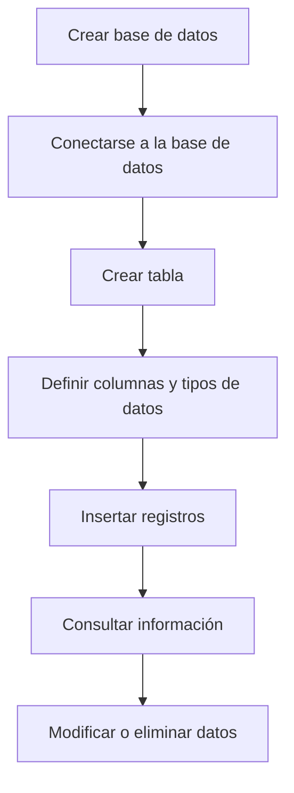

# PostgreSQL

## Introducción

**PostgreSQL** es un sistema de gestión de bases de datos relacional y objeto-relacional de código abierto. Es reconocido por su robustez, extensibilidad, cumplimiento de estándares SQL y capacidad para trabajar con aplicaciones que requieren integridad de datos y operaciones complejas.

> [!NOTE]
> El nombre correcto es **PostgreSQL**. No corresponde interpretarlo como "Postgres Structured Query Language". El nombre proviene originalmente del proyecto **POSTGRES**, sucesor del sistema de bases de datos **INGRES**.

---

# Origen de PostgreSQL

PostgreSQL tiene sus orígenes en la **Universidad de California, Berkeley (UC Berkeley)**, donde el científico de la computación **Michael Stonebraker** lideró un equipo de investigación encargado de desarrollar un nuevo sistema de gestión de bases de datos.

El proyecto surgió como sucesor del sistema **INGRES**, buscando solucionar algunas de las limitaciones de los sistemas de bases de datos existentes.

## Evolución de PostgreSQL

### Década de 1980

En **1986**, Michael Stonebraker comenzó el proyecto **POSTGRES** en la Universidad de California, Berkeley.

El objetivo era desarrollar un sistema de bases de datos que pudiera superar algunas de las limitaciones de los sistemas relacionales existentes y proporcionar características más avanzadas.

### 1989

El proyecto comenzó a ser conocido como **Postgres**, haciendo referencia a que era el sucesor de INGRES.

### 1996

El proyecto adoptó el nombre **PostgreSQL**, reflejando su incorporación del lenguaje SQL.

### PostgreSQL 10 — 2017

En 2017 se lanzó PostgreSQL 10, incorporando mejoras importantes relacionadas con:

- Rendimiento.
- Escalabilidad.
- Replicación.
- Administración de grandes volúmenes de datos.

### PostgreSQL 11 — 2018

PostgreSQL 11 incorporó mejoras importantes en diferentes áreas del sistema, incluyendo:

- Particionamiento.
- Consultas.
- Ejecución de procedimientos.
- Rendimiento general.

> [!NOTE]
> En los apuntes originales se indica que PostgreSQL 11 llegó en 2019. La versión PostgreSQL 11 fue lanzada en **2018**.

### PostgreSQL 12 — 2019

PostgreSQL 12 incorporó mejoras relacionadas con:

- Rendimiento de consultas.
- Optimización del planificador.
- Administración de memoria.
- Ejecución de consultas.

### PostgreSQL 13 — 2020

PostgreSQL 13 incorporó mejoras relacionadas con:

- Rendimiento de consultas.
- Índices.
- Gestión de datos.
- Mantenimiento de tablas.

### PostgreSQL 14 — 2021

PostgreSQL 14 incorporó mejoras relacionadas con:

- Velocidad de procesamiento.
- Administración de índices.
- Consultas.
- Rendimiento general.

> [!NOTE]
> En los apuntes originales las fechas de PostgreSQL 12, 13 y 14 aparecen desplazadas un año. Las versiones fueron lanzadas en 2019, 2020 y 2021 respectivamente.

### 2023

PostgreSQL continuaba siendo uno de los sistemas de gestión de bases de datos de código abierto más utilizados, especialmente en aplicaciones que requieren robustez, integridad y funcionalidades avanzadas.

---

# Características principales de PostgreSQL

## Licencia de código abierto

PostgreSQL se distribuye bajo la **PostgreSQL License**, una licencia de código abierto que permite utilizar, modificar y distribuir el software.

Esto facilita su utilización tanto en proyectos personales como en aplicaciones empresariales.

## Arquitectura extensible

Una de las características más importantes de PostgreSQL es su capacidad de extensión.

Permite trabajar con:

- Funciones personalizadas.
- Tipos de datos personalizados.
- Operadores.
- Extensiones.
- Índices especializados.

Esta arquitectura permite adaptar el sistema a diferentes necesidades.

## Soporte para transacciones complejas

PostgreSQL proporciona soporte para transacciones que cumplen las propiedades **ACID**:

- **Atomicidad:** una transacción se ejecuta completamente o no se aplica.
- **Consistencia:** los datos deben permanecer en un estado válido.
- **Aislamiento:** las transacciones concurrentes se gestionan de forma controlada.
- **Durabilidad:** una vez confirmados los cambios, estos deben permanecer almacenados.

## Escalabilidad

PostgreSQL puede utilizarse en sistemas con diferentes tamaños y cargas de trabajo.

Puede aprovechar recursos adicionales del servidor mediante escalamiento vertical y también puede formar parte de arquitecturas distribuidas mediante diferentes mecanismos de replicación y distribución.

## Búsqueda de texto

PostgreSQL proporciona funcionalidades avanzadas para realizar búsquedas de texto completo.

Esto permite implementar sistemas de búsqueda más complejos que una simple comparación de cadenas.

---

# PostgreSQL frente a MySQL

Tanto PostgreSQL como MySQL son sistemas de gestión de bases de datos ampliamente utilizados.

La elección entre ambos depende principalmente de los requisitos del sistema, las características de la aplicación y el tipo de operaciones que se realizarán.

| Característica | MySQL | PostgreSQL |
|---|---|---|
| Tipo | SGBD relacional | SGBD relacional y objeto-relacional |
| Código abierto | Sí | Sí |
| Transacciones | Soportadas | Soportadas |
| Extensibilidad | Buena | Muy alta |
| Consultas complejas | Buen soporte | Excelente soporte |
| Tipos de datos | Amplios | Muy amplios y extensibles |
| Integridad de datos | Alta | Muy alta |
| Uso frecuente | Aplicaciones web y sistemas generales | Aplicaciones complejas, análisis y sistemas empresariales |

MySQL se ha destacado históricamente por su facilidad de uso, rendimiento y amplio uso en aplicaciones web.

PostgreSQL se destaca por su potencia, robustez, extensibilidad, cumplimiento de estándares y soporte para operaciones complejas.

> [!IMPORTANT]
> No existe un SGBD que sea siempre mejor que otro. La elección debe realizarse de acuerdo con los requisitos específicos del sistema.

---

# Arquitectura de PostgreSQL

La arquitectura de PostgreSQL está compuesta por diferentes componentes que trabajan conjuntamente para recibir solicitudes de los clientes, procesarlas y acceder a los datos almacenados.

De forma simplificada, podemos representar el flujo de la siguiente manera:

```mermaid
flowchart TD
    A[Cliente / Aplicación] --> B[Cliente PostgreSQL]
    B --> C[Servidor PostgreSQL]
    C --> D[Proceso Backend]
    D --> E[Procesamiento de SQL]
    E --> F[Shared Buffers]
    F --> G[Storage Manager]
    G --> H[Archivos de datos]
````

## Cliente

El cliente es la aplicación que realiza una solicitud al servidor PostgreSQL.

Puede tratarse de:

* `psql`.
* Una aplicación desarrollada en otro lenguaje.
* Una herramienta gráfica.
* Una aplicación web.
* Un servicio backend.

Las aplicaciones pueden comunicarse con PostgreSQL mediante librerías o controladores.

## Servidor PostgreSQL

El servidor recibe las solicitudes realizadas por los clientes y se encarga de procesarlas.

Cuando recibe una consulta puede realizar operaciones de tipo:

* **DDL:** definición de estructuras.
* **DML:** modificación de datos.
* **DQL:** consulta de datos.
* **DCL:** control de permisos.
* **TCL:** control de transacciones.

## Backend

Cada conexión de cliente es atendida por un proceso backend que procesa las solicitudes SQL y coordina el acceso a los recursos necesarios.

## Shared Buffers

Los **Shared Buffers** son una región de memoria compartida utilizada por PostgreSQL para almacenar temporalmente páginas de datos y reducir accesos innecesarios al almacenamiento físico.

## Storage Manager

El sistema de almacenamiento se encarga de gestionar la lectura y escritura de información persistente en los archivos de datos.

---

# Glosario inicial

Estos conceptos forman parte de los elementos fundamentales para trabajar con bases de datos relacionales.

| Término       | Descripción                                                                                               |
| ------------- | --------------------------------------------------------------------------------------------------------- |
| `PRIMARY KEY` | Restricción que identifica de forma única cada registro de una tabla.                                     |
| `SQL Query`   | Consulta escrita utilizando SQL para solicitar o manipular información.                                   |
| `Transaction` | Conjunto de operaciones que se ejecutan como una unidad lógica.                                           |
| `Schema`      | Espacio lógico dentro de una base de datos que permite organizar objetos como tablas, vistas y funciones. |
| `DDL`         | Lenguaje utilizado para definir o modificar estructuras de la base de datos.                              |
| `DML`         | Lenguaje utilizado para insertar, modificar y eliminar datos.                                             |
| `DQL`         | Lenguaje utilizado principalmente para consultar datos mediante `SELECT`.                                 |
| `DCL`         | Lenguaje utilizado para administrar permisos y privilegios.                                               |
| `TCL`         | Lenguaje utilizado para controlar transacciones.                                                          |

---

# Creación y administración de bases de datos

Crear una base de datos consiste en establecer un espacio lógico dentro del servidor PostgreSQL donde se almacenarán y administrarán diferentes objetos, como:

* Tablas.
* Esquemas.
* Vistas.
* Funciones.
* Índices.
* Secuencias.

## Crear una base de datos

La sintaxis básica es:

```sql
CREATE DATABASE nombre_base_datos;
```

Ejemplo:

```sql
CREATE DATABASE campus;
```

> [!WARNING]
> `CREATE DATABASE` crea una base de datos, pero no cambia automáticamente la conexión actual hacia ella.

Para conectarse a una base de datos utilizando `psql` se puede utilizar:

```text
\c campus
```

---

# Indicadores de PostgreSQL

Cuando se trabaja con PostgreSQL desde **`psql`**, el indicador de la consola proporciona información sobre el estado actual de la entrada.

## Indicadores principales

| Indicador | Significado                                                                                                                        |
| --------- | ---------------------------------------------------------------------------------------------------------------------------------- |
| `=#`      | La consola está lista para recibir una nueva sentencia SQL cuando se encuentra conectado con un usuario con privilegios adecuados. |
| `-#`      | La sentencia todavía no ha terminado y PostgreSQL espera más entrada.                                                              |
| `" #`     | Existe una cadena entre comillas dobles que todavía no ha sido cerrada.                                                            |
| `' #`     | Existe una cadena entre comillas simples que todavía no ha sido cerrada.                                                           |
| `\?`      | Muestra la ayuda relacionada con los comandos internos de `psql`.                                                                  |

> [!NOTE]
> Los indicadores pueden variar dependiendo del estado de la conexión, el usuario y el contexto en el que se encuentre la consola.

La opción:

```text
\?
```

muestra la ayuda de los comandos internos de `psql`.

Para salir de la consola se puede utilizar:

```text
\q
```

---

# Definición y manejo de tablas

Una **tabla** es una estructura utilizada para almacenar datos organizados en filas y columnas.

## Características principales de una tabla

### Columnas

Las columnas representan los atributos o campos que describen la información almacenada.

Ejemplo:

```text
nombre
edad
promedio
fecha_ingreso
```

### Filas

Las filas representan registros individuales.

Por ejemplo, una fila puede representar a un estudiante específico.

### Clave primaria

La **PRIMARY KEY** identifica de forma única cada registro de la tabla.

Ejemplo:

```sql
id SERIAL PRIMARY KEY
```

---

# Creación de tablas

La sintaxis básica es:

```sql
CREATE TABLE nombre_tabla (
    columna tipo_dato,
    columna tipo_dato,
    ...
);
```

Ejemplo:

```sql
CREATE TABLE estudiantes (
    id SERIAL PRIMARY KEY,
    nombre VARCHAR(60),
    edad INT
);
```

Para eliminar una tabla solamente si existe:

```sql
DROP TABLE IF EXISTS estudiantes;
```

> [!WARNING]
> `DROP TABLE` elimina la estructura de la tabla y sus datos. Debe utilizarse con cuidado.

---

# Tipos de datos en PostgreSQL

PostgreSQL proporciona una gran variedad de tipos de datos.

## Tipos numéricos

Entre los tipos numéricos se encuentran:

* `SMALLINT`
* `INT`
* `BIGINT`
* `NUMERIC`
* `DECIMAL`
* `REAL`
* `DOUBLE PRECISION`

También existen tipos relacionados con números autoincrementales, aunque en versiones modernas se recomienda considerar las **columnas `IDENTITY`** para nuevos diseños.

## Tipos de caracteres

Los principales tipos de caracteres utilizados son:

* `CHAR`
* `VARCHAR`
* `TEXT`

### `CHAR`

Almacena cadenas de longitud fija.

```sql
genero CHAR(1)
```

### `VARCHAR`

Permite almacenar cadenas con una longitud máxima especificada.

```sql
nombre VARCHAR(60)
```

### `TEXT`

Permite almacenar cadenas de longitud variable sin establecer un límite específico mediante `VARCHAR(n)`.

```sql
analisis_perfil TEXT
```

## Tipos de fecha y hora

PostgreSQL proporciona diferentes tipos para manejar fechas y horas:

* `DATE`
* `TIME`
* `TIMESTAMP`
* `TIMESTAMPTZ`
* `INTERVAL`

## Tipo booleano

El tipo `BOOLEAN` representa valores lógicos:

```text
TRUE
FALSE
```

Ejemplo:

```sql
activo BOOLEAN
```

## Tipos geométricos y de red

PostgreSQL también proporciona tipos especializados para representar:

* Datos geométricos.
* Direcciones de red.
* Rangos.
* Datos JSON.
* Arreglos.
* Otros tipos especializados.

---

# Creación de una tabla de estudiantes

El siguiente ejemplo utiliza diferentes tipos de datos disponibles en PostgreSQL:

```sql
DROP TABLE IF EXISTS estudiantes;

CREATE TABLE estudiantes (
    id SERIAL PRIMARY KEY,
    nombre VARCHAR(60),
    genero CHAR(1),
    edad INT,
    promedio FLOAT,
    altura NUMERIC(3,2),
    fecha_ingreso DATE,
    hora_ingreso TIME,
    fecha_hora_registro TIMESTAMP,
    duracion_tests INTERVAL,
    analisis_perfil TEXT,
    activo BOOLEAN
);
```

## Explicación de las columnas

| Columna               | Tipo           | Propósito                                                                  |
| --------------------- | -------------- | -------------------------------------------------------------------------- |
| `id`                  | `SERIAL`       | Identificador numérico generado automáticamente.                           |
| `nombre`              | `VARCHAR(60)`  | Nombre del estudiante.                                                     |
| `genero`              | `CHAR(1)`      | Almacena un carácter para representar el género según el modelo utilizado. |
| `edad`                | `INT`          | Edad del estudiante.                                                       |
| `promedio`            | `FLOAT`        | Promedio académico.                                                        |
| `altura`              | `NUMERIC(3,2)` | Altura almacenada con precisión numérica.                                  |
| `fecha_ingreso`       | `DATE`         | Fecha de ingreso.                                                          |
| `hora_ingreso`        | `TIME`         | Hora de ingreso.                                                           |
| `fecha_hora_registro` | `TIMESTAMP`    | Fecha y hora del registro.                                                 |
| `duracion_tests`      | `INTERVAL`     | Duración de una actividad o prueba.                                        |
| `analisis_perfil`     | `TEXT`         | Descripción o análisis del estudiante.                                     |
| `activo`              | `BOOLEAN`      | Indica si el estudiante está activo.                                       |

> [!NOTE]
> `SERIAL` es una característica tradicional de PostgreSQL que utiliza una secuencia para generar valores automáticamente. En diseños modernos también puede utilizarse `GENERATED ... AS IDENTITY`.

---

# Comandos principales de `psql`

PostgreSQL proporciona comandos internos para consultar información y administrar la sesión desde `psql`.

| Comando      | Significado                                                                                     |
| ------------ | ----------------------------------------------------------------------------------------------- |
| `\l`         | Lista las bases de datos disponibles.                                                           |
| `\d`         | Muestra información sobre objetos, especialmente tablas.                                        |
| `\dt`        | Lista las tablas.                                                                               |
| `\ds`        | Lista las secuencias.                                                                           |
| `\di`        | Lista los índices.                                                                              |
| `\dv`        | Lista las vistas.                                                                               |
| `\dp`        | Lista los privilegios de acceso.                                                                |
| `\z`         | Muestra los privilegios sobre las tablas.                                                       |
| `\da`        | Lista funciones de agregación.                                                                  |
| `\df`        | Lista las funciones.                                                                            |
| `\g archivo` | Ejecuta la consulta actual y puede dirigir la salida hacia un archivo según el uso del comando. |
| `\H`         | Cambia el formato de salida a HTML.                                                             |
| `\! comando` | Ejecuta un comando del sistema operativo.                                                       |
| `\?`         | Muestra ayuda sobre los comandos internos de `psql`.                                            |
| `\q`         | Sale de `psql`.                                                                                 |

> [!IMPORTANT]
> Los comandos que comienzan con `\` son comandos propios de `psql`, no instrucciones SQL estándar.

---

# CRUD en PostgreSQL

CRUD representa las cuatro operaciones básicas que se realizan sobre los datos:

| Operación | SQL      | Propósito            |
| --------- | -------- | -------------------- |
| Create    | `INSERT` | Agregar registros.   |
| Read      | `SELECT` | Consultar registros. |
| Update    | `UPDATE` | Modificar registros. |
| Delete    | `DELETE` | Eliminar registros.  |

## `INSERT`

Se utiliza para agregar nuevos registros:

```sql
INSERT INTO estudiantes (
    nombre,
    edad,
    promedio
)
VALUES (
    'Camila Rodríguez',
    21,
    4.35
);
```

## `SELECT`

Se utiliza para consultar información:

```sql
SELECT *
FROM estudiantes;
```

## `UPDATE`

Se utiliza para modificar registros existentes:

```sql
UPDATE estudiantes
SET promedio = 4.50
WHERE id = 1;
```

## `DELETE`

Se utiliza para eliminar registros:

```sql
DELETE FROM estudiantes
WHERE id = 1;
```

> [!WARNING]
> Las instrucciones `UPDATE` y `DELETE` deben utilizarse cuidadosamente. Si se omite el `WHERE`, la operación puede afectar todos los registros de la tabla.

---

# REVIEW

## Creación de la base de datos

```sql
CREATE DATABASE campus;
```

Para trabajar con la base de datos desde `psql`:

```text
\c campus
```

> [!WARNING]
> En los apuntes originales aparecía:

```sql
SET serch_path TO campus;
SHOW serch_path;
```

Esto presenta dos problemas:

1. `serch_path` está escrito incorrectamente. El parámetro correcto es `search_path`.
2. `search_path` no sirve para cambiar de base de datos. Se utiliza para determinar qué esquemas se buscan cuando se hace referencia a objetos sin especificar el esquema.

Por lo tanto, para cambiar de base de datos desde `psql`, la alternativa correcta es:

```text
\c campus
```

Si se quisiera modificar el esquema de búsqueda, entonces sí se utilizaría:

```sql
SET search_path TO nombre_esquema;
```

---

# Creación de la tabla `estudiantes`

```sql
DROP TABLE IF EXISTS estudiantes;

CREATE TABLE estudiantes (
   id SERIAL PRIMARY KEY,
   nombre VARCHAR(60),
   genero CHAR(1),
   edad INT,
   promedio FLOAT,
   altura NUMERIC(3,2),
   fecha_ingreso DATE,
   hora_ingreso TIME,
   fecha_hora_registro TIMESTAMP,
   duracion_tests INTERVAL,
   analisis_perfil TEXT,
   activo BOOLEAN
);
```

---

# Inserción de datos

El siguiente bloque inserta los registros de estudiantes utilizados para practicar consultas SQL:

```sql
INSERT INTO estudiantes (
   nombre, edad, promedio, altura, genero, fecha_ingreso,
   hora_ingreso, fecha_hora_registro, duracion_tests, analisis_perfil, activo
) VALUES
('Camila Rodríguez', 21, 4.35, 1.62, 'F', '2023-01-15', '08:15:00', '2023-01-10 14:30:00', '02:15:00', 'Estudiante destacada en el área de lógica de programación y bases de datos.', true),
('Mateo Gómez', 19, 3.80, 1.75, 'M', '2024-02-01', '09:00:00', '2024-01-20 10:15:00', '01:45:00', 'Demuestra alto rendimiento en razonamiento cuantitativo y pensamiento crítico.', true),
('Valeria Martínez', 22, 4.80, 1.68, 'F', '2022-08-10', '07:30:00', '2022-08-01 09:00:00', '03:10:00', 'Perfil analítico avanzado con excelente capacidad de resolución de problemas.', true),
('Santiago López', 20, 3.20, 1.80, 'M', '2023-08-15', '10:30:00', '2023-08-05 16:20:00', '01:30:00', 'Requiere refuerzo en algoritmia básica, pero presenta buena asistencia.', true),
('Sofía Hernández', 18, 4.10, 1.58, 'F', '2024-01-20', '08:00:00', '2024-01-12 11:45:00', '02:00:00', 'Participación activa y constantes entregas a tiempo en proyectos grupales.', true),
('Lucas Pérez', 23, 2.95, 1.72, 'M', '2021-02-01', '14:00:00', '2021-01-15 08:30:00', '00:50:00', 'Rendimiento irregular durante el último periodo académico.', false),
('Isabella Pérez', 20, 4.50, 1.65, 'F', '2023-01-15', '08:30:00', '2023-01-08 13:10:00', '02:40:00', 'Excelente manejo de estructuras de datos y metodologías ágiles.', true),
('Alejandro Silva', 24, 3.65, 1.85, 'M', '2021-08-10', '11:15:00', '2021-07-28 15:00:00', '01:55:00', 'Habilidades sociales destacadas y buen liderazgo en equipos.', true),
('Mariana Torres', 19, 4.00, 1.60, 'F', '2024-02-01', '09:45:00', '2024-01-25 17:00:00', '02:10:00', 'Perfil constante con fuerte inclinación al desarrollo frontend.', true),
('Diego Ramírez', 21, 3.40, 1.78, 'M', '2022-08-10', '13:00:00', '2022-08-02 12:00:00', '01:20:00', 'Compromiso medio con las evaluaciones teóricas.', true),
('Gabriela Morales', 22, 4.65, 1.70, 'F', '2022-01-18', '07:45:00', '2022-01-10 10:00:00', '03:00:00', 'Capacidad sobresaliente de abstracción y análisis de datos.', true),
('Daniel Castro', 20, 3.85, 1.74, 'M', '2023-08-15', '08:15:00', '2023-08-01 11:30:00', '02:05:00', 'Buen desempeño práctico en laboratorios de software.', true),
('Lucía Vargas', 18, 4.25, 1.63, 'F', '2024-01-20', '10:00:00', '2024-01-14 09:20:00', '02:25:00', 'Alto interés en sistemas distribuidos y arquitectura de datos.', true),
('Joaquín Mendoza', 25, 3.10, 1.82, 'M', '2020-08-10', '15:30:00', '2020-07-30 14:15:00', '01:10:00', 'Estudiante de último semestre con carga académica reducida.', false),
('Elena Ortiz', 21, 4.90, 1.67, 'F', '2023-01-15', '08:00:00', '2023-01-05 08:00:00', '03:30:00', 'Matrícula de honor por promedio sobresaliente en la facultad.', true),
('Samuel Ruiz', 19, 3.50, 1.76, 'M', '2024-02-01', '11:00:00', '2024-01-22 16:40:00', '01:50:00', 'Buen progreso en materias de formación básica.', true),
('Victoria Navarro', 20, 3.75, 1.61, 'F', '2023-08-15', '09:15:00', '2023-08-03 10:10:00', '02:00:00', 'Habilidades de comunicación y trabajo colaborativo bien desarrolladas.', true),
('Nicolás Benítez', 22, 4.15, 1.79, 'M', '2022-08-10', '08:30:00', '2022-07-29 13:50:00', '02:15:00', 'Enfoque hacia redes y seguridad informática.', true),
('Daniela Flores', 19, 4.40, 1.64, 'F', '2024-01-20', '07:30:00', '2024-01-10 15:25:00', '02:50:00', 'Rapidez en la resolución de exámenes lógicos y matemáticos.', true),
('Tomás Reyes', 23, 2.80, 1.81, 'M', '2021-02-01', '16:00:00', '2021-01-20 11:00:00', '00:45:00', 'En proceso de seguimiento académico por bajo promedio.', false),
('Camila Gutiérrez', 21, 3.90, 1.69, 'F', '2023-01-15', '10:30:00', '2023-01-11 12:00:00', '02:00:00', 'Perseverante y orientada a detalles en documentación técnica.', true),
('Agustín Aguilar', 20, 4.05, 1.77, 'M', '2023-08-15', '08:45:00', '2023-08-07 14:10:00', '02:10:00', 'Interés en investigación sobre inteligencia artificial.', true),
('Renata Domínguez', 18, 4.70, 1.59, 'F', '2024-02-01', '08:00:00', '2024-01-18 09:30:00', '03:05:00', 'Puntaje destacado en las pruebas de ingreso nacional.', true),
('Matías Peralta', 24, 3.30, 1.83, 'M', '2021-08-10', '13:30:00', '2021-08-01 10:45:00', '01:25:00', 'Combina estudios con actividad laboral a tiempo parcial.', true),
('Paula Ramos', 22, 4.12, 1.66, 'F', '2022-01-18', '09:00:00', '2022-01-12 16:00:00', '02:20:00', 'Consistencia académica a lo largo de los semestres evaluados.', true),
('Benjamin Medina', 19, 3.60, 1.73, 'M', '2024-01-20', '11:30:00', '2024-01-15 11:15:00', '01:40:00', 'Participa activamente en talleres extracurriculares.', true),
('Antonia Vega', 20, 4.55, 1.62, 'F', '2023-08-15', '07:45:00', '2023-08-02 08:50:00', '02:55:00', 'Perfil autodidacta con dominio de herramientas avanzadas.', true),
('Thiago Guerrero', 21, 3.15, 1.76, 'M', '2023-01-15', '14:15:00', '2023-01-09 17:30:00', '01:15:00', 'Requiere tutorías de apoyo en ingeniería de software.', true),
('Carolina Campos', 23, 4.28, 1.68, 'F', '2021-08-10', '08:15:00', '2021-07-25 10:20:00', '02:35:00', 'Gran capacidad para el diseño de interfaces y usabilidad.', true),
('Bruno Delgado', 18, 3.95, 1.80, 'M', '2024-02-01', '10:15:00', '2024-01-21 13:00:00', '02:05:00', 'Ingreso reciente con excelente adaptabilidad.', true),
('Esperanza Cabrera', 22, 3.70, 1.60, 'F', '2022-08-10', '12:00:00', '2022-08-03 15:40:00', '01:50:00', 'Cumplimiento adecuado de los objetivos académicos establecidos.', true),
('Gabriel Molina', 20, 4.45, 1.78, 'M', '2023-01-15', '09:00:00', '2023-01-07 09:10:00', '02:45:00', 'Gran agilidad en resolución de algoritmos complejos.', true),
('Catalina Fuentes', 19, 4.02, 1.63, 'F', '2024-01-20', '08:30:00', '2024-01-13 10:05:00', '02:15:00', 'Excelente predisposición para proyectos interdisciplinarios.', true),
('Emilio Sandoval', 25, 2.70, 1.75, 'M', '2020-02-01', '17:00:00', '2020-01-18 16:50:00', '00:40:00', 'Inactivo por retiro voluntario del ciclo lectivo.', false),
('Fernanda Ríos', 21, 4.60, 1.67, 'F', '2023-08-15', '07:30:00', '2023-08-04 11:20:00', '03:15:00', 'Destacada participación en eventos y ferias de ciencia.', true),
('Gonzalo Valenzuela', 22, 3.55, 1.84, 'M', '2022-01-18', '10:45:00', '2022-01-11 14:00:00', '01:45:00', 'Buen desempeño en pruebas grupales y laboratorios.', true),
('Juana Ibáñez', 20, 3.88, 1.61, 'F', '2023-01-15', '11:00:00', '2023-01-06 12:35:00', '02:00:00', 'Organizada y metódica en sus entregas académicas.', true),
('Felipe Suáres', 19, 4.18, 1.77, 'M', '2024-02-01', '08:45:00', '2024-01-24 08:30:00', '02:20:00', 'Capacidad analítica por encima del promedio de la cohorte.', true),
('Martina Miranda', 23, 4.30, 1.65, 'F', '2021-08-10', '09:30:00', '2021-07-27 10:00:00', '02:30:00', 'Habilidades consolidadas en gestión de bases de datos.', true),
('Adrián Marín', 18, 3.45, 1.79, 'M', '2024-01-20', '13:15:00', '2024-01-16 17:15:00', '01:35:00', 'En proceso de adaptación a la carga horaria universitaria.', true),
('Ximena Roldán', 21, 4.75, 1.70, 'F', '2023-08-15', '08:00:00', '2023-08-06 09:40:00', '03:05:00', 'Perfil de investigación con alto rendimiento técnico.', true),
('Maximiliano Arias', 24, 3.05, 1.82, 'M', '2021-02-01', '15:00:00', '2021-01-19 15:10:00', '01:05:00', 'Bajo rendimiento en evaluaciones escritas de teoría.', false),
('Florencia Correa', 20, 4.10, 1.64, 'F', '2023-01-15', '10:00:00', '2023-01-10 11:50:00', '02:10:00', 'Demuestra constante iniciativa en resolución de problemas.', true),
('Ignacio Montero', 22, 3.92, 1.76, 'M', '2022-08-10', '09:15:00', '2022-07-31 13:00:00', '02:00:00', 'Desempeño equilibrado en ciencias básicas y aplicadas.', true),
('Constanza Paredes', 19, 4.42, 1.62, 'F', '2024-02-01', '07:45:00', '2024-01-23 10:45:00', '02:40:00', 'Gran dominio sintáctico y de análisis en lenguajes técnicos.', true),
('Esteban Salgado', 21, 3.35, 1.78, 'M', '2023-08-15', '12:30:00', '2023-08-08 16:30:00', '01:25:00', 'Progreso moderado durante el presente semestre.', true),
('Regina Serrano', 18, 4.20, 1.66, 'F', '2024-01-20', '08:15:00', '2024-01-15 08:20:00', '02:15:00', 'Destaca por su rapidez analítica en entornos prácticos.', true),
('Simón Bravo', 23, 3.78, 1.81, 'M', '2022-01-18', '11:00:00', '2022-01-09 14:20:00', '01:55:00', 'Perfil colaborativo y con buenas notas en proyectos.', true),
('Julieta Prieto', 20, 4.68, 1.63, 'F', '2023-01-15', '08:30:00', '2023-01-07 10:30:00', '03:00:00', 'Altas competencias académicas e interés en posgrados.', true),
('Álvaro Durán', 22, 3.25, 1.74, 'M', '2022-08-10', '14:45:00', '2022-08-01 11:00:00', '01:15:00', 'Asistencia regular a clases pero baja entrega de tareas.', true);
```

---

# Observaciones sobre PostgreSQL

## `SERIAL`

En el ejemplo se utiliza:

```sql
id SERIAL PRIMARY KEY
```

`SERIAL` permite generar automáticamente valores numéricos utilizando una secuencia asociada.

Es una característica ampliamente utilizada en PostgreSQL.

Para nuevos diseños también existe la alternativa mediante columnas `IDENTITY`, por ejemplo:

```sql
id INT GENERATED ALWAYS AS IDENTITY PRIMARY KEY
```

> [!NOTE]
> Para este ejercicio se mantiene `SERIAL` porque forma parte del ejemplo original y es una forma válida de aprender el funcionamiento de las secuencias en PostgreSQL.

---

# `FLOAT` y `NUMERIC`

En la tabla se utilizan:

```sql
promedio FLOAT
altura NUMERIC(3,2)
```

`FLOAT` utiliza representación de punto flotante, mientras que `NUMERIC` permite trabajar con precisión decimal exacta.

Para valores que representen cantidades donde la precisión decimal sea importante, como dinero, normalmente es preferible utilizar `NUMERIC` o `DECIMAL`.

En este ejercicio se conserva `FLOAT` para `promedio` porque forma parte del diseño original.

---

# `TIMESTAMP` e `INTERVAL`

La tabla utiliza:

```sql
fecha_hora_registro TIMESTAMP
```

para almacenar una fecha y hora.

También utiliza:

```sql
duracion_tests INTERVAL
```

para representar una duración.

Por ejemplo:

```text
02:15:00
```

representa una duración de dos horas y quince minutos.

Esto permite posteriormente realizar operaciones con fechas, horas y duraciones utilizando las funcionalidades de PostgreSQL.

---

# Flujo general de trabajo

El proceso utilizado en este ejercicio puede resumirse de la siguiente manera:



La idea fundamental es que primero se crea el espacio de trabajo, después se define la estructura de los datos y finalmente se almacenan y manipulan los registros.

---

# Resumen

PostgreSQL es un SGBD de código abierto originado en la Universidad de California, Berkeley, a partir del proyecto POSTGRES liderado por Michael Stonebraker.

Entre sus principales características se encuentran:

* Código abierto.
* Soporte de transacciones ACID.
* Arquitectura extensible.
* Amplia variedad de tipos de datos.
* Soporte para consultas complejas.
* Funcionalidades avanzadas de búsqueda.
* Soporte para diferentes tipos de índices.
* Herramientas de administración mediante `psql`.

Para trabajar con PostgreSQL desde la consola es importante diferenciar entre:

* **SQL:** lenguaje utilizado para interactuar con los datos y estructuras.
* **Comandos de `psql`:** instrucciones propias del cliente, como `\c`, `\l`, `\dt` y `\q`.

También es fundamental comprender la estructura de una tabla:

```text
Tabla
├── Columnas
│   ├── Nombre
│   ├── Tipo de dato
│   └── Restricciones
│
└── Filas
    ├── Registro 1
    ├── Registro 2
    └── Registro 3
```

---

# Glosario

| Término             | Descripción                                                                                                      |
| ------------------- | ---------------------------------------------------------------------------------------------------------------- |
| **PostgreSQL**      | Sistema de gestión de bases de datos relacional y objeto-relacional de código abierto.                           |
| **POSTGRES**        | Proyecto de base de datos desarrollado en Berkeley que dio origen a PostgreSQL.                                  |
| **INGRES**          | Sistema de gestión de bases de datos desarrollado en Berkeley y antecedente directo de POSTGRES.                 |
| **SGBD**            | Sistema de Gestión de Bases de Datos. Software encargado de almacenar, administrar y consultar datos.            |
| **SQL**             | Lenguaje utilizado para definir, consultar y manipular información en bases de datos relacionales.               |
| `psql`              | Cliente de línea de comandos utilizado para conectarse y trabajar con PostgreSQL.                                |
| `PRIMARY KEY`       | Restricción que identifica de manera única cada registro de una tabla.                                           |
| `SERIAL`            | Pseudotipo tradicional de PostgreSQL utilizado para generar valores numéricos mediante una secuencia.            |
| `IDENTITY`          | Mecanismo de PostgreSQL para generar automáticamente valores de una columna.                                     |
| `VARCHAR`           | Tipo de dato utilizado para almacenar cadenas de caracteres de longitud variable.                                |
| `TEXT`              | Tipo de dato utilizado para almacenar texto de longitud variable.                                                |
| `NUMERIC`           | Tipo numérico de precisión exacta, útil para valores donde se requiere precisión decimal.                        |
| `BOOLEAN`           | Tipo de dato que representa valores lógicos como `TRUE` y `FALSE`.                                               |
| `DATE`              | Tipo de dato utilizado para almacenar fechas.                                                                    |
| `TIME`              | Tipo de dato utilizado para almacenar horas.                                                                     |
| `TIMESTAMP`         | Tipo de dato utilizado para almacenar fecha y hora.                                                              |
| `INTERVAL`          | Tipo de dato utilizado para representar períodos o duraciones de tiempo.                                         |
| `Schema`            | Espacio lógico utilizado para organizar objetos dentro de una base de datos.                                     |
| `DDL`               | Lenguaje utilizado para definir y modificar estructuras de bases de datos.                                       |
| `DML`               | Lenguaje utilizado para insertar, actualizar y eliminar datos.                                                   |
| `DQL`               | Categoría utilizada para las operaciones de consulta de datos, principalmente `SELECT`.                          |
| `DCL`               | Lenguaje utilizado para administrar permisos y privilegios.                                                      |
| `TCL`               | Lenguaje utilizado para controlar transacciones.                                                                 |
| **Transacción**     | Conjunto de operaciones que se ejecutan como una unidad lógica.                                                  |
| **ACID**            | Propiedades de las transacciones: Atomicidad, Consistencia, Aislamiento y Durabilidad.                           |
| **Shared Buffers**  | Área de memoria compartida utilizada por PostgreSQL para almacenar temporalmente páginas de datos.               |
| **Backend**         | Proceso del servidor PostgreSQL encargado de atender y procesar las solicitudes de una conexión.                 |
| **Storage Manager** | Componente encargado de gestionar el almacenamiento persistente de los datos.                                    |
| **CRUD**            | Acrónimo de Create, Read, Update y Delete, operaciones básicas para gestionar datos.                             |
| `INSERT`            | Instrucción SQL utilizada para agregar registros.                                                                |
| `SELECT`            | Instrucción SQL utilizada para consultar información.                                                            |
| `UPDATE`            | Instrucción SQL utilizada para modificar registros existentes.                                                   |
| `DELETE`            | Instrucción SQL utilizada para eliminar registros.                                                               |
| `search_path`       | Configuración que determina los esquemas que PostgreSQL utiliza para resolver nombres de objetos no calificados. |
