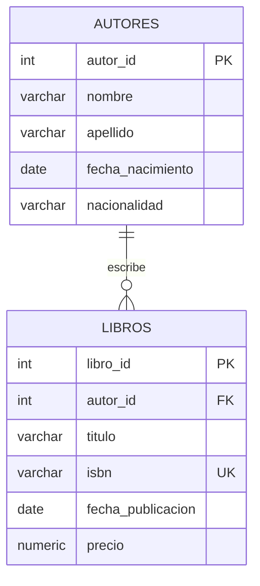

# PostgreSQL — Configuración, administración y consultas

Repositorio de ejercicios y prácticas relacionadas con **PostgreSQL**, enfocado en configuración básica del motor, tipos de datos, restricciones, índices, relaciones entre tablas y consultas SQL.

> [!NOTE]
> Este repositorio está orientado principalmente a la práctica. La documentación reúne los conceptos y comandos necesarios para comprender y reproducir los ejercicios sin convertir cada fragmento de código en una explicación teórica extensa.

---

## 📚 Contenido

* [Configuración y administración de PostgreSQL](#configuración-y-administración-de-postgresql)
* [Configuración del motor a nivel de acceso](#configuración-del-motor-a-nivel-de-acceso)
* [Tipos de datos numéricos](#uso-correcto-de-tipos-de-datos-numéricos)
* [Tipos de datos de fecha y hora](#uso-correcto-de-tipos-de-datos-para-fecha-y-hora)
* [Claves primarias](#definición-adecuada-de-claves-primarias)
* [Índices y rendimiento](#índices-y-rendimiento-de-consultas)
* [Datos sintéticos](#datos-sintéticos-para-trabajar)
* [Consultas PostgreSQL](#consultas-básicas-en-postgresql)
* [Relación entre tablas](#relación-entre-autores-y-libros)
* [Comandos de `psql`](#comandos-útiles-de-psql)
* [Indicadores de `psql`](#indicadores-del-cliente-psql)
* [Comparación MySQL vs PostgreSQL](#comparación-básica-mysql-vs-postgresql)
* [Glosario](#glosario)

---

## Configuración y administración de PostgreSQL

### Configuración del motor a nivel de acceso

La configuración de PostgreSQL permite controlar aspectos relacionados con:

* Estado del servicio.
* Usuarios y autenticación.
* Acceso mediante clientes externos.
* Conexiones desde otras máquinas.
* Direcciones de red en las que PostgreSQL escucha.
* Métodos de autenticación.

### 1. Verificar el servicio

Para comprobar que PostgreSQL está instalado y funcionando:

```bash
systemctl status postgresql
```

### 2. Acceder con el usuario `postgres`

El usuario `postgres` es el usuario administrativo creado normalmente durante la instalación.

```bash
sudo -i -u postgres
```

Después:

```bash
psql
```

Una vez dentro de `psql`, se pueden ejecutar instrucciones SQL y comandos propios del cliente.

### Establecer contraseña

Para establecer una contraseña para el usuario `postgres`:

```sql
ALTER USER postgres WITH PASSWORD 'campus2023';
```

> [!NOTE]
> Las cadenas de texto en SQL utilizan comillas simples (`'`). Las comillas tipográficas como `‘campus2023’` no son válidas en esta instrucción.

---

## Configuración de autenticación mediante `pg_hba.conf`

PostgreSQL utiliza `pg_hba.conf` para definir las reglas de autenticación y acceso de los clientes.

En PostgreSQL 16 sobre sistemas basados en Debian/Ubuntu, una ubicación habitual es:

```text
/etc/postgresql/16/main/pg_hba.conf
```

Una regla como:

```text
host    all    all    0.0.0.0/0    md5
```

permite conexiones IPv4 desde cualquier dirección.

Para IPv6:

```text
host    all    all    ::/0    md5
```

### Estructura de una regla

```text
host    all    all    0.0.0.0/0    md5
│       │      │      │             │
│       │      │      │             └── Método de autenticación
│       │      │      └──────────────── Rango de direcciones IPv4
│       │      └─────────────────────── Usuarios
│       └────────────────────────────── Bases de datos
└────────────────────────────────────── Tipo de conexión
```

### `md5` y `scram-sha-256`

`md5` permite autenticación mediante contraseña utilizando el método indicado por PostgreSQL.

En configuraciones modernas, `scram-sha-256` es el método recomendado para autenticación mediante contraseña:

```text
host    all    all    0.0.0.0/0    scram-sha-256
```

> [!WARNING]
> `0.0.0.0/0` permite conexiones IPv4 desde cualquier dirección. No significa únicamente "cualquier equipo de mi red". En un entorno real se recomienda limitar las redes o direcciones IP permitidas y utilizar reglas de firewall apropiadas.

---

## Permitir conexiones externas

Modificar `pg_hba.conf` no es suficiente para aceptar conexiones externas.

También es necesario configurar las interfaces de red en `postgresql.conf`.

Una ubicación habitual es:

```text
/etc/postgresql/16/main/postgresql.conf
```

La propiedad correspondiente es:

```conf
listen_addresses = '*'
```

El valor `*` indica que PostgreSQL escuchará conexiones en todas las interfaces de red disponibles.

También se pueden especificar direcciones concretas:

```conf
listen_addresses = 'localhost,192.168.1.100'
```

Esto permite limitar las interfaces donde PostgreSQL aceptará conexiones.

> [!IMPORTANT]
> Los dos archivos cumplen funciones diferentes:
>
> * `postgresql.conf` → controla, entre otras configuraciones, **dónde escucha PostgreSQL**.
> * `pg_hba.conf` → controla **qué conexiones están permitidas y cómo se autentican**.

---

## Reiniciar PostgreSQL

Después de modificar estas configuraciones:

```bash
sudo systemctl restart postgresql
```

Se puede comprobar nuevamente el servicio:

```bash
systemctl status postgresql
```

> [!NOTE]
> Algunos cambios de configuración pueden aplicarse mediante una recarga sin reiniciar completamente el servicio. Para estas prácticas, reiniciar PostgreSQL permite aplicar los cambios de forma sencilla.

---

## Consideraciones al actualizar PostgreSQL

Al cambiar de versión de PostgreSQL es importante revisar:

* Compatibilidad de las aplicaciones.
* Extensiones utilizadas.
* Herramientas de administración.
* Cambios introducidos entre versiones.
* Documentación y registros de cambios.

Algunas aplicaciones pueden depender de características específicas de una versión determinada y presentar problemas después de una actualización.

---

# Uso correcto de tipos de datos numéricos

Los tipos de datos deben representar correctamente la naturaleza de la información almacenada.

Por ejemplo, utilizar `VARCHAR` para almacenar cantidades numéricas puede generar problemas cuando posteriormente se realizan operaciones matemáticas.

## Ejemplo inicial

```sql
CREATE TABLE ventas (
    producto_id INT,
    cantidad VARCHAR(10)
);
```

En este caso, `cantidad` se almacena como texto aunque representa un número.

### Conversión a `INT`

PostgreSQL permite modificar el tipo de una columna utilizando `ALTER COLUMN ... TYPE`.

```sql
ALTER TABLE ventas
ALTER COLUMN cantidad TYPE INT
USING cantidad::INT;
```

La expresión:

```sql
cantidad::INT
```

realiza una conversión explícita del valor hacia `INT`.

### Problemas de utilizar `VARCHAR`

* Requiere conversiones para realizar operaciones numéricas.
* Permite almacenar valores que no representan números.
* Puede provocar errores durante cálculos.
* Las comparaciones pueden comportarse como texto en lugar de números.
* El tipo de dato no representa correctamente la naturaleza del campo.

### Corrección

Si el valor representa una cantidad entera:

```sql
cantidad INT
```

También se pueden agregar restricciones:

```sql
cantidad INT CHECK (cantidad >= 0)
```

---

# Uso correcto de tipos de datos para fecha y hora

Las fechas y horas deben almacenarse utilizando tipos diseñados específicamente para representar información temporal.

## Ejemplo inicial

```sql
CREATE TABLE eventos (
    evento_id INT,
    fecha_evento VARCHAR(10)
);
```

Al almacenar una fecha como texto pueden aparecer diferentes formatos y dificultades al realizar consultas y comparaciones.

### Conversión a `DATE`

```sql
ALTER TABLE eventos
ALTER COLUMN fecha_evento TYPE DATE
USING fecha_evento::DATE;
```

La expresión:

```sql
fecha_evento::DATE
```

convierte el valor almacenado en texto a `DATE`.

> [!WARNING]
> La conversión requiere que los valores existentes puedan convertirse correctamente a `DATE`. Si existen datos inválidos o formatos incompatibles, PostgreSQL puede producir un error.

### Tipos temporales principales

| Tipo        | Uso                            |
| ----------- | ------------------------------ |
| `DATE`      | Fecha sin hora                 |
| `TIME`      | Hora                           |
| `TIMESTAMP` | Fecha y hora                   |
| `INTERVAL`  | Duración o intervalo de tiempo |

### Corrección

Se debe seleccionar el tipo según la información necesaria:

```sql
DATE
```

cuando solamente interesa la fecha.

```sql
TIMESTAMP
```

cuando se necesita fecha y hora.

---

# Definición adecuada de claves primarias

Una `PRIMARY KEY` permite identificar de forma única cada registro de una tabla.

## Ejemplo inicial

```sql
CREATE TABLE usuarios (
    usuario_id INT,
    nombre VARCHAR(100)
);
```

En este diseño `usuario_id` todavía no tiene una restricción que garantice valores únicos y no nulos.

### Agregar una clave primaria

```sql
ALTER TABLE usuarios
ADD PRIMARY KEY (usuario_id);
```

También puede definirse directamente:

```sql
CREATE TABLE usuarios (
    usuario_id INT PRIMARY KEY,
    nombre VARCHAR(100)
);
```

Una clave primaria:

* Identifica de forma única cada fila.
* No permite valores `NULL`.
* Permite establecer relaciones con otras tablas.
* Genera un índice asociado a la restricción.

> [!IMPORTANT]
> La función principal de una `PRIMARY KEY` es garantizar la integridad e identificación única de los registros. El índice asociado ayuda al rendimiento, pero no debe confundirse el propósito de la clave primaria con el del índice.

---

# Índices y rendimiento de consultas

Los índices son estructuras que pueden mejorar la velocidad de recuperación de información.

Son especialmente útiles en tablas grandes donde determinadas búsquedas se realizan con frecuencia.

Los índices suelen ser candidatos importantes en columnas utilizadas frecuentemente en:

* `WHERE`
* `JOIN`
* `ORDER BY`
* Búsquedas específicas.
* Restricciones de unicidad.

### Ejemplo

Consulta:

```sql
SELECT *
FROM usuarios
WHERE correo = 'usuario@example.com';
```

Índice:

```sql
CREATE INDEX idx_usuarios_correo
ON usuarios(correo);
```

La utilidad dependerá del tamaño de la tabla, la distribución de los datos y de cómo PostgreSQL ejecute la consulta.

---

# Índices: casos de cuidado

Los índices no deben crearse indiscriminadamente.

## Tablas con muchas operaciones de escritura

En operaciones como:

* `INSERT`
* `UPDATE`
* `DELETE`

los índices también necesitan mantenerse actualizados.

Por esta razón, una cantidad excesiva de índices puede aumentar el costo de las operaciones de escritura y ocupar espacio adicional.

> [!NOTE]
> Un índice puede mejorar las lecturas, pero también tiene un costo de almacenamiento y mantenimiento.

---

## Columnas con muchos valores repetidos

Un índice puede ser menos útil cuando una columna contiene pocos valores diferentes y estos se repiten en muchos registros.

Por ejemplo:

```text
activo
```

con solamente:

```text
TRUE
FALSE
```

puede tener una baja selectividad.

La utilidad real del índice dependerá de:

* Tamaño de la tabla.
* Distribución de los valores.
* Selectividad.
* Consultas realizadas.
* Plan de ejecución seleccionado por PostgreSQL.

---

# Índices: máxima utilidad

## Tablas grandes utilizadas para búsquedas

En tablas grandes, los índices pueden reducir la cantidad de registros que PostgreSQL necesita revisar para encontrar información específica.

## Columnas con valores únicos o muy diferenciados

Los identificadores y correos electrónicos suelen ser buenos candidatos cuando se realizan búsquedas por valores concretos.

Ejemplo:

```sql
CREATE INDEX idx_usuarios_correo
ON usuarios(correo);
```

> [!IMPORTANT]
> La decisión de crear un índice debe basarse en las consultas reales y en el análisis del rendimiento. No todas las columnas necesitan un índice.

---

# Datos sintéticos para trabajar

Los siguientes datos permiten practicar:

* Creación de tablas.
* Tipos de datos.
* Restricciones.
* Inserción de registros.
* Relaciones.
* `JOIN`.
* Ordenamiento.
* Consultas básicas.

## Seleccionar la base de datos

Dentro de `psql`:

```sql
\c campus
```

---

# Inspección de tablas

Para consultar la estructura de una tabla desde `psql`:

```text
\d ventas
```

En MySQL es común utilizar:

```sql
DESC ventas;
```

En PostgreSQL, el comando correspondiente dentro de `psql` es:

```text
\d ventas
```

---

# Tipos de datos: MySQL y PostgreSQL

| MySQL      | PostgreSQL  | Uso          |
| ---------- | ----------- | ------------ |
| `DATETIME` | `TIMESTAMP` | Fecha y hora |
| `DATE`     | `DATE`      | Fecha        |
| `TIME`     | `TIME`      | Hora         |
| —          | `INTERVAL`  | Duración     |

> [!NOTE]
> PostgreSQL dispone de tipos temporales adicionales. `INTERVAL` permite representar una duración, como días, horas, minutos o segundos.

---

# Identificadores autoincrementales

Una diferencia común entre MySQL y PostgreSQL está en la generación automática de identificadores.

### MySQL

```sql
id INT PRIMARY KEY AUTO_INCREMENT
```

### PostgreSQL

Una forma tradicional:

```sql
id SERIAL PRIMARY KEY
```

`SERIAL` utiliza una secuencia para generar valores enteros automáticamente.

PostgreSQL también dispone de columnas de identidad para diseños modernos:

```sql
id INT GENERATED ALWAYS AS IDENTITY PRIMARY KEY
```

> [!NOTE]
> `SERIAL` continúa siendo válido y es muy utilizado en ejercicios y material educativo.

---

# Creación de la tabla `autores`

```sql
CREATE TABLE autores (
    autor_id SERIAL PRIMARY KEY,
    nombre VARCHAR(30) NOT NULL,
    apellido VARCHAR(30) NOT NULL,
    fecha_nacimiento DATE,
    nacionalidad VARCHAR(50)
);
```

### Elementos principales

| Elemento           | Función                          |
| ------------------ | -------------------------------- |
| `autor_id`         | Identificador del autor          |
| `SERIAL`           | Generación automática de valores |
| `PRIMARY KEY`      | Identificación única             |
| `nombre`           | Nombre del autor                 |
| `apellido`         | Apellido                         |
| `NOT NULL`         | Impide valores `NULL`            |
| `fecha_nacimiento` | Fecha de nacimiento              |
| `nacionalidad`     | Nacionalidad                     |

---

# Creación de la tabla `libros`

```sql
CREATE TABLE libros (
    libro_id SERIAL PRIMARY KEY,
    autor_id INT NOT NULL,
    titulo VARCHAR(255) NOT NULL,
    isbn VARCHAR(20) UNIQUE,
    fecha_publicacion DATE,
    precio NUMERIC(10, 2)
);
```

### Elementos principales

| Elemento            | Función                  |
| ------------------- | ------------------------ |
| `libro_id`          | Identificador del libro  |
| `autor_id`          | Identificador del autor  |
| `titulo`            | Título del libro         |
| `isbn`              | ISBN                     |
| `UNIQUE`            | Evita valores duplicados |
| `fecha_publicacion` | Fecha de publicación     |
| `precio`            | Valor decimal            |

Para establecer explícitamente la relación con `autores`:

```sql
CREATE TABLE libros (
    libro_id SERIAL PRIMARY KEY,
    autor_id INT NOT NULL,
    titulo VARCHAR(255) NOT NULL,
    isbn VARCHAR(20) UNIQUE,
    fecha_publicacion DATE,
    precio NUMERIC(10, 2),

    CONSTRAINT fk_libros_autores
        FOREIGN KEY (autor_id)
        REFERENCES autores(autor_id)
);
```

La `FOREIGN KEY` garantiza que el `autor_id` utilizado en `libros` corresponda a un autor existente.

---

# Inserción de autores

```sql
INSERT INTO autores (
    nombre,
    apellido,
    fecha_nacimiento,
    nacionalidad
) VALUES
('Gabriel', 'García Márquez', '1927-03-06', 'Colombiana'),
('Isabel', 'Allende', '1942-08-02', 'Chilena'),
('Jorge Luis', 'Borges', '1899-08-24', 'Argentina'),
('Mario', 'Vargas Llosa', '1936-03-28', 'Peruana'),
('Julio', 'Cortázar', '1914-08-26', 'Argentina'),
('Laura', 'Esquivel', '1950-09-30', 'Mexicana'),
('Carlos', 'Ruiz Zafón', '1964-09-25', 'Española'),
('Octavio', 'Paz', '1914-03-31', 'Mexicana'),
('Rosa', 'Montero', '1951-01-03', 'Española'),
('Arturo', 'Pérez-Reverte', '1951-11-25', 'Española');
```

---

# Inserción de libros

Los libros se relacionan con los autores mediante `autor_id`.

```sql
INSERT INTO libros (
    autor_id,
    titulo,
    isbn,
    fecha_publicacion,
    precio
) VALUES
(1, 'Cien años de soledad', '978-0307474728', '1967-05-30', 25.50),
(1, 'El amor en los tiempos del cólera', '978-0307387264', '1985-12-05', 22.00),
(1, 'Crónica de una muerte anunciada', '978-1400034710', '1981-04-01', 15.90),
(1, 'El coronel no tiene quien le escriba', '978-0307474698', '1961-06-01', 14.50),
(1, 'Del amor y otros demonios', '978-0307387783', '1994-04-15', 18.00),
(2, 'La casa de los espíritus', '978-0525433477', '1982-10-01', 21.00),
(2, 'Paula', '978-0060927219', '1994-05-01', 17.50),
(2, 'Eva Luna', '978-0060920043', '1987-01-01', 19.99),
(2, 'Largo pétalo de mar', '978-1984899156', '2019-05-21', 24.00),
(2, 'Inés del alma mía', '978-0061149023', '2006-08-29', 16.80),
(3, 'Ficciones', '978-0307950925', '1944-01-01', 16.00),
(3, 'El Aleph', '978-8420633114', '1949-06-30', 18.50),
(3, 'El hacedor', '978-8420655161', '1960-01-01', 14.00),
(3, 'El libro de arena', '978-8420633138', '1975-01-01', 15.00),
(3, 'Historia universal de la infamia', '978-8420633145', '1935-01-01', 13.50),
(4, 'La ciudad y los perros', '978-8420471839', '1963-10-01', 20.00),
(4, 'La fiesta del Chivo', '978-8420441672', '2000-03-01', 23.90),
(4, 'Conversación en La Catedral', '978-8420471846', '1969-12-01', 26.00),
(4, 'Pantaleón y las visitadoras', '978-8420471853', '1973-05-01', 17.90),
(4, 'La tía Julia y el escribidor', '978-8420471860', '1977-01-01', 19.50),
(5, 'Rayuela', '978-8437604572', '1963-06-28', 22.50),
(5, 'Bestiario', '978-8497592420', '1951-01-01', 14.90),
(5, 'Historias de cronopios y de famas', '978-8497592437', '1962-01-01', 15.99),
(5, 'Todos los fuegos el fuego', '978-8497592444', '1966-01-01', 16.50),
(5, 'Las armas secretas', '978-8497592451', '1959-01-01', 13.90),
(6, 'Como agua para chocolate', '978-0385721233', '1989-09-01', 18.00),
(6, 'La ley del amor', '978-0743202114', '1995-01-01', 16.00),
(6, 'Tan veloz como el deseo', '978-0385721240', '2001-08-07', 17.20),
(6, 'Malinche', '978-1400095810', '2006-05-02', 19.00),
(6, 'El diario de Tita', '978-0451493644', '2016-05-17', 21.50),
(7, 'La sombra del viento', '978-8408163381', '2001-04-12', 24.90),
(7, 'El juego del ángel', '978-8408081253', '2008-04-17', 23.50),
(7, 'El prisionero del cielo', '978-8408105824', '2011-11-17', 21.00),
(7, 'El laberinto de los espíritus', '978-8408163350', '2016-11-17', 27.90),
(7, 'Marina', '978-8408084261', '1999-01-01', 15.50),
(8, 'El laberinto de la soledad', '978-9681600105', '1950-01-01', 16.90),
(8, 'Piedra de sol', '978-9681603526', '1957-01-01', 12.00),
(8, 'El arco y la lira', '978-9681603533', '1956-01-01', 18.50),
(8, 'Libertad bajo palabra', '978-9681603540', '1949-01-01', 14.50),
(8, 'Árbol adentro', '978-9681603557', '1987-01-01', 13.00),
(9, 'La loca de la casa', '978-8420466040', '2003-09-01', 17.90),
(9, 'Historia del Rey Transparente', '978-8420469270', '2005-10-01', 20.00),
(9, 'La ridícula idea de no volver a verte', '978-8420413648', '2013-03-06', 18.50),
(9, 'Los tiempos del odio', '978-8420433301', '2018-10-18', 21.00),
(9, 'La buena suerte', '978-8420454740', '2020-08-27', 19.90),
(10, 'El capitán Alatriste', '978-8420483535', '1996-11-01', 16.50),
(10, 'La tabla de Flandes', '978-8420483542', '1990-01-01', 18.00),
(10, 'El club Dumas', '978-8420483559', '1993-01-01', 19.50),
(10, 'La reina del sur', '978-8420464350', '2002-06-01', 23.00),
(10, 'Falcó', '978-8420419688', '2016-10-19', 20.90);
```

---

# Consultas básicas en PostgreSQL

## Buscar un autor por nombre

```sql
SELECT *
FROM autores
WHERE nombre = 'Carlos';
```

La consulta devuelve los registros cuyo nombre sea exactamente `Carlos`.

---

## Consultar los libros de un autor específico

```sql
SELECT
    a.nombre AS autor_nombre,
    a.apellido AS autor_apellido,
    l.titulo AS libro_nombre,
    l.fecha_publicacion
FROM libros AS l
INNER JOIN autores AS a
    ON l.autor_id = a.autor_id
WHERE a.nombre = 'Gabriel'
  AND a.apellido = 'García Márquez'
ORDER BY l.fecha_publicacion DESC;
```

La consulta:

1. Relaciona `libros` con `autores`.
2. Filtra al autor especificado.
3. Obtiene el título y fecha de publicación.
4. Ordena los libros desde el más reciente al más antiguo.

---

# Relación entre `autores` y `libros`

Conceptualmente:

* Un autor puede tener cero o muchos libros.
* Cada libro pertenece a un autor.
* `autores.autor_id` identifica al autor.
* `libros.autor_id` relaciona el libro con su autor.
* `FOREIGN KEY` permite garantizar la integridad referencial.



---

# Comandos útiles de `psql`

`psql` dispone de comandos internos que comienzan normalmente con `\`.

| Comando           | Función                                   |
| ----------------- | ----------------------------------------- |
| `\l`              | Lista las bases de datos.                 |
| `\c nombre_bd`    | Cambia la conexión a una base de datos.   |
| `\d nombre_tabla` | Describe la estructura de una tabla.      |
| `\dt`             | Lista las tablas.                         |
| `\ds`             | Lista las secuencias.                     |
| `\di`             | Lista los índices.                        |
| `\dv`             | Lista las vistas.                         |
| `\dp` / `\z`      | Muestra privilegios de las tablas.        |
| `\da`             | Lista funciones de agregación.            |
| `\df`             | Lista funciones.                          |
| `\g`              | Ejecuta la consulta actual.               |
| `\H`              | Cambia el formato de salida a HTML.       |
| `\! comando`      | Ejecuta un comando del sistema operativo. |
| `\?`              | Muestra ayuda de los comandos internos.   |

> [!NOTE]
> Estos comandos pertenecen al cliente `psql` y no al lenguaje SQL estándar. Por ejemplo, `\d`, `\l` y `\c` son comandos propios de `psql`.

---

# Indicadores del cliente `psql`

El indicador mostrado por `psql` permite identificar el estado actual de la entrada.

| Indicador | Significado                                                           |
| --------- | --------------------------------------------------------------------- |
| `=#`      | Listo para una nueva sentencia con un usuario superusuario.           |
| `=>`      | Listo para una nueva sentencia con un usuario que no es superusuario. |
| `-#`      | Se está introduciendo una sentencia SQL en varias líneas.             |
| `"#`      | Existe una cadena o identificador entre comillas dobles sin cerrar.   |
| `'#`      | Existe una cadena entre comillas simples sin cerrar.                  |

Una sentencia SQL puede finalizar utilizando `;`.

También se puede ejecutar la consulta mediante:

```text
\g
```

Ejemplo:

```sql
SELECT *
FROM autores
\g
```

---

# Comparación básica MySQL vs PostgreSQL

| Concepto                   | MySQL            | PostgreSQL              |
| -------------------------- | ---------------- | ----------------------- |
| Fecha y hora               | `DATETIME`       | `TIMESTAMP`             |
| Fecha                      | `DATE`           | `DATE`                  |
| Hora                       | `TIME`           | `TIME`                  |
| Duración                   | —                | `INTERVAL`              |
| Autoincremento tradicional | `AUTO_INCREMENT` | `SERIAL`                |
| Describir tabla            | `DESC tabla`     | `\d tabla`              |
| Modificar tipo             | `MODIFY COLUMN`  | `ALTER COLUMN ... TYPE` |

### Modificar una columna

**MySQL**

```sql
ALTER TABLE ventas
MODIFY COLUMN cantidad INT;
```

**PostgreSQL**

```sql
ALTER TABLE ventas
ALTER COLUMN cantidad TYPE INT
USING cantidad::INT;
```

---

# Clasificación básica de operaciones SQL

Durante los ejercicios aparecen diferentes categorías de instrucciones SQL.

| Categoría | Propósito                            | Ejemplos                     |
| --------- | ------------------------------------ | ---------------------------- |
| **DDL**   | Definir o modificar estructuras      | `CREATE`, `ALTER`, `DROP`    |
| **DML**   | Insertar, modificar o eliminar datos | `INSERT`, `UPDATE`, `DELETE` |
| **DQL**   | Consultar o recuperar datos          | `SELECT`                     |

> [!NOTE]
> `SELECT` suele clasificarse como **DQL (Data Query Language)**. Aunque en algunos materiales educativos se agrupa dentro de DML de forma general, aquí se mantiene separado para distinguir las operaciones de consulta de las operaciones de modificación de datos.

---

# Conceptos fundamentales utilizados

Durante la configuración y trabajo con PostgreSQL aparecen varios conceptos importantes:

* **Base de datos:** espacio lógico donde se organizan y almacenan los datos.
* **Tabla:** estructura formada por filas y columnas utilizada para almacenar registros.
* **Índice:** estructura que puede mejorar el rendimiento de determinadas consultas.
* **Esquema:** espacio lógico utilizado para organizar objetos dentro de una base de datos.
* **Transacción:** conjunto de operaciones que PostgreSQL puede tratar como una unidad de trabajo.
* **Consulta SQL:** instrucción utilizada para consultar o manipular información mediante SQL.
* **DDL:** conjunto de instrucciones utilizadas para definir o modificar estructuras de la base de datos, como `CREATE`, `ALTER` y `DROP`.
* **DML:** conjunto de instrucciones utilizadas para manipular los datos, como `INSERT`, `UPDATE` y `DELETE`.
* **DQL:** término utilizado habitualmente para referirse a las consultas de recuperación de datos, principalmente `SELECT`.
* **`psql`:** cliente de línea de comandos utilizado para conectarse y trabajar con PostgreSQL.
* **`pg_hba.conf`:** archivo utilizado para definir reglas de autenticación y acceso de clientes.
* **`postgresql.conf`:** archivo principal de configuración del servidor PostgreSQL.
* **`SERIAL`:** mecanismo tradicional de PostgreSQL para generar valores enteros mediante una secuencia.
* **`TIMESTAMP`:** tipo de dato utilizado para almacenar fecha y hora.
* **`INTERVAL`:** tipo de dato utilizado para representar una duración o intervalo de tiempo.
* **`NUMERIC`:** tipo numérico exacto utilizado cuando se necesita precisión decimal.
* **`JOIN`:** operación utilizada para combinar información proveniente de varias tablas.
* **`INNER JOIN`:** combinación que devuelve únicamente los registros que tienen coincidencias en ambas tablas.
* **`ALIAS`:** nombre temporal utilizado para referirse a una tabla o columna dentro de una consulta.
* **`CONSTRAINT`:** restricción utilizada para establecer reglas de integridad sobre los datos.
* **`UNIQUE`:** restricción que evita valores duplicados en una columna o conjunto de columnas.
* **`NOT NULL`:** restricción que impide almacenar valores `NULL`.
* **`CHECK`:** restricción que permite exigir que los valores cumplan una condición.
* **`FOREIGN KEY`:** restricción que mantiene la integridad referencial entre tablas.


---

# Glosario

| Término            | Descripción                                                                                                 |
| ------------------ | ----------------------------------------------------------------------------------------------------------- |
| **PostgreSQL**     | Sistema de gestión de bases de datos relacional y objeto-relacional de código abierto.                      |
| **POSTGRES**       | Proyecto de base de datos desarrollado en Berkeley que dio origen a PostgreSQL.                             |
| **INGRES**         | Sistema de gestión de bases de datos desarrollado en Berkeley y antecedente directo de POSTGRES.            |
| **SGBD**           | Sistema de Gestión de Bases de Datos. Software encargado de almacenar, administrar y consultar datos.       |
| **SQL**            | Lenguaje utilizado para definir, consultar y manipular información en bases de datos relacionales.          |
| `psql`             | Cliente de línea de comandos utilizado para conectarse y trabajar con PostgreSQL.                           |
| **Base de datos**  | Espacio lógico donde se organizan y almacenan datos.                                                        |
| **Tabla**          | Estructura formada por filas y columnas utilizada para almacenar registros.                                 |
| **PRIMARY KEY**    | Restricción que identifica de manera única cada registro de una tabla.                                      |
| **FOREIGN KEY**    | Restricción que establece una relación entre una tabla y otra y ayuda a mantener la integridad referencial. |
| **UNIQUE**         | Restricción que evita valores duplicados en una columna o conjunto de columnas.                             |
| **NOT NULL**       | Restricción que impide almacenar valores `NULL`.                                                            |
| **CHECK**          | Restricción que exige que los valores cumplan una condición determinada.                                    |
| **CONSTRAINT**     | Restricción utilizada para establecer reglas de integridad sobre los datos.                                 |
| **SERIAL**         | Pseudotipo tradicional de PostgreSQL utilizado para generar valores numéricos mediante una secuencia.       |
| **IDENTITY**       | Mecanismo de PostgreSQL para generar automáticamente valores de una columna.                                |
| `VARCHAR`          | Tipo de dato utilizado para almacenar cadenas de caracteres de longitud variable.                           |
| `TEXT`             | Tipo de dato utilizado para almacenar texto de longitud variable.                                           |
| `INT`              | Tipo de dato utilizado para almacenar números enteros.                                                      |
| `NUMERIC`          | Tipo numérico de precisión exacta, útil para valores donde se requiere precisión decimal.                   |
| `BOOLEAN`          | Tipo de dato que representa valores `TRUE` o `FALSE`.                                                       |
| `DATE`             | Tipo de dato utilizado para almacenar fechas.                                                               |
| `TIME`             | Tipo de dato utilizado para almacenar horas.                                                                |
| `TIMESTAMP`        | Tipo de dato utilizado para almacenar fecha y hora.                                                         |
| `INTERVAL`         | Tipo de dato utilizado para representar una duración o intervalo de tiempo.                                 |
| **Índice**         | Estructura que puede mejorar el rendimiento de determinadas consultas.                                      |
| **Selectividad**   | Capacidad de una columna para distinguir registros mediante sus valores.                                    |
| **JOIN**           | Operación utilizada para combinar información proveniente de varias tablas.                                 |
| **INNER JOIN**     | Combinación que devuelve únicamente registros que tienen coincidencias en ambas tablas.                     |
| **Alias**          | Nombre temporal utilizado para referirse a una tabla o columna dentro de una consulta.                      |
| **Esquema**        | Espacio lógico utilizado para organizar objetos dentro de una base de datos.                                |
| **Transacción**    | Conjunto de operaciones que PostgreSQL puede tratar como una unidad de trabajo.                             |
| **DDL**            | Lenguaje utilizado para definir o modificar estructuras de la base de datos.                                |
| **DML**            | Lenguaje utilizado para insertar, modificar y eliminar datos.                                               |
| **DQL**            | Lenguaje utilizado para realizar consultas y recuperar datos, principalmente mediante `SELECT`.             |
| `pg_hba.conf`      | Archivo utilizado para definir reglas de autenticación y acceso de clientes.                                |
| `postgresql.conf`  | Archivo principal de configuración del servidor PostgreSQL.                                                 |
| `listen_addresses` | Parámetro que determina en qué direcciones de red PostgreSQL acepta conexiones.                             |
| `md5`              | Método de autenticación mediante contraseña disponible en PostgreSQL.                                       |
| `scram-sha-256`    | Método moderno de autenticación mediante contraseña recomendado para nuevas configuraciones.                |
| `ALTER TABLE`      | Instrucción utilizada para modificar la estructura de una tabla.                                            |
| `CAST` / `::`      | Mecanismos utilizados para convertir un valor de un tipo de dato a otro.                                    |

---

# Resumen

En esta etapa se trabajan principalmente los siguientes aspectos de PostgreSQL:

1. Verificación del servicio mediante `systemctl`.
2. Acceso al motor mediante el usuario `postgres`.
3. Configuración de contraseñas.
4. Configuración de `pg_hba.conf`.
5. Configuración de `postgresql.conf`.
6. Uso de `listen_addresses`.
7. Reinicio y comprobación del servicio.
8. Uso correcto de tipos numéricos.
9. Conversión mediante `ALTER COLUMN ... TYPE ... USING`.
10. Uso correcto de tipos `DATE`, `TIME`, `TIMESTAMP` e `INTERVAL`.
11. Definición de claves primarias.
12. Uso de restricciones.
13. Creación y análisis de índices.
14. Identificación de casos donde los índices son útiles o costosos.
15. Creación de tablas relacionadas.
16. Inserción de datos sintéticos.
17. Consultas con `SELECT`.
18. Uso de `INNER JOIN`.
19. Comandos internos de `psql`.
20. Diferencias básicas entre MySQL y PostgreSQL.
21. Clasificación de instrucciones DDL, DML y DQL.

La idea principal es aplicar correctamente los conceptos de PostgreSQL dentro de los ejercicios, utilizando tipos de datos, restricciones, relaciones e índices de acuerdo con la información que se necesita almacenar y consultar.


## Ejercicios de reforzamiento

Para reforzar los conceptos trabajados en esta clase:

* [Review DDL 02](https://github.com/Velasco-c/postgres-review/blob/main/database/DDL/02-review.sql)
* [Review DML 02](https://github.com/Velasco-c/postgres-review/blob/main/database/DML/02-review.sql)
* [Review DQL 02](https://github.com/Velasco-c/postgres-review/blob/main/database/DQL/02-review.sql)
