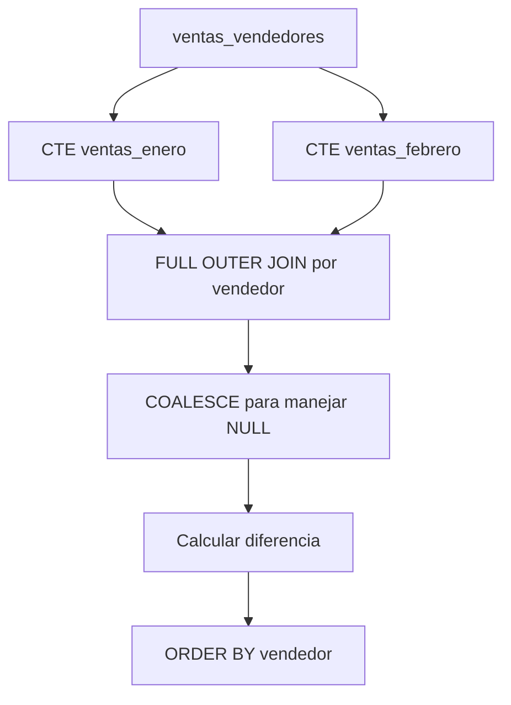

# Funciones de Ventana y CTEs en PostgreSQL

## Introducción

se trabajara con dos herramientas importantes para construir consultas SQL más avanzadas en PostgreSQL:

* **Funciones de ventana (Window Functions)**.
* **Expresiones comunes de tabla (CTEs, Common Table Expressions)**.

Ambas permiten realizar análisis sobre los datos sin limitarse a consultas simples.

Las funciones de ventana permiten realizar cálculos sobre un conjunto de filas manteniendo el detalle de cada registro. Por otro lado, las CTEs permiten estructurar consultas complejas dividiéndolas en bloques lógicos mediante `WITH`.

> [!IMPORTANT]
> Una diferencia fundamental es que las funciones de ventana **no eliminan ni agrupan las filas originales**, mientras que las funciones de agregación utilizadas con `GROUP BY` normalmente reducen varias filas a una fila por grupo.

---

# 1. Datos sintéticos para trabajar

Para practicar las funciones de ventana y las CTEs se utiliza la tabla `ventas_vendedores`.

La tabla almacena:

| Columna    | Tipo            | Descripción                               |
| ---------- | --------------- | ----------------------------------------- |
| `fecha`    | `DATE`          | Fecha en la que se realizó la venta.      |
| `vendedor` | `VARCHAR(50)`   | Nombre del vendedor que realizó la venta. |
| `monto`    | `NUMERIC(8, 2)` | Valor monetario de la venta.              |

## Creación de la tabla

```sql
CREATE TABLE ventas_vendedores (
    fecha DATE,
    vendedor VARCHAR(50),
    monto NUMERIC(8, 2)
);
```

## Inserción de datos

```sql
INSERT INTO ventas_vendedores (fecha, vendedor, monto) VALUES
('2026-01-01', 'Juan', 100.00),
('2026-01-01', 'Ana', 150.00),
('2026-01-02', 'Carlos', 210.50),
('2026-01-02', 'Maria', 180.00),
('2026-01-03', 'Pedro', 95.20),
('2026-01-03', 'Sofia', 320.00),
('2026-01-04', 'Juan', 140.00),
('2026-01-05', 'Ana', 275.50),
('2026-01-05', 'Luisa', 85.00),
('2026-01-06', 'Carlos', 190.00),
('2026-01-07', 'Maria', 410.00),
('2026-01-08', 'Pedro', 115.30),
('2026-01-09', 'Sofia', 230.00),
('2026-01-10', 'Juan', 310.00),
('2026-01-11', 'Ana', 90.00),
('2026-01-12', 'Luisa', 165.00),
('2026-01-13', 'Carlos', 280.00),
('2026-01-14', 'Maria', 135.50),
('2026-01-15', 'Pedro', 200.00),
('2026-01-16', 'Sofia', 450.00),
('2026-01-18', 'Juan', 175.00),
('2026-01-20', 'Ana', 220.00),
('2026-01-22', 'Luisa', 300.00),
('2026-01-25', 'Carlos', 125.00),
('2026-01-28', 'Maria', 390.00),
('2026-02-01', 'Pedro', 105.00),
('2026-02-01', 'Sofia', 260.00),
('2026-02-02', 'Juan', 195.00),
('2026-02-03', 'Ana', 310.50),
('2026-02-04', 'Luisa', 140.00),
('2026-02-05', 'Carlos', 230.00),
('2026-02-06', 'Maria', 180.00),
('2026-02-07', 'Pedro', 85.50),
('2026-02-08', 'Sofia', 500.00),
('2026-02-10', 'Juan', 215.00),
('2026-02-11', 'Ana', 160.00),
('2026-02-12', 'Luisa', 290.00),
('2026-02-14', 'Carlos', 110.00),
('2026-02-15', 'Maria', 420.00),
('2026-02-16', 'Pedro', 175.00),
('2026-02-18', 'Sofia', 330.00),
('2026-02-19', 'Juan', 250.00),
('2026-02-20', 'Ana', 130.00),
('2026-02-21', 'Luisa', 205.00),
('2026-02-22', 'Carlos', 370.00),
('2026-02-24', 'Maria', 155.00),
('2026-02-25', 'Pedro', 280.00),
('2026-02-26', 'Sofia', 190.00),
('2026-02-27', 'Juan', 400.00),
('2026-02-28', 'Ana', 225.00);
```

---

# 2. Funciones de ventana (Window Functions)

Las **funciones de ventana** permiten realizar cálculos sobre un conjunto de filas relacionadas con la fila que se está procesando, sin convertir todo el conjunto en una única fila.

Esto permite obtener información como:

* Valor anterior o siguiente.
* Sumas acumuladas.
* Promedios.
* Rankings.
* Comparaciones entre filas.
* Valores máximos o mínimos dentro de un grupo.
* Otros cálculos analíticos.

La principal característica es que **mantienen las filas individuales del resultado**.

## Funciones de agregación tradicionales vs. funciones de ventana

Una agregación tradicional puede reducir varias filas:

```sql
SELECT
    vendedor,
    SUM(monto) AS total_vendido
FROM ventas_vendedores
GROUP BY vendedor;
```

El resultado contiene una fila por vendedor.

En cambio, una función de ventana puede calcular el total acumulado y conservar cada venta:

```sql
SELECT
    fecha,
    vendedor,
    monto,
    SUM(monto) OVER (
        PARTITION BY vendedor
        ORDER BY fecha
    ) AS monto_acumulado
FROM ventas_vendedores;
```

En este caso se mantiene cada transacción individual.

> [!IMPORTANT]
> La diferencia clave es que `GROUP BY` agrupa filas para producir resultados agregados, mientras que una función de ventana realiza el cálculo sobre una ventana de filas **sin eliminar las filas individuales del resultado**.

---

# 3. Estructura general de una función de ventana

Una función de ventana suele utilizar la cláusula `OVER()`:

```sql
funcion() OVER (
    PARTITION BY columna
    ORDER BY columna
)
```

Sus componentes principales son:

| Elemento       | Función                                                                   |
| -------------- | ------------------------------------------------------------------------- |
| `funcion()`    | Operación que se realizará, por ejemplo `SUM()`, `AVG()` o `LAG()`.       |
| `OVER()`       | Indica que la función debe ejecutarse como función de ventana.            |
| `PARTITION BY` | Divide las filas en grupos independientes para realizar el cálculo.       |
| `ORDER BY`     | Define el orden en el que se procesan las filas dentro de cada partición. |

---

# 4. `PARTITION BY`

`PARTITION BY` divide los registros en grupos lógicos.

En el dataset, utilizar:

```sql
PARTITION BY vendedor
```

significa que cada vendedor tendrá su propia ventana de cálculo.

Por ejemplo:

```text
Juan
 ├── Venta 1
 ├── Venta 2
 ├── Venta 3
 └── ...

Ana
 ├── Venta 1
 ├── Venta 2
 └── ...

Carlos
 ├── Venta 1
 ├── Venta 2
 └── ...
```

Los cálculos de Juan no se mezclan con los de Ana o Carlos.

---

# 5. `ORDER BY` dentro de `OVER()`

Cuando se utiliza:

```sql
ORDER BY fecha
```

se establece el orden de las filas dentro de cada partición.

Por ejemplo, para Juan:

```text
2026-01-01 → 100.00
2026-01-04 → 140.00
2026-01-10 → 310.00
2026-01-18 → 175.00
2026-02-02 → 195.00
...
```

Este orden es especialmente importante para funciones como `LAG()` y para cálculos acumulativos.

> [!WARNING]
> Si existen varias filas con exactamente el mismo valor utilizado en `ORDER BY`, el orden entre esas filas puede no quedar determinado de forma única. Cuando ese orden importe, es recomendable añadir una columna adicional que permita establecer un orden inequívoco.

---

# 6. `LAG()` — Obtener el valor anterior

`LAG()` permite acceder a un valor de una fila anterior dentro de la ventana.

Sintaxis general:

```sql
LAG(columna) OVER (
    PARTITION BY columna
    ORDER BY columna
)
```

En este caso se utiliza para obtener el monto de la venta anterior realizada por cada vendedor.

## Consulta

```sql
SELECT
    fecha,
    vendedor,
    monto AS monto_actual,
    LAG(monto) OVER (
        PARTITION BY vendedor
        ORDER BY fecha
    ) AS monto_anterior
FROM ventas_vendedores
ORDER BY vendedor, fecha;
```

## Explicación

La consulta devuelve:

* La fecha de la venta.
* El vendedor.
* El monto de la venta actual.
* El monto de la venta anterior del mismo vendedor.

`LAG(monto)` busca el valor de `monto` correspondiente a la fila anterior dentro de la partición.

Por ejemplo:

| Fecha      | Vendedor | Monto actual | Monto anterior |
| ---------- | -------- | -----------: | -------------: |
| 2026-01-01 | Juan     |       100.00 |         `NULL` |
| 2026-01-04 | Juan     |       140.00 |         100.00 |
| 2026-01-10 | Juan     |       310.00 |         140.00 |
| 2026-01-18 | Juan     |       175.00 |         310.00 |

La primera venta de cada vendedor no tiene una venta anterior dentro de su partición, por lo que `LAG()` devuelve `NULL`.

> [!IMPORTANT]
> `LAG()` es especialmente útil para comparar un registro con el registro anterior, por ejemplo, para analizar cambios entre ventas consecutivas.

---

# 7. Sumas acumuladas con `SUM() OVER()`

Una función de ventana también puede utilizar funciones de agregación como `SUM()`.

La diferencia es que el cálculo se realiza manteniendo el detalle de cada fila.

## Consulta

El objetivo es generar una lista detallada de las ventas mostrando:

* Fecha de la transacción.
* Vendedor.
* Monto actual.
* Suma acumulada de las ventas realizadas por ese vendedor hasta la fecha de cada registro.

```sql
SELECT
    fecha AS fecha_transaccion,
    vendedor,
    monto AS monto_actual,
    SUM(monto) OVER (
        PARTITION BY vendedor
        ORDER BY fecha
    ) AS monto_acumulado
FROM ventas_vendedores
ORDER BY vendedor, fecha;
```

## Explicación

La expresión:

```sql
SUM(monto) OVER (
    PARTITION BY vendedor
    ORDER BY fecha
)
```

puede interpretarse de la siguiente manera:

1. `SUM(monto)` indica que se realizará una suma.
2. `OVER()` convierte la operación en una función de ventana.
3. `PARTITION BY vendedor` crea una ventana independiente para cada vendedor.
4. `ORDER BY fecha` establece el orden cronológico.
5. La suma se va acumulando a medida que se recorren las ventas.

Por ejemplo, para Juan:

| Fecha      |  Monto | Acumulado |
| ---------- | -----: | --------: |
| 2026-01-01 | 100.00 |    100.00 |
| 2026-01-04 | 140.00 |    240.00 |
| 2026-01-10 | 310.00 |    550.00 |
| 2026-01-18 | 175.00 |    725.00 |

La información individual de cada venta permanece visible.

---

# 8. Cómo interpretar una función de ventana

Una forma útil de leer esta expresión:

```sql
SUM(monto) OVER (
    PARTITION BY vendedor
    ORDER BY fecha
)
```

es:

> "Suma el `monto` de las ventas pertenecientes al mismo vendedor y procesa esas ventas en orden de fecha."

Visualmente:

```text
ventas_vendedores
       |
       v
PARTITION BY vendedor
       |
       +------ Juan ------+
       |                  |
       |            ORDER BY fecha
       |                  |
       |        SUM(monto) acumulado
       |
       +------ Ana -------+
       |                  |
       |            ORDER BY fecha
       |                  |
       |        SUM(monto) acumulado
       |
       +----- Carlos -----+
                          |
                    ORDER BY fecha
                          |
                   SUM(monto) acumulado
```

---

# 9. Expresiones comunes de tabla (CTEs)

Una **CTE (Common Table Expression)** es una expresión que permite definir un conjunto de resultados dentro de una consulta mediante la cláusula `WITH`.

La estructura general es:

```sql
WITH nombre_cte AS (
    SELECT ...
)
SELECT ...
FROM nombre_cte;
```

Una CTE puede entenderse como una **subconsulta con nombre y alcance limitado a la sentencia en la que se define**.

Las CTEs son especialmente útiles cuando una consulta contiene varias etapas de procesamiento.

En lugar de construir una consulta enorme y difícil de leer, podemos dividirla conceptualmente:

```text
Consulta principal
       |
       +── CTE 1
       |
       +── CTE 2
       |
       +── Resultado final
```

> [!IMPORTANT]
> Una CTE no debe confundirse automáticamente con una tabla temporal permanente. Su definición existe para la sentencia SQL en la que se utiliza.

---

# 10. Sintaxis básica de una CTE

```sql
WITH nombre_cte AS (
    SELECT ...
)
SELECT ...
FROM nombre_cte;
```

También es posible definir varias CTEs:

```sql
WITH primera_cte AS (
    SELECT ...
),
segunda_cte AS (
    SELECT ...
)
SELECT ...
FROM primera_cte
JOIN segunda_cte
    ON ...;
```

Esto permite construir una consulta en varias etapas.

---

# 11. Ejemplo con CTEs: comparación de enero y febrero

El siguiente ejemplo utiliza dos CTEs:

* `ventas_enero`
* `ventas_febrero`

Cada una calcula el total vendido por vendedor durante un mes diferente.

```sql
WITH ventas_enero AS (
    SELECT
        vendedor,
        SUM(monto) AS total_enero
    FROM ventas_vendedores
    WHERE fecha >= '2026-01-01'
      AND fecha < '2026-02-01'
    GROUP BY vendedor
),
ventas_febrero AS (
    SELECT
        vendedor,
        SUM(monto) AS total_febrero
    FROM ventas_vendedores
    WHERE fecha >= '2026-02-01'
      AND fecha < '2026-03-01'
    GROUP BY vendedor
)
SELECT
    COALESCE(E.vendedor, F.vendedor) AS vendedor,
    COALESCE(E.total_enero, 0) AS enero,
    COALESCE(F.total_febrero, 0) AS febrero,
    COALESCE(F.total_febrero, 0) - COALESCE(E.total_enero, 0) AS diferencia
FROM ventas_enero E
FULL OUTER JOIN ventas_febrero F
    ON E.vendedor = F.vendedor
ORDER BY vendedor;
```

---

# 12. Desglose del ejemplo de CTEs

## Primera CTE: `ventas_enero`

```sql
WITH ventas_enero AS (
    SELECT
        vendedor,
        SUM(monto) AS total_enero
    FROM ventas_vendedores
    WHERE fecha >= '2026-01-01'
      AND fecha < '2026-02-01'
    GROUP BY vendedor
)
```

Esta parte calcula el total vendido por cada vendedor durante enero de 2026.

La condición:

```sql
WHERE fecha >= '2026-01-01'
  AND fecha < '2026-02-01'
```

representa el intervalo:

```text
2026-01-01 ≤ fecha < 2026-02-01
```

Es decir, incluye todo enero y excluye el 1 de febrero.

El resultado conceptual sería:

| Vendedor | Total enero |
| -------- | ----------: |
| Ana      |      735.50 |
| Carlos   |      805.50 |
| Juan     |      725.00 |
| Luisa    |      550.00 |
| Maria    |     1115.50 |
| Pedro    |      410.50 |
| Sofia    |     1000.00 |

---

## Segunda CTE: `ventas_febrero`

```sql
ventas_febrero AS (
    SELECT
        vendedor,
        SUM(monto) AS total_febrero
    FROM ventas_vendedores
    WHERE fecha >= '2026-02-01'
      AND fecha < '2026-03-01'
    GROUP BY vendedor
)
```

Realiza la misma operación, pero únicamente con las ventas de febrero de 2026.

---

# 13. `FULL OUTER JOIN`

Las dos CTEs se relacionan mediante:

```sql
FULL OUTER JOIN ventas_febrero F
    ON E.vendedor = F.vendedor
```

`FULL OUTER JOIN` conserva los registros que aparecen en cualquiera de las dos consultas.

Esto es útil en este ejemplo porque permite incluir vendedores que hayan realizado ventas solamente en enero, solamente en febrero o en ambos meses.

La relación se establece mediante:

```sql
ON E.vendedor = F.vendedor
```

Es decir, se busca al mismo vendedor en ambas CTEs.

---

# 14. `COALESCE()`

La consulta utiliza:

```sql
COALESCE(E.vendedor, F.vendedor)
```

y:

```sql
COALESCE(E.total_enero, 0)
```

`COALESCE()` devuelve el primer valor que no sea `NULL`.

Por ejemplo:

```sql
COALESCE(E.total_enero, 0)
```

significa:

> Si existe un total para enero, utilizarlo. Si el valor es `NULL`, utilizar `0`.

Esto resulta importante cuando un vendedor aparece únicamente en uno de los dos meses.

---

# 15. Cálculo de la diferencia

La consulta calcula:

```sql
COALESCE(F.total_febrero, 0)
-
COALESCE(E.total_enero, 0) AS diferencia
```

La operación es:

```text
Diferencia = Total febrero - Total enero
```

Por ejemplo, si un vendedor tiene:

```text
Enero   = 700
Febrero = 900
```

la diferencia será:

```text
900 - 700 = 200
```

Un valor positivo indica que febrero tuvo un total mayor que enero.

Un valor negativo indica que febrero tuvo un total menor.

---

# 16. Flujo lógico de la consulta



El flujo puede interpretarse como:

1. Se parte de `ventas_vendedores`.
2. Se calculan los totales de enero.
3. Se calculan los totales de febrero.
4. Se relacionan ambos resultados mediante el vendedor.
5. Se utilizan valores `0` cuando un mes no tiene ventas para determinado vendedor.
6. Se calcula la diferencia.
7. Se ordena el resultado final.

---

# 17. Ejercicio de práctica

El ejercicio planteado consiste en:

> Obtener el total vendido y el número de transacciones por cada vendedor durante enero de 2026 mediante una CTE y consultar únicamente a los vendedores que hayan superado los `$2000` en ventas totales.

## CTE utilizada

```sql
WITH ventas_enero AS (
    SELECT
        vendedor,
        COUNT(*) AS numero_transacciones,
        SUM(monto) AS total_vendido
    FROM ventas_vendedores
    WHERE fecha >= '2026-01-01'
      AND fecha < '2026-02-01'
    GROUP BY vendedor
)
SELECT
    vendedor,
    numero_transacciones,
    total_vendido
FROM ventas_enero
WHERE total_vendido > 2000;
```

---

# 18. Explicación del ejercicio

La consulta se divide en dos partes.

## Primera parte: construir la CTE

```sql
WITH ventas_enero AS (
    SELECT
        vendedor,
        COUNT(*) AS numero_transacciones,
        SUM(monto) AS total_vendido
    FROM ventas_vendedores
    WHERE fecha >= '2026-01-01'
      AND fecha < '2026-02-01'
    GROUP BY vendedor
)
```

La CTE:

```text
ventas_enero
```

agrupa las ventas de enero por vendedor.

Para cada vendedor obtiene dos valores:

### `COUNT(*)`

```sql
COUNT(*) AS numero_transacciones
```

Cuenta cuántas filas de ventas pertenecen a cada vendedor.

### `SUM(monto)`

```sql
SUM(monto) AS total_vendido
```

Calcula el total monetario vendido por cada vendedor.

### `GROUP BY vendedor`

```sql
GROUP BY vendedor
```

hace que los cálculos se realicen individualmente para cada vendedor.

---

# 19. Segunda parte: consultar la CTE

Después de construir `ventas_enero`, se realiza:

```sql
SELECT
    vendedor,
    numero_transacciones,
    total_vendido
FROM ventas_enero
WHERE total_vendido > 2000;
```

La consulta final toma los resultados calculados por la CTE y aplica el filtro:

```sql
WHERE total_vendido > 2000
```

Por lo tanto, únicamente deberían aparecer vendedores cuyo total de enero sea **estrictamente mayor que `$2000`**.

---

# 20. Resultado real con los datos proporcionados

Al analizar los datos sintéticos de enero de 2026, los totales son:

| Vendedor | Transacciones | Total vendido |
| -------- | ------------: | ------------: |
| Ana      |             4 |        735.50 |
| Carlos   |             4 |        805.50 |
| Juan     |             4 |        725.00 |
| Luisa    |             3 |        550.00 |
| Maria    |             4 |       1115.50 |
| Pedro    |             3 |        410.50 |
| Sofia    |             3 |       1000.00 |

Ningún vendedor supera los `$2000` durante enero.

Por lo tanto, **la consulta del ejercicio devuelve cero filas con los datos sintéticos proporcionados**.

> [!IMPORTANT]
> Esto no significa que la consulta esté incorrecta. El filtro `total_vendido > 2000` simplemente no encuentra registros que cumplan la condición con este dataset.

Si el objetivo fuera obtener vendedores que hayan alcanzado al menos `$2000`, se utilizaría:

```sql
WHERE total_vendido >= 2000;
```

Sin embargo, esto sería una modificación del criterio original del ejercicio y no de la consulta original.

---

# 21. Comparación de las dos herramientas de la clase

| Característica                | Función de ventana                                    | CTE                                             |
| ----------------------------- | ----------------------------------------------------- | ----------------------------------------------- |
| Propósito principal           | Realizar cálculos analíticos sobre filas relacionadas | Organizar consultas complejas en bloques        |
| Mantiene las filas originales | Sí                                                    | Depende de la consulta definida                 |
| Palabra clave principal       | `OVER()`                                              | `WITH`                                          |
| Puede utilizar `PARTITION BY` | Sí                                                    | No directamente                                 |
| Puede utilizar `ORDER BY`     | Dentro de `OVER()`                                    | Dentro de las consultas que componen la CTE     |
| Puede utilizar agregaciones   | Sí                                                    | Sí                                              |
| Puede utilizar varias etapas  | Puede combinarse con otras funciones                  | Sí, mediante múltiples CTEs                     |
| Ejemplo de uso                | Suma acumulada, `LAG()`, ranking                      | Comparación de resultados, consultas por etapas |

---

# 22. Diferencia conceptual

Una forma sencilla de recordar la diferencia:

```text
WINDOW FUNCTION
      |
      v
"Quiero calcular algo sobre otras filas
sin perder el detalle de esta fila."


CTE
      |
      v
"Quiero dividir una consulta compleja
en resultados intermedios con nombre."
```

Ambas herramientas pueden utilizarse juntas en consultas más avanzadas.

---

# 23. Consideraciones importantes

## `LAG()` puede devolver `NULL`

La primera fila de cada partición no tiene una fila anterior:

```sql
LAG(monto)
```

Por eso el resultado será `NULL` para ese primer registro.

---

## `PARTITION BY` no es lo mismo que `GROUP BY`

`GROUP BY` agrupa filas y normalmente reduce el número de registros del resultado.

`PARTITION BY`, utilizado dentro de una función de ventana, divide las filas en grupos lógicos para realizar el cálculo, pero **mantiene las filas individuales**.

---

## `ORDER BY` dentro de `OVER()` y `ORDER BY` final tienen propósitos diferentes

Por ejemplo:

```sql
SUM(monto) OVER (
    PARTITION BY vendedor
    ORDER BY fecha
)
```

determina el orden utilizado para calcular la suma acumulada.

Mientras que:

```sql
ORDER BY vendedor, fecha;
```

determina el orden final en el que se muestran los resultados.

No son necesariamente la misma operación.

---

## El filtro del ejercicio se aplica después de la CTE

En:

```sql
WITH ventas_enero AS (
    ...
)
SELECT ...
FROM ventas_enero
WHERE total_vendido > 2000;
```

la CTE primero calcula los totales y posteriormente la consulta principal filtra esos resultados.

Esto hace que la consulta sea más fácil de leer y separar conceptualmente en etapas.

---

# 24. Resumen

En esta clase se estudiaron dos herramientas importantes de PostgreSQL.

### Funciones de ventana

Las **Window Functions** permiten realizar cálculos sobre conjuntos de filas relacionados sin perder el detalle individual de cada registro.

Se trabajó principalmente con:

```sql
LAG()
```

para obtener el valor anterior:

```sql
LAG(monto) OVER (
    PARTITION BY vendedor
    ORDER BY fecha
)
```

y con:

```sql
SUM() OVER()
```

para obtener sumas acumuladas:

```sql
SUM(monto) OVER (
    PARTITION BY vendedor
    ORDER BY fecha
)
```

Los conceptos fundamentales son:

* `OVER()`
* `PARTITION BY`
* `ORDER BY`
* `LAG()`
* Sumas acumuladas.

### CTEs

Las **CTEs (Common Table Expressions)** permiten definir resultados intermedios con nombre utilizando:

```sql
WITH nombre_cte AS (
    ...
)
```

Son útiles para dividir consultas complejas en etapas más claras y manejables.

En la clase se utilizaron varias CTEs para:

* Calcular ventas de enero.
* Calcular ventas de febrero.
* Relacionar ambos resultados.
* Utilizar `FULL OUTER JOIN`.
* Manejar valores `NULL` mediante `COALESCE()`.
* Calcular diferencias entre meses.

---

# Glosario

| Término                | Descripción                                                                                                                        |
| ---------------------- | ---------------------------------------------------------------------------------------------------------------------------------- |
| **Window Function**    | Función que realiza cálculos sobre un conjunto de filas relacionadas sin eliminar las filas individuales del resultado.            |
| **`OVER()`**           | Cláusula que define una función como función de ventana y permite especificar su ventana de procesamiento.                         |
| **`PARTITION BY`**     | Divide las filas en grupos independientes dentro de una función de ventana.                                                        |
| **`LAG()`**            | Función de ventana que permite acceder al valor de una fila anterior dentro de una ventana.                                        |
| **`SUM()`**            | Función de agregación que calcula la suma de valores. También puede utilizarse como función de ventana.                            |
| **Acumulado**          | Resultado que se va incrementando conforme se procesan los registros en un orden determinado.                                      |
| **CTE**                | Abreviatura de *Common Table Expression*. Permite definir un resultado temporal con nombre dentro de una sentencia SQL.            |
| **`WITH`**             | Cláusula utilizada para definir una o más CTEs antes de la consulta principal.                                                     |
| **`FULL OUTER JOIN`**  | Tipo de `JOIN` que conserva las filas coincidentes y también las filas que aparecen solamente en cualquiera de las dos relaciones. |
| **`COALESCE()`**       | Función que devuelve el primer argumento que no sea `NULL`.                                                                        |
| **`NULL`**             | Valor que representa la ausencia o desconocimiento de un valor, distinto de cero o de una cadena vacía.                            |
| **Agregación**         | Operación que combina múltiples valores para obtener un resultado, como una suma, promedio o conteo.                               |
| **`GROUP BY`**         | Cláusula que agrupa filas según una o más columnas para realizar operaciones de agregación.                                        |
| **Partición**          | Grupo lógico de filas utilizado por una función de ventana para realizar cálculos independientes.                                  |
| **Alias**              | Nombre alternativo asignado temporalmente a una columna, tabla o expresión dentro de una consulta.                                 |
| **`COUNT()`**          | Función de agregación utilizada para contar registros o valores.                                                                   |
| **Consulta analítica** | Consulta orientada al análisis de datos mediante operaciones como acumulados, comparaciones, rankings o cálculos entre filas.      |

# Resumen

En esta clase se trabajaron dos herramientas fundamentales de PostgreSQL para realizar análisis de datos sin perder información de las filas originales: las **funciones de ventana (Window Functions)** y las **expresiones comunes de tabla (CTEs)**.

Las **funciones de ventana** permiten realizar cálculos sobre un conjunto de filas relacionadas sin agruparlas en una sola fila de resultado. A diferencia de funciones de agregación utilizadas con `GROUP BY`, las funciones de ventana mantienen el detalle de cada registro. En los ejemplos se utilizaron:

- `LAG()` para obtener el valor de la venta anterior de un mismo vendedor.
- `SUM() OVER(...)` para calcular una suma acumulada de las ventas de cada vendedor.
- `PARTITION BY` para dividir los registros en grupos independientes, en este caso, por vendedor.
- `ORDER BY` dentro de `OVER()` para establecer el orden en el que se realiza el cálculo.

Las **CTEs (Common Table Expressions)** permiten definir consultas temporales mediante `WITH` y utilizarlas posteriormente dentro de una consulta principal. Son especialmente útiles para dividir consultas complejas en partes más pequeñas y comprensibles.

En los ejemplos se utilizaron dos CTEs para calcular las ventas de enero y febrero por vendedor. Posteriormente, ambas consultas se combinaron mediante `FULL OUTER JOIN`, permitiendo conservar vendedores que aparecieran en cualquiera de los dos meses. `COALESCE()` se utilizó para reemplazar valores `NULL` por cero cuando un vendedor no tenía ventas registradas en uno de los meses.

Finalmente, se utilizó una CTE para obtener el **número de transacciones** y el **total vendido por vendedor durante enero de 2026**, aplicando posteriormente una condición para mostrar únicamente los vendedores cuyo total de ventas fuera superior a `$2000`.

Estos conceptos permiten pasar de consultas SQL básicas a consultas orientadas al **análisis y transformación de datos**, manteniendo tanto el detalle de los registros como la posibilidad de generar métricas agregadas.

## Ejercicios de reforzamiento

Para reforzar los conceptos trabajados en esta clase:

* [Review DDL 03](https://github.com/Velasco-c/postgres-review/blob/main/database/DDL/03-review.sql)
* [Review DML 03](https://github.com/Velasco-c/postgres-review/blob/main/database/DML/03-review.sql)
* [Review DQL 03](https://github.com/Velasco-c/postgres-review/blob/main/database/DQL/03-review.sql)
