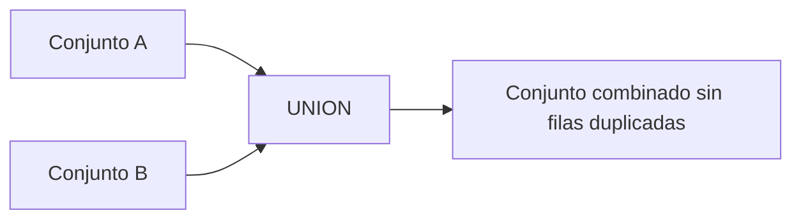
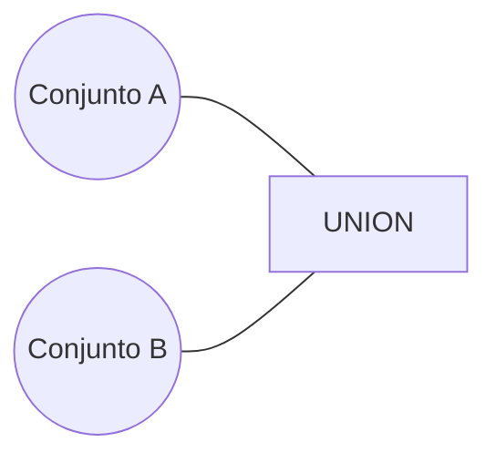
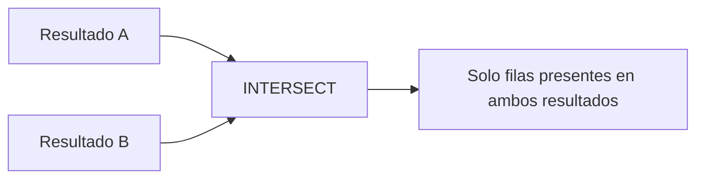
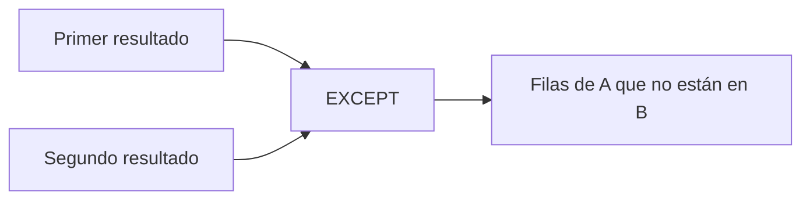
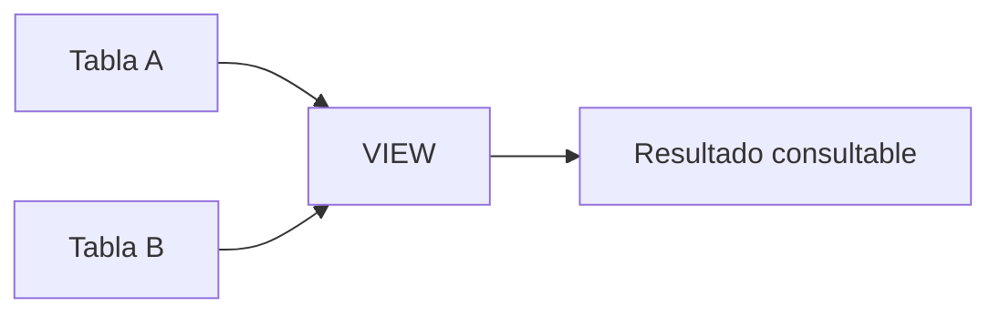
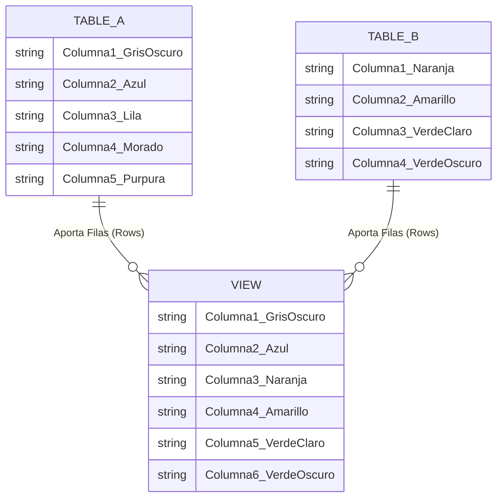
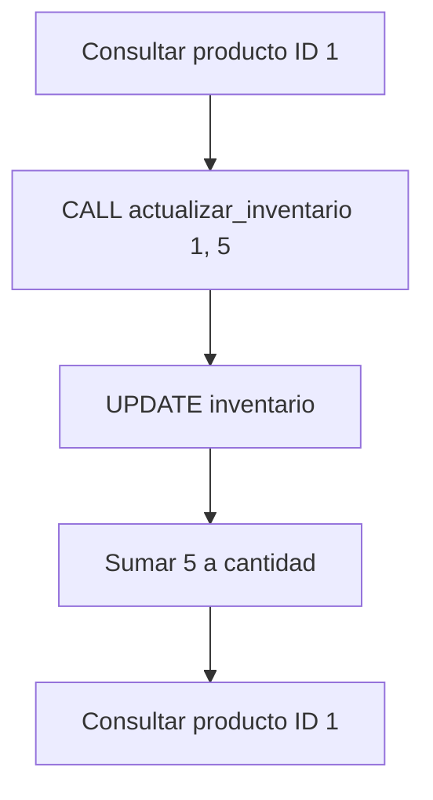
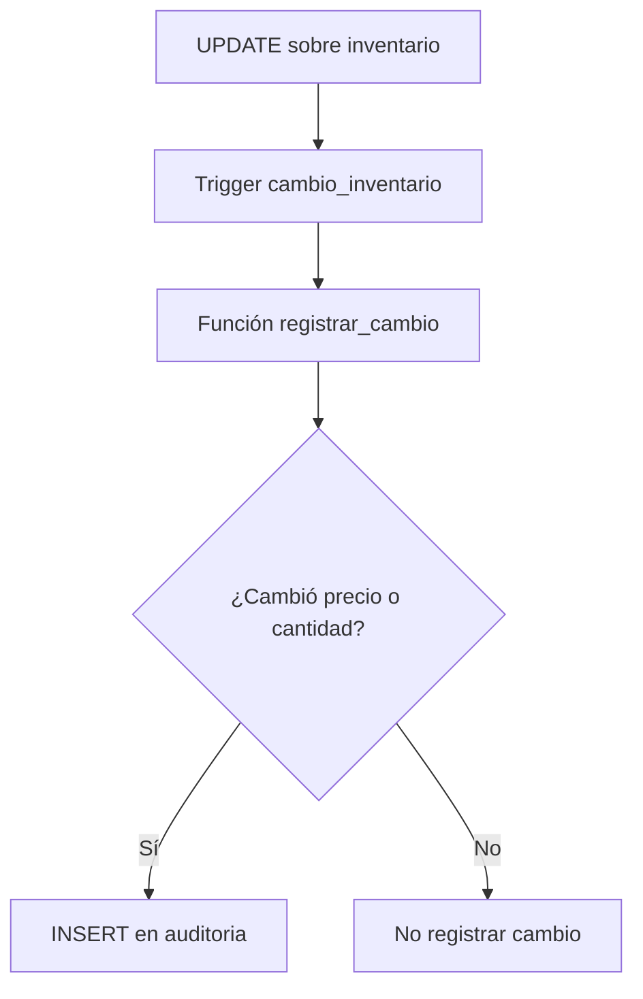
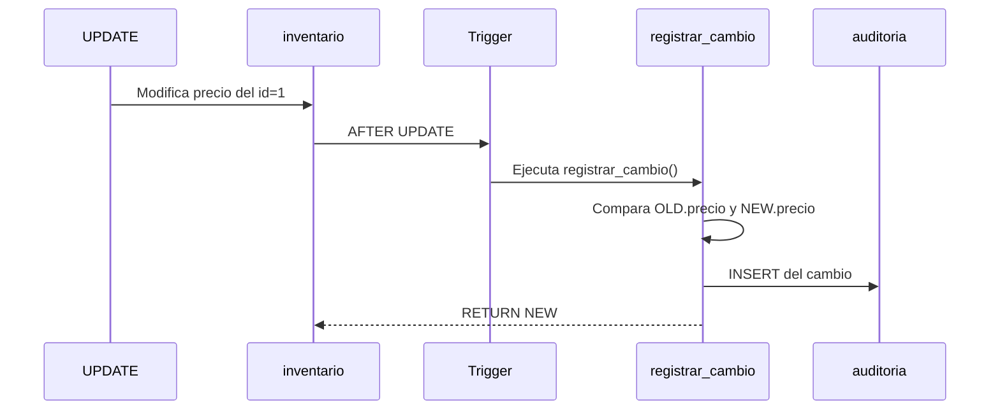
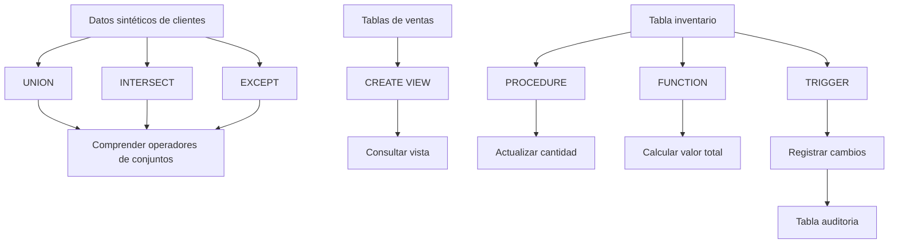

# Operadores de Conjuntos, Vistas, Procedimientos, Funciones y Triggers en PostgreSQL

## Introducción

En PostgreSQL existen diferentes mecanismos para combinar resultados, abstraer consultas, encapsular lógica de negocio y automatizar operaciones sobre los datos.

En estos apuntes se trabajan los siguientes conceptos:

- **Operadores de conjuntos:** `UNION`, `INTERSECT` y `EXCEPT`.
- **Vistas (`VIEW`):** estructuras virtuales basadas en consultas SQL.
- **Procedimientos almacenados (`PROCEDURE`):** bloques de instrucciones que pueden ejecutarse mediante una llamada.
- **Funciones (`FUNCTION`):** bloques de lógica que pueden recibir parámetros y devolver valores.
- **Triggers:** mecanismos que ejecutan automáticamente una función en respuesta a determinados eventos sobre tablas o vistas.
- **Auditoría:** registro de cambios realizados sobre los datos.

Los ejemplos utilizan PostgreSQL y, para los procedimientos y triggers, el lenguaje procedural **PL/pgSQL**.

---

# 1. Datos sintéticos para trabajar

Para practicar los operadores de conjuntos se utilizan dos tablas que representan clientes registrados durante los años 2023 y 2024.

## 1.1. Estructura de las tablas

Cada tabla contiene:

| Columna | Tipo | Descripción |
|---|---|---|
| `cliente_id` | `INT` | Identificador único del cliente. |
| `nombre` | `VARCHAR(100)` | Nombre del cliente. |

En ambas tablas, `cliente_id` funciona como `PRIMARY KEY`, por lo que no puede repetirse dentro de la misma tabla.

## 1.2. Creación de las tablas

```sql
CREATE TABLE clientes_2023 (
    cliente_id INT PRIMARY KEY,
    nombre VARCHAR(100)
);

CREATE TABLE clientes_2024 (
    cliente_id INT PRIMARY KEY,
    nombre VARCHAR(100)
);
```

## 1.3. Datos de `clientes_2023`

```sql
INSERT INTO clientes_2023 (cliente_id, nombre) VALUES
(1, 'Carlos Mendoza'),
(2, 'Sofia Ramirez'),
(3, 'Mateo Torres'),
(4, 'Valentina Gomez'),
(5, 'Lucas Silva'),
(6, 'Camila Fernandez'),
(7, 'Santiago Morales'),
(8, 'Isabella Castillo'),
(9, 'Gabriel Ortiz'),
(10, 'Mariana Gutierrez'),
(11, 'David Smith'),
(12, 'Sarah Johnson'),
(13, 'James Brown'),
(14, 'Emily Davis'),
(15, 'Robert Wilson'),
(16, 'Jessica Taylor'),
(17, 'William Anderson'),
(18, 'Amanda Thomas'),
(19, 'Daniel Martinez'),
(20, 'Olivia White'),
(21, 'Alejandro Navarro'),
(22, 'Valeria Delgado'),
(23, 'Diego Rios'),
(24, 'Natalia Vega'),
(25, 'Joaquin Paredes'),
(26, 'Luciana Molina'),
(27, 'Andres Salazar'),
(28, 'Elena Suarez'),
(29, 'Adrian Benitez'),
(30, 'Paula Reyes');
```

## 1.4. Datos de `clientes_2024`

```sql
INSERT INTO clientes_2024 (cliente_id, nombre) VALUES
(15, 'Robert Wilson'),
(16, 'Jessica Taylor'),
(17, 'William Anderson'),
(18, 'Amanda Thomas'),
(19, 'Daniel Martinez'),
(20, 'Olivia White'),
(21, 'Alejandro Navarro'),
(22, 'Valeria Delgado'),
(23, 'Diego Rios'),
(24, 'Natalia Vega'),
(25, 'Joaquin Paredes'),
(26, 'Luciana Molina'),
(27, 'Andres Salazar'),
(28, 'Elena Suarez'),
(29, 'Adrian Benitez'),
(30, 'Paula Reyes'),
(31, 'Thomas Miller'),
(32, 'Rachel Green'),
(33, 'Ross Geller'),
(34, 'Monica Geller'),
(35, 'Chandler Bing'),
(36, 'Joey Tribbiani'),
(37, 'Phoebe Buffay'),
(38, 'Christopher Lee'),
(39, 'Laura Palmer'),
(40, 'Arthur Dent'),
(41, 'Beatriz Santos'),
(42, 'Charles Xavier'),
(43, 'Diana Prince'),
(44, 'Fiona Gallagher');
```

> [!IMPORTANT]
> Los clientes con identificadores del `15` al `30` aparecen en ambas tablas. Esto permite observar claramente el resultado de `INTERSECT` y `EXCEPT`.

---

# 2. Operadores de conjuntos

Los **operadores de conjuntos** de SQL permiten combinar los resultados de dos o más consultas y trabajar con ellos como conjuntos de filas.

Los principales operadores utilizados en estos apuntes son:

- `UNION`
- `INTERSECT`
- `EXCEPT`

Estos operadores trabajan sobre los resultados de consultas compatibles.

## 2.1. Requisitos generales

Para combinar dos consultas mediante operadores de conjuntos, las consultas deben devolver la misma cantidad de columnas y los tipos de datos de las columnas correspondientes deben ser compatibles.

Por ejemplo:

```sql
SELECT cliente_id, nombre
FROM clientes_2023

UNION

SELECT cliente_id, nombre
FROM clientes_2024;
```

Ambas consultas devuelven dos columnas:

1. `cliente_id`
2. `nombre`

Por ello, sus resultados pueden combinarse.

---

# 3. `UNION`

`UNION` combina los resultados de dos consultas y **elimina las filas duplicadas**.

Conceptualmente:

```text
Resultado = A ∪ B
```

Por ejemplo, si un cliente aparece en ambos conjuntos, el resultado de `UNION` conserva una sola fila cuando las filas completas son iguales.

## 3.1. Representación visual



### Diagrama de conjuntos



## 3.2. Ejemplo

```sql
SELECT cliente_id, nombre, 2023 AS years
FROM clientes_2023

UNION

SELECT cliente_id, nombre, 2024 AS years
FROM clientes_2024;
```

### Explicación

La consulta combina los clientes registrados en 2023 y 2024.

Además, agrega una tercera columna:

```sql
2023 AS years
```

o:

```sql
2024 AS years
```

Esta columna permite identificar el año asociado a cada fila.

### Importante

En este caso, la fila contiene tres valores:

```text
cliente_id
nombre
years
```

Por lo tanto, una fila de 2023 y otra de 2024 con el mismo `cliente_id` y `nombre` no son idénticas porque el valor de `years` es diferente.

Por ejemplo:

```text
15 | Robert Wilson | 2023
15 | Robert Wilson | 2024
```

serían filas diferentes para `UNION`.

> [!NOTE]
> `UNION` elimina duplicados considerando la fila resultante completa, no únicamente una columna como `cliente_id`.

---

# 4. `INTERSECT`

`INTERSECT` devuelve únicamente las filas que aparecen en ambos resultados.

Conceptualmente:

```text
Resultado = A ∩ B
```

Es decir, obtiene la **intersección** entre dos conjuntos.

## 4.1. Representación visual



## 4.2. Ejemplo

```sql
SELECT cliente_id, nombre
FROM clientes_2023

INTERSECT

SELECT cliente_id, nombre
FROM clientes_2024
ORDER BY cliente_id;
```

### Explicación

La primera consulta obtiene los clientes de `clientes_2023`.

La segunda consulta obtiene los clientes de `clientes_2024`.

`INTERSECT` conserva únicamente las filas que aparecen en ambos resultados.

En los datos proporcionados, los clientes con identificadores del `15` al `30` están presentes en ambas tablas.

Por lo tanto, esos clientes forman parte de la intersección.

### Ejemplo conceptual

```text
clientes_2023
15 Robert Wilson
16 Jessica Taylor
17 William Anderson
...

clientes_2024
15 Robert Wilson
16 Jessica Taylor
17 William Anderson
...

INTERSECT

15 Robert Wilson
16 Jessica Taylor
17 William Anderson
...
```

---

# 5. `EXCEPT`

`EXCEPT` devuelve las filas que aparecen en el **primer resultado**, pero que no aparecen en el **segundo resultado**.

Conceptualmente:

```text
Resultado = A − B
```

El orden de las consultas es importante.

```sql
A EXCEPT B
```

no produce necesariamente el mismo resultado que:

```sql
B EXCEPT A
```

## 5.1. Representación visual



## 5.2. Ejemplo

```sql
SELECT cliente_id, nombre
FROM clientes_2024

EXCEPT

SELECT cliente_id, nombre
FROM clientes_2023
ORDER BY cliente_id;
```

### Explicación

La primera consulta obtiene los clientes de 2024.

La segunda consulta obtiene los clientes de 2023.

`EXCEPT` devuelve únicamente los clientes que existen en 2024 pero no existen en 2023.

En los datos proporcionados, los clientes con identificadores del `31` al `44` cumplen esta condición.

---

# 6. Comparación entre `UNION`, `INTERSECT` y `EXCEPT`

| Operador | Funcionamiento | Concepto matemático |
|---|---|---|
| `UNION` | Combina ambos resultados y elimina duplicados. | Unión `A ∪ B` |
| `INTERSECT` | Devuelve filas presentes en ambos resultados. | Intersección `A ∩ B` |
| `EXCEPT` | Devuelve filas del primer resultado que no están en el segundo. | Diferencia `A − B` |

> [!IMPORTANT]
> Una forma sencilla de recordarlos es:
>
> - `UNION` → **todo lo que está en A o B**.
> - `INTERSECT` → **lo que está en A y B**.
> - `EXCEPT` → **lo que está en A, pero no en B**.

---

# 7. Vista (`VIEW`) en PostgreSQL

Una **vista (`VIEW`)** es una estructura virtual basada en el resultado de una consulta SQL.

Una vista no almacena, por sí misma, una copia independiente de los datos de la consulta. En términos generales, almacena la **definición de la consulta** y permite acceder a su resultado mediante un nombre.

Esto permite presentar información proveniente de una o varias tablas mediante una estructura reutilizable.

Por ejemplo, una vista puede construirse a partir de:

- Una sola tabla.
- Varias tablas.
- Operaciones `JOIN`.
- Funciones de agregación.
- `GROUP BY`.
- Expresiones calculadas.
- Otras construcciones SQL compatibles.

---

# 8. ¿Para qué sirven las vistas?

Las vistas permiten encapsular consultas y proporcionar una interfaz más sencilla para acceder a determinados datos.

Por ejemplo, en lugar de escribir repetidamente una consulta compleja, podemos crear una vista:

```sql
CREATE VIEW nombre_vista AS
SELECT ...
FROM ...
WHERE ...;
```

Posteriormente, podemos consultar la vista como si fuera una tabla:

```sql
SELECT *
FROM nombre_vista;
```

---

# 9. Ventajas de utilizar vistas

## 9.1. Seguridad

Una vista puede utilizarse para exponer únicamente determinados datos y restringir el acceso directo a otras columnas o estructuras.

Por ejemplo, una vista podría mostrar información pública sin exponer directamente columnas sensibles.

> [!NOTE]
> Una vista puede contribuir al control de acceso, pero la seguridad real depende también de permisos, roles y de la configuración de la base de datos.

## 9.2. Simplicidad

Una vista puede ocultar una consulta compleja y proporcionar una interfaz más sencilla para los usuarios o aplicaciones.

En lugar de trabajar directamente con varias operaciones:

```sql
JOIN
GROUP BY
EXTRACT
SUM
```

el usuario puede consultar:

```sql
SELECT *
FROM v_ventas_mensuales;
```

## 9.3. Mantenimiento

Centralizar una consulta compleja en una vista puede reducir la repetición de lógica SQL en diferentes consultas.

Si la definición de la vista cambia, las consultas que la utilizan pueden continuar accediendo a ella mediante el mismo nombre de la vista.

> [!WARNING]
> Cambiar la definición de una vista no garantiza automáticamente que todas las consultas dependientes sigan siendo compatibles. Los cambios en columnas, tipos de datos o nombres pueden requerir ajustes adicionales.

---

# 10. Representación conceptual de una vista

La vista utilizada en clase se puede representar conceptualmente como una estructura que obtiene información de diferentes tablas.



Una vista puede combinar información procedente de diferentes tablas y presentar un resultado unificado.

---

# 11. Diagrama visto en clase

El siguiente diagrama representa la relación conceptual entre dos tablas y una vista:



> [!NOTE]
> Este diagrama es una representación conceptual para explicar que una vista puede presentar columnas provenientes de diferentes fuentes. No debe interpretarse necesariamente como un modelo físico de base de datos.

---

# 12. Ejemplo de una vista

```sql
CREATE VIEW v_ventas_mensuales AS
SELECT vendedor,
       EXTRACT(YEAR FROM fecha) AS anio,
       EXTRACT(MONTH FROM fecha) AS mes,
       SUM(monto) AS total_venta
FROM ventas_vendedores
GROUP BY vendedor,
         EXTRACT(YEAR FROM fecha),
         EXTRACT(MONTH FROM fecha);

SELECT *
FROM v_ventas_mensuales
ORDER BY anio, mes;
```

## 12.1. Explicación

La vista:

```sql
v_ventas_mensuales
```

genera un resumen de ventas agrupado por:

- Vendedor.
- Año.
- Mes.

La consulta obtiene:

```sql
vendedor
```

el nombre o identificador del vendedor.

Después:

```sql
EXTRACT(YEAR FROM fecha) AS anio
```

obtiene el año de la columna `fecha`.

De manera similar:

```sql
EXTRACT(MONTH FROM fecha) AS mes
```

obtiene el mes.

Finalmente:

```sql
SUM(monto) AS total_venta
```

calcula la suma de los montos de venta pertenecientes a cada grupo.

## 12.2. `GROUP BY`

La cláusula:

```sql
GROUP BY vendedor,
         EXTRACT(YEAR FROM fecha),
         EXTRACT(MONTH FROM fecha)
```

agrupa las filas para que `SUM(monto)` pueda calcular el total de cada combinación de vendedor, año y mes.

## 12.3. Consulta posterior de la vista

Una vez creada la vista, puede consultarse mediante:

```sql
SELECT *
FROM v_ventas_mensuales
ORDER BY anio, mes;
```

Desde el punto de vista del usuario de la vista, se consulta mediante un nombre similar al de una tabla.

---

# 13. Gestión de vistas

Las vistas son objetos de base de datos y pueden administrarse mediante instrucciones específicas.

Una vista puede:

- Crearse.
- Consultarse.
- Modificarse mediante las instrucciones apropiadas.
- Eliminarse cuando ya no sea necesaria.

La creación básica utiliza:

```sql
CREATE VIEW nombre_vista AS
SELECT ...;
```

---

# 14. Procedimientos almacenados y funciones

Los **procedimientos almacenados (`PROCEDURE`)** y las **funciones (`FUNCTION`)** en PostgreSQL permiten encapsular lógica dentro de la base de datos.

Pueden utilizarse para:

- Reutilizar lógica.
- Realizar cálculos.
- Consultar datos.
- Modificar datos.
- Encapsular operaciones.
- Implementar parte de la lógica de negocio directamente en el servidor de base de datos.

Aunque ambos mecanismos permiten almacenar lógica, **no son exactamente lo mismo**.

### Procedimiento almacenado

Se crea mediante:

```sql
CREATE PROCEDURE ...
```

y se ejecuta mediante:

```sql
CALL ...
```

### Función

Se crea mediante:

```sql
CREATE FUNCTION ...
```

y puede invocarse dentro de expresiones SQL, dependiendo de lo que devuelva.

---

# 15. Ventajas de procedimientos y funciones

## Reutilización de código

Evitan repetir la misma lógica SQL cuando una operación debe realizarse varias veces.

## Encapsulación

Permiten reunir varias instrucciones relacionadas dentro de una unidad lógica.

## Seguridad

Pueden utilizarse como parte de una estrategia para controlar las operaciones que los usuarios pueden realizar sobre los datos, dependiendo de los permisos configurados.

## Ejecución en la base de datos

La lógica se ejecuta dentro del servidor de base de datos, lo que puede resultar útil cuando la operación involucra directamente los datos almacenados.

> [!NOTE]
> La existencia de un procedimiento o función no significa automáticamente que una operación sea más rápida. El rendimiento depende de la consulta, el volumen de datos, los índices, el diseño de la base de datos y otros factores.

---

# 16. PL/pgSQL

En los apuntes aparece la referencia:

```text
pspgsql = programacion lineal de postgrest
```

El término técnico correcto es **PL/pgSQL**, que significa **Procedural Language/PostgreSQL**.

PL/pgSQL es el lenguaje procedural de PostgreSQL que permite escribir funciones y procedimientos con elementos como:

- Variables.
- Condiciones.
- Bucles.
- Bloques de instrucciones.
- Consultas SQL.
- Manejo de valores.

Por ejemplo:

```sql
LANGUAGE plpgsql
```

indica que el cuerpo de la función o procedimiento está escrito en PL/pgSQL.

---

# 17. Datos sintéticos de inventario

Para los ejemplos de procedimientos, funciones y triggers se utiliza la tabla `inventario`.

## 17.1. Creación de la tabla

```sql
-- nuevos datos sintéticos

CREATE TABLE inventario (
    id SERIAL PRIMARY KEY,
    producto VARCHAR(150),
    cantidad INT,
    precio NUMERIC(6, 2)
);
```

### Columnas

| Columna | Tipo | Descripción |
|---|---|---|
| `id` | `SERIAL` | Identificador generado automáticamente. |
| `producto` | `VARCHAR(150)` | Nombre del producto. |
| `cantidad` | `INT` | Cantidad disponible. |
| `precio` | `NUMERIC(6, 2)` | Precio con dos posiciones decimales. |

> [!NOTE]
> En PostgreSQL moderno, `IDENTITY` suele ser la alternativa recomendada para nuevas columnas autogeneradas. El ejemplo original utiliza `SERIAL`, que sigue formando parte del comportamiento de PostgreSQL.

## 17.2. Datos sintéticos

```sql
INSERT INTO inventario (producto, cantidad, precio) VALUES
('Teclado Mecánico RGB', 45, 59.99),
('Mouse Inalámbrico Ergonómico', 120, 24.50),
('Monitor 24" Full HD', 30, 149.99),
('Monitor 27" 4K UHD', 15, 329.00),
('Laptop Core i7 16GB RAM', 8, 899.99),
('Laptop Ryzen 5 8GB RAM', 12, 649.50),
('Disco Duro Externo 1TB', 60, 54.00),
('SSD NVMe 500GB', 85, 42.99),
('SSD SATA 1TB', 40, 68.50),
('Memoria RAM 16GB DDR4', 110, 39.99),
('Tarjeta de Video RTX 3060', 6, 289.00),
('Procesador Ryzen 7 5700X', 14, 195.50),
('Fuente de Poder 650W 80 Plus', 25, 62.00),
('Gabinete ATX Cristal Templado', 18, 75.00),
('Silla Gamer Reclinable', 10, 185.00),
('Auriculares Bluetooth con Cancelación de Ruido', 50, 79.99),
('Micrófono Condensador USB', 22, 45.00),
('Cámara Web 1080p', 35, 34.90),
('Hub USB-C 7 en 1', 75, 29.99),
('Cable HDMI 2.1 2 metros', 200, 12.50),
('Teclado Membrana Español', 90, 15.00),
('Mousepad XXL Control', 130, 18.00),
('Soporte para Laptop Ajustable', 40, 22.50),
('Base Enfriadora para Laptop', 28, 27.00),
('Cargador Universal USB-C 65W', 55, 31.99),
('Impresora Multifuncional Tinta Continua', 9, 210.00),
('Router Wi-Fi 6 Dual Band', 32, 84.50),
('Switch Gigabit 8 Puertos', 19, 23.00),
('Pendrive 64GB USB 3.0', 150, 8.99),
('Adaptador Bluetooth 5.0 USB', 80, 7.50);
```

---

# 18. Procedimiento almacenado para actualizar el inventario

El siguiente procedimiento modifica la cantidad disponible de un producto.

## 18.1. Código

```sql
-- PL/pgSQL = lenguaje procedural de PostgreSQL

CREATE PROCEDURE actualizar_inventario (
    v_producto_id INT,
    v_cantidad INT
)
LANGUAGE plpgsql
AS $$
BEGIN
    UPDATE inventario
    SET cantidad = cantidad + v_cantidad
    WHERE id = v_producto_id;
END;
$$;
```

## 18.2. Explicación

El procedimiento se llama:

```text
actualizar_inventario
```

Recibe dos parámetros:

```sql
v_producto_id INT
v_cantidad INT
```

### `v_producto_id`

Identifica el producto que será modificado.

### `v_cantidad`

Indica cuánto se debe sumar a la cantidad actual.

La operación principal es:

```sql
UPDATE inventario
SET cantidad = cantidad + v_cantidad
WHERE id = v_producto_id;
```

Esta instrucción busca el producto cuyo `id` coincide con `v_producto_id` y aumenta su cantidad en el valor de `v_cantidad`.

---

# 19. Componentes principales del procedimiento

## `CREATE PROCEDURE`

Indica que se está creando un procedimiento almacenado.

```sql
CREATE PROCEDURE actualizar_inventario (...)
```

## Parámetros

```sql
v_producto_id INT,
v_cantidad INT
```

Por defecto, los parámetros de un procedimiento en PostgreSQL son de tipo `IN` cuando no se especifica otro modo.

## `LANGUAGE plpgsql`

```sql
LANGUAGE plpgsql
```

Indica que el procedimiento utiliza PL/pgSQL.

## `AS $$ ... $$`

El bloque:

```sql
AS $$
...
$$;
```

delimita el cuerpo de la definición.

## `BEGIN` y `END`

```sql
BEGIN
    ...
END;
```

delimitan el bloque de instrucciones ejecutado por el procedimiento.

---

# 20. Prueba del procedimiento almacenado

Los apuntes incluyen tres pasos para probar el procedimiento.

## 20.1. Consultar el producto antes de modificarlo

```sql
-- Vemos el producto a modificar
SELECT *
FROM inventario
WHERE id = 1;
```

Esta consulta permite comprobar el estado inicial del producto.

## 20.2. Ejecutar el procedimiento

```sql
-- Llamamos al procedimiento almacenado
CALL actualizar_inventario(1, 5);
```

La llamada:

```sql
CALL actualizar_inventario(1, 5);
```

significa:

- Producto: `id = 1`.
- Cantidad que se suma: `5`.

## 20.3. Consultar nuevamente el producto

```sql
-- Seleccionamos el producto que fue alterado
SELECT *
FROM inventario
WHERE id = 1;
```

Esto permite comprobar el resultado del procedimiento.

### Flujo de ejecución



---

# 21. Funciones en PostgreSQL

Una **función (`FUNCTION`)** permite encapsular lógica y devolver un resultado.

A diferencia de un procedimiento, una función puede utilizarse como parte de expresiones SQL cuando su tipo de retorno lo permite.

Por ejemplo:

```sql
SELECT valor_total_producto(1);
```

ejecuta una función y obtiene el valor retornado.

---

# 22. Función para calcular el valor total de un producto

El objetivo de la función es calcular:

```text
precio × cantidad
```

para un producto específico.

## 22.1. Código original con la instrucción de eliminación

En los apuntes aparece:

```sql
DROP FUNCION IF EXISTS valor_total_producto;
```

La forma correcta en PostgreSQL es:

```sql
DROP FUNCTION IF EXISTS valor_total_producto(INT);
```

La especificación del parámetro permite identificar la firma de la función.

> [!WARNING]
> **Inconsistencia técnica:** `DROP FUNCION` utiliza una palabra incorrecta. La instrucción PostgreSQL es `DROP FUNCTION`.
>
> Código original:
>
> ```sql
> DROP FUNCION IF EXISTS valor_total_producto;
> ```
>
> Código corregido:
>
> ```sql
> DROP FUNCTION IF EXISTS valor_total_producto(INT);
> ```

## 22.2. Creación de la función

```sql
-- Función para mostrar el total de un producto
CREATE OR REPLACE FUNCTION valor_total_producto(producto_id INT)
RETURNS NUMERIC(8, 2)
LANGUAGE plpgsql
AS $$
DECLARE
    valor_total NUMERIC(8, 2);
BEGIN
    SELECT precio * cantidad
    INTO valor_total
    FROM inventario
    WHERE id = producto_id;

    RETURN valor_total;
END;
$$;
```

## 22.3. Explicación

La función recibe:

```sql
producto_id INT
```

y devuelve:

```sql
NUMERIC(8, 2)
```

El tipo `NUMERIC(8,2)` permite almacenar un valor numérico con hasta ocho dígitos en total, de los cuales dos corresponden a la parte decimal.

### Variable local

Dentro del bloque `DECLARE` se define:

```sql
valor_total NUMERIC(8, 2);
```

Esta variable almacena temporalmente el resultado del cálculo.

### Cálculo

```sql
SELECT precio * cantidad
INTO valor_total
FROM inventario
WHERE id = producto_id;
```

La consulta:

1. Busca el producto indicado por `producto_id`.
2. Multiplica `precio` por `cantidad`.
3. Guarda el resultado en `valor_total`.

### Retorno

```sql
RETURN valor_total;
```

devuelve el valor calculado por la función.

---

# 23. Ejecución de la función

```sql
SELECT valor_total_producto(1);
```

La función recibe:

```text
1
```

como identificador del producto y devuelve el valor total calculado mediante:

```text
precio × cantidad
```

---

# 24. Diferencias entre `PROCEDURE` y `FUNCTION`

| Característica | `PROCEDURE` | `FUNCTION` |
|---|---|---|
| Creación | `CREATE PROCEDURE` | `CREATE FUNCTION` |
| Ejecución principal | `CALL` | Puede invocarse mediante expresiones SQL |
| Retorno | No requiere retornar un valor mediante `RETURNS` | Define un tipo de retorno |
| Uso típico | Ejecutar operaciones o procesos | Calcular y devolver valores |
| Ejemplo | Actualizar inventario | Calcular valor total |

> [!IMPORTANT]
> Ambos mecanismos pueden contener lógica procedural, pero sus modelos de ejecución son diferentes.

---

# 25. Implementación de Triggers

Un **trigger** en PostgreSQL es un mecanismo que permite ejecutar automáticamente una función en respuesta a determinados eventos sobre una tabla o vista.

Entre los eventos más comunes se encuentran:

- `INSERT`
- `UPDATE`
- `DELETE`

Un trigger puede utilizarse para:

- Mantener la integridad de los datos.
- Automatizar tareas.
- Registrar cambios.
- Implementar reglas de negocio.
- Generar información de auditoría.

---

# 26. Ventajas de los triggers

## Automatización de procesos

Permiten ejecutar tareas automáticamente cuando ocurre un evento determinado.

Esto reduce la necesidad de realizar manualmente determinadas operaciones.

## Integridad y reglas de datos

Pueden utilizarse para garantizar que determinadas acciones se lleven a cabo cuando los datos cambian.

## Seguimiento de cambios

Resultan especialmente útiles para sistemas de **auditoría**, donde se necesita registrar qué información cambió.

---

# 27. Arquitectura del ejemplo de auditoría

El ejemplo de los apuntes utiliza tres elementos principales:

```text
inventario
    │
    │ UPDATE
    ▼
trigger cambio_inventario
    │
    ▼
función registrar_cambio()
    │
    ▼
tabla auditoria
```

Visualmente:



---

# 28. Tabla de auditoría

La tabla `auditoria` almacenará un registro cada vez que se detecte un cambio controlado en la tabla `inventario`.

```sql
-- ============================================================
-- TABLA DE AUDITORÍA
-- ============================================================
-- Esta tabla almacenará un registro cada vez que se modifique
-- el precio o la cantidad de un producto en la tabla inventario.
--
-- El campo "cambios" guardará un resumen indicando el valor
-- anterior y el nuevo valor de la columna modificada.

CREATE TABLE IF NOT EXISTS auditoria (
    id SERIAL PRIMARY KEY,
    tabla_modificada VARCHAR(150),
    fecha TIMESTAMP,
    cambios TEXT
);
```

## 28.1. Campos

| Campo | Tipo | Propósito |
|---|---|---|
| `id` | `SERIAL` | Identificador del registro de auditoría. |
| `tabla_modificada` | `VARCHAR(150)` | Nombre de la tabla donde ocurrió el cambio. |
| `fecha` | `TIMESTAMP` | Fecha y hora del registro. |
| `cambios` | `TEXT` | Descripción de los valores anteriores y nuevos. |

---

# 29. Limpieza de objetos anteriores

Antes de crear nuevamente el trigger y la función, los apuntes eliminan las versiones anteriores.

```sql
-- ============================================================
-- LIMPIEZA DE OBJETOS ANTERIORES
-- ============================================================
-- Eliminamos el trigger y la función por si ya fueron creados
-- anteriormente.
--
-- Esto permite ejecutar nuevamente todo el ejercicio sin
-- producir errores porque los objetos ya existan.

DROP TRIGGER IF EXISTS cambio_inventario ON inventario;

DROP FUNCTION IF EXISTS registrar_cambio();
```

## Explicación

### `DROP TRIGGER IF EXISTS`

```sql
DROP TRIGGER IF EXISTS cambio_inventario ON inventario;
```

elimina el trigger si ya existe sobre la tabla `inventario`.

### `DROP FUNCTION IF EXISTS`

```sql
DROP FUNCTION IF EXISTS registrar_cambio();
```

elimina la función si ya existe.

La notación:

```sql
registrar_cambio()
```

indica que se está especificando la función sin parámetros.

---

# 30. Función para registrar los cambios

La función que utiliza el trigger es:

```sql
CREATE FUNCTION registrar_cambio()
RETURNS TRIGGER
LANGUAGE plpgsql
AS $$
DECLARE
    -- Variable donde construiremos un resumen de todos
    -- los cambios realizados en el registro.
    resumen_cambio TEXT := '';

BEGIN

    -- ========================================================
    -- COMPROBAR CAMBIO DE PRECIO
    -- ========================================================
    -- Comparamos el precio anterior (OLD.precio) con el
    -- nuevo precio (NEW.precio).
    --
    -- Si son diferentes, significa que el precio fue modificado
    -- y agregamos esa información al resumen de cambios.

    IF OLD.precio <> NEW.precio THEN

        resumen_cambio := resumen_cambio ||
            FORMAT(
                'precio: %s -> %s;',
                OLD.precio,
                NEW.precio
            );

    END IF;


    -- ========================================================
    -- COMPROBAR CAMBIO DE CANTIDAD
    -- ========================================================
    -- Comparamos la cantidad anterior con la nueva cantidad.
    --
    -- Si existe una diferencia, agregamos el cambio al mismo
    -- resumen utilizado para registrar el precio.

    IF OLD.cantidad <> NEW.cantidad THEN

        resumen_cambio := resumen_cambio ||
            FORMAT(
                'Cantidad: %s -> %s;',
                OLD.cantidad,
                NEW.cantidad
            );

    END IF;


    -- ========================================================
    -- GUARDAR LA AUDITORÍA
    -- ========================================================
    -- Solo insertamos un registro en la tabla auditoria si
    -- realmente se detectó algún cambio que queremos controlar.
    --
    -- Si "resumen_cambio" permanece vacío, no se registra nada.

    IF resumen_cambio <> '' THEN

        INSERT INTO auditoria (
            tabla_modificada,
            fecha,
            cambios
        )
        VALUES (
            'inventario',
            CURRENT_TIMESTAMP,
            resumen_cambio
        );

    END IF;


    -- RETURN NEW devuelve el registro después de la
    -- modificación y permite que la operación UPDATE continúe.
    RETURN NEW;

END;
$$;
```

---

# 31. `RETURNS TRIGGER`

La definición contiene:

```sql
RETURNS TRIGGER
```

Esto indica que la función está diseñada para ser utilizada como una **trigger function**.

Las funciones de trigger tienen acceso a información especial proporcionada por PostgreSQL.

Entre los valores más importantes se encuentran:

- `OLD`
- `NEW`

---

# 32. `OLD` y `NEW`

Cuando el trigger se ejecuta ante una actualización:

### `OLD`

Representa la versión del registro **antes de la modificación**.

Por ejemplo:

```sql
OLD.precio
```

representa el precio anterior.

### `NEW`

Representa la versión del registro **después de la modificación**.

Por ejemplo:

```sql
NEW.precio
```

representa el nuevo precio.

---

# 33. Comparación del precio

El código utiliza:

```sql
IF OLD.precio <> NEW.precio THEN
```

La condición comprueba si el precio anterior es diferente del nuevo precio.

Si existe una diferencia, se ejecuta:

```sql
resumen_cambio := resumen_cambio ||
    FORMAT(
        'precio: %s -> %s;',
        OLD.precio,
        NEW.precio
    );
```

La operación:

```sql
resumen_cambio ||
```

concatena información al contenido existente de la variable.

---

# 34. Función `FORMAT()`

La función:

```sql
FORMAT()
```

permite construir una cadena de texto utilizando marcadores.

En el ejemplo:

```sql
FORMAT(
    'precio: %s -> %s;',
    OLD.precio,
    NEW.precio
)
```

los marcadores `%s` son reemplazados por los valores proporcionados.

Conceptualmente, podría producir un texto similar a:

```text
precio: 59.99 -> 200.00;
```

---

# 35. Comparación de la cantidad

El mismo mecanismo se utiliza para la cantidad:

```sql
IF OLD.cantidad <> NEW.cantidad THEN

    resumen_cambio := resumen_cambio ||
        FORMAT(
            'Cantidad: %s -> %s;',
            OLD.cantidad,
            NEW.cantidad
        );

END IF;
```

Si la cantidad cambia, se agrega información al mismo resumen.

Por ejemplo:

```text
Cantidad: 45 -> 50;
```

---

# 36. Registro de la auditoría

Después de comprobar precio y cantidad, el código verifica si existe algún cambio:

```sql
IF resumen_cambio <> '' THEN
```

Mientras `resumen_cambio` no esté vacío, significa que se detectó un cambio que debe registrarse.

Entonces se ejecuta:

```sql
INSERT INTO auditoria (
    tabla_modificada,
    fecha,
    cambios
)
VALUES (
    'inventario',
    CURRENT_TIMESTAMP,
    resumen_cambio
);
```

---

# 37. `CURRENT_TIMESTAMP`

La expresión:

```sql
CURRENT_TIMESTAMP
```

obtiene la fecha y hora actuales de la sesión de PostgreSQL.

En este ejercicio se utiliza para registrar cuándo se produjo el cambio.

---

# 38. `RETURN NEW`

Al final de la función aparece:

```sql
RETURN NEW;
```

En una función de trigger para este tipo de operación, `RETURN NEW` devuelve el registro después de la modificación.

Esto permite que la operación `UPDATE` continúe correctamente.

> [!IMPORTANT]
> `RETURN NEW` no significa que la función esté devolviendo simplemente una fila como una función SQL común. En este contexto, está devolviendo el registro requerido por el mecanismo de trigger.

---

# 39. Creación del trigger

Después de crear la función, se define el trigger:

```sql
-- ============================================================
-- CREAR EL TRIGGER
-- ============================================================
-- El trigger conecta la función "registrar_cambio" con la
-- tabla "inventario".
--
-- AFTER UPDATE significa que la función se ejecutará después
-- de que un registro haya sido actualizado.
--
-- FOR EACH ROW indica que el trigger se ejecutará para cada
-- fila modificada, no una sola vez por toda la sentencia UPDATE.

CREATE TRIGGER cambio_inventario
AFTER UPDATE ON inventario
FOR EACH ROW
EXECUTE FUNCTION registrar_cambio();
```

---

# 40. Partes del `CREATE TRIGGER`

## Nombre

```sql
cambio_inventario
```

Es el nombre asignado al trigger.

## `AFTER UPDATE`

```sql
AFTER UPDATE ON inventario
```

indica que el trigger se activa después de una operación `UPDATE` sobre la tabla `inventario`.

## `FOR EACH ROW`

```sql
FOR EACH ROW
```

indica que la función se ejecutará por cada fila afectada por el `UPDATE`.

Por ejemplo, si una sola sentencia actualiza diez filas, una función de trigger definida `FOR EACH ROW` puede ejecutarse una vez por cada fila afectada.

## `EXECUTE FUNCTION`

```sql
EXECUTE FUNCTION registrar_cambio();
```

indica qué función será ejecutada cuando se active el trigger.

---

# 41. Trigger por fila frente a trigger por sentencia

Una distinción importante es:

| Tipo | Significado |
|---|---|
| `FOR EACH ROW` | Se ejecuta para cada fila afectada. |
| `FOR EACH STATEMENT` | Se ejecuta una vez por cada sentencia SQL, independientemente de cuántas filas afecte. |

El ejemplo utiliza:

```sql
FOR EACH ROW
```

porque necesita comparar:

```sql
OLD
```

contra:

```sql
NEW
```

para cada registro modificado.

---

# 42. Prueba del trigger

Los apuntes prueban el trigger modificando el precio del producto con `id = 1`.

```sql
-- ============================================================
-- PRUEBA DEL TRIGGER
-- ============================================================
-- Al ejecutar este UPDATE, el trigger se activará
-- automáticamente.
--
-- Como estamos modificando el precio, la función detectará
-- el cambio comparando OLD.precio con NEW.precio y almacenará
-- la información en la tabla auditoria.

UPDATE inventario
SET precio = 200
WHERE id = 1;
```

## Flujo de ejecución

Al ejecutarse:

```sql
UPDATE inventario
SET precio = 200
WHERE id = 1;
```

ocurre conceptualmente lo siguiente:



---

# 43. Consulta de la auditoría

Después de ejecutar la actualización se puede comprobar el registro generado:

```sql
-- ============================================================
-- CONSULTAR LA AUDITORÍA
-- ============================================================
-- Podemos comprobar si el trigger registró correctamente
-- el cambio consultando la tabla de auditoría.

SELECT *
FROM auditoria;
```

La tabla debería contener información relacionada con el cambio detectado.

El campo:

```sql
tabla_modificada
```

registrará:

```text
inventario
```

El campo:

```sql
fecha
```

registrará la fecha y hora de la operación.

El campo:

```sql
cambios
```

contendrá el resumen generado por la función.

---

# 44. Consideraciones importantes sobre el trigger

## 44.1. Comparación con valores `NULL`

El código original utiliza:

```sql
OLD.precio <> NEW.precio
```

y:

```sql
OLD.cantidad <> NEW.cantidad
```

En SQL, una comparación con `NULL` no se comporta como una comparación normal de igualdad o desigualdad.

Por ejemplo:

```sql
NULL <> 10
```

no produce simplemente `TRUE`; produce un valor lógico desconocido.

Por ello, si en el futuro las columnas pudieran contener `NULL`, sería necesario considerar una comparación apropiada para esos casos, como:

```sql
OLD.precio IS DISTINCT FROM NEW.precio
```

y:

```sql
OLD.cantidad IS DISTINCT FROM NEW.cantidad
```

> [!NOTE]
> En los datos sintéticos proporcionados, `precio` y `cantidad` tienen valores definidos, por lo que la lógica original funciona para esos datos.

---

# 45. Resumen general

## Operadores de conjuntos

Los operadores de conjuntos permiten combinar resultados de consultas.

### `UNION`

Combina resultados y elimina filas duplicadas.

```sql
SELECT ...
UNION
SELECT ...;
```

### `INTERSECT`

Devuelve únicamente las filas presentes en ambos resultados.

```sql
SELECT ...
INTERSECT
SELECT ...;
```

### `EXCEPT`

Devuelve las filas del primer resultado que no aparecen en el segundo.

```sql
SELECT ...
EXCEPT
SELECT ...;
```

---

## Vistas

Una **vista (`VIEW`)** es una estructura virtual basada en una consulta SQL.

Puede utilizarse para:

- Simplificar consultas complejas.
- Reutilizar lógica SQL.
- Presentar información seleccionada.
- Contribuir a una estrategia de control de acceso.

Creación:

```sql
CREATE VIEW nombre_vista AS
SELECT ...;
```

Consulta:

```sql
SELECT *
FROM nombre_vista;
```

---

## Procedimientos

Un **procedimiento almacenado (`PROCEDURE`)** encapsula instrucciones que pueden ejecutarse mediante `CALL`.

Ejemplo:

```sql
CALL actualizar_inventario(1, 5);
```

---

## Funciones

Una **función (`FUNCTION`)** encapsula lógica y define un valor de retorno.

Ejemplo:

```sql
SELECT valor_total_producto(1);
```

---

## Triggers

Un **trigger** permite ejecutar automáticamente una función cuando ocurre un evento determinado.

Ejemplo:

```sql
AFTER UPDATE ON inventario
```

Los triggers son especialmente útiles para:

- Automatización.
- Auditoría.
- Integridad de datos.
- Reglas de negocio.

---

# 46. Flujo completo del ejercicio



---

# Glosario

| Término | Descripción |
|---|---|
| `UNION` | Operador que combina los resultados de consultas y elimina filas duplicadas. |
| `INTERSECT` | Operador que devuelve las filas presentes en ambos resultados. |
| `EXCEPT` | Operador que devuelve filas del primer resultado que no aparecen en el segundo. |
| `VIEW` | Estructura virtual basada en el resultado de una consulta SQL. |
| `PROCEDURE` | Objeto de base de datos que encapsula instrucciones y puede ejecutarse mediante `CALL`. |
| `FUNCTION` | Objeto de base de datos que encapsula lógica y devuelve un valor o conjunto de valores según su definición. |
| `PL/pgSQL` | Lenguaje procedural utilizado por PostgreSQL para escribir funciones y procedimientos. |
| `TRIGGER` | Mecanismo que ejecuta automáticamente una función en respuesta a determinados eventos de base de datos. |
| `OLD` | Registro que representa el estado anterior de una fila durante la ejecución de un trigger. |
| `NEW` | Registro que representa el estado nuevo de una fila durante la ejecución de un trigger. |
| `AFTER UPDATE` | Configuración de trigger que ejecuta la función después de una actualización. |
| `FOR EACH ROW` | Indica que el trigger se ejecutará individualmente para cada fila afectada. |
| `RETURNS TRIGGER` | Indica que una función está diseñada para utilizarse como función de trigger. |
| `PRIMARY KEY` | Restricción que identifica de manera única cada fila de una tabla. |
| `SERIAL` | Mecanismo tradicional de PostgreSQL para generar valores enteros secuenciales mediante una secuencia asociada. |
| `NUMERIC` | Tipo de dato utilizado para almacenar valores numéricos con precisión definida. |
| `GROUP BY` | Cláusula que agrupa filas según una o varias expresiones. |
| `AGGREGATION` | Operación que resume varias filas mediante funciones como `SUM()`, `COUNT()` o `AVG()`. |
| `ALIAS` | Nombre alternativo asignado a una columna o expresión mediante `AS`. |
| `AUDITORÍA` | Registro de operaciones o cambios realizados sobre los datos. |
| `CURRENT_TIMESTAMP` | Expresión que obtiene la fecha y hora actuales de la sesión. |
| `FORMAT()` | Función utilizada para construir cadenas de texto a partir de valores y marcadores de formato. |
| `CALL` | Instrucción utilizada para ejecutar un procedimiento almacenado. |
| `DROP FUNCTION` | Instrucción utilizada para eliminar una función existente. |
| `DROP TRIGGER` | Instrucción utilizada para eliminar un trigger existente. |
| `RETURN NEW` | En una función de trigger, devuelve el registro nuevo asociado a la operación. |

# Referencia visual original: operadores de conjuntos

La siguiente representación conserva la gráfica original utilizada en los apuntes, expresada como SVG para un entorno Markdown que permita HTML/SVG embebido.

```html
<div align="center">
<svg xmlns="http://www.w3.org/2000/svg" viewBox="0 0 700 250" width="100%" style="background: white; border-radius: 8px; padding: 20px; max-width: 800px;">
  <defs>
    <clipPath id="intersect-clip">
      <circle cx="325" cy="140" r="55"/>
    </clipPath>
  </defs>

  <style>
    .label {
      font-family: 'Segoe UI', system-ui, -apple-system, sans-serif;
      font-size: 15px;
      fill: #333;
      text-anchor: middle;
      letter-spacing: 0.5px;
      font-weight: 400;
    }

    .venn-border {
      stroke: #111;
      stroke-width: 1.5;
      fill: none;
    }

    .green-fill {
      fill: #0bd66b;
    }

    .white-fill {
      fill: #FFFFFF;
    }
  </style>

  <!-- 1. UNIÓN -->
  <text x="150" y="55" class="label">UNIÓN</text>
  <text x="150" y="75" class="label">UNIÓN TODO</text>

  <circle cx="115" cy="140" r="55" class="green-fill" />
  <circle cx="185" cy="140" r="55" class="green-fill" />

  <circle cx="115" cy="140" r="55" class="venn-border" />
  <circle cx="185" cy="140" r="55" class="venn-border" />

  <!-- 2. INTERSECCIÓN -->
  <text x="360" y="65" class="label">INTERSECCIÓN</text>

  <circle cx="325" cy="140" r="55" class="white-fill" />
  <circle cx="395" cy="140" r="55" class="white-fill" />

  <circle cx="395" cy="140" r="55" class="green-fill" clip-path="url(#intersect-clip)" />

  <circle cx="325" cy="140" r="55" class="venn-border" />
  <circle cx="395" cy="140" r="55" class="venn-border" />

  <!-- 3. EXCEPTO -->
  <text x="570" y="65" class="label">EXCEPTO</text>

  <circle cx="535" cy="140" r="55" class="green-fill" />
  <circle cx="605" cy="140" r="55" class="white-fill" />

  <circle cx="535" cy="140" r="55" class="venn-border" />
  <circle cx="605" cy="140" r="55" class="venn-border" />
</svg>
</div>
```