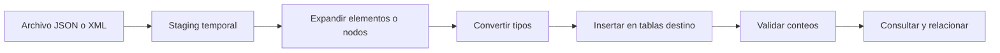
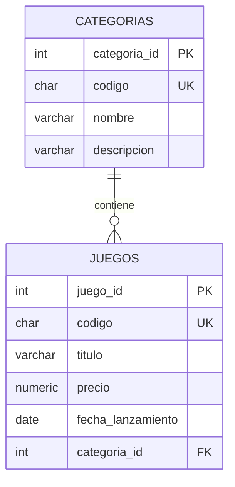
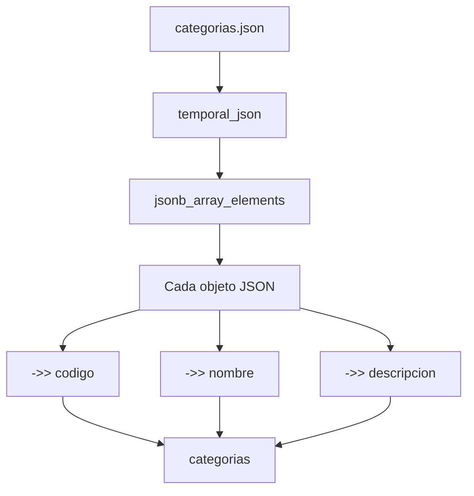
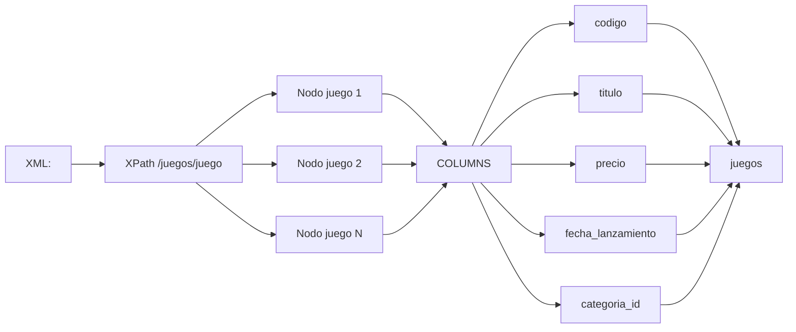
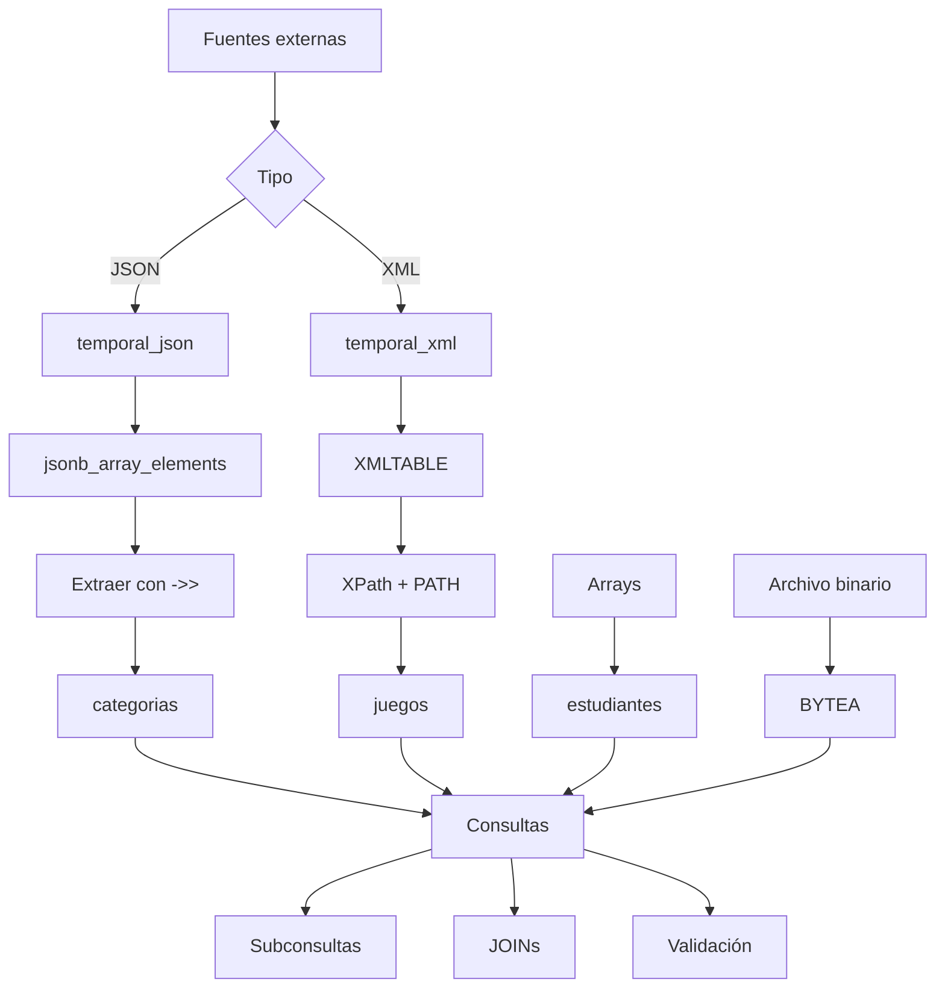
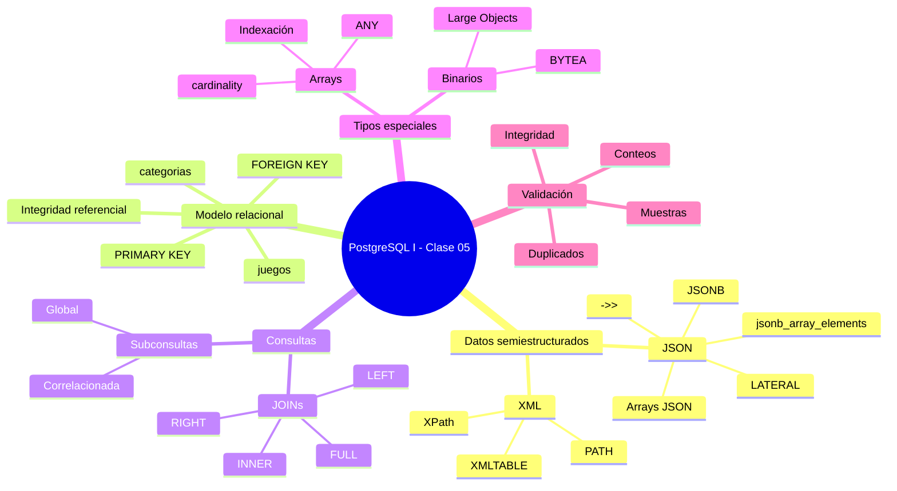
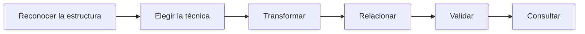

# Administración de conjuntos de datos semiestructurados y datos binarios

> Documentación técnica de estudio sobre **JSON/JSONB, XML, subconsultas, consultas correlacionadas, JOINs, arrays y datos binarios (`BYTEA`) en PostgreSQL**.

---

## 1. Introducción

Esta documentación reúne y amplía los contenidos de la Clase 05 de PostgreSQL I. El objetivo no es solamente mostrar sentencias SQL, sino explicar **qué problema resuelve cada técnica, cómo funciona, cuándo utilizarla y cómo verificar que el resultado sea correcto**.

La clase trabaja con una idea central:

> **Los datos pueden llegar en formatos diferentes al modelo relacional, pero PostgreSQL puede transformarlos en información consultable y relacionable.**

El flujo general utilizado durante la clase es:

```text
Archivo JSON/XML
      ↓
Tabla temporal de staging
      ↓
Expansión de objetos/nodos
      ↓
Conversión a columnas relacionales
      ↓
Inserción en tablas destino
      ↓
Validación
      ↓
Consultas SQL
```

La presentación de clase resume este proceso en cinco etapas:

1. **Archivo**
2. **Staging**
3. **Expandir**
4. **Insertar**
5. **Validar**

La presentación también establece tres decisiones fundamentales: reconocer correctamente la entrada, convertir su estructura a la forma relacional adecuada y validar cantidad, forma e integridad antes de eliminar el staging. fileciteturn2file0L85-L105

---

## 2. Objetivos de aprendizaje

Al finalizar esta documentación deberías poder:

- Conectarte a PostgreSQL mediante `psql`.
- Crear tablas relacionales con claves primarias y foráneas.
- Comprender la diferencia entre datos relacionales y semiestructurados.
- Importar un arreglo JSON/JSONB utilizando una tabla temporal.
- Expandir elementos JSON en filas mediante `jsonb_array_elements`.
- Extraer valores JSON con `->>`.
- Entender el papel de `CROSS JOIN LATERAL`.
- Importar XML utilizando una tabla temporal.
- Convertir nodos XML en filas y columnas con `XMLTABLE`.
- Comprender XPath dentro de `XMLTABLE`.
- Utilizar subconsultas escalares.
- Utilizar consultas correlacionadas.
- Diferenciar `INNER JOIN`, `LEFT JOIN`, `RIGHT JOIN` y `FULL JOIN`.
- Contar registros relacionados correctamente con `COUNT`.
- Crear y consultar arrays de PostgreSQL.
- Acceder a posiciones de un array.
- Utilizar `cardinality` y `ANY`.
- Comprender el almacenamiento binario mediante `BYTEA`.
- Diferenciar `BYTEA` de Large Objects.
- Cargar un archivo binario desde el sistema de archivos.
- Diseñar un proceso de importación reproducible y verificable.

---

# 3. Contexto: PostgreSQL y los datos semiestructurados

## 3.1. Modelo relacional

El modelo relacional organiza la información principalmente en:

- tablas;
- filas;
- columnas;
- claves;
- restricciones;
- relaciones entre tablas.

Por ejemplo:

```text
categorias
┌──────────────┬────────┬────────────────┐
│ categoria_id │ codigo │ nombre         │
├──────────────┼────────┼────────────────┤
│ 1            │ RPG    │ Juegos de Rol  │
│ 2            │ EST    │ Estrategia     │
└──────────────┴────────┴────────────────┘
```

Y:

```text
juegos
┌──────────┬──────┬──────────────────────┬────────┬──────────────┐
│ juego_id │codigo│ titulo               │ precio │ categoria_id │
├──────────┼──────┼──────────────────────┼────────┼──────────────┤
│ 1        │ TW3  │ The Witcher 3        │ 39.99  │ 1            │
└──────────┴──────┴──────────────────────┴────────┴──────────────┘
```

La relación se establece mediante:

```text
categorias.categoria_id
        │
        │ 1 ─── N
        ▼
juegos.categoria_id
```

---

## 3.2. Datos semiestructurados

JSON y XML no organizan necesariamente los datos como una tabla tradicional.

### JSON

JSON puede representar:

- objetos;
- arreglos;
- valores escalares;
- estructuras anidadas.

Ejemplo:

```json
[
  {
    "codigo": "RPG",
    "nombre": "Juegos de Rol",
    "descripcion": "Aventuras inmersivas."
  }
]
```

La presentación identifica este caso como una entrada semiestructurada formada por un arreglo de cuatro categorías. fileciteturn2file0L60-L71

### XML

XML representa información mediante elementos jerárquicos:

```xml
<juegos>
  <juego>
    <codigo>TW3</codigo>
    <titulo>The Witcher 3: Wild Hunt</titulo>
    <precio>39.99</precio>
  </juego>
</juegos>
```

La presentación utiliza veinte elementos `<juego>` dentro del documento XML. fileciteturn2file0L64-L71

---

# 4. Modelo mental de la clase

El patrón de trabajo más importante es:



## 4.1. Archivo

Primero existe una fuente externa:

```text
categorias.json
juegos.xml
imagen.jpg
```

---

## 4.2. Staging

El documento se almacena temporalmente antes de transformarlo.

```sql
CREATE TEMP TABLE temporal_json (
    data JSONB
);
```

o:

```sql
CREATE TEMP TABLE temporal_xml (
    data XML
);
```

La ventaja conceptual es separar:

```text
INGESTA
   ↓
TRANSFORMACIÓN
   ↓
CARGA
```

En lugar de intentar transformar directamente el archivo durante la carga.

---

## 4.3. Expandir

Un documento puede contener múltiples elementos.

Por ejemplo:

```json
[
    {...},
    {...},
    {...},
    {...}
]
```

La expansión transforma:

```text
1 documento
    ↓
4 elementos
    ↓
4 filas
```

En XML:

```text
<juegos>
    <juego>...</juego>
    <juego>...</juego>
    ...
</juegos>
```

se transforma conceptualmente en:

```text
1 documento
    ↓
20 nodos <juego>
    ↓
20 filas
```

---

## 4.4. Insertar

Los elementos extraídos se convierten en columnas relacionales.

---

## 4.5. Validar

Antes de eliminar el staging:

```sql
SELECT COUNT(*)
FROM juegos;
```

y también:

```sql
SELECT *
FROM juegos
LIMIT 5;
```

La validación no es un paso decorativo: permite detectar errores de transformación antes de perder la fuente temporal.

---

# 5. Conexión mediante `psql`

## 5.1. Abrir PostgreSQL

```bash
psql -U postgres
```

El parámetro:

```text
-U postgres
```

indica el usuario con el que se realizará la conexión.

---

## 5.2. Cambiar de base de datos

Dentro de `psql`:

```text
\c campus
```

Esto cambia la conexión hacia la base de datos `campus`.

---

## 5.3. SQL vs comandos de `psql`

Es importante distinguirlos.

### SQL

```sql
CREATE TABLE categorias (...);
SELECT * FROM categorias;
DROP TABLE categorias;
```

### Comandos de `psql`

```text
\c campus
\copy ...
```

Los comandos que comienzan con `\` pertenecen al cliente `psql`, no al lenguaje SQL estándar.

> [!IMPORTANT]
> `\copy` es procesado por `psql`. No debe confundirse con `COPY`, que es una sentencia SQL de PostgreSQL y tiene diferencias importantes respecto a dónde se ejecuta el acceso al archivo.

---

# 6. Preparación del esquema relacional

Antes de importar datos, se crean las tablas destino.

## 6.1. Eliminar tablas anteriores

Si `juegos` depende de `categorias`, debe eliminarse primero la tabla hija:

```sql
DROP TABLE IF EXISTS juegos;
DROP TABLE IF EXISTS categorias;
```

Esto evita problemas derivados de la clave foránea.

> [!NOTE]
> Si una tabla tiene dependencias mediante claves foráneas, el orden de eliminación importa.

---

# 7. Tabla `categorias`

```sql
CREATE TABLE IF NOT EXISTS categorias (
    categoria_id SERIAL PRIMARY KEY,
    codigo CHAR(3) NOT NULL UNIQUE,
    nombre VARCHAR(100) NOT NULL,
    descripcion VARCHAR(250)
);
```

## 7.1. Descripción de las columnas

| Columna | Tipo | Restricciones | Propósito |
|---|---|---|---|
| `categoria_id` | `SERIAL` | `PRIMARY KEY` | Identificador |
| `codigo` | `CHAR(3)` | `NOT NULL`, `UNIQUE` | Código de categoría |
| `nombre` | `VARCHAR(100)` | `NOT NULL` | Nombre |
| `descripcion` | `VARCHAR(250)` | — | Descripción opcional |

---

## 7.2. `SERIAL`

```sql
categoria_id SERIAL PRIMARY KEY
```

`SERIAL` crea una columna entera asociada a una secuencia para generar valores automáticamente.

Para diseños modernos también puede utilizarse:

```sql
categoria_id INTEGER GENERATED ALWAYS AS IDENTITY PRIMARY KEY
```

> [!NOTE]
> `SERIAL` sigue siendo válido, pero `IDENTITY` es la alternativa moderna recomendada para nuevos diseños cuando se desea una columna autogenerada.

---

## 7.3. `CHAR(3)`

```sql
codigo CHAR(3)
```

Indica una cadena de longitud fija de tres caracteres.

Ejemplos:

```text
RPG
EST
ACC
DEP
```

---

# 8. Tabla `juegos`

```sql
CREATE TABLE IF NOT EXISTS juegos (
    juego_id SERIAL PRIMARY KEY,
    codigo CHAR(3) NOT NULL UNIQUE,
    titulo VARCHAR(150) NOT NULL,
    precio NUMERIC(8,2) NOT NULL,
    fecha_lanzamiento DATE,
    categoria_id INT NOT NULL
        REFERENCES categorias(categoria_id)
);
```

## 8.1. Descripción

| Columna | Tipo | Propósito |
|---|---|---|
| `juego_id` | `SERIAL` | Identificador |
| `codigo` | `CHAR(3)` | Código |
| `titulo` | `VARCHAR(150)` | Nombre del juego |
| `precio` | `NUMERIC(8,2)` | Precio |
| `fecha_lanzamiento` | `DATE` | Fecha de lanzamiento |
| `categoria_id` | `INT` | Relación con `categorias` |

---

## 8.2. Integridad referencial

```sql
REFERENCES categorias(categoria_id)
```

significa:



La columna:

```text
juegos.categoria_id
```

debe referenciar un:

```text
categorias.categoria_id
```

existente.

---

# 9. Importación de JSON

## 9.1. Estructura del archivo

El archivo `categorias.json` contiene un arreglo de objetos.

```json
[
  {
    "codigo": "RPG",
    "nombre": "Juegos de Rol",
    "descripcion": "Aventuras inmersivas."
  }
]
```

La estructura completa puede representarse así:

```text
Array
├── Objeto 1
│   ├── codigo
│   ├── nombre
│   └── descripcion
├── Objeto 2
├── Objeto 3
└── Objeto 4
```

---

# 10. Crear una tabla temporal para JSON

```sql
CREATE TEMP TABLE temporal_json (
    data JSONB
);
```

## 10.1. ¿Por qué `TEMP`?

Una tabla temporal:

- existe durante la sesión;
- pertenece al proceso de trabajo actual;
- resulta adecuada para staging temporal;
- PostgreSQL la elimina automáticamente al terminar la sesión.

También puede eliminarse explícitamente:

```sql
DROP TABLE temporal_json;
```

---

## 10.2. ¿Por qué `JSONB`?

PostgreSQL dispone de:

```text
JSON
JSONB
```

### `JSON`

Conserva el documento JSON en una representación más cercana al texto original.

### `JSONB`

Utiliza una representación binaria interna optimizada para procesamiento y operaciones sobre JSON.

Para trabajar con consultas y transformación dentro de PostgreSQL, `JSONB` suele ser una opción muy útil.

---

# 11. Cargar el archivo JSON

La presentación utiliza el siguiente patrón:

```sql
\copy temporal_json(data)
FROM PROGRAM 'tr -d "\r\n" < /datos/categorias.json'
```

El ejemplo real de los apuntes puede utilizar una ruta local diferente.

## 11.1. ¿Qué hace `FROM PROGRAM`?

Permite que `COPY`/`\copy` obtenga los datos a través de la salida de un programa del sistema.

En este caso:

```text
tr -d "\r\n"
```

elimina retornos de carro y saltos de línea.

Conceptualmente:

```text
categorias.json
      ↓
tr -d "\r\n"
      ↓
contenido JSON en una sola línea
      ↓
temporal_json.data
```

> [!WARNING]
> `FROM PROGRAM` ejecuta un comando del sistema operativo. Su disponibilidad y permisos dependen del entorno y del usuario. No debe utilizarse indiscriminadamente con comandos construidos a partir de entrada no confiable.

---

# 12. ¿Por qué cargar el JSON completo en una fila?

La tabla temporal tiene:

```text
data JSONB
```

Por lo tanto, el documento completo puede quedar inicialmente como:

```text
temporal_json
┌────┬─────────────────────────────┐
│ id │ data                        │
├────┼─────────────────────────────┤
│    │ [ {...}, {...}, {...} ]     │
└────┴─────────────────────────────┘
```

Esto conserva la estructura original durante la fase de staging.

La presentación expresa el principio así:

> Conservamos el archivo intacto hasta entenderlo; luego lo convertimos con intención. fileciteturn2file0L85-L105

---

# 13. Expandir el arreglo JSON

La transformación principal es:

```sql
INSERT INTO categorias (
    codigo,
    nombre,
    descripcion
)
SELECT
    e->>'codigo',
    e->>'nombre',
    e->>'descripcion'
FROM temporal_json AS t
CROSS JOIN LATERAL jsonb_array_elements(t.data) AS e;
```

---

## 13.1. `jsonb_array_elements`

```sql
jsonb_array_elements(t.data)
```

recibe un valor JSONB que representa un arreglo y devuelve sus elementos.

Si:

```json
[
    {"codigo": "RPG"},
    {"codigo": "EST"},
    {"codigo": "ACC"},
    {"codigo": "DEP"}
]
```

la expansión conceptualmente produce:

```text
{"codigo": "RPG"}
{"codigo": "EST"}
{"codigo": "ACC"}
{"codigo": "DEP"}
```

Es decir:

```text
1 arreglo
   ↓
N elementos
   ↓
N filas
```

---

# 14. Operador `->>`

En:

```sql
e->>'codigo'
```

se está accediendo a la propiedad:

```text
codigo
```

y obteniendo su valor como texto.

Ejemplo:

```json
{
  "codigo": "RPG"
}
```

produce:

```text
RPG
```

### Comparación

| Operador | Resultado |
|---|---|
| `->` | JSON/JSONB |
| `->>` | texto |

Ejemplo:

```sql
SELECT
    e->'codigo',
    e->>'codigo'
FROM ...;
```

Conceptualmente:

```text
->   → "RPG" como JSON
->>  → RPG como texto
```

---

# 15. ¿Por qué `CROSS JOIN LATERAL`?

Esta parte suele parecer compleja:

```sql
FROM temporal_json AS t
CROSS JOIN LATERAL jsonb_array_elements(t.data) AS e
```

La idea es que la función:

```sql
jsonb_array_elements(t.data)
```

necesita utilizar el valor de la fila actual de `t`.

`LATERAL` permite que una expresión del lado derecho haga referencia a columnas producidas por la relación del lado izquierdo.

Modelo mental:

```text
t.data
  │
  ▼
jsonb_array_elements(...)
  │
  ├── elemento 1
  ├── elemento 2
  ├── elemento 3
  └── elemento 4
```

---

# 16. Flujo completo de JSON



---

# 17. Validar la importación JSON

Antes de eliminar el staging:

```sql
SELECT
    categoria_id,
    codigo,
    nombre
FROM categorias
ORDER BY categoria_id;
```

La presentación establece como resultado esperado:

```text
4 categorías
```

fileciteturn2file0L226-L235

Después de comprobarlo:

```sql
DROP TABLE temporal_json;
```

---

# 18. Importación de XML

## 18.1. Estructura

El archivo contiene una raíz:

```xml
<juegos>
```

y múltiples elementos:

```xml
<juego>
```

Ejemplo:

```xml
<juegos>
  <juego>
    <codigo>TW3</codigo>
    <titulo>The Witcher 3: Wild Hunt</titulo>
    <precio>39.99</precio>
    <fecha_lanzamiento>2015-05-19</fecha_lanzamiento>
    <categoria_id>1</categoria_id>
  </juego>
</juegos>
```

La presentación utiliza esta estructura para representar los veinte juegos del archivo. fileciteturn2file0L247-L260

---

# 19. Tabla temporal XML

```sql
CREATE TEMP TABLE temporal_xml (
    data XML
);
```

A diferencia de JSONB, PostgreSQL dispone de un tipo específico:

```text
XML
```

para almacenar documentos XML.

---

# 20. Cargar XML

El patrón de la clase es:

```sql
\copy temporal_xml(data)
FROM PROGRAM 'tr -d "\r\n" < /datos/juegos.xml'
```

Conceptualmente:

```text
juegos.xml
    ↓
tr -d "\r\n"
    ↓
documento XML
    ↓
temporal_xml.data
```

---

# 21. `XMLTABLE`

La herramienta fundamental para convertir XML en datos tabulares es:

```sql
XMLTABLE(...)
```

La presentación resume su propósito como la conversión de nodos XML en filas tipadas. fileciteturn2file0L315-L329

---

# 22. Inserción completa desde XML

```sql
INSERT INTO juegos (
    codigo,
    titulo,
    precio,
    fecha_lanzamiento,
    categoria_id
)
SELECT
    x.codigo,
    x.titulo,
    x.precio,
    x.fecha_lanzamiento,
    x.categoria_id
FROM temporal_xml AS t,
XMLTABLE(
    '/juegos/juego'
    PASSING t.data
    COLUMNS
        codigo CHAR(3) PATH 'codigo',
        titulo VARCHAR(150) PATH 'titulo',
        precio NUMERIC(8,2) PATH 'precio',
        fecha_lanzamiento DATE PATH 'fecha_lanzamiento',
        categoria_id INT PATH 'categoria_id'
) AS x;
```

---

# 23. Descomposición de `XMLTABLE`

## 23.1. XPath

```sql
'/juegos/juego'
```

indica los nodos que deben convertirse en filas.

Si existen veinte elementos:

```xml
<juego>...</juego>
```

se obtienen veinte filas.

---

## 23.2. `PASSING`

```sql
PASSING t.data
```

indica cuál es el documento XML sobre el que se ejecutará la expresión.

---

## 23.3. `COLUMNS`

```sql
COLUMNS
    codigo CHAR(3) PATH 'codigo',
    titulo VARCHAR(150) PATH 'titulo',
    precio NUMERIC(8,2) PATH 'precio',
    fecha_lanzamiento DATE PATH 'fecha_lanzamiento',
    categoria_id INT PATH 'categoria_id'
```

define la estructura tabular de salida.

---

## 23.4. `PATH`

Por ejemplo:

```sql
titulo VARCHAR(150) PATH 'titulo'
```

significa:

```text
buscar <titulo>
       ↓
extraer su contenido
       ↓
convertirlo a VARCHAR(150)
       ↓
producir columna titulo
```

---

# 24. XML: de árbol a tabla



---

# 25. Validar la importación XML

Primero:

```sql
SELECT COUNT(*) AS juegos_cargados
FROM juegos;
```

Resultado esperado:

```text
20
```

La presentación establece explícitamente veinte juegos como resultado esperado. fileciteturn2file0L342-L352

Después se puede revisar una muestra:

```sql
SELECT
    codigo,
    titulo,
    precio
FROM juegos
ORDER BY juego_id
LIMIT 5;
```

Finalmente:

```sql
DROP TABLE temporal_xml;
```

---

# 26. JSON vs XML

| Característica | JSON/JSONB | XML |
|---|---|---|
| Estructura | Objetos y arreglos | Árbol de elementos |
| Expansión | `jsonb_array_elements` | `XMLTABLE` |
| Acceso | `->`, `->>` | XPath / `PATH` |
| Tipo PostgreSQL | `JSON`, `JSONB` | `XML` |
| Uso en la clase | Categorías | Juegos |
| Resultado | Filas relacionales | Filas relacionales |

La técnica cambia, pero el razonamiento permanece:

```text
Identificar estructura
        ↓
Extraer elementos
        ↓
Mapear atributos
        ↓
Convertir tipos
        ↓
Insertar
        ↓
Validar
```

---

# 27. Subconsultas

Una subconsulta es una consulta dentro de otra consulta.

Ejemplo:

```sql
SELECT codigo, titulo, precio
FROM juegos
WHERE precio > (
    SELECT AVG(precio)
    FROM juegos
);
```

La subconsulta:

```sql
SELECT AVG(precio)
FROM juegos
```

calcula el promedio global.

La consulta externa compara cada precio contra ese resultado.

---

# 28. Subconsulta escalar

La expresión:

```sql
(
    SELECT AVG(precio)
    FROM juegos
)
```

produce un único valor.

Conceptualmente:

```text
AVG(precio)
     ↓
40.49
     ↓
precio > 40.49
```

La presentación reporta:

```text
Promedio: 40.49
Juegos superiores: 8
```

fileciteturn2file0L389-L398

---

# 29. Consulta correlacionada

Ahora la pregunta cambia.

No queremos:

> ¿Qué juegos superan el promedio global?

Queremos:

> ¿Qué juegos superan el promedio de su propia categoría?

La consulta es:

```sql
SELECT
    j.codigo,
    j.titulo,
    j.precio
FROM juegos AS j
WHERE j.precio > (
    SELECT AVG(j2.precio)
    FROM juegos AS j2
    WHERE j2.categoria_id = j.categoria_id
);
```

---

## 29.1. ¿Qué hace la correlación?

La condición:

```sql
j2.categoria_id = j.categoria_id
```

relaciona la consulta interna con la fila externa.

Conceptualmente:

```text
Fila externa
    │
    │ categoria_id
    ▼
Promedio de esa categoría
    │
    ▼
Comparar precio
```

La presentación reporta diez juegos que superan el promedio de su propia categoría. fileciteturn2file0L410-L423

---

# 30. Subconsulta normal vs correlacionada

| Aspecto | Subconsulta | Correlacionada |
|---|---|---|
| Dependencia | Independiente | Depende de la fila externa |
| Ejemplo | Promedio global | Promedio por categoría |
| Correlación | No | Sí |
| Pregunta | ¿Supera el promedio global? | ¿Supera el promedio de su categoría? |

La presentación utiliza precisamente esta comparación. fileciteturn2file0L363-L380

> [!IMPORTANT]
> "Se ejecuta por cada fila" es un modelo lógico útil para comprender una consulta correlacionada, pero no debe interpretarse como una garantía de que PostgreSQL ejecutará físicamente la subconsulta de esa manera. El optimizador puede transformar el plan.

---

# 31. JOINs

Un `JOIN` combina filas de dos o más relaciones mediante una condición.

En este modelo:

```text
categorias
     │
     │ categoria_id
     ▼
juegos
```

---

# 32. `INNER JOIN`

Devuelve únicamente las coincidencias.

```sql
SELECT
    j.titulo,
    c.nombre AS categoria,
    j.precio
FROM juegos AS j
INNER JOIN categorias AS c
    ON c.categoria_id = j.categoria_id
ORDER BY c.nombre, j.titulo;
```

Resultado conceptual:

```text
juego
   +
categoría
   +
precio
```

La presentación espera veinte filas en este ejemplo. fileciteturn2file0L460-L470

---

# 33. `LEFT JOIN`

`LEFT JOIN` conserva todas las filas de la tabla izquierda.

```sql
SELECT
    c.codigo,
    c.nombre,
    COUNT(j.juego_id) AS juegos
FROM categorias AS c
LEFT JOIN juegos AS j
    ON j.categoria_id = c.categoria_id
GROUP BY
    c.categoria_id,
    c.codigo,
    c.nombre
ORDER BY c.categoria_id;
```

Esto permite responder:

> ¿Cuántos juegos tiene cada categoría?

Pero también:

> ¿Qué categorías no tienen juegos?

---

# 34. ¿Por qué `COUNT(j.juego_id)` y no `COUNT(*)`?

Esta diferencia es fundamental.

Con `LEFT JOIN`, si una categoría no tiene juegos, PostgreSQL conserva la categoría pero las columnas de `juegos` aparecen como `NULL`.

Por eso:

```sql
COUNT(j.juego_id)
```

cuenta únicamente valores no nulos de la tabla hija.

En cambio:

```sql
COUNT(*)
```

contaría la fila producida por el `LEFT JOIN`, incluso cuando no existe un juego relacionado.

Por tanto, para contar entidades hijas con `LEFT JOIN`, suele ser apropiado contar una columna de la tabla hija que sea no nula cuando existe la relación, normalmente su clave primaria.

---

# 35. Resultado esperado por categoría

La presentación establece:

```text
RPG → 5
EST → 5
ACC → 5
DEP → 5
```

Por tanto:

```text
4 categorías × 5 juegos = 20 juegos
```

fileciteturn2file0L483-L494

---

# 36. Tipos de JOIN

| JOIN | Conserva |
|---|---|
| `INNER JOIN` | Solo coincidencias |
| `LEFT JOIN` | Todas las filas izquierdas |
| `RIGHT JOIN` | Todas las filas derechas |
| `FULL JOIN` | Todas las filas de ambos lados |

## `INNER JOIN`

```text
A ∩ B
```

## `LEFT JOIN`

```text
Todo A
+ coincidencias de B
```

## `FULL JOIN`

```text
Todo A
+ todo B
```

La presentación relaciona cada JOIN con el objetivo de conservar determinadas filas y señala que `RIGHT JOIN` puede expresarse intercambiando el orden de las tablas y utilizando `LEFT JOIN`. fileciteturn2file0L433-L450

---

# 37. JOIN vs subconsulta

No existe una regla universal de "JOIN siempre es mejor".

La pregunta debe ser:

```text
¿Qué información necesito?
        ↓
¿Necesito combinar entidades?
        → JOIN
¿Necesito calcular un valor de referencia?
        → Subconsulta
¿Necesito comparar contra un grupo?
        → Correlación, JOIN, CTE o función de ventana
```

En muchos problemas existen varias soluciones equivalentes.

---

# 38. Arrays en PostgreSQL

PostgreSQL permite almacenar arrays directamente en columnas.

Ejemplo:

```sql
CREATE TABLE estudiantes (
    id SERIAL PRIMARY KEY,
    codigo CHAR(4),
    nombre VARCHAR(30),
    parciales INT[3]
);
```

Inserción:

```sql
INSERT INTO estudiantes (
    codigo,
    nombre,
    parciales
)
VALUES (
    'E001',
    'Pedro',
    ARRAY[90, 95, 97]
);
```

La presentación utiliza exactamente este escenario para explicar arrays. fileciteturn2file0L531-L543

---

# 39. ¿Qué es un array?

Un array es una colección ordenada de elementos del mismo tipo.

Ejemplo:

```text
[90, 95, 97]
```

Conceptualmente:

```text
posición 1 → 90
posición 2 → 95
posición 3 → 97
```

> [!IMPORTANT]
> Los arrays de PostgreSQL utilizan índices que comienzan normalmente en `1`, no en `0`.

---

# 40. `INT[3]` no significa necesariamente "exactamente tres"

Este punto es importante.

```sql
parciales INT[3]
```

documenta una dimensión prevista, pero PostgreSQL no utiliza esa declaración como una restricción estricta que impida almacenar arrays con otra longitud.

Si el requisito de negocio es:

> Cada estudiante debe tener exactamente tres notas.

eso debe garantizarse mediante una restricción adecuada, por ejemplo:

```sql
CHECK (cardinality(parciales) = 3)
```

---

# 41. Consultar elementos del array

```sql
SELECT
    nombre,
    parciales[1] AS parcial_1
FROM estudiantes;
```

Para Pedro:

```text
90
```

No:

```text
95
```

porque:

```text
parciales[1] → primer elemento
parciales[2] → segundo elemento
parciales[3] → tercer elemento
```

---

# 42. `cardinality`

```sql
SELECT
    cardinality(parciales)
FROM estudiantes;
```

Para:

```text
[90, 95, 97]
```

produce:

```text
3
```

Sirve para conocer el número total de elementos del array.

---

# 43. `ANY`

```sql
95 = ANY(parciales)
```

pregunta:

> ¿El valor `95` coincide con al menos un elemento del array?

Con:

```text
[90, 95, 97]
```

el resultado es:

```text
TRUE
```

Consulta completa:

```sql
SELECT
    nombre,
    parciales[1] AS parcial_1,
    cardinality(parciales) AS cantidad,
    95 = ANY(parciales) AS obtuvo_95
FROM estudiantes;
```

La presentación reporta:

```text
PEDRO · 90 · 3 · TRUE
```

fileciteturn2file0L555-L565

---

# 44. ¿Cuándo usar arrays?

Los arrays son especialmente útiles cuando:

- el conjunto de valores es pequeño;
- los valores pertenecen naturalmente a una sola entidad;
- el orden importa;
- no se necesita consultar cada elemento como una entidad independiente.

Ejemplo razonable:

```text
coordenadas = [latitud, longitud]
```

Otro ejemplo:

```text
parciales = [90, 95, 97]
```

---

# 45. ¿Cuándo NO conviene usar arrays?

Si cada elemento necesita:

- relaciones propias;
- atributos adicionales;
- búsquedas frecuentes;
- restricciones independientes;
- referencias a otras entidades;

normalmente conviene utilizar una tabla relacionada.

En lugar de:

```text
estudiante
    ↓
[90, 95, 97]
```

podría ser:

```text
estudiante
    │
    ├── parcial 1
    ├── parcial 2
    └── parcial 3
```

mediante una tabla:

```text
evaluaciones
```

---

# 46. Datos binarios

Los datos binarios incluyen archivos como:

- imágenes;
- documentos;
- audio;
- otros archivos cuyo contenido no se representa naturalmente como texto.

PostgreSQL ofrece distintas estrategias para almacenarlos.

La clase introduce:

```text
BYTEA
Large Objects
```

---

# 47. `BYTEA`

`BYTEA` permite almacenar bytes directamente dentro de una columna.

Ejemplo:

```sql
CREATE TABLE imagenes (
    id SERIAL PRIMARY KEY,
    nombre VARCHAR(255),
    archivo BYTEA
);
```

La presentación utiliza esta estrategia en `imagenes`. fileciteturn2file0L601-L610

---

# 48. Cargar una imagen con `pg_read_binary_file`

Ejemplo:

```sql
INSERT INTO imagenes (
    nombre,
    archivo
)
SELECT
    'nombre_de_la_imagen.jpg',
    pg_read_binary_file('/ruta/imagen.jpg');
```

La función:

```sql
pg_read_binary_file(...)
```

lee el contenido binario de un archivo y lo devuelve para poder almacenarlo.

---

# 49. Verificar el tamaño del archivo

```sql
SELECT
    nombre,
    octet_length(archivo) AS bytes
FROM imagenes;
```

`octet_length` permite conocer cuántos bytes ocupa el valor.

Por ejemplo:

```text
nombre_de_la_imagen.jpg | 153842
```

La presentación utiliza este patrón para comprobar que se cargaron bytes en `BYTEA`. fileciteturn2file0L622-L631

---

# 50. Permisos del sistema de archivos

El acceso a:

```sql
pg_read_binary_file(...)
```

depende del sistema de archivos y de los permisos disponibles para el proceso/usuario de PostgreSQL.

En un entorno de laboratorio puede ser necesario colocar el archivo en una ubicación accesible.

Por ejemplo, el flujo de la práctica contempla una copia hacia:

```text
/tmp/imagen.jpg
```

y un ajuste de permisos mediante:

```bash
chmod 644 /tmp/imagen.jpg
```

> [!WARNING]
> No se recomienda solucionar problemas de permisos otorgando permisos excesivos. El archivo debe tener únicamente los permisos necesarios para el entorno de ejecución.

---

# 51. `BYTEA` vs Large Objects

La presentación distingue dos estrategias:

| Estrategia | Almacenamiento |
|---|---|
| `BYTEA` | Los bytes están dentro de la fila |
| Large Object | El archivo se administra como objeto grande y se referencia mediante un OID |

fileciteturn2file0L577-L588

---

## 51.1. `BYTEA`

```text
imagenes
┌────┬──────────────┬──────────────────┐
│ id │ nombre       │ archivo BYTEA    │
├────┼──────────────┼──────────────────┤
│ 1  │ imagen.jpg   │ bytes...         │
└────┴──────────────┴──────────────────┘
```

El contenido está asociado directamente con la fila.

---

## 51.2. Large Object

Los Large Objects utilizan un mecanismo diferente, identificado mediante un OID.

No debe confundirse:

```text
BYTEA
```

con:

```text
OID de un Large Object
```

> [!IMPORTANT]
> Un OID devuelto por una operación de Large Object no se inserta directamente en una columna `BYTEA`. Son mecanismos de almacenamiento diferentes.

---

# 52. Comparación de estrategias de archivos

| Característica | `BYTEA` | Large Object | Archivo externo |
|---|---|---|---|
| Datos dentro de PostgreSQL | Sí | Sí, mediante LO | No |
| Integrado con la fila | Sí | No directamente | No |
| Referencia mediante OID | No | Sí | No |
| Gestión transaccional | Sí, como dato de fila | Mediante API de LO | Depende de aplicación |
| Simplicidad | Alta | Mayor complejidad | Alta para ciertos sistemas |
| Ejemplo de clase | Imagen | Conceptual | Archivo de entrada |

---

# 53. Seguridad y archivos externos

No se debe asumir que PostgreSQL puede leer cualquier ruta.

La operación:

```sql
pg_read_binary_file('/ruta/archivo')
```

está condicionada por:

- permisos;
- privilegios de PostgreSQL;
- ubicación del archivo;
- configuración del servidor;
- contexto de ejecución.

Además, debe evitarse construir rutas directamente desde entrada del usuario sin validación.

---

# 54. Pipeline completo de la clase



---

# 55. Orden recomendado para ejecutar la práctica

Una ejecución limpia puede seguir este orden:

```text
1. Conectarse a PostgreSQL
2. Seleccionar la base de datos
3. Crear/eliminar tablas destino
4. Importar categorías desde JSON
5. Validar categorías
6. Importar juegos desde XML
7. Validar juegos
8. Ejecutar subconsulta global
9. Ejecutar consulta correlacionada
10. Ejecutar INNER JOIN
11. Ejecutar LEFT JOIN
12. Crear tabla de estudiantes
13. Probar arrays
14. Crear tabla de imágenes
15. Probar BYTEA
```

---

# 56. Validaciones mínimas

## JSON

```sql
SELECT COUNT(*) AS categorias
FROM categorias;
```

Esperado:

```text
4
```

---

## XML

```sql
SELECT COUNT(*) AS juegos
FROM juegos;
```

Esperado:

```text
20
```

---

## Distribución

```sql
SELECT
    c.codigo,
    COUNT(j.juego_id) AS juegos
FROM categorias AS c
LEFT JOIN juegos AS j
    ON j.categoria_id = c.categoria_id
GROUP BY
    c.categoria_id,
    c.codigo
ORDER BY c.categoria_id;
```

Esperado:

```text
RPG  5
EST  5
ACC  5
DEP  5
```

---

# 57. Consultas de control recomendadas

Después de una importación, no basta con comprobar solamente el número de filas.

## Cantidad

```sql
SELECT COUNT(*)
FROM categorias;
```

## Muestra

```sql
SELECT *
FROM categorias
LIMIT 5;
```

## Valores críticos

```sql
SELECT
    codigo,
    nombre
FROM categorias
ORDER BY categoria_id;
```

## Integridad referencial

```sql
SELECT j.*
FROM juegos AS j
LEFT JOIN categorias AS c
    ON c.categoria_id = j.categoria_id
WHERE c.categoria_id IS NULL;
```

Si devuelve:

```text
0 filas
```

no se encontraron juegos sin categoría correspondiente.

---

# 58. Validar duplicados

Como `codigo` es `UNIQUE`:

```sql
SELECT
    codigo,
    COUNT(*)
FROM categorias
GROUP BY codigo
HAVING COUNT(*) > 1;
```

Una importación correcta debería devolver:

```text
0 filas
```

---

# 59. Errores frecuentes

## 59.1. Importar XML antes de categorías

`juegos.categoria_id` depende de:

```text
categorias.categoria_id
```

Por eso primero deben existir las categorías correspondientes.

---

## 59.2. Confundir `->` con `->>`

Incorrecto para insertar directamente como texto:

```sql
e->'nombre'
```

Cuando se necesita texto:

```sql
e->>'nombre'
```

---

## 59.3. Olvidar `LATERAL`

Una expresión que necesita acceder a la fila de la relación izquierda puede requerir:

```sql
CROSS JOIN LATERAL
```

---

## 59.4. Usar `COUNT(*)` sin entender `LEFT JOIN`

Puede producir un conteo incorrecto para categorías sin juegos.

Preferir:

```sql
COUNT(j.juego_id)
```

cuando se desea contar hijos existentes.

---

## 59.5. Pensar que `INT[3]` impone exactamente tres elementos

No lo hace.

Si es un requisito:

```sql
CHECK (cardinality(parciales) = 3)
```

---

## 59.6. Confundir `BYTEA` con Large Object

Son mecanismos diferentes.

```text
BYTEA ≠ Large Object
```

---

## 59.7. Intentar leer un archivo sin permisos

Puede aparecer un error relacionado con acceso al sistema de archivos.

La solución debe ser revisar:

```text
ruta
permisos
usuario
privilegios
ubicación
```

---

## 59.8. Eliminar staging demasiado pronto

No hacer:

```sql
DROP TABLE temporal_json;
```

antes de comprobar:

```sql
SELECT COUNT(*)
FROM categorias;
```

Primero validar; después limpiar.

---

# 60. Buenas prácticas

## 60.1. Separar ingestión y transformación

Usar:

```text
archivo
  ↓
staging
  ↓
transformación
  ↓
tabla destino
```

facilita depuración y mantenimiento.

---

## 60.2. Validar conteos

Siempre comprobar:

```sql
COUNT(*)
```

cuando se conoce el número esperado.

---

## 60.3. Validar muestras

No basta con saber que existen veinte filas.

También hay que comprobar:

```sql
SELECT *
FROM juegos
LIMIT 5;
```

---

## 60.4. Usar nombres claros

Preferir:

```text
temporal_json
temporal_xml
```

sobre nombres ambiguos como:

```text
tmp1
tmp2
```

---

## 60.5. Utilizar alias

```sql
FROM juegos AS j
JOIN categorias AS c
```

facilita la lectura, especialmente en consultas complejas.

---

## 60.6. Tipar correctamente

En `XMLTABLE` se puede declarar:

```sql
precio NUMERIC(8,2)
fecha_lanzamiento DATE
categoria_id INT
```

Esto hace explícita la conversión hacia el modelo relacional.

---

# 61. Correcciones y precisiones técnicas

Esta documentación conserva el procedimiento de la clase, pero incorpora algunas precisiones importantes.

### 61.1. `SERIAL`

`SERIAL` es válido, pero no es un tipo de datos propiamente dicho: es una conveniencia de PostgreSQL basada en secuencias.

Para nuevos diseños puede considerarse:

```sql
GENERATED ... AS IDENTITY
```

---

### 61.2. `INT[3]`

No debe interpretarse como una restricción estricta de longitud.

Para imponer exactamente tres elementos:

```sql
CHECK (cardinality(parciales) = 3)
```

---

### 61.3. Consultas correlacionadas

La definición lógica puede explicar que la subconsulta depende de la fila externa, pero el plan físico lo decide el optimizador.

No debe afirmarse que PostgreSQL necesariamente ejecutará literalmente la subconsulta una vez por cada fila.

---

### 61.4. `FROM PROGRAM`

Es una característica poderosa pero debe utilizarse con cuidado debido a que involucra comandos del sistema operativo.

---

### 61.5. `BYTEA` y Large Objects

No son equivalentes.

```text
BYTEA
→ bytes directamente en la columna

Large Object
→ objeto grande administrado por PostgreSQL y referenciado mediante OID
```

---

# 62. Rendimiento: ideas fundamentales

No todas las soluciones tienen el mismo costo.

## JSON

La expansión:

```sql
jsonb_array_elements(...)
```

puede generar muchas filas.

Si el documento es enorme, conviene considerar:

- tamaño del documento;
- memoria;
- estrategia de staging;
- índices posteriores;
- procesamiento por lotes cuando sea necesario.

---

## JOINs

Las relaciones por:

```sql
categoria_id
```

se benefician de una estructura de datos apropiada y, según el tamaño y el plan, de índices.

La clave primaria de `categorias` ya crea un índice único asociado, mientras que la conveniencia de indexar la clave foránea en `juegos` depende del patrón de consultas.

---

## Arrays

Son convenientes para conjuntos pequeños, pero una estructura altamente relacional puede ser más adecuada si los elementos deben consultarse, agregarse o relacionarse individualmente.

---

# 63. Cómo pensar una consulta antes de escribir SQL

Una estrategia útil:

```text
1. ¿Qué pregunta quiero responder?
          ↓
2. ¿Qué tablas contienen la información?
          ↓
3. ¿Qué filas debo conservar?
          ↓
4. ¿Necesito JOIN?
          ↓
5. ¿Necesito un cálculo?
          ↓
6. ¿Ese cálculo es global o depende de la fila?
          ↓
7. ¿Cómo valido el resultado?
```

Ejemplo:

> Quiero juegos con precio superior al promedio de su categoría.

La pregunta revela inmediatamente:

```text
tabla → juegos
agrupación lógica → categoria_id
cálculo → AVG(precio)
dependencia → categoría de la fila externa
técnica posible → consulta correlacionada
```

---

# 64. Reto práctico de la clase

La presentación propone reproducir el pipeline sin copiar el SQL, trabajando en parejas: una persona dicta la intención y la otra escribe la consulta. fileciteturn2file0L644-L660

## Reto 1 — JSON

Importar `categorias.json`.

Objetivo:

```text
4 categorías
```

Validación:

```sql
SELECT COUNT(*)
FROM categorias;
```

---

## Reto 2 — XML

Importar `juegos.xml`.

Objetivo:

```text
20 juegos
```

Validación:

```sql
SELECT COUNT(*)
FROM juegos;
```

---

## Reto 3 — Promedios

Obtener:

```text
8 juegos
```

que superan el promedio global.

Después obtener:

```text
10 juegos
```

que superan el promedio de su categoría.

---

## Reto 4 — Auditoría

Contar juegos por categoría.

Objetivo:

```text
RPG  5
EST  5
ACC  5
DEP  5
```

---

# 65. Ejercicio adicional de razonamiento

Sin mirar las soluciones, responde:

### A.

Si `categorias` tiene cuatro filas y `juegos` veinte:

```text
¿qué resultado esperas de INNER JOIN?
```

### B.

Si agregas una quinta categoría sin juegos:

```text
¿qué resultado esperas de INNER JOIN?
¿qué resultado esperas de LEFT JOIN?
```

### C.

Si una categoría tiene:

```text
5 juegos
```

¿qué debería devolver?

```sql
COUNT(j.juego_id)
```

### D.

Si:

```text
parciales = [90,95,97]
```

¿qué devuelve?

```sql
parciales[1]
```

### E.

¿Qué diferencia conceptual existe entre:

```sql
95 = ANY(parciales)
```

y:

```sql
cardinality(parciales)
```

---

# 66. Chuleta rápida

## Conexión

```bash
psql -U postgres
```

```text
\c campus
```

## Tabla temporal JSON

```sql
CREATE TEMP TABLE temporal_json (
    data JSONB
);
```

## Expandir JSON

```sql
jsonb_array_elements(data)
```

## Obtener texto JSON

```sql
elemento->>'campo'
```

## Tabla temporal XML

```sql
CREATE TEMP TABLE temporal_xml (
    data XML
);
```

## Expandir XML

```sql
XMLTABLE(
    '/juegos/juego'
    PASSING data
    COLUMNS ...
)
```

## Promedio global

```sql
SELECT AVG(precio)
FROM juegos;
```

## Subconsulta

```sql
WHERE precio > (
    SELECT AVG(precio)
    FROM juegos
);
```

## Promedio por categoría

```sql
WHERE j2.categoria_id = j.categoria_id
```

## INNER JOIN

```sql
FROM juegos AS j
INNER JOIN categorias AS c
    ON c.categoria_id = j.categoria_id
```

## LEFT JOIN

```sql
FROM categorias AS c
LEFT JOIN juegos AS j
    ON j.categoria_id = c.categoria_id
```

## Array

```sql
ARRAY[90,95,97]
```

## Posición

```sql
parciales[1]
```

## Cantidad

```sql
cardinality(parciales)
```

## Buscar elemento

```sql
95 = ANY(parciales)
```

## Binario

```sql
BYTEA
```

## Leer archivo

```sql
pg_read_binary_file('/ruta/imagen.jpg')
```

## Tamaño

```sql
octet_length(archivo)
```

---

# 67. Mapa conceptual



---

# 68. Glosario

> Esta sección es deliberadamente amplia para convertir la documentación en material de consulta.

| Término | Definición |
|---|---|
| **Array** | Colección ordenada de elementos almacenada como un valor de PostgreSQL. |
| **`ANY`** | Operador que permite comparar un valor contra los elementos de una colección o resultado compatible. |
| **`BYTEA`** | Tipo de PostgreSQL utilizado para almacenar datos binarios dentro de una columna. |
| **Cardinality** | Cantidad total de elementos de un array. |
| **Clave foránea** | Columna que referencia una clave de otra tabla para mantener integridad referencial. |
| **Clave primaria** | Identificador que distingue de manera única cada fila. |
| **Correlación** | Dependencia de una subconsulta respecto de columnas de la consulta externa. |
| **`CROSS JOIN LATERAL`** | Forma de combinar una relación con una expresión que puede utilizar valores de la relación izquierda. |
| **`COPY`** | Comando SQL de PostgreSQL para mover datos entre tablas y archivos o streams. |
| **`\copy`** | Comando del cliente `psql` que implementa una operación de copia desde el lado del cliente. |
| **Dato binario** | Información almacenada como bytes y no como texto estructurado convencional. |
| **Dato semiestructurado** | Información que posee estructura, pero que no necesariamente sigue un esquema tabular rígido. |
| **`FROM PROGRAM`** | Variante de carga que obtiene datos desde la salida de un programa del sistema operativo. |
| **`FULL JOIN`** | JOIN que conserva las filas de ambos lados, coincidan o no. |
| **`GROUP BY`** | Agrupa filas para permitir cálculos agregados por grupo. |
| **`INNER JOIN`** | Devuelve únicamente las filas que cumplen la condición de coincidencia. |
| **Integridad referencial** | Garantía de que las referencias entre tablas apuntan a registros válidos. |
| **JSON** | Formato de intercambio de datos basado en objetos y arreglos. |
| **JSONB** | Representación binaria de JSON proporcionada por PostgreSQL. |
| **JOIN** | Operación para combinar filas de relaciones relacionadas. |
| **Large Object** | Mecanismo de PostgreSQL para gestionar objetos binarios grandes mediante una API específica y referencias OID. |
| **`LEFT JOIN`** | Conserva todas las filas de la tabla izquierda y las coincidencias de la derecha. |
| **LATERAL** | Permite que una expresión del lado derecho haga referencia a columnas del lado izquierdo. |
| **`NUMERIC`** | Tipo numérico exacto apropiado para valores como precios. |
| **OID** | Identificador de objeto utilizado por PostgreSQL en determinados mecanismos internos, incluidos Large Objects. |
| **`PATH`** | Expresión usada en `XMLTABLE` para indicar dónde obtener un valor XML. |
| **psql** | Cliente de línea de comandos de PostgreSQL. |
| **`pg_read_binary_file`** | Función de PostgreSQL para leer contenido binario de un archivo accesible al servidor. |
| **Query** | Consulta realizada sobre los datos. |
| **Staging** | Zona temporal o intermedia donde se colocan datos antes de transformarlos y cargarlos. |
| **Subconsulta** | Consulta ubicada dentro de otra consulta. |
| **Subconsulta escalar** | Subconsulta que devuelve un único valor. |
| **Tabla temporal** | Tabla con duración limitada, normalmente asociada a una sesión. |
| **Transformación** | Proceso de convertir datos desde su estructura de origen a la estructura requerida por el destino. |
| **XPath** | Lenguaje/expresión utilizado para seleccionar nodos dentro de documentos XML. |
| **XML** | Formato jerárquico basado en elementos y atributos. |
| **`XMLTABLE`** | Función de PostgreSQL que transforma datos XML en una estructura tabular. |

---

# 69. Resumen

La Clase 05 no debe entenderse como una colección aislada de comandos. El concepto central es un **pipeline de transformación de datos**.

## 69.1. JSON

Un documento JSON puede llegar como un arreglo:

```text
JSON
 ↓
JSONB
 ↓
jsonb_array_elements
 ↓
objetos
 ↓
->>
 ↓
columnas
```

---

## 69.2. XML

Un documento XML puede representar una estructura jerárquica:

```text
XML
 ↓
XPath
 ↓
XMLTABLE
 ↓
nodos
 ↓
PATH + tipos
 ↓
filas
```

---

## 69.3. Subconsultas

Una subconsulta permite producir un valor que será utilizado por una consulta externa.

```text
Promedio global
       ↓
comparación
       ↓
juegos superiores
```

Una consulta correlacionada cambia el contexto:

```text
Fila del juego
      ↓
categoría de esa fila
      ↓
promedio de esa categoría
      ↓
comparación
```

---

## 69.4. JOINs

El JOIN debe elegirse según las filas que deben conservarse.

```text
INNER JOIN
→ solo coincidencias

LEFT JOIN
→ todo el lado izquierdo

FULL JOIN
→ todo de ambos lados
```

---

## 69.5. Arrays

Los arrays son útiles para colecciones pequeñas y naturales de una misma entidad.

```sql
ARRAY[90,95,97]
```

Se pueden consultar mediante:

```sql
parciales[1]
cardinality(parciales)
95 = ANY(parciales)
```

---

## 69.6. Datos binarios

`BYTEA` permite almacenar bytes dentro de una fila:

```sql
archivo BYTEA
```

y puede verificarse su tamaño:

```sql
octet_length(archivo)
```

También existen Large Objects, que utilizan un mecanismo diferente.

---

## 69.7. La idea que conecta toda la clase

La técnica puede cambiar:

```text
JSON → jsonb_array_elements
XML  → XMLTABLE
SQL  → subconsultas
SQL  → JOINs
Array → cardinality / ANY
Binario → BYTEA
```

pero el razonamiento permanece:



La presentación resume esta filosofía en tres decisiones: **ENTRADA, FORMA y CONTROL**. fileciteturn2file0L672-L683

> **Entrada:** reconoce la raíz y carga el documento completo sin fragmentarlo.  
> **Forma:** expande objetos o nodos y convierte cada atributo al tipo relacional correcto.  
> **Control:** valida cantidad, forma e integridad antes de eliminar el staging.

Ese es el patrón que conviene conservar más allá de esta clase: **entender primero la estructura del dato, transformarlo de forma explícita y validar el resultado antes de considerarlo correcto.**

---

## 70. Fuentes de la documentación

Esta documentación fue construida integrando:

- apuntes técnicos proporcionados para la clase;
- presentación **PostgreSQL I — Clase 05: Administración de conjuntos de datos NoSQL**;
- ejemplos de `imports.sql`;
- ejemplos de `array_blob.sql`;
- archivos de datos `categorias.json` y `juegos.xml`;
- conceptos de PostgreSQL utilizados en los ejemplos.

La presentación identifica como materiales de clase el documento de apoyo, `imports.sql`, `categorias.json`, `juegos.xml` y `array_blob.sql`. fileciteturn2file0L51-L56

---

## 71. Cierre

La competencia importante no consiste en memorizar:

```sql
jsonb_array_elements(...)
```

o:

```sql
XMLTABLE(...)
```

de forma aislada.

La competencia consiste en reconocer **qué forma tiene el dato**, decidir **cómo convertirlo**, establecer **cómo relacionarlo** y finalmente demostrar mediante consultas que la transformación fue correcta.

Ese mismo razonamiento puede reutilizarse para muchos otros escenarios de PostgreSQL:

```text
Datos externos
      ↓
Staging
      ↓
Transformación
      ↓
Modelo relacional
      ↓
Integridad
      ↓
Consultas
      ↓
Validación
```

**La sintaxis cambia. El razonamiento permanece.**
